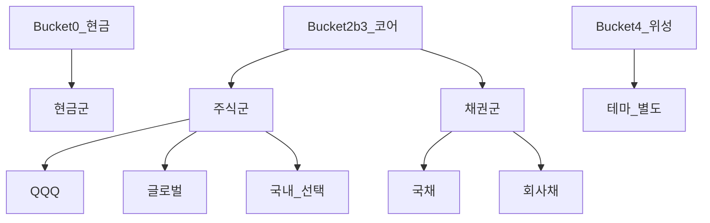
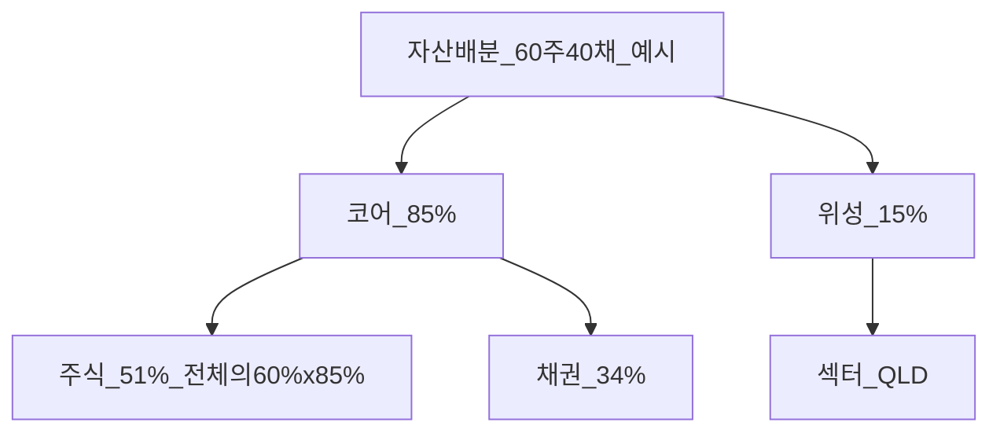

# 자산배분 (Asset Allocation) — 주식·채권·현금·60/40·한국 ISA·DB 완전 가이드

> **면책**: 본 문서는 교육 목적이며, 특정 개인·법인에 대한 투자·세무·법률 자문이 아닙니다. 제도·세율·상품 조건은 변경될 수 있으므로 실행 전 공식 출처를 확인하세요.

## 메타

| 항목 | 내용 |
|------|------|
| 최종 검증일 | 2026-05-24 |
| 정책·법령 기준일 | 2025-12-31 확정, 2026 ISA 확대안 별도 |
| 난이도 | L3 (Deep) — [READER-GUIDE](../docs/READER-GUIDE.md) |
| 예상 읽기 시간 | 55~70분 |
| 관련 bucket | Bucket 3 (코어 자산배분), Bucket 2b (ISA·IRP 적립) |

## 0. 이 편 읽기 전 (5분)

| 항목 | 내용 |
|------|------|
| **난이도** | L3 (Deep) — [READER-GUIDE §L등급](../docs/READER-GUIDE.md) |
| **선수** | [time-horizon-and-buckets](time-horizon-and-buckets.md), [core-satellite-framework](core-satellite-framework.md) |
| **이번 편에서 쓰는 기호** | 본문 §4·§4a 표 참고 |
| **복습 한 줄** | — |

## TL;DR

1. **자산배분**은 주식·채권·현금 등 **자산군 간 목표 비중**을 정하는 것으로, 장기 포트폴리오 **변동성·수익 경로**에 가장 큰 영향을 줍니다(교육 요지).
2. **60/40**(주식 60%·채권 40%)은 **교육용 예시**이며, 개인 **기간·위험 허용·소득 안정성**에 따라 조정합니다 — “정답 비율”은 없습니다.
3. **QQQ**는 주식 **한 종목(ETF)** 이지 자산배분 전체가 아닙니다. 코어는 QQQ + **글로벌 + 채권 + 현금**으로 **3층** 설계합니다.
4. **DB 재직** 가입자는 회사 DB에 배분을 넣을 수 **없으므로**, **ISA·IRP(Bucket 2b~3)** 에서 60/40 등을 실행합니다.
5. Bucket **0~2** 를 채운 **후** Bucket 3 배분을 확정하고, [rebalancing-and-dca.md](rebalancing-and-dca.md)로 유지합니다.

---

## 1. 한 줄 정의 + 왜 중요한가

**정의**: **자산배분(Asset Allocation)** 이란 투자 가능 자산을 **주식·채권·현금**(및 부동산·원자재 등) **자산군**으로 나누고, 각 군의 **목표 비중**과 **허용 편차(밴드)** 를 정해 장기 목표에 맞는 **위험·수익 프로필**을 만드는 과정입니다.

!!! info "Bucket"
    시간·목적별 **자금 슬롯**(0 비상금 → 3 코어 등)

**왜 중요한가**: 개별 종목을 고르는 것보다 **“얼마나 주식을 들고 있을 것인가”** 가 수면의 질·강제 매도 확률·10년 후 자산 규모에 더 큰 영향을 줍니다. [time-horizon-and-buckets.md](time-horizon-and-buckets.md)로 **어느 통에** 넣을지 정한 뒤, Bucket 3 **안에서** 주식 70% vs 40%를 정하는 단계입니다. **DB 가입자**는 “회사 퇴직연금 = 내 60/40”이 **아님** — [db-pension.md](../06-korea-policy/db-pension.md).

---

## 2. 선수 지식 / 이후 읽을 것

**선수**:
- [time-horizon-and-buckets.md](time-horizon-and-buckets.md)
- [core-satellite-framework.md](core-satellite-framework.md) — 코어 80% 내부
- [macroeconomics-basics.md](../02-economics/macroeconomics-basics.md) — 금리·인플레
- [bonds-fixed-income.md](../03-markets/bonds-fixed-income.md) — 채권 역할

**이후**:
- [rebalancing-and-dca.md](rebalancing-and-dca.md)
- [geographic-diversification.md](geographic-diversification.md) — 주식 **내부** 지역
- [capm-and-risk-return.md](../08-advanced/capm-and-risk-return.md)

---

## 3. 직관·비유

**세 가지 음식** 비유: **주식=단백질**, **채권=탄수화물**, **현금=수분**. 단백질만(주식 100%) 먹으면 **체중(변동성)** 이 급격히 오르락내리락합니다. 다이어트(은퇴 목표)는 **비율**이 핵심입니다.

**60/40**은 “균형 식단 **예시**”일 뿐, 마라톤 선수(20대·고위험)와 회복기 환자(5년 내 지출)는 **다른 plate**를 씁니다.

**QQQ만 100%**는 “닭가슴살만 3kg” — **미국 대형 성장** 단백질에 과잉. [geographic-diversification.md](geographic-diversification.md)로 **다른 단백질원(글로벌)** 과 **채권**을 섞습니다.

**DB vs ISA**: 회사 구내식당(DB) 메뉴는 내가 정하지 못합니다. **집 식단(ISA 60/40)** 을 내가 짭니다.

---

## 4. 정식 개념·용어

| 용어 | 한글 | English | 정의 |
|------|------|---------|------|
| 자산배분 | — | Asset allocation | 자산군 간 목표 비중 |
| 전략적 배분 | — | Strategic AA | 장기 목표 비중 |
| 전술적 배분 | — | Tactical AA | 단기 조정(신중) |
| 60/40 | — | Sixty-forty | 주식 60%·채권 40% 예시 |
| 상관관계 | — | Correlation | 자산 간 동반 움직임 |
| 리스크 버짓 | — | Risk budget | 감내 변동성 한도 |
| 드리프트 | — | Drift | 목표 대비 실제 비중 이탈 |

### 4a. 핵심 용어 (본문 등장 순)

> 복습용. 정의는 §4 본표·[glossary](../00-roadmap/glossary.md)·본문 `!!! info` 박스.

| 용어 | 한 줄 | 관련 이론 | glossary |
|------|-------|-----------|----------|
| 자산배분 | 자산군 간 목표 비중 | §4 | [glossary](../00-roadmap/glossary.md#자산배분) |
| 전략적 배분 | 장기 목표 비중 | §4 | [glossary](../00-roadmap/glossary.md#전략적-배분) |
| 전술적 배분 | 단기 조정 | §4 | [glossary](../00-roadmap/glossary.md#전술적-배분) |
| 60/40 | 주식 60%·채권 40% 예시 | §4 | [glossary](../00-roadmap/glossary.md#60/40) |
| 상관관계 | 자산 간 동반 움직임 | §4 | [glossary](../00-roadmap/glossary.md#상관관계) |
| 리스크 버짓 | 감내 변동성 한도 | §4 | [glossary](../00-roadmap/glossary.md#리스크-버짓) |
| 드리프트 | 목표 대비 실제 비중 이탈 | §4 | [glossary](../00-roadmap/glossary.md#드리프트) |

---

## 5. 메커니즘

### 5.1 Bucket → 자산군 흐름

### 5.2 60/40과 코어-위성 결합

### 5.3 프로필별 예 (교육용, 권장 아님)

| 프로필 | 주식 | 채권 | 현금 | 기간 |
|--------|------|------|------|------|
| 공격 | 80 | 15 | 5 | 20년+ |
| **60/40** | **60** | **35** | **5** | 10~20년 |
| 균형 | 50 | 45 | 5 | 7~15년 |
| 보수 | 40 | 50 | 10 | 3~7년 |

### 5.4 주식군 내부 3층 (교육용)

Bucket 3 **주식군**만 다시 쪼개면 **지역·스타일·섹터** 3층입니다. **1층 지역**: QQQ(미국 성장) + 글로벌 ETF + (선택) KODEX 200 — [geographic-diversification.md](geographic-diversification.md). **2층 스타일**: 성장(QQQ) vs 가치(SCHD 래핑 등) — [factor-investing-primer.md](../08-advanced/factor-investing-primer.md). **3층 섹터**: 반도체·배터리 **소수**는 **위성**으로 — [core-satellite-framework.md](core-satellite-framework.md). **60/40**은 **주식 vs 채권** 1차 분할이고, 주식 60% **안에서** QQQ 25% + 글로벌 20% + (위성 제외) 국내 15%처럼 2차 분할합니다.

### 5.5 인생 이벤트와 배분 조정

| 이벤트 | 배분 함의 (교육용) |
|--------|-------------------|
| 첫 직장·Bucket 0 완료 | 70/30 또는 60/40 **공격** 가능 |
| 전세·결혼 3년 내 | **단기 자금** 분리 — 주식 비중 **해당 금액 제외** |
| 자녀 출생 | Bucket 0 **6개월** 재점검 |
| 은퇴 5년 전 | 주식 **점진적 ↓** ( glide path ) |
| DB 퇴직금 IRP 이전 | **한 번에** 100% 주식 **비권장** — [db-pension.md](../06-korea-policy/db-pension.md) |

### 5.7 DB·ISA 이중 구조에서의 “전체 배분”

DB 추계 퇴직금을 **정성적**으로 “채권에 가깝다(확정에 가까움)” vs “주식에 가깝다(운용 불투명)”로 나누는 논의가 있습니다. 교육 프레임에서는 **단순화**: DB는 **별도 슬롯(2a)** 으로 두고, **본인이 조정 가능한 ISA·IRP**에서만 60/40을 **실행**합니다. DB+ISA **합산** 배분을 스프레드시트에 넣을 때는 **DB를 ‘주식 0% 직접통제’** 로 표기해 **과잉 주식** 착각을 막습니다.

---

## 6. 수식·모델

**2자산 포트 변동성** (단순):

| 기호 | 이름 | 이 식에서 의미 |
|       ------       | ------ | ------이(가) 이 식에서 맡는 역할(§4·본문 참고) |
|             \(sigma\)             | sigma | sigma이(가) 이 식에서 맡는 역할(§4·본문 참고) |
|   \(p\)   | 포트 규모 | 가상 포트폴리오 규모(만 원) |
|             \(sqrt\)             | sqrt | sqrt이(가) 이 식에서 맡는 역할(§4·본문 참고) |
|             \(w\)             | w | w이(가) 이 식에서 맡는 역할(§4·본문 참고) |
|   \(s\)   | 저축률 | 소득 대비 남는 비율 |
|             \(b\)             | b | b이(가) 이 식에서 맡는 역할(§4·본문 참고) |
|             \(rho\)             | rho | rho이(가) 이 식에서 맡는 역할(§4·본문 참고) |
|             \(sb\)             | sb | sb이(가) 이 식에서 맡는 역할(§4·본문 참고) |
\[
\sigma_p \approx \sqrt{w_s^2 \sigma_s^2 + w_b^2 \sigma_b^2 + 2 w_s w_b \rho_{sb} \sigma_s \sigma_b}
\]

**읽는 법**: **sigma**와 **p**의 관계를 위 식으로 쓴다. 경제·재무 해석은 변수표 「이 식에서 의미」와 [DEPTH-STANDARD](../docs/DEPTH-STANDARD.md) 기호 예제를 맞춘다.
- \(w_s, w_b\): 주식·채권 비중  
- \(\rho_{sb}\): 상관 — 위기 시 **同時 하락** 가능(한계)

**60/40 FV** (가상, 30년, 주식 7%·채권 3% 가정):

| 기호 | 이름 | 이 식에서 의미 |
|       ------       | ------ | ------이(가) 이 식에서 맡는 역할(§4·본문 참고) |
| \(r\) | 할인율·수익률 | 기간당 이자·요구수익률 |
| \(n\) | 기간 | 연·월 등 복리·할인에 쓰는 횟수 |
| \(PV\) | 현재가치 | 오늘 시점으로 환산한 금액 |

\[
r_p \approx 0.6 \times 7\% + 0.4 \times 3\% = 5.4\%
\]

**읽는 법**: **r**와 **n**의 관계를 위 식으로 쓴다. 경제·재무 해석은 변수표 「이 식에서 의미」와 [DEPTH-STANDARD](../docs/DEPTH-STANDARD.md) 기호 예제를 맞춘다.**100−나이** 공식: 참고만 — [capm-and-risk-return.md](../08-advanced/capm-and-risk-return.md).

---

## 7. 한국 적용

### 7.1 2025년 기준 (확정)

| 요소 | 연결 | 배분 함의 |
|------|------|----------------|
| **ISA** | [isa.md](../06-korea-policy/isa.md) | 코어 ETF 보관, 3년 |
| **IRP** | [isa-irp-pension-tax.md](../06-korea-policy/tax/isa-irp-pension-tax.md) | 장기 주식·채권, 과세이연 |
| **DB** | [db-pension.md](../06-korea-policy/db-pension.md) | **개인 배분 불가** |
| **해외 ETF** | QQQ 등 | 주식군 **미국 성장** |
| **국내 주식** | KODEX 200 등 | 주식군 **한국** |
| **섹터** | 배터리+반도체+AI | **상관** — 채권·글로벌로 분산 |

### 7.2 2026년 개편·시행 예정 (해당 시)

| 항목 | 2025 | 2026 (안) |
|------|------|----------------|
| ISA 연 납입 | 2,000만 | 4,000만 |
| ISA 비과세 | 200만 | 500만 |

→ **채권·글로벌·QQQ** 코어 적립 가속 가능. **60/40 목표**는 유지·리밸런싱.

**법·정책 근거**: 소득세법, ISA 시행령 — [investment-tax-overview.md](../06-korea-policy/tax/investment-tax-overview.md). **2026** 시행 여부는 **공식 확인** 필수.

### 7.3 ISA·IRP·DB — 코어 실행 매트릭스 (2025)

| 계좌 | 코어 QQQ | 코어 채권 | 위성 QLD | 비고 |
|------|----------|-----------|----------|------|
| ISA 중개형 | ○ | ○ | △ 소액 | 3년·통산 |
| IRP | ○ | ○ | △ | 과세이연 |
| DC | ○ | ○ | △ | 가입자 운용 |
| DB 재직 | **×** | **×** | **×** | [db-pension.md](../06-korea-policy/db-pension.md) |
| 일반 | ○ | ○ | △ | 해외 **양도세** |

**2026 ISA 확대** 시: 동일 60/40 **목표**에 **납입 속도**만 ↑ — **QLD 코어 금지** 불변.

### 7.4 채권·현금과 60/40 — [bonds-fixed-income.md](../03-markets/bonds-fixed-income.md)

금리 **상승기**: 채권 가격 **하락** — 60/40도 **손실** 가능. **역할**은 **주식 급락 완충**(완벽 아님). **현금 5%**는 Bucket 0과 **별도** — 코어 현금은 **리밸런싱 탄력**용.

---

## 8. 숫자 예제 (가상)

> 모든 인물·금액은 가상입니다.

### 예제 1: 60/40 ISA 코어 (가상 A)

| 자산군 | 목표 비중 | 금액 (순자산 P) | 상품 (가상) |
|--------|----------|----------------|-------------|
| 주식 | 60% | α·P | QQQ + 글로벌 지수 ETF |
| 채권 | 35% | β·P | 국채 ETF |
| 현금 | 5% | γ·P | MMF |

### 예제 2: DB 가입자 B — ISA에서만 60/40

| 슬롯 | 배분 | 비고 |
|------|------|----------------|
| DB (2a) | **본인 조정 불가** | 추계 **M** |
| ISA (2b~3) | 60/40 실행 | 월 80만 DCA |
| 위성 | 전체 포트 **15% 상한** | [core-satellite](core-satellite-framework.md) 참고 |

### 예제 3: 1년 후 드리프트 (가상 C)

| | 목표 | 실제 | 행동 |
|--|------|------|------|
| 주식 | 60% | **72%** (QQQ 급등) | 채권 매수·주식 일부 매도 — [rebalancing-and-dca.md](rebalancing-and-dca.md) |

### 예제 4: AI 엔지니어 D — 인적자본 + 70/25/5 (가상)

| 자산군 | 비중 | 구성 (가상) | 논리 (교육) |
|--------|------|-------------|-------------|
| 주식 | 70% | QQQ·글로벌·국내 ETF | 임금·포트 **tech** 중복 시 글로벌·채권으로 완충 |
| 채권 | 25% | 국채 ETF | 금리·주식 동반 하락 완충 |
| 현금 | 5% | MMF | 리밸런싱 탄력 |

→ [passive-vs-active.md](passive-vs-active.md): **패시브 코어** 유지, 섹터 **위성 10%**. **인적자본(연봉)** 이 tech 업종이면 포트 **QQQ·반도체** **이중 노출** — 글로벌·채권 **비중**으로 **완충**합니다.

---
## 9. FAQ

**Q1. 최적 60/40인가요?**  
**A1.** **교육용 예시**. 기간·수면·소득에 따라 50/50~80/20 조정.

**Q2. 전부 QQQ면 배분 끝?**  
**A2.** **아니오.** 미국 성장 **집중** — 글로벌·채권 추가.

**Q3. DB에 60/40 넣으려면?**  
**A3.** 재직 중 **불가**. ISA·IRP에서 실행.

**Q4. 섹터 ETF는 주식군 100%?**  
**A4.** 주식군 맞으나 **집중** — 위성 또는 소수.

**Q5. 100−나이 공식?**  
**A5.** **참고만** — 직업·부채·Bucket 0 우선.

**Q6. 채권은 왜?**  
**A6.** **변동성 완충**·드로다운 완화 — [bonds-fixed-income.md](../03-markets/bonds-fixed-income.md).

**Q7. ISA에 채권 ETF?**  
**A7.** **가능** — 60/40 **한 계좌** 또는 IRP 분리.

**Q8. 언제 배분 바꾸나?**  
**A8.** **인생 이벤트**(결혼·은퇴 5년 전) 또는 **연 1회** 점검 — 잦은 변경 비권장.

**Q9. 60/40과 80/20 코어-위성?**  
**A9.** **다른 축** — 60/40 **자산군**, 80/20 **코어 vs 위성** — [core-satellite-framework.md](core-satellite-framework.md).

**Q10. 청년도약 후 ISA 60/40?**  
**A10.** Bucket 1 **만기 후** 2b~3 — [youth-leap-account.md](../06-korea-policy/youth-leap-account.md). **2026 ISA 한도** 확대 시 **납입만** ↑, **60/40 원칙** 유지.

### 실행 체크리스트 (교육용)

- [ ] Bucket 0~2 완료 — [time-horizon-and-buckets.md](time-horizon-and-buckets.md)  
- [ ] **60/40** 또는 개인 목표 **문서화** (주식·채권·현금)  
- [ ] 주식군 **내부**: QQQ + 글로벌 + (선택) 국내 — [geographic-diversification.md](geographic-diversification.md)  
- [ ] **위성 20% 상한** — [core-satellite-framework.md](core-satellite-framework.md)  
- [ ] **ISA·IRP** 코어 보관 — DB는 **별도** — [db-pension.md](../06-korea-policy/db-pension.md)  
- [ ] **연 1회** 리밸 — [rebalancing-and-dca.md](rebalancing-and-dca.md)

### 60/40 심화 — glide path (교육)

은퇴 **10년 전**부터 주식 비중을 **매년 1~2%p** 낮추는 **glide path** 는 60/40 **정적** 배분의 변형입니다. 가상: 50세·목표 은퇴 60세 → 현재 65/35, 55세 **63/37**, 60세 **50/50**. **DB 퇴직금 IRP 이전** 시 **일시 100% 주식** 편입 **비권장** — [db-pension.md](../06-korea-policy/db-pension.md) 예제 3. **전세·결혼** 등 **3년 내 지출**은 60/40 **분모에서 제외** — [cash-flow-basics.md](../01-foundations/cash-flow-basics.md).

---

## 10. 함정·리스크·한계

- **수익 좋은 자산만** 추가 → 사실상 100% 주식  
- Bucket 0 **비우고** 주식 100%  
- **DB 착각** 배분  
- 60/40 **숫자만** — 리밸런싱 없음  
- **QQQ=글로벌** 착각  
- 위기 시 채권·주식 **동반 하락** — 배분 **완벽 방패 아님**

---

**Q. 실무에서는?**  
교과서 식·기호를 그대로 적용하기 전에 **수수료·세금·데이터 시점**을 분리한다. 숫자는 [DEPTH-STANDARD](../docs/DEPTH-STANDARD.md)처럼 기호만 먼저 맞추고, 법령·시장 수치는 §8 표·외부 출처로 갱신한다.

## 11. 심화 읽기

- [references/sources.md](../references/sources.md)
- [capm-and-risk-return.md](../08-advanced/capm-and-risk-return.md)
- [real-estate-basics.md](../07-real-estate/real-estate-basics.md) — 부동산 별도 bucket

---

## 12. 스스로 점검 퀴즈

1. 자산배분이란?  
2. DB 가입자가 60/40을 실행하는 계좌는?  
3. QQQ만 100%의 문제는?  
4. 60/40에서 60%는 무엇의 비중?  
5. 드리프트 72% vs 목표 60% 시?

??? note "정답 힌트"

    1. 자산군 간 목표 비중 · 2. ISA·IRP · 3. 미국 성장 집중 · 4. 주식군 · 5. 리밸런싱 — [rebalancing-and-dca.md](rebalancing-and-dca.md)