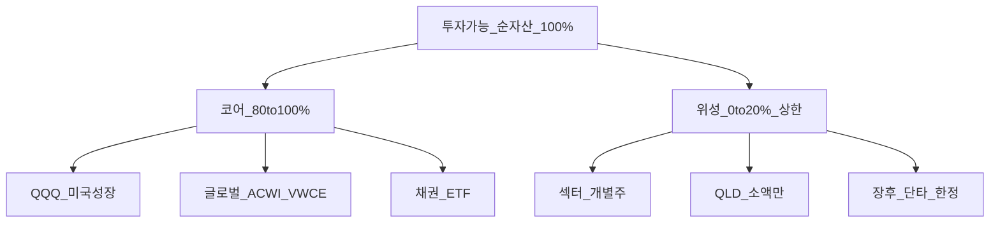
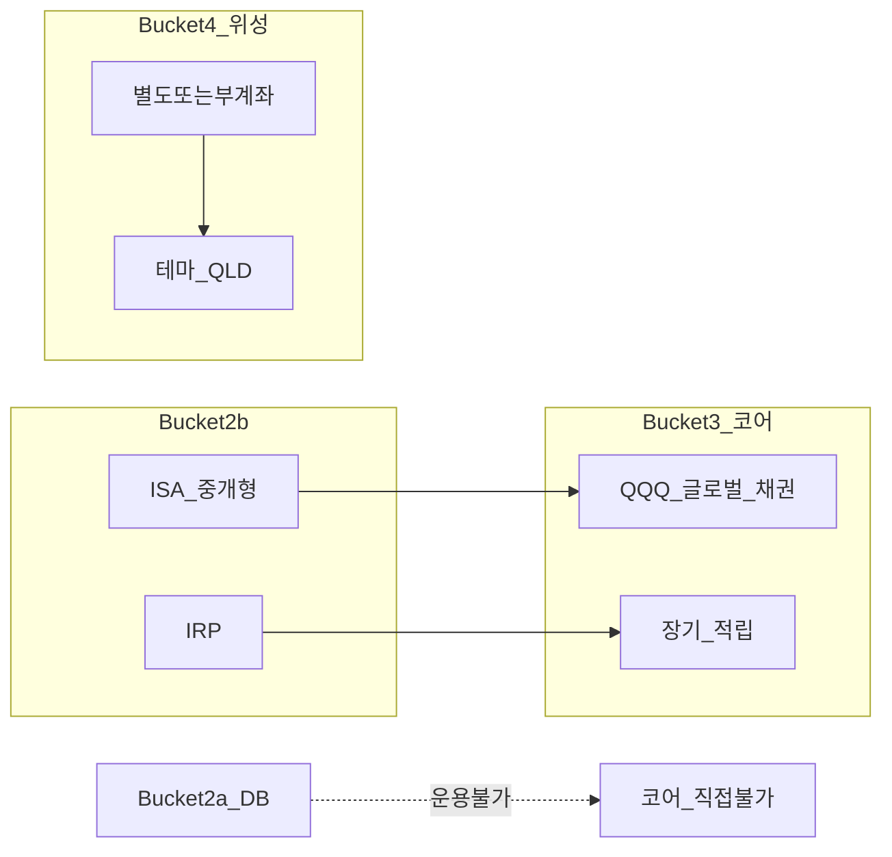

# 코어-위성(Core-Satellite) 프레임워크 — 80/20·QQQ·QLD 배치 완전 가이드

> **면책**: 본 문서는 교육 목적이며, 특정 개인·법인에 대한 투자·세무·법률 자문이 아닙니다. 제도·세율·상품 조건은 변경될 수 있으므로 실행 전 공식 출처를 확인하세요.

## 메타

| 항목 | 내용 |
|------|------|
| 최종 검증일 | 2026-05-24 |
| 정책·법령 기준일 | 2025-12-31 확정, 2026 ISA 확대안 별도 |
| 난이도 | L3 (Deep) — [READER-GUIDE](../docs/READER-GUIDE.md) |
| 예상 읽기 시간 | 55~70분 |
| 관련 bucket | Bucket 3 (코어), Bucket 4 (위성) |

## 0. 이 편 읽기 전 (5분)

| 항목 | 내용 |
|------|------|
| **난이도** | L3 (Deep) — [READER-GUIDE §L등급](../docs/READER-GUIDE.md) |
| **선수** | [time-horizon-and-buckets](time-horizon-and-buckets.md), [etf-index-funds](../03-markets/etf-index-funds.md) |
| **이번 편에서 쓰는 기호** | 본문 §4·§4a 표 참고 |
| **복습 한 줄** | — |

## TL;DR

1. **코어-위성**은 장기 자산의 **80~100%** 를 저비용·분산 **패시브 ETF(코어)** 에 두고, **0~20%** 만 테마·실험·레버리지(**위성**)에 쓰는 구조입니다.
2. **QQQ**(나스닥100)는 **코어 후보**로 적합한 경우가 많으나, **미국 성장·대형 기술 집중**이므로 [geographic-diversification.md](geographic-diversification.md)와 [asset-allocation.md](asset-allocation.md)와 함께 봅니다.
3. **QLD(2x QQQ)** 는 일일 리셋·변동성 drag 때문에 **코어 금지**, 위성에서도 **소액·단기·상한** — [leveraged-etf-qqq-qld.md](leveraged-etf-qqq-qld.md).
4. **DB 재직** 가입자는 코어를 **ISA·IRP(Bucket 2b~3)** 에 두고, DB(2a)는 **모니터링 슬롯**으로 분리합니다.
5. 위성은 **별도 mental account·매매 규칙·손실 한도**를 문서화하지 않으면 코어를 잠식합니다.

---

## 1. 한 줄 정의 + 왜 중요한가

**정의**: **코어-위성(Core-Satellite)** 은 포트폴리오를 **안정적·광범위한 코어(Core)** 와 **제한된 선택·실험 위성(Satellite)** 으로 나누어, 장기 목표 달성력과 **테마 학습·심리적 만족**을 동시에 관리하는 자산배분 패턴입니다.

!!! info "Bucket"
    시간·목적별 **자금 슬롯**(0 비상금 → 3 코어 등)

**왜 중요한가**: “QQQ만 산다”와 “섹터 올인한다” 사이의 **실행 가능한 중간 지점**입니다. [sector-investing-framework.md](../03-markets/sectors/sector-investing-framework.md)로 반도체·배터리·AI를 **공부**하되 **매매는 위성으로 제한**하면, [passive-vs-active.md](passive-vs-active.md) 원칙과 [behavioral](../05-behavioral/README.md) 리스크를 동시에 줄입니다. **QLD를 코어에 넣는 순간** “장기 복리”와 “레버리지 일일 리셋”이 충돌합니다. [time-horizon-and-buckets.md](time-horizon-and-buckets.md)에서 Bucket 3·4를 나눈 **후**, 그 내부 비율을 정하는 문서입니다.

---

## 2. 선수 지식 / 이후 읽을 것

**선수**:
- [time-horizon-and-buckets.md](time-horizon-and-buckets.md) — Bucket 3·4 구분
- [etf-index-funds.md](../03-markets/etf-index-funds.md) — 지수 ETF·보수·추적
- [account-product-tax-map.md](../06-korea-policy/tax/account-product-tax-map.md) — QQQ·QLD 계좌 매핑

**이후**:
- [asset-allocation.md](asset-allocation.md) — 코어 내 주식·채권·현금
- [rebalancing-and-dca.md](rebalancing-and-dca.md) — 80/20 유지
- [leveraged-etf-qqq-qld.md](leveraged-etf-qqq-qld.md) — QLD 위성 규칙
- [sectors/README.md](../03-markets/sectors/README.md) — 위성 테마 공부

---

## 3. 직관·비유

**오케스트라**를 상상하세요. **코어**는 **현악·관현 전체(지수 ETF)** — 공연의 80%를 **악보 대로(규칙)** 연주합니다. 지휘자(본인)는 매주 악기를 바꾸지 않습니다. **위성**은 **솔로(개별주·QLD·코스닥)** — 관객(본인)이 좋아하는 곡 **한 악절**만, **너무 길면(비중 초과)** 전체 조화가 깨집니다.

**80/20**은 “80%는 지루해도 OK, 20%는 내가 공부한 테마”라는 **심리적 계약**입니다. 20%가 40%로 불어나면 **계약 위반** — [rebalancing-and-dca.md](rebalancing-and-dca.md)로 되돌립니다. “수익이 좋아서 더 샀다”는 **가장 흔한 위반 사유**입니다.

**QQQ vs QLD**: QQQ는 **코어용 마라톤화** — 매일 신발(레버리지)을 바꾸지 않습니다. QLD는 **매일 2배 속도로 달리는 트레드밀** — 장기 거리(코어)와 맞지 않습니다. [leveraged-etf-qqq-qld.md](leveraged-etf-qqq-qld.md)에서 일일 리셋을 별도 학습하세요.

**DB 가입자**: 회사 구내식당(DB) 밥은 그대로 두고, **집 냉장고(ISA)에 QQQ**를 사 두는 그림 — [db-pension.md](../06-korea-policy/db-pension.md).

한국 **DB·ISA·2026 개편** 환경에서 포트폴리오 문서는 **실행 순서**가 핵심입니다. 비중 % 논쟁 이전에 **운용 가능 계좌**와 **bucket 채우기**를 확정하고, QQQ·글로벌·채권 **코어**를 [etf-index-funds.md](../03-markets/etf-index-funds.md) 기준 **저비용**으로 유지하세요. 위성·레버리지·단타는 **0~20%**와 **손실 한도**로 격리하고, [references/sources.md](../references/sources.md)로 제도 변경을 **분기 1회** 확인합니다.
---

## 4. 정식 개념·용어

| 용어 | 한글 | English | 정의 |
|------|------|---------|------|
| 코어 | — | Core | 장기·저비용·분산 중심 (Bucket 3) |
| 위성 | — | Satellite | 테마·개별·레버리지, **상한** (Bucket 4) |
| 패시브 코어 | — | Passive core | 지수 추종, 낮은 회전율 |
| QQQ | — | Invesco QQQ | 나스닥100 ETF, 미국 대형 성장 |
| QLD | — | ProShares Ultra QQQ | QQQ **2배** 일일 레버리지 |
| Tracking error | 추적 오차 | — | 벤치마크 대비 편차 |
| Volatility drag | 변동성 drag | — | 레버리지 ETF 장기 괴리 |
| Mental account | 심리적 계좌 | — | 코어·위성 **분리 인식** |

### 4a. 핵심 용어 (본문 등장 순)

> 복습용. 정의는 §4 본표·[glossary](../00-roadmap/glossary.md)·본문 `!!! info` 박스.

| 용어 | 한 줄 | 관련 이론 | glossary |
|------|-------|-----------|----------|
| 코어 | 장기·저비용·분산 중심 | §4 | [glossary](../00-roadmap/glossary.md#코어) |
| 위성 | 테마·개별·레버리지, **상한** | §4 | [glossary](../00-roadmap/glossary.md#위성) |
| 패시브 코어 | 지수 추종, 낮은 회전율 | §4 | [glossary](../00-roadmap/glossary.md#패시브-코어) |
| QQQ | 나스닥100 ETF, 미국 대형 성장 | §4 | [glossary](../00-roadmap/glossary.md#qqq) |
| QLD | QQQ **2배** 일일 레버리지 | §4 | [glossary](../00-roadmap/glossary.md#qld) |
| Tracking error | 벤치마크 대비 편차 | §4 | [glossary](../00-roadmap/glossary.md#tracking-error) |
| Volatility drag | 레버리지 ETF 장기 괴리 | §4 | [glossary](../00-roadmap/glossary.md#volatility-drag) |
| Mental account | 코어·위성 **분리 인식** | §4 | [glossary](../00-roadmap/glossary.md#mental-account) |

---

## 5. 메커니즘

### 5.1 80/20 코어-위성 구조

### 5.2 계좌·Bucket 배치

### 5.3 코어 vs 위성 판별표

| 기준 | 코어 (Bucket 3) | 위성 (Bucket 4) |
|------|-----------------|-----------------|
| 분산 | 광범위 지수 | 소수 종목·테마 |
| 레버리지 | **없음** | QLD 등 **한정** |
| 보유 기간 | 10년+ | 실험·단기 가능 |
| 리밸런싱 | 연 1~2회·밴드 | 손절·상한 규칙 |
| DB 재직 | ISA·IRP | 동일, **소액** |
| 섹터 | 분산 섹터 ETF 가능 | 코스닥 집중·개별 |

### 5.4 코어 구성 예 (교육용, 권장 아님)

| 레이어 | 예시 ETF·역할 | 비고 |
|--------|---------------|------|
| 미국 성장 | QQQ | 나스닥100 |
| 미국 전체 | VOO·SCHD 래핑 | QQQ 보완 |
| 글로벌 | ACWI·VWCE 래핑 | [geographic-diversification.md](geographic-diversification.md) |
| 채권 | 국채·회사채 ETF | [bonds-fixed-income.md](../03-markets/bonds-fixed-income.md) |

### 5.5 코어 ETF 선택 체크리스트 (교육용)

코어에 편입하기 전 **네 가지**를 확인합니다. (1) **추적 지수**가 광범위한가 — 나스닥100(QQQ)은 미국 대형 성장 100종목, ACWI/VWCE 래핑은 전 세계 수천 종목. (2) **TER(총보수)** — 코어는 0.05~0.30%대가 일반적, 1%대 액티브 펀드와 구분. (3) **거래량·스프레드** — 해외 ETF는 [overseas-equities-intro.md](../03-markets/overseas-equities-intro.md) 유의. (4) **계좌** — ISA·IRP 가능 여부, [account-product-tax-map.md](../06-korea-policy/tax/account-product-tax-map.md).

위성 편입 전 **세 가지**: (1) **손실 한도** — 연간 위성 원금의 X% (가상 30%). (2) **보유 기한** — QLD는 **장기 금지**. (3) **코스닥** — [kosdaq-tier-system.md](../03-markets/kosdaq-tier-system.md) 퇴출·유동성 리스크.

### 5.6 패시브 코어와 섹터 위성 연결

[passive-vs-active.md](passive-vs-active.md) 원칙: **공부는 섹터**, **매매는 위성**. [semiconductor.md](../03-markets/sectors/semiconductor.md), [battery-lfp-ncm-ess.md](../03-markets/sectors/battery-lfp-ncm-ess.md), [ai-infrastructure.md](../03-markets/sectors/ai-infrastructure.md)를 읽어도 **코어 QQQ·글로벌은 유지**합니다. 이유: 섹터 사이클 정점에서 **코어 전량 교체**가 가장 흔한 실수이기 때문입니다.

---

## 6. 수식·모델

**목표 비중**:

| 기호 | 이름 | 이 식에서 의미 |
|------|------|----------------|
| \(r\) | 할인율·수익률 | 기간당 이자·요구수익률 |
| \(n\) | 기간 | 연·월 등 복리·할인에 쓰는 횟수 |
| \(PV\) | 현재가치 | 오늘 시점으로 환산한 금액 |
| \(FV\) | 미래가치 | 미래 시점의 목표·결과 금액 |

\[
w_{core} + w_{sat} = 1, \quad 0 \leq w_{sat} \leq 0.20
\]

**읽는 법**: **w_**와 **w_**의 관계를 위 식으로 쓴다. 경제·재무 해석은 변수표 「이 식에서 의미」와 [DEPTH-STANDARD](../docs/DEPTH-STANDARD.md) 기호 예제를 맞춘다.
**위성 초과 시 매도량** (교육용):

| 기호 | 이름 | 이 식에서 의미 |
|------|------|----------------|
| \(r\) | 할인율·수익률 | 기간당 이자·요구수익률 |
| \(n\) | 기간 | 연·월 등 복리·할인에 쓰는 횟수 |
| \(PV\) | 현재가치 | 오늘 시점으로 환산한 금액 |
| \(FV\) | 미래가치 | 미래 시점의 목표·결과 금액 |

\[
\Delta_{sell,sat} = V \times (w_{sat,actual} - w_{sat,target})
\]

**읽는 법**: **lta_**와 **w_**의 관계를 위 식으로 쓴다. 경제·재무 해석은 변수표 「이 식에서 의미」와 [DEPTH-STANDARD](../docs/DEPTH-STANDARD.md) 기호 예제를 맞춘다.**QLD 일일 리셋** (개념): 목표 일일 수익 ≈ \(2 \times r_{QQQ,day}\) — **장기 보유 ≠ 2× QQQ**. 코어 FV 모델에 QLD를 넣지 않습니다.

**코어 FV** (가상):

| 기호 | 이름 | 이 식에서 의미 |
|------|------|----------------|
| \(r\) | 할인율·수익률 | 기간당 이자·요구수익률 |
| \(n\) | 기간 | 연·월 등 복리·할인에 쓰는 횟수 |
| \(PV\) | 현재가치 | 오늘 시점으로 환산한 금액 |
| \(FV\) | 미래가치 | 미래 시점의 목표·결과 금액 |

\[
FV_{core} = PMT \times \frac{(1+r)^n - 1}{r}
\]

**읽는 법**: 매 기간 **PMT**가 **r**로 **n**번 복리·누적되면 **FV**가 된다. 월·연 단위는 **r**·**n** 정의와 맞춘다. [DEPTH-STANDARD](../docs/DEPTH-STANDARD.md) 참고.
위성 손실은 **별도 한도** \(L_{sat}\) (예: 연간 위성 원금의 30%)로 관리.

---

춘다. [DEPTH-STANDARD](../docs/DEPTH-STANDARD.md) 참고.
위성 손실은 **별도 한도** \(L_{sat}\) (예: 연간 위성 원금의 30%)로 관리.

---

## 7. 한국 적용

### 7.1 2025년 기준 (확정)

| 항목 | 코어 | 위성 |
|------|------|----------------|
| 계좌 | ISA·IRP 우선 — [isa-irp-pension-tax.md](../06-korea-policy/tax/isa-irp-pension-tax.md) | ISA·일반 (분리 권장) |
| QQQ | **코어 적합** | — |
| QLD | **코어 금지** | Bucket 4 — [leveraged-etf](leveraged-etf-qqq-qld.md) |
| 국내 섹터 ETF | 분산·저비용이면 코어 | 코스닥 집중은 위성 — [kosdaq-tier-system.md](../03-markets/kosdaq-tier-system.md) |
| DB | 직접 코어 **불가** | — |

### 7.2 2026년 개편·시행 예정 (해당 시)

| 항목 | 2025 | 2026 (안·보도) |
|------|------|----------------|
| ISA 연 납입 | 2,000만 | 4,000만 (확대안) |
| ISA 비과세 | 200만 | 500만 (확대안) |

→ 코어 ISA **적립 가속** 가능. **80/20 원칙**과 위성 **상한**은 유지.

**법·정책 근거**: ISA 시행령, 소득세법 — [account-product-tax-map.md](../06-korea-policy/tax/account-product-tax-map.md)

---

## 8. 숫자 예제 (가상)

> 모든 인물·금액은 가상입니다.

### 예제 1: 순자산 **F**, 85/15 (가상 A)

| 구분 | 금액 | 구성 (전체 포트 대비) |
|------|------|----------------|
| 코어 85% | **M** | QQQ 35% + 글로벌 30% + 채권 20% |
| 위성 15% | 1,500만 | 반도체 2종 800만 + QLD **300만 한도** + NXT 단타 400만 |

→ QLD는 **위성 내에서도 소액**.

### 예제 2: QLD 코어 편입 시도 → 교정 (가상 B)

| 시나리오 | 3년 결과 (가상) | 교훈 |
|----------|-----------------|------|
| 코어 50% QLD | QQQ 대비 **변동성 drag**로 기대 이탈 | **코어에서 QLD 제거** |
| 코어 100% QQQ | 미국 집중 | 글로벌 20% **추가** |
| 위성 QLD 5% | 손실 감수 범위 내 | **상한·손절 규칙** 유지 |

### 예제 3: DB + ISA 코어 (가상 C)

| 슬롯 | 역할 | 월 적립 (가상) |
|------|------|----------------|
| DB (2a) | 추계 퇴직금 **M** (10년) | 회사 부담 |
| ISA (2b~3) | QQQ 50% + 채권 35% 코어 | 120만 |
| 위성 | 코스닥 1종 | **20만 상한** |

→ DB는 **모니터링만**, 코어 성장은 ISA.

---
## 9. FAQ

**Q1. 코어에 QLD 넣으면 수익 2배 아닌가요?**  
**A1.** **아닙니다.** 일일 리셋·변동성 drag·경로 의존 — **코어 부적합**. [leveraged-etf-qqq-qld.md](leveraged-etf-qqq-qld.md).

**Q2. 80/20이 정답인가요?**  
**A2.** **교육용 기본**. 90/10~70/30 조정 가능. **위성 상한 20%** 는 지킵니다.

**Q3. 섹터 ETF는 코어인가요?**  
**A3.** **분산·저비용·광범위**면 코어. **반도체·2차전지만**이면 위성 — [sector-investing-framework.md](../03-markets/sectors/sector-investing-framework.md).

**Q4. QQQ만 100% 코어도 되나요?**  
**A4.** 가능은 하나 **미국·성장 집중** — [geographic-diversification.md](geographic-diversification.md), [asset-allocation.md](asset-allocation.md).

**Q5. 위성 계좌를 꼭 나눠야 하나요?**  
**A5.** 필수 아님. **스프레드시트·별칭**으로 분리 — [fomo-and-trading-hours.md](../05-behavioral/fomo-and-trading-hours.md).

**Q6. DB 퇴직금은 코어인가요?**  
**A6.** IRP 이전 후 **본인이 ETF로 전환**할 때 코어. 재직 중은 **2a**.

**Q7. 코어를 액티브로 운용해도 되나요?**  
**A7.** 교육 프레임은 **패시브 코어** — [passive-vs-active.md](passive-vs-active.md).

**Q8. 위성 20% 초과하면?**  
**A8.** **리밸런싱** — 위성 매도 또는 코어 추가 납입.

**Q9. 코어에 국내 섹터 ETF(2차전지)만 넣으면?**  
**A9.** **위성 성격** — [sector-investing-framework.md](../03-markets/sectors/sector-investing-framework.md).

**Q10. IRP와 ISA에 코어를 나누면?**  
**A10.** **가능** — [isa-irp-pension-tax.md](../06-korea-policy/tax/isa-irp-pension-tax.md).

### 실행 체크리스트 (교육용)

- [ ] Bucket 0~2 [time-horizon-and-buckets.md](time-horizon-and-buckets.md)  
- [ ] 코어 80/20 [core-satellite-framework.md](core-satellite-framework.md) — **QLD 코어 금지**  
- [ ] 60/40 또는 개인 목표 [asset-allocation.md](asset-allocation.md)  
- [ ] QQQ+글로벌 [geographic-diversification.md](geographic-diversification.md)  
- [ ] DCA·밴드 [rebalancing-and-dca.md](rebalancing-and-dca.md)  
- [ ] 패시브 코어 [passive-vs-active.md](passive-vs-active.md)  
- [ ] DB → ISA [db-pension.md](../06-korea-policy/db-pension.md)

---

## 10. 함정·리스크·한계

- **수익 좋은 위성** → 비중 확대 → 코어 잠식  
- **QLD 코어** 착각 — 장기 목표 수치 왜곡  
- **섹터 뉴스**에 코어 전량 교체  
- DB **착각 운용** — ISA 미설계  
- 80/20 **숫자만** 있고 **리밸런싱·손실 한도** 없음  
- 코어·위성 **같은 앱 탭** — FOMO 시 구분 실패

---

**Q. 실무에서는?**  
교과서 식·기호를 그대로 적용하기 전에 **수수료·세금·데이터 시점**을 분리한다. 숫자는 [DEPTH-STANDARD](../docs/DEPTH-STANDARD.md)처럼 기호만 먼저 맞추고, 법령·시장 수치는 §8 표·외부 출처로 갱신한다.

## 11. 심화 읽기

- [references/sources.md](../references/sources.md)
- [capm-and-risk-return.md](../08-advanced/capm-and-risk-return.md)
- [semiconductor.md](../03-markets/sectors/semiconductor.md)
- [factor-investing-primer.md](../08-advanced/factor-investing-primer.md)

---

## 12. 스스로 점검 퀴즈

1. QLD는 코어에 넣어도 되는가?  
2. 80/20에서 20%는 어느 bucket?  
3. DB 재직 중 QQQ 코어 슬롯은?  
4. 섹터 ETF가 코어가 되려면?  
5. 위성 초과 시 행동은?

??? note "정답 힌트"

    1. 아니오(코어 금지) · 2. Bucket 4 (위성) · 3. ISA·IRP · 4. 분산·저비용·광범위 · 5. 리밸런싱