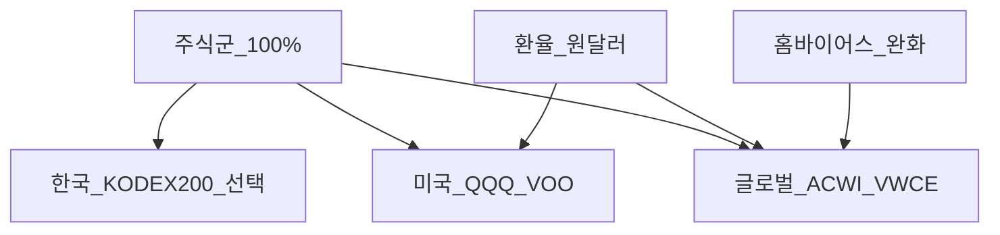
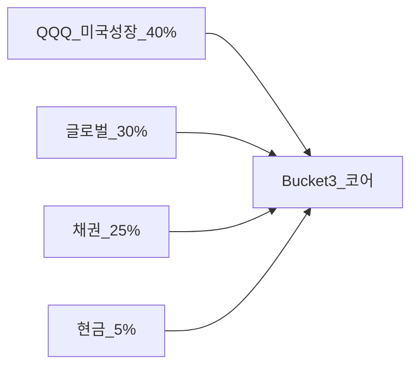

# 지역·통화 분산 — 홈 바이어스·QQQ vs 글로벌·환헷지 완전 가이드

> **면책**: 본 문서는 교육 목적이며, 특정 개인·법인에 대한 투자·세무·법률 자문이 아닙니다. 제도·세율·상품 조건은 변경될 수 있으므로 실행 전 공식 출처를 확인하세요.

## 메타

| 항목 | 내용 |
|------|------|
| 최종 검증일 | 2026-05-24 |
| 정책·법령 기준일 | 2025-12-31 확정, 2026 ISA 확대안 별도 |
| 난이도 | L3 (Deep) — [READER-GUIDE](../docs/READER-GUIDE.md) |
| 예상 읽기 시간 | 55~70분 |
| 관련 bucket | Bucket 3 (코어 지역·통화 노출) |

## 0. 이 편 읽기 전 (5분)

| 항목 | 내용 |
|------|------|
| **난이도** | L3 (Deep) — [READER-GUIDE §L등급](../docs/READER-GUIDE.md) |
| **선수** | [etf-index-funds](../03-markets/etf-index-funds.md), [asset-allocation](asset-allocation.md) |
| **이번 편에서 쓰는 기호** | 본문 §4·§4a 표 참고 |
| **복습 한 줄** | — |

## TL;DR

1. **지역 분산**은 한국·미국·선진·신흥 등 **국가·지역** 노출을 나누고, **통화 분산**은 원화·달러·기타 **환율** 노출을 인식하는 것입니다.
2. **홈 바이어스(Home bias)** — 한국 거주자가 **코스피·원화 자산만** 쏠리는 경향 — **QQQ + 글로벌 ETF**로 완화합니다.
3. **QQQ**는 **미국 나스닥100·대형 성장** 집중이지 “글로벌”이 **아닙니다**. 코어는 QQQ + **ACWI/VWCE 래핑** + (선택) 국내.
4. **환헷지 ETF** vs **언헷지** — 장기 **논쟁**; **환율 예측**보다 **의도적 노출 선택**과 **비용** 비교.
5. **DB 가입자** 해외 노출은 **ISA·IRP** — [overseas-equities-intro.md](../03-markets/overseas-equities-intro.md), [asset-allocation.md](asset-allocation.md).

---

## 1. 한 줄 정의 + 왜 중요한가

**정의**: **지역·통화 분산(Geographic & Currency Diversification)** 은 포트폴리오 수익과 위험이 **단일 국가·단일 통화**에 과도하게 묶이지 않도록, **여러 지역 주식·채권**과 **환율 노출**을 의도적으로 배치하는 설계입니다.

**왜 중요한가**: 한국 거주·원화 소득·국내 부동산(있다면)만으로도 **한국·원화 베팅**이 큽니다. **QQQ 100%**는 추가로 **미국·달러·대형 기술**에 올인합니다. [geographic-diversification.md](geographic-diversification.md)는 [asset-allocation.md](asset-allocation.md) **주식군 내부** 레이어입니다. **섹터**(반도체·배터리)는 한·미 **중복** 가능 — [sector-investing-framework.md](../03-markets/sectors/sector-investing-framework.md).

---

## 2. 선수 지식 / 이후 읽을 것

**선수**:
- [etf-index-funds.md](../03-markets/etf-index-funds.md)
- [asset-allocation.md](asset-allocation.md)
- [macroeconomics-basics.md](../02-economics/macroeconomics-basics.md)

**이후**:
- [overseas-equities-intro.md](../03-markets/overseas-equities-intro.md)
- [overseas-stocks-tax-part1-cgt.md](../06-korea-policy/tax/overseas-stocks-tax-part1-cgt.md)
- [core-satellite-framework.md](core-satellite-framework.md)

---

## 3. 직관·비유

**한 바구니 계란** — **한국(KODEX 200)** 바구니만 들면 **AI·금리·환율**이 한국에만 쏠립니다. **미국(QQQ)** 바구니 추가, **세계(ACWI)** 바구니 추가.

**QQQ vs 글로벌**: QQQ는 **실리콘밸리 대형 tech** 바구니. 글로벌은 **전 세계 슈퍼마켓** — 유럽·일본·신흥 포함.

**환율**: 해외 ETF **원화 환산** 수익 = **현지 주가** + **달러/원**. 원화 **약세**면 달러 자산 **원화 ↑** (단순). **환율 맞히기**는 **불가**에 가깝 — **분산**이 답.

**환헷지**: **환율 보험**을 든 ETF — 보험료(**비용**). **언헷지**: 환율 **그대로** 노출.

한국 **DB·ISA·2026 개편** 환경에서 포트폴리오 문서는 **실행 순서**가 핵심입니다. 비중 % 논쟁 이전에 **운용 가능 계좌**와 **bucket 채우기**를 확정하고, QQQ·글로벌·채권 **코어**를 [etf-index-funds.md](../03-markets/etf-index-funds.md) 기준 **저비용**으로 유지하세요. 위성·레버리지·단타는 **0~20%**와 **손실 한도**로 격리하고, [references/sources.md](../references/sources.md)로 제도 변경을 **분기 1회** 확인합니다.

한국 **DB·ISA·2026 개편** 환경에서 포트폴리오 문서는 **실행 순서**가 핵심입니다. 비중 % 논쟁 이전에 **운용 가능 계좌**와 **bucket 채우기**를 확정하고, QQQ·글로벌·채권 **코어**를 [etf-index-funds.md](../03-markets/etf-index-funds.md) 기준 **저비용**으로 유지하세요. 위성·레버리지·단타는 **0~20%**와 **손실 한도**로 격리하고, [references/sources.md](../references/sources.md)로 제도 변경을 **분기 1회** 확인합니다.

한국 **DB·ISA·2026 개편** 환경에서 포트폴리오 문서는 **실행 순서**가 핵심입니다. 비중 % 논쟁 이전에 **운용 가능 계좌**와 **bucket 채우기**를 확정하고, QQQ·글로벌·채권 **코어**를 [etf-index-funds.md](../03-markets/etf-index-funds.md) 기준 **저비용**으로 유지하세요. 위성·레버리지·단타는 **0~20%**와 **손실 한도**로 격리하고, [references/sources.md](../references/sources.md)로 제도 변경을 **분기 1회** 확인합니다.

한국 **DB·ISA·2026 개편** 환경에서 포트폴리오 문서는 **실행 순서**가 핵심입니다. 비중 % 논쟁 이전에 **운용 가능 계좌**와 **bucket 채우기**를 확정하고, QQQ·글로벌·채권 **코어**를 [etf-index-funds.md](../03-markets/etf-index-funds.md) 기준 **저비용**으로 유지하세요. 위성·레버리지·단타는 **0~20%**와 **손실 한도**로 격리하고, [references/sources.md](../references/sources.md)로 제도 변경을 **분기 1회** 확인합니다.

한국 **DB·ISA·2026 개편** 환경에서 포트폴리오 문서는 **실행 순서**가 핵심입니다. 비중 % 논쟁 이전에 **운용 가능 계좌**와 **bucket 채우기**를 확정하고, QQQ·글로벌·채권 **코어**를 [etf-index-funds.md](../03-markets/etf-index-funds.md) 기준 **저비용**으로 유지하세요. 위성·레버리지·단타는 **0~20%**와 **손실 한도**로 격리하고, [references/sources.md](../references/sources.md)로 제도 변경을 **분기 1회** 확인합니다.

한국 **DB·ISA·2026 개편** 환경에서 포트폴리오 문서는 **실행 순서**가 핵심입니다. 비중 % 논쟁 이전에 **운용 가능 계좌**와 **bucket 채우기**를 확정하고, QQQ·글로벌·채권 **코어**를 [etf-index-funds.md](../03-markets/etf-index-funds.md) 기준 **저비용**으로 유지하세요. 위성·레버리지·단타는 **0~20%**와 **손실 한도**로 격리하고, [references/sources.md](../references/sources.md)로 제도 변경을 **분기 1회** 확인합니다.

한국 **DB·ISA·2026 개편** 환경에서 포트폴리오 문서는 **실행 순서**가 핵심입니다. 비중 % 논쟁 이전에 **운용 가능 계좌**와 **bucket 채우기**를 확정하고, QQQ·글로벌·채권 **코어**를 [etf-index-funds.md](../03-markets/etf-index-funds.md) 기준 **저비용**으로 유지하세요. 위성·레버리지·단타는 **0~20%**와 **손실 한도**로 격리하고, [references/sources.md](../references/sources.md)로 제도 변경을 **분기 1회** 확인합니다.

한국 **DB·ISA·2026 개편** 환경에서 포트폴리오 문서는 **실행 순서**가 핵심입니다. 비중 % 논쟁 이전에 **운용 가능 계좌**와 **bucket 채우기**를 확정하고, QQQ·글로벌·채권 **코어**를 [etf-index-funds.md](../03-markets/etf-index-funds.md) 기준 **저비용**으로 유지하세요. 위성·레버리지·단타는 **0~20%**와 **손실 한도**로 격리하고, [references/sources.md](../references/sources.md)로 제도 변경을 **분기 1회** 확인합니다.
---

## 4. 정식 개념·용어

| 용어 | 한글 | English | 정의 |
|------|------|---------|------|
| 홈 바이어스 | — | Home bias | 본국 자산 과다 |
| QQQ | — | Invesco QQQ | 나스닥100, **미국** |
| 글로벌 ETF | — | Global ETF | ACWI, FTSE AW 등 |
| 환헷지 | — | FX hedged | 환율 리스크 헷지 시도 |
| 언헷지 | — | Unhedged | 환 노출 유지 |
| DM / EM | 선진 / 신흥 | Developed / Emerging | 지역 분류 |
| 통화 노출 | — | Currency exposure | 원화·달러 등 |

### 4a. 핵심 용어 (본문 등장 순)

> 복습용. 정의는 §4 본표·[glossary](../00-roadmap/glossary.md)·본문 `!!! info` 박스.

| 용어 | 한 줄 | 관련 이론 | glossary |
|------|-------|-----------|----------|
| 홈 바이어스 | 본국 자산 과다 | §4 | [glossary](../00-roadmap/glossary.md#홈-바이어스) |
| QQQ | 나스닥100, **미국** | §4 | [glossary](../00-roadmap/glossary.md#qqq) |
| 글로벌 ETF | ACWI, FTSE AW 등 | §4 | [glossary](../00-roadmap/glossary.md#글로벌-etf) |
| 환헷지 | 환율 리스크 헷지 시도 | §4 | [glossary](../00-roadmap/glossary.md#환헷지) |
| 언헷지 | 환 노출 유지 | §4 | [glossary](../00-roadmap/glossary.md#언헷지) |
| DM / EM | 지역 분류 | §4 | [glossary](../00-roadmap/glossary.md#dm-/-em) |
| 통화 노출 | 원화·달러 등 | §4 | [glossary](../00-roadmap/glossary.md#통화-노출) |

---

## 5. 메커니즘

### 5.1 지역 레이어

### 5.2 QQQ vs 글로벌 — 코어 내 역할

### 5.3 환헷지 vs 언헷지 (교육용)

| | 환헷지 ETF | 언헷지 ETF |
|--|------------|------------|
| 환율 | 영향 **↓** | **그대로** |
| 비용 | **↑** | 상대적 ↓ |
| 장기 | 논쟁 | QQQ 직접·국내 래핑 |
| 적합 | 변동성 ↓ 원할 때 | 달러 **의도** 노출 |

### 5.4 한국 거주자 “숨은 홈 바이어스” 체크리스트

| 노출 | 이미 있는 베팅 | 코어에서 보완 |
|------|----------------|---------------|
| **원화 소득** | 원화 | 달러 **언헷지** 해외 ETF |
| **국내 부동산** | 한국 | 글로벌 **주식** |
| **DB 퇴직금** | 국내 운용 | ISA **QQQ+글로벌** |
| **코스피 개별** | 한국 | QQQ **중복 tech** 주의 |
| **직장 스톡옵션** | (해당 시) | **미국 tech** 과잉 |

### 5.5 QQQ + 글로벌 비율 예 (교육용, 권장 아님)

**주식군 60%** 가정, **전체 포트** 기준 (가상):

| 구성 | 전체 대비 | 역할 |
|------|-----------|------|
| QQQ | 24% (주식의 40%) | 미국 **성장** |
| VWCE/ACWI 래핑 | 21% (주식의 35%) | **지역** 분산 |
| KODEX 200 | 9% (주식의 15%) | **홈** (선택) |
| 기타/위성 | 6% | Bucket 4 |

→ QQQ **단독 60%** 와 **완전히 다른** 리스크 프로필.

### 5.6 환헷지 심화 — 언제 고려하나 (교육)

**환헷지 ETF** (국내 상장 미국 지수 환헷지): (1) **달러 노출을 원치 않음** — 그러나 장기 **실질** 수익에서 환 기여를 **포기**할 수 있음. (2) **변동성 ↓** 체감 — 비용 **0.1~0.3%p** 추가 가능. (3) **QQQ 직접** vs **환헷지 래핑** — “같은 미국”이 **아님**; [etf-index-funds.md](../03-markets/etf-index-funds.md) 상품 설명서 **필수**.

**실무**: 코어 **혼합** — QQQ(언헷지) + 글로벌(혼합) + 채권(원화)으로 **간접** 분산. **환율 선물** 직접 매매는 **Bucket 4**도 **비권장**.

### 5.7 거시와 지역 — [macroeconomics-basics.md](../02-economics/macroeconomics-basics.md)

금리·달러 강세·한국 수출 — **QQQ(미국)** vs **KODEX(한국)** **상대** 수익에 영향. **예측**보다 **둘 다 보유**가 교육 프레임. **2025~2026** 금리 경로는 [references/sources.md](../references/sources.md) — 배분 **자주** 바꾸지 않음.

---

## 6. 수식·모델

**해외 수익(원화, 단순)**:

| 기호 | 이름 | 이 식에서 의미 |
|    ------    | ------ | 위 식의 ------ |
| \(r\) | 할인율·수익률 | 기간당 이자·요구수익률 |
| \(n\) | 기간 | 연·월 등 복리·할인에 쓰는 횟수 |
| \(PV\) | 현재가치 | 오늘 시점으로 환산한 금액 |
| \(FV\) | 미래가치 | 미래 시점의 목표·결과 금액 |

\[
R_{KRW} \approx R_{local} + R_{FX}
\]

**읽는 법**: **R**와 **KRW**의 관계를 위 식으로 쓴다. 경제·재무 해석은 변수표 「이 식에서 의미」와 [DEPTH-STANDARD](../docs/DEPTH-STANDARD.md) 기호 예제를 맞춘다.
**2지역 주식 (가상)**:

| 기호 | 이름 | 이 식에서 의미 |
|    ------    | ------ | 위 식의 ------ |
| \(r\) | 할인율·수익률 | 기간당 이자·요구수익률 |
| \(n\) | 기간 | 연·월 등 복리·할인에 쓰는 횟수 |
| \(PV\) | 현재가치 | 오늘 시점으로 환산한 금액 |
| \(FV\) | 미래가치 | 미래 시점의 목표·결과 금액 |

\[
R_p = w_{US} R_{US} + w_{GL} R_{GL} + \text{상관항}
\]

**읽는 법**: **R_p**와 **w_**의 관계를 위 식으로 쓴다. 경제·재무 해석은 변수표 「이 식에서 의미」와 [DEPTH-STANDARD](../docs/DEPTH-STANDARD.md) 기호 예제를 맞춘다.**해당 없음**: 레버리지 환 — [leveraged-etf-qqq-qld.md](leveraged-etf-qqq-qld.md).

---

역할(§4·본문 참고) |
|    ------    | ------ | 위 식의 ------ |
\[
R_p = w_{US} R_{US} + w_{GL} R_{GL} + \text{상관항}
\]

**읽는 법**: **R_p**와 **w_**의 관계를 위 식으로 쓴다. 경제·재무 해석은 변수표 「이 식에서 의미」와 [DEPTH-STANDARD](../docs/DEPTH-STANDARD.md) 기호 예제를 맞춘다.**해당 없음**: 레버리지 환 — [leveraged-etf-qqq-qld.md](leveraged-etf-qqq-qld.md).

---

## 7. 한국 적용

### 7.1 2025년 기준 (확정)

| 선택 | 특징 | Bucket |
|    ------    | ------ | 위 식의 ------ |
| **QQQ 직접** | 미국 성장·**달러** | 3 — ISA·IRP |
| **국내 미국 ETF 환헷지** | 환 **↓** | 3 |
| **국내 미국 ETF 언헷지** | QQQ **유사** | 3 |
| **KODEX 200** | **한국** | 3 (홈 추가) |
| **DB** | 개인 **해외 선택 불가** | 2a |

### 7.2 2026년 개편·시행 예정 (해당 시)

| 항목 | 영향 |
|------|------|
| ISA 한도 ↑ | QQQ+글로벌 **동시 DCA** |

**법·정책 근거**: 해외주식 양도세 — [overseas-stocks-tax-part1-cgt.md](../06-korea-policy/tax/overseas-stocks-tax-part1-cgt.md)

### 7.3 DB 가입자 체크

- 코어 **QQQ+글로벌** → **ISA·IRP**  
- 국내주식 **비과세** vs 해외 **양도세** — [domestic-stocks-tax.md](../06-korea-policy/tax/domestic-stocks-tax.md)

---

## 8. 숫자 예제 (가상)

> 모든 인물·금액은 가상입니다.

### 예제 1: 홈 바이어스 A vs 분산 B

| | A (KODEX 100%) | B (QQQ 40% + 글로벌 30% + 채권 30%) |
|--|----------------|-------------------------------------|
| 한국 집중 | **극대** | 완화 |
| 미국 tech | 낮음 | **QQQ** |
| 원화·달러 | 원화 | **혼합** |

### 예제 2: 원화 약세 10% (가상)

| 자산 | 현지 수익 0% | 원화 환산 (단순) |
|------|--------------|------------------|
| 달러 QQQ | 0% | **약 +10%** |
| 원화 MMF | 3% | 3% |

→ **환율**이 수익의 일부.

### 예제 3: DB + ISA 지역 분산 (가상 C)

| 슬롯 | 구성 |
|------|------|
| DB | **본인 조정 불가** |
| ISA 코어 | QQQ 35% + VWCE 래핑 35% + 국채 30% |

---

## 9. FAQ

**Q1. QQQ면 글로벌 불필요?**  
**A1.** **미국 대형 성장 집중** — 글로벌 **보완**.

**Q2. 환헷지 vs 언헷지?**  
**A2.** **장기 논쟁** — 비용·**의도**·변동성.

**Q3. 환율 맞히기?**  
**A3.** **불가** — 분산·DCA.

**Q4. 해외 ETF 세금?**  
**A4.** [tax series](../06-korea-policy/tax/investment-tax-overview.md).

**Q5. 섹터와 지역?**  
**A5.** 반도체 **한·미 중복** — 지역+섹터 **이중 집중** 주의.

**Q6. 국내 ETF로 미국?**  
**A6.** **언헷지·환헷지** 상품명 **확인**.

**Q7. DB 가입자?**  
**A7.** **ISA·IRP**에서 QQQ+글로벌.

**Q8. 코어 100% QQQ?**  
**A8.** **미국** — [asset-allocation.md](asset-allocation.md) 채권·글로벌 **권장 검토**.

**Q9. 신흥국 ETF만 글로벌?**  
**A9.** **아니오** — ACWI/VWCE **선진+신흥**.

**Q10. 환헷지+QQQ 직접 중복?**  
**A10.** **단순화** 권장.

### 실행 체크리스트 (교육용)

- [ ] Bucket 0~2 [time-horizon-and-buckets.md](time-horizon-and-buckets.md)  
- [ ] 코어 80/20 [core-satellite-framework.md](core-satellite-framework.md) — **QLD 코어 금지**  
- [ ] 60/40 또는 개인 목표 [asset-allocation.md](asset-allocation.md)  
- [ ] QQQ+글로벌 [geographic-diversification.md](geographic-diversification.md)  
- [ ] DCA·밴드 [rebalancing-and-dca.md](rebalancing-and-dca.md)  
- [ ] 패시브 코어 [passive-vs-active.md](passive-vs-active.md)  
- [ ] DB → ISA [db-pension.md](../06-korea-policy/db-pension.md)

---

## 10. 함정·리스크·한계

- **홈 바이어스** — 코스피+부동산+원화 **삼중**  
- **QQQ=글로벌** 착각  
- **환헷지·언헷지** 혼동  
- **환율 예측** 매매  
- **섹터+QQQ** — tech **과잉**  
- **DB** 해외 **착각**

---

**Q. 실무에서는?**  
교과서 식·기호를 그대로 적용하기 전에 **수수료·세금·데이터 시점**을 분리한다. 숫자는 [DEPTH-STANDARD](../docs/DEPTH-STANDARD.md)처럼 기호만 먼저 맞추고, 법령·시장 수치는 §8 표·외부 출처로 갱신한다.

## 11. 심화 읽기

- [references/sources.md](../references/sources.md)
- [overseas-equities-intro.md](../03-markets/overseas-equities-intro.md)
- [stocks-equities-intro.md](../03-markets/stocks-equities-intro.md)

---

## 12. 스스로 점검 퀴즈

1. 홈 바이어스란?  
2. QQQ는 글로벌인가?  
3. 원화 약세 시 달러 자산(원화환산)?  
4. DB 재직 해외 코어 계좌?  
5. QQQ+글로벌을 함께 쓰는 이유?

??? note "정답 힌트"

    1. 본국 자산 편중 · 2. 아니오(미국 성장) · 3. 상승 경향 · 4. ISA·IRP · 5. 미국 집중 완화