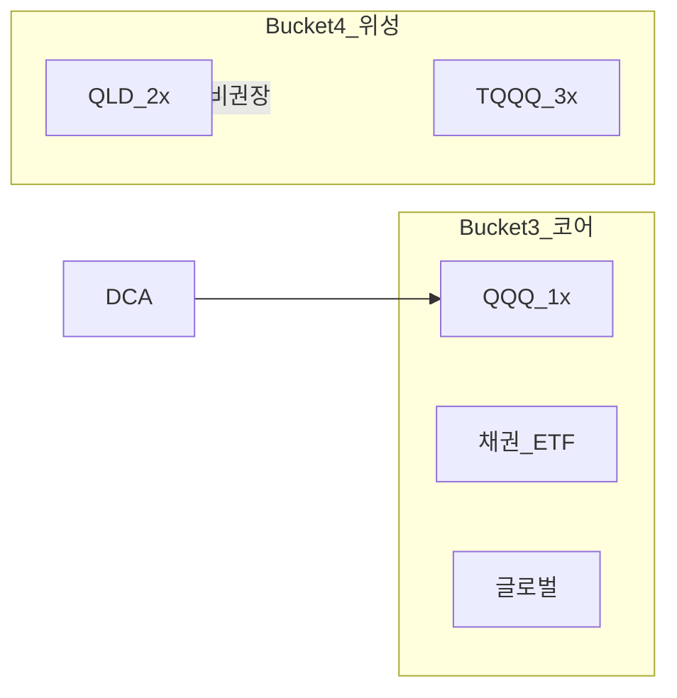
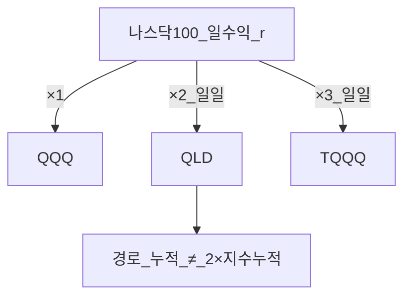

# QQQ vs QLD vs TQQQ — 레버리지 ETF와 장기 코어

> **면책**: 본 문서는 교육 목적이며, 특정 개인·법인에 대한 투자·세무·법률 자문이 아닙니다. 상품 구조·세율은 변경될 수 있으므로 실행 전 운용사 투자설명서·국세청 안내를 확인하세요.

## 메타

| 항목 | 내용 |
|------|------|
| 최종 검증일 | 2026-05-24 |
| 정책·법령 기준일 | 2025-12-31 확정 |
| 난이도 | L3 |
| 예상 읽기 시간 | 55~65분 |
| bucket | Bucket 3 (QQQ 코어 후보), Bucket 4 (QLD·TQQQ 위성·한정) |

## TL;DR

1. **QQQ** = 나스닥100 **1배** → 장기 **코어 후보**(채권·글로벌 분산 필수).  
2. **QLD** = **일 2배** 일일 리셋 → **장기 코어 부적합**, 변동성 붕괴.  
3. **TQQQ** = 일 3배 → 동일 논리, 리스크 **더 큼**.  
4. **DB** 재직 중 본인 매매 없음 → **ISA·IRP·일반**.  
5. 일반 계좌 QLD 장기 = 붕괴 + **해외 양도세** — [part1](../06-korea-policy/tax/overseas-stocks-tax-part1-cgt.md).

---

## 1. 한 줄 정의 + 왜 중요한가

| 상품 | 추종 | 레버리지 | 운용사(예) |
|------|------|----------|------------|
| **QQQ** | 나스닥100 | 1× | Invesco |
| **QLD** | 나스닥100 | **일 2×** | ProShares |
| **TQQQ** | 나스닥100 | **일 3×** | ProShares |

**정의**: **레버리지 ETF**는 지수 하루 수익률의 배수(2×·3×)를 맞추도록 **매일** 포지션을 조정하는 상장펀드입니다.

**왜 중요한가**: “나스닥이 오르면 2배 ETF가 10년에 2배”는 **성립하지 않을 수** 있습니다. [core-satellite](core-satellite-framework.md)에서 **코어를 QLD로 대체**하면 10년 목표의 **경로 리스크**가 커집니다.

---

## 2. 선수 지식 / 이후 읽을 것

**선수**:
- [overseas-equities-intro.md](../03-markets/overseas-equities-intro.md)
- [etf-index-funds.md](../03-markets/etf-index-funds.md)

**이후**:
- [overseas-stocks-tax-part1-cgt.md](../06-korea-policy/tax/overseas-stocks-tax-part1-cgt.md)
- [core-satellite-framework.md](core-satellite-framework.md)
- [account-product-tax-map.md](../06-korea-policy/tax/account-product-tax-map.md)
- [irp.md](../06-korea-policy/irp.md) — DB 가입자 QQQ 슬롯

---

## 3. 직관·비유

**일일 리셋**은 “매일 아침 레버리지를 **0으로 리셋**하고 그날만 2배 맞춘다”에 가깝습니다. **연속 복리**가 아니라 **날마다 새 출발**이라, 지그재그 장에서 **지수보다 더 깎일** 수 있습니다.

---

## 4. 정식 개념·용어

| 용어 | English | 정의 |
|------|---------|------|
| 일일 리셋 | Daily reset | 매 거래일 목표 배수 재조정 |
| 변동성 붕괴 | Volatility decay | 횡보·변동 시 장기 수익이 배수 목표보다 낮아지는 현상 |
| 경로 의존 | Path dependency | 중간 일별 수익 순서가 최종 수익에 영향 |
| 추적 목표 | Tracking | **당일** 지수 수익 × L |
| TER | Total expense ratio | 연간 총보수 |

## 4a. 핵심 용어 (본문 등장 순)

| 용어 | 한 줄 | 관련 이론 | glossary |
|------|-------|-----------|----------|
| QQQ | 나스닥100 1배; 장기 코어 후보 | 인덱스·β | [QQQ](../00-roadmap/glossary.md#qqq) |
| QLD | 나스닥100 일 2배 일일 리셋 | 레버리지 ETF | [QLD](../00-roadmap/glossary.md#qld) |
| TQQQ | 나스닥100 일 3배; 경로 리스크 더 큼 | 레버리지 ETF | — |
| 일일 리셋 | 매 거래일 목표 배수 재조정 | 경로의존 | — |
| 변동성 붕괴 | 횡보·변동 시 장기 수익이 배수 미달 | Volatility decay | [Volatility decay](../00-roadmap/glossary.md#volatility-decay-변동성-붕괴) |
| 경로 의존 | 일별 수익 순서가 최종 수익에 영향 | 기하평균 | — |
| 추적 목표 | 당일 지수 수익×L 추종 | 일일 레버리지 | — |
| TER | 연간 총보수; 복리에 누적 | 비용 | — |
| 코어·위성 | QQQ 코어 vs QLD/TQQQ 위성·한정 | 포트 구조 | [core-satellite](core-satellite-framework.md) |
| 해외 양도세 | 일반 계좌 QLD 장기 시 5월 신고 | 세제 | [part1](../06-korea-policy/tax/overseas-stocks-tax-part1-cgt.md) |
| ISA·IRP | DB 밖 코어·위성 슬롯 | 계좌 | [ISA](../00-roadmap/glossary.md#isa-individual-savings-account-개인종합자산관리계좌) |

## 4b. 관련 이론 미니맵

- **[ETF·인덱스](../03-markets/etf-index-funds.md)** — QQQ·TER·추적오차
- **[자산가격 거시](../02-economics/macro-06-asset-prices-macro.md)** — 금리·할인율과 나스닥 민감도
- **[코어-위성](core-satellite-framework.md)** — QLD를 코어로 두지 않는 이유
- **[행동금융](../05-behavioral/behavioral-finance-complete.md)** — 레버리지·FOMO·과신
- **[해외 주식·ETF](../03-markets/overseas-equities-intro.md)** — 직접 보유·환율·세금

---

## 5. 메커니즘

### 계좌별 (DB 가입자)

| 계좌 | QQQ | QLD/TQQQ |
|------|-----|----------|
| **DB 재직** | 직접 **불가** | 동일 |
| **ISA** | 코어 후보 | 규정·위험 확인 |
| **IRP** | 코어 후보 | 상품목록 |
| **일반** | 가능 | 양도세+붕괴 |

---

## 6. 수식·모델

일일: \( r_{L,t} \approx L \times r_{m,t} \)

장기: \( V_T = V_0 \prod_{t=1}^{T}(1 + r_{L,t}) \), 일반적으로 \( \neq V_0 (1 + L \cdot R_m) \)

**해당**: ProShares 등 공시 — **1일 초과 보유** 시 목표 배수와 **괴리**.

---

## 7. 한국 적용

### 7.1 2025년 (확정)

- 해외 ETF **양도소득세** — [part1](../06-korea-policy/tax/overseas-stocks-tax-part1-cgt.md)  
- **ISA 3년** — 비과세·분리과세 한도 ([isa](../06-korea-policy/isa.md))  
- **IRP** — 과세이연·세액공제 ([irp](../06-korea-policy/irp.md))

### 7.2 2026 (보도·개편)

| 항목 | 비고 |
|------|------|
| ISA 한도·비과세 확대 | 시행일 **확인** |
| 금융투자소득세 | 유예 지속 보도 |

**DC만** 해당: 회사 DC에서 QQQ·QLD — [dc-pension](../06-korea-policy/dc-pension.md), 위험자산 70%.

---

## 8. 숫자 예제 (가상)

### 예제 1 — 이틀 ±10% (교육)

| 날 | 지수 | QQQ | QLD(2×일) |
|----|------|-----|-----------|
| 1 | +10% | 1.10 | 1.20 |
| 2 | −10% | 0.99 | **0.96** |

지수 0.99, QLD 0.96 → **변동성 붕괴** 직관.

### 예제 2 — 10년 DCA QQQ (가상)

월 50만×120, 연 7% → 약 **8,600만** (세전·가상). 동일 기간 QLD는 **경로**에 따라 **위·아래** 모두 가능 — **2배 아님**.

### 예제 3 — DB 가입자 A (가상)

| 슬롯 | 상품 | bucket |
|------|------|--------|
| 회사 DB | (운용만) | 2a |
| IRP | QQQ 60%+채권 | 2b~3 |
| ISA | 글로벌·국내 | 3 |
| 일반 | QLD **5%** 실험 | 4 |

### 예제 4 — bear market 개념 (가상, 교육)

지수가 **−40%** 구간에서 QLD는 일일 2×로 **더 깊은** 낙폭을 반영할 수 있고, 반등 후에도 **본전 회복**에 필요한 상승률이 지수보다 **큽니다**. “지수가 V자 반등하면 QLD도 2배로 따라간다”는 **단순 비례**는 **성립하지 않을 수** 있습니다. → **회복 기간·추가 납입** 없이 장기 보유 시 심리적 **손절·방치** 리스크.

### 예제 5 — 동일 ISA에서 QQQ vs QLD (가상)

| 항목 | QQQ 코어 | QLD 위성 |
|------|----------|----------|
| 비중 | 70% | 10% |
| 3년 가정 수익 | 지수 추종 (가상 +40%) | 경로에 따라 **+60% ~ +20%** (범위 넓음) |
| 세금 | ISA 3년+ 비과세 한도 내 검토 | 동일 |
| 리밸런싱 | 분기 | 위성 **초과 시 축소** |

→ **코어는 QQQ**, QLD는 **실험·소액**이 [passive-vs-active](passive-vs-active.md)·[core-satellite](core-satellite-framework.md)와 맞습니다.

### 장기 보유 시나리오 표 (개념, 수치 가상)

| 시장 국면 | QQQ (1×) | QLD (2× 일) | TQQQ (3× 일) |
|-----------|----------|-------------|--------------|
| **우상향 저변동** | 지수 근접 | 지수 **근접~약간 낮음** 가능 | 추적오차 **더 큼** |
| **횡보 고변동** | 소폭 ± | **붕괴** 위험 | **붕괴** 더 큼 |
| **급락 후 완만 회복** | −30% 등 | **−50%대** 가능 | **−60%대** 가능 |
| **V자 반등** | 회복 | 회복 **지연·왜곡** | **왜곡** 극대 |

**교훈**: “좋은 장”만 가정한 백테스트로 QLD **코어**를 정당화하기 어렵습니다.

---

## 9. FAQ

**Q1. QLD가 10년 2배?**  
**A1.** **아니오.** **일 2×** 일일 목표.

**Q2. 코어 QLD?**  
**A2.** 교육 프레임 **비권장**.

**Q3. DB에서 QQQ?**  
**A3.** 재직 중 **불가** → [irp](../06-korea-policy/irp.md).

**Q4. TQQQ vs QLD?**  
**A4.** TQQQ **3×** — 붕괴·리스크 **더 큼**.

**Q5. 국내 래핑 ETF?**  
**A5.** 환헷지·보수·분배·세금 **별도** — [overseas-equities](../03-markets/overseas-equities-intro.md).

**Q6. ISA에 QLD?**  
**A6.** 가능 여부는 **증권사·ISA 규정** — 코어보다 **위성**.

**Q7. 나스닥만 올라가면 QLD도 무조건 이기나?**  
**A7.** **아니오.** 상승장이라도 **일내 변동·조정**이 크면 일일 리셋으로 **누적이 지수 2배보다 낮을** 수 있습니다.

**Q8. DC에서 QLD vs QQQ?**  
**A8.** DC **상품목록**·**위험자산 70%**·운용규정 확인 — [dc-pension](../06-korea-policy/dc-pension.md). DB 재직자는 **DC 아님**.

---

## 10. 함정·리스크·한계

- 장기 코어 = QLD/TQQQ  
- **일일 리셋** 미이해  
- DB에서 **직접 매매** 착각  
- 레버리지 + **양도세** 무시  
- 나스닥 **100%** + 채권 없음  
- 백테스트 **최고 구간**만 인용  
- **인플레·금리** 국면에서 성장주·레버리지 **동반** 조정 ([macroeconomics-basics](../02-economics/macroeconomics-basics.md))

---

## 11. 심화 읽기

### 11.1 운용사·규제

ProShares **투자설명서(Prospectus)**·**Fact Sheet**에서 다음을 반드시 확인합니다.

- **투자 목표**: *일일* 나스닥100 **200%** (비용·배당 제외 근사)  
- **장기 보유 경고**: 1일 초과 시 목표 배수 **미달/초과** 가능  
- **리밸런싱 방법**: 선물·스왑 등 — **추적오차·상관 붕괴** 문구

### 11.2 코어-위성 실전 규칙 (교육용)

| 규칙 | 내용 |
|------|------|
| R1 | 코어 **80%+** 는 1× 인덱스(QQQ·VOO·글로벌) |
| R2 | QLD/TQQQ 합산 **≤20%** 포트 (위성 상한) |
| R3 | QLD **손절·기간** 사전 정의 (예: 6개월 초과 시 청산 검토) |
| R4 | **리밸런싱**은 QQQ·채권 기준, QLD는 리밸런싱 **제외** 또는 축소만 |
| R5 | DB 가입자: QLD는 **IRP/ISA 상품목록** 확인 후에만 |

### 11.3 읽을 문서

- [ProShares QLD](https://www.proshares.com/our-etfs/leveraged-and-inverse/qld)  
- [passive-vs-active.md](passive-vs-active.md)  
- [rebalancing-and-dca.md](rebalancing-and-dca.md)  
- [fomo-and-trading-hours.md](../05-behavioral/fomo-and-trading-hours.md) — 장후 매매 유혹  
- [sources.md](../references/sources.md)

---

## 12. 스스로 점검 퀴즈

1. QLD 레버리지는 “10년 2배” vs “일 2배”?  
2. DB 재직 중 QQQ 매수처?  
3. 변동성 붕괴 한 줄?  
4. TQQQ가 QLD보다 위험한 이유?  
5. 코어에 채권을 넣는 이유(한 줄)?

정답 힌트

1. 일 2배 · 2. IRP/ISA · 3. 횡보·변동 시 장기 괴리 · 4. 3× 일일 · 5. 분산·낙폭 완화

