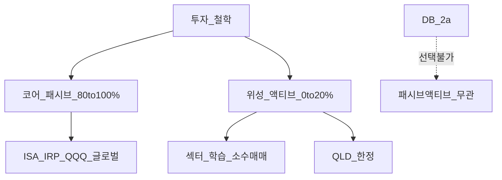
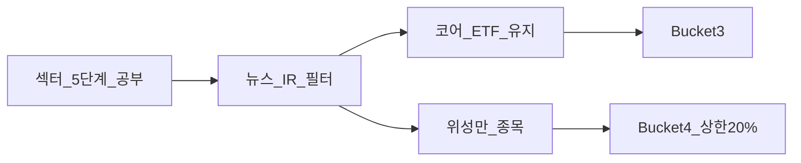

# 패시브 vs 액티브 — 코어 패시브·섹터 공부·액티브 전환 없이 학습하기 완전 가이드

> **면책**: 본 문서는 교육 목적이며, 특정 개인·법인에 대한 투자·세무·법률 자문이 아닙니다. 제도·세율·상품 조건은 변경될 수 있으므로 실행 전 공식 출처를 확인하세요.

## 메타

| 항목 | 내용 |
|------|------|
| 최종 검증일 | 2026-05-24 |
| 정책·법령 기준일 | 2025-12-31 확정, 2026 해당 없음(투자 교육) |
| 난이도 | L3 (Deep) — [READER-GUIDE](../docs/READER-GUIDE.md) |
| 예상 읽기 시간 | 55~70분 |
| 관련 bucket | Bucket 3 (패시브 코어), Bucket 4 (액티브·실험) |

## 0. 이 편 읽기 전 (5분)

| 항목 | 내용 |
|------|------|
| **난이도** | L3 (Deep) — [READER-GUIDE §L등급](../docs/READER-GUIDE.md) |
| **선수** | [etf-index-funds](../03-markets/etf-index-funds.md), [core-satellite-framework](core-satellite-framework.md) |
| **이번 편에서 쓰는 기호** | 본문 §4·§4a 표 참고 |
| **복습 한 줄** | — |

## TL;DR

1. **패시브**는 벤치마크(지수)를 **저비용·낮은 회전율**로 추종하고, **액티브**는 초과수익(알파)을 위해 **종목 선택·타이밍·섹터 집중**을 시도합니다.
2. 본 저장소 **교육 프레임**: 코어 **80~100% 패시브** — QQQ·글로벌·채권 ETF. **미정·초보**도 이 원칙부터.
3. **섹터 깊이 공부**(반도체·배터리·AI)는 **액티브 전환 필수가 아님** — 코어 ETF 유지 + 위성 **0~20%** 로 충분.
4. **DB 가입자** 코어는 **ISA·IRP** 인덱스 ETF — 회사 DB는 패시브/액티브 **선택 불가**.
5. **QLD·코스닥 단타·NXT 장후**는 **액티브/투기** 성격 — Bucket 4, [leveraged-etf-qqq-qld.md](leveraged-etf-qqq-qld.md).

## 1. 한 줄 정의 + 왜 중요한가

**정의**: **패시브 투자**는 시장 지수 또는 규칙 기반 벤치마크를 **추종**하여 “시장 수익 − 비용”을 목표로 하고, **액티브 투자**는 분석·판단으로 **벤치마크를 초과**하려는 접근입니다.

**왜 중요한가**: AI·반도체 뉴스를 **매일** 접하는 직군은 **액티브 착각**에 취약합니다. “공부했으니 직접 골라야 한다”는 논리는 **비용·시간·행동 오류**를 키웁니다. [sector-investing-framework.md](../03-markets/sectors/sector-investing-framework.md)의 5단계 공부는 **리스크 인지·위성 근거**용이지, **코어 전량 액티브화** 명분이 아닙니다. [passive-vs-active.md](passive-vs-active.md)와 [core-satellite-framework.md](core-satellite-framework.md)를 함께 읽으면 **공부는 깊게, 매매는 얕게**가 가능합니다.

## 2. 선수 지식 / 이후 읽을 것

**선수**:
- [etf-index-funds.md](../03-markets/etf-index-funds.md)
- [core-satellite-framework.md](core-satellite-framework.md)
- [time-horizon-and-buckets.md](time-horizon-and-buckets.md)

**이후**:
- [factor-investing-primer.md](../08-advanced/factor-investing-primer.md) — 규칙 기반 심화
- [sectors/README.md](../03-markets/sectors/README.md)
- [fomo-and-trading-hours.md](../05-behavioral/fomo-and-trading-hours.md)

## 3. 직관·비유

**패시브** = **날씨(시장)에 맞춰 계절 옷**을 입는 것. 봄에 패딩을 벗고 여름 옷 — **규칙(지수)** 이 대략 맞춰 줍니다.

**액티브** = “내가 **일기예보**를 이긴다” — 가끔 성공하지만 **매일 갈아입기(매매)** 비용·스트레스. **대부분** 장기 순수익에서 **비용·세금·실수**가 알파를 잡아먹습니다(교육 요지).

**섹터 공부 without active**: **의사가 질병을 공부**하지만 매일 **직접 약 조제(개별주 올인)** 하지 않는 것과 비슷습니다. **예방(코어 ETF)** + **소수 검사(위성)** 가 합리적입니다.

**DB**: 구내식당 메뉴 — **패시브·액티브 선택권 없음**. 집(ISA)에서 **패시브 ETF** 도시락.

한국 **DB·ISA·2026 개편** 환경에서 포트폴리오 문서는 **실행 순서**가 핵심입니다. 비중 % 논쟁 이전에 **운용 가능 계좌**와 **bucket 채우기**를 확정하고, QQQ·글로벌·채권 **코어**를 [etf-index-funds.md](../03-markets/etf-index-funds.md) 기준 **저비용**으로 유지하세요. 위성·레버리지·단타는 **0~20%**와 **손실 한도**로 격리하고, [references/sources.md](../references/sources.md)로 제도 변경을 **분기 1회** 확인합니다.

한국 **DB·ISA·2026 개편** 환경에서 포트폴리오 문서는 **실행 순서**가 핵심입니다. 비중 % 논쟁 이전에 **운용 가능 계좌**와 **bucket 채우기**를 확정하고, QQQ·글로벌·채권 **코어**를 [etf-index-funds.md](../03-markets/etf-index-funds.md) 기준 **저비용**으로 유지하세요. 위성·레버리지·단타는 **0~20%**와 **손실 한도**로 격리하고, [references/sources.md](../references/sources.md)로 제도 변경을 **분기 1회** 확인합니다.

한국 **DB·ISA·2026 개편** 환경에서 포트폴리오 문서는 **실행 순서**가 핵심입니다. 비중 % 논쟁 이전에 **운용 가능 계좌**와 **bucket 채우기**를 확정하고, QQQ·글로벌·채권 **코어**를 [etf-index-funds.md](../03-markets/etf-index-funds.md) 기준 **저비용**으로 유지하세요. 위성·레버리지·단타는 **0~20%**와 **손실 한도**로 격리하고, [references/sources.md](../references/sources.md)로 제도 변경을 **분기 1회** 확인합니다.

한국 **DB·ISA·2026 개편** 환경에서 포트폴리오 문서는 **실행 순서**가 핵심입니다. 비중 % 논쟁 이전에 **운용 가능 계좌**와 **bucket 채우기**를 확정하고, QQQ·글로벌·채권 **코어**를 [etf-index-funds.md](../03-markets/etf-index-funds.md) 기준 **저비용**으로 유지하세요. 위성·레버리지·단타는 **0~20%**와 **손실 한도**로 격리하고, [references/sources.md](../references/sources.md)로 제도 변경을 **분기 1회** 확인합니다.

## 4. 정식 개념·용어

| 용어 | 한글 | English | 정의 |
|------|------|------|----------------|
| 패시브 | — | Passive | 지수·규칙 추종, 낮은 회전율 |
| 액티브 | — | Active | 종목·섹터·타이밍 선택 |
| 알파 | — | Alpha | 벤치 대비 초과수익 |
| 베타 | — | Beta | 시장 민감도 |
| 추적 오차 | — | Tracking error | 패시브의 벤치 이탈 |
| TER | 총보수 | Total expense ratio | ETF 연간 비용 |
| 정보 비율 | — | Information ratio | 액티브 위험 대비 알파(심화) |

### 4a. 핵심 용어 (본문 등장 순)

> 복습용. 정의는 §4 본표·[glossary](../00-roadmap/glossary.md)·본문 `!!! info` 박스.

| 용어 | 한 줄 | 관련 이론 | glossary |
|------|------|------|----------------|
| 패시브 | 지수·규칙 추종, 낮은 회전율 | §4 | [glossary](../00-roadmap/glossary.md#패시브) |
| 액티브 | 종목·섹터·타이밍 선택 | §4 | [glossary](../00-roadmap/glossary.md#액티브) |
| 알파 | 벤치 대비 초과수익 | §4 | [glossary](../00-roadmap/glossary.md#알파) |
| 베타 | 시장 민감도 | §4 | [glossary](../00-roadmap/glossary.md#베타) |
| 추적 오차 | 패시브의 벤치 이탈 | §4 | [glossary](../00-roadmap/glossary.md#추적-오차) |
| TER | ETF 연간 비용 | §4 | [glossary](../00-roadmap/glossary.md#ter) |
| 정보 비율 | 액티브 위험 대비 알파 | §4 | [glossary](../00-roadmap/glossary.md#정보-비율) |

## 5. 메커니즘

### 5.1 철학 → Bucket 배치

### 5.2 섹터 공부 vs 매매 분리

### 5.3 패시브 vs 액티브 비교표

| | 패시브 코어 | 액티브 위성 |
|------|------|----------------|
| 목표 | 시장 − 비용 | 초과(불확실) |
| 시간 | 월 1~2h | 주 5h+ |
| 비용 | TER 0.05~0.3% | 수수료·세금·슬리피지 |
| 적합 Bucket | 3 | 4 |
| QQQ | **패시브** | — |
| QLD | — | **액티브/투기** |

### 5.4 액티브가 “이길” 수 있는 조건 (교육적, 해당 없음 아님)

문헌상 **소수**만 장기 알파를 냅니다. 교육 프레임에서 액티브 **위성**이 **허용**되는 조건: (1) **손실 한도** 문서화. (2) **시간 예산** — 본업 대비 **과도한** 주 10h+ **비권장**. (3) **세금·수수료** 포함 **순수익** 기록. (4) **코어 훼손 금지** — 위성 수익을 코어에 **재투자하지 않고** 위성으로 **착각**하지 않기.

### 5.5 섹터 스터디 without active — 5단계 실행 예

[sector-investing-framework.md](../03-markets/sectors/sector-investing-framework.md) 5단계를 **매매 없이** 수행:

1. **TAM/SAM** — “시장 크다” ≠ “주가 오른다” 메모.  
2. **밸류체인** — 마진 있는 ring 표시.  
3. **CR3·대체** — 경쟁 과열 구간 표시.  
4. **재무** — ROIC·재고 (위성 후보만).  
5. **한국 지도** — ETF vs 개별 vs **코스닥 위험** — [kosdaq-tier-system-primer.md](../03-markets/kosdaq-tier-system-primer.md).

**출력물**: “코어 QQQ 유지, 위성 반도체 A사 **5% 한도**” 같은 **한 줄 규칙**. **출력물이 없으면** 공부는 **오락**에 가깝습니다.

### 5.6 비용 비교 (가상, 10년)

| | 패시브 코어 TER 0.2% | 액티브 위성 회전 20회/년 |
|------|------|----------------|
| 비용 | ~2% 누적 (단순) | 수수료+세금 **5%+** 가능 |
| 시간 | 월 2h | 주 10h+ |
| 행동 | 낮음 | **FOMO** — [fomo-and-trading-hours.md](../05-behavioral/fomo-and-trading-hours.md) |

## 6. 수식·모델

| 기호 | 이름 | 이 식에서 의미 |
|------|------|----------------|
| TER | 총보수율 | 펀드·ETF 연간 비용 |
| α | 알파 | 벤치마크 대비 초과수익 |

**장기 순수익** (개념):

| 기호 | 이름 | 이 식에서 의미 |
|------|------|----------------|
| \(r\) | 할인율·수익률 | 기간당 이자·요구수익률 |
| \(n\) | 기간 | 연·월 등 복리·할인에 쓰는 횟수 |
| \(PV\) | 현재가치 | 오늘 시점으로 환산한 금액 |
| \(FV\) | 미래가치 | 미래 시점의 목표·결과 금액 |

\[
\text{순수익} \approx \text{시장수익} - \text{비용(TER+세금+수수료)} - \text{행동 오류}
\]

**읽는 법**: **TER**와 **ETF**의 관계를 위 식으로 쓴다. 경제·재무 해석은 변수표 「이 식에서 의미」와 [DEPTH-STANDARD](../docs/DEPTH-STANDARD.md) 기호 예제를 맞춘다.
**액티브 기대값** (교육적):

| 기호 | 이름 | 이 식에서 의미 |
|------|------|----------------|
| \(r\) | 할인율·수익률 | 기간당 이자·요구수익률 |
| \(n\) | 기간 | 연·월 등 복리·할인에 쓰는 횟수 |
| \(PV\) | 현재가치 | 오늘 시점으로 환산한 금액 |

\[
E[\alpha] \approx 0 - \text{비용} \quad \text{(대다수 참가자)}
\]

**읽는 법**: **r**와 **n**의 관계를 위 식으로 쓴다. 경제·재무 해석은 변수표 「이 식에서 의미」와 [DEPTH-STANDARD](../docs/DEPTH-STANDARD.md) 기호 예제를 맞춘다.→ 코어는 **α 추구 포기**, **비용·오류 최소화**.

**해당 없음**: 일일 리셋 레버리지 — [leveraged-etf-qqq-qld.md](leveraged-etf-qqq-qld.md).

## 7. 한국 적용

### 7.1 2025년 기준 (확정)

| 환경 | 패시브 | 액티브 |
|------|------|----------------|
| **ISA 중개형** | ETF 직접 — **유리** | 위성 소수 |
| **일임형 ISA** | 펀드 TER 비교 | 로bo 규칙 |
| **IRP** | QQQ·채권 ETF | 장기 패시브 |
| **DB** | **선택 불가** | — |
| **코스닥 테마** | — | [kosdaq-tier-system.md](../03-markets/kosdaq-tier-system.md) |
| **NXT 장후** | 코어 **금지** | Bucket 4 — [korea-ats-nextrade.md](../03-markets/korea-ats-nextrade.md) |

### 7.2 2026년 개편·시행 예정 (해당 시)

| 항목 | 영향 |
|------|------|
| ISA 한도 확대 | **패시브 코어** 적립 가속 |

**법·정책 근거**: 해당 없음(투자 교육). 세금은 [investment-tax-overview.md](../06-korea-policy/tax/investment-tax-overview.md).

### 7.3 DB·DC·ISA — 패시브 코어 실행표 (2025)

| 유형 | 코어 QQQ·글로벌 | 위성 액티브 | 비고 |
|------|------|------|----------------|
| DB 재직 | **ISA·IRP** | ISA 소액 | DB **운용 불가** |
| DC | **DC+ISA** | 동일 | [dc-pension.md](../06-korea-policy/dc-pension.md) |
| ISA 중개형 | **직접 ETF** | 0~20% | [isa.md](../06-korea-policy/isa.md) |
| 일반계좌 | 가능 | **세금** 유의 | 해외 양도세 |

섹터 **공부 without active**의 **실전 루틴**: (1) 주 2h [sectors](../03-markets/sectors/README.md) — **노트만**. (2) 월 1h 코어 ISA **점검** — 매매 **없음**이 정상. (3) 분기 1h 위성 **한도** — [rebalancing-and-dca.md](rebalancing-and-dca.md). (4) **QLD·NXT·코스닥**은 [leveraged-etf-qqq-qld.md](leveraged-etf-qqq-qld.md), [korea-ats-nextrade.md](../03-markets/korea-ats-nextrade.md) **별도 규칙**.

**Q9. 섹터 로드맵만 읽고 ETF만 사면?**  
**A9.** **패시브 코어 + 공부** — [recommended-deep-study-roadmap.md](../03-markets/sectors/recommended-deep-study-roadmap.md).

**Q10. DC는 패시브 코어 가능?**  
**A10.** **예** — DC 앱에서 QQQ·채권 ETF — [dc-pension.md](../06-korea-policy/dc-pension.md).

## 8. 숫자 예제 (가상)

> 모든 인물·금액은 가상입니다.

### 예제 1: AI 엔지니어 B — 공부 15h/주, 코어 패시브

| | 비중 | 행동 |
|------|------|----------------|
| 코어 90% | QQQ+글로벌+채권 ETF | **월 1회** 점검 |
| 위성 10% | 반도체 2종 | 섹터 공부 **반영** |
| 액티브 전환 | **없음** | 공부는 **필터**용 |

### 예제 2: C — 뉴스마다 매매 (비권장)

| | 코어 | 위성 |
|------|------|----------------|
| 설계 | 50% | 50% |
| 1년 | 회전 40회 | 양도세·수수료 ↑ |
| 교정 | **90/10** 패시브 코어 | 위성 **축소** |

### 예제 3: DB 가입 D

| 슬롯 | 패시브/액티브 |
|------|---------------|
| DB | **본인 무관** |
| ISA | QQQ+ACWI **패시브** 85% |
| 위성 | 배터리 ETF 15% |

## 9. FAQ

**Q1. 섹터 공부하면 액티브로 가야 하나요?**  
**A1.** **아니오.** 코어 ETF + 위성 **소수** — [sector-investing-framework.md](../03-markets/sectors/sector-investing-framework.md).

**Q2. QQQ는 패시브인가요?**  
**A2.** **예** — 나스닥100 **지수 추종**.

**Q3. QLD는?**  
**A3.** **액티브/투기** 위성 — 코어 **금지**.

**Q4. AI 직군은 액티브 유리?**  
**A4.** **인적자본(연봉)** + **패시브 코어** 궁합. 업 지식 ≠ **매매 알파**.

**Q5. 철학은 언제 확정?**  
**A5.** **3~6개월** ISA DCA 실행 후 — [rebalancing-and-dca.md](rebalancing-and-dca.md).

**Q6. 액티브 펀드는?**  
**A6.** TER·과거 성과 **지속성** 의심 — 코어 **비권장**.

**Q7. 팩터 ETF는 패시브?**  
**A7.** **규칙 기반** — [factor-investing-primer.md](../08-advanced/factor-investing-primer.md).

**Q8. NXT 단타는?**  
**A8.** **액티브** Bucket 4 — [fomo-and-trading-hours.md](../05-behavioral/fomo-and-trading-hours.md).

**Q9. 섹터 로드맵만 읽고 ETF만 사면?**  
**A9.** **패시브 코어 + 공부** — [recommended-deep-study-roadmap.md](../03-markets/sectors/recommended-deep-study-roadmap.md).

**Q10. DC는 패시브 코어 가능?**  
**A10.** **예** — [dc-pension.md](../06-korea-policy/dc-pension.md).

### 실행 체크리스트 (교육용)

- [ ] Bucket 0~2 [time-horizon-and-buckets.md](time-horizon-and-buckets.md)  
- [ ] 코어 80/20 [core-satellite-framework.md](core-satellite-framework.md) — **QLD 코어 금지**  
- [ ] 60/40 또는 개인 목표 [asset-allocation.md](asset-allocation.md)  
- [ ] QQQ+글로벌 [geographic-diversification.md](geographic-diversification.md)  
- [ ] DCA·밴드 [rebalancing-and-dca.md](rebalancing-and-dca.md)  
- [ ] 패시브 코어 [passive-vs-active.md](passive-vs-active.md)  
- [ ] DB → ISA [db-pension.md](../06-korea-policy/db-pension.md)

## 10. 함정·리스크·한계

- **업 종사 = 투자 유리** 착각  
- 섹터 공부 → **코어 전량 개별주**  
- **패시브인데 QLD 코어**  
- **액티브 과신** — 위성 50%+  
- DB **착각 운용**  
- **성공 사례**만 기억(생존자 편향)

---

**Q. 실무에서는?**  
교과서 식·기호를 그대로 적용하기 전에 **수수료·세금·데이터 시점**을 분리한다. 숫자는 [DEPTH-STANDARD](../docs/DEPTH-STANDARD.md)처럼 기호만 먼저 맞추고, 법령·시장 수치는 §8 표·외부 출처로 갱신한다.

## 11. 심화 읽기

- [references/sources.md](../references/sources.md)
- [factor-investing-primer.md](../08-advanced/factor-investing-primer.md)
- [recommended-deep-study-roadmap.md](../03-markets/sectors/recommended-deep-study-roadmap.md)

## 12. 스스로 점검 퀴즈

1. 패시브 코어의 목표는?  
2. 섹터 공부가 액티브 전환을 **필수**로 만드나?  
3. QLD는 패시브 코어에?  
4. DB 재직 코어 슬롯?  
5. 위성 상한 이유?

??? note "정답 힌트"

    1. 시장−비용 · 2. 아니오 · 3. 금지 · 4. ISA·IRP · 5. 집중·행동 오류