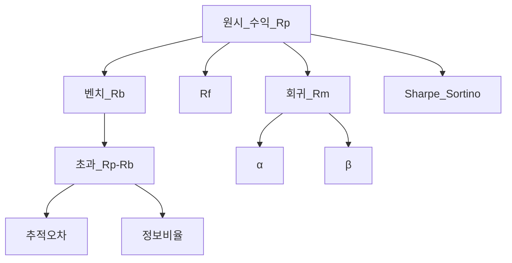
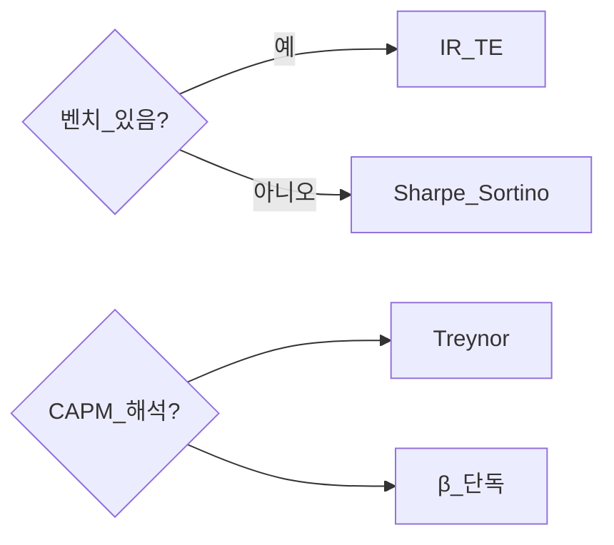

# 성과 측정 — α·β·Sharpe·Sortino·Treynor·추적오차·정보비율·벤치마크

> **면책**: 교육 목적. 과거 α·Sharpe는 미래를 보장하지 않습니다. 벤치마크·회귀 추정은 방법론·기간에 민감합니다.

## 메타

| 항목 | 내용 |
|------|------|
| 최종 검증일 | 2026-05-24 |
| 정책·법령 기준일 | 2025-12-31 확정 |
| 난이도 | L4 (Graduate) — [READER-GUIDE](../docs/READER-GUIDE.md) |
| 예상 읽기 시간 | 150~180분 |
| 관련 bucket | Bucket 3 (코어 vs 벤치), Bucket 4 (위성·액티브) |

## 0. 이 편 읽기 전 (5분)

| 항목 | 내용 |
|------|------|
| **난이도** | L4 (Graduate) — [READER-GUIDE §L등급](../docs/READER-GUIDE.md) |
| **선수** | [portfolio-theory-mpt](portfolio-theory-mpt.md), [risk-management-portfolio](risk-management-portfolio.md) |
| **이번 편에서 쓰는 기호** | 본문 §4·§4a 표 참고 |
| **복습 한 줄** | L3 선수 편을 먼저 읽으면 수식이 수월함 |

## TL;DR

1. **α** 는 벤치·모델 대비 **초과 수익**(회귀 잔차·Jensen α) — “실력 vs 운” 구분이 어렵다.
2. **β** 는 **시장 민감도** — 성과 **수준**이 아니라 **구조**.
3. **Sharpe** = \((R_p-R_f)/σ_p\) — **총 위험** 대비 초과; **Sortino** 는 **하방 σ** 만.
4. **Treynor** = \((R_p-R_f)/β_p\) — **체계적 위험** 단위당 초과(CAPM 맥락).
5. **추적오차(TE)** = 포트−벤치 수익 차이의 **σ**; **정보비율 IR** = 초과수익/TE — **액티브** 품질.
6. **벤치마크 선택**이 모든 지표의 **전제** — 잘못 고르면 α·IR **왜곡**.

---

## 1. 한 줄 정의 + 왜 중요한가

**정의**: **성과 측정(Performance Measurement)** 은 포트폴리오 수익을 **무위험·시장·약속된 벤치** 대비 분해하고, **위험 조정 지표**로 비교 가능하게 **정규화**하는 체계다.

!!! info "Bucket"
    시간·목적별 **자금 슬롯**(0 비상금 → 3 코어 등)

**왜 중요한가**: [passive-vs-active.md](passive-vs-active.md) 논쟁은 “**벤치 이길 수 있는가**”로 귀결된다. QQQ 코어를 **S&P500·NASDAQ100** 중 무엇과 비교하느냐에 **α·TE** 가 달라진다. [portfolio-theory-mpt.md](portfolio-theory-mpt.md)의 샤프를 **실제 계좌**에 적용할 때 **R_f(국채·MMDA)·기간(월 vs 연)** 을 맞춰야 한다. Bucket 4 위성은 **IR·TE** 로 “베팅이 값었는지”를 **사후** 점검 — [behavioral-finance-complete.md](../05-behavioral/behavioral-finance-complete.md)와 연결.

---

## 2. 선수 지식 / 이후 읽을 것

**선수**:
- [portfolio-theory-mpt.md](portfolio-theory-mpt.md)
- [risk-management-portfolio.md](risk-management-portfolio.md)
- [capm-and-risk-return.md](../08-advanced/capm-and-risk-return.md)
- [passive-vs-active.md](passive-vs-active.md)

**이후**:
- [factor-investing-primer.md](../08-advanced/factor-investing-primer.md)
- [rebalancing-and-dca.md](rebalancing-and-dca.md)

---

## 3. 직관·비유

**벤치마크 = 시험의 “평균 점수”**: 내 점수(수익)만으로 1등인지 모른다 — **학교 평균(벤치)** 대비 **몇 점 위**인가가 **초과수익**.

**β = 시험 난이도에 대한 민감도** — 어려운 시험(약세장)에서 **더 많이 떨어지는** 타입인지.

**Sharpe = 점수 대비 “스트레스(전체 변동)”** — Sortino는 **실패(하방) 스트레스**만.

**Treynor = “시장 난이도(β)” 로 나눈 점수** — β 큰 포트는 **시장 베팅**을 많이 한 것과 같아 **조정** 필요.

**추적오차 = 벤치와 **얼마나 다르게** 살았는가** — 패시브는 TE≈0, 액티브·위성은 TE↑.

**정보비율 = 다르게 산 것이 **돈이 됐는가** (초과/TE)**.

---

## 4. 정식 개념·용어

| 용어 | English | 정의 |
|------|---------|------|
| 총수익 | Total return | 배당·평가 포함 |
| 초과수익 | Excess return | \(R_p - R_b\) 또는 \(R_p - R_f\) |
| α | Alpha | 모델·회귀 초과 |
| β | Beta | 시장 민감도 |
| Sharpe | Sharpe ratio | \((R_p-R_f)/σ_p\) |
| Sortino | Sortino ratio | \((R_p-R_f)/σ_d\) |
| Treynor | Treynor ratio | \((R_p-R_f)/β_p\) |
| TE | Tracking error | \(σ(R_p-R_b)\) |
| IR | Information ratio | \(\overline{R_p-R_b}/TE\) |
| Jensen α | Jensen's alpha | CAPM 회귀 절편 |
| 벤치마크 | Benchmark | 비교 기준 지수·혼합 |
| 공액수익 | Compound return | 기하 누적 |

### 4a. 핵심 용어 (본문 등장 순)

> 복습용. 정의는 §4 본표·[glossary](../00-roadmap/glossary.md)·본문 `!!! info` 박스.

| 용어 | 한 줄 | 관련 이론 | glossary |
|------|-------|-----------|----------|
| 총수익 | 배당·평가 포함 | §4 | [glossary](../00-roadmap/glossary.md#총수익) |
| 초과수익 | 벤치마크 대비 초과 | §4 | [glossary](../00-roadmap/glossary.md#초과수익) |
| α | 모델·회귀 초과 | §4 | [glossary](../00-roadmap/glossary.md#α) |
| β | 시장 민감도 | §4 | [glossary](../00-roadmap/glossary.md#β) |
| Sharpe | (Rp−Rf)/σp | §4 | [glossary](../00-roadmap/glossary.md#sharpe) |
| Sortino | (Rp−Rf)/하방σ | §4 | [glossary](../00-roadmap/glossary.md#sortino) |
| Treynor | (Rp−Rf)/β | §4 | [glossary](../00-roadmap/glossary.md#treynor) |
| TE | 추적오차(표준편차) | §4 | [glossary](../00-roadmap/glossary.md#te) |
| IR | 초과수익/TE | §4 | [glossary](../00-roadmap/glossary.md#ir) |
| Jensen α | CAPM 회귀 절편 | §4 | [glossary](../00-roadmap/glossary.md#jensen-α) |
| 벤치마크 | 비교 기준 지수·혼합 | §4 | [glossary](../00-roadmap/glossary.md#벤치마크) |
| 공액수익 | 기하 누적 | §4 | [glossary](../00-roadmap/glossary.md#공액수익) |

---

## 5. 메커니즘

### 5.1 성과 분해 파이프라인

### 5.2 지표 선택 가이드 (교육)

---

## 6. 수식·모델

### 6.1 CAPM 회귀와 Jensen α

| 기호 | 이름 | 이 식에서 의미 |
|------|------|----------------|
| \(r\) | 할인율·수익률 | 기간당 이자·요구수익률 |
| \(n\) | 기간 | 연·월 등 복리·할인에 쓰는 횟수 |
| \(PV\) | 현재가치 | 오늘 시점으로 환산한 금액 |
| \(FV\) | 미래가치 | 미래 시점의 목표·결과 금액 |

\[
R_{p,t} - R_{f,t} = \alpha + \beta (R_{m,t} - R_{f,t}) + \varepsilon_t
\]

**읽는 법**: 시장 초과수익에 대한 민감도가 **β**다. **R_f**·**ERP**와 함께 요구수익 **r**을 구성한다. [DEPTH-STANDARD](../docs/DEPTH-STANDARD.md) 참고.
**유도 (L4)**:
1. **정의**: **R_**, **p**, **t**를 동일 시점·동일 통화로 맞춘다. — 단위 불일치면 식이 무의미해진다.
2. **식 변형**: 양변을 정리해 목표 변수를 한쪽에 둔다. — 할인·복리는 **시점 이동**이 핵심이다.
3. **해석**: 부호·크기가 경제 직관과 맞는지 확인한다. — 극단값에서 단조성·한계를 점검한다.

**Jensen α** (기간 평균 해석, 교육):

| 기호 | 이름 | 이 식에서 의미 |
|------|------|----------------|
| \(R_f\) | 무위험금리 | 국채·예금 등 기준 금리 |
|           \(R\)           | R | 기간당 이자·요구수익률 |
\[
\alpha \approx \bar{R}_p - R_f - \beta (\bar{R}_m - R_f)
\]

**읽는 법**: 시장 초과수익에 대한 민감도가 **β**다. **R_f**·**ERP**와 함께 요구수익 **r**을 구성한다. [DEPTH-STANDARD](../docs/DEPTH-STANDARD.md) 참고.
**유도 (L4)**:
1. **정의**: **R_f**, **R**를 동일 시점·동일 통화로 맞춘다. — 단위 불일치면 식이 무의미해진다.
2. **식 변형**: 양변을 정리해 목표 변수를 한쪽에 둔다. — 할인·복리는 **시점 이동**이 핵심이다.
3. **해석**: 부호·크기가 경제 직관과 맞는지 확인한다. — 극단값에서 단조성·한계를 점검한다.
**α>0**: 모델 대비
| 이름 | 이 식에서 의미 | |
| 기호 | 이름 | 이 식에서 의미 |
|------|------|----------------|
| \(R_f}\) | 무위험금리 | 국채·예금 등 기준 금리 |
|------|------|----------------|
|           \(R\)           | R | 기간당 이자·요구수익률 |
 **초과** — **표본·선택편향** 주의.

### 6.2 Sharpe (복습·성과 맥락)

| 기호 | 이름 | 이 식에서 의미 |
|------|------|----------------|
| \(r\) | 할인율·수익률 | 기간당 이자·요구수익률 |
| \(n\) | 기간 | 연·월 등 복리·할인에 쓰는 횟수 |
| \(PV\) | 현재가치 | 오늘 시점으로 환산한 금액 |
| \(FV\) | 미래가치 | 미래 시점의 목표·결과 금액 |

\[
S_p = \frac{\bar{R}_p - R_f}{\sigma_p}
\]

**읽는 법**: **S_p**와 **R_f**의 관계를 위 식으로 쓴다. 경제·재무 해석은 변수표 「이 식에서 의미」와 [DEPTH-STANDARD](../docs/DEPTH-STANDARD.md) 기호 예제를 맞춘다.
**유도 (L4)**:
1. **정의**: **S_p**, **R_f**, **gma_p**를 동일 시점·동일 통화로 맞춘다. — 단위 불일치면 식이 무의미해진다.
2. **식 변형**: 양변을 정리해 목표 변수를 한쪽에 둔다. — 할인·복리는 **시점 이동**이 핵심이다.
3. **해석**: 부호·크기가 경제 직관과 맞는지 확인한다. — 극단값에서 단조성·한계를 점검한다.

**연환산** (교육, 월 데이터):

| 기호 | 이름 | 이 식에서 의미 |
|------|------|----------------|
| \(r\) | 할인율·수익률 | 기간당 이자·요구수익률 |
| \(n\) | 기간 | 연·월 등 복리·할인에 쓰는 횟수 |
|------|------|----------------|
| \(r\) | 할인율·수익률 | 기간당 이자·요구수익률 |
| \(n\) | 기간 | 연·월 등 복리·할인에 쓰는 횟수 |
| \(PV\) | 현재가치 | 오늘 시점으로 환산한 금액 |
| \(FV\) | 미래가치 | 미래 시점의 목표·결과 금액 |

\[
T_
| 이름 | 이 식에서 의미 | |
| 기호 | 이름 | 이 식에서 의미 |
|------|------|----------------|
| \(R_f}\) | 무위험금리 | 국채·예금 등 기준 금리 |
|------|------|----------------|
|           \(R\)           | R | 기간당 이자·요구수익률 |
p = \frac{\bar{R}_p - R_f}{\beta_p}
\]

**읽는 법**: 시장 초과수익에 대한 민감도가 **β**다. **R_f**·**ERP**와 함께 요구수익 **r**을 구성한다. [DEPTH-STANDARD](../docs/DEPTH-STANDARD.md) 참고.
**유도 (L4)**:
1. **정의**: **R_f**, **eta_p**, **R**를 동일 시점·동일 통화로 맞춘다. — 단위 불일치면 식이 무의미해진다.
2. **식 변형**: 양변을 정리해 목표 변수를 한쪽에 둔다. — 할인·복리는 **시점 이동**이 핵심이다.
3. **해석**: 부호·크기가 경제 직관과 맞는지 확인한다. — 극단값에서 단조성·한계를 점검한다.

|------|------|----------------|
| \(PV\) | 현재가치 | 오늘 시점으로 환산한 금액 |
|------|------|----------------|
육용 기호(M·P·PV 등)로 대입한다.
**해석**: **체계적 위험 1단위**당 초과. **완전 분산**·**CAPM** 가정 하 **비교** — β≈0 자산 **부적합**.

### 6.5 추적오차·정보비율

**활성 수익**: \(r_{a,t} = r_{p,t} - r_{b,t}\)

| 기호 | 이름 | 이 식에서 의미 |
|------|------|----------------|
| \(r\) | 할인율·수익률 | 기간당 이자·요구수익률 |
| \(n\) | 기간 | 연·월 등 복리·할인에 쓰는 횟수 |
| \(PV\) | 현재가치 | 오늘 시점으로 환산한 금액 |

\[
TE = \sigma(r_a), \quad IR = \frac{\bar{r}_a}{TE}
\]

**읽는 법**: **r**와 **n**의 관계를 위 식으로 쓴다. 경제·재무 해석은 변수표 「이 식에서 의미」와 [DEPTH-STANDARD](../docs/DEPTH-STANDARD.md) 기호 예제를 맞춘다.
**유도 (L4)**:
1. **정의**: **r**, **n**, **PV**를 동일 시점·동일 통화로 맞춘다. — 단위 불일치면 식이 무의미해진다.
2. **식 변형**: 양변을 정리해 목표 변수를 한쪽에 둔다. — 할인·복리는 **시점 이동**이 핵심이다.
3. **해석**: 부호·크기가 경제 직관과 맞는지 확인한다. — 극단값에서 단조성·한계를 점검한다.
**IR ≈ 0.5** 장기·**지속**은 어렵다는 **경험칙**(교육) — 비용·세금 전 **총액**.

**패시브 코어**: \(\bar{r}_a \approx 0\), **TE 낮음** — [passive-vs-active.md](passive-vs-active.md).

### 6.6 벤치마크 선택 (핵심)

| 포트 성격 | 벤치 후보(예) | 오선택 함정 |
|-----------|---------------|-------------|
| 글로벌 60/40 | 혼합 지수·MSCI ACWI+채권 | KOSPI만 |
| QQQ 코어 | NASDAQ-100 | KOSPI200 |
| 국내 주식+채권 | KOSPI+국채 혼합 | S&P500 |
| 위성 반도체 | SOX·섹터 ETF | broad market |
| ISA 전체 | **정책 포트** 문서화 | 매년 변경 |

**원칙**: **사전** 고정·**투자 정책서(IPS)** 수준 메모 — 사후 “좋은 지수” 고르기 = **편향**.

### 6.7 기타 (한 줄)

- **Calmar** = 연수익 / |MDD| — [risk-management-portfolio.md](risk-management-portfolio.md).  
- **M²** = 레버리지·디레버리지로 **벤치 σ** 맞춘 수익 — 고급.  
- **팩터 α**: FF3+α — [factor-investing-primer.md](../08-advanced/factor-investing-primer.md).

---

간당 이자·요구수익률 |
p = \frac{\bar{R}_p - R_f}{\beta_p}

**읽는 법**: 시장 초과수익에 대한 민감도가 **β**다. **R_f**·**ERP**와 함께 요구수익 **r**을 구성한다. [DEPTH-STANDARD](../docs/DEPTH-STANDARD.md) 참고.
**유도 (L4)**:
1. **정의**: **R_f**, **eta_p**, **R**를 동일 시점·동일 통화로 맞춘다. — 단위 불일치면 식이 무의미해진다.
2. **식 변형**: 양변을 정리해 목표 변수를 한쪽에 둔다. — 할인·복리는 **시점 이동**이 핵심이다.
3. **해석**: 부호·크기가 경제 직관과 맞는지 확인한다. — 극단값에서 단조성·한계를 점검한다.

|------|------|----------------|
| \(PV\) | 현재가치 | 오늘 시점으로 환산한 금액 |
|------|------|----------------|
육용 기호(M·P·PV 등)로 대입한다.
**해석**: **체계적 위험 1단위**당 초과. **완전 분산**·**CAPM** 가정 하 **비교** — β≈0 자산 **부적합**.

### 6.5 추적오차·정보비율

**활성 수익**: \(r_{a,t} = r_{p,t} - r_{b,t}\)

| 기호 | 이름 | 이 식에서 의미 |
|------|------|----------------|
| \(r\) | 할인율·수익률 | 기간당 이자·요구수익률 |
| \(n\) | 기간 | 연·월 등 복리·할인에 쓰는 횟수 |
| \(PV\) | 현재가치 | 오늘 시점으로 환산한 금액 |

\[
TE = \sigma(r_a), \quad IR = \frac{\bar{r}_a}{TE}
\]

**읽는 법**: **r**와 **n**의 관계를 위 식으로 쓴다. 경제·재무 해석은 변수표 「이 식에서 의미」와 [DEPTH-STANDARD](../docs/DEPTH-STANDARD.md) 기호 예제를 맞춘다.
**유도 (L4)**:
1. **정의**: **r**, **n**, **PV**를 동일 시점·동일 통화로 맞춘다. — 단위 불일치면 식이 무의미해진다.
2. **식 변형**: 양변을 정리해 목표 변수를 한쪽에 둔다. — 할인·복리는 **시점 이동**이 핵심이다.
3. **해석**: 부호·크기가 경제 직관과 맞는지 확인한다. — 극단값에서 단조성·한계를 점검한다.
**IR ≈ 0.5** 장기·**지속**은 어렵다는 **경험칙**(교육) — 비용·세금 전 **총액**.

**패시브 코어**: \(\bar{r}_a \approx 0\), **TE 낮음** — [passive-vs-active.md](passive-vs-active.md).

### 6.6 벤치마크 선택 (핵심)

| 포트 성격 | 벤치 후보(예) | 오선택 함정 |
|-----------|---------------|-------------|
| 글로벌 60/40 | 혼합 지수·MSCI ACWI+채권 | KOSPI만 |
| QQQ 코어 | NASDAQ-100 | KOSPI200 |
| 국내 주식+채권 | KOSPI+국채 혼합 | S&P500 |
| 위성 반도체 | SOX·섹터 ETF | broad market |
| ISA 전체 | **정책 포트** 문서화 | 매년 변경 |

**원칙**: **사전** 고정·**투자 정책서(IPS)** 수준 메모 — 사후 “좋은 지수” 고르기 = **편향**.

### 6.7 기타 (한 줄)

- **Calmar** = 연수익 / |MDD| — [risk-management-portfolio.md](risk-management-portfolio.md).  
- **M²** = 레버리지·디레버리지로 **벤치 σ** 맞춘 수익 — 고급.  
- **팩터 α**: FF3+α — [factor-investing-primer.md](../08-advanced/factor-investing-primer.md).

---

## 7. 한국 적용

### 7.1 R_f 근사 (교육)

| 항목 | 2025 근사 | 비고 |
|------|-----------|------|
| 국고채 3Y | 시장 금리 | Sharpe·Sortino |
| MMDA·CMA | Bucket 0 | 단기 |
| ISA 내부 | 동일 R_f 가정 | **통합** 성과 |

### 7.2 벤치·통화

해외 ETF: **원화 수익** vs **달러 지수** — **환율**이 α·TE 에 포함. **헤지 vs 비헤지** 벤치 **일치**.

### 7.3 2025 vs 2026

ISA 한도·세제 — **세후 α** 는 [isa.md](../06-korea-policy/isa.md) 별도. **성과 지표**는 보통 **세전·비용 전** 표시 후 **비용 차감**.

### 7.4 DB·ISA 분리 측정

**통합 벤치** vs **통별** — DB는 **관찰만**, **의사결정**은 ISA·IRP.

### 7.5 한국 개인 투자자 체크리스트

1. 벤치 **1문장** 고정  
2. **월말** \(R_p, R_b, R_f\) 기록  
3. **연 1회** Sharpe·MDD·IR  
4. Bucket 4 **별도 IR**  
5. **QLD** 는 broad **벤치 부적** — 전용 규칙

---

## 8. 가상 숫자 예제

### 예제 1 — Jensen α (연율, 가상)

\(\bar{R}_p=10\%\), \(R_f=3\%\), \(\beta=1.1\), \(\bar{R}_m=8\%\)

\(\alpha = 10 - 3 - 1.1×(8-3) = 7 - 5.5 = 1.5\%\) (가상 “초과”).

### 예제 2 — Sharpe vs Sortino

12개월: 8개월 +1%, 4개월 −2%, \(\bar{R}_p=0.33\%\) 월, \(σ_p=1.8\%\), \(\sigma_d=1.2\%\) (하방만) → Sharpe_m ≈ 0.18, Sortino_m ≈ 0.28 (Rf=0.25%/월 가정, 교육).

### 예제 3 — TE·IR

월 초과 \(r_a\): +0.5, −0.3, +0.2, … → \(\bar{r}_a=0.2\%\), \(TE=0.6\%\) → \(IR≈0.33\).

### 예제 4 — Treynor

\(\bar{R}_p=9\%\), \(R_f=3\%\), \(\beta_p=0.7\) → \(T=(9-3)/0.7≈8.6\%\).

### 예제 5 — 벤치 오류

QQQ 포트를 **KOSPI** 벤치 → α **과대**·**TE 과대** — **잘못된 결론**.

---

## 9. FAQ (8+)

**Q1. α가 양이면 액티브 승리?**  
표본·운·벤치 오류 — **3~5년+**·비용 차감.

**Q2. Sharpe 최대 포트 = MPT 접선?**  
동일 \(R_f\), **역사 μ·σ** 추정 시 **근사** — 미래 아님.

**Q3. Sortino만 보면?**  
하방 **조작**·소표본 — Sharpe **병행**.

**Q4. Treynor vs Sharpe?**  
분산 포트·β 비교 vs **총 σ** 비교.

**Q5. IR 1.0 가능?**  
단기 **가능**, **지속** 희귀.

**Q6. DCA는 α?**  
**타이밍** 효과 — 벤치 **동일 투입** 비교 필요.

**Q7. 레버리지 ETF Sharpe?**  
**왜곡** — 별도 벤치·기간.

**Q8. 세금 반영?**  
**세후 성과** 별도 시트 — [investment-tax-overview.md](../06-korea-policy/tax/investment-tax-overview.md).

**Q9. 팩터 α vs Jensen α?**  
팩터 **통제** 후 잔차 — [factor-investing-primer.md](../08-advanced/factor-investing-primer.md).

**Q10. 월 vs 일 데이터?**  
**노이즈·미세구조** — 개인은 **월** 권장.

---

## 10. 함정·리스크

| 함정 | 대응 |
|------|------|
| 벤치 체리피킹 | 사전 고정 |
| α 과신 | IR·기간·비용 |
| 연환산 남용 | 기간 명시 |
| β 불안정 | 구간별 |
| 위성 IR 과대 | **분리** 계정 |
| 행동 | 결과만 보고 **전략 변경** |

---

**Q. 실무에서는?**  
교과서 식·기호를 그대로 적용하기 전에 **수수료·세금·데이터 시점**을 분리한다. 숫자는 [DEPTH-STANDARD](../docs/DEPTH-STANDARD.md)처럼 기호만 먼저 맞추고, 법령·시장 수치는 §8 표·외부 출처로 갱신한다.

## 11. 심화 읽기

- Sharpe (1994) — *The Sharpe Ratio*  
- Grinold & Kahn — *Active Portfolio Management* (IR)  
- CFA Performance Attribution  
- 본 저장소: [portfolio-theory-mpt.md](portfolio-theory-mpt.md)

---

## 연습문제 (L4, 기호)

1. 위 §6 주요 식에서 변수 하나를 미지로 두고, 나머지를 기호로 둔 **관계식**을 쓰시오.
2. 가정이 깨질 때(유동성·세금·다중 IRR 등) 위 식의 **한계**를 기호·부등식으로 서술하시오.
3. §8 예제와 동일 기호(M·P·PV 등)로 **부호·단조성**만 검증하는 짧은 논증을 하시오.

### 해설 키

1. 직전 변수표의 「이 식에서 의미」를 이용해 동일 차원으로 정리한다.
2. 「가정이 깨지면」 절의 한계 사례와 연결한다.
3. 숫자 대입 없이 **부호**·**단위** 일치만 확인한다.
## 12. 퀴즈

1. Jensen α (예제 1, β=0.9).  
2. IR from \(\bar{r}_a, TE\).  
3. Sharpe vs Sortino 언제 Sortino가 더 높은가?  
4. QQQ에 맞는 벤치 2개 제시.  
5. Treynor가 정의되지 않는 경우?

---

## 부록 A — Brinson 성과 Attribution (개념)

**배분·선택·상호작용** — 액티브 **어디서** 이겼는지. L4 **인지**.

## 부록 B — 비용·세금 순성과

**총비용 1%** → 10년 **복리** 누적 — α **잠식**. ISA **비과세 한도** 내 **순** 비교.

## 부록 C — 표본 길이와 α t-검정 (개념)

α **통계적 유의** — 개인은 **경제적 유의**(금액) 병행.

## 부록 D — 멀티벤치 (코어+위성)

| 레이어 | 벤치 |
|--------|------|
| 전체 | 60/40 혼합 |
| 코어 | ACWI |
| 위성 | 섹터 |

## 부록 E — 성과 보고 템플릿 (가상)

| 연도 | Rp | Rb | α | β | Sharpe | MDD | IR |
|------|-----|-----|---|---|--------|-----|-----|
| 2024 | … | … | … | … | … | … | … |

## 부록 F — 패시브 코어 기대 IR

**비용 0.05~0.2%** → IR **≈0** — **승리 정의** = **벤치 추적**.

## 부록 G — 연습: 벤치 바꾸면 α 변화

동일 \(R_p\) 시 KOSPI vs NASDAQ 벤치 — **α·TE** 표 작성.

## 부록 H — 학습 로드맵

**스프레드시트**: 24개월 가상 \(R_p, R_b\) → Sharpe, IR, 회귀 α, β.

## 부록 I — Sharpe·Sortino·Treynor 비교표 (교육)

| 지표 | 분모 | 적합 포트 | 약점 |
|------|------|-----------|------|
| Sharpe | σ 전체 | 혼합·패시브 | 상승 변동 페널티 |
| Sortino | σ 하방 | 비대칭·헤지 | MAR 선택 |
| Treynor | β | 분산·β 비교 | β≈0 부적 |
| IR | TE | 액티브·위성 | 벤치 의존 |
| Calmar | MDD 절댓값 | 드로다운 민감 | 단기 MDD |

**코어 QQQ+채권**: **Sharpe·MDD** 병행. **위성 섹터**: **IR·TE** + **절대 MDD**.

## 부록 J — 회귀 α·β 추정 실무 (교육)

**모델**: \(R_{p,t}-R_{f,t} = \alpha + \beta(R_{m,t}-R_{f,t})+\varepsilon_t\)

| 선택 | 권장(개인) | 함정 |
|------|------------|------|
| 빈도 | 월 | 일별 미세구조 |
| 기간 | 36~60개월 | 너무 짧으면 α 불안정 |
| \(R_m\) | 벤치와 **동일** | KOSPI vs QQQ |
| \(R_f\) | 국채·MMDA | 통화 일치 |

**Newey-West** (기관): 자기상관 보정 — L4 **인지**. **롤링 α**: “최근 12개월만 잘함” **착각** 방지.

## 부록 K — 정보 비율과 액티브 베팅 (Grinold-Kahn 맛보기)

**기본 정리** (교육): \(IR \approx IC \times \sqrt{B}\) — **정보 계수 IC** × **독립 베팅 수 B**. 개인 위성 **B 작음** → **IR 높이기 어려움**. **시사**: Bucket 4 **종목 수** 늘리면 IC↓·B↑ **트레이드오프**.

## 부록 L — 성과 Attribution 2×2 (Brinson 개념)

| | 벤치 비중 | 초과 비중 |
|---|-----------|-----------|
| 벤치 수익 | 배분 | — |
| 초과 수익 | — | 선택 |

**예(가상)**: 벤치 KOSPI 100%, 포트 **반도체 30%** 오버웨이트, 반도체 **아웃퍼폼** → **선택 효과 +**, **배분 효과** 별도. **위성** 리뷰 시 “이긴 이유가 **운**인가 **섹터**인가” 분리.

## 부록 M — 벤치마크 선택 사례 연구 (가상)

**사례 A**: ISA 코어 = QQQ 50% + SCHD 30% + 국채 20%.  
- **벤치 1**: NASDAQ100 → TE **중간**  
- **벤치 2**: 60/40 글로벌 → TE **큼**, Sharpe **다름**  
- **권장**: **정책 혼합 벤치** (가중 지수) **문서화**

**사례 B**: 위성 = 국내 2차전지 3종.  
- **벤치**: 2차전지 **섹터 ETF** 또는 **KOSPI** — **후자**는 IR **과대평가** 위험.

## 부록 N — 비용·슬리피지·세금 순성과 (장문)

**총수익**에서 차감 순서(교육): (1) **거래비용** (2) **스프레드·슬리피지** (3) **운용보수 TER** (4) **세금** (5) **환전** (해외). **연 1%** 비용이 **10년** 복리에서 **~10%p** 자산 잠식(근사, 가정 명시).

**ISA**: 배당·매각 **비과세 한도** — [isa.md](../06-korea-policy/isa.md). **성과 보고**는 **세전**으로 하되 **“순” 시트** 병행. **DC·IRP**: **수수료** 다른 클래스 — 동일 벤치라도 **IR** 다름.

## 부록 O — 팩터 회귀와 α (한 줄 확장)

\(R_p = \alpha + \beta_{MKT} R_m + \beta_{SMB} SMB + \beta_{HML} HML + \varepsilon\) — **Jensen α** 보다 **보수적**. QQQ **성장·모멘텀** 노출 → **시장 α** 만 보면 **“천재”** 착각 — [factor-investing-primer.md](../08-advanced/factor-investing-primer.md).

## 부록 P — M²·Calmar·Omega (소개)

- **M²**: σ 맞춘 **가상** 수익 — 기관 비교.  
- **Calmar** = 연수익 / |MDD| — **드로다운** 민감 투자자.  
- **Omega**: 전체 분포 — VaR **대안** 맛보기.

## 부록 Q — 월별 성과표 템플릿 (24개월, 가상 발췌)

| 월 | Rp | Rb | Ra | 누적Rp | 누적Rb |
|----|-----|-----|-----|--------|--------|
| 1 | 2.1 | 1.5 | 0.6 | 2.1 | 1.5 |
| 2 | −1.0 | −0.8 | −0.2 | 1.0 | 0.7 |
| … | … | … | … | … | … |

**연말**: Sharpe, TE, IR, 회귀 α, β, MDD **한 페이지** — **규칙**만 보고 **전략 변경** (분기).

## 부록 R — 패시브 vs 액티브 성과 해석

| 관찰 | 패시브 코어 | 액티브·위성 |
|------|-------------|-------------|
| IR≈0, TE 낮음 | **성공** | 실패 |
| α 양, TE 높음 | 벤치 오류? | **검증** 필요 |
| Sharpe > 벤치 | σ 낮음? | **운**? |

[passive-vs-active.md](passive-vs-active.md): **코어**는 **게임**이 다름 — **IR**이 아니라 **추적·비용**.

## 부록 S — 연습: 지표 계산 통합 (가상)

**주어진 연 수익**: \(R_p=11\%\), \(R_b=9\%\), \(R_f=3\%\), \(σ_p=14\%\), \(σ_{down}=9\%\), \(β=0.95\), \(TE=4\%\).

1. Sharpe = \((11-3)/14 ≈ 0.57\)  
2. Sortino = \((11-3)/9 ≈ 0.89\)  
3. Treynor = \((11-3)/0.95 ≈ 8.4\%\)  
4. IR = \((11-9)/4 = 0.5\)  
5. Jensen α (시장 8%) = \(11-3-0.95×5 ≈ 3.25\%\) — **벤치 9%** 와 **불일치** 시 **혼용 금지** 교훈.

## 부록 T — 한국 투자자 FAQ 보강

**Q11. 연금 DC 성과는?**  
운용사 **기본 벤치** — 개인 **전체 순자산** 벤치와 **분리** 기록.

**Q12. 환헤지 H vs 비헤지 벤치?**  
**동일** 헤지 정책 지수 — 혼합 시 α **왜곡**.

**Q13. 배당 재투자?**  
**총수익 지수** 벤치 — **가격지수**만 쓰면 TE **인위** 발생.

## 부록 U — 롤링 Sharpe·α (교육)

**12개월 롤링 Sharpe**가 **음수→양수** 반복되면 **“전략 승리”** 착각 — **전체 표본** Sharpe 와 **병행**. **롤링 α** 급등은 **소표본·섹터 운** — Bucket 4 **분리** 표시.

## 부록 V — 벤치마크 혼합 가중 (가상 공식)

코어 벤치 = \(0.5 × R_{NASDAQ} + 0.3 × R_{AGG} + 0.2 × R_{KOSPI}\) (교육). **월별** \(R_b\) 재계산 → **TE** 정의 **일관**. **문서**에 가중 **고정** — 임의 변경 **금지**.

## 부록 W — 성과 보고 윤리 (교육)

**자기 보고 편향**: 좋은 달만 **기억**. **규칙**: **전 월** 필수 기록·**삭제 금지**. **커뮤니티** “수익 인증” — **생존자 편향**·**레버리지** 숨김 — **참여 금지** 권장(교육).

## 부록 X — DCA와 벤치 “동시 투입” 비교

**DCA** \(R_p\) vs **벤치 일시 투입** \(R_b\) — **타이밍 α** 분해(개념). **행동**적으로 DCA는 **변동성 체감** ↓ — [rebalancing-and-dca.md](rebalancing-and-dca.md). **성과** 비교 시 **동일 현금흐름** 가정 **필수**.

## 부록 Y — 연습문제 추가

11. \(R_p=7\%, R_b=6\%, σ_p=10\%, σ_b=12\%, ρ=0.7\) 일 때 **포트-벤치 상관** 고려 TE **개념** 서술.  
12. Sortino MAR을 **0%** vs **Rf** 로 바꿀 때 순위 **역전** 예시 **설계**.  
13. **3년** α 양·**10년** α 음수 — **R-5** 적용 논의.

---

**L4 완료 기준**: [TEMPLATE](../docs/TEMPLATE.md) 12블록·FAQ 8+·2026-05-24 — [DEPTH-STANDARD](../docs/DEPTH-STANDARD.md).