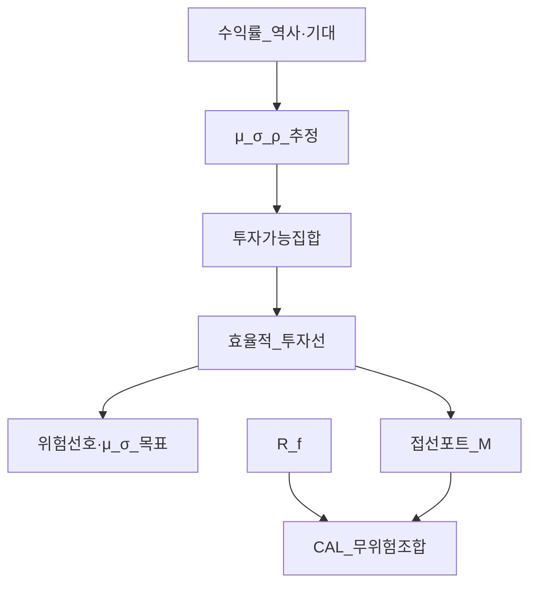
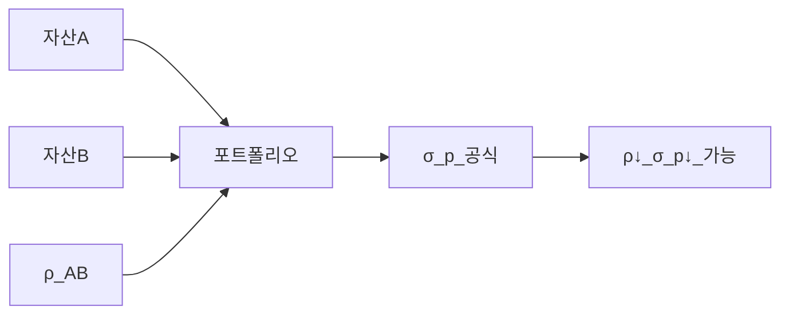
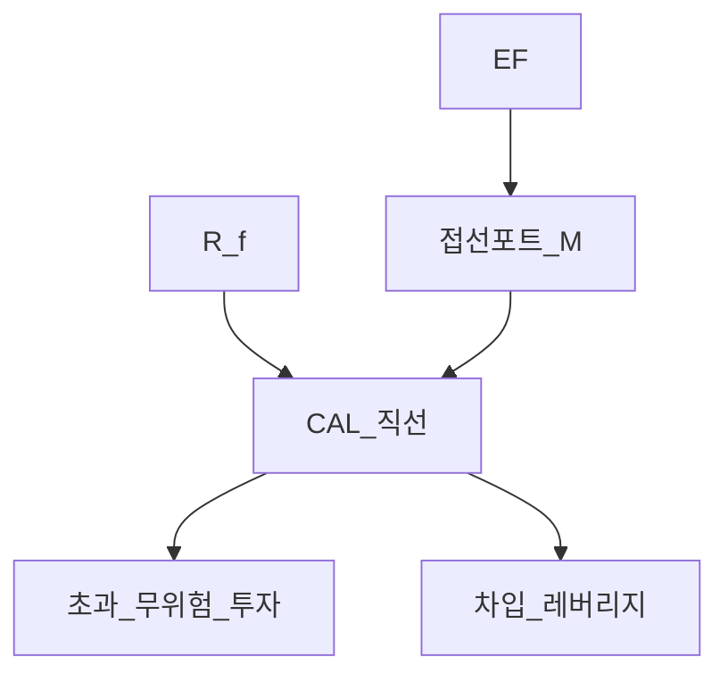

# 포트폴리오 이론 — 평균·분산(MPT)·효율적 투자선·샤프·CAL·접선 포트폴리오

> **면책**: 본 문서는 교육 목적이며, 특정 개인·법인에 대한 투자·세무·법률 자문이 아닙니다. 과거 수익·상관·변동성은 미래를 보장하지 않습니다. 제도·세율·상품 조건은 변경될 수 있으므로 실행 전 공식 출처를 확인하세요.

## 메타

| 항목 | 내용 |
|------|------|
| 최종 검증일 | 2026-05-24 |
| 정책·법령 기준일 | 2025-12-31 확정, 2026 ISA·연금 확대안 별도 |
| 난이도 | L4 (Graduate) — [READER-GUIDE](../docs/READER-GUIDE.md) |
| 예상 읽기 시간 | 150~180분 |
| 관련 bucket | Bucket 3 (코어 배분), Bucket 4 (위성·집중) |

## 0. 이 편 읽기 전 (5분)

| 항목 | 내용 |
|------|------|
| **난이도** | L4 (Graduate) — [READER-GUIDE §L등급](../docs/READER-GUIDE.md) |
| **선수** | [compound-interest-and-time-value](../01-foundations/compound-interest-and-time-value.md), [asset-allocation](asset-allocation.md) |
| **이번 편에서 쓰는 기호** | Bucket, 코어, 위성, DCA |
| **복습 한 줄** | L3 선수 편을 먼저 읽으면 수식이 수월함 |

## TL;DR

1. **평균·분산(MPT)** 은 투자자가 **기대수익(평균)** 과 **위험(분산·표준편차)** 만으로 포트폴리오를 평가한다는 1952년 마코위츠 프레임워크다.
2. **두 자산** 포트폴리오의 위험은 **가중 평균이 아니라** **상관계수 ρ** 에 의해 **분산 효과**가 생긴다 — ρ < 1 이면 σ_p 가 단순 가중합보다 작아질 수 있다.
3. **효율적 투자선(EF)** 은 동일 σ 에서 **최대 μ** (또는 동일 μ 에서 **최소 σ**) 인 포트폴리오 집합이다.
4. **샤프 비율** \(S = (μ_p - R_f)/σ_p\) 는 **초과수익 대비 변동성** — 무위험 대비 “기울기” 직관이 핵심이다.
5. **자본배분선(CAL)** 은 **무위험 + 위험자산(또는 위험 포트)** 조합; **접선 포트폴리오** 는 CAL 이 **효율적 투자선에 접하는** 점 — 이후 CAPM·시장 포트폴리오의 출발점이다.

## 1. 한 줄 정의 + 왜 중요한가

**정의**: **현대 포트폴리오 이론(Modern Portfolio Theory, MPT)** 은 위험자산을 **기대수익 μ** 와 **분산 σ²** (또는 표준편차 σ)로 요약하고, **분산(diversification)** 으로 포트폴리오 위험을 줄이며, **효율적 투자선** 위에서 선택하는 **규범적** 투자 프레임이다.

!!! info "Bucket"
    시간·목적별 **자금 슬롯**(0 비상금 → 3 코어 등)

**왜 중요한가**: [asset-allocation.md](asset-allocation.md)에서 “주식 60%·채권 40%”를 정했다면, MPT는 **왜 그 비중이 위험·수익 트레이드오프를 바꾸는지**를 **수식**으로 말해 준다. QQQ·국내 채권·현금을 섞을 때 **상관이 낮을수록** 같은 μ 에서 σ 가 줄어드는지, **샤프**로 코어 vs 위성을 비교하는지 — [passive-vs-active.md](passive-vs-active.md), [capm-and-risk-return.md](../08-advanced/capm-and-risk-return.md)로 이어지는 **문법**이다. Bucket 3 **코어**는 “감당 가능한 σ 안에서 μ 를 최대화”하는 MPT 언어와 정합한다.

## 2. 선수 지식 / 이후 읽을 것

**선수**:
- [compound-interest-and-time-value.md](../01-foundations/compound-interest-and-time-value.md)
- [asset-allocation.md](asset-allocation.md)
- [stocks-equities-intro.md](../03-markets/stocks-equities-intro.md)
- [bonds-fixed-income.md](../03-markets/bonds-fixed-income.md)
- [capm-and-risk-return.md](../08-advanced/capm-and-risk-return.md) — β·체계적 위험 입문

**이후**:
- [risk-management-portfolio.md](risk-management-portfolio.md)
- [performance-measurement.md](performance-measurement.md)
- [factor-investing-primer.md](../08-advanced/factor-investing-primer.md)
- [rebalancing-and-dca.md](rebalancing-and-dca.md)

## 3. 직관·비유

**평균·분산 = 메뉴의 맛과 매운맛**: μ 는 “평균적으로 얼마나 맛있는가(수익)”, σ 는 “한 입마다 얼마나 들쭉날쭉한가(위험)”. 투자자는 **더 맵게(고μ)** 가되 **너무 맵진(고σ)** 않게 조합을 고른다.

**상관 = 두 요리가 동시에 맵아지는가**: 해산물·고기가 **항상 같이 매워지면(ρ≈1)** 섞어도 매운맛(σ)이 잘 안 줄어든다. **한쪽은 순하고 한쪽은 매울 때(ρ 낮음·음수)** 섞으면 **전체 매운맛**이 줄어든다 — 이것이 **분산의 마법**이다.

**효율적 투자선 = 최고의 레시피 곡선**: 같은 매운맛(σ)에서 **가장 맛있는(μ)** 조합만 모은 **경계선**. 그 아래 조합은 **지배(dominated)** — 굳이 선택할 이유가 없다.

**샤프 = “무위험 물 한 잔 대비 맵기당 맛”**: 초과수익(μ−R_f)을 σ 로 나눈 **기울기**. CAL 은 무위험에서 출발해 위험 포트까지 **직선** — 기울기가 곧 샤프.

## 4. 정식 개념·용어

| 용어 | English | 정의 |
|------|------|----------------|
| 기대수익 | Expected return μ | 확률가중 평균 수익률 |
| 분산 | Variance σ² | 수익률 편차의 제곱 평균 |
| 표준편차 | Std dev σ | √σ², 위험의 실무 지표 |
| 공분산 | Covariance Cov | 두 자산 수익률 공동 변동 |
| 상관계수 | Correlation ρ | Cov/(σ_A σ_B), −1~1 |
| 투자가능 집합 | Feasible set | 달성 가능한 (σ, μ) 조합 |
| 효율적 투자선 | Efficient frontier | 지배되지 않는 경계 |
| 지배 | Dominance | 동일·더 낮은 σ 에서 더 높은 μ |
| 무위험자산 | Risk-free R_f | 국채 근사 |
| 샤프 비율 | Sharpe ratio | (μ_p−R_f)/σ_p |
| CAL | Capital allocation line | R_f 와 위험 포트 직선 조합 |
| 접선 포트폴리오 | Tangency portfolio | CAL 과 EF 접점 |
| 레버리지·차입 | Borrowing/lending | R_f 초과·차입으로 CAL 연장 |

## 4a. 핵심 용어 (본문 등장 순)

| 용어 | 한 줄 | 관련 이론 | glossary |
|------|------|------|----------------|
| MPT | μ·σ로 포트를 평가·분산하는 1952 프레임 | Markowitz | — |
| 기대수익 μ | 확률가중 평균 수익률 | 기대값 | — |
| 분산·표준편차 σ | 수익률 변동; 위험 지표 | 위험 | — |
| 상관계수 ρ | 두 자산 공동 변동; 분산 효과 핵심 | 공분산 | — |
| 투자가능 집합 | 달성 가능한 (σ, μ) 조합 | 포트이론 | — |
| 효율적 투자선 | 지배되지 않는 (σ, μ) 경계 | Markowitz | — |
| 지배 | 동일·더 낮은 σ에서 더 높은 μ | 효율성 | — |
| 샤프 비율 | (μ_p−R_f)/σ_p 초과수익 per 위험 | Sharpe | — |
| CAL | R_f와 위험 포트 직선 조합 | Tobin separation | — |
| 접선 포트폴리오 | CAL이 EF에 접하는 최대 샤프 점 | CAPM 출발 | [CAPM](../08-advanced/capm-and-risk-return.md) |
| 무위험자산 R_f | 국채 근사 | 자본시장 | — |
| 레버리지·차입 | R_f 초과·차입으로 CAL 연장 | 레버리지 | — |

## 4b. 관련 이론 미니맵

- **[자산배분](asset-allocation.md)** — MPT를 실행 비중(60/40 등)으로
- **[CAPM](../08-advanced/capm-and-risk-return.md)** — 접선 포트·β·시장 포트
- **[성과 측정](performance-measurement.md)** — 샤프·IR·벤치 비교
- **[리스크 관리](risk-management-portfolio.md)** — σ·드로다운·한도
- **[팩터 투자](../08-advanced/factor-investing-primer.md)** — MPT 이후 α·팩터 확장

## 5. 메커니즘

### 5.1 MPT 의사결정 흐름

### 5.2 분산과 상관

### 5.3 CAL 과 접선

## 6. 수식·모델

### 6.1 단일 자산

수익률 \(r_i\), 기대수익 \(μ_i = E[r_i]\), 분산 \(σ_i^2 = Var(r_i)\).

### 6.2 두 자산 포트폴리오 (핵심 유도)

비중 \(w_A, w_B\), \(w_A + w_B = 1\).

**기대수익** (선형):

| 기호 | 이름 | 이 식에서 의미 |
|------|------|----------------|
| \(r\) | 할인율·수익률 | 기간당 이자·요구수익률 |
| \(n\) | 기간 | 연·월 등 복리·할인에 쓰는 횟수 |
| \(PV\) | 현재가치 | 오늘 시점으로 환산한 금액 |
| \(FV\) | 미래가치 | 미래 시점의 목표·결과 금액 |

\[
μ_p = w_A μ_A + w_B μ_B
\]

**읽는 법**: **p**와 **w**의 관계를 위 식으로 쓴다. 경제·재무 해석은 변수표 「이 식에서 의미」와 [DEPTH-STANDARD](../docs/DEPTH-STANDARD.md) 기호 예제를 맞춘다.
**유도 (L4)**:
1. **정의**: **p**, **w**, **A**를 동일 시점·동일 통화로 맞춘다. — 단위 불일치면 식이 무의미해진다.
2. **식 변형**: 양변을 정리해 목표 변수를 한쪽에 둔다. — 할인·복리는 **시점 이동**이 핵심이다.

**분산** (비선형 — 상관 진입):

| 기호 | 이름 | 이 식에서 의미 |
|------|------|----------------|
| \(r\) | 할인율·수익률 | 기간당 이자·요구수익률 |
| \(n\) | 기간 | 연·월 등 복리·할인에 쓰는 횟수 |
| \(PV\) | 현재가치 | 오늘 시점으로 환산한 금액 |
| \(FV\) | 미래가치 | 미래 시점의 목표·결과 금액 |

\[
σ_p^2 = w_A^2 σ_A^2 + w_B^2 σ_B^2 + 2 w_A w_B ρ_{AB} σ_A σ_B
\]

**읽는 법**: **w_A**와 **w_B**의 관계를 위 식으로 쓴다. 경제·재무 해석은 변수표 「이 식에서 의미」와 [DEPTH-STANDARD](../docs/DEPTH-STANDARD.md) 기호 예제를 맞춘다.
**유도 (L4)**:
1. **정의**: **w_A**, **w_B**를 동일 시점·동일 통화로 맞춘다. — 단위 불일치면 식이 무의미해진다.
2. **식 변형**: 양변을 정리해 목표 변수를 한쪽에 둔다. — 할인·복리는 **시점 이동**이 핵심이다.
**표준편차**: \(σ_p = \sqrt{σ_p^2}\).

**직관**: \(ρ_{AB}=1\) 이면 \(σ_p = w_A σ_A + w_B σ_B\) (가중합, 분산 이득 없음). \(ρ_{AB}<1\) 이면 제곱근 안의교차항이 **감소**하여 \(σ_p\) 가 **가중합보다 작을 수** 있다. \(ρ_{AB}=-1\) 이고 적절한 \(w\) 면 이론상 \(σ_p \to 0\) 도 가능(교육용 극단).

**읽는 법**: **r**와 **n**의 관계를 위 식으로 쓴다. 경제·재무 해석은 변수표 「이 식에서 의미」와 [DEPTH-STANDARD](../docs/DEPTH-STANDARD.md) 기호 예제를 맞춘다.
**유도 (L4)**:
1. **정의**: **r**, **n**, **PV**를 동일 시점·동일 통화로 맞춘다. — 단위 불일치면 식이 무의미해진다.
2. **식 변형**: 양변을 정리해 목표 변수를 한쪽에 둔다. — 할인·복리는 **시점 이동**이 핵심이다.

### 6.3 N 자산 일반화

| 기호 | 이름 | 이 식에서 의미 |
|------|------|----------------|
| \(r\) | 할인율·수익률 | 기간당 이자·요구수익률 |
| \(n\) | 기간 | 연·월 등 복리·할인에 쓰는 횟수 |
| \(PV\) | 현재가치 | 오늘 시점으로 환산한 금액 |

\[
σ_c = w σ_P \quad (\text{ρ}(r_f, r_P)=0 \text{ 가정})
\]

**읽는 법**: **r_f**와 **r_P**의 관계를 위 식으로 쓴다. 경제·재무 해석은 변수표 「이 식에서 의미」와 [DEPTH-STANDARD](../docs/DEPTH-STANDARD.md) 기호 예제를 맞춘다.
**유도 (L4)**:
1. **정의**: **r_f**, **r_P**를 동일 시점·동일 통화로 맞춘다. — 단위 불일치면 식이 무의미해진다.
2. **식 변형**: 양변을 정리해 목표 변수를 한쪽에 둔다. — 할인·복리는 **시점 이동**이 핵심이다.

**차입**: \(w>1\) → 레버리지 CAL **연장**. [leveraged-etf-qqq-qld.md](leveraged-etf-qqq-qld.md)의 **일일 리셋** 레버리지는 이 단순 CAL 과 **다름** — 오용 금지.

### 6.7 접선 포트폴리오와 CAPM 다리

접선 포트 **M** 에서 CAL 기울기 최대 → 이후 **CAPM**에서 모든 투자자가 동일 **M** 을 보유(동질 기대·균형)하면 **시장 포트폴리오** = M. 본 문서는 **소개**만 — [capm-and-risk-return.md](../08-advanced/capm-and-risk-return.md).

---

할(§4·본문 참고) |Lagrange → **EF** 한 가지 \(μ\) 당 하나의 **최소분산 포트**.

### 6.5 샤프 비율 — 유도 직관

**정의**:

| 기호 | 이름 | 이 식에서 의미 |
|------|------|----------------|
| \(R_f}\) | 무위험금리 | 국채·예금 등 기준 금리 |

\[
S_p = \frac{μ_p - R_f}{σ_p}
\]

**읽는 법**: **S_p**와 **R_f**의 관계를 위 식으로 쓴다. 경제·재무 해석은 변수표 「이 식에서 의미」와 [DEPTH-STANDARD](../docs/DEPTH-STANDARD.md) 기호 예제를 맞춘다.
**유도 (L4)**:
1. **정의**: **S_p**, **R_f**를 동일 시점·동일 통화로 맞춘다. — 단위 불일치면 식이 무의미해진다.
2. **식 변형**: 양변을 정리해 목표 변수를 한쪽에 둔다. — 할인·복리는 **시점 이동**이 핵심이다.

**기하학적 직관**: μ–σ 평면에서 점 \((σ_p, μ_p)\) 와 \((0, R_f)
| 기호 | 이름 | 이 식에서 의미 |
|------|------|----------------|
| \(R_f\) | 무위험금리 | 국채·예금 등 기준 금리 |
| \(M\) | 월 실수령 | 가계 교육용 월 세후 소득 기호 |
| \(P\) | 포트 규모 | 가상 포트폴리오 규모(만 원) |

\) 를 잇는 직선의 **기울기**가 \(S_p\) 이다. 같은 \(σ\) 에서 \(μ\) 가 높을수록, 같은 \(μ\) 에서 \(σ\) 가 낮을수록 샤프가 **커진다**.

**최적화 연결**: 무위험자산 존재 시, **EF 위에서 샤프를 최대화**하는 포트가 **접선 포트폴리오 M**. CAL 은 \((0,R_f)\) 에서 \((σ_M, μ_M)\) 까지의 직선이며, 기울기 \(S_M = (μ_M - R_f)/σ_M\) 이 **모든 위험 포트 중 최대** (동일 가정 하).

**왜 분모가 σ 인가 (교육)**: Markowitz는 **분산**을 위험으로 두었고, 정규분포 가정·2차 효용 하에서 **평균·분산**만으로 선호가 표현된다. 실무에서는 **하방 위험**·Sortino 등 보완 — [performance-measurement.md](performance-measurement.md).

### 6.6 CAL (자본배분선)

위험 포트 \(P\) (비중 \(w\), \(1-w\) 는 무위험):

| 기호 | 이름 | 이 식에서 의미 |
|------|------|----------------|
| \(r\) | 할인율·수익률 | 기간당 이자·요구수익률 |
| \(n\) | 기간 | 연·월 등 복리·할인에 쓰는 횟수 |
| \(PV\) | 현재가치 | 오늘 시점으로 환산한 금액 |

\[
μ_c = (1-w) R_f + w μ_P
\]

**읽는 법**: **r**와 **n**의 관계를 위 식으로 쓴다. 경제·재무 해석은 변수표 「이 식에서 의미」와 [DEPTH-STANDARD](../docs/DEPTH-STANDARD.md) 기호 예제를 맞춘다.
**유도 (L4)**:
1. **정의**: **r**, **n**, **PV**를 동일 시점·동일 통화로 맞춘다. — 단위 불일치면 식이 무의미해진다.
2. **식 변형**: 양변을 정리해 목표 변수를 한쪽에 둔다. — 할인·복리는 **시점 이동**이 핵심이다.
| 기호 | 이름 | 이 식에서 의미 |
|------|------|----------------|
| \(r_f\) | r f | 국채·예금 등 기준 금리 |
|------|------|----------------|

\[
σ_c = w σ_P \quad (\text{ρ}(r_f, r_P)=0 \text{ 가정})
\]

**읽는 법**: **r_f**와 **r_P**의 관계를 위 식으로 쓴다. 경제·재무 해석은 변수표 「이 식에서 의미」와 [DEPTH-STANDARD](../docs/DEPTH-STANDARD.md) 기호 예제를 맞춘다.
**유도 (L4)**:
1. **정의**: **r_f**, **r_P**를 동일 시점·동일 통화로 맞춘다. — 단위 불일치면 식이 무의미해진다.
2. **식 변형**: 양변을 정리해 목표 변수를 한쪽에 둔다. — 할인·복리는 **시점 이동**이 핵심이다.

**차입**: \(w>1\) → 레버리지 CAL **연장**. [leveraged-etf-qqq-qld.md](leveraged-etf-qqq-qld.md)의 **일일 리셋** 레버리지는 이 단순 CAL 과 **다름** — 오용 금지.

### 6.7 접선 포트폴리오와 CAPM 다리

접선 포트 **M** 에서 CAL 기울기 최대 → 이후 **CAPM**에서 모든 투자자가 동일 **M** 을 보유(동질 기대·균형)하면 **시장 포트폴리오** = M. 본 문서는 **소개**만 — [capm-and-risk-return.md](../08-advanced/capm-and-risk-return.md).

## 7. 한국 적용

### 7.1 코어 자산과 ρ (교육용)

| 조합(가상) | ρ 대략 | Bucket | MPT 함의 |
|------|------|------|----------------|
| KOSPI200 + 미국채 | 0~0.3 | 3 | σ_p ↓, EF 이동 |
| QQQ + TLT(장채) | 0~0.2 | 3 | 성장+금리 헤지 |
| QQQ + 국내 반도체 1종 | 0.6~0.9 | 4 | **분산 한계** |
| 코스닥 소형 다수 | 상호 0.5+ | 4 | 비체계적 일부만 제거 |

### 7.2 2025 vs 2026 맥락

| 항목 | 2025 | 2026 (예정·논의) | MPT 실무 |
|------|------|------|----------------|
| ISA 한도 | 확정 | 확대안 | 리밸런싱으로 **w** 유지 |
| IRP·DC | 확정 | 세제 연계 | 코어 **μ, σ** 목표 |
| NXT·장후 | 거래 인프라 | — | MPT와 무관, **행동** 리스크 ↑ |
| 환율 | 변동 | — | 해외 ETF **Σ** 추정 시 **환헤지** 분리 |

**법·정책**: 본 장은 **세제 자문 아님**. [isa.md](../06-korea-policy/isa.md), [irp.md](../06-korea-policy/irp.md)는 **통(bucket)** 만 연결.

### 7.3 DB 가입자

회사 DB는 개인이 **w** 를 정하지 못함 — MPT는 **ISA·IRP(Bucket 2b~3)** 의 코어 설계에 적용. DB는 **인적자본·확정급여**로 별도 시트.

### 7.4 한국 투자자 함정

- **국내 주식만**: EF 가 **좁음** — [geographic-diversification.md](geographic-diversification.md).
- **원화 표시 σ**: 해외 자산은 **환율 변동**이 Σ 에 포함 — 헤지 여부 명시.
- **백테스트 μ**: 과거 최고의 **w** 는 **미래 EF** 가 아님 — [passive-vs-active.md](passive-vs-active.md).

## 8. 가상 숫자 예제

### 예제 1 — 두 자산: 주식·채권

| | μ (연) | σ (연) |
|------|------|----------------|
| A 주식 | 8% | 18% |
| B 채권 | 4% | 6% |
|------|------|----------------|
**50:50** (\(w_A=0.5\)):

\(μ_p = 0.5×8 + 0.5×4 = 6\%\)

\(σ_p^2 = 0.25×0.18^2 + 0.25×0.06^2 + 2×0.5×0.5×0.2×0.18×0.06 = 0.008109 + 0.000225 + 0.00216 ≈ 0.010494\)

\(σ_p ≈ 10.24\%\)

**가중합 σ**: \(0.5×18 + 0.5×6 = 12\%\) → **분산으로 1.76%p 감소** (가상).

**샤프** (\(R_f=3\%\)): \(S_p = (6-3)/10.24 ≈ 0.29\). 주식 단독 \(S_A = (8-3)/18 ≈ 0.28\) — 이 숫자에서는 **혼합이 샤프 소폭 개선** (ρ·σ 가정에 민감).

### 예제 2 — ρ 가 EF 모양을 바꿈

동일 \(μ_A, μ_B, σ_A, σ_B\), **ρ=0.8** vs **ρ=0.2** → 후자의 **최소분산 포트** σ 가 더 낮음. 그래프상 EF 가 **왼쪽(저σ)** 으로 볼록해짐.

### 예제 3 — 접선·CAL (교육)

\(R_f=3\%\), EF 위 포트 M: \(μ_M=9\%\), \(σ_M=14\%\) → \(S_M = 6/14 ≈ 0.43\).

투자자가 **σ 목표 10%**: CAL 상 \(σ_c = w σ_M\) → \(w = 10/14 ≈ 71\%\) 위험, 29% 무위험.

\(μ_c = 0.29×3 + 0.71×9 ≈ 7.26\%\).

**차입** \(w=1.2\): \(σ_c=16.8\%\), \(μ_c=10.2\%\) — 교육용, 실제 차입·레버리지 ETF 비용·경로 의존 별도.

## 9. FAQ (8+)

**Q1. MPT는 “수익 최대화”인가?**  
아니다. **μ–σ 트레이드오프** — 위험 감수량에 따라 **EF 위** 최적점이 달라진다.

**Q2. 왜 분산만으로 위험이 안 없어지나?**  
\(ρ=1\) 이고 동일 섹터면 **체계적** 위험만 남는다 — [risk-management-portfolio.md](risk-management-portfolio.md).

**Q3. 공매도·레버리지 없이 EF 가 달라지나?**  
\(w_i \ge 0\) 제약 시 **EF** 가 **단축** — 일부 (σ, μ) 조합 불가.

**Q4. μ 를 과거 평균으로 쓰면?**  
**추정 오차**·**체제 변화** — 전진 μ·블랙-리터만 등은 심화. 코어는 **지수·장기 프리미엄** 가정 + 보수적 σ.

**Q5. 샤프가 높으면 무조건 좋은가?**  
표본 **샤프** 는 불확실. **Sortino·정보 비율**·벤치마크 맥락 필요 — [performance-measurement.md](performance-measurement.md).

**Q6. 접선 포트 = QQQ 100%?**  
아니다. **M** 은 추정된 **Σ, μ** 에 따른 **최적 혼합** — 실무에선 **시장가중 지수** 근사.

**Q7. CAL 과 60/40 관계?**  
60/40은 **전략적 배분** 예시; CAL 은 **R_f 축** 포함 **동적** 무위험 조합 **기하학**.

**Q8. 암호화폐·QLD를 EF 에 넣으면?**  
**비정상·비선형·꼬리** — MPT 가정 **위반**. Bucket 4 **별도 리스크 예산**.

**Q9. 한국 ISA 안에서 EF 최적화?**  
가능하나 **거래비용·세금(분리과세 등)** 은 목적함수에 **비용 항** 추가 — 단순 MPT 초과.

**Q10. μ–σ 대신 CVaR?**  
기관·규제 — 개인 교육은 MPT **문법** 후 **하방** 지표 확장.

## 10. 함정·리스크

| 함정 | 설명 | 대응 |
|------|------|----------------|
| 역사적 μ·Σ | 과최적화 | 보수적 가정·리밸런싱 |
| 정규성 가정 | 꼬리·비대칭 | MDD·스트레스 — 리스크 장 |
| 상관 급등 | 위기 시 ρ→1 | 채권·금·현금 **밴드** |
| 접선 포트 착각 | “한 종목이 정답” | 코어 **다자산** |
| 레버리지 단순화 | CAL ≠ QLD | 별도 문서 |
| 행동 편향 | EF 밖 거래 | [behavioral-finance-complete.md](../05-behavioral/behavioral-finance-complete.md) |

---

**Q. 실무에서는?**  
교과서 식·기호를 그대로 적용하기 전에 **수수료·세금·데이터 시점**을 분리한다. 숫자는 [DEPTH-STANDARD](../docs/DEPTH-STANDARD.md)처럼 기호만 먼저 맞추고, 법령·시장 수치는 §8 표·외부 출처로 갱신한다.

## 11. 심화 읽기

- Markowitz (1952) — Portfolio Selection  
- Sharpe (1964) — CAPM  
- Bodie, Kane, Marcus — *Investments* (EF·CAL 장)  
- Elton, Gruber — *Modern Portfolio Theory and Investment Analysis*  
- 본 저장소: [capm-and-risk-return.md](../08-advanced/capm-and-risk-return.md), [factor-investing-primer.md](../08-advanced/factor-investing-primer.md)

## 연습문제 (L4, 기호)

1. 위 §6 주요 식에서 변수 하나를 미지로 두고, 나머지를 기호로 둔 **관계식**을 쓰시오.
2. 가정이 깨질 때(유동성·세금·다중 IRR 등) 위 식의 **한계**를 기호·부등식으로 서술하시오.
3. §8 예제와 동일 기호(M·P·PV 등)로 **부호·단조성**만 검증하는 짧은 논증을 하시오.

### 해설 키

1. 직전 변수표의 「이 식에서 의미」를 이용해 동일 차원으로 정리한다.
2. 「가정이 깨지면」 절의 한계 사례와 연결한다.
3. 숫자 대입 없이 **부호**·**단위** 일치만 확인한다.
## 12. 퀴즈·연습

1. \(σ_A=20\%, σ_B=10\%, ρ=0.5, w_A=0.6\) 일 때 \(σ_p\) 를 계산하라.  
2. ρ 가 1→0 으로 갈 때 **동일 μ** 에서 \(σ_p\) 는 어떻게 되는가? 그래프로 설명.  
3. \(R_f=2\%, μ_p=7\%, σ_p=15\%\) 의 샤프를 구하고, \(S=0.4\) 인 포트의 필요 \(μ\) (σ=15% 고정)를 구하라.  
4. 공매도 금지가 EF 에 미치는 영향을 한 단락으로 쓰라.  
5. 가상의 QQQ+국채 포트에서 **ρ 추정 오류**가 샤프 순위를 뒤집을 수 있는 시나리오를 쓰라.

**정답 힌트**: (1) ≈13.4% (2) σ_p 감소·EF 좌측 (3) S≈0.33, μ=8% (4) 단축 (5) 위기 시 ρ 상승.

## 부록 A — μ–σ 평면과 무차별곡선 (교육)

**효용** \(U = U(μ, σ)\) — 위험 회피 투자자는 **무차별곡선**이 **EF 에 접하는** 점을 선택. 곡선이 가파를수록 **위험 회피** 높음. **실무**: 설문·MDD 한도로 **간접** 추정 — [time-horizon-and-buckets.md](time-horizon-and-buckets.md).

## 부록 B — 3자산 이상 EF 구성 (개념)

자산 3개면 **투자가능 집합**이 μ–σ 평면에서 **영역** → 경계가 **EF**. 계산은 **최적화** 소프트웨어 — 개인은 **지수 2~4개**로 **근사**.

## 부록 C — 블랙-리터만·베이지안 (한 줄)

시장 균형 수익 + **뷰** 반영 — **μ 추정** 개선 논의. L4 **인지** 수준, 구현은 심화 과정.

## 부록 D — 한국 코스피·채권 장기 상관 (교육)

금리 **급등** 구간(가상 2022 스타일) 채권 σ↑, 주식 동반 하락 시 **ρ** 부호·크기 **변화** — 60/40 **동시 타격**. **대응**: 만기·크레딧·현금 **밴드**, [macro-02-money-inflation.md](../02-economics/macro-02-money-inflation.md).

## 부록 E — 코어-위성과 MPT

[core-satellite-framework.md](core-satellite-framework.md): 코어 85%는 **EF 근처** 저비용 다자산, 위성 15%는 **EF 밖** 베팅 — **전체** \(μ_p, σ_p\) 는 가중합이 아니라 **공분산** 필요.

## 부록 F — 연습: EF 위 포트 비교 (가상)

| 포트 | μ | σ | S (Rf=3%) |
|------|------|------|----------------|
| P1 | 7% | 12% | 0.33 |
| P2 | 9% | 18% | 0.33 |
| P3 | 8% | 14% | 0.36 |

P3 가 **동일 S** 에서 중간 μ·σ — 위험 선호에 따라 P1 vs P2 vs P3 선택. **위성 추가** 시 P3 대비 **σ 급증** 여부 점검.

## 부록 G — MPT와 패시브 인덱싱

**시장가중**은 거래비용·정보 비대칭 하 **실용적 M**. [passive-vs-active.md](passive-vs-active.md): 액티브는 **α** 베팅 = EF **내부**가 아닌 **정보** 가정.

## 부록 H — 학습 로드맵

**주 12시간**: §6 손계산 3h, 예제 2h, mermaid 복기 1h, 퀴즈 2h, [risk-management-portfolio.md](risk-management-portfolio.md) 4h. **병행**: 증권사 포트폴리오 분석기에서 **2자산 ρ** 슬라이더 실험(교육).

## 부록 I — 공분산 행렬·최적화 (개념)

**3자산** 이상에서 **최소분산·최대 Sharpe** 는 **2차 계획** — Lagrange \(\mathcal{L} = \mathbf{w}'\boldsymbol{Σ}\mathbf{w} - \lambda(\mathbf{w}'\mathbf{1}-1) - \gamma(\mathbf{w}'\boldsymbol{μ}-\bar{μ})\). **해**: \(\mathbf{w} \propto \boldsymbol{Σ}^{-1}(\boldsymbol{μ} - \lambda \mathbf{1})\) 형태(교육, 제약 없음). **공매도 금지** 시 **수치 해** — 개인은 **지수 3~4개**로 **근사**.

## 부록 J — Tobin 분리·두 단계 (교육)

**1단계**: 위험자산만으로 **EF·접선 M**. **2단계**: \(R_f\) 와 **CAL** 로 **위험 선호** — **μ, Σ 추정**과 **위험 감수** **분리** (이상적). **실무**: [time-horizon-and-buckets.md](time-horizon-and-buckets.md)가 **2단계** 규칙.

## 부록 K — 한계·Black-Litterman 한 줄

**μ 추정 오류**가 **w** 에 **증폭** — **시장가중**·**블랙-리터만**은 **균형 수익 + 뷰**. L4 **인지** — 구현은 심화.

## 부록 L — 연습: 3자산 최소분산 (가상)

\(μ_A=8\%, μ_B=5\%, μ_C=4\%\), 대각 σ 18%, 8%, 6%, ρ 모두 0.3 — **스프레드시트** Solver로 **σ_p** 최소 **w** (교육). **결과**와 **동일 비중** Sharpe **비교**.

---

**L4 완료 기준**: [TEMPLATE](../docs/TEMPLATE.md) 12블록·FAQ 8+·검증일 2026-05-24 — [DEPTH-STANDARD](../docs/DEPTH-STANDARD.md).