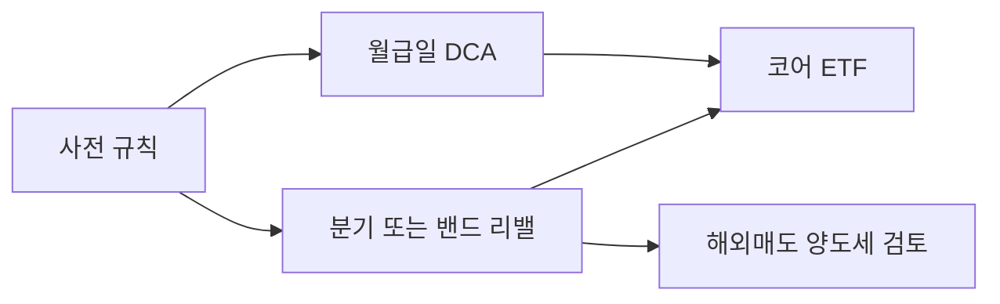
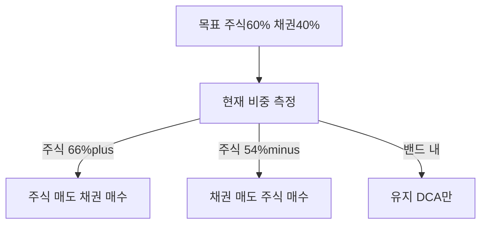

# 리밸런싱과 DCA — 적립식·밴드·해외 양도세·한국 ISA 완전 가이드

> **면책**: 본 문서는 교육 목적이며, 특정 개인·법인에 대한 투자·세무·법률 자문이 아닙니다. 제도·세율·상품 조건은 변경될 수 있으므로 실행 전 공식 출처를 확인하세요.

## 메타

| 항목 | 내용 |
|------|------|
| 최종 검증일 | 2026-05-24 |
| 정책·법령 기준일 | 2025-12-31 확정, 2026 ISA 확대안 별도 |
| 난이도 | L3 (Deep) — [READER-GUIDE](../docs/READER-GUIDE.md) |
| 예상 읽기 시간 | 55~70분 |
| 관련 bucket | Bucket 2b~3 (DCA·리밸런싱 실행), Bucket 4 (위성 상한) |

## 0. 이 편 읽기 전 (5분)

| 항목 | 내용 |
|------|------|
| **난이도** | L3 (Deep) — [READER-GUIDE §L등급](../docs/READER-GUIDE.md) |
| **선수** | [asset-allocation](asset-allocation.md), [core-satellite-framework](core-satellite-framework.md) |
| **이번 편에서 쓰는 기호** | 본문 §4·§4a 표 참고 |
| **복습 한 줄** | — |

## TL;DR

1. **DCA(Dollar-Cost Averaging)** 는 일정 금액을 **시간에 나눠 매수**해 **타이밍 리스크**와 **행동 편향**을 줄이는 적립식 방법입니다.
2. **리밸런싱**은 [asset-allocation.md](asset-allocation.md) **목표 비중**에서 벗어난(drft) 포트를 **되돌리는** 규칙적 매매 — 고평가 자산 **일부 매도** 포함.
3. **밴드 규칙**(예: 목표 ±5%p) 또는 **달력**(분기·반기·연 1회)을 **사전에** 정해 **감정 배제** — [fomo-and-trading-hours.md](../05-behavioral/fomo-and-trading-hours.md).
4. **한국**: 청년도약·ISA 납입 **정책 우선** → 코어 ETF DCA. **해외 ETF 매도** 시 **양도세** — [overseas-stocks-tax-part1-cgt.md](../06-korea-policy/tax/overseas-stocks-tax-part1-cgt.md).
5. **위성 20% 상한** 초과 시 **리밸런싱 = 위성 축소** — QLD는 코어 리밸런싱 대상 **아님**.

## 1. 한 줄 정의 + 왜 중요한가
!!! info "DB (Defined Benefit)"
    확정급여형 퇴직연금.

!!! info "DC (Defined Contribution)"
    확정기여형 퇴직연금.

**정의**: **DCA**는 가용 현금을 **주기적으로** 투자에 투입하는 방식이고, **리밸런싱**은 목표 **자산배분·코어-위성 비율**을 유지하기 위해 자산군·종목 간 **매수·매도를 규칙적으로** 조정하는 방식입니다.

!!! info "Bucket (Time bucket)"
    목적·기간별 자금 슬롯.

**왜 중요한가**: “QQQ 샀다”로 끝나면 **1년 후 QQQ 85%** 같은 **드리프트**가 옵니다. DCA만 하고 리밸런싱이 없으면 **위험 집중**, 리밸런싱만 잦으면 **해외 양도세·수수료**가 누적됩니다. [core-satellite-framework.md](core-satellite-framework.md) 80/20과 [asset-allocation.md](asset-allocation.md) 60/40을 **실제로 지키는** 실행 계층입니다.

## 2. 선수 지식 / 이후 읽을 것

**선수**:
- [asset-allocation.md](asset-allocation.md)
- [core-satellite-framework.md](core-satellite-framework.md)
- [etf-index-funds.md](../03-markets/etf-index-funds.md)

**이후**:
- [passive-vs-active.md](passive-vs-active.md)
- [overseas-stocks-tax-part3-scenarios.md](../06-korea-policy/tax/overseas-stocks-tax-part3-scenarios.md)
- [isa-irp-pension-tax.md](../06-korea-policy/tax/isa-irp-pension-tax.md)

## 3. 직관·비유

**DCA = 매달 치킨 먹듯 주식도 정기적으로 사는 것.** 치킨값이 오르거나 내리거나 매달 정해진 날에 삽니다. 2020년 3월 코로나 폭락 때 QQQ가 −30% 넘게 빠졌을 때, DCA를 유지한 투자자는 같은 금액으로 **더 많은 주수**를 살 수 있었습니다. 반대로 공포에 팔거나 매수를 멈춘 투자자는 그 해 연말 나스닥 급반등 이익의 상당 부분을 놓쳤습니다. **핵심은:** DCA는 시장 예측을 포기하고 규칙에 맡기는 행동 장치입니다.

**리밸런싱** = **체중계에 올라가며** 늘어난 위성(지방)을 줄이는 것. QQQ가 급등해 "주식 85%"가 되면 **채권을 사고 주식 일부 판다** — **역행**이지만 **규칙**이면 감정 개입 ↓. **실제로는:** 2021년 나스닥 급등 후 채권 비중이 10%대로 줄어든 투자자가 많았습니다. 리밸런싱 없이 방치하면 사실상 **위험 수준이 몰래 올라간 채로** 다음 조정을 맞는 셈입니다. 리밸런싱은 FOMO 억제 장치이기도 합니다 — "지금 주식이 뜨겁다"는 느낌에도 규칙이 "아직 밴드 내"라고 말해 줍니다.

**밴드** = "목표 60% ± 5%" — **65% 넘을 때만** 손대기. **매일 저울**은 피로·세금. **쉽게 말하면:** ±5%p 룰은 "어차피 다시 맞춰야 하는 임계치"입니다. ±1%p는 거래 빈도·세금이 올라가고, ±20%p는 리밸런싱 의미가 없어집니다.

**DCA vs 일시 투자(lump sum) 논쟁:** 통계적으로 일시 투자가 장기 기대값에서 우위라는 연구도 있지만, **심리적 안정성**과 **유동성 관리** 면에서 DCA가 한국 급여생활자에게 더 현실적입니다. 매달 급여일에 ISA 코어 ETF를 자동 매수로 설정하면 시장을 매일 볼 이유가 없습니다.

**해외 양도세** = 리밸런싱 **매도**가 **세금 이벤트** — ISA **3년·손익통산** vs 일반계좌 **22%** 차이.

## 4. 정식 개념·용어

| 용어 | 한글 | English | 정의 |
|------|------|------|----------------|
| DCA | 적립식 | Dollar-cost averaging | 정기 정액 매수 |
| 리밸런싱 | — | Rebalancing | 목표 비중 복원 |
| Drift | 드리프트 | — | 목표 대비 실제 이탈 |
| Band | 밴드 | — | 허용 편차 (±5%p 등) |
| Lump sum | 일시 투자 | — | 한 번에 투입 |
| Calendar rebal | 달력 리밸 | — | 분기·연 1회 |
| Threshold rebal | 임계 리밸 | — | 밴드 이탈 시 |

### 4a. 핵심 용어 (본문 등장 순)

> 복습용. 정의는 §4 본표·[glossary](../00-roadmap/glossary.md)·본문 `!!! info` 박스.

| 용어 | 한 줄 | 관련 이론 | glossary |
|------|------|------|----------------|
| DCA | 정기 정액 매수 | §4 | [glossary](../00-roadmap/glossary.md#dca) |
| 리밸런싱 | 목표 비중 복원 | §4 | [glossary](../00-roadmap/glossary.md#리밸런싱) |
| Drift | 목표 대비 실제 이탈 | §4 | [glossary](../00-roadmap/glossary.md#drift) |
| Band | 허용 편차 | §4 | [glossary](../00-roadmap/glossary.md#band) |
| Lump sum | 한 번에 투입 | §4 | [glossary](../00-roadmap/glossary.md#lump-sum) |
| Calendar rebal | 분기·연 1회 | §4 | [glossary](../00-roadmap/glossary.md#calendar-rebal) |
| Threshold rebal | 밴드 이탈 시 | §4 | [glossary](../00-roadmap/glossary.md#threshold-rebal) |

## 5. 메커니즘

### 5.1 DCA + 리밸런싱 루프

### 5.2 밴드 리밸런싱

### 5.3 한국 실행 순서 (교육용)

1. **Bucket 0~1** — 비상금·정책 납입  
2. **ISA·IRP DCA** — 코어 ETF  
3. **연 1회 또는 ±5%p** — 리밸런싱  
4. **위성 >20%** — 위성 매도 우선  
5. **5월** — 해외 양도세 신고 — [part1](../06-korea-policy/tax/overseas-stocks-tax-part1-cgt.md)

### 5.4 DCA 설계 실무 (한국)

**급여일 DCA** 템플릿 (가상): (1) **25일** — 청년도약·미래적금(Bucket 1). (2) **26일** — ISA 코어 ETF **70%**, 채권 ETF **30%** 금액 분할 매수. (3) **분기 첫 주** — 비중 측정·밴드 리밸. (4) **5월** — 전년 해외 매도 **양도세** — [overseas-stocks-tax-part3-scenarios.md](../06-korea-policy/tax/overseas-stocks-tax-part3-scenarios.md).

**보너스 lump sum**: [cash-flow-basics.md](../01-foundations/cash-flow-basics.md) — 일부 Bucket 0 보강, 일부 **목표 비중**대로 코어 **한 번에** vs **3개월 분할** — 심리 선택.

### 5.5 리밸런싱 vs DCA — 역할 분담

| | DCA | 리밸런싱 |
|------|------|----------------|
| 방향 | **현금 → 자산** | **자산 ↔ 자산** |
| 빈도 | 월 | 분기·연·밴드 |
| 세금 | 매수 위주 | **매도** 시 해외 양도세 |
| 감정 | 습관 | **규칙**이 고평가 매도 허용 |

**하락장**: DCA는 **저가 추가 매수**. 리밸런싱은 **채권→주식** (주식 비중 **낮을 때**) — “공포에 팔기”가 **아니라** 미리 쓴 규칙.

### 5.6 해외세금과 리밸런싱 트레이드오ff

일반계좌 QQQ **100%→60%** 리밸 시 **이익분 양도세**. **완화**: (1) **ISA** 코어. (2) **밴드 넓히기** (±10%p) — 매매 ↓. (3) **신규 DCA**를 채권 쪽으로 — **매도 없이** 비중 조정 (느리지만 세금 ↓). (4) **손실 종목**과 **이익 종목** 상계는 **종목별** — ISA **손익통산** 활용.

## 6. 수식·모델

**밴드 조건**:

| 기호 | 이름 | 이 식에서 의미 |
|------|------|----------------|
| **r** | 할인율·수익률 | 기간당 이자·요구수익률 |
| **n** | 기간 | 연·월 등 복리·할인에 쓰는 횟수 |
| **PV** | 현재가치 | 오늘 시점으로 환산한 금액 |
| **FV** | 미래가치 | 미래 시점의 목표·결과 금액 |

**읽는 법**: **w**와 **band**의 관계를 위 식으로 쓴다. 경제·재무 해석은 변수표 「이 식에서 의미」와 [DEPTH-STANDARD](../docs/DEPTH-STANDARD.md) 기호 예제를 맞춘다.
- \(w\): 현재 주식(또는 위성) 비중  
- \(w^*\): 목표  
- band: 예 **5%p**

**리밸런싱 매도액** (단순):

| 기호 | 이름 | 이 식에서 의미 |
|------|------|----------------|
| **r** | 할인율·수익률 | 기간당 이자·요구수익률 |
| **n** | 기간 | 연·월 등 복리·할인에 쓰는 횟수 |
| **PV** | 현재가치 | 오늘 시점으로 환산한 금액 |

\[
\Delta = V \times (w - w^*)
\]

**식 (기호)**: **Δ**_ = **V** ×(**w** - w^*)

**식 (기호)**: **Δ**_ = **V** ×(**w** - w^*)

**식 (기호)**: **Δ**_ = **V** ×(**w** - w^*)

**읽는 법**: **r**와 **n**의 관계를 위 식으로 쓴다. 경제·재무 해석은 변수표 「이 식에서 의미」와 [DEPTH-STANDARD](../docs/DEPTH-STANDARD.md) 기호 예제를 맞춘다.

**DCA vs Lump sum**: 통계적 우열 **혼재** — **심리·유동성**으로 DCA 선택 합리적.

---

 2025년 기준 (확정)

| 항목 | DCA | 리밸런싱 |
|------|------|----------------|
| **ISA** | 월 적립 **유리** | 3년+ 손익통산 — [isa.md](../06-korea-policy/isa.md) |
| **IRP** | 장기 DCA | 과세이연 |
| **일반 해외** | 가능 | **매도 시 양도세 22%** |
| **국내주식** | 가능 | 매매차익 **비과세**(원칙) |
| **위성 20%** | 별도 | 초과 시 **축소** |

### 7.2 2026년 개편·시행 예정 (해당 시)

| 항목 | 2025 | 2026 (안) |
|------|------|----------------|
| ISA 연 납입 | 2,000만 | 4,000만 |

→ **DCA 금액** 상향 가능. **리밸런싱 규칙**은 유지.

**법·정책 근거**: 소득세법 §104 등 양도소득 — [investment-tax-overview.md](../06-korea-policy/tax/investment-tax-overview.md)

### 7.3 해외 양도세·리밸런싱 시나리오 (2025)

| 계좌 | QQQ 매도 리밸 | 배당 재투자 | 5월 신고 |
|------|------|------|----------------|
| ISA 3년+ | **통산·한도** | 통산 | **간소** |
| IRP | **이연** | 이연 | 수령 시 |

**DCA 캘린더 (가상)**: 매월 25일 Bucket 1 → 26일 ISA **70/30** DCA → 분기 첫 월요일 **밴드 ±5%p** → 매년 5월 **양도세**. [cash-flow-basics.md](../01-foundations/cash-flow-basics.md) 보너스는 0 **50%** + DCA **50%**.

**Q9. 배당 재투자는 DCA?**  
**A9.** **유사** — QQQ 분배금 **채권 쪽** — [overseas-stocks-tax-part2-dividend.md](../06-korea-policy/tax/overseas-stocks-tax-part2-dividend.md).

**Q10. 85/15와 60/40 동시?**  
**A10.** **가능** — 60/40 **자산군**, 85/15 **코어·위성** — [core-satellite-framework.md](core-satellite-framework.md).

## 8. 숫자 예제 (가상)

> 모든 인물·금액은 가상입니다.

### 예제 1: 60/40 + ±5%p 밴드 (가상 A)

| 시점 | 주식 | 채권 | 행동 |
|------|------|------|----------------|
| 시작 | 60% | 40% | — |
| 1년 후 | **67%** | 33% | 주식 **7%p** 초과 → 일부 매도 |
| 2년 후 | 58% | 42% | 밴드 내 → **DCA만** |

### 예제 2: ISA vs 일반 — 리밸런싱 세금 (가상 B)

| 계좌 | QQQ 매도 **M** 이익 | 세금 (가상) |
|------|------|----------------|
| ISA (3년+, 통산) | 손익통산 후 | **한도 내 0~9.9%** |
| 일반 | 양도차익 | **22%** (약 **M**) |

→ **코어 해외**는 ISA 우선 — [account-product-tax-map.md](../06-korea-policy/tax/account-product-tax-map.md).

### 예제 3: 위성 28% → 20% (가상 C)

| | 전 | 후 |
|------|------|----------------|
| 위성 | **M** (28%) | **M** (20%) |
| 행동 | 코스닥·QLD **M** 매도** | 코어 채권·글로벌 **추가** |

## 9. FAQ

**Q1. DCA와 일시 투자(lump sum) 중 무엇이 나은가요?**  
**A1.** 통계적으로는 **lump sum이 약 65~70%의 경우 DCA보다 높은 수익**을 기록합니다(Vanguard 연구). 시장이 장기 우상향한다면 일찍 투자할수록 더 오래 복리가 작동하기 때문입니다. 그러나 **현실적으로 일반 직장인은 매달 급여를 받으므로 DCA가 자동 적용**됩니다. 목돈(예: 퇴직금, 상여금)이 생겼을 때 분할 투자할지 일시 투자할지 고민된다면: 본인의 심리적 손실 내성을 기준으로 결정하세요. "지금 다 투자했다가 당장 20% 빠지면 팔 것 같다" → DCA 3~6개월. "그래도 버틸 수 있다" → 일시 투자.

**Q2. 매달 DCA?**  
**A2.** **급여일 자동이체** 권장.

**Q3. 하락장에 리밸런싱 매도?**  
**A3.** 규칙에 따라 **채권→주식** 가능 — **사전 문서화**.

**Q4. QLD 리밸런싱?**  
**A4.** **위성 상한** 관리 — 코어 **아님**.

**Q5. 해외 ETF 매도 세금?**  
**A5.** **양도세** — ISA·3년 vs 일반 — [part1](../06-korea-policy/tax/overseas-stocks-tax-part1-cgt.md).

**Q6. 리밸런싱 너무 자주?**  
**A6.** **분기·반기·밴드** — 잦으면 세금·비용.

**Q7. DB에서 DCA?**  
**A7.** 재직 **불가** — ISA·IRP DCA.

**Q8. 청년도약과 DCA 순서?**  
**A8.** **Bucket 1** 납입 **우선** — [youth-leap-account.md](../06-korea-policy/youth-leap-account.md).

**Q9. 배당 재투자는 DCA?**  
**A9.** **유사** — [overseas-stocks-tax-part2-dividend.md](../06-korea-policy/tax/overseas-stocks-tax-part2-dividend.md).

**Q10. 85/15와 60/40 동시?**  
**A10.** **가능** — [core-satellite-framework.md](core-satellite-framework.md).

### 실행 체크리스트 (교육용)

- [ ] Bucket 0~2 [time-horizon-and-buckets.md](time-horizon-and-buckets.md)  
- [ ] 코어 80/20 [core-satellite-framework.md](core-satellite-framework.md) — **QLD 코어 금지**  
- [ ] 60/40 또는 개인 목표 [asset-allocation.md](asset-allocation.md)  
- [ ] QQQ+글로벌 [geographic-diversification.md](geographic-diversification.md)  
- [ ] DCA·밴드 [rebalancing-and-dca.md](rebalancing-and-dca.md)  
- [ ] 패시브 코어 [passive-vs-active.md](passive-vs-active.md)  
- [ ] DB → ISA [db-pension.md](../06-korea-policy/db-pension.md)

## 10. 함정·리스크·한계

- **리밸런싱 과다** → 해외 세금·수수료  
- **DCA만** — 목표 비중 없음  
- **상승장**에서 리밸 **미실행** → 100% 주식  
- **ISA 3년 미만** 해지 — 세제 상실  
- **위성** 리밸 없이 **코어 건드림**  
- **5월 신고** 누락

---

**Q. 실무에서는?**  
교과서 식·기호를 그대로 적용하기 전에 **수수료·세금·데이터 시점**을 분리한다. 숫자는 [DEPTH-STANDARD](../docs/DEPTH-STANDARD.md)처럼 기호만 먼저 맞추고, 법령·시장 수치는 §8 표·외부 출처로 갱신한다.

## 11. 심화 읽기

- [references/sources.md](../references/sources.md)
- [overseas-stocks-tax-part2-dividend.md](../06-korea-policy/tax/overseas-stocks-tax-part2-dividend.md)
- [core-satellite-framework.md](core-satellite-framework.md)

## 12. 스스로 점검 퀴즈

1. DCA의 주요 목적?  
2. 밴드 5%p, 목표 60%, 현재 67%?  
3. 위성 28% 목표 20%?  
4. 해외 QQQ 리밸런싱 매도 세금 — ISA vs 일반?  
5. QLD는 코어 리밸 대상?

??? note "정답 힌트"

    1. 타이밍·행동 분산 · 2. 리밸(주식 매도) · 3. 위성 800만 축소 · 4. ISA 유리 · 5. 아니오(위성)