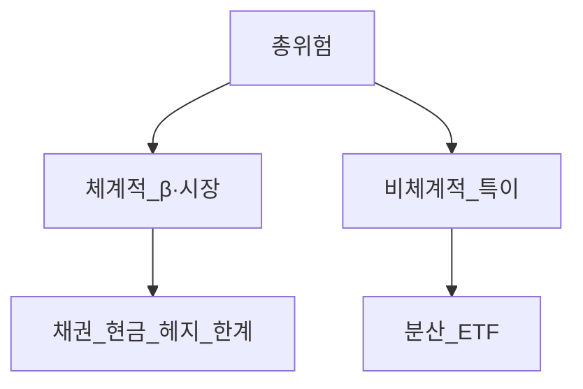
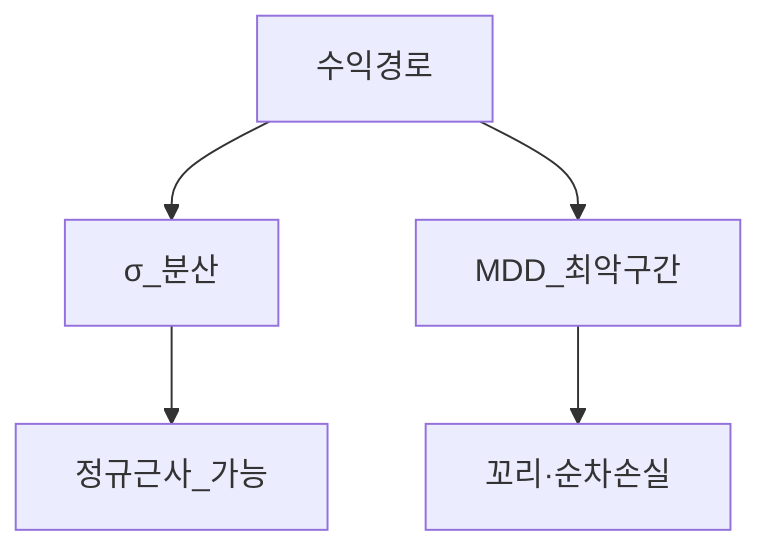

# 포트폴리오 리스크 관리 — 체계적·비체계적·β·MDD·포지션·Kelly·VaR·스트레스

> **면책**: 본 문서는 교육 목적이며, 특정 개인·법인에 대한 투자·세무·법률 자문이 아닙니다. VaR·스트레스 시나리오는 모형 한계가 있으며, 과거 데이터는 미래 손실을 보장하지 않습니다.

## 메타

| 항목 | 내용 |
|------|------|
| 최종 검증일 | 2026-05-24 |
| 정책·법령 기준일 | 2025-12-31 확정 |
| 난이도 | L4 (Graduate) — [READER-GUIDE](../docs/READER-GUIDE.md) |
| 예상 읽기 시간 | 150~180분 |
| 관련 bucket | Bucket 3~4 (코어 리스크 예산·위성 한도) |

## 0. 이 편 읽기 전 (5분)

| 항목 | 내용 |
|------|------|
| **난이도** | L4 (Graduate) — [READER-GUIDE §L등급](../docs/READER-GUIDE.md) |
| **선수** | [portfolio-theory-mpt](portfolio-theory-mpt.md), [capm-and-risk-return](../08-advanced/capm-and-risk-return.md) |
| **이번 편에서 쓰는 기호** | Bucket, 코어, 위성, DCA |
| **복습 한 줄** | L3 선수 편을 먼저 읽으면 수식이 수월함 |

## TL;DR

1. **체계적 위험**은 시장·금리·환율 등 **공통 요인**; **비체계적(특이) 위험**은 개별 종목·이벤트 — **분산**으로 후자만 줄이기 쉽다.
2. **β** 는 시장(벤치) 수익률 1% 변동 시 자산 **기대 반응** — 포트폴리오 β 는 가중합.
3. **MDD(최대낙폭)** 는 고점 대비 **최대 하락률** — σ 와 다른 “경로” 리스크.
4. **포지션 사이징**은 손실 한도·변동성·상관을 반영한 **비중** — Bucket 4 **상한**과 연결.
5. **Kelly** 는 이론적 **최적 베팅 비율**이나 **추정 오차·꼬리**에 취약 — 실무는 **분수 Kelly·고정 밴드**.
6. **VaR** 은 일정 신뢰수준·기간에서 **초과하지 않을 손실**의 분위수 근사 — **소개** 수준, CVaR·스트레스 보완.

## 1. 한 줄 정의 + 왜 중요한가

**정의**: **포트폴리오 리스크 관리**는 목표 수익을 추구하면서 **감당 가능한 손실·변동·유동성**을 정량화하고, **비중·헤지·현금·리밸런싱**으로 한도 내에 유지하는 **프로세스**다.

!!! info "Bucket"
    시간·목적별 **자금 슬롯**(0 비상금 → 3 코어 등)

!!! info "ETF"
    지수·자산 **바구니**를 한 종목처럼 거래

**왜 중요한가**: [portfolio-theory-mpt.md](portfolio-theory-mpt.md)가 μ–σ 를 주면, 리스크 관리는 **“σ 만으로 충분하지 않을 때”** — 2008·2020·2022처럼 **상관이 1로 몰리는** 구간, **레버리지 ETF** 경로 의존, **코스닥 단일 종목** 폭락을 **MDD·스트레스**로 본다. Bucket 3 **코어**는 β·MDD **예산**; Bucket 4 **위성**은 **포지션 캡**과 **Kelly 과신** 방지.

## 2. 선수 지식 / 이후 읽을 것

**선수**:
- [portfolio-theory-mpt.md](portfolio-theory-mpt.md)
- [capm-and-risk-return.md](../08-advanced/capm-and-risk-return.md)
- [asset-allocation.md](asset-allocation.md)
- [core-satellite-framework.md](core-satellite-framework.md)

**이후**:
- [performance-measurement.md](performance-measurement.md)
- [leveraged-etf-qqq-qld.md](leveraged-etf-qqq-qld.md)
- [behavioral-finance-complete.md](../05-behavioral/behavioral-finance-complete.md)

## 3. 직관·비유

**체계적 vs 비체계적 = 날씨 vs 개인 우산**: **태풍(시장)** 은 모두 맞는다 — 우산(분산)으로 **완전 차단 불가**. **개인 우산 찢김(한 종목 부도)** 은 **여러 우산**으로 줄인다.

**β = 파도 높이에 대한 보트 흔들림**: 파도 1m → 보트 β=1.2m. **포트 β** = 보트들의 **가중 평균**.

**MDD = 등산 중 최악의 “되돌아간 깊이”**: 정상 등반(σ)은 매일 조금씩 흔들려도, **절벽 한 번**이 심리·생활비 계획을 깬다 — MDD가 그 **절벽 깊이**.

**Kelly = 도박에서 “이기면 이만큼 벌고 질 때 이만큼 잃을 때” 최적 베팅** — **확률·배당을 정확히 안다**는 가정이 깨지면 **파산 궤적**.

**VaR = “100일 중 5일은 이보다 더 잃을 수 있다”의 문턱** — **그 5일이 얼마나 나쁜지**는 VaR 만으로 모름(CVaR).

## 4. 정식 개념·용어

| 용어 | English | 정의 |
|------|------|----------------|
| 체계적 위험 | Systematic | 시장·공통 요인, 분산으로 제거 어려움 |
| 비체계적 위험 | Idiosyncratic | 개별·특이, 분산으로 감소 가능 |
| β | Beta | \(Cov(r_i,r_m)/Var(r_m)\) |
| α | Alpha | 회귀 잔차·초과(성과 장에서) |
| MDD | Max drawdown | 고점 대비 최대 피크-투-트로프 |
| 드로다운 | Drawdown | 현재 고점 대비 하락률 |
| 포지션 사이징 | Position sizing | 비중·손실 한도 규칙 |
| Kelly | Kelly criterion | 성장률 최대화 베팅 비율 |
| VaR | Value at Risk | 손실 분위수 (예: 95%) |
| CVaR/ES | Expected shortfall | VaR 초과 손실 평균 |
| 스트레스 테스트 | Stress test | 극단 시나리오 손실 |
| 리스크 예산 | Risk budget | σ·β·MDD 등 할당 |
| 상관 급등 | Correlation breakdown | 위기 시 ρ→1 |

### 4a. 핵심 용어 (본문 등장 순)

> 복습용. 정의는 §4 본표·[glossary](../00-roadmap/glossary.md)·본문 `!!! info` 박스.

| 용어 | 한 줄 | 관련 이론 | glossary |
|------|------|------|----------------|
| 체계적 위험 | 시장·공통 요인, 분산으로 제거 어려움 | §4 | [glossary](../00-roadmap/glossary.md#체계적-위험) |
| 비체계적 위험 | 개별·특이, 분산으로 감소 가능 | §4 | [glossary](../00-roadmap/glossary.md#비체계적-위험) |
| β | 시장 대비 민감도 | §4 | [glossary](../00-roadmap/glossary.md#β) |
| α | 회귀 잔차·초과 | §4 | [glossary](../00-roadmap/glossary.md#α) |
| MDD | 고점 대비 최대 피크-투-트로프 | §4 | [glossary](../00-roadmap/glossary.md#mdd) |
| 드로다운 | 현재 고점 대비 하락률 | §4 | [glossary](../00-roadmap/glossary.md#드로다운) |
| 포지션 사이징 | 비중·손실 한도 규칙 | §4 | [glossary](../00-roadmap/glossary.md#포지션-사이징) |
| Kelly | 성장률 최대화 베팅 비율 | §4 | [glossary](../00-roadmap/glossary.md#kelly) |
| VaR | 손실 분위수 | §4 | [glossary](../00-roadmap/glossary.md#var) |
| CVaR/ES | VaR 초과 손실 평균 | §4 | [glossary](../00-roadmap/glossary.md#cvar/es) |
| 스트레스 테스트 | 극단 시나리오 손실 | §4 | [glossary](../00-roadmap/glossary.md#스트레스-테스트) |
| 리스크 예산 | σ·β·MDD 등 할당 | §4 | [glossary](../00-roadmap/glossary.md#리스크-예산) |
| 상관 급등 | 위기 시 ρ→1 | §4 | [glossary](../00-roadmap/glossary.md#상관-급등) |

## 5. 메커니즘

### 5.1 위험 분해

### 5.2 리스크 관리 루프

### 5.3 MDD vs σ

## 6. 수식·모델

### 6.1 체계적·비체계적 (단일 요인)

| 기호 | 이름 | 이 식에서 의미 |
|------|------|----------------|
| **r** | 할인율·수익률 | 기간당 이자·요구수익률 |
| **n** | 기간 | 연·월 등 복리·할인에 쓰는 횟수 |
| **PV** | 현재가치 | 오늘 시점으로 환산한 금액 |
| **FV** | 미래가치 | 미래 시점의 목표·결과 금액 |

\[
r_i = \alpha_i + \beta_i r_m + \varepsilon_i
\]

**읽는 법**: 시장 초과수익에 대한 민감도가 **β**다. 

**R_f**·**ERP**와 함께 요구수익 **r**을 구성한다. [DEPTH-STANDARD](../docs/DEPTH-STANDARD.md) 참고.
**유도 (L4)**:
1. **정의**: **r**, **i**, **alpha**를 동일 시점·동일 통화로 맞춘다. — 단위 불일치면 식이 무의미해진다.
2. **식 변형**: 양변을 정리해 목표 변수를 한쪽에 둔다. — 할인·복리는 **시점 이동**이 핵심이다.

**분산 분해** (교육, 단순):

| 기호 | 이름 | 이 식에서 의미 |
|------|------|----------------|
| **r** | 할인율·수익률 | 기간당 이자·요구수익률 |
| **n** | 기간 | 연·월 등 복리·할인에 쓰는 횟수 |
| **PV** | 현재가치 | 오늘 시점으로 환산한 금액 |
| **FV** | 미래가치 | 미래 시점의 목표·결과 금액 |

\[
Var(r_i) = \beta_i^2 Var(r_m) + Var(\varepsilon_i)
\]

**읽는 법**: 시장 초과수익에 대한 민감도가 **β**다. 

**R_f**·**ERP**와 함께 요구수익 **r**을 구성한다. [DEPTH-STANDARD](../docs/DEPTH-STANDARD.md) 참고.
**유도 (L4)**:
1. **정의**: **r_i**, **eta_i**, **r_m**를 동일 시점·동일 통화로 맞춘다. — 단위 불일치면 식이 무의미해진다.
2. **식 변형**: 양변을 정리해 목표 변수를 한쪽에 둔다. — 할인·복리는 **시점 이동**이 핵심이다.
**포트폴리오**:

| 기호 | 이름 | 이 식에서 의미 |
|------|------|----------------|
| **r** | 할인율·수익률 | 기간당 이자·요구수익률 |
| **n** | 기간 | 연·월 등 복리·할인에 쓰는 횟수 |
| **PV** | 현재가치 | 오늘 시점으로 환산한 금액 |
| **FV** | 미래가치 | 미래 시점의 목표·결과 금액 |

\[
\beta_p = \sum_i w_i \beta_i
\]

**읽는 법**: 시장 초과수익에 대한 민감도가 **β**다. 

**R_f**·**ERP**와 함께 요구수익 **r**을 구성한다. [DEPTH-STANDARD](../docs/DEPTH-STANDARD.md) 참고.
**유도 (L4)**:
1. **정의**: **eta_p**, **sum_i**, **w_i**를 동일 시점·동일 통화로 맞춘다. — 단위 불일치면 식이 무의미해진다.
2. **식 변형**: 양변을 정리해 목표 변수를 한쪽에 둔다. — 할인·복리는 **시점 이동**이 핵심이다.

**분산**은 **상관** 때문에 \(\beta_p^2 Var(r_m)\) 만으로 끝나지 않음 — [portfolio-theory-mpt.md](portfolio-theory-mpt.md)의 \(\mathbf{w}'\boldsymbol{Σ}\mathbf{w}\).

**N 종목 ETF**: \(Var(\varepsilon)\) **평균화** → 비체계적 ↓, **β_p Var(r_m)** 잔존.

### 6.2 β 추정과 해석

**표본 β** (회귀): 60~120개 월수익 등 — **불확실**. **블룸버그·증권사** 수치는 방법론 상이.

**β>1**: 시장보다 **출렁** (성장·레버리지 민감). **β<0** (금·일부 헤지): 드묾, **장기 부호 변화** 가능.

**한계**: 구조 변화·레버리지 ETF — [leveraged-etf-qqq-qld.md](leveraged-etf-qqq-qld.md).

### 6.3 드로다운·MDD

**드로다운** 시점 \(t\):

| 기호 | 이름 | 이 식에서 의미 |
|------|------|----------------|
| **r** | 할인율·수익률 | 기간당 이자·요구수익률 |
| **n** | 기간 | 연·월 등 복리·할인에 쓰는 횟수 |
| **PV** | 현재가치 | 오늘 시점으로 환산한 금액 |
| **FV** | 미래가치 | 미래 시점의 목표·결과 금액 |

\[
w_i \propto \frac{\text{target σ}}{\sigma_i}
\]

**읽는 법**: **w_i**와 **gma_i**의 관계를 위 식으로 쓴다. 경제·재무 해석은 변수표 「이 식에서 의미」와 [DEPTH-STANDARD](../docs/DEPTH-STANDARD.md) 기호 예제를 맞춘다.
**유도 (L4)**:
1. **정의**: **w_i**, **gma_i**를 동일 시점·동일 통화로 맞춘다. — 단위 불일치면 식이 무의미해진다.
2. **식 변형**: 양변을 정리해 목표 변수를 한쪽에 둔다. — 할인·복리는 **시점 이동**이 핵심이다.

**리스크 패리티** (개념): 각 자산이 **포트 σ 에기여**하는 양을 균등.
### 6.5 Kelly 공식 — 유도 스케치·주의

**이진** (승률 \(p\), 승리 시 +\(b\), 패배 시 −1):

| 기호 | 이름 | 이 식에서 의미 |
|------|------|----------------|
| **r** | 할인율·수익률 | 기간당 이자·요구수익률 |
| **n** | 기간 | 연·월 등 복리·할인에 쓰는 횟수 |
| **PV** | 현재가치 | 오늘 시점으로 환산한 금액 |

\[
f^* =
 \frac{p(b+1)-1}{b} = \frac{pb - (1-p)}{b}
\]

**읽는 법**: **r**와 **n**의 관계를 위 식으로 쓴다. 경제·재무 해석은 변수표 「이 식에서 의미」와 [DEPTH-STANDARD](../docs/DEPTH-STANDARD.md) 기호 예제를 맞춘다.
**유도 (L4)**:
1. **정의**: **r**, **n**, **PV**를 동일 시점·동일 통화로 맞춘다. — 단위 불일치면 식이 무의미해진다.
2. **식 변형**: 양변을 정리해 목표 변수를 한쪽에 둔다. — 할인·복리는 **시점 이동**이 핵심이다.
**연속·다자산** Kelly는 **로그 효용** 최대 — **추정 \(p, μ, Σ\) 오차**에 **과도 베팅** → 실제 **파산 경로**.

**실무 권고 (교육)**:
- **Half-Kelly 이하** 또는 **고정 w 상한**
- **레버리지 ETF**에 Kelly **직접 적용 금지**
- [behavioral-finance-complete.md](.
| **PV** | 현재가치 | 오늘 시점으로 환산한 금액 |

./05-behavioral/behavioral-finance-complete.md) **과신**과 결합 시 **최악**

### 6.6
| 기호 | 이름 | 이 식에서 의미 |
|------|------|----------------|
| **r** | 할인율·수익률 | 기간당 이자·요구수익률 |
| **n** | 기간 | 연·월 등 복리·할인에 쓰는 횟수 |
| **PV** | 현재가치 | 오늘 시점으로 환산한 금액 |

VaR (소개)

**정의 (역사적 VaR, 1일, 95%)**: 손실 분포에서 **5% 분위수** — “95% 확률로 **하루 손실이 VaR 이하**” (해석은 **모형·기간**에 따라 문구 주의).

**파라메트릭** (정규 가정):

\[
VaR_{95\%} \approx -(\mu - 1.65 σ) \quad \text{(1일, 단순)}
\]

**읽는 법**: **r**와 **n**의 관계를 위 식으로 쓴다. 경제·재무 해석은 변수표 「이 식에서 의미」와 [DEPTH-STANDARD](../docs/DEPTH-STANDARD.md) 기호 예제를 맞춘다.
**유도 (L4)**:
1. **정의**: **r**, **n**, **PV**를 동일 시점·동일 통화로 맞춘다. — 단위 불일치면 식이 무의미해진다.
2. **식 변형**: 양변을 정리해 목표 변수를 한쪽에 둔다. — 할인·복리는 **시점 이동**이 핵심이다.

**한계**: **꼬리**·**변동성 군집**·**상관 붕괴** — **CVaR** = VaR 넘는 손실의 **평균**.

### 6.7 스트레스 시나리오

| 시나리오(교육) | 가정 | 점검 |
|------|------|----------------|
| 주식 −30% | 2008·2020 스타일 | β_p, MDD |
| 금리 +200bp | 채권 가격 | 듀레이션·혼합 |
| 원/달러 +15% | 해외 주식 원화 | 환헤지 |
| 섹터 −50% | 반도체·2차전지 | Bucket 4 |
| 상관→1 | 60/40 동반 하락 | 밴드·현금 |

**역사적 스트레스**: 과거 구간 **실제 수익** 재적용. **가상**: μ·Σ **쇼크**.

---

ral-finance-complete.md) **과신**과 결합 시 **최악**

### 6.6
| 기호 | 이름 | 이 식에서 의미 |
|------|------|----------------|
| **r** | 할인율·수익률 | 기간당 이자·요구수익률 |
| **n** | 기간 | 연·월 등 복리·할인에 쓰는 횟수 |
| **PV** | 현재가치 | 오늘 시점으로 환산한 금액 |

VaR (소개)

**정의 (역사적 VaR, 1일, 95%)**: 손실 분포에서 **5% 분위수** — “95% 확률로 **하루 손실이 VaR 이하**” (해석은 **모형·기간**에 따라 문구 주의).

**파라메트릭** (정규 가정):

\[
VaR_{95\%} \approx -(\mu - 1.65 σ) \quad \text{(1일, 단순)}
\]

**읽는 법**: **r**와 **n**의 관계를 위 식으로 쓴다. 경제·재무 해석은 변수표 「이 식에서 의미」와 [DEPTH-STANDARD](../docs/DEPTH-STANDARD.md) 기호 예제를 맞춘다.
**유도 (L4)**:
1. **정의**: **r**, **n**, **PV**를 동일 시점·동일 통화로 맞춘다. — 단위 불일치면 식이 무의미해진다.
2. **식 변형**: 양변을 정리해 목표 변수를 한쪽에 둔다. — 할인·복리는 **시점 이동**이 핵심이다.

**한계**: **꼬리**·**변동성 군집**·**상관 붕괴** — **CVaR** = VaR 넘는 손실의 **평균**.

### 6.7 스트레스 시나리오

| 시나리오(교육) | 가정 | 점검 |
|------|------|----------------|
| 주식 −30% | 2008·2020 스타일 | β_p, MDD |
| 금리 +200bp | 채권 가격 | 듀레이션·혼합 |
| 원/달러 +15% | 해외 주식 원화 | 환헤지 |
| 섹터 −50% | 반도체·2차전지 | Bucket 4 |
| 상관→1 | 60/40 동반 하락 | 밴드·현금 |

**역사적 스트레스**: 과거 구간 **실제 수익** 재적용. **가상**: μ·Σ **쇼크**.

## 7. 한국 적용

### 7.1 자산·β·MDD (가상)

| 자산 | β (vs KOSPI) | MDD 역사 감각(교육) | Bucket |
|------|------|------|----------------|
| KOSPI200 ETF | 1.0 | −40%대(위기) | 3 |
| QQQ | 1.1~1.3 (vs 미국) | 고β | 3 |
| 국채 ETF | 0.2~0.5 | 금리 쇼크 시 − | 3 |
| 코스닥 1종 | 1.3~1.8+ | **−70%** 가능 | 4 |
| QLD | 비선형 | **경로** | 4 |

### 7.2 2025 vs 2026

| 항목 | 리스크 관리 함의 |
|------|------------------|
| ISA 한도 | 위성 **손실 상한**과 **납입** 분리 |
| IRP | 장기 **MDD** 감내·주식 비중 |
| NXT·장후 | **유동성·변동** — 사이징 아닌 **행동** |
| 환율 | 해외 **스트레스** 필수 |

### 7.3 DB vs 개인 통

DB는 **β·MDD 통제 불가** — **전체 순자산**에서 DB 비중이 크면 **잔여 ISA** 를 **보수적** β_p 로 설계.

### 7.4 세금과 리스크 (개념)

손실 **확정 매도** vs **MDD** — [overseas-stocks-tax-part1-cgt.md](../06-korea-policy/tax/overseas-stocks-tax-part1-cgt.md). **세금 최적화**가 **리스크 한도**를 대체하지 **않음**.

## 8. 가상 숫자 예제

### 예제 1 — β_p

| 자산 | w | β |
|------|------|----------------|
| QQQ | 50% | 1.2 |
| 채권 | 30% | 0.3 |
| 현금 | 20% | 0 |

\(\beta_p = 0.5×1.2 + 0.3×0.3 + 0 = 0.69\). 시장 −10% → 포트 **약 −6.9%** (선형 근사, 교육).

### 예제 2 — MDD

가상 월별 누적: 100, 110, 105, 130, 95, 100 → 고점 130, 저점 95 → **MDD = (95−130)/130 ≈ −26.9%**.

### 예제 3 — Kelly 주의

\(p=0.55\), \(b=1\) → \(f^* = 0.55×2 - 1 = 0.1\) (**10%**). **추정 \(p=0.55±0.05\)** 오차 시 **최적 f 급변** → **실행 2~5%** 가정(교육).

### 예제 4 — VaR (1일, 95%, 정규)

\(μ=0.03\%\), \(σ=1.2\%\) 일 → \(VaR \approx -(0.03 - 1.65×1.2) \approx 1.95\%\) (가상). **실제 꼬리**는 더 깊을 수 있음.

### 예제 5 — 스트레스 60/40

주식 −35%, 채권 −10%, ρ 급등 → 포트 **약 −25%** (0.6×−35 + 0.4×−10). **현금 10%** 추가 시 완화 — [rebalancing-and-dca.md](rebalancing-and-dca.md).

## 9. FAQ (8+)

**Q1. 분산하면 리스크 제로?**  
아니오 — **체계적** 잔존.

**Q2. β 낮추려면?**  
채권·현금·저β ETF — **μ** 도 낮아질 수 있음.

**Q3. MDD 목표 예시?**  
교육: 코어 **−25~-35%** 감내 설문, 위성 **별도** — 개인차 큼.

**Q4. Kelly로 ISA 풀베팅?**  
**비권장** — 추정·꼬리·행동 리스크.

**Q5. VaR 95%면 5% 날은 괜찮?**  
**아님** — 그 5%가 **극단**일 수 있음 → CVaR·스트레스.

**Q6. QLD 리스크 관리?**  
**별도 캡**·**경로**·[leveraged-etf-qqq-qld.md](leveraged-etf-qqq-qld.md).

**Q7. VaR vs MDD?**  
VaR **분위수**·기간; MDD **실제 경로** 최악 — **둘 다** 참고.

**Q8. 코스닥 IPO 스트레스?**  
**−80%** 가상·**유동성 0** 시나리오.

**Q9. 리밸런싱이 리스크 관리?**  
**드리프트**·**β 상한** 유지 — [rebalancing-and-dca.md](rebalancing-and-dca.md).

**Q10. 기관 VaR을 개인이 써야?**  
**간이** 스트레스·MDD·밴드로 **대체** 가능.

## 10. 함정·리스크

| 함정 | 대응 |
|------|------|
| β 안정 가정 | 위기 재추정 |
| σ만 본다 | MDD·스트레스 병행 |
| Kelly 과신 | 분수·상한 |
| VaR 안심 | CVaR·시나리오 |
| 분산 착각 | 섹터·국가 중복 |
| Bucket 4 무한 | **하드 캡** |

---

**Q. 실무에서는?**  
교과서 식·기호를 그대로 적용하기 전에 **수수료·세금·데이터 시점**을 분리한다. 숫자는 [DEPTH-STANDARD](../docs/DEPTH-STANDARD.md)처럼 기호만 먼저 맞추고, 법령·시장 수치는 §8 표·외부 출처로 갱신한다.

## 11. 심화 읽기

- Jorion — *Value at Risk*  
- Thorp — Kelly·포지션 사이징  
- CFA Risk Management curriculum  
- 본 저장소: [performance-measurement.md](performance-measurement.md)

## 연습문제 (L4, 기호)

1. 위 §6 주요 식에서 변수 하나를 미지로 두고, 나머지를 기호로 둔 **관계식**을 쓰시오.
2. 가정이 깨질 때(유동성·세금·다중 IRR 등) 위 식의 **한계**를 기호·부등식으로 서술하시오.
3. §8 예제와 동일 기호(M·P·PV 등)로 **부호·단조성**만 검증하는 짧은 논증을 하시오.

### 해설 키

1. 직전 변수표의 「이 식에서 의미」를 이용해 동일 차원으로 정리한다.
2. 「가정이 깨지면」 절의 한계 사례와 연결한다.
3. 숫자 대입 없이 **부호**·**단위** 일치만 확인한다.
## 12. 퀴즈

1. β_p 계산 (예제 1 변형).  
2. MDD 손계산 (예제 2 변형).  
3. Kelly \(p=0.6, b=0.5\) → \(f^*\)?  
4. 95% VaR 해석을 한 문장으로.  
5. 60/40 **상관 1** 스트레스 결과?

## 부록 A — 체계적 요인 확장 (Fama-French 맛보기)

시장 외 **SMB, HML** — [factor-investing-primer.md](../08-advanced/factor-investing-primer.md). **β** 단일이 **부족**할 수 있음.

## 부록 B — 유동성 리스크

코스닥 **저유동** — **VaR 모형** 밖. **청산** 가정 스트레스.

## 부록 C — 운영 리스크 (개인)

**해킹·계좌 오류·중복 주문** — [fomo-and-trading-hours.md](../05-behavioral/fomo-and-trading-hours.md).

## 부록 D — 리스크 예산 워크시트 (가상)

| 항목 | 한도 | 현재 | 조치 |
|------|------|------|----------------|
| β_p | 0.75 | 0.82 | 채권 매수 |
| Bucket4 | 15% | 18% | 위성 매도 |
| 단일종 | 5% | 7% | 축소 |

## 부록 E — CVaR 한 줄

\(CVaR_{95\%} = E[Loss \mid Loss > VaR]\) — **꼬리** 평균.

## 부록 F — 인플레·실질 MDD

명목 MDD vs **실질** 지출력 — [macro-02-money-inflation.md](../02-economics/macro-02-money-inflation.md).

## 부록 G — 연습: 위기 주간 시나리오

**가상 주 1**: 글로벌 −8%, 환율 +3%, 금리 +20bp — 포트 **일별** 손익 표 작성 → **리밸런싱** 트리거 여부 판단.

## 부록 H — 학습 로드맵

MPT 다음 주: 본 문서 + [performance-measurement.md](performance-measurement.md). **실습**: 포트폴리오 **MDD·β** 스프레드시트 1장.

## 부록 I — 체계적 위험 요인 맵 (교육)

| 요인 | 프록시 | 한국·글로벌 노출 |
|------|------|----------------|
| 시장 | KOSPI, S&P | 주식 ETF β |
| 금리 | 국채 수익률 | 채권 듀레이션 |
| 신용 | 스프레드 | 회사채 ETF |
| 환율 | USD/KRW | 해외 주식·ETF |
| 인플레 | CPI, 브레이크이븐 | [macro-02](../02-economics/macro-02-money-inflation.md) |
| 유가·원자재 | WTI | 에너지·화학 |
| 성장 | GDP, PMI | 수출주 |

**투자 설계**: 코어는 **요인 중복**을 줄이고, 위성은 **단일 요인 베팅**임을 **명시**한다. 반도체+AI+전력망 ETF를 모두 사면 **β_p** 는 비슷해 보여도 **비체계적**이 아니라 **동일 체계적 스토리**에 **과다** 노출일 수 있다.

## 부록 J — MDD 복구 수학 (교육)

**낙폭** \(d\) 후 **원금 회복** 필요 수익률:

\[
r_{recover} = \frac{1}{1+d} - 1
\]

**예**: MDD **−30%** → 회복 **+42.9%**. **−50%** → **+100%**. **심리**: “조금만 오르면”이 **비선형**으로 어렵다 — **손실 방치**가 왜 치명적인지 **숫자**로 고정.

**연속 복구 시간** (가상 CAGR 8%): 30% 낙폭 후 약 **5.4년** (교육 근사, 단리 아님 복리). **Bucket 0~2** 미충족 시 **강제 매도**로 **회복 곡선**이 **끊김**.

## 부록 K — 포지션 사이징 시나리오 (가상 직장인)

| 항목 | 값 |
|------|-----|
| 순자산(투자 가능) | 1억 원(가상) |
| 코어 | 7,000만 |
| 위성 한도 | 1,500만 (15%) |
| 단일 종목 캡 | 500만 (5%) |
| 섹터 캡 | 1,000만 (10%) |

**신규 코스닥 “테마주”** 제안 시: 단일 500만 초과 **금지** → **분할** 또는 **거절**. **기존 600만 보유** → 리밸런싱 **100만 축소** — 디스포지션 규칙과 연결 — [behavioral-finance-complete.md](../05-behavioral/behavioral-finance-complete.md).

## 부록 L — VaR 모형 한계 체크리스트

1. **정규성** — 실제 수익 **꼬리**  
2. **변동성 군집** — GARCH 필요(기관)  
3. **상관 붕괴** — 스트레스 **필수**  
4. **유동성** — VaR **청산 가격** 무시  
5. **레버리지 경로** — QLD **별도**  
6. **기간 불일치** — 1일 VaR vs **연 MDD**

개인은 **간이 VaR** 대신 **역사적 최악 월·분기** + **가상 쇼크** 표를 **분기** 갱신.

## 부록 M — 스트레스 시나리오 워크북 (가상)

**베이스 포트**: QQQ 40%, 미국채 30%, 국내주 20%, 현금 10%.

| # | 시나리오 | 주식 | 채권 | 환율 | 포트 손익(교육) |
|------|------|------|------|------|----------------|
| 1 | 소프트착륙 | −10% | +3% | 0% | 약 −5% |
| 2 | 금리 쇼크 | −15% | −12% | 0% | 약 −11% |
| 3 | 달러 약세+미국 강세 | +5% | 0% | +10% 원화 | 복합 |
| 4 | 한국 수출 쇼크 | KOSPI −25% | +2% | +5% | 복합 |
| 5 | 2008 스타일 | −35% | +5% | +20% | 약 −18% |

**액션**: 시나리오 2·5에서 **MDD 한도** 초과 시 **사전** 밴드·현금 **규칙** 발동 — **사후** 패닉 매도 **금지**.

## 부록 N — Kelly와 ISA 납입 (교육)

Kelly **f*** 가 20%라도 **ISA 연 한도**·**생활비**가 **제약**. **실행** = \(\min(f^*, \text{법적 한도}, \text{리스크 예산})\). **분수 Kelly 25%** of 20% → **5%** 위성 베팅 — [core-satellite-framework.md](core-satellite-framework.md).

## 부록 O — β 추정 기간 민감도

| 윈도우 | 특징 |
|--------|------|
| 1년 | 최근 체제 반영, **노이즈** |
| 3년 | 균형 |
| 5년 | **구조 변화** 희석 |

**QQQ**: 금리 상승기 **β** 가 **채권과 동조** 변할 수 있음 — **롤링 β** 그래프 **연 1회** 점검(교육).

## 부록 P — 리스크 관리와 리밸런싱 통합

[rebalancing-and-dca.md](rebalancing-and-dca.md): **밴드**는 **μ 목표**가 아니라 **σ·β·MDD 예산** 유지. **주식 급등** → 비중 ↑ → **매도**가 **이익 실현**이면서 **리스크** ↓ — **디스포지션**과 **정반대** 실행.

## 부록 Q — 연습문제 확장

6. MDD −40% 후 **8% CAGR** 몇 년 회복? (힌트: 5.7년 근사)  
7. β_p=1.2 포트에 **헤지**로 β 0.9 만들려면 **저β 자산** 비중? (개념)  
8. VaR 95% 2%를 **10일**로 스케일 \(\sqrt{10}\) 가정 시? (교육, 독립)  
9. **상관 1** 60/40 스트레스 −32% vs **ρ=0.2** −24% — 차이 해석.  
10. Kelly **과신** 시나리오: \(p\) 를 0.55→0.65로 **착각** 시 \(f^*\) 변화.

---

**L4 완료 기준**: [TEMPLATE](../docs/TEMPLATE.md) 12블록·FAQ 8+·2026-05-24 — [DEPTH-STANDARD](../docs/DEPTH-STANDARD.md).