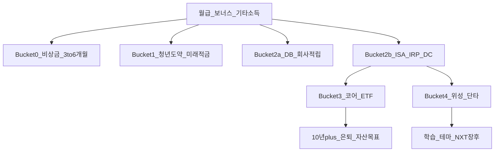
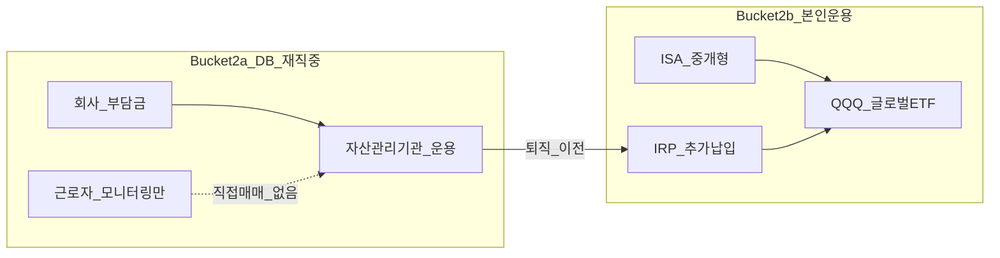

# 투자 기간과 자금 통(Bucket) — 장투·단투·계좌 슬롯 완전 가이드

> **면책**: 본 문서는 교육 목적이며, 특정 개인·법인에 대한 투자·세무·법률 자문이 아닙니다. 제도·세율·상품 조건은 변경될 수 있으므로 실행 전 공식 출처를 확인하세요.

## 메타

| 항목 | 내용 |
|------|------|
| 최종 검증일 | 2026-05-24 |
| 정책·법령 기준일 | 2025-12-31 확정, 2026 ISA·연금 개편 별도 표기 |
| 난이도 | L3 (Deep) — [READER-GUIDE](../docs/READER-GUIDE.md) |
| 예상 읽기 시간 | 50~65분 |
| 관련 bucket | Bucket 0~4 전체 (특히 2a DB vs 2b ISA·IRP) |

## 0. 이 편 읽기 전 (5분)

| 항목 | 내용 |
|------|------|
| **난이도** | L3 (Deep) — [READER-GUIDE §L등급](../docs/READER-GUIDE.md) |
| **선수** | [cash-flow-basics](../01-foundations/cash-flow-basics.md), [emergency-fund](../01-foundations/emergency-fund.md) |
| **이번 편에서 쓰는 기호** | Bucket, 코어, 위성, DCA |
| **복습 한 줄** | — |

## TL;DR

1. **투자 기간(언제 쓸 돈인가)** 과 **매매 스타일(얼마나 자주 거래하는가)** 은 다른 축이며, 혼동하면 코어 ETF를 단기 자금처럼 쓰거나 단타를 장기 슬롯에 넣는 실수가 납니다.
2. 본 저장소 **Bucket 0~4** 모델은 **채우는 순서·계좌 권한·변동성 허용**을 한 번에 정리합니다: 0 비상금 → 1 정책 → 2a DB / 2b ISA·IRP → 3 코어 → 4 위성.
3. **DB(확정급여형) 재직 중**에는 ETF 직접 매매가 **일반적으로 불가**하므로, QQQ·글로벌 코어는 **Bucket 2b(ISA·IRP·DC)** 와 **Bucket 3** 에서 설계합니다.
4. **단기 자금**(1~3년 확정 지출)은 주식 코어와 분리하고, **단타·스윙**(일~월)은 **Bucket 4** 에 **0~20% 상한**으로 격리합니다.
5. 비중 %는 목표·기간·세금 구조가 정해진 **후**에 확정하고, 그 전에는 **bucket 채우기 순서**와 **계좌 역할**을 우선합니다.

---

## 1. 한 줄 정의 + 왜 중요한가

!!! info "Bucket"
    시간·목적별 **자금 슬롯**(0 비상금 → 3 코어 등)

**정의**: **투자 기간과 Bucket**이란, 가용 자금을 **언제·무엇에 쓸지**에 따라 **유동성·변동성·세금·운용 권한**이 다른 **슬롯(통)** 으로 나누고, 각 슬롯에 맞는 **상품·계좌·행동 규칙**을 정하는 포트폴리오 설계의 1층 프레임입니다.

!!! info "ETF"
    지수·자산 **바구니**를 한 종목처럼 거래

**왜 중요한가**: 한국 직장인은 **DB·ISA·IRP·청년도약·일반계좌**가 동시에 존재합니다. “투자한다”는 한 마디만으로는 **회사가 굴리는 돈(DB)** 과 **본인이 고르는 ETF(ISA)** 가 섞입니다. Bucket 없이 비중만 논하면 **운용 불가 구간에 QQQ를 넣었다고 착각**하거나, **비상금 부족 상태에서 코스닥 단타**를 하게 됩니다. [emergency-fund.md](../01-foundations/emergency-fund.md)와 [db-pension.md](../06-korea-policy/db-pension.md)를 연결하는 **허브 문서**이며, 이후 [core-satellite-framework.md](core-satellite-framework.md), [asset-allocation.md](asset-allocation.md)의 전제가 됩니다.

장기 자산 형성 관점에서 Bucket은 **“어디에 복리를 걸 것인가”** 와 **“어디는 원금을 지킬 것인가”** 를 분리합니다. 10년·20년 뒤 목표 금액을 [compound-interest-and-time-value.md](../01-foundations/compound-interest-and-time-value.md)로 계산하기 전에, **그 돈이 들어갈 슬롯이 운용 가능한지**부터 확인해야 합니다. DB 가입자에게 이 질문은 특히 중요합니다. 회사 퇴직연금 적립은 **미래 현금흐름(퇴직금)** 이지만, 재직 중에는 **증권 앱에서 QQQ를 고르는 슬롯이 아닙니다**.

---

## 2. 선수 지식 / 이후 읽을 것

**선수**:
- [cash-flow-basics.md](../01-foundations/cash-flow-basics.md) — 소득·지출·저축률, 월급 배분의 출발점
- [emergency-fund.md](../01-foundations/emergency-fund.md) — Bucket 0 정의·규모
- [compound-interest-and-time-value.md](../01-foundations/compound-interest-and-time-value.md) — 기간(n)과 복리(r)
- [db-vs-dc-pension.md](../06-korea-policy/db-vs-dc-pension.md) — DB/DC 운용 권한 차이
- [debt-and-interest.md](../01-foundations/debt-and-interest.md) — 고금리 부채는 Bucket 0과 동급 우선

**이후**:
- [core-satellite-framework.md](core-satellite-framework.md) — Bucket 3·4 내부 80/20
- [asset-allocation.md](asset-allocation.md) — Bucket 3 주식·채권·현금 비중
- [isa.md](../06-korea-policy/isa.md) — Bucket 2b ISA 세제·3년 규칙
- [account-product-tax-map.md](../06-korea-policy/tax/account-product-tax-map.md) — 계좌×상품×세금
- [rebalancing-and-dca.md](rebalancing-and-dca.md) — Bucket 3 유지 규칙

---

## 3. 직관·비유

**주방 냉장고·냉동실·팬트리**를 생각해 보세요. **냉장고(Bucket 0~1)** 는 이번 주·이번 달 먹을 재료입니다. 상함(변동성)이 치명적이므로 **신선도·접근성(유동성)** 이 최우선입니다. **냉동실(Bucket 2~3)** 은 몇 달~몇 년치 밀키트로, 천천히 꺼내 쓰되 **레시피(자산배분)** 는 미리 정해 둡니다. **별도 실험실(Bucket 4)** 은 새로운 조리법(테마주·단타·NXT 장후)을 시험하는 공간인데, **연기가 나도(손실)** 가족의 정식 식사(코어)를 망치면 안 됩니다.

**DB vs ISA**는 “회사 구내식당(DB)”과 “내가 장 보러 가는 마트(ISA)” 비유가 정확합니다. 구내식당 메뉴(운용)는 **영양사·급식 회사(자산관리기관)** 가 정합니다. 직원이 “오늘은 퀴노아 대신 QQQ 주세요”라고 주문할 수 없는 경우가 대부분입니다. 반면 ISA·IRP는 **내 장바구니**이므로 [etf-index-funds.md](../03-markets/etf-index-funds.md)에 나온 QQQ·글로벌 ETF를 **본인이 선택**합니다.

**장투 vs 단타**는 **마라톤 vs 100m 스프린트**입니다. 같은 “달리기(투자)”라도 훈련 주기·장비·심박 허용치가 다릅니다. 마라톤 코스(코어 ISA)에 스프린트 습관(일간 단타)을 들이면 **중간에 기진맥진**합니다. 여기서 기진맥진은 수익률만이 아니라 **양도세 신고·수수료·FOMO·수면 부족**까지 포함합니다 — [fomo-and-trading-hours.md](../05-behavioral/fomo-and-trading-hours.md).

**단기 자금 vs 단타**도 구분해야 합니다. 2년 뒤 전세 보증금 3,000만 원은 **단기 자금**(목적이 확정, 원금 보존)이지, **단타**(매매 빈도)가 아닙니다. 반대로 10년 뒤 은퇴 자금을 **일간 매매**로 굴리는 것은 **기간은 장기인데 행동은 단타**인 모순입니다. Bucket 모델은 이 두 축을 표로 분리합니다.

---

## 4. 정식 개념·용어

| 용어 | 한글 | English | 정의 |
|------|------|---------|------|
| Bucket | 자금 통 | Mental account slot | 목적·기간·권한별 자금 구획 |
| 투자 기간 | — | Investment horizon | 자금을 묶어 둘 **최소** 기대 연수 |
| 유동성 | — | Liquidity | 손실 없이 현금화 속도·비용 |
| 변동성 | — | Volatility | 가격·평가액의 표준편차적 흔들림 |
| DB | 확정급여형 | Defined Benefit | 퇴직급여 수준 확정, 운용 책임 사용자·기관 |
| DC | 확정기여형 | Defined Contribution | 기여금 확정, **가입자** 운용 |
| ISA | 개인종합자산관리계좌 | — | 3년+ 세제, 중개형 시 ETF 직접 |
| IRP | 개인형퇴직연금 | — | 퇴직금 이전·추가납입, 과세이연 |
| 코어 | — | Core | 장기 분산 ETF (Bucket 3) |
| 위성 | — | Satellite | 테마·실험·단타 (Bucket 4) |
| 단기 자금 | — | Short-term bucket | 1~3년 **확정 지출** 대비 |
| 단타·스윙 | — | Trading | 일~월 매매, 학습·소액 |

### 4a. 핵심 용어 (본문 등장 순)

> 복습용. 정의는 §4 본표·[glossary](../00-roadmap/glossary.md)·본문 `!!! info` 박스.

| 용어 | 한 줄 | 관련 이론 | glossary |
|------|-------|-----------|----------|
| Bucket | 목적·기간·권한별 자금 구획 | §4 | [glossary](../00-roadmap/glossary.md#bucket) |
| 투자 기간 | 자금을 묶어 둘 **최소** 기대 연수 | §4 | [glossary](../00-roadmap/glossary.md#투자-기간) |
| 유동성 | 손실 없이 현금화 속도·비용 | §4 | [glossary](../00-roadmap/glossary.md#유동성) |
| 변동성 | 가격·평가액의 표준편차적 흔들림 | §4 | [glossary](../00-roadmap/glossary.md#변동성) |
| DB | 퇴직급여 수준 확정, 운용 책임 사용자·기관 | §4 | [glossary](../00-roadmap/glossary.md#db) |
| DC | 기여금 확정, **가입자** 운용 | §4 | [glossary](../00-roadmap/glossary.md#dc) |
| ISA | 3년+ 세제, 중개형 시 ETF 직접 | §4 | [glossary](../00-roadmap/glossary.md#isa) |
| IRP | 퇴직금 이전·추가납입, 과세이연 | §4 | [glossary](../00-roadmap/glossary.md#irp) |
| 코어 | 장기 분산 ETF | §4 | [glossary](../00-roadmap/glossary.md#코어) |
| 위성 | 테마·실험·단타 | §4 | [glossary](../00-roadmap/glossary.md#위성) |
| 단기 자금 | 1~3년 **확정 지출** 대비 | §4 | [glossary](../00-roadmap/glossary.md#단기-자금) |
| 단타·스윙 | 일~월 매매, 학습·소액 | §4 | [glossary](../00-roadmap/glossary.md#단타·스윙) |

---

## 5. 메커니즘

### 5.1 Bucket 0~4 — 소득에서 목적까지

### 5.2 DB vs ISA — 운용 권한 분리

### 5.3 기간·권한·매매 3축 매트릭스

| 축 | 핵심 질문 | 대표 Bucket | 변동성 허용 |
|----|-----------|-------------|-------------|
| **기간** | 언제 쓸 돈? | 0~3 | 짧을수록 낮음 |
| **권한** | 누가 고르나? | 2a vs 2b | DB는 개인 선택 없음 |
| **매매** | 얼마나 자주? | 3 vs 4 | 4는 단기·실험 |

### 5.4 기간별 정의 (교육용)

| 구분 | 기간 | 목적 | 수단 예 | Bucket |
|------|------|------|---------|--------|
| 초단기 | 0~1년 | 생활비·비상 | CMA, MMF | 0 |
| 단기 | 1~3년 | 전세·결혼·학비 | 예금, 단기채 | 0~1 확장 |
| 중기 | 3~10년 | 주택·창업 | 혼합·채권 ETF | 2b~3 (보수) |
| 장기 | 10년+ | 은퇴·FI | QQQ·글로벌·IRP | 2b~3 |

### 5.5 채우기 우선순위 (실행 순서)

1. **Bucket 0** — 월 필수지출 3~6개월. 실직·의료·가전 고장 **즉시 대응**.
2. **Bucket 1** — [youth-leap-account.md](../06-korea-policy/youth-leap-account.md), [youth-future-savings.md](../06-korea-policy/youth-future-savings.md). **중도해지·전환 창** 캘린더 등록.
3. **Bucket 2a** — DB: [db-pension.md](../06-korea-policy/db-pension.md) 추계·운용보고 **분기 1회** 확인.
4. **Bucket 2b** — ISA·IRP·DC: **본인 ETF 선택의 메인**. 세액공제·3년 ISA 규칙 병행.
5. **Bucket 3** — 코어: [core-satellite-framework.md](core-satellite-framework.md) 80%+. **QLD는 코어 금지**.
6. **Bucket 4** — 위성: [kosdaq-tier-system.md](../03-markets/kosdaq-tier-system.md), [korea-ats-nextrade.md](../03-markets/kosdaq-ats-nextrade.md). **0~20% 상한**.

### 5.6 장투 vs 단타 vs 단기 자금 비교

| | 장투 코어 | 단기 자금 | 단타·스윙 |
|--|-----------|-----------|-----------|
| 역할 | 장기 부의 80~90% | 확정 지출 대비 | 학습·소액 |
| 시간 | 10~30년 | 1~3년 | 일~월 |
| 변동성 | 감수(분산) | **회피** | 고의적·한정 |
| 계좌 | ISA·IRP | CMA·예금 | ISA·일반(분리) |
| Bucket | 3 | 0~1 | 4 |

---

## 6. 수식·모델

**Bucket 0 목표액**:

| 기호 | 이름 | 이 식에서 의미 |
|        ------        | ------ | ------이(가) 이 식에서 맡는 역할(§4·본문 참고) |
|   \(Bucket 0\)   |   Bucket 0   | \(Bucket 0\)이(가) 이 식에서 맡는 역할(§4·본문 참고) |
|   \(월 필수지출\)   | \(월 필수지출\) | \(월 필수지출\)이(가) 이 식에서 맡는 역할(§4·본문 참고) |
|             \(N\)             | N | 연·월 등 복리·할인에 쓰는 횟수 |
|              \(sim\)              | sim | sim이(가) 이 식에서 맡는 역할(§4·본문 참고) |
\[
\text{Bucket 0} = \text{월 필수지출} \times N \quad (N = 3 \sim 6)
\]

**읽는 법**: **Bucket**와 **월 필수지출**의 관계를 위 식으로 쓴다. 경제·재무 해석은 변수표 「이 식에서 의미」와 [DEPTH-STANDARD](../docs/DEPTH-STANDARD.md) 기호 예제를 맞춘다.
**장기 코어 적립의 미래가치** (세전, 교육용):

| 기호 | 이름 | 이 식에서 의미 |
|        ------        | ------ | ------이(가) 이 식에서 맡는 역할(§4·본문 참고) |
| \(FV\) | 미래가치 | 미래 시점의 목표·결과 금액 |
| \(PMT\) | 정기 납입 | 매 기간 동일하게 넣거나 받는 금액 |

\[
FV = PMT \times \frac{(1+r)^n - 1}{r}
\]

**읽는 법**: 매 기간 **PMT**가 **r**로 **n**번 복리·누적되면 **FV**가 된다. 월·연 단위는 **r**·**n** 정의와 맞춘다. [DEPTH-STANDARD](../docs/DEPTH-STANDARD.md) 참고.- **PMT**: Bucket 2b·3 월 적립 (ISA 자동이체 등)
- **r**: 연간 수익률 가정 (실질·세후로 통일 권장)
- **n**: 투자 가능 연수 — DB 가입자도 **2b·3** 에서 n 확보

**단기 자금**: \(FV\) 극대화가 아니라 **\(PV \approx FV\)** (실질 원금 보존).

**Drift 방지**: Bucket 4 비중 \(w_4 \leq 0.20\) — [rebalancing-and-dca.md](rebalancing-and-dca.md).

---

## 7. 한국 적용

### 7.1 2025년 기준 (확정)

| Bucket | 대표 수단 | 운용 주체 | QQQ·해외 ETF |
|--------|-----------|-----------|--------------|
| 0 | CMA, MMF, 입출금 | 본인 | 해당 없음 |
| 1 | 청년도약, 미래적금 | 본인(규칙 고정) | **불가** |
| 2a DB | 연금기금 | 자산관리기관 | **재직 중 본인 매매 불가** |
| 2b ISA | 중개형 ISA | **본인** | 증권사별 — [isa.md](../06-korea-policy/isa.md) |
| 2b IRP | IRP | **본인** | 가능(한도·규정) |
| 2b DC | DC 계좌 | **가입자** | [dc-pension.md](../06-korea-policy/dc-pension.md) |
| 3 | 코어 ETF | 본인 | ISA·IRP 우선 |
| 4 | 개별·QLD·단타 | 본인 | 소액·상한 |

### 7.2 2026년 개편·시행 예정 (해당 시)

| 항목 | 2025 | 2026 (안·보도, 시행 확인) |
|------|------|----------------|
| ISA 비과세(일반) | 200만 원 | 500만 원 (확대안) |
| ISA 연 납입 | 2,000만 원 | 4,000만 원 (확대안) |
| ISA 총 납입 | 1억 원 | 2억 원 (확대안) |
| DC 추가납입 | 제한적 | **DC 가입자** 300만 등 (보도) |

→ Bucket **채우기 순서**는 변하지 않습니다. 2026 ISA 확대 **시행 확인 후** Bucket 2b 적립 가속 가능.

**법·정책 근거**: 소득세법(금융소득·양도), ISA 시행령, 근로자퇴직급여 보장법 — [investment-tax-overview.md](../06-korea-policy/tax/investment-tax-overview.md)

### 7.3 DB 가입자 체크리스트 (교육용)

- [ ] DB 유형 확인 ([db-vs-dc-pension.md](../06-korea-policy/db-vs-dc-pension.md))
- [ ] Bucket 0 충족 ([emergency-fund.md](../01-foundations/emergency-fund.md))
- [ ] ISA·IRP 개설 및 3년 유지 계획
- [ ] QQQ·글로벌 **코어**는 2b~3에만
- [ ] NXT·코스닥 단타는 Bucket 4 **상한** 문서화

---

## 8. 숫자 예제 (가상)

> 모든 인물·금액은 가상입니다.

### 예제 1: DB 가입자 A — bucket 채우기 순서

| 단계 | 항목 | 월 행동 (가상) | 누적 (가상) |
|------|------|----------------|-------------|
| 1 | Bucket 0 | 지출 **M** × 6 = **F₀** CMA | **M** |
| 2 | Bucket 1 | 청년도약 월 **PMT** (5년, 규칙 준수) | +**M**(원금) |
| 3 | Bucket 2a | DB — 회사 적립, **본인 매매 0** | 추계 퇴직금 별도 |
| 4 | Bucket 2b | ISA 월 **PMT** → QQQ·글로벌 | 10년 후 약 **FV**(5% 가정) |
| 5 | Bucket 3 | 2b 내 코어 85% / 위성 15% 상한 | — |
| 6 | Bucket 4 | NXT 장후 **월 M 상한** | 연 **ΔM** 손실 한도 |

### 예제 2: 단기 자금 vs 단타 혼동 교정 (가상 B)

| 잘못된 설계 | 문제 | 교정 |
|-------------|------|------|
| 2년 뒤 전세 **F**를 QQQ 100% | -30% 시 전세 못 냄 | **단기 자금** → 예금·단기채·MMF |
| 코어 ISA 전액 **일간 단타** | 양도세·수수료·행동 오류 | 단타 **Bucket 4** 소액 분리 |
| Bucket 0 없이 ISA 100% | 실직 시 강제 매도 | **0 먼저** 6개월 |

### 예제 3: DC vs DB 동료 C·D (가상)

| | C (DB) | D (DC) |
|--|--------|--------|
| ETF 선택 | **불가** | DC 앱 **가능** |
| QQQ 위치 | ISA·IRP (2b~3) | **DC + ISA** |
| Bucket 2a | DB 모니터링 | — |
| Bucket 2b | ISA 중심 | **DC가 2b 핵심** |
| 월 본인 적립 | ISA **PMT** + IRP **PMT** | DC **PMT** + ISA **PMT** |

→ 동일 “퇴직연금”이라도 **Bucket 배치가 완전히 다릅니다**.

---
## 9. FAQ

**Q1. Bucket 0을 채우기 전에 ISA에 QQQ부터 사도 되나요?**  
**A1.** 교육 프레임에서는 **비권장**입니다. 하락장·실직·긴급 지출 시 **강제 매도**가 Bucket 3 전체 수익을 훼손합니다. [debt-and-interest.md](../01-foundations/debt-and-interest.md) — 고금리 부채도 Bucket 0과 동급 우선입니다.

**Q2. DB인데 “투자 포트폴리오”가 없는 것 같아요.**  
**A2.** DB는 **회사 슬롯(2a)** 입니다. **본인 포트폴리오**는 ISA·IRP·일반계좌(2b~3)에서 **별도 설계**합니다. 퇴직금 추계는 [db-pension.md](../06-korea-policy/db-pension.md) 예제 1 참고.

**Q3. 청년도약과 ISA를 같은 bucket으로 보나요?**  
**A3.** **아닙니다.** 청년도약은 **Bucket 1**(정책·고정), ISA는 **Bucket 2b**(증권·ETF). [youth-leap-account.md](../06-korea-policy/youth-leap-account.md).

**Q4. 장투 코어와 단타를 같은 계좌에서 해도 되나요?**  
**A4.** 가능은 하나 **정신적·규칙적 분리**를 권합니다. 위성 수익이 좋을 때 코어까지 늘리는 **행동 오류**가 잦습니다. [core-satellite-framework.md](core-satellite-framework.md).

**Q5. “단기 자금”과 “단타”의 차이는?**  
**A5.** **단기 자금** = 1~3년 **쓸 목적**의 돈(원금 보존). **단타** = **매매 빈도**가 높은 전략(Bucket 4). 기간이 짧다고 모두 단타는 아닙니다.

**Q6. NXT 애프터마켓은 어느 bucket?**  
**A6.** **Bucket 4** 성격 — [korea-ats-nextrade.md](../03-markets/korea-ats-nextrade.md). 코어 ISA와 **혼동 금지**. [fomo-and-trading-hours.md](../05-behavioral/fomo-and-trading-hours.md).

**Q7. Bucket 3 비중 %는 언제 정하나요?**  
**A7.** Bucket 0~2 **순서·한도** 확정, **목표 기간·위험 허용**을 글로 쓴 **후** — [asset-allocation.md](asset-allocation.md).

**Q8. 퇴사 후 DB는 어느 bucket으로 가나요?**  
**A8.** IRP 이전 시 **Bucket 2b** 편입 → 본인 ETF 운용. 일시금은 **단기 자금 오용** 위험 — [db-pension.md](../06-korea-policy/db-pension.md) 예제 3.

---

## 10. 함정·리스크·한계

- **DB=내 ETF 포트** 착각 → ISA·IRP 미설계, 10년 복리 슬롯 상실
- **비상금 0** 상태에서 Bucket 4(코스닥·QLD) 확대
- **청년도약 중도해지**로 Bucket 1 붕괴 — 정책 혜택 상실
- **단기 지출 자금**(전세·결혼)을 QQQ 코어에 배치
- Bucket 번호만 있고 **월별 자동이체·한도·캘린더** 없음
- 2026 ISA 확대 **시행 전** 한도 착각으로 납입 계획 오류
- **DC 동료**와 비교하며 DB에서 “왜 ETF 못 사지?” 좌절 → **2b 설계**로 전환
- 본 문서 Bucket 번호는 **교육 프레임** — 개인 세무·노무는 공식 상담

---

**Q. 실무에서는?**  
교과서 식·기호를 그대로 적용하기 전에 **수수료·세금·데이터 시점**을 분리한다. 숫자는 [DEPTH-STANDARD](../docs/DEPTH-STANDARD.md)처럼 기호만 먼저 맞추고, 법령·시장 수치는 §8 표·외부 출처로 갱신한다.

## 11. 심화 읽기

- [references/sources.md](../references/sources.md) — 통합연금포털, 금감원 퇴직연금 백서
- [master-roadmap.md](../00-roadmap/master-roadmap.md) — Phase 4 포트폴리오 순서
- [STUDY-START.md](../00-roadmap/STUDY-START.md) — 1주차 Bucket 0 점검
- [db-pension.md](../06-korea-policy/db-pension.md) — DB 운용·퇴사 선택
- [passive-vs-active.md](passive-vs-active.md) — Bucket 3 철학

---

## 12. 스스로 점검 퀴즈

1. 단기 **자금**과 **단타**의 차이를 한 줄로 쓰세요.  
2. DB 재직 중 QQQ 코어는 주로 어느 bucket·계좌인가요?  
3. Bucket 채우기 **첫 번째**는 무엇인가요?  
4. NXT 장후 매매를 코어 ISA와 섞으면 어떤 리스크가 있나요?  
5. 청년도약은 Bucket 몇 번인가요?

??? note "정답 힌트"

    1. 자금=지출 시점·원금 보존 / 단타=매매 빈도·실험  
    2. Bucket 2b~3, ISA·IRP (DC 가입자는 DC 포함)  
    3. Bucket 0 비상금  
    4. 행동 오류·코어 변동성 오염·수면·세금  
    5. Bucket 1