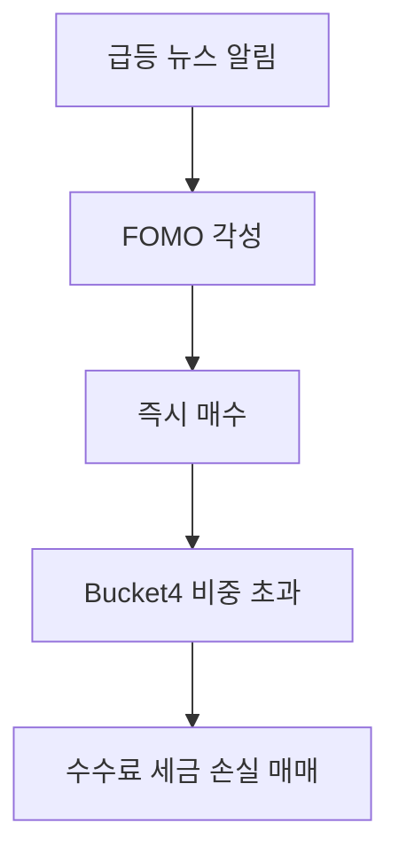
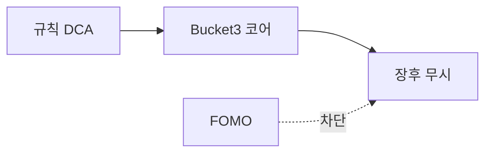

# FOMO와 거래시간 확대 (NXT·장후)

> **면책**: 본 문서는 교육 목적이며 투자 행동·심리에 대한 의학·법률 자문이 아닙니다.

## 메타

| 항목 | 내용 |
|------|------|
| 최종 검증일 | 2026-05-24 |
| 난이도 | L3 (Deep) — [READER-GUIDE](../docs/READER-GUIDE.md) |
| 예상 읽기 시간 | 35~45분 |
| 관련 bucket | Bucket 4 (위성·단기) vs Bucket 3 (코어) |

## 0. 이 편 읽기 전 (5분)

| 항목 | 내용 |
|------|------|
| **난이도** | L3 (Deep) — [READER-GUIDE §L등급](../docs/READER-GUIDE.md) |
| **선수** | 없음 |
| **이번 편에서 쓰는 기호** | 본문 §4·§4a 표 참고 |
| **복습 한 줄** | — |

## TL;DR

1. **NXT 12시간** ≠ 더 많이 매매해야 함 — **기회 증가**이지 **의무** 아님.
2. **FOMO**(놓칠까 불안)는 **장후·급등** 뉴스에서 Bucket 4로 **밀려남**.
3. **코어**는 **규칙 기반 DCA**·리밸런싱 — [rebalancing-and-dca](../04-portfolio/rebalancing-and-dca.md).
4. **알림·앱** 끄기 — 거래시간 확대와 **싸움**.
5. DB·ISA **장기** 설계와 **단타** 분리.

## 1. 한 줄 정의 + 왜 중요한가

!!! info "FOMO (Fear Of Missing Out)"
    소외 불안·충동 매매 심리.

**정의**: **FOMO(Fear Of Missing Out)** 는 다른 사람의 수익·급등 종목을 보며 **본인도 즉시 행동**해야 한다는 심리 압력입니다. **거래시간 확대**는 그 압력이 **24시간에 가깝게** 작용할 **환경**입니다.

!!! info "Bucket"
    시간·목적별 **자금 슬롯**(0 비상금 → 3 코어 등)

**왜 중요한가**: 10년 목표는 **Bucket 3 코어**인데, NXT 장후 **5분 차트**는 **Bucket 4** 유혹입니다. 세금·수수료·실수만 **늘어날** 수 있습니다.

## 2. 선수 / 이후

**선수**: [time-horizon-and-buckets.md](../04-portfolio/time-horizon-and-buckets.md)  
**이후**: [korea-ats-nextrade.md](../03-markets/korea-ats-nextrade.md), [core-satellite-framework.md](../04-portfolio/core-satellite-framework.md)

## 3. 직관·비유

**코어 포트폴리오**는 "**매년 같은 날 물 주기**"인 화분이고, **FOMO 매매**는 "비 온다고 **10분마다** 물 붓기"입니다. **NXT 야간**은 화분 옆에 **네온 간판**을 켠 것과 같습니다 — 물이 필요한 밤이 **아닐 수** 있습니다.

**공감되는 상황 1: 밤 11시 주식 앱 알림.** 화면을 보니 특정 종목이 오늘 +12%, 커뮤니티엔 "내일도 간다"는 글이 가득합니다. 이미 잠자리에 들었다가 스마트폰으로 충동 매수. 다음날 아침 -8%. 이것이 전형적인 **야간 NXT FOMO 패턴**입니다. **핵심은:** 거래 가능한 시간이 늘어났다고 해서 좋은 매매 기회가 늘어나는 것은 아닙니다.

**공감되는 상황 2: 점심 시간 동료의 한 마디.** "나스닥 오늘 3% 올랐대, QQQ 추가 매수해야 하는 거 아냐?" 코어 DCA가 이미 작동 중이라면 **추가 행동은 불필요**합니다. 이미 탑승한 기차에 다시 올라타려는 충동입니다.

**공감되는 상황 3: 코스닥 빨간불 가득한 앱 화면.** 가격이 계속 올라가는 걸 보면 "지금 안 사면 놓친다"는 느낌이 강해집니다. **쉽게 말하면:** 이 느낌 자체가 Bucket 3 코어 규칙을 흔드는 신호입니다. 규칙은 "이 느낌이 와도 DCA 날짜에만 매수"입니다.

## 4. 정식 용어

| 용어 | 정의 |
|------|------|
| FOMO | 놓칠까 하는 **불안** |
| 거래시간 확대 | NXT·장후 등 **체결 가능 시간** 증가 |
| DCA | 정기 **정액** 매수 |
| Bucket 4 | 위성·실험·단기 |
| 행동 편향 | 감정적 **의사결정** |

### 4a. 핵심 용어 (본문 등장 순)

> 복습용. 정의는 §4 본표·[glossary](../00-roadmap/glossary.md)·본문 `!!! info` 박스.

| 용어 | 한 줄 | 관련 이론 | glossary |
|------|------|------|----------------|
| FOMO | 놓칠까 하는 **불안** | §4 | [glossary](../00-roadmap/glossary.md#fomo) |
| 거래시간 확대 | NXT·장후 등 **체결 가능 시간** 증가 | §4 | [glossary](../00-roadmap/glossary.md#거래시간-확대) |
| DCA | 정기 **정액** 매수 | §4 | [glossary](../00-roadmap/glossary.md#dca) |
| Bucket 4 | 위성·실험·단기 | §4 | [glossary](../00-roadmap/glossary.md#bucket-4) |
| 행동 편향 | 감정적 **의사결정** | §4 | [glossary](../00-roadmap/glossary.md#행동-편향) |

## 5. 메커니즘

## 6. 수식·모델

**거래 빈도와 비용**(교육):

| 기호 | 이름 | 이 식에서 의미 |
||------|------|----------------|
|| **R_net** | 순 수익률 | 비용·세금 차감 후 실현 수익률 |
|| **R_gross** | 총 수익률 | 비용·세금 차감 전 수익률 |
|| **f** | 수수료 | 거래당 발생하는 비용 비율 |
|| **τ** | 세금 | 해외주식 양도세 등 매도 시 발생 비율 |
|| **N** | 초과 매매 횟수 | FOMO로 발생한 불필요한 거래 횟수 |

\[
R_{\text{net}} \approx R_{\text{gross}} - (f + \tau) \times N
\]

**식 (기호)**: **R_net** ≈ **R_gross** - (**f** + ) ×**N**

**식 (기호)**: **R_net** ≈ **R_gross** - (**f** + ) ×**N**

**식 (기호)**: **R_net** ≈ **R_gross** - (**f** + ) ×**N**

**읽는 법**: **R_**와 **net**의 관계를 위 식으로 쓴다. 경제·재무 해석은 변수표 「이 식에서 의미」와 [DEPTH-STANDARD](../docs/DEPTH-STANDARD.md) 기호 예제를 맞춘다.
- \(N\): **초과** 매매 횟수, \(f\): 수수료, \(\tau\): 세금(해외·단기)

**FOMO 없을 때** \(N \downarrow\).

**FOMO 없을 때** \(N \downarrow\).

## 7. 한국 적용

### 7.1 NXT·장후

| 항목 | 내용 |
|------|------|
| NXT | **12시간** 등 — [korea-ats-nextrade](../03-markets/korea-ats-nextrade.md) |
| 과세 | 국내주식 **동일** — [domestic-stocks-tax](../06-korea-policy/tax/domestic-stocks-tax.md) |
| 코스닥 | 티어·변동성 — **FOMO** 민감 |

### 7.2 계좌·bucket

| | 코어 B3 | FOMO B4 |
|------|------|----------------|
| QQQ | ISA·IRP DCA | **비권장** 단타 |
| 국내 위성 | 규칙 리밸런싱 | NXT 장후 |
| DB | **매매 없음** | 해당 없음 |

### 7.3 실전 규칙 (교육)

| 규칙 | 내용 |
|------|------|
| **거래 창** | 코어는 **월 1회** DCA일만 앱 |
| **알림** | 가격·급등 **OFF** |
| **B4 상한** | 총자산 **0~20%** — [time-horizon](../04-portfolio/time-horizon-and-buckets.md) |
| **일지** | FOMO 매매 **기록** → 패턴 인지 |
| **NXT** | “거래 가능” ≠ “거래 **해야**” |

### 7.4 2025 vs 2026

| | 2025 | 2026 |
|------|------|----------------|
| NXT | 도입·**12시간** | 종목·규제 **지속** |
| ISA | 비과세 200만 | **500만** 보도 — 코어 **납입**↑ 가능 |
| 행동 | FOMO·장후 | **규칙**은 동일 — 시간≠의무 |

### 7.5 코어·위성 규칙 카드 (교육용)

| Bucket | 자산 | 거래 창 | NXT |
|------|------|------|----------------|
| 3 코어 | QQQ·채권 ETF | **월 1회** DCA일만 | 선택 |
| 4 위성 | 코스닥·테마 | 규칙 **상한 20%** | 장후 **자제** |
| 0~1 | 비상금·도약 | **매매 없음** | — |
| DB | 연금 | **매매 없음** | — |

### 7.6 FOMO 대응 프로토콜

1. **24시간 룰** — 매수 전 하루 대기  
2. **사전 주문서** — “왜·얼마·어느 bucket”  
3. **앱 삭제·알림 OFF** — NXT 장후  
4. **손실 추격 금지** — 평균단가 낮추기 중독  
5. 월말 **과매매 횟수** 기록

**법·정책 근거**: 해당 없음(행동). NXT·과세는 [korea-ats-nextrade](../03-markets/korea-ats-nextrade.md), [domestic-stocks-tax](../06-korea-policy/tax/domestic-stocks-tax.md).

### 7.7 심리·시장 구조 — NXT와의 관계

| 요인 | 메커니즘 | 대응 |
|------|------|----------------|
| 가용성 편향 | 장후 **뉴스·급등** 노출 ↑ | 알림 OFF |
| 손실 회피 | 손절 지연·추격 매수 | **사전 규칙** |
| 과신 | NXT **저수수료** = 더 매매 | 월 **N** 상한 |
| 군중 심리 | 코스닥·테마 동조 | Bucket 4 **상한** |

[passive-vs-active.md](../04-portfolio/passive-vs-active.md) — 코어는 **패시브 DCA**가 FOMO 비용을 구조적으로 낮춥니다.

## 8. 숫자 예제 (가상)

> 가상 인물.

### 예제 1: FOMO 매매 (가상)

| | 가상 AF |
|--|---------|
| 장후 3회 추격 매수 | 수수료+슬리피지 **−M** (교육용) |
| 1주 보유 후 손절 | **−M** (교육용) |
| 코어 DCA 유지 | **변경 없음** |

### 예제 2: 알림 OFF (가상)

| | 가상 AG |
|--|---------|
| 월 1회 리밸런싱만 | B4 **15%** 유지 |
| 연 초과 매매 | **2회** vs 24회 |

### 예제 3: 해외 FOMO (가상)

| | 일반 계좌 |
|--|-----------|
| QQQ 장중 급등 추격 | 양도세 **5월** 누적 |

## 9. FAQ

**Q1. NXT(야간 거래)를 쓰면 안 되나요?**  
사용 자체는 문제없습니다. 문제는 **"왜 지금 거래하는가"**입니다. DCA 날짜가 아닌 야간에 거래한다면, 그 이유를 일지에 적어보세요. "공부했다, 충분히 검토했다"가 아니라 "불안해서, 놓칠 것 같아서"라면 FOMO입니다.

**Q2. 코어 QQQ를 장후에 사도 되나요?**  
DCA 날짜를 미리 정해두면 장후든 정규장이든 상관없습니다. **핵심은:** 날짜를 정해두지 않고 "오늘 좋아 보여서" 사는 것이 FOMO 패턴입니다.

**Q3. DB 가입자는 FOMO와 무관한가요?**  
재직 중 DB는 본인이 운용하지 않으므로 그 부분은 무관합니다. 하지만 ISA·IRP 부분에서 FOMO는 동일하게 작동합니다. 실제로 DB 가입자들이 ISA에서 더 충동적인 경향이 있습니다 — "연금은 있으니 이건 좀 공격적으로"라는 **멘탈 어카운팅** 때문입니다.

**Q4. ISA 3년 요건과 FOMO는 어떻게 연결되나요?**  
중도에 ETF를 매도해도 ISA가 해지되지는 않습니다. 하지만 FOMO로 인한 잦은 매매는 **수수료·세금**을 높이고 복리 효과를 줄입니다. 3년 비과세 한도를 최대로 활용하려면 가능한 한 적게 거래하는 것이 유리합니다.

**Q5. QLD를 사면 FOMO가 더 심해지나요?**  
그렇습니다. 레버리지는 수익도 2배, **감정도 2배**입니다. QLD가 하루 -6%일 때 느끼는 불안감은 QQQ -3%보다 훨씬 강합니다. 이 강한 감정이 FOMO 매매를 더 자주 촉발합니다. 레버리지 ETF는 감정 조절이 충분히 훈련된 후에 소량 위성으로 사용하는 것이 권장됩니다.

### 실행 워크숍 체크리스트 (교육)

| # | 질문 | Yes 시 다음 문서 |
|------|------|----------------|
| 1 | 해외 ETF·주식을 보유 중인가? | [../06-korea-policy/tax/overseas-stocks-tax-part1-cgt.md](../06-korea-policy/tax/overseas-stocks-tax-part1-cgt.md) |
| 2 | 해외 배당이 연 500만 이상인가? | [../06-korea-policy/tax/overseas-stocks-tax-part2-dividend.md](overseas-stocks-tax-../06-korea-policy/tax/overseas-stocks-tax-part2-dividend.md.md) |
| 3 | DB 재직인가? | [../06-korea-policy/db-pension.md](../../06-korea-policy/db-pension.md) + IRP·ISA |
| 4 | 국내주식을 NXT에서 거래하는가? | [../03-markets/korea-ats-nextrade.md](../../03-markets/../03-markets/korea-ats-nextrade.md) |
| 5 | 10년 코어가 QQQ인가? | [../06-korea-policy/isa.md](../../06-korea-policy/isa.md) 또는 [../06-korea-policy/tax/isa-irp-pension-tax.md](../06-korea-policy/tax/isa-irp-pension-tax.md) |

위 표는 **의사결정 보조**이며, 개인 소득·가구·회사 제도에 따라 답이 달라집니다. 불확실하면 [../06-korea-policy/tax/investment-tax-overview.md](../06-korea-policy/tax/investment-tax-overview.md) → [../06-korea-policy/tax/account-product-tax-map.md](../06-korea-policy/tax/account-product-tax-map.md) 순으로 읽으세요.

## 10. 함정·리스크·한계

- **기회=매매** 착각  
- **장후 피로** 판단  
- **B3·B4** 혼합  
- **손실 추격**  
- 심리 문서 ≠ **치료**

---

**Q. 실무에서는?**  
교과서 식·기호를 그대로 적용하기 전에 **수수료·세금·데이터 시점**을 분리한다. 숫자는 [DEPTH-STANDARD](../docs/DEPTH-STANDARD.md)처럼 기호만 먼저 맞추고, 법령·시장 수치는 §8 표·외부 출처로 갱신한다.

## L3 보충 — 장기 자산 형성 연결

본 절은 [DEPTH-STANDARD.md](../../docs/DEPTH-STANDARD.md) L3 게이트를 충족하기 위한 **실행·교차 링크** 보충입니다.

### Bucket·현금흐름 연결

| Bucket | 대표 제도·자산 | 본 문서와의 관계 |
|------|------|----------------|
| 0 | 비상금 MMDA | 세금·투자 **전** 우선 |
| 1 | [청년도약](../06-korea-policy/youth-leap-account.md)·[미래적금](../06-korea-policy/youth-future-savings.md) | 정책 적금 — 주식 **대체 아님** |
| 2a | DB·DC | [db-vs-dc-pension.md](../06-korea-policy/db-vs-dc-pension.md) |
| 2b | ISA·IRP | [isa.md](../06-korea-policy/isa.md)·[isa-irp-pension-tax.md](../06-korea-policy/tax/isa-irp-pension-tax.md) |
| 3 | QQQ·채권 코어 | [capm-and-risk-return.md](../08-advanced/capm-and-risk-return.md) |
| 4 | NXT·코스닥·QLD | [fomo-and-trading-hours.md](../05-behavioral/fomo-and-trading-hours.md) |

### 연간 점검 루틴 (교육)

| 분기 | 할 일 |
|------|--------|
| Q1 | [investment-tax-overview.md](../06-korea-policy/tax/investment-tax-overview.md) 캘린더 확인 |
| Q2 | [rebalancing-and-dca.md](../04-portfolio/rebalancing-and-dca.md) 코어 비중 |
| Q3 | 해외 배당·금융소득 **누적** — Part2 |
| Q4 | 익년 **5월** 양도세 자료 정리 — Part1 |
| ISA | 개설일 +36개월 **만기** 알림 |

### 2025 vs 2026 정책 추적

| 항목 | 확인 출처 |
|------|-----------|
| ISA 한도·비과세 | 금융위·조세특례 시행일 |
| DC +300만 공제 | 국세청·통합연금포털 |
| 청년도약 일몰·미래적금 | [kinfa](https://ylaccount.kinfa.or.kr) |
| 금융투자소득세 | 금융위 보도·[sources.md](../../references/sources.md) |
| NXT 종목·거래중단 | [nextrade.co.kr](https://www.nextrade.co.kr) |

**면책 재확인**: 가상 예제·보도 수치는 **시점별 개정**됩니다. 실행·신고 전 공식 출처를 확인하세요.

## 11. 심화 읽기

- [korea-ats-nextrade.md](../03-markets/korea-ats-nextrade.md)  
- [passive-vs-active.md](../04-portfolio/passive-vs-active.md)

## 12. 퀴즈

1. NXT 12시간의 의미?  
2. FOMO가 밀리는 bucket?  
3. 코어 QQQ 대응?  
4. DB 재직 NXT?  
5. 과매매 비용 변수?

힌트
1. 기회 증가 2. B4 3. 규칙 DCA 4. 개인계좌 5. N·수수료·세금
