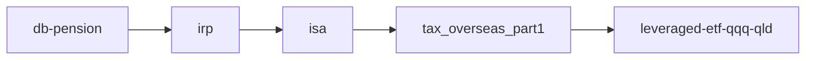

# Phase 5~6 — 한국 정책·세금·연금

> **면책**: 교육 목적. 제도는 수시 변경 — 실행 전 공식 출처 확인.

## 빠른 경로 (DB 가입자)

| 순서 | 문서 | 목적 |
|------|------|------|
| 1 | [db-pension.md](db-pension.md) | DB = 본인 매매 없음 |
| 2 | [irp.md](irp.md) | QQQ·세액공제 슬롯 |
| 3 | [isa.md](isa.md) | 3년 세제·코어 |
| 3b | [isa-irp-practical-setup.md](isa-irp-practical-setup.md) | DB 가입자 **실무 셋업** |
| 4 | [tax/README.md](tax/README.md) → part1~3 | 해외주식 세금 |
| 5 | [youth-leap-account.md](youth-leap-account.md) / [youth-future-savings.md](youth-future-savings.md) | Bucket 1 |

---

## 전체 읽기 순서

### 연금·정책 계좌

| # | 문서 | L3 |
|---|------|-----|
| 1 | [investment-tax-overview.md](tax/investment-tax-overview.md) | ✅ |
| 2 | [db-vs-dc-pension.md](db-vs-dc-pension.md) | ✅ |
| 3 | [db-pension.md](db-pension.md) | ✅ |
| 4 | [dc-pension.md](dc-pension.md) | ✅ |
| 5 | [irp.md](irp.md) | ✅ |
| 6 | [isa.md](isa.md) | ✅ |
| 7 | [youth-leap-account.md](youth-leap-account.md) | ✅ |
| 8 | [youth-future-savings.md](youth-future-savings.md) | ✅ |

### 세금 시리즈

→ [tax/README.md](tax/README.md)

### bucket 연결

- [time-horizon-and-buckets.md](../04-portfolio/time-horizon-and-buckets.md)
- [account-product-tax-map.md](tax/account-product-tax-map.md)

---

## 공식 출처

- [references/sources.md](../references/sources.md)
- [kinfa 청년도약](https://ylaccount.kinfa.or.kr)
- [통합연금포털](https://www.pension.or.kr)
- [국세청](https://www.nts.go.kr)
