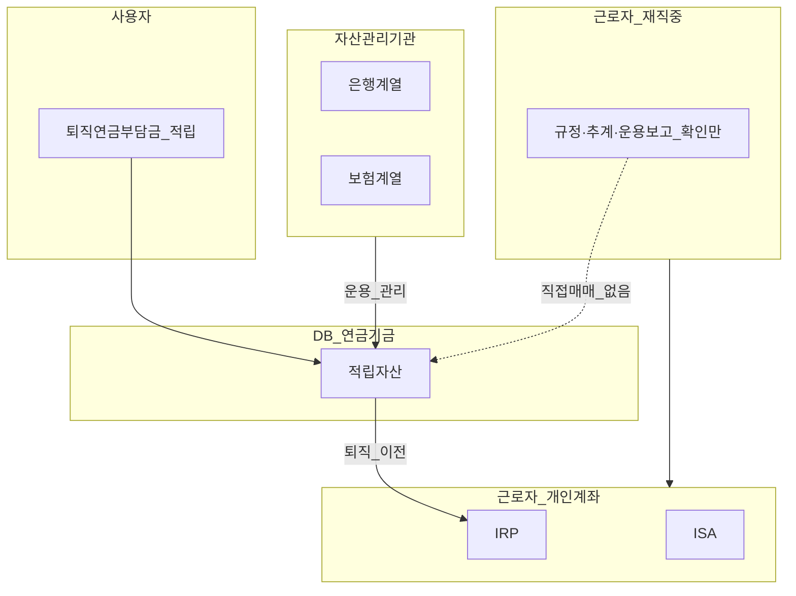

# DB형 퇴직연금 (확정급여형) 완전 가이드

> **면책**: 교육 목적이며 개인·회사별 자문이 아닙니다.

## 메타

| 항목 | 내용 |
|------|------|
| 최종 검증일 | 2026-05-24 |
| 정책·법령 기준일 | 2025-12-31 확정, 2026 개편 별도 표기 |
| 난이도 | L3 (Deep) — [READER-GUIDE](../docs/READER-GUIDE.md) |
| 예상 읽기 시간 | 45~60분 |
| 관련 bucket | Bucket 2a (회사 운용), 퇴사 후 IRP → Bucket 2b |

## 0. 이 편 읽기 전 (5분)

| 항목 | 내용 |
|------|------|
| **난이도** | L3 (Deep) — [READER-GUIDE §L등급](../docs/READER-GUIDE.md) |
| **선수** | [db-vs-dc-pension](db-vs-dc-pension.md), [investment-tax-overview](tax/investment-tax-overview.md) |
| **이번 편에서 쓰는 기호** | L_ISA, ISA, IRP, DB, DC (해당 시) |
| **복습 한 줄** | — |

## TL;DR

1. **DB**는 회사가 퇴직급여 수준·**투자 책임**을 지며, 재직 중 근로자는 **ETF·종목을 직접 고르지 않습니다**.
2. 적립금은 **연금기금** 안에서 **자산관리기관**(은행·보험)이 운용합니다.
3. **QQQ·글로벌 코어**는 본인 **ISA·IRP·일반계좌**(Bucket 2b~3)에서 설계합니다.
4. DB **자산관리기관**은 6개사 수준에서 **16개사**로 확대된 바 있으나, 이는 **기관 선택지 확대**이지 본인 매매 권한 확대가 아닙니다.
5. 퇴사 시 **IRP 이전** vs **일시금** 선택이 장기 세금·운용권에 큰 영향을 줍니다.

---

## 1. 한 줄 정의 + 왜 중요한가

!!! info "DB (Defined Benefit)"
    확정급여형 퇴직연금.

**정의**: **확정급여형(DB, Defined Benefit)** 퇴직연금은 근로자의 **퇴직 시 받을 급여 수준(또는 산출식)** 을 제도적으로 정하고, 그 지급을 위해 적립·운용하는 책임이 **사용자(회사) 및 연금 운용 주체**에 있는 퇴직연금입니다.

!!! info "ETF"
    지수·자산 **바구니**를 한 종목처럼 거래

!!! info "IRP (Individual Retirement Pension)"
    개인형 퇴직연금.

**왜 중요한가**: DB 가입자는 “회사 퇴직금 = 내가 ETF로 굴린다”가 **아닙니다**. DB를 **자동 적립 슬롯**으로 이해하고, **직접 운용 가능한 IRP·ISA**를 별도로 설계하지 않으면 10년+ 장기 목표와 실제 행동이 어긋납니다.

---

## 2. 선수 지식 / 이후 읽을 것

**선수**:
- [db-vs-dc-pension.md](db-vs-dc-pension.md)
- [investment-tax-overview.md](tax/investment-tax-overview.md)

**이후**:
- [isa-irp-pension-tax.md](tax/isa-irp-pension-tax.md)
- [account-product-tax-map.md](tax/account-product-tax-map.md)
- [time-horizon-and-buckets.md](../04-portfolio/time-horizon-and-buckets.md)

---

## 3. 직관·비유

DB는 **회사가 약속한 퇴직금 “목표액”을 채우기 위해 저축통에 돈을 넣고, 그 통은 전문 기관(자산관리기관)이 굴리는 구조**에 가깝습니다. 직원 개인에게 “이 통에서 삼성전자 100주 사라”는 권한이 없는 경우가 대부분입니다.

반면 **DC**는 회사가 매달 **정해진 금액만** 넣고, **직원이 증권 앱에서 ETF를 고르는** 구조입니다. “우리 회사 퇴직연금”이라는 말만 같아도 **DB/DC에 따라 할 수 있는 일이 완전히 다릅니다**.

---

## 4. 정식 개념·용어

| 용어 | English | 정의 |
|------|---------|------|
| 확정급여형 | DB | 퇴직급여 **급여 수준** 확정(또는 산출식), 운용 책임 사용자 측 |
| 확정기여형 | DC | **기여금** 확정, 운용·투자 책임 가입자 |
| 자산관리기관 | Asset manager | DB 적립금 **운용·관리** 금융회사 |
| 퇴직연금 사업자 | Pension provider | 제도 설정·계약·행정 담당 기관 |
| 연금기금 | Pension fund | DB 적립 자산 풀 |
| IRP | Individual Retirement Pension | 퇴직금 이전·추가 납입 개인 계좌 |

### 4a. 핵심 용어 (본문 등장 순)

> 복습용. 정의는 §4 본표·[glossary](../00-roadmap/glossary.md)·본문 `!!! info` 박스.

| 용어 | 한 줄 | 관련 이론 | glossary |
|------|-------|-----------|----------|
| 확정급여형 | 퇴직급여 **급여 수준** 확정 | §4 | [glossary](../00-roadmap/glossary.md#확정급여형) |
| 확정기여형 | **기여금** 확정, 운용·투자 책임 가입자 | §4 | [glossary](../00-roadmap/glossary.md#확정기여형) |
| 자산관리기관 | DB 적립금 **운용·관리** 금융회사 | §4 | [glossary](../00-roadmap/glossary.md#자산관리기관) |
| 퇴직연금 사업자 | 제도 설정·계약·행정 담당 기관 | §4 | [glossary](../00-roadmap/glossary.md#퇴직연금-사업자) |
| 연금기금 | DB 적립 자산 풀 | §4 | [glossary](../00-roadmap/glossary.md#연금기금) |
| IRP | 퇴직금 이전·추가 납입 개인 계좌 | §4 | [glossary](../00-roadmap/glossary.md#irp) |

---

## 5. 메커니즘

### DB vs DC 한눈에

| 항목 | DB | DC |
|------|-----|-----|
| 누가 투자 | 회사·운용기관 | **가입자** |
| ETF 직접 선택 | **불가**(일반적) | 가능 |
| 퇴직급여 확정 | 수준·산출식 중심 | 적립금+운용 결과 |
| 본인 추가납입 | IRP 등 **별도** | DC 계좌 추가납입 가능 |

---

## 6. 수식·모델

퇴직금 산출은 **회사·단체협약·규정**마다 다릅니다. 교육용 단순 예:

| 기호 | 이름 | 이 식에서 의미 |
|------|------|----------------|
|  \(퇴직금\)  |  퇴직금  | 본문 §4·위 식 맥락 참고 |
|  \(평균임금\)  |  평균임금  | 본문 §4·위 식 맥락 참고 |
|  \(근속연수\)  |  근속연수  | 본문 §4·위 식 맥락 참고 |
|  \(지급률\)  |  지급률  | 본문 §4·위 식 맥락 참고 |
\[
\text{퇴직금} \approx \text{평균임금} \times \text{근속연수} \times \text{지급률}
\]

**읽는 법**: 위 식의 기호는 바로 위 변수표와 같다. 숫자는 [DEPTH-STANDARD](../docs/DEPTH-STANDARD.md) 교육용 기호(M·P·PV 등)로 대입한다.
- **평균임금**: 최근 3개월·12개월 등 규정에 따름  
- **근속연수**: 입사일~퇴직일 (할증 규정 있을 수 있음)  
- 실제는 **퇴직연금 DC 전환**, **임금피크제** 등이 없는지 규정 확인 필수

**적립 부족(언더펀딩)**: DB는 운용 수익이 부족하면 **회사가 추가 부담**할 수 있음(제도·회계 기준에 따름). DC는 운용 손실이 **가입자 계좌**에 반영.

---

## 7. 한국 적용

### 7.1 DB 자산관리기관 확대 (6 → 16개사 수준)

**오해 방지**: 아래 표는 **“누가 DB 돈을 운용할 수 있는가”** 에 대한 **기관 면허·참여 확대**입니다. 근로자 개인에게 매매 가능 종목이 늘어난 것이 **아닙니다**.

| 구분 | 기존 (6개사 수준) | 변경 (16개사 수준) |
|------|-------------------|---------------------|
| **은행** | 우리, KB국민, 신한, 하나, IBK기업 | + **iM뱅크(구 대구)**, **NH농협**, **부산**, **KDB산업** |
| **생명보험** | 삼성생명 | + **교보생명**, **한화생명**, **신한생명** |
| **손해보험** | (없음) | **삼성화재**, **DB손해**, **현대해상** |

**근로자가 할 수 있는 일**:
- 사내 복지·노무·재무에 **“우리 DB 자산관리기관·수수료·운용보고”** 문의  
- [통합연금포털](https://www.pension.or.kr) 사업자별 수수료·적립금 통계 참고(간접 정보)

### 7.2 퇴직연금 사업자 vs 자산관리기관

| 역할 | 담당 |
|------|------|
| **사업자** | 제도 가입·계약·행정·가입자 안내 |
| **자산관리기관** | DB 적립금 **운용** (펀드·채권·예금 등) |

### 7.3 2025~2026 맥락

- 금감원 **퇴직연금 투자 백서**: DB 적립금 약 **214조 원** 수준(2024 말), 실적배당형 비중 점진 증가  
- **실물이전**: DC·IRP 중심이나 제도 이해에 참고  
- **IRP 세액공제**: 연금저축+IRP 합산 **연 900만 원** 한도 등 — DB와 **별도**로 개인 IRP 설계

---

## 8. 숫자 예제 (가상)

### 예제 1: 퇴직금 추계 (가상)

| 항목 | 값 |
|------|-----|
| 가상 직장인 A | 근속 5년 |
| 최근 3개월 평균 임금 | 월 400만 원 (가상) |
| 회사 규정 | 평균임금 × 근속 × 1 (가상 단순식) |
| **추계 퇴직금** | 400 × 12 × 5 = **2,400만 원** (가상) |

→ 실제는 상여·수당 포함 여부, 할증 연수 등 **회사 규정**이 다름.

### 예제 2: DB + IRP 병행 (가상)

| 슬롯 | 월 납입 | 10년 후 (가정 5% 연복리, 가상) |
|------|---------|--------------------------------|
| DB (회사만) | 회사 부담 (본인 조작 없음) | 추계 퇴직금 2,400만+α |
| IRP (본인) | 75만 원 | 약 1.16억 원 (가상, 세전) |

→ **장기 코어 ETF**는 IRP·ISA에서 설계.

### 예제 3: 퇴사 시 선택 (가상)

| 선택 | 세금·운용 | 적합 상황 (교육용) |
|------|-----------|-------------------|
| **IRP 이전** | 과세이연 유지, 이후 본인 운용 | 장기 보유·ETF 직접 운용 원할 때 |
| **일시금** | 퇴직소득세 등 | 단기 목적 자금 (신중) |

---

## 9. FAQ

**Q1. DB인데 회사 퇴직금을 내가 ETF로 투자할 수 있나요?**  
**A.** 재직 중 **일반적으로 불가**합니다. DC형이 아닌 이상 증권사 앱에서 본인이 고르는 구조가 아닙니다.

**Q2. 자산관리기관이 16개로 늘었다는데, 내가 종목을 더 살 수 있나요?**  
**A.** **아닙니다.** 회사·연금이 선택할 수 있는 **운용 주체**가 늘어난 것입니다.

**Q3. QQQ는 어디서 사야 하나요?**  
**A.** DB가 아니라 **ISA → IRP/연금저축 → 일반계좌** 순으로 검토. [account-product-tax-map](tax/account-product-tax-map.md), [leveraged-etf-qqq-qld](../04-portfolio/leveraged-etf-qqq-qld.md).

**Q4. DB와 IRP를 동시에 가져도 되나요?**  
**A.** 가능합니다. DB는 회사 적립, IRP는 **개인 추가 납입·세액공제**용으로 많이 씁니다.

**Q5. 퇴사하면 DB 돈은 어떻게 되나요?**  
**A.** 퇴직금 산정 후 **IRP 이전** 또는 **일시금** 등 선택(규정·상담 필요).

**Q6. DB 운용이 잘못되면 누가 손해를 보나요?**  
**A.** 제도상 **사용자(회사)** 가 적립·운용 책임. 근로자는 **지급 약속** 중심으로 보호받는 구조(회사·제도 건전성에 의존).

**Q7. 청년도약계좌와 DB는 같나요?**  
**A.** **다릅니다.** 청년도약은 정책 적금(개인 납입), DB는 퇴직연금.

**Q8. 넥스트레이드(NXT)로 DB 돈을 거래하나요?**  
**A.** **개인이 NXT 주문하는 구조가 아닙니다.** 자산관리기관의 기관 투자에 간접 영향만 있을 수 있습니다. [korea-ats-nextrade](../03-markets/korea-ats-nextrade.md).

---

## 10. 함정·리스크·한계

- **DC로 착각** → IRP·ISA 미설계  
- **퇴직금 추계 방치** → 이직·은퇴 계획 부재  
- **일시금 수령 후 소비** → 과세이연·복리 상실  
- **회사 재무·제도 변경** 리스크 (극단적 경우 지급 논란 — 드묾, 인지만)  
- 문서의 산출식·기관 수는 **시점별 개정** 가능

---

## 11. 심화 읽기

- [references/sources.md](../references/sources.md) — 통합연금포털, 금감원 퇴직연금 백서  
- [dc-pension.md](dc-pension.md) — DC 비교  
- [db-vs-dc-pension.md](db-vs-dc-pension.md)

---

## 12. 스스로 점검 퀴즈

1. DB에서 근로자가 직접 ETF를 고르는 것이 일반적인가?  
2. 자산관리기관 16개 확대가 개인 매매 권한 확대를 의미하는가?  
3. QQQ 코어 포지션은 어느 bucket에서 설계하는가?  
4. 퇴사 후 운용권을 회수하려면 어떤 선택이 유리한가?  
5. DB와 DC 중 회사가 투자 책임을 지는 유형은?

??? note "정답 힌트"

    1. 아니오(일반적) · 2. 아니오 · 3. Bucket 2b~3 (ISA/IRP/일반) · 4. IRP 이전(장기·운용 목적 시) · 5. DB