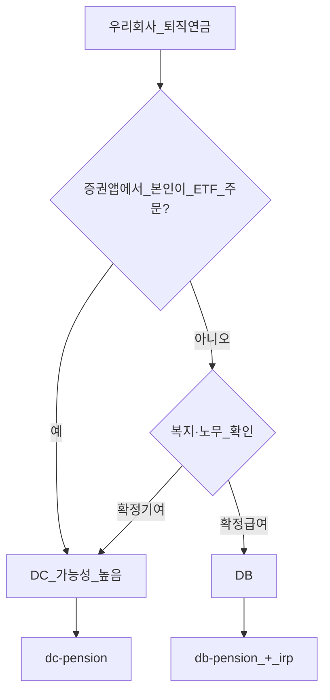
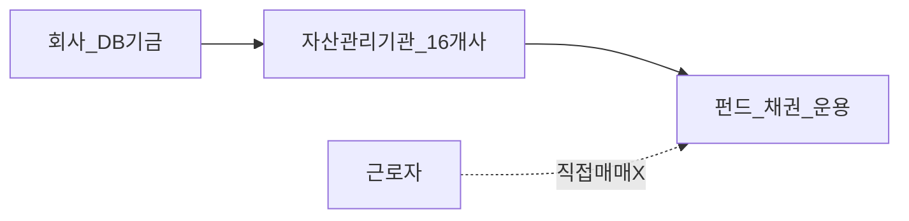
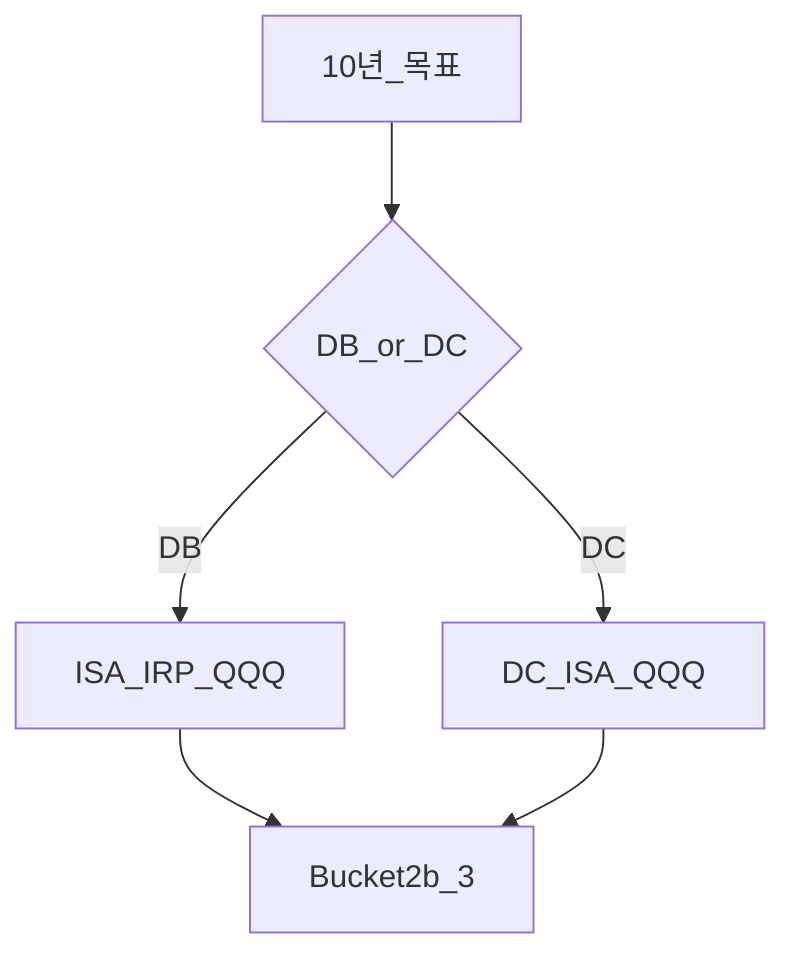

# DB vs DC — 판별·선택·실무 체크리스트

> **면책**: 본 문서는 교육 목적이며, 특정 개인·법인에 대한 투자·세무·법률 자문이 아닙니다. 제도·세율·상품 조건은 변경될 수 있으므로 실행 전 사내 복지·노무·[통합연금포털](https://www.pension.or.kr)을 확인하세요.

## 메타

| 항목 | 내용 |
|------|------|
| 최종 검증일 | 2026-05-24 |
| 정책·법령 기준일 | 2025-12-31 확정 |
| 난이도 | L3 (Deep) — [READER-GUIDE](../docs/READER-GUIDE.md) |
| 예상 읽기 시간 | 40~50분 |
| 관련 bucket | Bucket 2a 판별 후 DB→IRP / DC→본인 운용 |

## 0. 이 편 읽기 전 (5분)

| 항목 | 내용 |
|------|------|
| **난이도** | L3 (Deep) — [READER-GUIDE §L등급](../docs/READER-GUIDE.md) |
| **선수** | [time-horizon-and-buckets](../04-portfolio/time-horizon-and-buckets.md) |
| **이번 편에서 쓰는 기호** | L_ISA, ISA, IRP, DB, DC (해당 시) |
| **복습 한 줄** | — |

## TL;DR

| 질문 | DB | DC |
|------|-----|-----|
| 증권 앱에서 ETF 고름? | **아니오** | **예** |
| 퇴직급여 | 산출식·약속 | 적립금+수익 |
| QQQ 코어 | **ISA·IRP** | **DC 목록** |
| 본인 할 일 | IRP·규정 | 리밸런싱·70% |
| 2026 +300만 공제 | **없음** | **DC만**(보도) |

---

## 1. 한 줄 정의 + 왜 중요한가

!!! info "DB (Defined Benefit)"
    확정급여형 퇴직연금.

!!! info "DC (Defined Contribution)"
    확정기여형 퇴직연금.

**정의**: **DB(확정급여)** 와 **DC(확정기여)** 는 이름만 비슷한 **다른 퇴직연금 제도**입니다. “우리 회사 퇴직연금”이 **어느 쪽인지** 한 번만 확인해도 10년 포트폴리오 설계가 바뀝니다.

!!! info "ETF"
    지수·자산 **바구니**를 한 종목처럼 거래

!!! info "IRP (Individual Retirement Pension)"
    개인형 퇴직연금.

**왜 중요한가**: DB인데 DC처럼 ETF를 고르려 하면 **시간 낭비**이고, DC인데 IRP만 보면 **DC 70%·추가납입** 기회를 놓칩니다.

---

## 2. 선수 지식 / 이후 읽을 것

**선수**:
- [time-horizon-and-buckets.md](../04-portfolio/time-horizon-and-buckets.md)

**이후**:
- [db-pension.md](db-pension.md) — DB
- [dc-pension.md](dc-pension.md) — DC
- [irp.md](irp.md) — DB 필수 동반

---

## 3. 직관·비유

| | DB | DC |
|--|-----|-----|
| 비유 | 회사 **기금** + 전문가 운용 | 회사 **입금** + **내 지갑**에서 ETF |
| 질문 | “퇴직금 **얼마 받기로** 약속?” | “내 계좌 **얼마 불었나**?” |

**실무 팁**: 입사 시 **오리엔테이션 자료**에 퇴직연금 유형이 없으면, 첫 달 안에 노무·복지에 **이메일로** 질문 템플릿(§7.7)을 보내 두세요. 10년 후 “DB인 줄 알았는데 DC였다”는 비용보다 **지금 5분**이 저렴합니다.

---

## 4. 정식 개념·용어

| 용어 | DB | DC |
|------|-----|-----|
| 확정 요소 | **급여·산출식** | **기여금** |
| 투자 책임 | 사용자·운용기관 | **가입자** |
| 자산관리기관 | DB **운용** | DC **사업자·운용** |
| 추가납입 | IRP **별도** | DC 계좌 **가능** |

### 4a. 핵심 용어 (본문 등장 순)

> 복습용. 정의는 §4 본표·[glossary](../00-roadmap/glossary.md)·본문 `!!! info` 박스.

| 용어 | 한 줄 | 관련 이론 | glossary |
|------|-------|-----------|----------|
| 확정 요소 | **기여금** | §4 | [glossary](../00-roadmap/glossary.md#확정-요소) |
| 투자 책임 | **가입자** | §4 | [glossary](../00-roadmap/glossary.md#투자-책임) |
| 자산관리기관 | DC **사업자·운용** | §4 | [glossary](../00-roadmap/glossary.md#자산관리기관) |
| 추가납입 | DC 계좌 **가능** | §4 | [glossary](../00-roadmap/glossary.md#추가납입) |

---

## 5. 메커니즘

### 5.1 판별 플로우

### 5.2 자산관리기관 16개사 (DB)

**오해 금지**: 16개사 확대 ≠ 근로자 **개인 매매** 확대. [db-pension.md](db-pension.md).

---

## 6. 수식·모델

| | DB (교육) | DC |
|--|-----------|-----|
| 퇴직금 | 평균임금×근속×지급률 등 | **적립잔고** |
| 수익 | 회사·기금 | **본인 선택** 반영 |

**어느 게 유리?** — **비교 불가**. 제도·회사·개인 **리스크 성향**이 다름.

---

## 7. 한국 적용

### 7.1 2025년

| 항목 | DB | DC |
|------|-----|-----|
| QQQ | 개인 **ISA·IRP** | DC **70%** 내 |
| NXT | 개인 주식계좌 | DC 상품별 |
| 청년도약 | 별도 | 별도 |

### 7.2 2026년

| 항목 | DB | DC |
|------|-----|-----|
| 추가납입 공제 +300만 | **없음** | **있음**(보도) |
| ISA 한도 확대 | 개인 ISA | 개인 ISA |

### 7.3 회사·개인 행동 매트릭스

| 상황 | DB 가입자 | DC 가입자 |
|------|-----------|-----------|
| QQQ 코어 | ISA·IRP | DC+ISA |
| 퇴직금 추적 | **규정·포털** | **앱 잔고** |
| 노무 질문 | “DB 맞나?” | “DC 맞나?” |
| 16개사 뉴스 | **운용사** 문의 | 해당 적음 |

### 7.4 제도 전환 시

- 회사 **DC 전환** 공지 시 — [dc-pension.md](dc-pension.md) **재학습**.  
- **혼합**·일시적 이중 — HR·사업자 확인.

### 7.5 통합연금포털·사내 확인 절차

| 순서 | 행동 | 기대 결과 |
|------|------|-----------|
| 1 | [통합연금포털](https://www.pension.or.kr) 로그인 | **DB/DC** 유형 표시 |
| 2 | 사내 복지·노무에 “확정급여/확정기여” 문의 | 규정·전환 일정 |
| 3 | 증권 앱에 “퇴직연금” 메뉴·본인 주문 가능 여부 | DC면 **매수 버튼** 존재 |
| 4 | DB면 [irp.md](irp.md) 개설·추가납입 설계 | QQQ **개인 슬롯** |
| 5 | [account-product-tax-map.md](tax/account-product-tax-map.md) | 계좌×상품 배치 |

### 7.6 10년 포트폴리오 — DB vs DC 매트릭스

| 시간축 | DB 가입자 (가상 설계) | DC 가입자 (가상 설계) |
|--------|----------------------|----------------------|
| 재직 | DB 모니터링 + ISA·IRP DCA | DC 70% QQQ + ISA |
| 퇴사 | IRP 이전·운용권 회수 | IRP 이전 또는 DC 유지 |
| 은퇴 | 연금수령·세금 — [isa-irp-pension-tax.md](tax/isa-irp-pension-tax.md) | 동일 |

**법·정책 근거**: 근로자퇴직급여보장법, 금감원 퇴직연금 백서, 통합연금포털 사업자·수수료 공시.

---

### 7.7 노무·HR 질문 템플릿 (교육)

사내에 아래를 **문서로** 요청하면 DB/DC 판별이 빨라집니다.

1. 당사 퇴직연금 유형: **확정급여(DB)** / **확정기여(DC)** / 혼합?  
2. 가입자가 **증권사 앱에서 ETF를 직접** 매수하는가?  
3. **DC 전환** 예정일·기존 DB 적립금 처리?  
4. **자산관리기관** 명칭·운용보고 주기?  
5. 퇴사 시 **IRP 이전** 기본 옵션?

답변을 [db-pension.md](db-pension.md) 또는 [dc-pension.md](dc-pension.md)와 대조하세요.

---

## 8. 숫자 예제 (가상)

> 가상 인물·금액.

> 모든 인물·금액은 가상입니다.

### 예제 1: 같은 회사·다른 제도 (가상)

| | 가상 Q (DB) | 가상 R (DC) |
|--|-------------|-------------|
| 재직 10년 후 | 추계 퇴직금 5,000만 | 적립 4,200만+α |
| QQQ | IRP 1억(가상) | DC 70% QQQ |

### 예제 2: 판별 실수 (가상)

| 행동 | 가상 S (실제 DB) |
|------|------------------|
| “퇴직연금에서 QQQ 샀다” | **불가** — 일반 **위탁** 착각 |

### 예제 3: 퇴사 (가상)

| | DB | DC |
|--|-----|-----|
| 선택 | IRP 이전 6,000만 | IRP 이전 5,500만 |

---

## 9. FAQ

**Q1.** DB인데 ETF 고른다고? — **DC만**(일반).  
**Q2.** DB에서 QQQ? — **IRP·ISA**.  
**Q3.** 자산관리 16개? — DB **운용 주체**, 본인 매매 X.  
**Q4.** 퇴사 시? — DB 산정·이전 / DC 잔고 이전.  
**Q5.** 세액공제? — IRP·연금 (회사 DB 부담은 공제 X).  
**Q6.** NXT? — **개인** 국내주식.  
**Q7.** 청년도약? — **별도**.  
**Q8.** ISA 병행? — **가능**.  
**Q9.** DC 300만? — **DC만**.  
**Q10.** 어느 게 유리? — **제도가 다름**.

---

## 10. 함정·리스크·한계

- **DB/DC 혼동**  
- **16개사=내 매매** 오해  
- **일시금 소비**  
- 회사 **DC 전환** — 규정 재확인  
- 문서는 **일반론** — 회사별 예외

---

## L3 보충 — 장기 자산 형성 연결

본 절은 [DEPTH-STANDARD.md](../../docs/DEPTH-STANDARD.md) L3 게이트를 충족하기 위한 **실행·교차 링크** 보충입니다.

### Bucket·현금흐름 연결

| Bucket | 대표 제도·자산 | 본 문서와의 관계 |
|--------|----------------|------------------|
| 0 | 비상금 MMDA | 세금·투자 **전** 우선 |
| 1 | [청년도약](youth-leap-account.md)·[미래적금](youth-future-savings.md) | 정책 적금 — 주식 **대체 아님** |
| 2a | DB·DC | [db-vs-dc-pension.md](db-vs-dc-pension.md) |
| 2b | ISA·IRP | [isa.md](isa.md)·[isa-irp-pension-tax.md](tax/isa-irp-pension-tax.md) |
| 3 | QQQ·채권 코어 | [capm-and-risk-return.md](../08-advanced/capm-and-risk-return.md) |
| 4 | NXT·코스닥·QLD | [fomo-and-trading-hours.md](../05-behavioral/fomo-and-trading-hours.md) |

### 연간 점검 루틴 (교육)

| 분기 | 할 일 |
|------|--------|
| Q1 | [investment-tax-overview.md](tax/investment-tax-overview.md) 캘린더 확인 |
| Q2 | [rebalancing-and-dca.md](../04-portfolio/rebalancing-and-dca.md) 코어 비중 |
| Q3 | 해외 배당·금융소득 **누적** — Part2 |
| Q4 | 익년 **5월** 양도세 자료 정리 — Part1 |
| ISA | 개설일 +36개월 **만기** 알림 |

### 2025 vs 2026 정책 추적

| 항목 | 확인 출처 |
|------|-----------|
| ISA 한도·비과세 | 금융위·조세특례 시행일 |
| DC +300만 공제 | 국세청·통합연금포털 |
| 청년도약 일몰·미래적금 | [kinfa](https://ylaccount.kinfa.or.kr) |
| 금융투자소득세 | 금융위 보도·[sources.md](../../references/sources.md) |
| NXT 종목·거래중단 | [nextrade.co.kr](https://www.nextrade.co.kr) |

**면책 재확인**: 가상 예제·보도 수치는 **시점별 개정**됩니다. 실행·신고 전 공식 출처를 확인하세요.

## 11. 심화 읽기

- [db-pension.md](db-pension.md), [dc-pension.md](dc-pension.md)  
- [references/sources.md](../references/sources.md)

---

## 12. 스스로 점검 퀴즈

1. ETF 직접 선택이 가능한 유형은?  
2. DB 16개사 확대의 의미는?  
3. DB 가입자 QQQ 슬롯은?  
4. 2026 +300만 공제 대상은?  
5. 판별 1순위 질문은?

??? note "정답 힌트"

    1. DC · 2. 운용 기관 확대 · 3. ISA/IRP · 4. DC · 5. 본인이 ETF 주문하는가?

