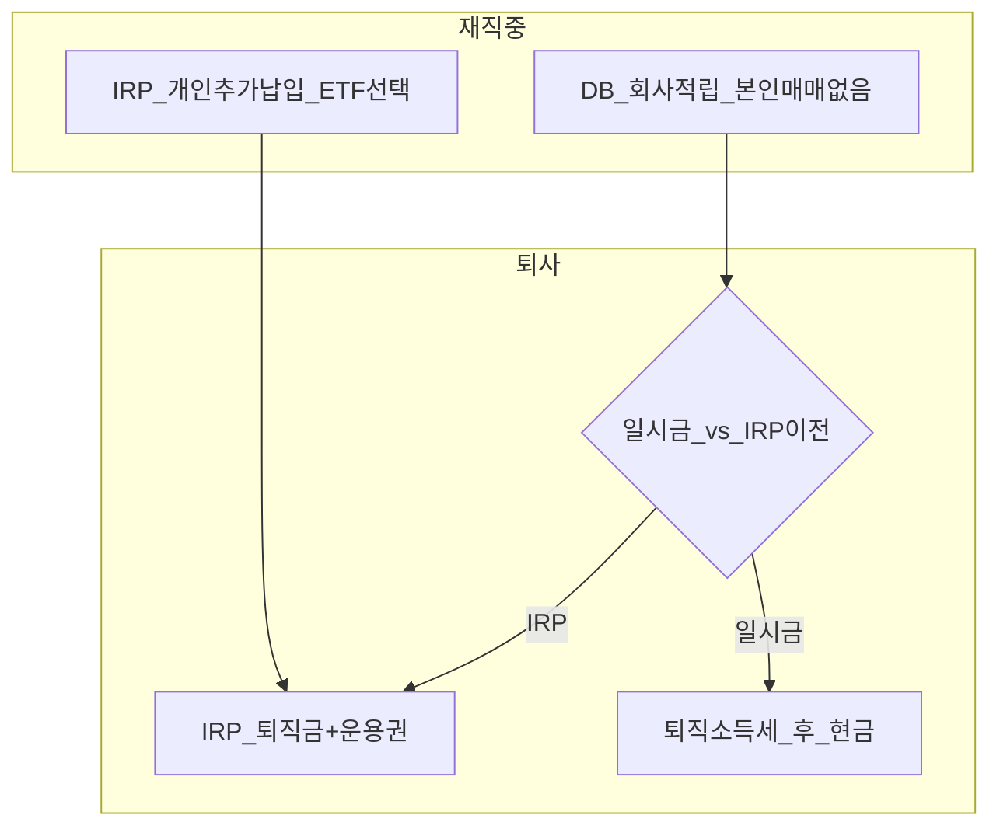

# IRP (개인형퇴직연금) — DB 가입자 실전 가이드

> **면책**: 본 문서는 교육 목적이며, 특정 개인·법인에 대한 투자·세무·법률 자문이 아닙니다. 제도·세율·상품 조건은 변경될 수 있으므로 실행 전 [통합연금포털](https://www.pension.or.kr)·국세청·취급 금융기관을 확인하세요.

## 메타

| 항목 | 내용 |
|------|------|
| 최종 검증일 | 2026-05-24 |
| 정책·법령 기준일 | 2025-12-31 확정, 2026 IRP·연금저축 개편 보도 별도 표기 |
| 난이도 | L3 (Deep) — [READER-GUIDE](../docs/READER-GUIDE.md) |
| 예상 읽기 시간 | 45~55분 |
| 관련 bucket | Bucket 2b (본인 운용·과세이연), DB 퇴사 후 IRP 이전 |

## 0. 이 편 읽기 전 (5분)

| 항목 | 내용 |
|------|------|
| **난이도** | L3 (Deep) — [READER-GUIDE §L등급](../docs/READER-GUIDE.md) |
| **선수** | [db-pension](db-pension.md), [dc-pension](dc-pension.md) |
| **이번 편에서 쓰는 기호** | L_ISA, ISA, IRP, DB, DC (해당 시) |
| **복습 한 줄** | — |

## TL;DR

1. **IRP**는 퇴직금 **이전·보관** + **추가 납입**이 가능한 **개인 명의** 연금 계좌입니다.
2. **DB 재직 중**에는 회사 적립금을 직접 ETF로 고를 수 **없고**, **개인 IRP**로 QQQ·글로벌 코어를 설계합니다.
3. **세액공제**: 연금저축+IRP 합산 **연 900만 원** 한도(소득·공제율 구간별) — 2026 보도는 시행 확인.
4. **운용**: 증권사 IRP에서 **ETF·펀드** 직접 선택(상품목록·위험자산 한도 확인).
5. **퇴직금 이전** 시 일시금 대비 **과세이연·운용권** 유지 — 장기 목표에 맞게 선택.

## 1. 한 줄 정의 + 왜 중요한가

!!! info "DB (Defined Benefit)"
    확정급여형 퇴직연금.

!!! info "DC (Defined Contribution)"
    확정기여형 퇴직연금.

!!! info "IRP (Individual Retirement Pension)"
    개인형 퇴직연금.

**정의**: **IRP(Individual Retirement Pension, 개인형퇴직연금)** 는 퇴직금·연금성 자금을 **개인 명의 계좌**에 모아 **운용·수령**하는 제도로, 퇴직 시 **DB·DC에서 적립된 퇴직금**을 이전하거나, 재직 중 **추가 납입**하여 노후 자금을 만드는 통로입니다.

!!! info "Bucket"
    시간·목적별 **자금 슬롯**(0 비상금 → 3 코어 등)

!!! info "ETF"
    지수·자산 **바구니**를 한 종목처럼 거래

**왜 중요한가**: [db-pension.md](db-pension.md) 가입자는 재직 중 DB 안에서 **QQQ를 살 수 없습니다**. IRP는 “**내 이름으로 된 연금 통장**”이라 **Bucket 2b** 에서 장기 ETF·세액공제를 동시에 설계할 수 있는 **핵심 슬롯**입니다.

## 2. 선수 지식 / 이후 읽을 것

**선수**:
- [db-pension.md](db-pension.md) 또는 [dc-pension.md](dc-pension.md)
- [db-vs-dc-pension.md](db-vs-dc-pension.md)

**이후**:
- [isa.md](isa.md) — 3년 세제 vs IRP 이연
- [tax/isa-irp-pension-tax.md](tax/isa-irp-pension-tax.md)
- [tax/account-product-tax-map.md](tax/account-product-tax-map.md)
- [leveraged-etf-qqq-qld.md](../04-portfolio/leveraged-etf-qqq-qld.md)

## 3. 직관·비유

**DB**는 “회사 금고(적립) + 전문가가 굴림”이고, **IRP**는 “**내 개인 금고** — 내가 ETF를 고르고, 세금 혜택(납입 공제)도 받을 수 있는 금고”입니다. 퇴사할 때 회사 금고에서 **한 번에 현금으로 꺼내 쓰기(일시금)** vs **내 금고로 옮기기(IRP 이전)** 의 선택이 됩니다.

**ISA**는 “3년 묶어두면 매매차익 세제”이고, **IRP**는 “**지금 세금 안 내고 복리** → 나중에 연금으로 받을 때 과세”에 가깝습니다.

## 4. 정식 개념·용어

| 용어 | English | 정의 |
|------|------|----------------|
| IRP | Individual Retirement Pension | 개인형퇴직연금 계좌 |
| 연금저축 | Pension savings | IRP와 **세액공제 한도 공유**하는 연금저축 |
| 퇴직금 이전 | Rollover | 퇴직 시 DB·DC 적립금 → IRP |
| 과세이연 | Tax deferral | 운용 중 배당·매매차익 **즉시 과세 없음** |
| 연금소득세 | Pension income tax | 수령 시 **저율 구간** 등 |
| 위험자산 | Risk assets | 주식·주식형 ETF 등 — **한도** 있음 |

### 4a. 핵심 용어 (본문 등장 순)

> 복습용. 정의는 §4 본표·[glossary](../00-roadmap/glossary.md)·본문 `!!! info` 박스.

| 용어 | 한 줄 | 관련 이론 | glossary |
|------|------|------|----------------|
| IRP | 개인형퇴직연금 계좌 | §4 | [glossary](../00-roadmap/glossary.md#irp) |
| 연금저축 | IRP와 **세액공제 한도 공유**하는 연금저축 | §4 | [glossary](../00-roadmap/glossary.md#연금저축) |
| 퇴직금 이전 | 퇴직 시 DB·DC 적립금 → IRP | §4 | [glossary](../00-roadmap/glossary.md#퇴직금-이전) |
| 과세이연 | 운용 중 배당·매매차익 **즉시 과세 없음** | §4 | [glossary](../00-roadmap/glossary.md#과세이연) |
| 연금소득세 | 수령 시 **저율 구간** 등 | §4 | [glossary](../00-roadmap/glossary.md#연금소득세) |
| 위험자산 | 주식·주식형 ETF 등 | §4 | [glossary](../00-roadmap/glossary.md#위험자산) |

## 5. 메커니즘

### 5.1 DB 가입자 + IRP 병행

### 5.2 개설 → 납입 → 운용 → 수령

| 단계 | DB 가입자 체크 |
|------|----------------|
| **개설** | 증권·은행·보험 — **수수료·상품목록** 비교 |
| **추가 납입** | 연금저축+IRP **900만 원/년** 한도 내 |
| **운용** | QQQ 등 — **위험자산 비중**·해외 ETF 배당 이슈 |
| **퇴직 이전** | 퇴사 절차와 **동시** 신청 — 일시금 소비 함정 주의 |
| **수령** | 55세+ 등 요건 — **연금** vs **일시금** 세율 차이 |

## 6. 수식·모델

추가 납입의 **미래 가치**(가상, 세전):

| 기호 | 이름 | 이 식에서 의미 |
|------|------|----------------|
|   \(FV\)   | 미래가치 | 미래 시점의 목표·결과 금액 |
|   \(PMT\)   | 정기 납입 | 매 기간 동일하게 넣거나 받는 금액 |
|   \(r\)   | 할인율·수익률 | 기간당 이자·요구수익률 |
|   \(n\)   | 기간 | 연·월 등 복리·할인에 쓰는 횟수 |

\[
FV = PMT \times \frac{(1+r)^{n} - 1}{r}
\]

**읽는 법**: 매 기간 **PMT**가 **r**로 **n**번 복리·누적되면 **FV**가 된다. 

월·연 단위는 **r**·**n** 정의와 맞춘다. [DEPTH-STANDARD](../docs/DEPTH-STANDARD.md) 참고.
**세액공제** (교육용 단순):

| 기호 | 이름 | 이 식에서 의미 |
|------|------|----------------|
| **r** | 할인율·수익률 | 기간당 이자·요구수익률 |
| **n** | 기간 | 연·월 등 복리·할인에 쓰는 횟수 |
| **PV** | 현재가치 | 오늘 시점으로 환산한 금액 |

\[
\text{절세액} \approx \text{납입액} \times \text{공제율}
\]

**읽는 법**: **r**와 **n**의 관계를 위 식으로 쓴다. 경제·재무 해석은 변수표 「이 식에서 의미」와 [DEPTH-STANDARD](../docs/DEPTH-STANDARD.md) 기호 예제를 맞춘다.- 공제율: 총급여·종합소득 구간에 따라 **16.5% / 13.2% / 9.9%** 등 (연금저축·IRP 규정)  
- **한도**: IRP+연금저축 **연 900만 원** (2025 기준, 2026 개정 확인)

**퇴직소득세** (일시금 시): 근속·퇴직금 산정 — **회사·국세청** 안내, 본 문서는 개략만.

## 7. 한국 적용

### 7.1 2025년 (확정)

| 항목 | 내용 |
|------|------|
| 세액공제 한도 | 연금저축+IRP **연 900만 원** |
| DB 재직 | **개인 IRP 추가납입** 가능 (소득·한도) |
| 운용 | ETF 직접 — **상품별** QQQ·국내 ETF |
| 해외 ETF 배당 | 2025~ **외국납부세액 선환급 폐지** — DC·IRP 재검토 |
| 위험자산 | 퇴직연금 규정 **70%** 등 (DC·IRP 유사 한도) |

### 7.2 2026년 (보도·확인 필요)

| 항목 | 2025 | 2026 (보도) |
|------|------|----------------|
| DC 추가납입 공제 | — | DC 가입자 **+300만 원** (DB **해당 없음**) |
| ISA 비과세 | 200만 | 500만 (개편안) |
| IRP 한도 | 900만 | **법 개정** 시행일 확인 |

**법·정책 근거**: 근로자퇴직급여보장법, 소득세법(연금계좌 세액공제), 금감원 퇴직연금 안내.

## 8. 숫자 예제 (가상)

> 모든 인물·금액은 가상입니다.

### 예제 1: DB + IRP 병행 (가상)

| 슬롯 | 가상 직장인 F | 월 | 10년 (5% 가정, 세전) |
|------|------|------|----------------|
| DB | 회사만 적립, 본인 조작 없음 | — | 추계 퇴직금 3,**M** (만 원 단위, 교육용) |
| IRP 추가 | 본인 | 50만 원 | 약 7,700만 원 |

→ **QQQ 코어**는 IRP·ISA에서.

### 예제 2: 세액공제 (가상)

| 항목 | 가상 G |
|------|--------|
| 연간 IRP 납입 | 600만 원 |
| 공제율(가상) | 13.2% |
| **절세액(가상)** | 약 **M** (만 원 단위, 교육용) |

→ 실제는 **총급여·다른 공제**와 합산 확인.

### 예제 3: 퇴사 선택 (가상)

| 선택 | 가상 H | 결과(교육) |
|------|------|----------------|
| IRP 이전 | 퇴직금 4,000만 원 이전 | **과세이연** 유지, QQQ 리밸런싱 가능 |
| 일시금 | 4,**M** (만 원 단위, 교육용) 수령 | 퇴직소득세 후 **현금** — 소비·복리 상실 위험 |

## 9. FAQ

**Q1. DB인데 IRP가 필요한가요?**  
**A1.** 재직 중 **직접 ETF 운용**·**세액공제**·퇴사 후 **운용권**을 위해 **많이 개설**합니다.

**Q2. IRP에서 QQQ를 살 수 있나요?**  
**A2.** **증권사 상품목록**에 있으면 가능. **위험자산 한도**·배당 과세 이슈 확인.

**Q3. ISA와 IRP 중 어디에 QQQ?**  
**A3.** **3년 묶을 수 있으면 ISA** 우선 검토, **초과·추가 납입·퇴직금**은 IRP. [account-product-tax-map](tax/account-product-tax-map.md).

**Q4. 퇴직금을 IRP에 넣지 않고 써도 되나요?**  
**A4.** **일시금** 가능 — 세금·장기 복리 **손실** 인지 후 결정.

**Q5. 연금저축과 IRP를 둘 다?**  
**A5.** 가능. **세액공제 한도 900만 원은 합산**.

**Q6. DC 추가납입 300만 원이 IRP에도 적용되나요?**  
**A6.** **DC 가입자만**(2026 보도). **DB 해당 없음**.

**Q7. QLD 레버리지 ETF는?**  
**A7.** [leveraged-etf-qqq-qld](../04-portfolio/leveraged-etf-qqq-qld.md) — IRP에서도 **비권장·제한** 가능.

**Q8. 청년도약·미래적금과 IRP?**  
**A8.** **별도** — 적금(Bucket 1) vs 연금(Bucket 2b).

## 10. 함정·리스크·한계

- **DB=IRP** 착각 — DB는 회사 적립만  
- **일시금 소비** — 퇴직금을 생활비로  
- **한도 초과 납입** — 공제 불이익  
- **해외 ETF 배당** — 2025 선환급 폐지 후 **실효수익** 재계산  
- **수령 시점·연금 전환** 미설계 — 세율·유동성  
- 상품·한도는 **개정** 가능

---

**Q. 실무에서는?**  
교과서 식·기호를 그대로 적용하기 전에 **수수료·세금·데이터 시점**을 분리한다. 숫자는 [DEPTH-STANDARD](../docs/DEPTH-STANDARD.md)처럼 기호만 먼저 맞추고, 법령·시장 수치는 §8 표·외부 출처로 갱신한다.

## 11. 심화 읽기

- [통합연금포털](https://www.pension.or.kr) — 사업자·수수료·상품 비교  
- [references/sources.md](../references/sources.md)  
- [tax/isa-irp-pension-tax.md](tax/isa-irp-pension-tax.md)  
- [db-pension.md](db-pension.md), [isa.md](isa.md)  
- [leveraged-etf-qqq-qld.md](../04-portfolio/leveraged-etf-qqq-qld.md) — QQQ 코어 vs QLD 위성

### IRP vs ISA (DB 가입자 의사결정)

| 질문 | IRP 쪽 | ISA 쪽 |
|------|------|----------------|
| 세액공제·이연 | **강함** (연금) | 3년+ **비과세·분리과세** |
| 기간 | **55세·10년** 등 수령 규칙 | 3년 유지 |
| QQQ 코어 | **가능** (상품목록) | **가능** (중개형) |
| 퇴직금 받을 때 | **IRP 이전** 통로 | 별도 |

→ 많은 경우 **둘 다** 쓰되, **역할 분리**: IRP(연금·공제) + ISA(3년 세제·유연).

## 12. 스스로 점검 퀴즈

1. DB 재직 중 회사 적립금으로 본인이 QQQ를 고르는가?  
2. IRP 추가 납입의 대표적 세제 혜택은?  
3. 퇴직금 IRP 이전의 장점 한 가지는?  
4. 연금저축+IRP 연간 세액공제 한도(2025)는?  
5. DC 추가납입 300만 원 공제가 DB에 적용되는가?

??? note "정답 힌트"

    1. 아니오 · 2. 세액공제(한도 내) · 3. 과세이연·운용권 · 4. 900만 원 · 5. 아니오