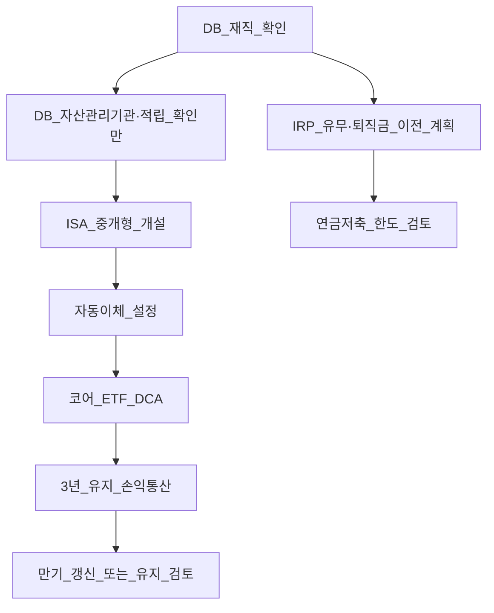
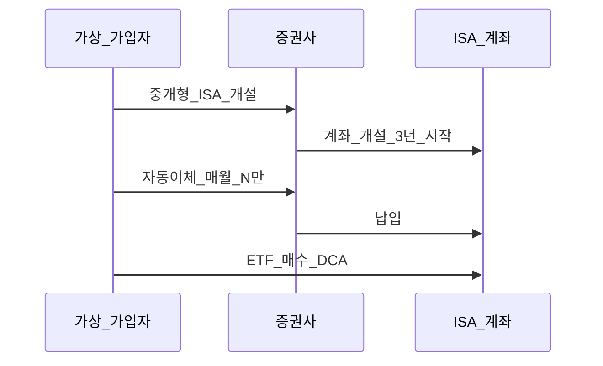
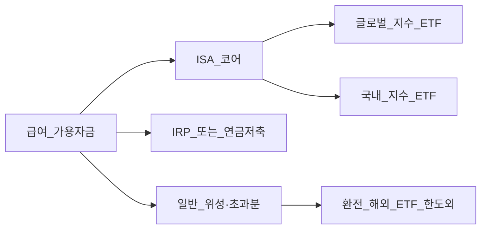
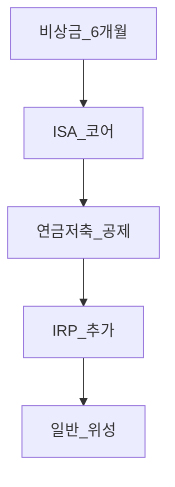

# ISA·IRP 실무 셋업 — DB 가입자 체크리스트

> **면책**: 본 문서는 교육 목적이며, 특정 개인·법인에 대한 투자·세무·법률 자문이 아닙니다. 세액공제율·ISA 한도·금융상품 약관·수령 요건은 **소득형태·가입 시기·금융사**에 따라 달라질 수 있으므로 실행 전 [국세청](https://www.nts.go.kr)·[통합연금포털](https://www.pension.or.kr)·취급 금융기관의 **최신 공지**를 확인하세요. 본문 금액·일정은 **가상 교육용**입니다.

## 메타

| 항목 | 내용 |
|------|------|
| 최종 검증일 | 2026-05-25 |
| 정책·법령 기준일 | 2025-12-31 확정, 2026 ISA·연금 개편안 별도 표기 |
| 난이도 | L3 (Deep) — [READER-GUIDE](../docs/READER-GUIDE.md) |
| 예상 읽기 시간 | 75~90분 |
| 관련 bucket | Bucket 2a(DB) · 2b(IRP·ISA) · 3(코어 ETF) |

## 0. 이 편 읽기 전 (5분)

| 항목 | 내용 |
|------|------|
| **난이도** | L3 (Deep) — [READER-GUIDE §L등급](../docs/READER-GUIDE.md) |
| **선수** | [db-pension](db-pension.md), [db-vs-dc-pension](db-vs-dc-pension.md) |
| **이번 편에서 쓰는 기호** | L_ISA, ISA, IRP, DB, DC (해당 시) |
| **복습 한 줄** | — |

## TL;DR

1. **DB 가입자**는 재직 중 **ETF 직접 매매 불가** — 코어·위성 설계는 **ISA·IRP·일반**에서.
2. **실무 순서**: DB 이해 → **ISA 개설(중개형)** → **자동이체** → **ETF DCA** → **3년 유지·손익통산**.
3. **연 납입 한도·비과세 한도**는 2025/2026 **별도 확인** — [isa.md](isa.md).
4. **손실 종목 + 이익 종목** 같은 ISA 안에서 **통산** 후 세제 적용.
5. **TOP10 실수**로 중도해지·한도 초과·일반계좌 해외양도세 혼동 방지.
6. 이론: [irp.md](irp.md) · [pension-savings-account.md](pension-savings-account.md) · [isa.md](isa.md).

## 1. 한 줄 정의 + 왜 중요한가

!!! info "ETF"
    지수·자산 **바구니**를 한 종목처럼 거래

!!! info "DB (Defined Benefit)"
    확정급여형 퇴직연금.

!!! info "IRP (Individual Retirement Pension)"
    개인형 퇴직연금.

**정의**: **ISA·IRP 실무 셋업**은 확정급여형(DB) 퇴직연금 가입자가 **직접 운용 가능한 계좌**를 개설·자동적립·상품(ETF) 경로까지 **실행 순서**로 정리한 운영 가이드다.

**왜 중요한가**: DB만 이해하고 ISA를 **미개설**하면 해외 ETF **양도소득세·5월 신고** 부담이 커진다. “ISA 들었다”와 “**3년·손익통산·한도**를 지킨다”는 다르다. [office-worker-investing-playbook](../00-roadmap/office-worker-investing-playbook.md)의 가상 50% ISA 슬롯은 **이 문서의 실행부**에 해당한다.

## 2. 선수 지식 / 이후 읽을 것

**선수**:
- [db-pension.md](db-pension.md)
- [db-vs-dc-pension.md](db-vs-dc-pension.md)
- [tax/investment-tax-overview.md](tax/investment-tax-overview.md)

**이후**:
- [isa.md](isa.md) — 제도 심화
- [irp.md](irp.md) — 퇴사·이전·수령
- [pension-savings-account.md](pension-savings-account.md) — 연금저축·세액공제
- [tax/isa-irp-pension-tax.md](tax/isa-irp-pension-tax.md)
- [tax/account-product-tax-map.md](tax/account-product-tax-map.md)
- [rebalancing-and-dca.md](../04-portfolio/rebalancing-and-dca.md)

## 3. 직관·비유

**DB** = 회사가 굴리는 **금고**(열쇠 없음).  
**ISA** = 본인이 요리하는 **3년 봉인 냄비**(손익을 합쳐 맛 조절 = 손익통산).  
**IRP** = **냉동고**(지금 세금 안 내고 나중에) — 퇴직금·추가 납입.  
**일반계좌** = **포장 도시락** — 먹을 때마다(매도) 계산대(양도세).

## 4. 정식 개념·용어

| 용어 | English | 정의 |
|------|------|----------------|
| 중개형 ISA | Brokerage ISA | 본인 **HTS/M** 직접 주문 |
| 손익통산 | Netting | 계좌 내 이익·손실 **합산** 후 과세 |
| 비과세 한도 | Tax-free allowance | 3년 누적 **면세 상한** |
| 분리과세 9.9% | Separate 9.9% | 한도 초과분(일반형) |
| 과세이연 | Tax deferral | IRP·연금 — 인출 시 과세 |
| 자동이체 | Auto transfer | ISA **정기 납입** |

### 4a. 핵심 용어 (본문 등장 순)

> 복습용. 정의는 §4 본표·[glossary](../00-roadmap/glossary.md)·본문 `!!! info` 박스.

| 용어 | 한 줄 | 관련 이론 | glossary |
|------|------|------|----------------|
| 중개형 ISA | 본인 **HTS/M** 직접 주문 | §4 | [glossary](../00-roadmap/glossary.md#중개형-isa) |
| 손익통산 | 계좌 내 이익·손실 **합산** 후 과세 | §4 | [glossary](../00-roadmap/glossary.md#손익통산) |
| 비과세 한도 | 3년 누적 **면세 상한** | §4 | [glossary](../00-roadmap/glossary.md#비과세-한도) |
| 분리과세 9.9% | 한도 초과분 | §4 | [glossary](../00-roadmap/glossary.md#분리과세-9.9%) |
| 과세이연 | IRP·연금 | §4 | [glossary](../00-roadmap/glossary.md#과세이연) |
| 자동이체 | ISA **정기 납입** | §4 | [glossary](../00-roadmap/glossary.md#자동이체) |

## 5. 메커니즘 — DB 가입자 전체 플로우

### 5.1 DB 가입자 체크리스트 (재직 중)

| # | 항목 | 확인 내용 | 참고 |
|------|------|------|----------------|
| 1 | 제도 유형 | **DB** vs DC — [db-vs-dc-pension.md](db-vs-dc-pension.md) | DC면 퇴직연금 앱에서 ETF 가능 |
| 2 | DB 운용 | **자산관리기관**·적립금 추이(열람만) | ETF 주문 **불가** |
| 3 | 퇴사 시나리오 | IRP 이전 vs 일시금 **사전 이해** | [irp.md](irp.md) |
| 4 | ISA 유형 | **중개형** (코어 ETF 직접) | 일임형은 로보·펀드 |
| 5 | ISA 개설 | 1인 1계좌·금융사 비교(수수료·상품목록) | [isa.md](isa.md) |
| 6 | 납입 한도 | **연 2,000만**(2025) — 월 자동이체 합산 | 2026 개편 확인 |
| 7 | 3년 약정 | 중도해지 시 **우대 상실·추징** 리스크 | 개설일 기록 |
| 8 | IRP | 별도 IRP·퇴직금 **이전 대기** 여부 | |
| 9 | 연금저축 | [pension-savings-account.md](pension-savings-account.md) 공제 한도 | ISA와 **별도** 슬롯 |
| 10 | 일반계좌 | ISA 한도 초과·**위성**·환전 | 해외양도세 — [overseas-stocks-tax-part1-cgt.md](tax/overseas-stocks-tax-part1-cgt.md) |
| 11 | 코어 ETF | TER·추적지수·환헤지 — [etf-index-funds.md](../03-markets/etf-index-funds.md) | |
| 12 | 리밸런싱 | **분기** 규칙 — ISA 내 매도도 손익 이벤트 | [rebalancing-and-dca.md](../04-portfolio/rebalancing-and-dca.md) |

### 5.2 ISA 개설 실무 (중개형)

1. **증권사 앱** → ISA 전용 메뉴 → **중개형** 선택  
2. **3년 유지**·비과세·한도 **약관 PDF** 저장  
3. **연계 계좌** 등록(출금용)  
4. **투자 가능 상품 목록**에서 목표 ETF **거래 가능** 확인(해외상장·국내상장)  
5. **첫 매수 전** 자동이체 금액이 **연 한도**를 넘지 않게 연간表 작성

### 5.3 자동이체·한도 운영

**가상 예** (2025 일반형 \(L_\text{ISA}=2{,}000\)만):

- **안전 상한(월)**: \(T_\text{ISA} \leq L_\text{ISA}/12\).
- 플레이북 \(\alpha_{ISA}=0.50\)이면 \(T_\text{ISA}=\alpha_{ISA} M\). **\(12\alpha_{ISA} M > L_\text{ISA}\)** 이면 초과 \(12\alpha_{ISA}M - L_\text{ISA}\)는 ISA 밖(일반·연금) **우회**.

| 월 ISA 납입 \(T_\text{ISA}\) | 연 누적 \(12 T_\text{ISA}\) | 판정 |
|------|------|----------------|
| \(0.75\,L_\text{ISA}/12\) | \(0.75\,L_\text{ISA}\) | OK |
| \(L_\text{ISA}/12\) | **L_ISA** | OK (경계) |
| \(\alpha_{ISA} M\) | \(12\alpha_{ISA}M\) | **\(>L_\text{ISA}\)이면 조정** |

### 5.4 3년 유지·만기

- **시작일 + 3년** 전후: 중도해지 **금지**(비상금은 [emergency-fund.md](../01-foundations/emergency-fund.md) 별도)  
- 만기 후: **재가입·유지·해지** — 당시 세제·[isa.md](isa.md) 개정 확인  
- **갱신** 시 새 3년인지 **이어받기**인지 약관 확인

### 5.5 손익통산 (loss netting)

**같은 ISA 안**에서:

| 거래 | 손익 |
|------|------|
| ETF A 매도 | +300만 |
| ETF B 매도 | −100만 |
| **통산** | +200만 → 비과세 한도·9.9% 적용 기준 |

**일반계좌**와 **통산 불가**. “손실 종목을 일반, 이익을 ISA” 같은 **인위 분리**는 제도상 불가.

### 5.6 ETF 경로 (DB 가입자 코어)

| 단계 | 행동 |
|------|------|
| 1 | 코어 지수·TER 선정 — [etf-index-funds-deep.md](../03-markets/etf-index-funds-deep.md) |
| 2 | ISA에서 **정기 매수** (DCA) |
| 3 | 분기 **밴드 리밸런싱** — 매도 시 통산 인지 |
| 4 | 위성·개별주는 **일반 또는 ISA 내 상한** — [core-satellite-framework.md](../04-portfolio/core-satellite-framework.md) |

## 6. 수식·모델

| 기호 | 이름 | 이 식에서 의미 |
|------|------|----------------|
| **S_t** | t연도 금융투자소득 | ISA 통산 소득 |
| \(T_{\text{free}}\) | 비과세 누적액 | 3년 한도 200만 원 이내 |

**3년 누적 비과세(일반형, 2025 교육용)**:

| 기호 | 이름 | 이 식에서 의미 |
|------|------|----------------|
| **r** | 할인율·수익률 | 기간당 이자·요구수익률 |
| **n** | 기간 | 연·월 등 복리·할인에 쓰는 횟수 |
| **PV** | 현재가치 | 오늘 시점으로 환산한 금액 |
| **FV** | 미래가치 | 미래 시점의 목표·결과 금액 |

\[
T_{\text{free}} = \min\left(\sum_{t=1}^{3} \max(S_t, 0),\; 2{,}000{,}000 \right)
\]

**읽는 법**: **S**와 **t**의 관계를 위 식으로 쓴다. 경제·재무 해석은 변수표 「이 식에서 의미」와 [DEPTH-STANDARD](../docs/DEPTH-STANDARD.md) 기호 예제를 맞춘다.
\(S_t\): 해당 연도 **금융투자소득**(통산 후). 초과분 **9.9%** 분리과세(일반형). 서민형·2026 안은 [isa.md](isa.md) 표 참조.

**해당 없음**: 복리·DCM 등은 [time-value-npv-irr.md](../01-foundations/time-value-npv-irr.md).

---

ght)

**읽는 법**: **S**와 **t**의 관계를 위 식으로 쓴다. 경제·재무 해석은 변수표 「이 식에서 의미」와 [DEPTH-STANDARD](../docs/DEPTH-STANDARD.md) 기호 예제를 맞춘다.
\(S_t\): 해당 연도 **금융투자소득**(통산 후). 초과분 **9.9%** 분리과세(일반형). 서민형·2026 안은 [isa.md](isa.md) 표 참조.

**해당 없음**: 복리·DCM 등은 [time-value-npv-irr.md](../01-foundations/time-value-npv-irr.md).

## 7. 한국 적용

### 7.1 2025년 기준 (확정)

| 항목 | 일반형 | 서민형 |
|------|------|----------------|
| 연 납입 | 2,000만 | 1,000만 |
| 3년 비과세 | 200만 | 400만 |
| 초과 세율 | 9.9% 분리 | 9.9% 분리 |

### 7.2 2026년 개편·시행 예정

| 항목 | 2025 | 2026 (안·시행 확인) |
|------|------|----------------|
| 연 납입 | 2,000만 | 4,000만 |
| 비과세 | 200만/400만 | 500만/1,000만 |

**법·정책 근거**: 소득세법·금융위 ISA 제도 안내.

## 8. 숫자 예제 (가상)

### 예제 1 — DB 가입자 A

- DB: 적립금 1.2억(**열람만**), ISA **미개설**  
- 조치: 중개형 ISA + 월 150만 자동이체 + KODEX 200·S&P500 ETF DCA  
- 1년 후: ISA 내 손익 **통산** 연습

### 예제 2 — 손익통산

- 가상 ISA: 국내 ETF +200만, 해외 ETF −80만 → **+120만** 과세 논의 대상  
- **교훈**: 손실 매도도 **전략적 시점**(리밸)과 연계 — 감정 매도 X

### 예제 3 — 한도 초과

- 월 **M** × 12 = **M** 납입 시도 → **M** 거절/이월 불가**  
- **수정**: 월 166만 ISA + 잔여 **연금저축** — [pension-savings-account.md](pension-savings-account.md)

## 9. TOP10 실수

| # | 실수 | 결과 | 예방 |
|------|------|------|----------------|
| 1 | DB에서 **ETF 찾기** | 불가·시간 낭비 | ISA·IRP |
| 2 | ISA **중도 해지** | 비과세·우대 상실 | 비상금 분리 |
| 3 | **연 납입 초과** | 입금 거절·혼란 | 연간表 |
| 4 | 해외 ETF **일반만** 사용 | 양도세·신고 | ISA 3년 |
| 5 | 손익통산 **오해**(계좌 간) | 세금 착각 | 동일 ISA |
| 6 | **3년 미만** 매도 반복 | 우대 없음 | 만기일 캘린더 |
| 7 | 일임형 가입 후 **ETF 불가** | 상품 제한 | **중개형** |
| 8 | IRP·ISA **역할 혼동** | 유동성·세금 | [tax/isa-irp-pension-tax.md](tax/isa-irp-pension-tax.md) |
| 9 | 리밸런싱 **과다** | 수수료·통산 노이즈 | 분기 밴드 |
| 10 | 2026 한도 **미반영** | 계획 오류 | 분기 공지 확인 |

## 10. FAQ

**Q1. DB 적립금을 ISA로 옮길 수 있나?**  
**A1.** **불가**. 퇴사 시 **IRP 이전** 경로 — [irp.md](irp.md).

**Q2. ISA와 연금저축 중 뭐 먼저?**  
**A2.** **소득·공제·유동성**에 따라 다름. 본 코퍼스는 **ISA(코어 ETF)·연금(세액공제)** 병행 검토 — [pension-savings-account.md](pension-savings-account.md).

**Q3. 해외 ETF 배당도 통산되나?**  
**A3.** 계좌 내 **금융투자소득** 범위 — 구체 과세는 [isa.md](isa.md)·국세청 FAQ.

**Q4. 자동이체 실패 시?**  
**A4.** 한도·잔액·휴일 — **수동 납입**으로 연간 한도 맞추기.

**Q5. DC로 전환되면?**  
**A5.** [db-vs-dc-pension.md](db-vs-dc-pension.md) — DC 계좌에서 **직접 ETF** 가능, ISA는 **여전히** 세제 슬롯.

**Q6. 청년도약·ISA 동시?**  
**A6.** [youth-leap-account.md](youth-leap-account.md) — 정책 우선순위 별도 표.

**Q7. ETF 매수 실패(거래정지)?**  
**A7.** 대체 **동일 지수** 상품 — [etf-index-funds.md](../03-markets/etf-index-funds.md).

**Q8. 배우자 ISA?**  
**A8.** 1인 1계좌 — 가구 설계는 교육 범위 밖, 제도 확인.

---

**Q. 실무에서는?**  
교과서 식·기호를 그대로 적용하기 전에 **수수료·세금·데이터 시점**을 분리한다. 숫자는 [DEPTH-STANDARD](../docs/DEPTH-STANDARD.md)처럼 기호만 먼저 맞추고, 법령·시장 수치는 §8 표·외부 출처로 갱신한다.

## 11. 함정·리스크·한계

- **개편 리스크**: 2026 한도·비과세 **안**과 시행일.  
- **상품 리스크**: ETF **원금 변동** — 세제가 수익 보장 아님.  
- **환율**: 해외 ETF — [overseas-tax-fx-hedging.md](../03-markets/overseas-tax-fx-hedging.md).  
- **교육 한계**: 증권사 UI·약관은 **시점별 상이**.

## 12. 심화 읽기

- [isa.md](isa.md) · [irp.md](irp.md) · [pension-savings-account.md](pension-savings-account.md)
- [office-worker-investing-playbook](../00-roadmap/office-worker-investing-playbook.md)
- [references/sources.md](../references/sources.md)

## 13. 스스로 점검 퀴즈

1. DB 재직 중 ETF 주문 가능 계좌는?  
2. 손익통산은 **어느 범위**에서?  
3. 2025 연 ISA 납입 한도(일반형)?  
4. TOP10 중 **한도** 관련 실수 번호?  
5. 코어 ETF DCA **권장 계좌**는?

??? note "정답 힌트"

    1. ISA·IRP·일반( DC 제외 ) · 2. 동일 ISA · 3. 2,000만 · 4. 3·6 등 · 5. ISA(중개형)

## 부록 A. IRP·연금저축 병행 매트릭스 (DB 가입자)

| 계좌 | 가상 월 배분(플레이북 30%) | 세제 핵심 | 유동성 | 문서 |
|------|------|------|------|----------------|
| **IRP** | \(\alpha_{P} \cdot M\) 중 일부 | **과세이연**·퇴직금 수령 | 낮음(연금화) | [irp.md](irp.md) |
| **연금저축** | 잔여 | **세액공제** 12~15% 구간 | 중간 | [pension-savings-account.md](pension-savings-account.md) |
| **ISA** | \(\alpha_{ISA} \cdot M\) | **3년·비과세·통산** | 중간(3년) | [isa.md](isa.md) |

**우선순위 가이드(교육용, 가상)**:

1. **비상금** [emergency-fund.md](../01-foundations/emergency-fund.md) 충족  
2. **ISA** 코어 ETF DCA(한도 내)  
3. **연금저축** 공제 한도까지(소득 구간별)  
4. **IRP** 추가 납입(한도·소득공제 규칙 확인)  
5. **일반** 위성·한도 초과분  

### A.1 퇴사 시 IRP 이전 체크리스트 (가상)

| # | 항목 | DB 가입자 메모 |
|------|------|----------------|
| 1 | 퇴직금 **일시금 vs IRP 이전** | 일시금 = **즉시 과세** 가능 — [irp.md](irp.md) §수령 |
| 2 | IRP 개설 **선행** | 이전 전 계좌 없으면 지연 |
| 3 | 운용 상품 | ETF 가능 여부·보수 — 증권사별 |
| 4 | ISA와 **별도** | 퇴직금 IRP ≠ ISA 납입 혼동 |
| 5 | 55세·연금 수령 | 장기 **잠금** 인지 |

## 부록 B. 증권사 비교 프레임 (가상 점수표)

> **실제 순위 아님** — 본인이 **체크리스트**로 채울 빈 표.

| 평가 항목 | 가중 | 증권사 α | 증권사 β |
|------|------|------|----------------|
| ISA **해외 ETF** 종목 수 | 25% | | |
| **자동이체**·API | 15% | | |
| 수수료·환전 스프레드 | 20% | | |
| HTS/M **UX** | 10% | | |
| IRP·연금 **동시** | 15% | | |
| 고객센터·공지 | 15% | | |

**TOP10 실수 #11(보너스)**: “친구 추천 **한 곳만**” — 본인 **상품 목록** 미확인.

## 부록 C. 분기 운영 캘린더 (가상 2026)

| 분기 | ISA | IRP/연금 | 포트 |
|------|------|------|----------------|
| Q1 | 납입 누적·한도 25% 점검 | 공제 서류 준비 | DCA 유지 |
| Q2 | **리밸런싱**(밴드) | 추가 납입 여부 | 위성 상한 |
| Q3 | 3년 만기 **90일 전** 알림 | | |
| Q4 | 연간 한도 **마감** | 연말정산 연계 | 연간 성과 [performance-measurement](../04-portfolio/performance-measurement.md) |

## 부록 D. ETF 경로 상세 — 환헤지·추적오차

| 선택 | 장점 | 단점 | DB 가입자 메모 |
|------|------|------|----------------|
| **환헤지 H** | 원화 변동 완화 | 헤지 비용·추적오차 | ISA 코어 **안정** |
| **환노출** | 달러 자산 직접 | 환율 변동 | [overseas-tax-fx-hedging.md](../03-markets/overseas-tax-fx-hedging.md) |
| **국내 상장 해외지수** | 환전 단순 | 프리미엄·괴리 | 중개형 ISA **상품목록** |

**실무**: 첫 코어는 **1~2개 ETF**로 단순화 — [etf-index-funds-deep.md](../03-markets/etf-index-funds-deep.md).

## 부록 E. FAQ 추가 (실무)

**Q9. ISA에 현금만 넣고 나중에 매수?**  
**A9.** 가능. **현금 보유 기간**도 3년 계약과 별개 — **기회비용**만 고려.

**Q10. 배당 ETF를 ISA에?**  
**A10.** **금융투자소득** 처리·통산 — [isa.md](isa.md). 국내 vs 해외 **원천징수** 차이는 증권사 안내.

**Q11. 리밸런싱 매도 손실만 ISA에 남기려면?**  
**A11.** **계좌 간 통산 불가** — 같은 ISA **안**에서만.

**Q12. 2026 한도 확대 후 전략?**  
**A12.** **분기 공지** 확인 후 자동이체 **재산정** — 본문 7.2 표 갱신.

---

**L3 완료 기준**: [TEMPLATE](../docs/TEMPLATE.md) 12블록·TOP10·FAQ 12+·mermaid 4+·부록 5 — 검증일 2026-05-25 — [DEPTH-STANDARD](../docs/DEPTH-STANDARD.md).