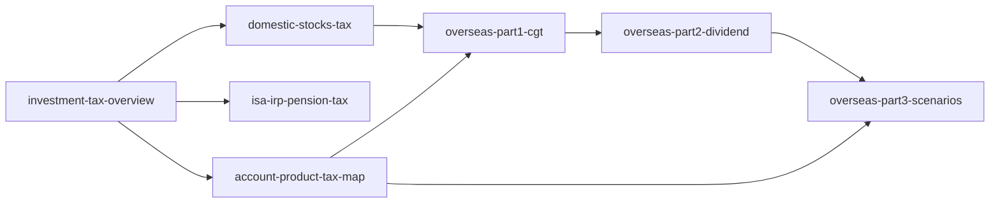

# 투자 세금 시리즈 — 읽기 순서

> **면책**: 교육 목적. 신고·납부는 국세청·세무 전문가 확인.

## 시리즈 개요

해외·국내 주식, ISA·IRP·퇴직연금, 계좌별 시나리오를 **분리**해 L3 깊이로 작성했습니다. Part1(양도세)은 이미 L3이며, Part2·3과 개요·국내·연금 문서를 같은 수준으로 맞췄습니다.

---

## 권장 읽기 순서

| # | 문서 | 난이도 | 읽기 시간 | 내용 |
|---|------|--------|-----------|------|
| 1 | [investment-tax-overview.md](investment-tax-overview.md) | L3 | 35~45분 | 금융소득 2,000만·국내/해외·5월 신고 |
| 2 | [domestic-stocks-tax.md](domestic-stocks-tax.md) | L3 | 30~40분 | KRX·NXT 매매차익·배당 |
| 3 | [isa-irp-pension-tax.md](isa-irp-pension-tax.md) | L3 | 40~50분 | ISA 3년·IRP 공제·DC 300만 |
| 4 | [account-product-tax-map.md](account-product-tax-map.md) | L3 | 40~50분 | 계좌×상품×QQQ 배치 |
| 5 | [overseas-stocks-tax-part1-cgt.md](overseas-stocks-tax-part1-cgt.md) | L3 | 40~50분 | 해외 양도세·250만 공제 |
| 6 | [overseas-stocks-tax-part2-dividend.md](overseas-stocks-tax-part2-dividend.md) | L3 | 35~45분 | 배당·금융소득·외국납부세액공제 |
| 7 | [overseas-stocks-tax-part3-scenarios.md](overseas-stocks-tax-part3-scenarios.md) | L3 | 35~45분 | 일반/ISA/IRP/DB 시나리오 |

---

## 주제별 바로가기

| 질문 | 문서 |
|------|------|
| 국내주식 팔면 세금? | [domestic-stocks-tax.md](domestic-stocks-tax.md) |
| QQQ 양도세? | [part1-cgt](overseas-stocks-tax-part1-cgt.md) → [part3](overseas-stocks-tax-part3-scenarios.md) |
| QQQ 배당? | [part2-dividend](overseas-stocks-tax-part2-dividend.md) |
| ISA 2026 한도? | [isa-irp-pension-tax.md](isa-irp-pension-tax.md), [../isa.md](../isa.md) |
| DB인데 QQQ 어디? | [account-product-tax-map.md](account-product-tax-map.md), [../irp.md](../irp.md) |

---

## 연계 정책 문서

- [../isa.md](../isa.md), [../irp.md](../irp.md), [../db-pension.md](../db-pension.md), [../dc-pension.md](../dc-pension.md)  
- 상위 인덱스: [../README.md](../README.md)

---

## 출처

- [references/sources.md](../../references/sources.md) — 국세청, law.go.kr, 금융위
