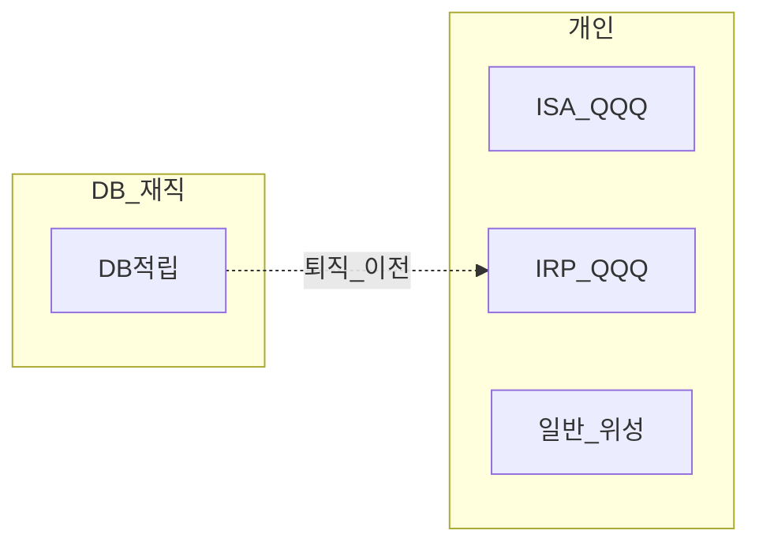
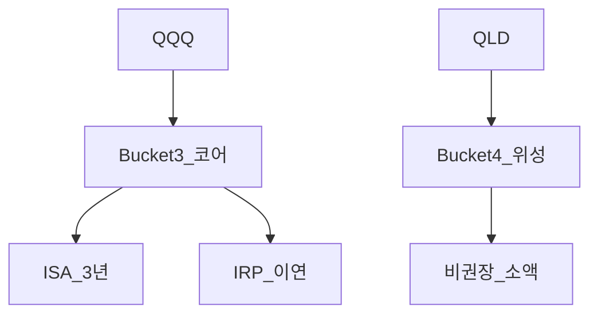

# 계좌×상품×보유기간 세금·역할 매핑

> **면책**: 본 문서는 교육 목적이며, 특정 개인·법인에 대한 투자·세무·법률 자문이 아닙니다.

## 메타

| 항목 | 내용 |
|------|------|
| 최종 검증일 | 2026-05-24 |
| 난이도 | L3 (Deep) — [READER-GUIDE](../../docs/READER-GUIDE.md) |
| 예상 읽기 시간 | 40~50분 |
| 관련 bucket | 0~4 전체 — **배치 설계도** |

## 0. 이 편 읽기 전 (5분)

| 항목 | 내용 |
|------|------|
| **난이도** | L3 (Deep) — [READER-GUIDE §L등급](../../docs/READER-GUIDE.md) |
| **선수** | 없음 |
| **이번 편에서 쓰는 기호** | L_ISA, ISA, IRP, DB, DC (해당 시) |
| **복습 한 줄** | — |

## TL;DR

1. **국내주식** 매매차익: 개인 **비과세** (KRX·NXT 동일, 예외 별도).
2. **해외 ETF**: **양도세** + 배당 **금융소득**.
3. **ISA**: 3년·손익통산·비과세 한도.
4. **IRP/DC**: **과세이연** → 수령 시.
5. **DB 재직**: 개인 **매매 없음** — QQQ는 **ISA·IRP·일반**.

---

## 1. 한 줄 정의 + 왜 중요한가
!!! info "CGT (Capital Gains Tax)"
    자산 매각 차익에 대한 세금.

**정의**: **4차원**(계좌 × 상품 × 보유기간 × bucket)으로 **어디에 무엇을 얼마나** 둘지 정리한 **세금·역할 매트릭스**입니다.

!!! info "ISA (Individual Savings Account)"
    개인종합자산관리계좌.

**왜 중요한가**: “QQQ 샀다” 한 줄로는 **DB/ISA/IRP/일반** 중 **어느 통로**인지 알 수 없습니다. 이 문서는 **한 장 지도**입니다.

---

## 2. 선수 / 이후

**선수**: [investment-tax-overview.md](investment-tax-overview.md)  
**이후**: [overseas-stocks-tax-part3-scenarios.md](overseas-stocks-tax-part3-scenarios.md), [../irp.md](../irp.md)

---

## 3. 직관·비유

**계좌 = 용기**, **상품 = 내용물**, **기간 = 뚜껑 잠금 시간**. 같은 물(QQQ)도 **유리병(ISA 3년)** · **냉동고(IRP)** · **종이컵(일반)** 에 따라 **냄새(세금)** 가 다릅니다.

---

## 4. 정식 용어

| 차원 | 값 예 |
|------|-------|
| 계좌 | 일반·ISA·IRP·DC·DB |
| 상품 | 국내주식·해외ETF·채권·QLD |
| 기간 | 단기·3년·은퇴까지 |
| bucket | 0~4 |

### 4a. 핵심 용어 (본문 등장 순)

> 복습용. 정의는 §4 본표·[glossary](../../00-roadmap/glossary.md)·본문 `!!! info` 박스.

| 용어 | 한 줄 | 관련 이론 | glossary |
|------|-------|-----------|----------|
| 차원 | 값 예 | §4 | [glossary](../../00-roadmap/glossary.md#차원) |
| 계좌 | 일반·ISA·IRP·DC·DB | §4 | [glossary](../../00-roadmap/glossary.md#계좌) |
| 상품 | 국내주식·해외ETF·채권·QLD | §4 | [glossary](../../00-roadmap/glossary.md#상품) |
| 기간 | 단기·3년·은퇴까지 | §4 | [glossary](../../00-roadmap/glossary.md#기간) |
| bucket | 0~4 | §4 | [glossary](../../00-roadmap/glossary.md#bucket) |

---

## 5. 메커니즘

### 5.1 4차원 매트릭스

| 계좌 | 국내주식 매매차익 | 해외 ETF 매매차익 | 배당/분배 | 운용 중 |
|------|-------------------|-------------------|-----------|---------|
| **일반** | 비과세(원칙) | 양도세 22%·5월 | 금융소득 | 즉시 과세 이벤트 |
| **ISA** | 통산·세제 | 통산·세제 | 통산 | 3년+ 혜택 |
| **IRP** | 이연 | 이연 | 이연 | 복리 |
| **DC** | 이연(가입자 운용) | 이연 | 이연(해외 이슈) | 70% 한도 |
| **DB 재직** | — | — | — | 회사·기관 |

### 5.2 DB 가입자

### 5.3 QQQ·QLD

| 상품 | 코어 B3 | 위성 B4 | DB 재직 |
|------|---------|---------|---------|
| QQQ | ISA/IRP | — | **불가** |
| QLD | 비권장 | 소액·단기 | **불가** |

---

## 6. 수식·모델

**10년 실질**(교육, 가상 수익 \(R\), 세율 차 \(\Delta\tau\)):

| 기호 | 이름 | 이 식에서 의미 |
|       ------       | ------ | ------이(가) 이 식에서 맡는 역할(§4·본문 참고) |
|   \(R_\)   | R  | R 이(가) 이 식에서 맡는 역할(§4·본문 참고) |
|             \(after\)             | after | after이(가) 이 식에서 맡는 역할(§4·본문 참고) |
|            \(R\)            | R | 기간당 이자·요구수익률 |
|             \(tau\)             | tau | tau이(가) 이 식에서 맡는 역할(§4·본문 참고) |
|             \(eff\)             | eff | eff이(가) 이 식에서 맡는 역할(§4·본문 참고) |
\[
R_{\text{after}} \approx R \times (1 - \tau_{\text{eff}})
\]

**읽는 법**: **R_**와 **after**의 관계를 위 식으로 쓴다. 경제·재무 해석은 변수표 「이 식에서 의미」와 [DEPTH-STANDARD](../docs/DEPTH-STANDARD.md) 기호 예제를 맞춘다.
\(\tau_{\text{eff}}\): 일반 **22%** vs ISA **9.9%** 초과분 vs IRP **이연**.

---

## 7. 한국 적용

### 7.1 2025

- ISA 200만·IRP 900만·국내 비과세·해외 250만 공제

### 7.2 2026

- ISA 500만·DC +300만·금투세 유예

### 7.3 보유기간 차원

| 기간 | 일반 해외 | ISA | IRP |
|------|-----------|-----|-----|
| <1년 | 양도세·5월 | **3년 미만** 위험 | 이연 |
| 3년+ | 누적 신고 | **비과세 한도** | 이연 |
| 은퇴 | — | 해지·갱신 | **연금** |

### 7.4 청년·부동산 (타 bucket)

| 상품 | 세금 문서 |
|------|-----------|
| 청년도약·미래적금 | 이자 **비과세**(요건) — [youth-leap-account](../youth-leap-account.md) |
| 부동산 | [real-estate-basics](../../07-real-estate/real-estate-basics.md) |
| 전세 보증금 | **채무·현금흐름** — [debt-and-interest](../../01-foundations/debt-and-interest.md) |

### 7.5 보유기간 × 세금 — 해외 QQQ (교육)

| 기간 | 일반 | ISA | IRP |
|------|------|-----|-----|
| <1년 매도 | 양도세·5월 | 3년 미만 **위험** | 이연 |
| 1~3년 | 누적 신고 | 유지 **필수** | 이연 |
| 3년+ | 누적 신고 | **비과세 한도** | 이연 |
| 은퇴까지 | — | 갱신·해지 설계 | **연금** |

### 7.6 실행 순서 (신규 투자자)

1. [investment-tax-overview.md](investment-tax-overview.md) — 지도  
2. 본 문서 — **배치**  
3. [overseas-stocks-tax-part3-scenarios.md](overseas-stocks-tax-part3-scenarios.md) — QQQ 시나리오  
4. [db-vs-dc-pension.md](../db-vs-dc-pension.md) — 퇴직연금 유형  
5. 연 5월 **홈택스** 점검 루틴

**법·정책 근거**: tax 시리즈·조세특례·소득세법 교차.

---

### 7.7 QLD·레버리지 — 계좌 배치 (교육)

| 상품 | 일반 | ISA | IRP | DC | DB |
|------|------|-----|-----|-----|-----|
| QQQ | △ 양도세 | ◎ 3년 | ◎ 이연 | ○ 70% | ✕ |
| QLD | △ | △ | △ | △ | ✕ |
| 국내 대형 | ◎ | ◎ | ○ | ○ | ✕ |

◎=코어 후보, △=위성·소액·비권장, ✕=재직 중 불가 — [leveraged-etf-qqq-qld.md](../../04-portfolio/leveraged-etf-qqq-qld.md).

---

## 8. 숫자 예제 (가상)

> 가상 배치.

### 예제 1: DB 가입자 Z

| 슬롯 | 상품 | 계좌 |
|------|------|----------------|
| 2a | (없음) | DB만 |
| 2b | QQQ | ISA+IRP |
| 4 | 코스닥 | 일반 |

### 예제 2: DC 가입자 AA

| | DC 70% | ISA |
|--|--------|-----|
| QQQ | **M** | 3년 묶음 |

### 예제 3: 해외 배당 (가상)

| 계좌 | 배당 **M** |
|------|------------|
| 일반 | 금융소득 |
| IRP | 이연(2025 선환급 폐지) |

---
## 9. FAQ

**Q1.** 가장 세금 효율 해외 코어? — **ISA·IRP**(조건).  
**Q2.** NXT? — [domestic-stocks-tax](domestic-stocks-tax.md).  
**Q3.** DC 300만? — **DC만**.  
**Q4.** 도약? — Bucket 1.  
**Q5.** 손실·배당? — **불가** 상쇄.  
**Q6.** 퇴직금 ISA? — **불가**.  
**Q7.** 3년 미만 ISA? — **추징**.  
**Q8.** Part3? — [overseas-part3](overseas-stocks-tax-part3-scenarios.md).

---

### 실행 워크숍 체크리스트 (교육)

| # | 질문 | Yes 시 다음 문서 |
|---|------|------------------|
| 1 | 해외 ETF·주식을 보유 중인가? | [overseas-stocks-tax-part1-cgt.md](overseas-stocks-tax-part1-cgt.md) |
| 2 | 해외 배당이 연 500만 이상인가? | [part2-dividend](overseas-stocks-tax-part2-dividend.md) |
| 3 | DB 재직인가? | [db-pension.md](../db-pension.md) + IRP·ISA |
| 4 | 국내주식을 NXT에서 거래하는가? | [korea-ats-nextrade.md](../../03-markets/korea-ats-nextrade.md) |
| 5 | 10년 코어가 QQQ인가? | [isa.md](../isa.md) 또는 [isa-irp-pension-tax.md](isa-irp-pension-tax.md) |

위 표는 **의사결정 보조**이며, 개인 소득·가구·회사 제도에 따라 답이 달라집니다. 불확실하면 [investment-tax-overview.md](investment-tax-overview.md) → [account-product-tax-map.md](account-product-tax-map.md) 순으로 읽으세요.

**Q9. 맵을 한 장으로 쓰려면?**  
**A9.** 본 문서 **5.1 표** + [overseas-stocks-tax-part3-scenarios.md](overseas-stocks-tax-part3-scenarios.md) **시나리오 ID**를 함께 인쇄·북마크하세요.

**Q10. 2026 ISA 500만이 맵에 미치는 영향?**  
**A10.** 해외 ETF **코어**의 ISA 비중·납입 상향 — 행동(과매매)은 [fomo-and-trading-hours.md](../../05-behavioral/fomo-and-trading-hours.md). 시행일은 금융위·국세청 **공식 확인** 필수.

## 10. 함정·리스크·한계

- **한 계좌에 전부**  
- **DB에서 QQQ** 착각  
- **QLD 코어**  
- **기간·한도** 무시  
- 개정 미반영

---

**Q. 실무에서는?**  
교과서 식·기호를 그대로 적용하기 전에 **수수료·세금·데이터 시점**을 분리한다. 숫자는 [DEPTH-STANDARD](../docs/DEPTH-STANDARD.md)처럼 기호만 먼저 맞추고, 법령·시장 수치는 §8 표·외부 출처로 갱신한다.

## L3 보충 — 장기 자산 형성 연결

본 절은 [DEPTH-STANDARD.md](../../../docs/DEPTH-STANDARD.md) L3 게이트를 충족하기 위한 **실행·교차 링크** 보충입니다.

### Bucket·현금흐름 연결

| Bucket | 대표 제도·자산 | 본 문서와의 관계 |
|--------|----------------|------------------|
| 0 | 비상금 MMDA | 세금·투자 **전** 우선 |
| 1 | [청년도약](../youth-leap-account.md)·[미래적금](../youth-future-savings.md) | 정책 적금 — 주식 **대체 아님** |
| 2a | DB·DC | [db-vs-dc-pension.md](../db-vs-dc-pension.md) |
| 2b | ISA·IRP | [isa.md](../isa.md)·[isa-irp-pension-tax.md](../tax/isa-irp-pension-tax.md) |
| 3 | QQQ·채권 코어 | [capm-and-risk-return.md](../08-advanced/capm-and-risk-return.md) |
| 4 | NXT·코스닥·QLD | [fomo-and-trading-hours.md](../05-behavioral/fomo-and-trading-hours.md) |

### 연간 점검 루틴 (교육)

| 분기 | 할 일 |
|------|--------|
| Q1 | [investment-tax-overview.md](../tax/investment-tax-overview.md) 캘린더 확인 |
| Q2 | [rebalancing-and-dca.md](../04-portfolio/rebalancing-and-dca.md) 코어 비중 |
| Q3 | 해외 배당·금융소득 **누적** — Part2 |
| Q4 | 익년 **5월** 양도세 자료 정리 — Part1 |
| ISA | 개설일 +36개월 **만기** 알림 |

### 2025 vs 2026 정책 추적

| 항목 | 확인 출처 |
|------|-----------|
| ISA 한도·비과세 | 금융위·조세특례 시행일 |
| DC +300만 공제 | 국세청·통합연금포털 |
| 청년도약 일몰·미래적금 | [kinfa](https://ylaccount.kinfa.or.kr) |
| 금융투자소득세 | 금융위 보도·[sources.md](../../../references/sources.md) |
| NXT 종목·거래중단 | [nextrade.co.kr](https://www.nextrade.co.kr) |

**면책 재확인**: 가상 예제·보도 수치는 **시점별 개정**됩니다. 실행·신고 전 공식 출처를 확인하세요.

## 11. 심화 읽기

- [db-pension.md](../db-pension.md), [isa.md](../isa.md), [leveraged-etf-qqq-qld](../../04-portfolio/leveraged-etf-qqq-qld.md)

---

## 12. 퀴즈

1. DB 재직 QQQ?  
2. 국내 매매차익(일반)?  
3. 해외 양도세 신고?  
4. QLD bucket?  
5. DC 300만 DB?

힌트
1. ISA/IRP 2. 비과세 3. 5월 4. B4 5. 아니오
