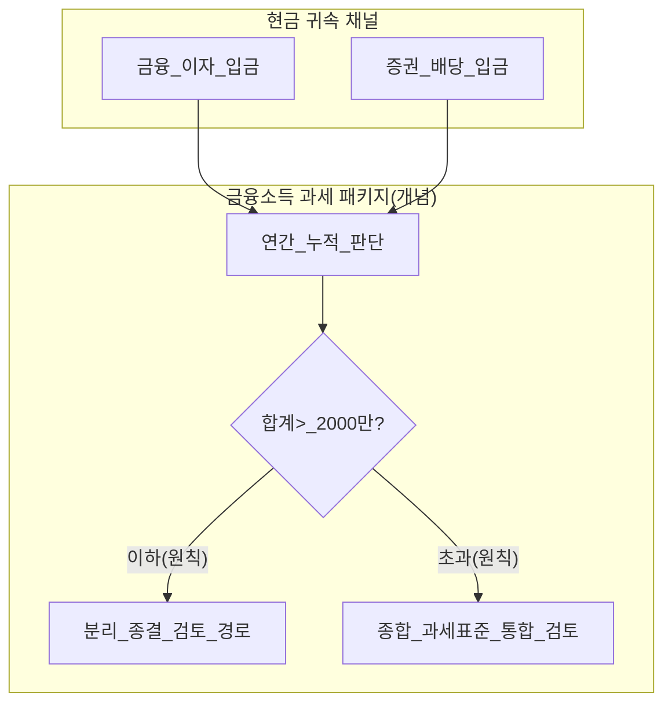
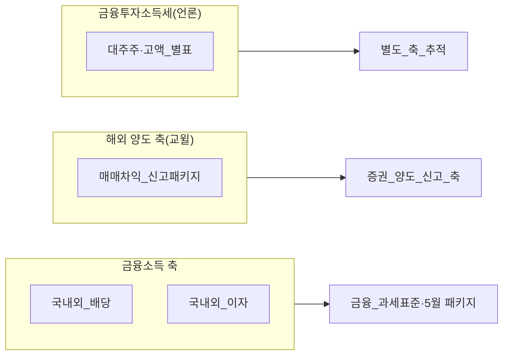
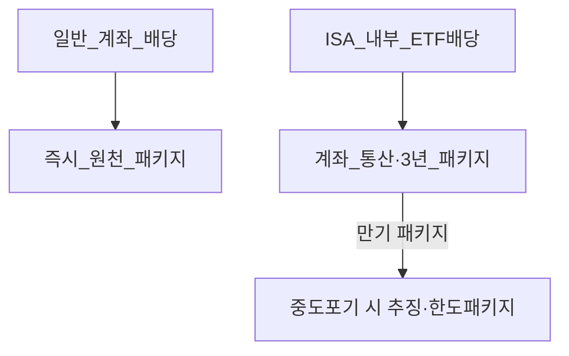

# 금융소득(이자·배당)과 2,000만 원 종합과세 게이트 — ISA·분리과세·5월 신고 통합 분석

> **면책**: 본 문서는 교육 목적이며, 특정 개인·법인에 대한 투자·세무·법률 자문이 아닙니다. 종합소득세 과세표준 계산에는 개인별 공제·기타 소득·부양가족 등이 포함되므로, 실제 과세 결과는 세무 전문가·국세청 상담이 필요합니다. 제도·세율·상품 조건은 변경될 수 있습니다.

## 메타

| 항목 | 내용 |
|------|------|
| 최종 검증일 | 2026-05-25 |
| 정책·법령 기준일 | 2026-05-25 (소득세법 체계·국세청 해외증권 안내 기준 교육용 정리; 개정 시 공식 재확인) |
| 난이도 | L4 |
| 예상 읽기 시간 | 75~95분 |
| 관련 bucket | Bucket 3(배당·이자 발생 자산)·Bucket 2b(ISA·IRP 과세 타이밍 상호작용)·Bucket 4(단기 과세 이벤트 인지) |

## TL;DR

1. **이자와 배당**은 일반적으로 **금융소득**으로 묶여 **연간 누적액이 2,000만 원을 초과**하면 과세방식 선택의 판단이 달라지고, **종합소득세 과세**(이하 **종합과세**)로 합산될 가능성을 **5월**에 신중하게 검토해야 합니다(**분리과세 종결 불가 우려 구간 진입).
2. **해외 증권의 매매차익**(자본 이득)·**금융투자소득세(대주주·고액 등 별도 제도)** 과는 **별도 축**입니다. 본 문서는 우선 금융소득(이자·배당)의 **종합 과세 진입 게이트**와 **분리 과세 종결 가능성**, **개인종합자산관리계좌(ISA) 손익통산 규격**까지를 **통합해서** 서술합니다.
3. **ISA**에서는 **연간 비과세 한도·중도 해지 규격·9.9% 분리 과세**(초과분) 같은 **계좌 내 세법**이 **일반 과세 즉시 발생형 이자·배당**(원천징수 즉시)과 **달리 움직이므로**, “금융소득 2,000만 원”과 **직접 1대1 단순 합산**으로 생각하면 **설계 오류**가 납니다([isa-irp-pension-tax.md](isa-irp-pension-tax.md)).
4. **국내 배당**과 **해외 배당**은 모두 과세 검토에는 들어오지만 **원천징수 규격·증빙·신고 형태**가 달라 **행정 비용**이 다릅니다. **종합 과세 진입 후**에는 **종합 과세표준·세율 구조** 때문에 **근로 소득·사업 소득**과의 **합산 왜곡(세율 절프)** 을 포함한 **비교정태**(한계 과세 결과)까지가 실무적인 의미를 갖습니다.
5. 학습 순서 상 **먼저** [investment-tax-overview.md](investment-tax-overview.md) 의 **유형별 지도**(매매차익은 해외 증권 증발·금융소득은 이자·배당 등)를 익히고, **연금 계좌**는 [isa-irp-pension-tax.md](isa-irp-pension-tax.md) 로 연결해야 **혼선이 줄어듭니다**.

---

## 1. 한 줄 정의 + 왜 중요한가

**정의**(본 문서의 좁은 정의): **금융소득 과세 게이트**란 개인에게 발생한 **주된 이자·배당**을 **연간 단위로 누적**했을 때 **소득세법 및 시행령이 정하는 기준**(원칙적으로 **연간 2,000만 원**)을 초과하는지 여부를 기준으로, **분리 과세 종결 가능성**(원천·신고 간소화)·**종합 과세**(다른 과세표준과 합산)로의 이동·**실효 세율 인상**이라는 **복합 결과**까지를 포함한 과세 패키지를 가리키는 교육용 작업명입니다.

**왜 중요한가**(장기 자산 형성·bucket 연결): 투자 수익의 **두 축**(① **양도**(매매차익)·② **이자·배당**(현금 플로우)) 중 ② 번은 현금 플로우가 **근로처럼 “매달 보이게”**(원천·입금 명목) 발생해 **종합 과세 검토**(5월)로 이어지기 **쉽습니다**. 같은 **글로벌 ETF**라도 계좌를 **ISA** 로 두면 **실질 과세 패키지**(3년 규격·통산 규격)가 달라지고(**Bucket 2b 연계**), **일반 과세 즉시형 국외 이자**(브로커 증빙)는 **증빙 수집** 자체가 **Bucket 4 성격**(단타 수준 트레이딩 패턴이라면 더욱 행정 비용이 큽니다—[time-horizon-and-buckets.md](../../04-portfolio/time-horizon-and-buckets.md)) 과 충돌합니다. 따라서 장기 목표물을 **코어**(Bucket 3)에 놓았다 하더라도 **과세 패키지**를 모르면 **현금 버킷**(배당 캐시)을 **예상외로 얇게**(세후) 만들어 **리밸런싱 속도 저하**, **예금식 상환 일정 깨짐** 같은 **실질 결과**가 생깁니다.

---

## 2. 선수 지식 / 이후 읽을 것

**선수**:
- [investment-tax-overview.md](investment-tax-overview.md) — 매매차익·금융소득·ISA 신고 역할 분리
- [isa-irp-pension-tax.md](isa-irp-pension-tax.md) — ISA 3년·비과세 한도·연금 과세 이연
- [overseas-stocks-tax-part1-cgt.md](overseas-stocks-tax-part1-cgt.md) — **해외 증권 양도과세**(본 문서 **주제 외축**)와의 혼동 방지용
- [overseas-stocks-tax-part2-dividend.md](overseas-stocks-tax-part2-dividend.md) — 해외 증권 **배당**의 증빙·금융소득 누적과의 연결
- [compound-interest-and-time-value.md](../../01-foundations/compound-interest-and-time-value.md) — 복리·세후 수익률의 직관

**이후**:
- [domestic-stocks-tax.md](domestic-stocks-tax.md) — 국내 매매차익 비과세·배당 금융소득
- [account-product-tax-map.md](account-product-tax-map.md) — 계좌×상품 과세 패키지
- [financial-statements-intro.md](../../01-foundations/financial-statements-intro.md) — 기업 현금 플로우와 배당의 연결—[dividends-buybacks.md](../../01-foundations/dividends-buybacks.md)

---

## 3. 직관·비유

**(1)** 금융소득(이자·배당)의 **종합 과세 검토 게이트**는 **카페 멤버십 카드의 ‘스탬프 적립 후 공제 패키지 교체’**에 비유할 수 있습니다. 스탬프 누적이 **연간 특정 까지만**(원칙 2천 단위까지)에서는 **카페 카운터**(원천·분리 과세 패키지)에서 **종결**(간편 패키지)하는 경우가 많으나, **스탬프가 과다**(초과)하면 **외부 회계 프로그램**(종합 과세 과세표준 프로그램)으로 **패키지를 통째로 교체해야** 하는 심리적 부담이 생기고 실효 과세 패키지에 **근로 패키지**와 **합쳐지는 순간**(합산 순간 세율이 달라질 수 있습니다)이라 **부드러운 증분이 아니라 플레이트의 경첩 교체**(세율 점프)·**증빙 작업**(해외 증명)도 같이 옮겨져 **체감 비용**이 큽니다.

**(2)** **ISA 내부의 손익통산**(해지·유지 패키지)은 **외부 카페 멤버십**과 같은 스탬프북이라기보다 **동일 카페 내 패밀리 박스**입니다. 카페 **공용 스탬프**(외부에서는 일별로 찍히는 이자·배당처럼)와 **패밀리 박스**(ISA 3년·한도)·**단체석**(IRP·연금 과세 이연)·**외부 카페**(해외 증권 증발) 간에 **통계 집합 방식**이 달라 **같아 보여도**(배당·이자 문자가 온 것처럼)**세목 집합**이 다른 것입니다 — 이것을 혼합하면 학습 노트 작성 시 **항상 오류**(과세표준 과대·과소)가 발생합니다.

**(3)** 학습에서는 **증권 앱 문자가 많이 올수록 과세 간소성이 줄어든다**는 규칙이 대체로 참입니다만, **증권 앱 문자의 내용 속성**(현금 플로우인지 증평가 차익인지)부터 정확해야 합니다 — **증평가**는 **종합 과세 2천 패키지**와 **별도 축**(특히 해외는 **증권 증발 양도세 경로**)입니다.

---

## 4. 정식 개념·용어

| 용어 | 한글 | English | 정의 |
|------|------|---------|------|
| 금융소득 | — | Financial income | 이자소득·배당소득 등 **현금 또는 현금등가 정기 지급** 위주 과세 카테고리(법령 목록 교육용) |
| 분리 과세 종결 가능성 | — | Separate-tax finalization | 특정 신고 패키지로 **종합 과세 안으로 반드시 들어가지 않고** 간소하게 정리 가능한 상태(실제 종결 가능 여부는 항목·국적·증빙·소득 총체에 의존) |
| 종합 과세·종합합산 | — | Global taxation / aggregation | 과세표준 산출 시 다른 소득과 **통합 과세 프로그램**에서 합산하는 구조적 가능성(**개인 신고 프로그램** 전체 포함) |
| 원천징수 | — | Withholding | 지급 시점 과세 패키지(세율·신고 패키지에 영향) |
| 과세 게이트(교육) | — | Tax threshold heuristic | 원칙 2천만 원 초과 시 **설계 패러다임 전환**(간소 패키지 → 통합 과세 프로그램) 경고등 |
| 금융투자소득세 | — | Major-shareholder/high-amount régime press | 미디어에서는 **별도 과세 프로그램**으로 보도되는 체계(대주주·고액 등 — **실제 시점·발동조건 추적 필요**) |
| 증권 양도소득(해외) | — | Capital gains taxation | 브로커 증평차익 과세 프로그램(대개 **250만 공제·연율 22%** 같은 별표)—**금융소득 과세 프로그램에서 혼합 금지** |
| ISA 손익통산·한도 비과세 | — | ISA P&L bucket | ISA **내부** 중도 운영 시 **패키지**가 다른 **계좌 수준 과세 프로그램** |
| 과세표준 증분(한계) | — | Marginal tax base wedge | 종합 과세 프로그램에서 **소득 1단위 증분**당 **실효 추가 세금** 패키지(근로 패키지·세액 공제와 상호 의존) |

---

## 5. 메커니즘

### 5.1 이자·배당 현금 플로우의 세법상 집합(교육)

### 5.2 해외 증권 증평차익·금융투자소득세 방향과의 평행 축 분리

### 5.3 ISA·일반 과세 패키지의 충족 순서 개념

본문에서는 **증권 앱 문자 횟수**가 아니라 **세법상 카테고리 패키지**를 기준으로 **일지**를 쌓는 것을 권합니다. 개인 학습에서는 **표준화된 스프레드시트**에 **통화·원천·국내외·증권/예금 명목을 분리**(ISA 여부 포함)해야 **5월 프로그램**에서 **증빙 구멍**(특히 **해외 이자 증명·환율·날짜의 일관성**)이 줄어듭니다 — 이는 장기 버킷**(Bucket 3)** 유지 속도**(리밸런싱 캐시)** 와 결합되어 **복리 패키지**의 **실효 속도**(세후 속도)·**리스크 감내 한도**(현금 버퍼 패키지)에 영향을 줍니다.

---

## 6. 수식·모델

### 6.1 연간 과세 패키지의 조건식 표기(교육·단순화)

개인의 **금융소득 누적 휴리스틱**을 \(F\)로 두고(법령상 정의·제외 항목은 별도),

\[
F = I_{\text{dom}} + I_{\text{for}} + D_{\text{dom}} + D_{\text{for}} + \cdots
\]

여기서 점들은 **항목 포함·제외**를 법령으로 확정해야 합니다. 교육용 **게이트**는

\[
F \le F^{\ast} \quad (\text{통상 } F^{\ast}=20{,}000{,}000~\text{원})
\]

일 때와 초과 시의 **설계 의사결정**을 비교합니다. **종합 과세프로그램**에서의 추가 세금의 **증분**(한계)은 개인 신고 프로그램에 의존하므로

\[
\frac{\mathrm{d} T_{\mathrm{agg}}}{\mathrm{d} F}\Big|_{\text{(개인 상태)}} ~\text{(개념)}
\]

이라는 **증분 과세 패키지**를 염두에 둘 때, **근로 과세패키지**가 이미 높구간이라면 증분이 **선형처럼 늘지 않고**(세액공제 교착 포함) **`계단 형`**일 수 있습니다.

### 6.2 비교정태(교육)

**변수 ①**: 근로 \(Y\) 증가(승진) — \(F\)를 넘더라도 **실효 증분**은 \(Y\)의 기존 구간에 의해 **비선형**일 수 있음.  
**변수 ②**: 해외 이자 \(I_{\text{for}}\) 변동(환율·금리) — \(F\)의 **변동성**이 커져 **사전 설계 창의 폭**이 줄어듦.  
**변수 ③**: ISA 내부 배당 — **\(F\)의 일부 항과 상호작용**(계좌 규격)으로 **단순 합산 금지**.

### 6.3 ISA 내부 비교(개념)

ISA **내부 누적 이익** \(G\)와 **비과세 한도** \(H\)에 대해, 일반 해외 ETF를 일반 계좌에 두었을 때의 **대략적 세후 이익 비교**는 [isa-irp-pension-tax.md](isa-irp-pension-tax.md) 의식의

\[
S_{\text{ISA}} \approx \text{(일반 해외 양도·배당 혼합 대비)} \quad (\text{단순})
\]

이라는 **설계 교육**용 비교지만, **종합 과세 프로그램**과의 상호교착 때문에 **항상 간단히 대체되지 않습니다**(세액 공제 교착·해외 증빙).

---

## 7. 한국 적용

### 7.1 2025년 기준 (확정 교육용 큰 줄기)

| 항목 | 개인 학습 초점 |
|------|----------------|
| 이자·배당 과세 카테고리 | **금융소득** 대화에 포함되어 **종합 과세 프로그램** 진입 검토 발생(**원칙 2천만 원**) |
| 국내 주식 매매차익(일반) | **금융소득 카테고리와 별축**(비과세 원칙) — [domestic-stocks-tax.md](domestic-stocks-tax.md) |
| 해외 증권 증평차익 | **양도소득세 신고 프로그램** — 분리 과세 카테고리 — [overseas-stocks-tax-part1-cgt.md](overseas-stocks-tax-part1-cgt.md) |
| 해외 증권 배당 | **금융소득 누적**에 포함·**증빙** 중요 |
| ISA | 계좌 **내부 통산 패키지** — [isa.md](../isa.md)·[isa-irp-pension-tax.md](isa-irp-pension-tax.md) |
| IRP·연금저축 등 | 과세 이연 프로그램·수령 시 연금 카테고리 |

### 7.2 2026년 개편·시행 예정 표기

| 항목 | 교육용 메모(시점 확인 필수) |
|------|-----------------------------|
| ISA 비과세 한도·연 납입 | 보도에 따른 확대 논의·시행 확인 — [investment-tax-overview.md](investment-tax-overview.md) |
| 금융투자소득세 | 시행·유예 **언론 추적** — 본 문서 **주제(이자·배당 2천 축)** 과 **혼동 금지** |
| DC 추가 납입 공제 | 연금 슬롯 설계와 연동 — [isa-irp-pension-tax.md](isa-irp-pension-tax.md) |

**법·정책 근거(학습 출발점)**: 소득세법·시행령, 조세특례제한법(특정 비과세·분리율), 국세청 해외 금융소득·증권 관련 안내, 금융위 보도 자료(금융투자소득세).

### 7.3 혼동 방지 체크리스트(실무 학습)

| 질문 | 오해 | 올바른 분리 |
|------|------|-------------|
| QQQ 팔아서 이익 | 금융소득 2천? | **해외 양도 프로그램**(대개 별도 신고 축) |
| QQQ 배당 입금 | 양도세? | **금융소득 누적** |
| 국내 코스피 배당 | 양도세? | **금융소득**·국내 매매차익과 **분리** |
| 대주주 보도 | 나도 2천? | **금융투자소득세**·지분 조건 **별도** |
| ISA 1년차 해지 | 배당만 종합? | **ISA 통산·추징** 우선 검토 |

### 7.4 5월 신고 캘린더와 bucket 연결

| 시기 | 의미 | bucket 메모 |
|------|------|-------------|
| 연중 | 원천·증빙 수집 | Bucket 3 **현금 흐름 일지** |
| **5월** | 확정 신고 | Bucket 2b·3 **과세 이벤트 집중** |
| ISA 만기 | 손익 패키지 확정 | Bucket 2b |

---

## 8. 숫자 예제 (가상)

> 모든 인물·금액·환율은 가상입니다.

### 예제 1: 국내 이자+해외 배당 누적

| 항목 | 금액(가상) |
|------|------------|
| 국내 은행 이자 | 400만 원 |
| 해외 ETF 배당(원화환산) | 1,700만 원 |
| **합계 \(F\)** | **2,100만 원** → **게이트 초과(원칙)** |

**교훈**: 해외 배당은 **문자·입금이 잦아도** **금융소득 누적**에 들어가 **게이트**를 움직입니다—[overseas-stocks-tax-part2-dividend.md](overseas-stocks-tax-part2-dividend.md).

### 예제 2: 동일인이 해외 양도 이익도 보유(축 분리)

| 항목 | 금액(가상) |
|------|------------|
| 해외 양도 이익 | 500만 원 |
| 양도세 프로그램(단순) | 공제 후 **별도 축** |
| 배당·이자 합 \(F\) | 1,800만 원 → **게이트 이하(원칙)** |

**교훈**: **양도 이익**은 **\(F\)** 와 **단순 합산 금지**(교육)—[overseas-stocks-tax-part1-cgt.md](overseas-stocks-tax-part1-cgt.md).

### 예제 3: ISA 내부 ETF vs 일반 계좌 ETF(개념)

| 구분 | 일반 | ISA(3년 유지 가정) |
|------|------|---------------------|
| 배당·운용 중 과세 패키지 | 즉시형 원천·누적 | **계좌 통산·한도** |
| 5월 종합 검토 | \(F\)에 직접 반영 경로 | **규격 상이** |
| 중도 해지 | 해당 없음 | **혜택 상실·추징** 위험 |

**교훈**: “배당이 같다면 세금 같다”는 **거짓** — [isa-irp-pension-tax.md](isa-irp-pension-tax.md).

### 예제 4: 근로 높구간 근로자 \(Y\) 패키지(가상 한계 과세 형태 교윌)

근로 과세패키지가 이미 높구간이라 \(F\)가 **소폭 초과만** 되어도 **실효 증분**이 **표면 세율×초과액**과 다를 수 있습니다(공제 교착). **교육**: 스프레드시트 간단 계산 금지, **종합 과세 프로그램** 전체 필요.

---

## 9. FAQ

**Q1.** **증권 앱 문자**가 많은데 과세 패키지는? — **항목 카테고리**(배당·이자·양도)·**계좌(ISA)·국내외** 순으로 재분류.  
**Q2.** **종합 과세**\(\neq\) 무조건 “불리”? — 근로·공제 상태에 따라 **케이스** — 전문 검토 필요.  
**Q3.** **해외 증평차익**으로 2천만 원을 깨나? — **통상 별축**(교윌).  
**Q4.** **국내 주식 매도 이익**은? — 원칙 **비과세** — **금융소득과 혼합 금지**.  
**Q5.** **금융투자소득세**\(\)=\)**종합 과세 프로그램**? — 별표·추적.  
**Q6.** **ISA 안 배당 문자** 많으면 종합 과세 패키지? — **통산 패키지** 우선 학습.[isa-irp-pension-tax.md](isa-irp-pension-tax.md)  
**Q7.** **이중 과세**(해외)·**외국 세액 공제**? — [part2](overseas-stocks-tax-part2-dividend.md)·전문 검토.  
**Q8.** **배당 재투자** DRIP 과세 카테고리? — **현금등가 지급** 여부 패키지—브로커·법령·세무로 확정.  
**Q9.** **MMF·예금 만기 이자**\(\)+\)**증권 배당**\(\)+\)**채권 이자**는? — **\(F\) 누적** 대화에 포함될 가능성 큼(**법령 포함·제외** 확인).  
**Q10.** **배당주 비중 줄이면** 과세패키지만 좋아지나? — **수익·현금 패키지**와 **양도패키지** 트레이드오프—[dividends-buybacks.md](../../01-foundations/dividends-buybacks.md).

---

## 10. 함정·리스크·한계

- **해외 양도세**와 **금융소득**을 **같은 스프레드시트 열**에 합산해 **5월 설계 붕괴**.  
- **ISA 패키지**를 몰라 **통산·추징** 손실.  
- **2천만 원** 교윌만 보고 **공제 교착** 무시하여 **증분 과세 과소평가**.  
- **언론 키워드**(금융투자소득세)와 **실제 과세 카테고리** 불일치.  
- 해외 증빙·환율 **불연속**(월별·건당)·**증명서 패키지** 부실.  
- **행정 비용 과소평가**로 Bucket 4 단타 패턴 유지 불가 (**시간 패키지** 없음).

---

## 11. 심화 읽기

- [references/sources.md](../../references/sources.md)  
- [tax/README.md](README.md)  
- 교재(**국제조세**)·금융경제학(배당 정책 이론) — 후속 [dividends-buybacks.md](../../01-foundations/dividends-buybacks.md)

---

## 12. 스스로 점검 퀴즈

1. \(F^{\ast}=2{,}000\) 만 원 교윌의 **직접 포함 대상**(배당·이자)·**통상 분리**(해외 증평)·**국내 매매**를 각각 말하시오.  
2. 종합 과세 프로그램의 **한계 증분 과세 패키지**가 선형이라고 보지 말아야 하는 이유.  
3. ISA 내부 배당 문자가 많을 때 단순 \(F\) 누적의 위험.  
4. 5월이 중요한 **두 가지 이유**(금융·양도 프로그램).  
5. [investment-tax-overview.md](investment-tax-overview.md) 에서 **라우팅**의 핵심 한 줄.  
6. **금융투자소득세**와 본 문서 축의 분리 문장.  
7. Bucket 3과 연결되는 **현금 일지** 항목 3가지.  
8. 해외 이자의 **행정 비용**이 큰 이유.

정답 힌트

1. 배당·이자는 \(F\) 대화, 해외 증평은 대개 별도 양도 축, 국내 매매차익은 원칙 비과세.  
2. 세액공제·구간·타 소득 합산으로 계단형 증분 가능.  
3. ISA는 계좌 통산·3년·한도 패키지로 외부 \(F\)와 직접 합산 금지.  
4. 금융소득 확정·해외 양도 확정 등 점검 집중.  
5. 유형별 지도·계좌 세제 연결.  
6. 대주주·고액 별도 제도 — 이자·배당 2천 축과 별개.  
7. 배당·이자·만기 이자 입금 기록.  
8. 증빙·환율·브로커 명세 불연속.

---

## 13. L4 확장판 — 분리과세 패키지·종합합산 패키지·원천·신고의 연역적 정리

### 13.1 “분리과세” 표현의 함정부터 정리하기

금융소득을 둘러싼 헤드라인용 단어 중 **분리 과세**(separate taxation)는 교윌 문맥에서는 **종합 과세 과세표준 프로그램에 합류하지 않는 경로**(원천 과세 패키지·고정 또는 하한 신고 패키지)를 가리키는 경우가 많은데, **현장 세무 프로그램**에서는 **종합 과세 과세표준과 합산되지 않는 항**(완결형 원천)과 **종합 과세 과세표준에는 들어오지만 과세 방법이 규격화**(세율·공제 순서 교착)된 항까지 **언어 레이블이 같은 방으로 수납되어** 학습 초기에는 **항상 헷갈립니다.** 본 절에서는 **패키지 3중 분류**만 기억하라고 단정합니다:

**패키지 A(원천·분리 패키지)**: 현금 귀속 시점 과세 카테고리가 **종합 과세 과세표준 합류 경로**(global base) 바깥에 머물며 **종결 가능성**(administratively closed) 높음. 교윌상 **금융소득 누적 \(F\le F^{\ast}\)** 과 함께 나타나 자주 접하는 항목.

**패키지 B(분리 과세처럼 보이지만 교착)**: 문자·원천은 **종결**(closed)처럼 보이지만, **증빙·환급 프로그램**(**해외 과세 카테고리**) 때문에 **종합 과세 과세표준 경로**(global reconciliation)까지 **증거 자료 패키지**가 연장된 항목. **표면 세율**(rate) 문제가 아니라 **증빙·환율·일자** 문제가 과세패키지의 병목(becomes bottleneck).

**패키지 C(종합 합류 확정 패키지)**: \(F>F^{\ast}\) 등 **항목 조합** 때문에 **종합 과세 과세표준 프로그램** 본표에 들어와 **근로·사업·연금 카테고리**까지 **증분 세율**이 교착되는 항목. 이때 과세패키지는 단순 **세율×과세표준**(linear wedge)이라는 **금융 모형의 선형 증분**과 달라 **공제 순서 교착**을 만들 수 있습니다.

이 3패키지만 먼저 놓으면 학습 노트에서는 **증권 앱 문자 줄 수**(count) 같은 **통계량 허위 대리변수**(bad proxy)**를 버립니다.**

### 13.2 5월 프로그램에 들어가기 전 현금 버킷 시간선(워크플로)

장기 학습에서는 **연간 \(F\) 누적을 분기**(Q1–Q4)로 **예측하는 예산**(forecast) 과 **증빙 수집의 병렬화**(parallel collection) 가 **복리 프로그램**과 직결됩니다.[time-horizon-and-buckets.md](../../04-portfolio/time-horizon-and-buckets.md)

| 분기 | Bucket 3 작업 패키지 | 세무 증거 패키지 |
|------|----------------------|-------------------|
| Q1 | 목표 현금 버퍼·배당 캘리브레이션 | 국내 은행·증권 **원천명세 패턴** 초기화 |
| Q2 | 해외 ETF 배당**(드립·현금 차이 교윌)** 패턴 학습 | 브로커 **연간 요약 패턴** 시작 |
| Q3 | **게이트 \(F^{\ast}\)** 교착 접근 가능성 패널(what-if 시트) | 환산이자 패키지(월별·건당)·**증명 패키지** 정리 착수 |
| Q4 | 리밸런싱·세금 발생 동시 교착(현금 패키지) | **종합 과세 과세표준 시뮬레이션** 전문 패키지(전문 검토)·**증빙 백업 디스크 패키지** |

### 13.3 해외 과세 카테고리와 금융소득 누적의 이중 교착(학습 패널)

**해외 과세 카테고리**에서는 **증권 양도세**(증평)·**외국 납세·공제 프로그램**·**배당·이자 카테고리**가 같은 브로커명세에 **복합 문자**처럼 섞입니다. 교윌상 **증평은 \(F\)에 넣으면 패널 신호 오염**(contamination)** 발생**이라는 문장 하나를 **항상 헤더**로 붙이십시오.

| 혼합 문자 유형 | 올바른 축 분리 | 잘못된 축 분리 패널 패널티 |
|----------------|----------------|------------------------------|
| DRIP처럼 자동 재투자 문자 | 카테고리 먼저(현금등가 프로그램) | 문자 수로 \(F\) 대리 |
| 옵션·선물 과세 카테고리(교윌 범위 밖 가능) | 별표·별도 과세 카테고리 | 일반 증권 카테고리 섞임 |
| 환테크·구조화 패키지(교윌) | 전문 카테고리 | ETF 단순 가정 오류 |

### 13.4 ISA·IRP·일반 과세 프로그램의 상호 교착(계좌 수준 교윌)

 ISA는 **연간 비과세 한도 패키지**·**중도 패널티 패키지**(추징)·**운용 패키지의 손익통산 카테고리**가 같은 **버킷(계좌) 내부**에서 **동시 교착**합니다. 학습 패널에서는 **외부 현금 증발 \(F_{\text{외부}}\)** 와 **내부 통산 카테고리 \(G_{\text{ISA}}\)** 를 **수식적으로 직접 합**(illegal merge in pedagogy)**하지 말고**, **먼저**(first) ISA 규격을 **만기 교착**까지 포함해 읽습니다.[isa-irp-pension-tax.md](isa-irp-pension-tax.md) IRP·DC는 과세패키지가 **연금 카테고리·수령 시점 카테고리**까지 밀립니다.**Bucket 3** 코어 현금 과세패키지는 **일반+ISA**(만기 시점)**로 이원화** 설계하는 것이 장기 복리 패키지에 유리한 경우가 많습니다(개인별).

### 13.5 분리·종합을 둘러싼 수리적 직관(모형 유도 감각)

단순화된 **비선형 세액 함수** \(T(F,Y)\) 를 상정하면(교윌·가상),

\[
T(F,Y)=T_0(Y)+\mathbb{1}\{F>F^{\ast}\}\cdot \Delta(F,Y)
\]

여기서 \(\Delta\) 는 **공제 항·세율 구간·기부·의료·신용카드** 등 **전체 신고 패키지**에 의존하는 **비선형 보정 함수**입니다. 따라서 **\(F\)의 작은 증분**도 **\(\Delta\)** 를 통해 **큰 점프**를 만들 수 있어 **\(F\approx F^{\ast}\)** 인 **경계 인접(bucket adjacency)** 구간은 **정책 설계·자산배분**에서 **민감도 분석**(sensitivity)이 필요합니다.

### 13.6 한국 대기업·해외 자산군과의 연결(배당 정책 축 교윌)

금융소득 누적은 **기업의 배당 정책**이 실제 현금 패키지에 영향합니다. 증평 프로그램(매매)·배당 프로그램(현금)·자사주 매입 프로그램(현금 vs 주식)·**기업 거버넌스**(지배구조 패키지)는 [dividends-buybacks.md](../../01-foundations/dividends-buybacks.md) 와 교차 학습해야 **종합 과세 축**(현금 과세 프로그램)과 **가치 축**(기업 현금 귀속)이 동시 이해됩니다.

### 13.7 금융투자소득세(언론)와의 용어 경계 교윌 2쪽

**(1)** 용어만 같거나 비슷해도 **대상 카테고리·시행 카테고리·예외 카테고리**가 다른 **패러다임 전환 프로그램**일 수 있습니다. **(2)** 본 문서 교윌은 **연간 2천만 원 카테고리 이자·배당 과세패키지**축입니다. **(3)** 대주주·고액·시행 논의는 **별도 추적 카테고리**로 **출처 디렉토리**(금융위 보도·국회 법안 추적 디렉토리)·[investment-tax-overview.md](investment-tax-overview.md) 섹션 7.4를 읽습니다.

### 13.8 가상 패널 표 — 과세 카테고리 혼합(확대)

**(가상 F1)** 신혼 부부 학습패널: 배우자 A는 근고 \(Y\) 매우 높음, 배우자 B는 \(F\) 중간.**종합 과세 프로그램**에서 **증분 과세패키지**는 **표준 교윌 표** 금지.  
**(가상 F2)** 퇴직 직후 \(Y\) 급감·\(I_{\text{for}}\) 상승(연금 디컴프레션)**프로그램** 교착.  
**(가상 F3)** 브로커를 이중화(복수 채널)·명세 패턴 분기—**증빙 통합 프로그램** 실패 패널.  
**(가상 F4)** ISA 35개월·해지 vs 유지 교착·**\(F_{\text{외부}}\)** 는 1,980만 교착(게이트 경계)**프로그램 민감도 테스트**.

### 13.9 FAQ 확장 패널(+6)

**Q11.** **전환사채 이자**(교윌)는 어디 축? — **법 카테고리·원천·만기패키지** 확정 필요.  
**Q12.** **해외 채권 ETF 이자 문자** 줄은? — **해외 카테고리 패키지**·증빙 우선.[part2](overseas-stocks-tax-part2-dividend.md)  
**Q13.** **국내 REIT 분배금**(교윌) 카테고리? — 특례 카테고리 가능—전문 카테고리.  
**Q14.** **정기예금 분할 인출**(분기 교착)·이자 카테고리는? — **현금 교착 카테고리** 집합.  
**Q15.** 종합 과세 패키지 **행정 시간**(시간패키지)은 Bucket 몇 축 교착인가? — **Bucket 2b·3** 시간 패키지(학습 교착)·[분기 패널표](#132-5월-프로그램에-들어가기-전-현금-버킷-시간선워크플로).  
**Q16.** **소액이라도** 문자 많으면? — **증빙 병렬화 비용 교착**은 완만하지 않음.

### 13.10 복습 체크 10문항(항목만 — 답은 개인 과제)

금융소득 카테고리 **법령 포함·제외**를 law.go.kr로 찾아 **자기 언어**로 재서술(5문항). 증평 카테고리 **증권 카테고리** 대조표(3문항). ISA 만기 카테고리 **패널티** 문단화(2문항).

---

## L4 보충 — 비교정태학·한계 사례·연습문제

### A. 비교정태 그림(서술)

**(1) 금리 상승**: \(I_{\text{dom}}\)과 \(I_{\text{for}}\)가 동시에 상승하면 \(F\)의 **분산은 감소·평균은 상승**할 수 있어 **게이트 통과 확률**이 올라갑니다. 이때 **주식 비중을 줄이지 않아도** 예금·MMF 이자만으로 **피크 \(F\)** 가 올라가 **종합 프로그램**으로 밀릴 수 있습니다 — **자산배분과 무관한 금리 축**이 과세 축을 움직입니다.

**(2) 환율 변동**: 해외 배당을 원화로 환산할 때 **분기·연말 환율**의 차이로 **스파이크**가 생겨 **게이트 오판**이 납니다. **교육**: **거래일·지급일·환율 규칙**을 문서화.

**(3) 승진·배우자 합산·부양 패키지**: 종합 과세 프로그램은 **가구 단위 교착**(공제 교착)을 만들 수 있습니다 — 학습에서는 **표준 간이표** 금지, **통합 프로그램** 인지가 핵심입니다.

### B. 한계 사례(교윌)

**한계 사례 ①**: 브로커가 **환급 프로그램**으로 배당 처리를 변경 — 법 카테고리 표기와 실제 문자 상이 가능.  

**한계 사례 ②**: 장내 채권 **이자**(국내)·**해외 ETF 채널**(해외 과세 카테고리) 혼재 — 카테고리 분리 필요.  

**한계 사례 ③**: **ISA 35개월** 시점 단기 과세패키지 **노브레이커**(해지 결정 교착)·**종합 과세 프로그램**과의 상호 교착.

### C. 연습문제(기술답 필요)

**(P1)** 가상표: 국내 이자 450·해외 배당 900·국내 배당 700 (**단위 만 원**) — \(F\) 및 게이트.  
**(P2)** 동일표에 해외 증평차익 800 추가 — 교윌상 \(F\)에 포함되는가?(Yes/No+이유 한 문장)

연습 해답 힌트

P1: \(F=2050\) → 게이트 초과(교윌). P2: No — 양도 별축(교윌).

