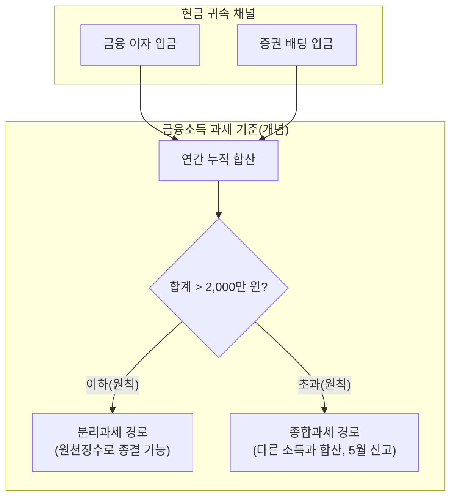
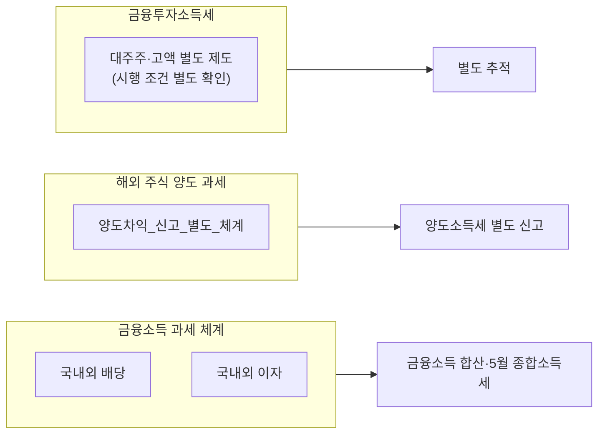
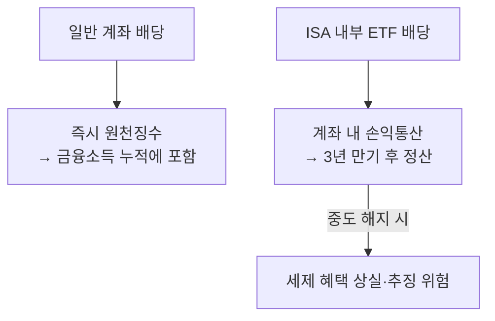

# 금융소득(이자·배당)과 2,000만 원 종합과세 게이트 — ISA·분리과세·5월 신고 통합 분석

> **면책**: 본 문서는 교육 목적이며, 특정 개인·법인에 대한 투자·세무·법률 자문이 아닙니다. 종합소득세 과세표준 계산에는 개인별 공제·기타 소득·부양가족 등이 포함되므로, 실제 과세 결과는 세무 전문가·국세청 상담이 필요합니다. 제도·세율·상품 조건은 변경될 수 있습니다.

## 메타

| 항목 | 내용 |
|------|------|
| 최종 검증일 | 2026-05-25 |
| 정책·법령 기준일 | 2026-05-25 (소득세법 체계·국세청 해외증권 안내 기준 교육용 정리; 개정 시 공식 재확인) |
| 난이도 | L4 (Graduate) — [READER-GUIDE](../../docs/READER-GUIDE.md) |
| 예상 읽기 시간 | 75~95분 |
| 관련 bucket | Bucket 3(배당·이자 발생 자산)·Bucket 2b(ISA·IRP 과세 타이밍 상호작용)·Bucket 4(단기 과세 이벤트 인지) |

## 0. 이 편 읽기 전 (5분)

| 항목 | 내용 |
|------|------|
| **난이도** | L4 (Graduate) — [READER-GUIDE §L등급](../../docs/READER-GUIDE.md) |
| **선수** | [investment-tax-overview](investment-tax-overview.md), [isa-irp-pension-tax](isa-irp-pension-tax.md) |
| **이번 편에서 쓰는 기호** | F 금융소득 합계, F* 종합과세 기준(2,000만 원), I_dom 국내 이자, I_for 해외 이자, D_dom 국내 배당, D_for 해외 배당 |
| **복습 한 줄** | L3 선수 편을 먼저 읽으면 수식이 수월함 |

## TL;DR

1. **이자와 배당**은 일반적으로 **금융소득**으로 분류되어 **연간 누적액이 2,000만 원을 초과**하면 종합소득세 신고 대상이 될 수 있어 5월에 신중하게 검토해야 한다.
2. **해외 주식 매매차익(양도차익)**·**금융투자소득세(대주주·고액 등 별도 제도)** 는 금융소득(이자·배당)과 **별도 과세 체계**다. 본 문서는 금융소득(이자·배당)의 **종합과세 진입 기준**과 **분리과세 종결 가능성**, **ISA 손익통산 규정**을 통합 서술한다.
3. **ISA**에서는 연간 비과세 한도·중도 해지 규정·9.9% 분리과세(초과분) 같은 **계좌 내 세제**가 일반 계좌의 원천징수 즉시 발생 방식과 다르게 작동하므로, "ISA 배당도 금융소득 2,000만 원 기준에 그냥 더하면 된다"고 생각하면 설계 오류가 발생한다. [isa-irp-pension-tax.md](isa-irp-pension-tax.md)
4. **국내 배당**과 **해외 배당** 모두 금융소득 과세 검토 대상이지만 원천징수 방식·증빙 수집·신고 형태가 달라 행정 처리 비용이 다르다. 종합과세 구간에 진입하면 근로소득·사업소득과 합산되어 한계 세율이 달라질 수 있다.
5. 학습 순서상 먼저 [investment-tax-overview.md](investment-tax-overview.md)에서 과세 유형별 지도(양도차익은 해외 증권 양도소득세, 금융소득은 이자·배당 등)를 익히고, 연금 계좌는 [isa-irp-pension-tax.md](isa-irp-pension-tax.md)로 연결해야 혼선이 줄어든다.

## 1. 한 줄 정의 + 왜 중요한가

!!! info "CGT (Capital Gains Tax)"
    자산 매각 차익에 부과하는 세금. 한국에서는 해외 주식 양도차익에 적용되며 금융소득 과세(이자·배당)와 별도 체계다.

**정의**(본 문서의 정의): **금융소득 과세 기준**이란 개인에게 발생한 이자·배당을 연간 단위로 합산했을 때 소득세법이 정하는 기준(원칙적으로 **연간 2,000만 원**)을 넘는지 여부에 따라, 원천징수로 과세가 끝나는 **분리과세 경로**와 다른 소득과 합산하는 **종합과세 경로** 중 어느 쪽으로 갈지가 결정되는 과세 체계를 말한다.

구체적으로: 이자·배당 합계가 연 2,000만 원 이하이면 원천징수(14% 또는 15.4%)로 과세가 사실상 종결된다. 2,000만 원을 초과하면 초과 금액뿐 아니라 전체 금융소득이 다른 소득(근로소득, 사업소득 등)과 합산되어 누진세율(6%~45%)이 적용되는 종합소득세 신고가 필요해진다.

!!! info "Bucket"
    시간·목적별 **자금 슬롯**(0 비상금 → 3 코어 등)

!!! info "ETF (Exchange Traded Fund)"
    거래소에 상장된 펀드. 지수나 자산 묶음을 주식처럼 사고팔 수 있다.

!!! info "ISA (Individual Savings Account)"
    개인종합자산관리계좌. 계좌 내 손익을 통산하고 일정 한도까지 세제 혜택을 받는 금융 계좌.

!!! info "IRP (Individual Retirement Pension)"
    개인형 퇴직연금. 퇴직금이나 추가 납입금을 운용하며 수령 시 연금 과세가 적용된다.

**왜 중요한가**: 투자 수익의 두 축 중 ① 양도차익(주식·펀드 매도)과 ② 이자·배당(현금 유입)은 과세 체계가 완전히 다르다. 이자·배당은 받는 즉시 원천징수로 세금이 빠지고, 연간 합산액에 따라 5월 종합소득세 신고 필요 여부가 결정된다. 같은 글로벌 ETF라도 ISA 계좌에 담으면 과세 체계(3년 규정·손익통산)가 달라진다(Bucket 2b 연계). 해외 이자는 증빙 수집 자체가 상당한 행정 부담이 된다. 따라서 장기 코어(Bucket 3)를 설계할 때 과세 구조를 모르면 세후 실제 현금이 예상보다 적어 리밸런싱 속도가 늦어질 수 있다.

## 2. 선수 지식 / 이후 읽을 것

**선수**:
- [investment-tax-overview.md](investment-tax-overview.md) — 양도차익·금융소득·ISA 신고 역할 분리
- [isa-irp-pension-tax.md](isa-irp-pension-tax.md) — ISA 3년·비과세 한도·연금 과세 이연
- [overseas-stocks-tax-part1-cgt.md](overseas-stocks-tax-part1-cgt.md) — 해외 증권 양도소득세(본 문서 주제 외 축)와의 혼동 방지
- [overseas-stocks-tax-part2-dividend.md](overseas-stocks-tax-part2-dividend.md) — 해외 증권 배당의 증빙·금융소득 누적 연결
- [compound-interest-and-time-value.md](../../01-foundations/compound-interest-and-time-value.md) — 복리·세후 수익률의 직관

**이후**:
- [domestic-stocks-tax.md](domestic-stocks-tax.md) — 국내 양도차익 비과세·배당 금융소득
- [account-product-tax-map.md](account-product-tax-map.md) — 계좌×상품 과세 구조
- [financial-statements-intro.md](../../01-foundations/financial-statements-intro.md) — 기업 현금 흐름과 배당의 연결—[dividends-buybacks.md](../../01-foundations/dividends-buybacks.md)

## 3. 직관·비유

**(1) 세금 게이트의 작동 방식**: 매년 1월부터 12월까지 받은 이자와 배당을 모두 더한 금액이 "2,000만 원 이하"이면 이미 원천징수로 세금 처리가 끝난 것으로 볼 수 있어 5월에 별도로 종합소득세 신고를 할 필요가 없는 경우가 많다. 반면 2,000만 원을 초과하면 상황이 달라진다. 초과 금액만이 아니라 **전체 금융소득**이 근로소득, 사업소득 등과 합쳐져 6%~45%의 누진세율이 적용된다. 이미 원천징수로 낸 세금은 공제되지만, 합산 소득이 높은 구간에 해당하면 추가 납부가 생길 수 있다.

**(2) ISA 계좌는 별도 규칙이 적용되는 특별 공간**: ISA 계좌 안에서 발생한 배당·이자는 외부 금융소득 2,000만 원 기준 계산과 직접 합산되지 않는다. ISA는 계좌 내에서 손익을 통산(이익과 손실을 상쇄)하고, 일정 금액까지는 비과세 또는 낮은 세율(9.9%)을 적용받는 별도 세제가 적용된다. 예를 들어 ISA 안에서 A 펀드가 200만 원 이익, B 펀드가 100만 원 손실이면 순이익 100만 원에만 세금이 붙는다. 이 100만 원은 외부 계좌 배당과 합산하는 것이 아니라 ISA 내부 규정대로 처리된다.

**(3) 양도차익(매매차익)과 금융소득은 서로 다른 과세 체계**: 증권사 앱에서 "수익"이라는 알림이 오면 두 가지를 반드시 구분해야 한다. 주식을 팔아서 생긴 이익(양도차익)은 금융소득 2,000만 원 기준에 포함되지 않는다. 국내 상장 주식 양도차익은 일반 개인의 경우 원칙적으로 비과세이고, 해외 주식 양도차익은 별도 신고 대상(연 250만 원 기본공제, 22% 세율)이다. 배당·이자로 받은 금액만 금융소득 기준 계산에 포함된다.

**쉽게 말하면:** 금융투자소득세는 아직 일반 개인에게 **적용되지 않는 유예 상태**입니다. 2026년에도 유예 보도가 지속되고 있습니다. 지금은 기존 양도소득세·금융소득세 규칙이 그대로 적용됩니다.

**핵심은:** 금융투자소득세가 언젠가 시행되면, 국내 상장주식 매매차익도 과세 대상이 될 수 있습니다. 현재는 개인 투자자의 국내 상장주식 매매차익은 원칙적으로 비과세입니다.

**주의:** “금투세가 유예되었으니 금융소득도 세금이 없다”는 잘못된 이해입니다. 이자·배당 등 금융소득은 현재도 과세 중이며, 연 2,000만 원 초과 시 종합과세가 적용됩니다.

## 4. 정식 개념·용어

| 용어 | 한글 | English | 정의 |
|------|------|------|----------------|
| 금융소득 | — | Financial income | 이자소득·배당소득 등 정기적 현금 유입으로 발생하는 소득 항목 |
| 분리과세 | — | Separate-tax finalization | 원천징수로 과세가 종결되어 종합소득세 신고 대상에서 제외되는 경로 |
| 종합과세 | — | Global taxation / aggregation | 금융소득을 다른 소득과 합산해 누진세율을 적용하는 신고 방식 |
| 원천징수 | — | Withholding | 이자·배당 지급 시점에 세금을 미리 공제하는 제도 |
| 금융소득 2,000만 원 기준 | — | Tax threshold (₩20M) | 이 기준을 초과하면 종합과세 신고 검토 필요 (소득세법 기준) |
| 금융투자소득세 | — | Financial investment income tax | 대주주·고액 투자자 대상 별도 과세 제도(시행 조건·시기 별도 확인 필요) |
| 해외 주식 양도소득세 | — | Capital gains tax (overseas) | 해외 주식 매매차익에 부과하는 세금. 연 250만 원 기본공제, 22% 세율(교육용) |
| ISA 손익통산 | — | ISA P&L netting | ISA 계좌 내 이익과 손실을 상쇄한 순이익에 과세하는 방식 |
| 한계 세율 | — | Marginal tax rate | 소득이 1원 늘어날 때 추가로 내는 세금의 비율 |

### 4a. 핵심 용어 (본문 등장 순)

> 복습용. 정의는 §4 본표·[glossary](../../00-roadmap/glossary.md)·본문 `!!! info` 박스.

| 용어 | 한 줄 | 관련 이론 | glossary |
|------|------|------|----------------|
| 금융소득 | 이자소득·배당소득 등 정기적 현금 유입 | §4 | [glossary](../../00-roadmap/glossary.md#금융소득) |
| 분리과세 | 원천징수로 과세 종결, 종합소득세 신고 불필요 | §4 | [glossary](../../00-roadmap/glossary.md#분리-과세-종결-가능성) |
| 종합과세 | 다른 소득과 합산해 누진세율 적용 | §4 | [glossary](../../00-roadmap/glossary.md#종합-과세·종합합산) |
| 원천징수 | 지급 시점 세금 공제 | §4 | [glossary](../../00-roadmap/glossary.md#원천징수) |
| 금융소득 2,000만 원 기준 | 이 기준 초과 시 종합과세 신고 검토 | §4 | [glossary](../../00-roadmap/glossary.md#과세-게이트) |
| 금융투자소득세 | 대주주·고액 투자자 별도 과세 제도 | §4 | [glossary](../../00-roadmap/glossary.md#금융투자소득세) |
| 해외 주식 양도소득세 | 해외 주식 매매차익에 부과. 금융소득과 별도 체계 | §4 | [glossary](../../00-roadmap/glossary.md#증권-양도소득) |
| ISA 손익통산 | ISA 내부 이익·손실 상쇄 후 과세 | §4 | [glossary](../../00-roadmap/glossary.md#isa-손익통산·한도-비과세) |
| 한계 세율 | 소득 1원 증가 시 추가 세금 비율 | §4 | [glossary](../../00-roadmap/glossary.md#과세표준-증분) |

## 5. 메커니즘

### 5.1 이자·배당 현금 유입의 과세 판단 흐름(교육)

### 5.2 해외 주식 양도차익·금융투자소득세와의 과세 체계 분리

### 5.3 ISA·일반 계좌의 과세 방식 차이

실무에서는 증권사 앱 알림 수가 아니라 **소득 항목의 법적 분류**를 기준으로 기록해야 한다. 개인 학습에서는 통화·원천국·국내외 구분·증권/예금 명목을 분리(ISA 여부 포함)해서 기록해야 5월 신고 때 증빙 오류(특히 해외 이자 증명서·환율·날짜 일관성)가 줄어든다.

## 6. 수식·모델

### 6.1 연간 금융소득 합산 조건식(교육·단순화)

| 기호 | 이름 | 이 식에서 의미 |
|------|------|----------------|
| **F** | 금융소득 합계 | 연간 이자+배당 누적액(교육용 단순 합계) |
| \(F^{\ast}\) | 종합과세 기준 | 원칙적으로 2,000만 원 |
| \(I_{\text{dom}}\) | 국내 이자 | 국내 금융기관·채권에서 발생한 이자 |
| \(I_{\text{for}}\) | 해외 이자 | 해외 원천 이자소득 |
| \(D_{\text{dom}}\) | 국내 배당 | 국내 주식·펀드에서 받은 배당금 |
| \(D_{\text{for}}\) | 해외 배당 | 해외 주식·ETF에서 받은 배당금(원화 환산) |

\[
F = I_{\text{dom}} + I_{\text{for}} + D_{\text{dom}} + D_{\text{for}} + \cdots
\]

**식 (기호)**: **F** = **I_dom** + **I_for** + **D_dom** + **D_for** + (기타)

**읽는 법**: **F**는 항목 합계이지만, 실무에서는 법령상 포함·제외 항목을 신고 프로그램으로 반드시 확정해야 한다.

**유도 (L4)**:
1. **정의**: 각 항목을 국내·해외, 이자·배당, 양도차익으로 분리해 기록한다.
2. **식 변형**: 연간 합산 후 \(F^{\ast}\)와 비교한다.
3. **해석**: 항목 누락이 기준 판단을 바꿀 수 있다.

교육용 **기준 판단**:

| 기호 | 이름 | 이 식에서 의미 |
|------|------|----------------|
| \(F^{\ast}\) | 종합과세 기준 | 원칙 2,000만 원 |

\[
F \le F^{\ast} \quad (\text{통상 } F^{\ast}=20{,}000{,}000~\text{원})
\]

**식 (기호)**: **F** ≤ **F*** (통상 F* = 2,000만 원)

**읽는 법**: **F**가 **F*** 이하이면 분리과세(원천징수 종결) 경로, 초과하면 종합과세 신고 검토가 필요하다.

**유도 (L4)**:
1. **정의**: **F**와 **F***를 동일 과세연도·동일 통화(원화)로 맞춘다.
2. **식 변형**: 초과분만 별도 시나리오로 분리해 한계 세율 효과를 계산한다.
3. **해석**: 기준 직전·직후의 한계 세금 부담 차이가 자산 배분 설계를 좌우한다.

**한계 세율 증분(개념)**:

| 기호 | 이름 | 이 식에서 의미 |
|------|------|----------------|
| \(T_{\mathrm{agg}}\) | 종합과세 세액 | 금융소득 포함 신고 결과(개념) |

\[
\frac{\mathrm{d} T_{\mathrm{agg}}}{\mathrm{d} F}\Big|_{\text{(개인 상태)}} \quad \text{(개념)}
\]

**식 (기호)**: d**T_agg** / d**F** | (개인별 세금 상태)

**읽는 법**: 근로소득 세율 구간·세액공제 교착 때문에 금융소득이 1원 늘어도 추가 세금이 선형으로 증가하지 않을 수 있다. 개인 상황에 따라 계단형 증가가 나타난다.

**유도 (L4)**:
1. **정의**: T_agg를 실제 신고 결과와 대조한다.
2. **식 변형**: F를 소폭 변경해 증분을 수치·개념으로 파악한다.
3. **해석**: 선형 가정이 맞지 않으면 계단형 세금 부담을 전제로 설계한다.

### 6.2 비교정태(교육)

**변수 ①**: 근로소득 \(Y\) 증가(승진·인상) — **F**가 2,000만 원을 초과해도 실질 증분 세율은 \(Y\)의 기존 세율 구간에 따라 비선형으로 결정된다.

**변수 ②**: 해외 이자 \(I_{\text{for}}\) 변동(환율·금리 변화) — **F**의 변동성이 커져 연말 기준 초과 여부를 미리 예측하기 어려워진다.

**변수 ③**: ISA 내부 배당 — ISA 내부 수익은 \(F\) 계산에 직접 포함되지 않으므로 단순 합산을 금지한다.

### 6.3 ISA 세제 우위 비교(개념)

| 기호 | 이름 | 이 식에서 의미 |
|------|------|----------------|
| **G** | ISA 내부 순이익 | 계좌 내 이익에서 손실을 차감한 금액 |
| **H** | 비과세 한도 | ISA 제도상 비과세 적용 구간 |
| \(S_{\text{ISA}}\) | ISA 세제 우위(개념) | 일반 계좌 대비 세후 이익 근사 |

\[
S_{\text{ISA}} \approx \text{(일반 계좌 대비 세후 이익 차이)} \quad (\text{단순 개념})
\]

**읽는 법**: ISA가 항상 유리한 것은 아니다. 중도 해지 시 혜택 상실, 납입 한도 제한, 3년 유지 조건 등을 고려해야 한다. [isa-irp-pension-tax.md](isa-irp-pension-tax.md)

**유도 (L4)**:
1. **정의**: **G**, **H**를 ISA 계좌 규정·비과세 한도로 맞춘다.
2. **식 변형**: 일반 계좌 시나리오와 세후 금액을 나란히 계산한다.
3. **해석**: 우위가 항상 성립하지 않으므로 분기별 점검이 필요하다.

## 7. 한국 적용

### 7.1 2025년 기준 (교육용 큰 줄기)

| 항목 | 개인 투자자 학습 초점 |
|------|----------------|
| 이자·배당 과세 | 금융소득 합산 대상. 연 2,000만 원 초과 시 종합과세 신고 검토 |
| 국내 주식 양도차익(일반) | 금융소득과 별도 체계(비과세 원칙) — [domestic-stocks-tax.md](domestic-stocks-tax.md) |
| 해외 주식 양도차익 | 별도 양도소득세 신고 대상 — [overseas-stocks-tax-part1-cgt.md](overseas-stocks-tax-part1-cgt.md) |
| 해외 주식 배당 | 금융소득 누적에 포함·증빙 수집 중요 |
| ISA | 계좌 내부 손익통산 — [isa.md](../isa.md)·[isa-irp-pension-tax.md](isa-irp-pension-tax.md) |
| IRP·연금저축 등 | 과세 이연·수령 시점에 연금 과세 적용 |

!!! info "DC (Defined Contribution)"
    확정기여형 퇴직연금. 회사가 매년 일정 금액을 납입하고 근로자가 직접 운용한다.

!!! info "DB (Defined Benefit)"
    확정급여형 퇴직연금. 퇴직 시 지급받을 금액이 사전에 정해진 방식.

### 7.2 2026년 개편·시행 예정 표기

| 항목 | 교육용 메모(시점 확인 필수) |
|------|-----------------------------|
| ISA 비과세 한도·연 납입 | 확대 논의·시행 여부 확인 — [investment-tax-overview.md](investment-tax-overview.md) |
| 금융투자소득세 | 시행·유예 여부 별도 추적. 본 문서 주제(이자·배당 2,000만 원 기준)와 혼동 금지 |
| DC 추가 납입 공제 | 연금 슬롯 설계와 연동 — [isa-irp-pension-tax.md](isa-irp-pension-tax.md) |

**법·정책 근거(학습 출발점)**: 소득세법·시행령, 조세특례제한법(특정 비과세·분리과세율), 국세청 해외 금융소득·증권 관련 안내, 금융위 보도자료(금융투자소득세).

### 7.3 혼동 방지 체크리스트(실무 학습)

| 질문 | 흔한 오해 | 올바른 분류 |
|------|------|----------------|
| QQQ를 팔아서 이익이 생겼다 | 금융소득 2,000만 원에 포함? | 해외 주식 양도소득세 신고 대상(별도 체계) |
| QQQ에서 배당이 입금됐다 | 양도세 대상? | 금융소득 누적에 포함 |
| 국내 코스피 주식 배당 입금 | 양도세 대상? | 금융소득 과세. 국내 주식 양도차익과 분리 |
| 대주주 금융투자소득세 보도 | 나도 해당? | 금융투자소득세는 지분 조건·적용 대상 별도 확인 |
| ISA 1년 차에 해지 | 배당만 종합과세? | ISA 손익통산 규정·추징 먼저 검토 |

### 7.4 5월 신고 캘린더와 Bucket 연결

| 시기 | 의미 | Bucket 메모 |
|------|------|----------------|
| 연중 | 원천징수 명세·증빙 수집 | Bucket 3 현금 흐름 기록 |
| **5월** | 종합소득세 확정 신고 | Bucket 2b·3 과세 이벤트 집중 |
| ISA 만기 | 손익 정산 | Bucket 2b |

## 8. 숫자 예제 (가상)

> 모든 인물·금액·환율은 가상이다.

### 예제 1: 국내 이자+해외 배당 누적

| 항목 | 금액(만 원 단위, 교육용 가상) |
|------|------------|
| 국내 은행 이자 | **P₁** |
| 해외 ETF 배당(원화 환산) | **P₂** |
| **합계 \(F\)** | **P₁+P₂** → 연 2,000만 원 한도 초과 사례 |

**해석**: 해외 ETF 배당은 입금 알림이 자주 오더라도 금융소득 누적 합산 제도 대상이다. 합계가 연 2,000만 원 한도를 넘으면 5월에 다른 소득과 합산 신고해야 하며, 이미 원천징수로 낸 세금은 공제된다. [overseas-stocks-tax-part2-dividend.md](overseas-stocks-tax-part2-dividend.md)

### 예제 2: 동일인이 해외 양도차익도 발생(과세 체계 분리)

| 항목 | 금액(만 원 단위, 교육용 가상) |
|------|------------|
| 해외 주식 양도차익 | **Q** |
| 양도소득세 계산(단순, 연 250만 원 공제 제도 적용) | **(Q - 250) × 22%** 교육 개념식 |
| 배당·이자 합계 \(F\) | **P₁** → 연 2,000만 원 한도 이하 |

**해석**: 해외 주식 양도차익 **Q**는 \(F\) 합산에 더하지 않는다. \(F\)가 연 2,000만 원 한도 이하이면 종합과세 신고 없이 원천징수 종결 가능(단순 교육 예시). 양도차익은 별도 신고한다. [overseas-stocks-tax-part1-cgt.md](overseas-stocks-tax-part1-cgt.md)

### 예제 3: ISA 내부 ETF vs 일반 계좌 ETF(개념)

| 구분 | 일반 계좌 | ISA(3년 유지 가정) |
|------|------|----------------|
| 배당·운용 중 과세 | 즉시 원천징수 → \(F\)에 포함 | 계좌 내 손익통산·만기 정산 |
| 5월 종합소득세 | \(F\) 초과 시 합산 신고 | ISA 내부 규정 별도 적용 |
| 중도 해지 | 해당 없음 | 세제 혜택 상실·추징 위험 |

**해석**: "배당이 같으면 세금도 같다"는 틀린 생각이다. 계좌 종류에 따라 과세 방식이 달라진다. [isa-irp-pension-tax.md](isa-irp-pension-tax.md)

### 예제 4: 고소득 근로자와 한계 세율(가상)

근로소득이 이미 높아 소득세 최고 구간에 근접한 직장인이 금융소득이 2,000만 원을 소폭 초과한 경우를 가정하자. 이때 초과분에 적용되는 실질 세율은 단순히 "초과액 × 14%"가 아니다. 근로소득과 금융소득이 합산되면서 세액공제 교착이 발생해 실질 세금 증가분이 예상보다 클 수 있다. **교육**: 스프레드시트 단순 계산으로 확인하지 말고, 실제 신고 프로그램이나 세무사 상담을 거쳐야 한다.

## 9. FAQ

**Q1.** 증권사 앱에서 배당·이자 알림이 많이 오는데 어떻게 분류해야 하나요?
**A1.** 항목 분류(배당·이자·양도차익) → 계좌 구분(ISA 여부) → 국내외 구분 순서로 재분류하세요.

**Q2.** 종합과세 구간에 들어가면 무조건 불리한가요?
**A2.** 개인별 근로소득·세액공제 상태에 따라 결과가 다릅니다. 전문가 검토가 필요합니다.

**Q3.** 해외 주식 매매차익으로 2,000만 원을 넘기나요?
**A3.** 해외 주식 양도차익은 일반적으로 별도 과세 체계이며, \(F\) 합산에 포함되지 않습니다(교육용 원칙).

**Q4.** 국내 주식 매도 이익은 금융소득에 포함되나요?
**A4.** 국내 상장 주식 양도차익은 원칙적으로 비과세이며 금융소득과 혼합하지 않습니다.

**Q5.** 금융투자소득세 = 종합과세인가요?
**A5.** 별도 제도입니다. 시행 조건·대상을 별도로 확인하세요.

**Q6.** ISA 안에서 배당 입금이 많으면 종합과세 대상인가요?
**A6.** ISA 내부 수익은 손익통산 규정이 우선 적용됩니다. 외부 \(F\) 합산과 별도로 처리됩니다. [isa-irp-pension-tax.md](isa-irp-pension-tax.md)

**Q7.** 해외 배당의 이중과세·외국납부세액 공제는 어떻게 하나요?
**A7.** [overseas-stocks-tax-part2-dividend.md](overseas-stocks-tax-part2-dividend.md) 및 전문 세무 상담을 통해 확인하세요.

**Q8.** 배당 재투자(DRIP)는 과세 항목 분류가 어떻게 되나요?
**A8.** 현금 지급 여부 판단·증권사 처리 방식에 따라 달라집니다. 명세서와 법령·세무로 확정해야 합니다.

**Q9.** MMF·예금 만기 이자 + 증권 배당 + 채권 이자는 모두 \(F\)에 포함되나요?
**A9.** 이자소득·배당소득 항목은 일반적으로 \(F\) 합산 대상이지만, 법령상 포함·제외 항목을 반드시 확인해야 합니다.

**Q10.** 배당 비중을 줄이면 과세 부담만 줄어드나요?
**A10.** 수익·현금 흐름과 양도차익 측면의 트레이드오프가 생깁니다. [dividends-buybacks.md](../../01-foundations/dividends-buybacks.md)

## 10. 함정·리스크·한계

- **해외 양도차익**과 **금융소득(이자·배당)**을 같은 스프레드시트 열에 합산해 5월 신고 판단을 잘못 내리는 경우.
- **ISA 세제 규정**을 모르고 중도 해지해 손익통산 혜택을 잃는 경우.
- 2,000만 원 기준만 보고 근로소득·세액공제 교착 효과를 무시해 실질 세금 증가분을 과소평가하는 경우.
- 언론의 "금융투자소득세" 용어와 실제 이자·배당 과세 항목을 혼동하는 경우.
- 해외 배당 증빙·환율 기록이 불연속해(월별·건당 다름) 신고 시 증명서 오류가 발생하는 경우.
- 행정 처리 시간 비용을 과소평가해 잦은 거래 패턴을 유지하다 실제 관리가 불가능해지는 경우.

---

**Q. 실무에서는?**  
교과서 식·기호를 그대로 적용하기 전에 **수수료·세금·데이터 시점**을 분리한다. 숫자는 [DEPTH-STANDARD](../../docs/DEPTH-STANDARD.md)처럼 기호만 먼저 맞추고, 법령·시장 수치는 §8 표·외부 출처로 갱신한다.

## 11. 심화 읽기

- [references/sources.md](../../references/sources.md)
- [tax/README.md](README.md)
- 교재(국제조세)·금융경제학(배당 정책 이론) — 후속 [dividends-buybacks.md](../../01-foundations/dividends-buybacks.md)

## 12. 스스로 점검 퀴즈

1. 연간 금융소득 2,000만 원 기준의 직접 포함 대상(배당·이자)·별도 체계(해외 양도차익)·국내 주식 양도차익 각각을 설명하시오.
2. 종합과세 구간의 한계 세율 증분이 선형이 아닐 수 있는 이유를 설명하시오.
3. ISA 내부 배당 입금이 많을 때 단순 \(F\) 합산의 위험성을 설명하시오.
4. 5월 신고가 중요한 두 가지 이유(금융소득·양도소득 측면)를 설명하시오.
5. [investment-tax-overview.md](investment-tax-overview.md)에서 과세 유형별 분류의 핵심을 한 줄로 요약하시오.
6. 금융투자소득세와 본 문서의 이자·배당 2,000만 원 기준 과세를 어떻게 구분하는지 설명하시오.
7. Bucket 3와 연결되는 현금 기록 항목 3가지를 드시오.
8. 해외 이자의 행정 처리 비용이 큰 이유를 설명하시오.

??? note "정답 힌트"

    1. 배당·이자는 \(F\) 합산 대상, 해외 주식 양도차익은 별도 양도소득세 신고, 국내 주식 양도차익은 원칙 비과세.
    2. 세액공제·구간·타 소득 합산으로 계단형 증분 발생 가능.
    3. ISA는 계좌 내 손익통산·3년 유지·한도 규정으로 외부 \(F\)와 직접 합산 금지.
    4. 금융소득 확정 신고·해외 양도소득세 확정 신고 집중.
    5. 소득 유형별(양도·금융소득·연금)로 과세 체계와 신고 경로가 다르다.
    6. 금융투자소득세는 대주주·고액 투자자 별도 제도 — 이자·배당 2,000만 원 기준과 별개.
    7. 배당·이자·만기 이자 입금 기록.
    8. 증빙 수집·환율 환산·브로커 명세 불연속으로 행정 작업이 복잡해진다.

## 13. L4 확장판 — 분리과세·종합과세·원천징수·신고의 연역적 정리

### 13.1 "분리과세" 용어의 함정부터 정리하기

금융소득 관련 용어 중 **분리과세(separate taxation)**는 학습 초기에 헷갈리기 쉽다. 실제 세무에서는 두 가지 의미로 쓰인다:

**유형 A(원천징수 완결형)**: 이자·배당을 지급할 때 14% 또는 15.4%로 원천징수하면 추가 신고 없이 과세가 끝나는 경우. 금융소득 합계가 연 2,000만 원 이하이면 대부분 이 유형에 해당한다.

**유형 B(원천징수 후 증빙 추가 필요)**: 해외 배당처럼 원천징수는 됐지만, 이중과세 조정이나 환율 환산 증빙 때문에 종합소득세 신고 때 추가 자료가 필요한 경우. 세율 문제가 아니라 **증빙·환율·날짜** 문제가 병목이 된다.

**유형 C(종합과세 합산 확정)**: 연간 금융소득이 2,000만 원을 초과해 다른 소득과 합산 신고가 필요한 경우. 이때 한계 세율이 원천징수 세율보다 높을 수 있어 추가 납부가 발생한다.

세 유형을 먼저 구분하면, 증권사 앱 배당 알림 수를 세는 것이 과세 판단 기준이 아님을 바로 이해할 수 있다.

### 13.2 5월 신고 전 현금 흐름 시간선(워크플로)

장기 투자에서는 연간 \(F\) 누적을 분기별로 예측하고 증빙을 미리 수집하는 습관이 세후 복리 속도를 보호한다. [time-horizon-and-buckets.md](../../04-portfolio/time-horizon-and-buckets.md)

| 분기 | Bucket 3 작업 | 세무 증빙 수집 |
|------|------|----------------|
| Q1 | 목표 현금 버퍼·배당 입금 일정 파악 | 국내 은행·증권 원천징수 명세 초기 확인 |
| Q2 | 해외 ETF 배당(재투자·현금 차이) 패턴 파악 | 브로커 연간 요약 명세 시작 |
| Q3 | \(F^{\ast}\) 근접 가능성 시나리오 계산(what-if) | 환산 이자 기록(월별·건당)·증빙 정리 시작 |
| Q4 | 리밸런싱·세금 발생 동시 고려(현금 배분) | 종합과세 시뮬레이션·증빙 백업 완료 |

### 13.3 해외 과세 체계와 금융소득 누적의 이중 고려(학습)

해외 주식에서는 양도차익 과세, 외국납부세액 공제, 배당·이자 소득이 같은 브로커 명세서에 섞여 온다. 반드시 기억할 원칙: **양도차익을 \(F\)에 더하면 분석이 오염된다.**

| 항목 유형 | 올바른 분류 | 잘못된 분류 결과 |
|------|------|----------------|
| DRIP 자동 재투자 | 현금 지급 여부 먼저 확인 후 분류 | 알림 수로 \(F\) 추정 → 오류 |
| 옵션·선물 과세(교육 범위 밖) | 별도 과세 항목 | 일반 증권과 혼합 → 오류 |
| 환차익 구조화 상품 | 전문 분류 필요 | ETF 단순 가정 → 오류 |

### 13.4 ISA·IRP·일반 계좌의 상호 관계(계좌 수준)

ISA는 연간 비과세 한도, 중도 해지 추징, 손익통산이 **계좌 내부**에서 동시에 작동한다. 외부 금융소득 \(F_{\text{외부}}\)와 ISA 내부 순이익 \(G_{\text{ISA}}\)를 수식적으로 직접 합산하면 안 된다. ISA 규정을 만기까지 포함해 먼저 이해하고 나서 외부 계좌와 통합 설계해야 한다. [isa-irp-pension-tax.md](isa-irp-pension-tax.md) IRP·DC는 과세 이연 구조이므로 수령 시점에 연금 소득 과세가 적용된다. Bucket 3 코어 현금 과세 설계는 일반 계좌와 ISA(만기 시점) 두 축으로 구분 설계하는 것이 장기 복리에 유리한 경우가 많다.

### 13.5 분리·종합과세를 둘러싼 수리적 직관(모형 유도 감각)

단순화된 비선형 세액 함수 \(T(F,Y)\)를 가정하면(교육·가상):

\[
T(F,Y)=T_0(Y)+\mathbb{1}\{F>F^{\ast}\}\cdot \Delta(F,Y)
\]

여기서 \(\Delta\)는 세액공제 항목, 세율 구간, 기부·의료·신용카드 등 전체 신고 상태에 의존하는 **비선형 보정 함수**다. 따라서 \(F\)가 조금 늘어나도 \(\Delta\)를 통해 세금이 크게 오를 수 있어, **\(F \approx F^{\ast}\)** 구간(2,000만 원 경계 근처)에서는 민감도 분석이 필요하다.

### 13.6 배당 정책과 금융소득 누적의 연결(기업·개인 연결)

기업의 배당 정책이 실제 개인 투자자에게 미치는 현금 흐름은, 양도차익(주식 매도)과 배당(현금 입금)으로 나뉜다. 자사주 매입이 많은 기업은 배당 수치가 작지만 세금 발생 시점이 뒤로 미뤄져 투자자에게 다르게 작동한다. [dividends-buybacks.md](../../01-foundations/dividends-buybacks.md)

!!! info "WACC (Weighted Average Cost of Capital)"
    가중평균 자본비용. 기업이 자본 조달에 드는 평균 비용을 자기자본과 부채 비중으로 가중 평균한 것.

!!! info "FCF (Free Cash Flow)"
    자유현금흐름. 영업현금흐름에서 설비 투자(CAPEX)를 차감한 잔여 현금.

### 13.7 금융투자소득세(언론)와의 용어 경계 정리

**(1)** 용어가 비슷해도 대상·시행 조건·예외가 다른 별개 제도일 수 있다. **(2)** 본 문서의 핵심은 **연간 2,000만 원 이자·배당 과세 기준**이다. **(3)** 대주주·고액 투자자·시행 논의는 별도 추적이 필요하다. 금융위 보도자료·국회 법안 추적, [investment-tax-overview.md](investment-tax-overview.md) 섹션을 참고하라.

### 13.8 가상 시나리오 — 과세 항목 혼합(확대)

**(가상 S1)** 부부 학습: 배우자 A의 근로소득이 높고, 배우자 B는 금융소득 중간 수준. 종합과세 신고에서 증분 세율은 표준 세율표로 단순 계산 불가.

**(가상 S2)** 퇴직 직후: 근로소득이 급감하고 연금 개시 전 해외 이자가 늘어나는 구간에서 과세 구조가 복잡해진다.

**(가상 S3)** 복수 브로커 이용: 여러 증권사에서 나온 명세서를 통합 관리하지 않으면 증빙 오류가 발생한다.

**(가상 S4)** ISA 35개월 시점: 해지 vs 유지 결정에서 외부 \(F_{\text{외부}}\)가 1,980만 원(기준 직전)인 경우 민감도 테스트가 필요하다.

### 13.9 FAQ 확장(+6)

**Q11.** 전환사채 이자는 어느 과세 항목인가요?
**A11.** 법적 분류·원천징수 방식·만기 조건에 따라 달라집니다. 전문 확인 필요.

**Q12.** 해외 채권 ETF 이자는 어떻게 분류하나요?
**A12.** 해외 과세 체계·증빙 우선 확인. [overseas-stocks-tax-part2-dividend.md](overseas-stocks-tax-part2-dividend.md)

**Q13.** 국내 리츠(REIT) 분배금의 과세 항목은?
**A13.** 세제 특례 적용 가능성이 있으므로 전문 확인이 필요합니다.

!!! info "REIT (Real Estate Investment Trust)"
    부동산투자신탁. 부동산 자산에 투자하는 펀드로, 임대 수익 등을 분배금으로 지급한다.

**Q14.** 정기예금 분할 인출 시 이자 과세 시점은?
**A14.** 이자 지급 시점에 원천징수가 발생하며 \(F\) 합산 대상입니다.

**Q15.** 종합과세 신고 행정 시간은 어느 Bucket 비용인가요?
**A15.** Bucket 2b·3 시간 비용으로 분류. [분기 워크플로 표](#132-5월-신고-전-현금-흐름-시간선워크플로) 참고.

**Q16.** 소액이라도 항목이 많으면 문제가 되나요?
**A16.** 증빙 수집 행정 비용은 금액이 작아도 항목이 많으면 늘어납니다.

### 13.10 복습 체크 10문항(항목만 — 답은 개인 과제)

금융소득 과세 항목 법령상 포함·제외 기준을 law.go.kr에서 찾아 자신의 말로 재서술하기(5문항). 양도차익 과세 항목 대조표 작성(3문항). ISA 만기 해지 시 세제 적용 조건 문단화(2문항).

## L4 보충 — 비교정태·한계 사례·연습문제

### A. 비교정태 그림(서술)

**(1) 금리 상승**: 국내 이자 \(I_{\text{dom}}\)과 해외 이자 \(I_{\text{for}}\)가 동시에 오르면 주식 비중을 바꾸지 않아도 예·적금·MMF 이자만으로 연간 \(F\)가 2,000만 원 기준에 가까워질 수 있다. 자산 배분과 무관한 금리 변화가 과세 체계를 바꾸는 것이다.

**(2) 환율 변동**: 해외 배당을 원화로 환산할 때 분기·연말 환율 차이로 연간 합산 금액이 예상과 달라질 수 있다. 거래일·지급일·환율 적용 규칙을 기록으로 남겨야 신고 오류를 막을 수 있다.

**(3) 승진·가족 공제 변화**: 종합과세 신고는 가구 단위 공제가 함께 계산되므로 표준 간이표만으로 세금을 예측하면 오류가 생긴다. 통합 신고 흐름을 인지하는 것이 핵심이다.

### B. 한계 사례

**한계 사례 ①**: 브로커가 세무 처리 방식을 변경해 배당 소득 분류가 바뀌는 경우 — 법적 분류와 실제 명세서 항목이 다를 수 있다.

**한계 사례 ②**: 장내 채권 이자(국내)와 해외 ETF 채권 분배금(해외 과세) 혼재 — 항목 분리가 필수다.

**한계 사례 ③**: ISA 35개월 시점 단기 의사결정(해지 vs 유지)에서 외부 금융소득과의 상호작용이 복잡해지는 경우.

### C. 연습문제(기술식 답 필요)

**(P1)** 가상표: 국내 이자 **A** 만 원·해외 배당 **B** 만 원·국내 배당 **C** 만 원 (단, A+B+C > 2,000 가정) — \(F\) 합계와 연 2,000만 원 한도 비교.

**(P2)** 동일 상황에서 해외 주식 양도차익 **Q** 만 원 추가 발생 — 이 금액은 \(F\)에 포함되는가? (Yes/No + 이유 한 문장)

??? note "연습 해답 힌트"

    P1: \(F = A + B + C\) → 가정에 의해 연 2,000만 원 한도 초과 → 종합과세 신고 검토(교육용 제도 기준).
    P2: No — 해외 주식 양도차익은 별도 양도소득세 신고 대상이며, \(F\) 합산에 포함하지 않는다.
