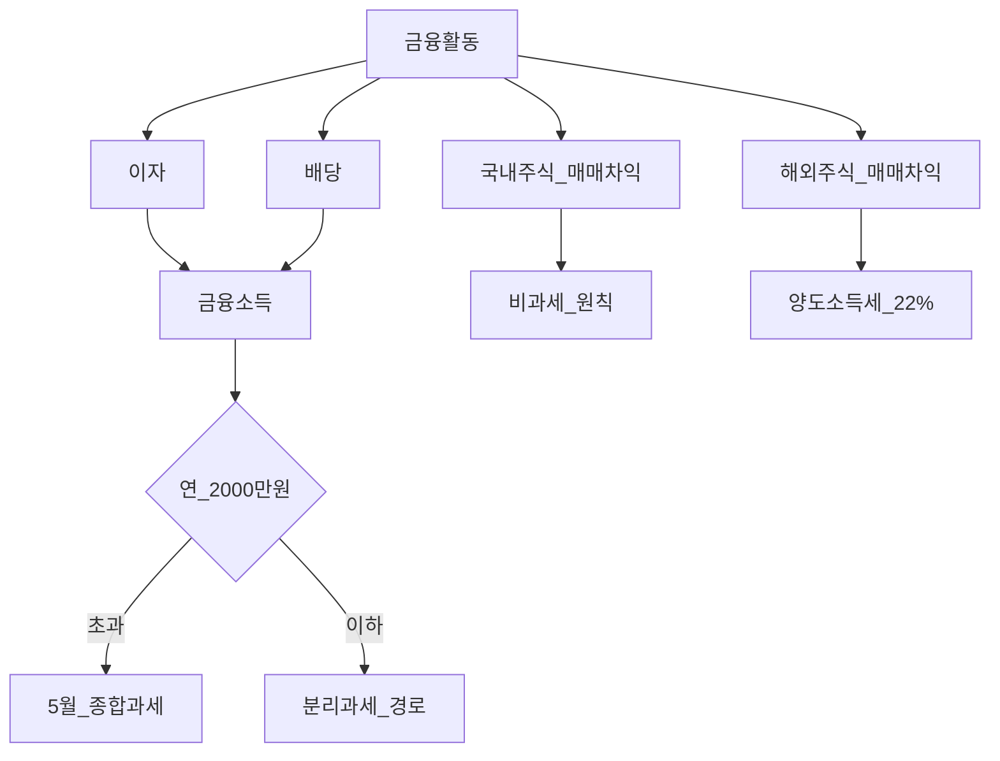
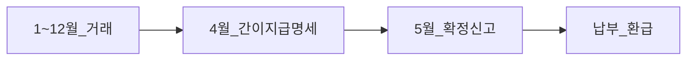

# 투자 관련 세금 개요 — 지도와 신고 캘린더

> **면책**: 본 문서는 교육 목적이며, 특정 개인·법인에 대한 투자·세무·법률 자문이 아닙니다. 신고·납부는 [국세청](https://www.nts.go.kr) 및 전문가 확인.

## 메타

| 항목 | 내용 |
|------|------|
| 최종 검증일 | 2026-05-24 |
| 정책·법령 기준일 | 소득세법 2025~2026 |
| 난이도 | L3 (Deep) — [READER-GUIDE](../../docs/READER-GUIDE.md) |
| 예상 읽기 시간 | 40~50분 |
| 관련 bucket | 전 bucket — 세금은 **계좌 선택**의 제약 |

## 0. 이 편 읽기 전 (5분)

| 항목 | 내용 |
|------|------|
| **난이도** | L3 (Deep) — [READER-GUIDE §L등급](../../docs/READER-GUIDE.md) |
| **선수** | [compound-interest-and-time-value](../../01-foundations/compound-interest-and-time-value.md) |
| **이번 편에서 쓰는 기호** | L_ISA, ISA, IRP, DB, DC (해당 시) |
| **복습 한 줄** | — |

## TL;DR

1. **이자·배당** → **금융소득** — 연 **2,000만 원** 초과 시 **5월 종합과세** 검토.
2. **국내 상장주식 매매차익** → 일반 개인 **비과세**(원칙, 예외 별도).
3. **해외주식·해외 ETF 매매차익** → **양도소득세**, **250만 원** 공제 후 **22%**, **5월 신고**.
4. **ISA·IRP·DC** → **별도 세제** — [isa-irp-pension-tax](isa-irp-pension-tax.md).
5. **금융투자소득세** — **유예** 보도 지속(2026) — 일반 개인 설계와 **별개**로 추적.

---

## 1. 한 줄 정의 + 왜 중요한가
!!! info "CGT (Capital Gains Tax)"
    자산 매각 차익에 대한 세금.

**정의**: 투자 관련 세금은 **금융소득(이자·배당)**, **양도소득(매매차익)**, **연금·퇴직**, **정책계좌 세제**로 나뉘며, **계좌 유형**에 따라 **신고 시기·세율·이연**이 달라집니다.

!!! info "ISA (Individual Savings Account)"
    개인종합자산관리계좌.

**왜 중요한가**: QQQ를 **일반 계좌**에만 두면 **매년 5월** 양도세 신고가 누적됩니다. **ISA 3년·IRP 이연**은 포트폴리오와 **동등한** 설계 요소입니다.

---

## 2. 선수 지식 / 이후 읽을 것

**선수**:
- [compound-interest-and-time-value.md](../../01-foundations/compound-interest-and-time-value.md)

**이후**:
- [domestic-stocks-tax.md](domestic-stocks-tax.md)
- [overseas-stocks-tax-part1-cgt.md](overseas-stocks-tax-part1-cgt.md)
- [account-product-tax-map.md](account-product-tax-map.md)
- [README.md](README.md)

---

## 3. 직관·비유

투자 세금은 **여러 층의 창문**입니다. **국내주식 매매** 창문은 (일반 개인) **열어도 바람(세금)이 안 들어오고**, **해외주식 매매** 창문은 **5월에 정산**합니다. **ISA**는 “3년간 창문 잠금”, **IRP**는 “은퇴 때까지 창문 봉인(이연)”입니다.

---

## 4. 정식 개념·용어

| 용어 | English | 정의 |
|------|---------|------|
| 금융소득 | Financial income | 이자·배당 |
| 양도소득 | Capital gains | 매매차익 |
| 분리과세 | Separate taxation | 종합 합산 없이 **고정 세율** |
| 종합과세 | Global taxation | 다른 소득과 **합산** |
| 과세이연 | Tax deferral | 나중에 과세 |
| 금융투자소득세 | Financial investment income tax | 대주주 등 **별도 제도**(유예) |

### 4a. 핵심 용어 (본문 등장 순)

> 복습용. 정의는 §4 본표·[glossary](../../00-roadmap/glossary.md)·본문 `!!! info` 박스.

| 용어 | 한 줄 | 관련 이론 | glossary |
|------|-------|-----------|----------|
| 금융소득 | 이자·배당 | §4 | [glossary](../../00-roadmap/glossary.md#금융소득) |
| 양도소득 | 매매차익 | §4 | [glossary](../../00-roadmap/glossary.md#양도소득) |
| 분리과세 | 종합 합산 없이 **고정 세율** | §4 | [glossary](../../00-roadmap/glossary.md#분리과세) |
| 종합과세 | 다른 소득과 **합산** | §4 | [glossary](../../00-roadmap/glossary.md#종합과세) |
| 과세이연 | 나중에 과세 | §4 | [glossary](../../00-roadmap/glossary.md#과세이연) |
| 금융투자소득세 | 대주주 등 **별도 제도** | §4 | [glossary](../../00-roadmap/glossary.md#금융투자소득세) |

---

## 5. 메커니즘

### 5.1 소득 유형 맵

### 5.2 연간 캘린더

| 시기 | 내용 |
|------|------|
| **연중** | 원천징수·중간정산(근로) |
| **1~12월** | 해외주식 매도 → **익년 5월** 신고 |
| **5월** | 종합소득세·양도세·금융소득 정산 |
| **ISA** | 3년 **유지** — 중도해지 시 추징 |

---

## 6. 수식·모델

**해외 양도세**(단순):

| 기호 | 이름 | 이 식에서 의미 |
|       ------       | ------ | ------이(가) 이 식에서 맡는 역할(§4·본문 참고) |
|   \(T_\)   | T  | T 이(가) 이 식에서 맡는 역할(§4·본문 참고) |
|             \(CGT\)             | CGT | CGT이(가) 이 식에서 맡는 역할(§4·본문 참고) |
|             \(G\)             | G | G이(가) 이 식에서 맡는 역할(§4·본문 참고) |
\[
T_{\text{CGT}} \approx \max(0, G - 2{,}500{,}000) \times 0.22
\]

**읽는 법**: **T_**와 **CGT**의 관계를 위 식으로 쓴다. 경제·재무 해석은 변수표 「이 식에서 의미」와 [DEPTH-STANDARD](../docs/DEPTH-STANDARD.md) 기호 예제를 맞춘다.
**금융소득 종합과세** (개념):

| 기호 | 이름 | 이 식에서 의미 |
|       ------       | ------ | ------이(가) 이 식에서 맡는 역할(§4·본문 참고) |
| \(r\) | 할인율·수익률 | 기간당 이자·요구수익률 |
| \(n\) | 기간 | 연·월 등 복리·할인에 쓰는 횟수 |
| \(PV\) | 현재가치 | 오늘 시점으로 환산한 금액 |

\[
\text{금융소득 합계} > 20{,}000{,}000 \Rightarrow \text{5월 종합과세 검토}
\]

**읽는 법**: **r**와 **n**의 관계를 위 식으로 쓴다. 경제·재무 해석은 변수표 「이 식에서 의미」와 [DEPTH-STANDARD](../docs/DEPTH-STANDARD.md) 기호 예제를 맞춘다.---

## 7. 한국 적용

### 7.1 2025년

| 유형 | 일반 개인(원칙) |
|------|-----------------|
| 국내주식 매매차익 | **비과세** |
| 해외주식 매매차익 | **양도세** 250만 공제·22% |
| 이자·배당 | 금융소득 |
| ISA | 3년·비과세 한도 |
| IRP | 과세이연·납입 공제 |

### 7.2 2026년

| 항목 | 보도·개편 |
|------|-----------|
| ISA 한도 | 500만/1,000만·납입 4,000만 |
| 금융투자소득세 | **유예** 지속 |
| DC 추가납입 | +300만 공제 |

### 7.3 신고 의사결정 트리 (교육)

| 질문 | Yes → | No → |
|------|-------|------|
| 해외주식·ETF 매도 이익? | Part1 양도세 | 국내·ISA 경로 |
| 해외 배당·이자? | Part2 금융소득 | — |
| 연 금융소득 2,000만 초과? | 5월 종합 | 분리 종결 검토 |
| ISA 3년 미만 해지? | 추징·상실 | — |
| DB만 있고 QQQ? | IRP·ISA 개설 | — |

### 7.4 금융투자소득세 vs 일반 개인

| | 금융투자소득세(대주주 등) | 일반 개인 해외 양도세 |
|--|---------------------------|------------------------|
| 대상 | 고액·대주주 등 | **해외 매매차익** |
| 2026 | **유예** 보도 | **250만+22%** 유지 |
| QQQ 소액 장기 | 보통 **후자** 적용 | Part1 |

### 7.5 연간 세금 캘린더 (개인 투자자)

| 월 | 이벤트 | 문서 |
|----|--------|------|
| 1~12 | 해외주식·ETF **매도** 기록 | [part1](overseas-stocks-tax-part1-cgt.md) |
| 연중 | 배당·이자 **원천징수** 영수증 | [part2](overseas-stocks-tax-part2-dividend.md) |
| 4월 | 급여·간이지급명세(근로) | — |
| **5월** | **확정신고** — 양도세·금융소득 | 홈택스 |
| ISA | 개설일 + **36개월** 만기 검토 | [isa.md](../isa.md) |
| IRP | **900만** 납입 한도 | [isa-irp-pension-tax.md](isa-irp-pension-tax.md) |

### 7.6 “어떤 문서를 읽을까” 라우팅

| 보유 자산 | 1순위 | 2순위 |
|-----------|-------|-------|
| QQQ 일반 계좌 | part1 | part2(배당) |
| QQQ ISA | [isa-irp-pension-tax](isa-irp-pension-tax.md) | part3 |
| 국내주식 NXT | [domestic-stocks-tax](domestic-stocks-tax.md) | [korea-ats-nextrade](../../03-markets/korea-ats-nextrade.md) |
| DB만 | [db-pension](../db-pension.md) | account-product-tax-map |
| 전체 지도 | **본 문서** | account-product-tax-map |

**법·정책 근거**: 소득세법, 조세특례제한법, 국세청 해외주식 안내, 금융위 금투세 보도.

---

### 7.7 세금 유형×신고 매트릭스 (교육)

| 소득 유형 | 대표 자산 | 신고 시기 | 합산 대상 |
|-----------|-----------|-----------|-----------|
| 국내 매매차익 | KRX·NXT 주식 | 원칙 **없음**(일반) | — |
| 해외 양도차익 | QQQ | **익년 5월** | 연간 합산·250만 공제 |
| 배당·이자 | 국내외 | 5월(종합 시) | **금융소득 2,000만** |
| ISA | 계좌 내 | 3년·해지 시 | 손익통산 |
| IRP | 계좌 내 | **수령 시** | 연금소득세 |

**금융투자소득세**는 위 표와 **별도** 제도입니다. 대주주·고액이 아니면 우선 **해외 양도세·금융소득** 체계를 숙지하세요.

---

## 8. 숫자 예제 (가상)

> 가상 인물·금액.

> 모든 인물·금액은 가상입니다.

### 예제 1: 해외만 거래 (가상)

| 항목 | 가상 T |
|------|--------|
| QQQ 양도차익 | **M** |
| 공제 후 과세표준 | **M** |
| 세액(가상) | **M** |

### 예제 2: 배당+이자 (가상)

| 항목 | 금액 |
|------|------|
| 국내 이자 | **M** |
| 해외 배당 | **M** |
| 합계 | **M** → **M** 이하** (분리 종결 **가능**, 요건 확인) |

### 예제 3: 계좌 분리 (가상)

| 계좌 | 역할 |
|------|------|
| ISA | QQQ 3년 |
| IRP | 추가 납입 |
| 일반 | 단기·국내 |

### 예제 4: 5월 누락 (가상)

| | 가상 AN |
|--|---------|
| 2024 양도세 미신고 | **가산세** 가정 |
| 교훈 | 홈택스 **해외주식** 메뉴 연간 점검 |

### 예제 5: 금융소득 초과 (가상)

| 소득 | 금액 |
|------|------|
| 해외 배당 | **M** |
| 국내 이자 | **M** |
| 국내 배당 | **M** |
| **합계** | **M** → **종합** |

---
## 9. FAQ

**Q1.** 국내·해외 같이 쓰면? — **유형별** 과세.  
**Q2.** 5월 안 하면? — **가산세**·불이익.  
**Q3.** DB 재직 QQQ 세금? — **개인 ISA·IRP** — [account-product-tax-map](account-product-tax-map.md).  
**Q4.** NXT 국내주식? — [domestic-stocks-tax](domestic-stocks-tax.md).  
**Q5.** 양도손실·배당 상쇄? — **불가** — [part2](overseas-stocks-tax-part2-dividend.md).  
**Q6.** 금융투자소득세? — **유예** — 대주주 등 별도.  
**Q7.** 청년도약 이자? — **비과세**(요건).  
**Q8.** ISA 2년 해지? — 혜택 **상실**·추징.

---

## 10. 함정·리스크·한계

- **해외만** 보유하고 **5월** 누락  
- **국내 비과세**를 해외에 **적용** 착각  
- **금융소득 2,000만** 무시  
- **ISA 기간** 무시  
- 개정·유예 **미추적**

---

**Q. 실무에서는?**  
교과서 식·기호를 그대로 적용하기 전에 **수수료·세금·데이터 시점**을 분리한다. 숫자는 [DEPTH-STANDARD](../docs/DEPTH-STANDARD.md)처럼 기호만 먼저 맞추고, 법령·시장 수치는 §8 표·외부 출처로 갱신한다.

## L3 보충 — 장기 자산 형성 연결

본 절은 [DEPTH-STANDARD.md](../../../docs/DEPTH-STANDARD.md) L3 게이트를 충족하기 위한 **실행·교차 링크** 보충입니다.

### Bucket·현금흐름 연결

| Bucket | 대표 제도·자산 | 본 문서와의 관계 |
|--------|----------------|------------------|
| 0 | 비상금 MMDA | 세금·투자 **전** 우선 |
| 1 | [청년도약](../youth-leap-account.md)·[미래적금](../youth-future-savings.md) | 정책 적금 — 주식 **대체 아님** |
| 2a | DB·DC | [db-vs-dc-pension.md](../db-vs-dc-pension.md) |
| 2b | ISA·IRP | [isa.md](../isa.md)·[isa-irp-pension-tax.md](../tax/isa-irp-pension-tax.md) |
| 3 | QQQ·채권 코어 | [capm-and-risk-return.md](../08-advanced/capm-and-risk-return.md) |
| 4 | NXT·코스닥·QLD | [fomo-and-trading-hours.md](../05-behavioral/fomo-and-trading-hours.md) |

### 연간 점검 루틴 (교육)

| 분기 | 할 일 |
|------|--------|
| Q1 | [investment-tax-overview.md](../tax/investment-tax-overview.md) 캘린더 확인 |
| Q2 | [rebalancing-and-dca.md](../04-portfolio/rebalancing-and-dca.md) 코어 비중 |
| Q3 | 해외 배당·금융소득 **누적** — Part2 |
| Q4 | 익년 **5월** 양도세 자료 정리 — Part1 |
| ISA | 개설일 +36개월 **만기** 알림 |

### 2025 vs 2026 정책 추적

| 항목 | 확인 출처 |
|------|-----------|
| ISA 한도·비과세 | 금융위·조세특례 시행일 |
| DC +300만 공제 | 국세청·통합연금포털 |
| 청년도약 일몰·미래적금 | [kinfa](https://ylaccount.kinfa.or.kr) |
| 금융투자소득세 | 금융위 보도·[sources.md](../../../references/sources.md) |
| NXT 종목·거래중단 | [nextrade.co.kr](https://www.nextrade.co.kr) |

**면책 재확인**: 가상 예제·보도 수치는 **시점별 개정**됩니다. 실행·신고 전 공식 출처를 확인하세요.

## 11. 심화 읽기

- [references/sources.md](../../references/sources.md)  
- [tax/README.md](README.md)  
- 국세청 **해외주식과 세금**

---

## 12. 스스로 점검 퀴즈

1. 해외 ETF 매매차익 세목은?  
2. 연간 금융소득 종합과세 검토 기준(원칙)?  
3. 국내 개인 매매차익(원칙)?  
4. ISA 핵심 유지 기간?  
5. 해외 양도세 신고 월은?

??? note "정답 힌트"

    1. 양도소득세 · 2. 2,000만 원 초과 · 3. 비과세 · 4. 3년 · 5. 5월(익년)