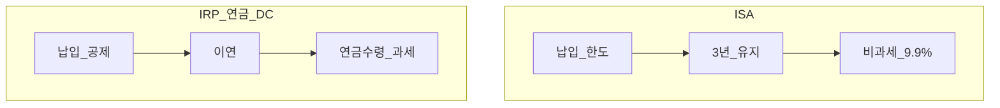
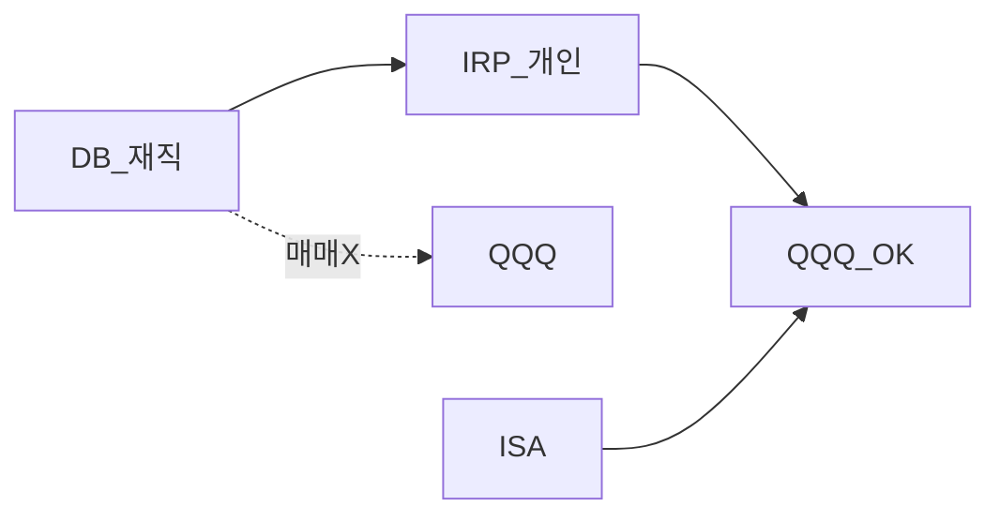
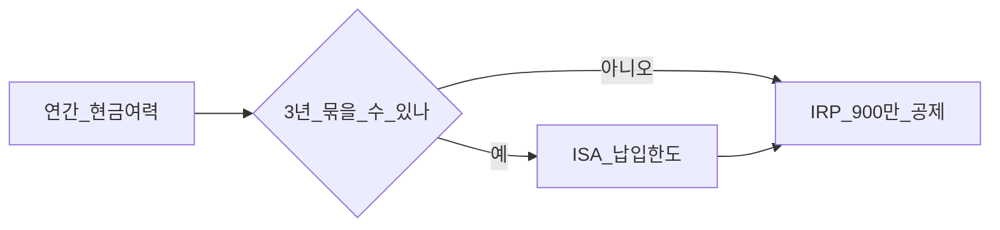

# ISA·IRP·연금저축·DC 세제 통합 가이드

> **면책**: 본 문서는 교육 목적이며, 특정 개인·법인에 대한 투자·세무·법률 자문이 아닙니다.

## 메타

| 항목 | 내용 |
|------|------|
| 최종 검증일 | 2026-05-24 |
| 정책·법령 기준일 | 2025 확정, 2026 개편 별도 |
| 난이도 | L3 (Deep) — [READER-GUIDE](../../docs/READER-GUIDE.md) |
| 예상 읽기 시간 | 45~55분 |

## 0. 이 편 읽기 전 (5분)

| 항목 | 내용 |
|------|------|
| **난이도** | L3 (Deep) — [READER-GUIDE §L등급](../../docs/READER-GUIDE.md) |
| **선수** | 없음 |
| **이번 편에서 쓰는 기호** | L_ISA, ISA, IRP, DB, DC (해당 시) |
| **복습 한 줄** | — |

## TL;DR

| 제도 | 핵심 |
|------|------|
| **ISA** | 3년 유지, 비과세 한도·9.9% 초과 |
| **IRP·연금저축** | 납입 **세액공제** 연 **900만** 합산 |
| **DC 추가** | 2026 **+300만** (DC만, **DB 없음**) |
| **수령** | 연금소득세 **저율** 구간 |
| **DB 재직** | **IRP**로 QQQ·추가납입 |

---

## 1. 한 줄 정의 + 왜 중요한가
!!! info "DB (Defined Benefit)"
    확정급여형 퇴직연금.

!!! info "DC (Defined Contribution)"
    확정기여형 퇴직연금.

!!! info "IRP (Individual Retirement Pension)"
    개인형 퇴직연금.

**정의**: ISA는 **매매 단계 세제**, IRP·연금·DC는 **납입 공제·과세이연·수령 과세**가 핵심인 **연금·종합계좌** 세제입니다.

**왜 중요한가**: 같은 QQQ도 **ISA 3년** vs **IRP 이연** vs **일반 22%** — 10년 **실질 수익** 차이가 큽니다.

---

## 2. 선수 / 이후

**선수**: [investment-tax-overview.md](investment-tax-overview.md)  
**이후**: [account-product-tax-map.md](account-product-tax-map.md), [../isa.md](../isa.md), [../irp.md](../irp.md)

---

## 3. 직관·비유

| 계좌 | 비유 |
|------|------|
| ISA | 3년 **면세 한도** 상자 |
| IRP | **지금 세금 미루기** + 납입 할인 |
| DC | 회사 돈 + **내 ETF** + 2026 **+300만** 쿠폰 |
| DB | 회사 금고 — **개인 세제 아님** |

---

## 4. 정식 용어

| 용어 | 정의 |
|------|------|
| 비과세 한도 | ISA 3년 누적 면세 상한 |
| 세액공제 | 납입액×공제율 **세금 감면** |
| 과세이연 | 운용 중 **과세 유예** |
| 연금소득세 | 수령 시 **분리·저율** |
| 합산 한도 | IRP+연금저축 **900만/년** |

### 4a. 핵심 용어 (본문 등장 순)

> 복습용. 정의는 §4 본표·[glossary](../../00-roadmap/glossary.md)·본문 `!!! info` 박스.

| 용어 | 한 줄 | 관련 이론 | glossary |
|------|-------|-----------|----------|
| 비과세 한도 | ISA 3년 누적 면세 상한 | §4 | [glossary](../../00-roadmap/glossary.md#비과세-한도) |
| 세액공제 | 납입액×공제율 **세금 감면** | §4 | [glossary](../../00-roadmap/glossary.md#세액공제) |
| 과세이연 | 운용 중 **과세 유예** | §4 | [glossary](../../00-roadmap/glossary.md#과세이연) |
| 연금소득세 | 수령 시 **분리·저율** | §4 | [glossary](../../00-roadmap/glossary.md#연금소득세) |
| 합산 한도 | IRP+연금저축 **900만/년** | §4 | [glossary](../../00-roadmap/glossary.md#합산-한도) |

---

## 5. 메커니즘

---

## 6. 수식·모델

**IRP 절세**(가상):

| 기호 | 이름 | 이 식에서 의미 |
|------|------|----------------|
|             \(S\)             | S | 소득 대비 남는 비율 |
|   \(P\)   | 포트 규모 | 가상 포트폴리오 규모(만 원) |
|   \(r\)   | 할인율·수익률 | 기간당 이자·요구수익률 |
\[
S = \min(P, 9{,}000{,}000) \times r
\]

**읽는 법**: **S**와 **P**의 관계를 위 식으로 쓴다. 경제·재무 해석은 변수표 「이 식에서 의미」와 [DEPTH-STANDARD](../docs/DEPTH-STANDARD.md) 기호 예제를 맞춘다.
**ISA 절세**(3년 누적 이익 \(G\), 한도 \(H\)):

| 기호 | 이름 | 이 식에서 의미 |
|------|------|----------------|
| \(\ISA\) | ISA | 개인종합자산관리계좌 슬롯 |
| \(\S_\text{ISA}\) | S  ISA | 본문 §4·위 식 맥락 참고 |

\[
S_{\text{ISA}} \approx G \times 0.22 - \min(G,H) \times 0.22 - \max(0,G-H) \times 0.121
\]

**읽는 법**: **S_**와 **G**의 관계를 위 식으로 쓴다. 경제·재무 해석은 변수표 「이 식에서 의미」와 [DEPTH-STANDARD](../docs/DEPTH-STANDARD.md) 기호 예제를 맞춘다.(단순 비교, 22% vs 9.9%)

---

S_**와 **G**의 관계를 위 식으로 쓴다. 경제·재무 해석은 변수표 「이 식에서 의미」와 [DEPTH-STANDARD](../docs/DEPTH-STANDARD.md) 기호 예제를 맞춘다.(단순 비교, 22% vs 9.9%)

---

# 7. 한국 적용

### 7.1 2025

| | ISA | IRP+연금 | DC |
|--|-----|----------|-----|
| 납입 | 연 2,000만·총 1억 | 공제 900만 합산 | 회사+추가 |
| 운용 | 즉시 세제(3년 후) | **이연** | **이연** |
| 비과세 | 200만/400만 | — | — |

### 7.2 2026 (보도)

| | 2025 | 2026 |
|--|------|------|
| ISA 비과세 | 200만 | **500만** |
| ISA 연납입 | 2,000만 | **4,000만** |
| DC 추가 공제 | — | **+300만** |

**DB 가입자**: DC 300만 **해당 없음** — [../irp.md](../irp.md).

### 7.3 ISA vs IRP 선택 (교육)

| 기준 | ISA 우선 | IRP 우선 |
|------|----------|----------|
| 기간 | **3년+** 확실 | 불확실 |
| 목적 | 매매차익 세제 | **퇴직금·납입 공제** |
| QQQ | 코어 **3년** | **추가·이전** |
| 해지 | 추징 | 연금 요건 |

### 7.4 수령·연금소득세 (개요)

| 수령 | 과세 |
|------|------|
| ISA 만기 | 9.9% 초과·일시금 옵션 |
| IRP 연금 | **연금소득세** 저율 구간 |
| IRP 일시금 | **기타소득** 등 — 신중 |

### 7.5 수령 시나리오 비교 (교육)

| 수령 방식 | ISA | IRP | DC |
|-----------|-----|-----|-----|
| 연금 수령 | 옵션·규정 확인 | **연금소득세** 저율 구간 | 퇴직 후 IRP 등 |
| 일시금 | 세제 상실·추징 위험 | **기타소득** 등 — 신중 | 퇴직소득세 |
| 중도 인출 | **3년 미만** 추징 | 연금 요건·예외 | 제한적 |

### 7.6 DB·DC·ISA·IRP — 납입·공제 한도 한눈에 (2025~2026)

| 제도 | 납입/공제 | 2026 보도 |
|------|-----------|-----------|
| ISA | 연 2,000만→**4,000만**, 총 1억→**2억** | 비과세 200만→**500만** |
| IRP+연금저축 | **900만/년** 세액공제 합산 | 유지 |
| DC 추가납입 | 기존 + **+300만** 공제 | **DC만**, DB 없음 |
| DB | 회사 부담 — **개인 공제 없음** | — |

**법·정책 근거**: 조세특례제한법, 소득세법 §20·연금계좌.

---

### 7.7 퇴직·이직 타임라인 (교육)

| 시점 | DB | DC |
|------|-----|-----|
| 재직 | IRP·ISA **개인** 설계 | DC **70%** + ISA |
| 퇴사 직전 | IRP 이전 **옵션** 비교 | 잔고 이전·일시금 |
| 퇴사 후 | 본인 **운용** | IRP 통합 검토 |
| 55세+ | 연금 수령 설계 | 연금소득세 |

퇴직금을 **ISA**에 넣을 수 없습니다. **IRP 이전** 후 QQQ·채권 배분 — [overseas-stocks-tax-part3-scenarios.md](overseas-stocks-tax-part3-scenarios.md).

---

## 8. 숫자 예제 (가상)

> 가상 금액.

> 가상 인물·금액.

### 예제 1: ISA vs IRP (가상)

| | 가상 W | 3년 QQQ 차익 **M** |
|--|--------|---------------------|
|------|------|----------------|
### 예제 2: 공제 (가상)

| | 가상 X |
|--|--------|
| IRP 700만 + 연금 200만 | 합 900만 → 공제 한도 **맞춤** |

### 예제 3: DC +300만 (가상, 2026)

| | 가상 Y (DC) |
|--|-------------|
| 추가 **M** | 절세 약 **M** (가정) |

### 예제 4: DB 가입자 (가상)

| 슬롯 | 가상 AS |
|------|---------|
| ISA | 연 2,400만 납입(2025 한도) |
| IRP | 900만 공제 한도 **채움** |
| DC **M** | **0** (DB) |

### 예제 5: 3년 ISA 해지 실수 (가상)

| | 가상 AT |
|--|---------|
| 2년차 해지 | 비과세 **상실**·추징(가상 **M**) |

---
## 9. FAQ

**Q1.** ISA+IRP 납입 합산? — **아니오** — ISA **납입한도**, IRP **공제한도** 별도.  
**Q2.** DB IRP? — **가능**·권장.  
**Q3.** ISA 2년? — **추징**.  
**Q4.** DC 배당? — [part2](overseas-stocks-tax-part2-dividend.md).  
**Q5.** 퇴직금? — **IRP 이전**.  
**Q6.** 2026 ISA 기존 계좌? — **시행 확인**.  
**Q7.** 청년도약? — **별도** 비과세.  
**Q8.** QLD IRP? — **비권장**.

---

### 실행 워크숍 체크리스트 (교육)

| # | 질문 | Yes 시 다음 문서 |
|---|------|------------------|
| 1 | 해외 ETF·주식을 보유 중인가? | [overseas-stocks-tax-part1-cgt.md](overseas-stocks-tax-part1-cgt.md) |
| 2 | 해외 배당이 연 500만 이상인가? | [part2-dividend](overseas-stocks-tax-part2-dividend.md) |
| 3 | DB 재직인가? | [db-pension.md](../db-pension.md) + IRP·ISA |
| 4 | 국내주식을 NXT에서 거래하는가? | [korea-ats-nextrade.md](../../03-markets/korea-ats-nextrade.md) |
| 5 | 10년 코어가 QQQ인가? | [isa.md](../isa.md) 또는 [isa-irp-pension-tax.md](isa-irp-pension-tax.md) |

위 표는 **의사결정 보조**이며, 개인 소득·가구·회사 제도에 따라 답이 달라집니다. 불확실하면 [investment-tax-overview.md](investment-tax-overview.md) → [account-product-tax-map.md](account-product-tax-map.md) 순으로 읽으세요.

**Q11. ISA와 IRP에 같은 QQQ를 중복 보유해도 되나요?**  
**A11.** **가능**하나 세제·유동성 목적이 다릅니다. ISA는 **3년·비과세 한도**, IRP는 **이연·공제** — [overseas-stocks-tax-part3-scenarios.md](overseas-stocks-tax-part3-scenarios.md) 시나리오 B·C 참고.

## 10. 함정·리스크·한계

- **900만** 초과 납입  
- **DB=DC** 공제 착각  
- **ISA 기간**  
- **수령 시점** 미설계  
- 개편 **미확인**

---

**Q. 실무에서는?**  
교과서 식·기호를 그대로 적용하기 전에 **수수료·세금·데이터 시점**을 분리한다. 숫자는 [DEPTH-STANDARD](../docs/DEPTH-STANDARD.md)처럼 기호만 먼저 맞추고, 법령·시장 수치는 §8 표·외부 출처로 갱신한다.

## L3 보충 — 장기 자산 형성 연결

본 절은 [DEPTH-STANDARD.md](../../../docs/DEPTH-STANDARD.md) L3 게이트를 충족하기 위한 **실행·교차 링크** 보충입니다.

### Bucket·현금흐름 연결

| Bucket | 대표 제도·자산 | 본 문서와의 관계 |
|--------|----------------|------------------|
| 0 | 비상금 MMDA | 세금·투자 **전** 우선 |
| 1 | [청년도약](../youth-leap-account.md)·[미래적금](../youth-future-savings.md) | 정책 적금 — 주식 **대체 아님** |
| 2a | DB·DC | [db-vs-dc-pension.md](../db-vs-dc-pension.md) |
| 2b | ISA·IRP | [isa.md](../isa.md)·[isa-irp-pension-tax.md](../tax/isa-irp-pension-tax.md) |
| 3 | QQQ·채권 코어 | [capm-and-risk-return.md](../08-advanced/capm-and-risk-return.md) |
| 4 | NXT·코스닥·QLD | [fomo-and-trading-hours.md](../05-behavioral/fomo-and-trading-hours.md) |

### 연간 점검 루틴 (교육)

| 분기 | 할 일 |
|------|--------|
| Q1 | [investment-tax-overview.md](../tax/investment-tax-overview.md) 캘린더 확인 |
| Q2 | [rebalancing-and-dca.md](../04-portfolio/rebalancing-and-dca.md) 코어 비중 |
| Q3 | 해외 배당·금융소득 **누적** — Part2 |
| Q4 | 익년 **5월** 양도세 자료 정리 — Part1 |
| ISA | 개설일 +36개월 **만기** 알림 |

### 2025 vs 2026 정책 추적

| 항목 | 확인 출처 |
|------|-----------|
| ISA 한도·비과세 | 금융위·조세특례 시행일 |
| DC +300만 공제 | 국세청·통합연금포털 |
| 청년도약 일몰·미래적금 | [kinfa](https://ylaccount.kinfa.or.kr) |
| 금융투자소득세 | 금융위 보도·[sources.md](../../../references/sources.md) |
| NXT 종목·거래중단 | [nextrade.co.kr](https://www.nextrade.co.kr) |

**면책 재확인**: 가상 예제·보도 수치는 **시점별 개정**됩니다. 실행·신고 전 공식 출처를 확인하세요.

## 11. 심화 읽기

- [../isa.md](../isa.md), [../irp.md](../irp.md), [../dc-pension.md](../dc-pension.md)

---

## 12. 퀴즈

1. IRP+연금 연간 공제 한도?  
2. DB에 +300만?  
3. ISA 유지 기간?  
4. DB QQQ?  
5. 2026 ISA 비과세(보도)?

힌트
1. 900만 2. 아니오 3. 3년 4. IRP/ISA 5. 500만
