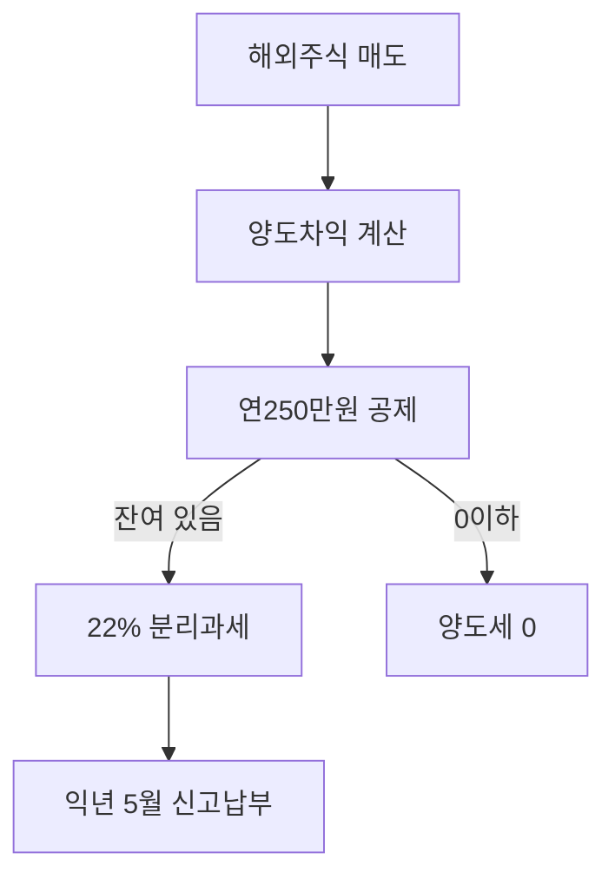

# 해외주식 양도소득세 Part 1 — 매매차익·신고

> **면책**: 교육 목적. 세무 신고는 국세청·전문가 확인.

## 메타

| 항목 | 내용 |
|------|------|
| 최종 검증일 | 2026-05-24 |
| 법령 기준일 | 소득세법 2025~2026 (§118의3~6, §103, §104) |
| 난이도 | L3 (Deep) — [READER-GUIDE](../../docs/READER-GUIDE.md) |
| 예상 읽기 시간 | 40~50분 |
| 시리즈 | Part1 CGT · [Part2](overseas-stocks-tax-part2-dividend.md) 배당 · [Part3](overseas-stocks-tax-part3-scenarios.md) 시나리오 |

## 0. 이 편 읽기 전 (5분)

| 항목 | 내용 |
|------|------|
| **난이도** | L3 (Deep) — [READER-GUIDE §L등급](../../docs/READER-GUIDE.md) |
| **선수** | 없음 |
| **이번 편에서 쓰는 기호** | L_ISA, ISA, IRP, DB, DC (해당 시) |
| **복습 한 줄** | — |

> **세금 시리즈 읽기 순서**: [해외주식 part1](tax/overseas-stocks-tax-part1-cgt.md) → part2(배당) → part3(시나리오)는 **동일 가상 거래**(교육용 기호 P·M)로 표를 맞춰 읽는다.
## TL;DR

1. **해외주식·해외 상장 ETF** 매매차익은 **양도소듵세** (국내 상장주식 개인 비과세와 **다름**).
2. **연 250만 원** 기본공제 후, 일반적으로 **22%**(국세 20%+지방 2%) **분리과세**.
3. **익년 5월** 확정신고·납부 (반기 예정신고 없음).
4. **환율**: 취득·양도 시점 **실지거래가액**, 선입선출 등 방법 일관 적용.
5. **ISA·IRP** 안에서는 다른 규칙 — [Part3](overseas-stocks-tax-part3-scenarios.md), [account-product-tax-map](account-product-tax-map.md).

## 1. 한 줄 정의 + 왜 중요한가
!!! info "CGT (Capital Gains Tax)"
    자산 매각 차익에 대한 세금.

!!! info "ETF"
    지수·자산 **바구니**를 한 종목처럼 거래

**정의**: 국내 거주자가 **해외에 상장된 주식·ETF 등**을 매도하여 발생한 **양도차익**에 대해 부과되는 **양도소득세**입니다.

!!! info "ISA (Individual Savings Account)"
    개인종합자산관리계좌.

**왜 중요한가**: QQQ·미국 개별주를 **일반 계좌**에서만 거래하면 매년 신고 부담·실효 세율이 설계에 들어갑니다. **250만 원 공제**와 **계좌 유형(ISA/IRP)** 선택이 장기 수익에 직결됩니다.

## 2. 선수 / 이후

**선수**: [investment-tax-overview.md](investment-tax-overview.md), [domestic-stocks-tax.md](domestic-stocks-tax.md)  
**이후**: [part2-dividend](overseas-stocks-tax-part2-dividend.md), [part3-scenarios](overseas-stocks-tax-part3-scenarios.md)

## 3. 직관·비유

국내 주식은 (일반 개인) **팔아도 양도세 신고가 없는** 경우가 많지만, **해외주식은 "해외에서 번 돈"으로 보아 별도 신고**가 필요합니다. 마치 두 나라의 규칙이 겹치는데, 한국은 “**한국에 사는 당신의 해외 투자 이익**”을 5월에 정리하라고 하는 것입니다.

**배당**은 Part 2 — 양도세와 **통산되지 않습니다**.

**쉽게 말하면:** 해외주식(QQQ·미국 개별주·해외 ETF)을 팔아서 이익이 생기면, 이익에서 연 250만 원 기본공제를 빼고 나머지에 **22%** 세금이 붙습니다. 국내주식 비과세와 헷갈리면 안 됩니다.

**단계별 계산법:**
1. **양도차익 계산**: 매도금액 − 취득금액 − 필요경비 (원화 환산)
2. **기본공제 적용**: 양도차익 − 250만 원 (연간 1회, 국내+국외 합산)
3. **세율 적용**: 과세표준 × 22% (국세 20% + 지방세 2%)
4. **신고·납부**: 익년 5월 1~31일 홈택스 신고

**주의:** 기본공제 250만 원은 연간 모든 해외주식 양도차익을 합산한 후 1회만 적용합니다. 여러 종목을 팔았다면 합산 후 계산합니다. 또한 손실이 난 종목과 이익이 난 종목은 통산할 수 있습니다.

**예를 들어:** QQQ에서 600만 원 이익, 다른 미국 주식에서 100만 원 손실이 났다면, 순이익 500만 원 − 기본공제 250만 원 = 250만 원 × 22% = 55만 원 세금입니다. ISA에서 같은 수익이 났다면 ISA 비과세 한도 200만 원 이내는 0원, 초과분에 9.9%만 냅니다.

## 4. 정식 용어

| 용어 | 정의 |
|------|------|
| 양도가액 | 매도 대가 (원화 환산) |
| 취득가액 | 매수 대가 + 필요경비 |
| 양도차익 | 양도가액 − 취득가액 − 필요경비 |
| 기본공제 | 연 **250만 원** (국내·국외 주식 통산) |
| 분리과세 | 종합소득 합산 없이 **고정 세율** |

### 4a. 핵심 용어 (본문 등장 순)

> 복습용. 정의는 §4 본표·[glossary](../../00-roadmap/glossary.md)·본문 `!!! info` 박스.

| 용어 | 한 줄 | 관련 이론 | glossary |
|------|------|------|----------------|
| 양도가액 | 매도 대가 | §4 | [glossary](../../00-roadmap/glossary.md#양도가액) |
| 취득가액 | 매수 대가 + 필요경비 | §4 | [glossary](../../00-roadmap/glossary.md#취득가액) |
| 양도차익 | 양도가액 − 취득가액 − 필요경비 | §4 | [glossary](../../00-roadmap/glossary.md#양도차익) |
| 기본공제 | 연 **250만 원** | §4 | [glossary](../../00-roadmap/glossary.md#기본공제) |
| 분리과세 | 종합소득 합산 없이 **고정 세율** | §4 | [glossary](../../00-roadmap/glossary.md#분리과세) |

## 5. 메커니즘

### 계산 단계 (교육용)

| 단계 | 내용 | 근거 |
|------|------|----------------|
| ① | 양도가액 (입금일 환율) | 소득세법 §118의3 |
| ② | − 취득가액 (출금일 환율) | §118의4 |
| ③ | − 필요경비 (수수료 등) | §94 |
| ④ | − **기본공제 250만 원** | §103 |
| ⑤ | × **20%** (+ 지방 2%) | §104 |

## 6. 수식·모델

| 기호 | 이름 | 이 식에서 의미 |
|------|------|----------------|
| **r** | 할인율·수익률 | 기간당 이자·요구수익률 |
| **n** | 기간 | 연·월 등 복리·할인에 쓰는 횟수 |
| **PV** | 현재가치 | 오늘 시점으로 환산한 금액 |
| **FV** | 미래가치 | 미래 시점의 목표·결과 금액 |

\[
\text{양도차익} = \text{양도가액} - \text{취득가액} - \text{필요경비}
\]

**식 (기호)**: 양도차익 = 양도가액 - 취득가액 - 필요경비

**식 (기호)**: 양도차익 = 양도가액 - 취득가액 - 필요경비

**식 (기호)**: 양도차익 = 양도가액 - 취득가액 - 필요경비

**읽는 법**: **양도차익**와 **양도가액**의 관계를 위 식으로 쓴다. 경제·재무 해석은 변수표 「이 식에서 의미」와 [DEPTH-STANDARD](../docs/DEPTH-STANDARD.md) 기호 예제를 맞춘다.
| 기호 | 이름 | 이 식에서 의미 |
|------|------|----------------|
| **r** | 할인율·수익률 | 기간당 이자·요구수익률 |
| **n** | 기간 | 연·월 등 복리·할인에 쓰는 횟수 |
| **PV** | 현재가치 | 오늘 시점으로 환산한 금액 |

\[
\text{과세표준} = \max(0,\ \text{연간 양도차익 합계} - 2{,}500{,}000)
\]

**식 (기호)**: 과세표준 = (0, 연간 양도차익 합계 - 2{,}500{,}000)

**식 (기호)**: 과세표준 = (0, 연간 양도차익 합계 - 2{,}500{,}000)

**식 (기호)**: 과세표준 = (0, 연간 양도차익 합계 - 2{,}500{,}000)

**읽는 법**: **r**와 **n**의 관계를 위 식으로 쓴다. 경제·재무 해석은 변수표 「이 식에서 의미」와 [DEPTH-STANDARD](../docs/DEPTH-STANDARD.md) 기호 예제를 맞춘다.
| 기호 | 이름 | 이 식에서 의미 |
|------|------|----------------|
| **r** | 할인율·수익률 | 기간당 이자·요구수익률 |
| **n** | 기간 | 연·월 등 복리·할인에 쓰는 횟수 |
| **PV** | 현재가치 | 오늘 시점으로 환산한 금액 |

\[
\text{납부세액} \approx \text{과세표준} \times 0.22 \quad (\text{분리과세, 지방세 포함 시 22%})
\]

**식 (기호)**: 납부세액 ≈ 과세표준 ×0.22 (분리과세, 지방세 포함 시 22%)

**식 (기호)**: 납부세액 ≈ 과세표준 ×0.22 (분리과세, 지방세 포함 시 22%)

**식 (기호)**: 납부세액 ≈ 과세표준 ×0.22 (분리과세, 지방세 포함 시 22%)

**읽는 법**: **r**와 **n**의 관계를 위 식으로 쓴다. 경제·재무 해석은 변수표 「이 식에서 의미」와 [DEPTH-STANDARD](../docs/DEPTH-STANDARD.md) 기호 예제를 맞춘다.
**금융투자소득세**: 별도 제도는 **유예** 보도가 많았으나, 학습 시점에는 **기존 양도소득세 체계**를 기준으로 이해하고, 개정 시 [sources.md](../../../references/sources.md) 갱신.

---

유예** 보도가 많았으나, 학습 시점에는 **기존 양도소득세 체계**를 기준으로 이해하고, 개정 시 [sources.md](../../../references/sources.md) 갱신.

## 7. 한국 적용

### 7.1 과세 대상

- 해외 **상장 주식**
- 해외 **상장 ETF** (QQQ 등 직접 보유)
- **ADR** 등 (안내 기준 확인)

**해외 펀드**는 구조에 따라 **배당소득** 과세될 수 있음 — 펀드와 직접주식 **구분**.

### 7.2 신고

| 항목 | 내용 |
|------|------|
| 시기 | **다음 해 5월** (확정신고) |
| 반기 예정신고 | 해외주식은 **없음** (국내 주식과 대비) |
| 방법 | 홈택스 · 세무서 |

### 7.3 2025 vs 2026

| 항목 | 2025 | 2026 (확인) |
|------|------|----------------|
| 기본공제 | 250만 원 | **유지** |
| 세율 | 22% 분리 | **유지** |
| 금융투자소득세 | 유예 보도 | **유예** 추적 |
| ISA 비과세 | 200만 | **500만** 보도 — 매매차익 **계좌 이전** 검토 |

### 7.4 환율·취득단가 (실무)

| 항목 | 교육 요지 |
|------|-----------|
| 환율 | **실지거래가액** — 입금·출금일 등 **일관** 적용 |
| 취득단가 | 매수 건별 vs **이동평균** — 증권사·신고 도구 |
| 필요경비 | 수수료·송금비 등 **증빙** |
| 증권사 리포트 | 연말 **해외주식 양도소득** 안내 활용 |

### 7.5 5월 신고 체크리스트

| # | 항목 |
|---|------|
| 1 | 전년 **매도** 건별 양도차익 합산 |
| 2 | **250만 원** 공제 적용 |
| 3 | **22%** 세액 계산 |
| 4 | Part2 **배당** 별도 — 상쇄 **불가** |
| 5 | ISA·IRP 보유분은 **계좌 규칙** 우선 — [part3](overseas-stocks-tax-part3-scenarios.md) |

**법·정책 근거**: 소득세법 §118의3~6, §103, §104, 국세청 「해외주식과 세금」.

### 7.6 양도손실·이월 (개요)

해외주식 **양도손실**은 같은 과세 유형 내 **연간 합산**에 반영됩니다(교육). 다만 **배당소득**과는 **상쇄되지 않습니다** — Part2. 손실이 큰 해에는 5월 신고에서 **공제 후 과세표준 0**이 될 수 있으나, **이월** 규칙은 소득세법·안내를 **별도** 확인하세요.

**펀드 vs ETF**: 해외 **상장 ETF**(QQQ)는 본 Part1. 해외 **펀드**는 배당·과세 구조가 다를 수 있어 편입 전 설명서·국세청 분류를 확인하세요.

## 8. 숫자 예제 (가상)

### 예제 1: 단일 매도

| 항목 | 원화 (가상) |
|------|-------------|
| 양도가액 | 5,000,000 |
| 취득가액 | 3,000,000 |
| 수수료 | 50,000 |
| 양도차익 | 1,950,000 |
| 기본공제 후 과세표준 | 0 (연간 다른 거래 없음, **M** 이하) |
| **납부세액** | **0** |

### 예제 2: 연간 합산 초과

| 항목 | 원화 (가상) |
|------|-------------|
| 연간 양도차익 합계 | 8,000,000 |
| 기본공제 | 2,500,000 |
| 과세표준 | 5,500,000 |
| 세액 (22%) | **1,210,000** |

### 예제 3: 손익 통산 (가상)

| 거래 | 차익 |
|------|------|
| 종목 A | +**M** |
| 종목 B | −**M** |
| **합계** | +**M** → 공제 후 과세표준 **M** → 세액 **M** (가상)

## 9. FAQ

**Q1. QQQ 팔면 세금?**  
**A.** 일반 계좌 해외 ETF 매도차익은 **양도소득세** 대상. 연 250만 원 공제 적용.

**Q2. 국내 주식과 같나요?**  
**A.** **다릅니다.** 국내 상장주식은 개인 매매차익 **비과세**가 원칙.

**Q3. ISA 안에서 QQQ는?**  
**A.** ISA는 **다른 체계**(손익통산·비과세 한도). [account-product-tax-map](account-product-tax-map.md).

**Q4. 미국에서 원천징수하면 한국 신고 안 해도 되나요?**  
**A.** **양도차익**은 대부분 **한국에서 신고** (조세조약·현지 규정 확인). 배당은 Part 2.

**Q5. 환율은 언제?**  
**A.** **실지거래가액** 기준, 입금·출금일 등 **일관된 방법** (국세청 안내).

**Q6. 해외주식 손실과 이익을 서로 상쇄할 수 있나요?**  
**A6.** **같은 해 안에서는 통산 가능**합니다. 예를 들어 QQQ 이익 600만 원, 다른 미국 주식 손실 200만 원이면 순이익 400만 원 − 기본공제 250만 원 = 150만 원 × 22% = 33만 원 세금입니다. 단, 배당과 양도차익은 통산되지 않습니다.

**Q7. ISA 안의 해외 ETF도 5월 신고가 필요한가요?**  
**A7.** **아닙니다.** ISA 안의 수익은 ISA 세제(비과세 한도·9.9%)로 처리되며, 일반 양도소득세 5월 신고는 필요하지 않습니다. 이것이 ISA의 핵심 장점 중 하나입니다.

**Q8. 기본공제 250만 원은 매년 별도로 적용되나요?**  
**A8.** **네.** 연간 250만 원 기본공제는 매년 새로 적용됩니다. 따라서 연간 순이익이 250만 원 이하이면 해외주식 양도세는 0원입니다. 그러나 ISA에서 3년 누적으로 더 큰 이익이 생기면 ISA 비과세 한도(200만 원) + 9.9%와 일반 계좌 매년 250만 원 공제를 비교해 어느 쪽이 유리한지 판단해야 합니다.

## 10. 함정·리스크

- **신고 누락** → 가산세  
- **배당과 혼동** (Part 2)  
- **펀드 vs ETF** 과세 구분 오류  
- **ISA·일반 계좌 혼용** 시 한도·통산 착각

---

**Q. 실무에서는?**  
교과서 식·기호를 그대로 적용하기 전에 **수수료·세금·데이터 시점**을 분리한다. 숫자는 [DEPTH-STANDARD](../docs/DEPTH-STANDARD.md)처럼 기호만 먼저 맞추고, 법령·시장 수치는 §8 표·외부 출처로 갱신한다.

## L3 보충 — 장기 자산 형성 연결

본 절은 [DEPTH-STANDARD.md](../../../docs/DEPTH-STANDARD.md) L3 게이트를 충족하기 위한 **실행·교차 링크** 보충입니다.

### Bucket·현금흐름 연결

| Bucket | 대표 제도·자산 | 본 문서와의 관계 |
|------|------|----------------|
| 0 | 비상금 MMDA | 세금·투자 **전** 우선 |
| 1 | [청년도약](../youth-leap-account.md)·[미래적금](../youth-future-savings.md) | 정책 적금 — 주식 **대체 아님** |
| 2a | DB·DC | [db-vs-dc-pension.md](../db-vs-dc-pension.md) |
| 2b | ISA·IRP | [isa.md](../isa.md)·[isa-irp-pension-tax.md](../tax/isa-irp-pension-tax.md) |
| 3 | QQQ·채권 코어 | [capm-and-risk-return.md](../08-advanced/capm-and-risk-return.md) |
| 4 | NXT·코스닥·QLD | [fomo-and-trading-hours.md](../05-behavioral/fomo-and-trading-hours.md) |

### 연간 점검 루틴 (교육)

| 분기 | 할 일 |
|------|--------|
| Q1 | [investment-tax-overview.md](../tax/investment-tax-overview.md) 캘린더 확인 |
| Q2 | [rebalancing-and-dca.md](../04-portfolio/rebalancing-and-dca.md) 코어 비중 |
| Q3 | 해외 배당·금융소득 **누적** — Part2 |
| Q4 | 익년 **5월** 양도세 자료 정리 — Part1 |
| ISA | 개설일 +36개월 **만기** 알림 |

### 2025 vs 2026 정책 추적

| 항목 | 확인 출처 |
|------|-----------|
| ISA 한도·비과세 | 금융위·조세특례 시행일 |
| DC +300만 공제 | 국세청·통합연금포털 |
| 청년도약 일몰·미래적금 | [kinfa](https://ylaccount.kinfa.or.kr) |
| 금융투자소득세 | 금융위 보도·[sources.md](../../../references/sources.md) |
| NXT 종목·거래중단 | [nextrade.co.kr](https://www.nextrade.co.kr) |

**면책 재확인**: 가상 예제·보도 수치는 **시점별 개정**됩니다. 실행·신고 전 공식 출처를 확인하세요.

## 11. 심화 읽기

- 국세청 「해외주식과 세금」  
- [sources.md](../../../references/sources.md)

## 12. 퀴즈

1. 해외 ETF 매매차익의 기본공제는?  
2. 신고 시기는?  
3. 국내 상장주식 매매차익과 가장 큰 차이는?

힌트
250만 원 · 익년 5월 · 국내는 비과세(일반)
