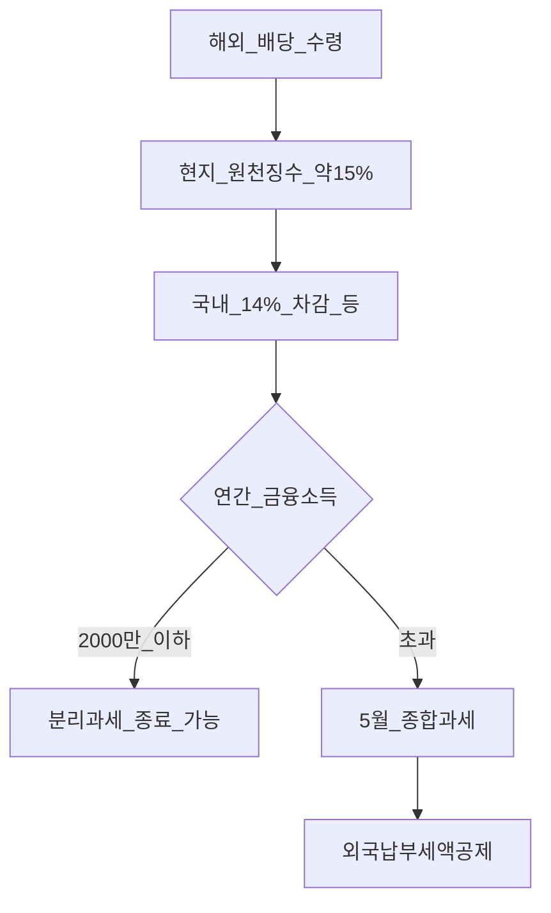
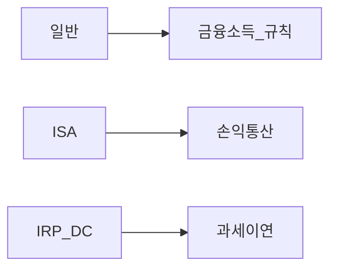

# 해외주식 양도소득세 Part 2 — 배당·금융소득종합과세

> **면책**: 교육 목적. 세무 신고는 국세청·전문가 확인.

## 메타

| 항목 | 내용 |
|------|------|
| 최종 검증일 | 2026-05-24 |
| 법령 기준일 | 소득세법 §57, §16 등 |
| 난이도 | L3 (Deep) — [READER-GUIDE](../../docs/READER-GUIDE.md) |
| 예상 읽기 시간 | 40~50분 |
| 시리즈 | [Part1 CGT](overseas-stocks-tax-part1-cgt.md) · Part2 · [Part3](overseas-stocks-tax-part3-scenarios.md) |

## 0. 이 편 읽기 전 (5분)

| 항목 | 내용 |
|------|------|
| **난이도** | L3 (Deep) — [READER-GUIDE §L등급](../../docs/READER-GUIDE.md) |
| **선수** | 없음 |
| **이번 편에서 쓰는 기호** | L_ISA, ISA, IRP, DB, DC (해당 시) |
| **복습 한 줄** | — |

## TL;DR

1. **배당**은 양도세와 **별도** — **금융소득**(이자·배당).
2. 해외 **원천징수**(미국 약 15%) 후 국내 **14%** 차감원천 등.
3. 연간 금융소득 **2,000만 원 초과** → **5월 종합과세**.
4. **외국납부세액공제**(§57)로 이중과세 완화.
5. QQQ **재투자 ETF**도 배당 발생 시 규칙 적용 — DC·IRP **선환급 폐지**(2025~).

---

## 1. 한 줄 정의 + 왜 중요한가
!!! info "CGT (Capital Gains Tax)"
    자산 매각 차익에 대한 세금.

!!! info "ETF"
    지수·자산 **바구니**를 한 종목처럼 거래

**정의**: 해외주식·해외 ETF **배당·분배금**은 **양도차익이 아닌** 배당소득(금융소득)으로 과세됩니다.

**왜 중요한가**: “팔지 않았으니 세금 없다”가 **틀립니다**. QQQ·고배당 ETF·개별주는 **연간 금융소득 합계**가 2,000만을 넘으면 **5월 부담**이 커집니다.

---

## 2. 선수 / 이후

**선수**: [part1-cgt](overseas-stocks-tax-part1-cgt.md), [investment-tax-overview.md](investment-tax-overview.md)  
**이후**: [part3-scenarios](overseas-stocks-tax-part3-scenarios.md), [isa-irp-pension-tax.md](isa-irp-pension-tax.md)

---

## 3. 직관·비유

**양도세**는 “집을 **팔 때** 낸 세금”, **배당**은 “살아 있는 동안 받는 **월세**”입니다. 월세와 매매 이익은 **서로 깎아 주지 않습니다**(유형이 다름).

---

## 4. 정식 용어

| 용어 | 정의 |
|------|------|
| 금융소득 | 이자+배당+일부 기타 |
| 원천징수 | 현지·국내 **징수** |
| 종합과세 | 2,000만 초과 시 **합산** |
| 외국납부세액공제 | §57 **이중과세** 완화 |
| 과세이연 | IRP·DC·ISA **계좌 내** |

### 4a. 핵심 용어 (본문 등장 순)

> 복습용. 정의는 §4 본표·[glossary](../../00-roadmap/glossary.md)·본문 `!!! info` 박스.

| 용어 | 한 줄 | 관련 이론 | glossary |
|------|-------|-----------|----------|
| 금융소득 | 이자+배당+일부 기타 | §4 | [glossary](../../00-roadmap/glossary.md#금융소득) |
| 원천징수 | 현지·국내 **징수** | §4 | [glossary](../../00-roadmap/glossary.md#원천징수) |
| 종합과세 | 2,000만 초과 시 **합산** | §4 | [glossary](../../00-roadmap/glossary.md#종합과세) |
| 외국납부세액공제 | §57 **이중과세** 완화 | §4 | [glossary](../../00-roadmap/glossary.md#외국납부세액공제) |
| 과세이연 | IRP·DC·ISA **계좌 내** | §4 | [glossary](../../00-roadmap/glossary.md#과세이연) |

---

## 5. 메커니즘

### ISA·IRP·DC

| 계좌 | 배당 |
|------|------|
| 일반 | § 규칙 |
| ISA | **통산** |
| IRP/DC | **이연** (2025~ 해외 **선환급 폐지**) |

---

## 6. 수식·모델

| 기호 | 이름 | 이 식에서 의미 |
|------|------|----------------|
| \(\D_\text{dom}\) | D  dom | 본문 §4·위 식 맥락 참고 |
| \(\D_\text{for}\) | D  for | 본문 §4·위 식 맥락 참고 |

\[
Fin = I + D_{\text{dom}} + D_{\text{for}} + \cdots
\]

**읽는 법**: **F**와 **in**의 관계를 위 식으로 쓴다. 경제·재무 해석은 변수표 「이 식에서 의미」와 [DEPTH-STANDARD](../docs/DEPTH-STANDARD.md) 기호 예제를 맞춘다.| 기호 | 이름 | 이 식에서 의미 |
|------|------|----------------|
| \(r\) | 할인율·수익률 | 기간당 이자·요구수익률 |
| \(n\) | 기간 | 연·월 등 복리·할인에 쓰는 횟수 |
| \(PV\) | 현재가치 | 오늘 시점으로 환산한 금액 |

\[
Fin > 20{,}000{,}000 \Rightarrow \text{종합과세 경로}
\]

**읽는 법**: **r**와 **n**의 관계를 위 식으로 쓴다. 경제·재무 해석은 변수표 「이 식에서 의미」와 [DEPTH-STANDARD](../docs/DEPTH-STANDARD.md) 기호 예제를 맞춘다.
**공제**(개념):

| 기호 | 이름 | 이 식에서 의미 |
|------|------|----------------|
| \(r\) | 할인율·수익률 | 기간당 이자·요구수익률 |
| \(n\) | 기간 | 연·월 등 복리·할인에 쓰는 횟수 |
| \(PV\) | 현재가치 | 오늘 시점으로 환산한 금액 |

\[
T_{\text{KR}} - \text{FTC} \leq T_{\text{KR}}
\]

**읽는 법**: **r**와 **n**의 관계를 위 식으로 쓴다. 경제·재무 해석은 변수표 「이 식에서 의미」와 [DEPTH-STANDARD](../docs/DEPTH-STANDARD.md) 기호 예제를 맞춘다.---

*(개념):

| 기호 | 이름 | 이 식에서 의미 |
|------|------|----------------|
| \(r\) | 할인율·수익률 | 기간당 이자·요구수익률 |
| \(n\) | 기간 | 연·월 등 복리·할인에 쓰는 횟수 |
| \(PV\) | 현재가치 | 오늘 시점으로 환산한 금액 |

\[
T_{\text{KR}} - \text{FTC} \leq T_{\text{KR}}
\]

**읽는 법**: **r**와 **n**의 관계를 위 식으로 쓴다. 경제·재무 해석은 변수표 「이 식에서 의미」와 [DEPTH-STANDARD](../docs/DEPTH-STANDARD.md) 기호 예제를 맞춘다.---

s/DEPTH-STANDARD.md) 기호 예제를 맞춘다.---

## 7. 한국 적용

### 7.1 2025

| 구분 | 내용 |
|------|------|
| 분리과세 종결 | 2,000만 이하 + 요건 |
| 종합과세 | 초과·미원천 등 |
| IRP/DC 해외 ETF | **선환급 폐지** — 실효 수익 ↓ |

### 7.2 2026

- ISA 한도 확대 — 계좌 내 배당 **통산** 혜택 확대 가능

### 7.3 미국 배당·원천징수 (교육)

| 단계 | 내용 |
|------|------|
| 1 | 미국 **약 15%** 원천 (조약·양식) |
| 2 | 국내 **14%** 차감원천(경로) |
| 3 | 연말 **2,000만** 판단 |
| 4 | 5월 **종합** 시 §57 **공제** |

### 7.4 QQQ·배당 ETF·개별주

| 상품 | 배당 규모(경향) | 설계 |
|------|-----------------|------|
| QQQ | 상대 **적음** | 양도세 중심 Part1 |
| SCHD·VYM 등 | **큼** | Part2 **필수** |
| 개별주 | 종목별 | 금융소득 누적 |

### 7.5 분리과세 vs 종합과세 — 판단 (교육)

| 조건 | 경로 |
|------|------|
| 연간 금융소득 **2,000만 이하** + 원천징수 등 요건 | **분리과세** 종결 **가능** |
| **초과** 또는 미원천·특정 요건 | **5월 종합과세** |
| ISA | 계좌 **손익통산** — Part3 |
| IRP·DC | **이연** — 수령 시 |

### 7.6 고배당 ETF·개별주 설계

| 상품 유형 | 배당 비중(경향) | 문서 |
|-----------|-----------------|------|
| QQQ | 상대 낮음 | Part1 중심 |
| SCHD·VYM·개별주 | 높음 | **본 문서** 필수 |
| 채권·머니마켓 | 이자 | investment-tax-overview |

**법·정책 근거**: 소득세법 §16·§57, 국세청 해외주식·배당 안내.

---

### 7.7 W-8BEN·원천징수 실무 (교육)

| 단계 | 내용 |
|------|------|
| 1 | 증권사에 **W-8BEN** 제출 — 미국 배당 **15%** 원천(조약) |
| 2 | 국내 **14%** 차감원천 경로 |
| 3 | 연말 **금융소득 합계** 2,000만 판단 |
| 4 | 5월 **외국납부세액공제** §57 |

미제출·만료 시 **30%** 원천 등으로 **실효 수익**이 떨어질 수 있습니다. DC·IRP도 **선환급 폐지** 후 현금흐름을 재검토하세요.

---

## 8. 숫자 예제 (가상)

> 가상 금액.

### 예제 1: **M** 경계 (가상)

| | 금액 |
|--|------|
| 해외 배당 | **M** |
| 국내 이자 | **M** |
| **합계** | **M** — **이하** |

### 예제 2: QQQ+고배당 (가상)

| | 가상 AB |
|--|---------|
| QQQ 배당 | **M** |
| 개별주 배당 | **M** |
| **합계** | **초과** → 5월 |

### 예제 3: IRP (가상)

| | 일반 | IRP |
|--|------|-----|
| 배당 **M** | 금융소득 | **이연** (수령 시) |

### 예제 4: 외국납부세액공제 (가상)

| | 가상 AQ |
|--|---------|
| 해외 배당 | **M** |
| 미국 원천 15% | **M** |
| 국내 추가 세액(가상) | §57로 **이중 완화** — 실무 신고 확인 |

### 예제 5: DC 2025 선환급 폐지 (가상)

| | 가상 AR (DC) |
|--|--------------|
| 해외 ETF 배당 | **이연**이나 선환급 **없음** |
| 실효 | 현금흐름 악화 — 상품·비중 재검토 |

---
## 9. FAQ

**Q1.** 양도손실·배당 상쇄? — **불가**.  
**Q2.** QQQ 배당? — **적으나** 발생 시 적용.  
**Q3.** ISA 배당? — **통산**.  
**Q4.** 미국 15%? — **공제** 검토.  
**Q5.** DC만? — [dc-pension](../dc-pension.md).  
**Q6.** 국내 배당 합산? — **예**.  
**Q7.** Part1? — 매매차익.  
**Q8.** 청년도약 이자? — **별도** 비과세.

**Q9. QQQ만 보유해도 Part2를 읽어야 하나요?**  
**A9.** 배당 규모는 **작지만 0이 아님**. 고배당 추가 시 **2,000만** 경계 — 본 문서 필수.

**Q10. DC·IRP 배당 현금흐름이 달라진 이유?**  
**A10.** 2025~ **선환급 폐지** — [dc-pension.md](../dc-pension.md)·[isa-irp-pension-tax.md](isa-irp-pension-tax.md).

---

### 실행 워크숍 체크리스트 (교육)

| # | 질문 | Yes 시 다음 문서 |
|---|------|------------------|
| 1 | 해외 ETF·주식을 보유 중인가? | [overseas-stocks-tax-part1-cgt.md](overseas-stocks-tax-part1-cgt.md) |
| 2 | 해외 배당이 연 500만 이상인가? | [part2-dividend](overseas-stocks-tax-part2-dividend.md) |
| 3 | DB 재직인가? | [db-pension.md](../db-pension.md) + IRP·ISA |
| 4 | 국내주식을 NXT에서 거래하는가? | [korea-ats-nextrade.md](../../03-markets/korea-ats-nextrade.md) |
| 5 | 10년 코어가 QQQ인가? | [isa.md](../isa.md) 또는 [isa-irp-pension-tax.md](isa-irp-pension-tax.md) |

위 표는 **의사결정 보조**이며, 개인 소득·가구·회사 제도에 따라 답이 달라집니다. 불확실하면 [investment-tax-overview.md](investment-tax-overview.md) → [account-product-tax-map.md](account-product-tax-map.md) 순으로 읽으세요.

## 10. 함정·리스크·한계

- **매매만** 관리  
- **2,000만** 무시  
- **선환급 폐지** 미반영  
- **고배당 ETF** 집중  
- **공제** 서류 누락

---

**Q. 실무에서는?**  
교과서 식·기호를 그대로 적용하기 전에 **수수료·세금·데이터 시점**을 분리한다. 숫자는 [DEPTH-STANDARD](../docs/DEPTH-STANDARD.md)처럼 기호만 먼저 맞추고, 법령·시장 수치는 §8 표·외부 출처로 갱신한다.

## L3 보충 — 장기 자산 형성 연결

본 절은 [DEPTH-STANDARD.md](../../../docs/DEPTH-STANDARD.md) L3 게이트를 충족하기 위한 **실행·교차 링크** 보충입니다.

### Bucket·현금흐름 연결

| Bucket | 대표 제도·자산 | 본 문서와의 관계 |
|--------|----------------|------------------|
| 0 | 비상금 MMDA | 세금·투자 **전** 우선 |
| 1 | [청년도약](../youth-leap-account.md)·[미래적금](../youth-future-savings.md) | 정책 적금 — 주식 **대체 아님** |
| 2a | DB·DC | [db-vs-dc-pension.md](../db-vs-dc-pension.md) |
| 2b | ISA·IRP | [isa.md](../isa.md)·[isa-irp-pension-tax.md](../tax/isa-irp-pension-tax.md) |
| 3 | QQQ·채권 코어 | [capm-and-risk-return.md](../08-advanced/capm-and-risk-return.md) |
| 4 | NXT·코스닥·QLD | [fomo-and-trading-hours.md](../05-behavioral/fomo-and-trading-hours.md) |

### 연간 점검 루틴 (교육)

| 분기 | 할 일 |
|------|--------|
| Q1 | [investment-tax-overview.md](../tax/investment-tax-overview.md) 캘린더 확인 |
| Q2 | [rebalancing-and-dca.md](../04-portfolio/rebalancing-and-dca.md) 코어 비중 |
| Q3 | 해외 배당·금융소득 **누적** — Part2 |
| Q4 | 익년 **5월** 양도세 자료 정리 — Part1 |
| ISA | 개설일 +36개월 **만기** 알림 |

### 2025 vs 2026 정책 추적

| 항목 | 확인 출처 |
|------|-----------|
| ISA 한도·비과세 | 금융위·조세특례 시행일 |
| DC +300만 공제 | 국세청·통합연금포털 |
| 청년도약 일몰·미래적금 | [kinfa](https://ylaccount.kinfa.or.kr) |
| 금융투자소득세 | 금융위 보도·[sources.md](../../../references/sources.md) |
| NXT 종목·거래중단 | [nextrade.co.kr](https://www.nextrade.co.kr) |

**면책 재확인**: 가상 예제·보도 수치는 **시점별 개정**됩니다. 실행·신고 전 공식 출처를 확인하세요.

## 11. 심화 읽기

- [part1](overseas-stocks-tax-part1-cgt.md), [part3](overseas-stocks-tax-part3-scenarios.md)  
- 국세청 해외주식 안내

---

## 12. 퀴즈

1. 배당 소득 구분?  
2. 양도손실과 상쇄?  
3. 종합과세 기준(원칙)?  
4. §57은?  
5. 2025 IRP 해외 배당 이슈?

힌트
1. 금융소득 2. 불가 3. 2,000만 초과 4. 외국납부세액공제 5. 선환급 폐지
