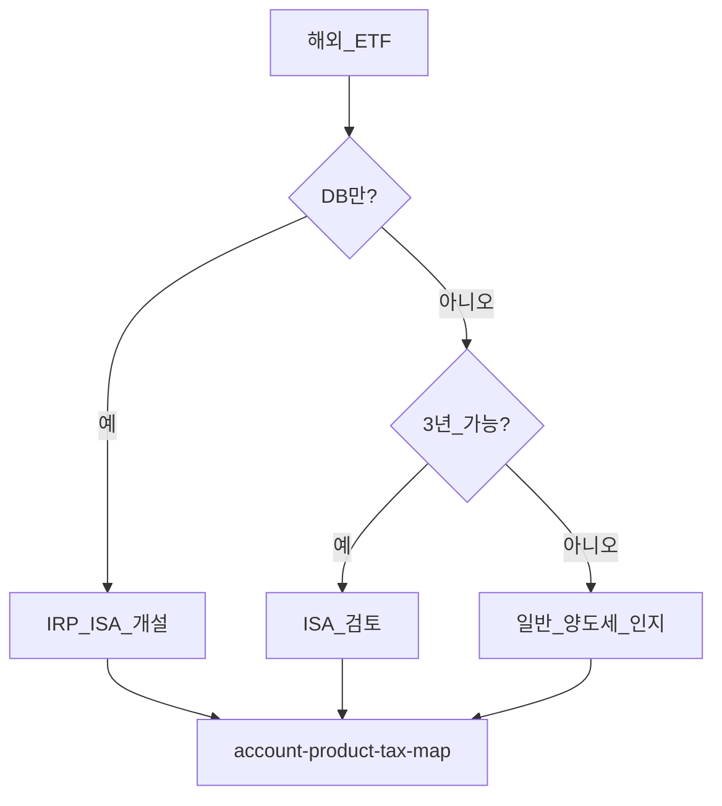
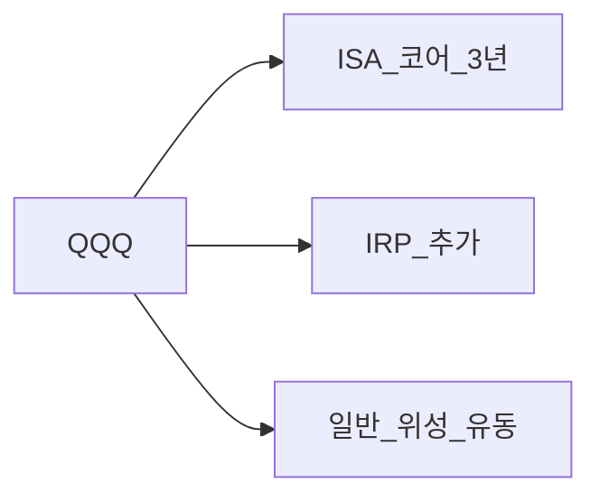
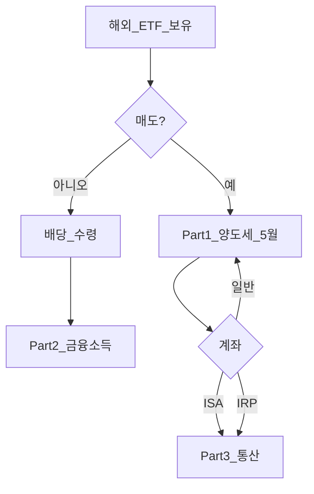

# 해외주식 세금 Part 3 — 계좌별 시나리오·의사결정

> **면책**: 교육 목적.

## 메타

| 항목 | 내용 |
|------|------|
| 최종 검증일 | 2026-05-24 |
| 난이도 | L3 (Deep) — [READER-GUIDE](../../docs/READER-GUIDE.md) |
| 예상 읽기 시간 | 40~50분 |
| 선수 | [Part1](overseas-stocks-tax-part1-cgt.md), [Part2](overseas-stocks-tax-part2-dividend.md) |

## 0. 이 편 읽기 전 (5분)

| 항목 | 내용 |
|------|------|
| **난이도** | L3 (Deep) — [READER-GUIDE §L등급](../../docs/READER-GUIDE.md) |
| **선수** | 없음 |
| **이번 편에서 쓰는 기호** | L_ISA, ISA, IRP, DB, DC (해당 시) |
| **복습 한 줄** | — |

## TL;DR

1. 같은 **QQQ**도 **일반 / ISA / IRP** 에 따라 매매·배당·신고가 **다름**.
2. **DB 재직** — 개인 매매 **없음** → IRP·ISA **개설**.
3. **3년 묶을 수 있으면** ISA — **초과·퇴직금** IRP.
4. 일반 계좌는 **250만 공제·5월** 인지 필수.
5. [account-product-tax-map](account-product-tax-map.md)와 **함께** 배치.

---

## 1. 한 줄 정의 + 왜 중요한가
!!! info "CGT (Capital Gains Tax)"
    자산 매각 차익에 대한 세금.

!!! info "ETF"
    지수·자산 **바구니**를 한 종목처럼 거래

**정의**: 동일 해외 ETF에 대해 **계좌 유형별**로 세금·신고·유동성이 어떻게 달라지는지 **시나리오**로 정리한 문서입니다.

**왜 중요한가**: Part1·2를 읽고도 “**그래서 내 QQQ는 어디?**”가 남습니다. 이 문서가 **실행 매핑**입니다.

---

## 2. 선수 / 이후

**선수**: Part1, Part2, [account-product-tax-map](account-product-tax-map.md)  
**이후**: [../irp.md](../irp.md), [../isa.md](../isa.md)

---

## 3. 직관·비유

QQQ **한 종목**을 **세 개의 서랍**(일반·ISA·IRP)에 나눠 넣을 수 있습니다. **DB 서랍**은 재직 중 **잠겨** 있습니다 — 퇴사 후 **IRP로 옮기는 열쇠**만 있습니다.

**Part3의 역할**: Part1은 **법 조문·계산**, Part2는 **배당**, Part3는 **당신의 계좌 조합**입니다. 세 법을 읽은 뒤에도 “QQQ 어디?”가 남으면 Part3 표에서 **시나리오 ID**를 하나 고르고 [account-product-tax-map.md](account-product-tax-map.md)에 옮기세요.

---

## 4. 정식 용어

| 시나리오 | 계좌 | 특징 |
|----------|------|------|
| A | 일반 | 양도세·5월 |
| B | ISA 3년+ | 비과세 한도 |
| C | IRP | 이연·공제 |
| D | DB 재직 | **해당 없음** |

### 4a. 핵심 용어 (본문 등장 순)

> 복습용. 정의는 §4 본표·[glossary](../../00-roadmap/glossary.md)·본문 `!!! info` 박스.

| 용어 | 한 줄 | 관련 이론 | glossary |
|------|-------|-----------|----------|
| 시나리오 | 특징 | §4 | [glossary](../../00-roadmap/glossary.md#시나리오) |
| ---------- | ------ | §4 | [glossary](../../00-roadmap/glossary.md#----------) |
| A | 양도세·5월 | §4 | [glossary](../../00-roadmap/glossary.md#a) |
| B | 비과세 한도 | §4 | [glossary](../../00-roadmap/glossary.md#b) |
| C | 이연·공제 | §4 | [glossary](../../00-roadmap/glossary.md#c) |
| D | **해당 없음** | §4 | [glossary](../../00-roadmap/glossary.md#d) |

---

## 5. 메커니즘

### 5.1 시나리오 표 (가상)

| ID | 계좌 | 매도 이익 500만 | 배당 300만 |
|----|------|-----------------|------------|
| A | 일반 | 양도세(250만 공제 후) | 금융소득 |
| B | ISA 3년+ | 한도 내 **비과세** 가능 | 통산 |
| C | IRP | **과세이연** | 이연 |
| D | DB | **N/A** | **N/A** |

### 5.2 의사결정

### 5.3 분할 보유

---

## 6. 수식·모델

**혼합 보유 실효세율**(교육, 가상):

| 기호 | 이름 | 이 식에서 의미 |
|------|------|----------------|
| \(tau\) | tau | §4·본문 정의 참고 |
| \(eff\) | eff | §4·본문 정의 참고 |
| \(T_\) | T_ | §4·본문 정의 참고 |
| \(ISA\) | ISA | §4·본문 정의 참고 |
| \(IRP\) | IRP | §4·본문 정의 참고 |
| \(gen\) | gen | §4·본문 정의 참고 |
| \(G_\) | G_ | §4·본문 정의 참고 |
| \(total\) | total | §4·본문 정의 참고 |

\[
\tau_{\text{eff}} = \frac{T_{\text{ISA}} + T_{\text{IRP}} + T_{\text{gen}}}{G_{\text{total}}}
\]

---

## 7. 한국 적용

### 7.1 DB 가입자 기본안

| 순서 | 계좌 | 용도 |
|------|------|------|
| 1 | **ISA** | QQQ 코어 3년 |
| 2 | **IRP** | 추가 납입·퇴직금 |
| 3 | 일반 | 단기·위성 |

### 7.2 DC 가입자

| | DC 70% | ISA |
|--|--------|-----|
| QQQ | 가능 | 3년 세제 |

### 7.3 2026

- ISA 500만 한도 — **시나리오 B** 유리도 ↑

### 7.4 시나리오별 신고·유동성

| ID | 3년 유동성 | 5월 신고 | 적합 |
|----|------------|----------|------|
| A 일반 | **높음** | **필요** | 단기·위성 |
| B ISA | **낮음** | 계좌 정산 | 코어 |
| C IRP | 중간 | 수령 시 | 퇴직·추가 |
| D DB | — | — | **개설**만 |

### 7.5 환율·선입선출 (Part1 연계)

- 같은 QQQ라도 **일반** 매도 시 **환율·취득단가** — Part1.  
- ISA·IRP는 **계좌 규칙** 우선.

### 7.6 시나리오 E~G (가상 요약)

| ID | 프로필 | 권장 배치 |
|----|--------|-----------|
| E | DC + QQQ 코어 | DC 70% + ISA 3년 **분할** |
| F | 고배당 해외 + QQQ | 배당 Part2 + QQQ ISA |
| G | 일반만 5년 | 5월 신고 **누적** — ISA 전환 검토 |

### 7.7 오류 사례 (교육)

| 오류 | 결과 |
|------|------|
| DB에서 QQQ 매수 시도 | **불가** — IRP·ISA |
| ISA 2년 해지 | **추징** |
| 양도손실로 배당 상쇄 기대 | **불가** |
| 퇴직금 → ISA | **불가** — IRP |

**법·정책 근거**: Part1·2, 조세특례(ISA), 소득세법(연금).

---

### 7.8 Part1·2·3 통합 워크플로

신규 투자자는 **일반 계좌만** 쓰지 말고, 3년 이상 QQQ는 **ISA·IRP** 시나리오를 Part3 표에서 **먼저** 고르세요.

---

## 8. 숫자 예제 (가상)

> 가상 시나리오.

### 예제 1: 가상 AC (DB)

| | 금액 |
|--|------|
| IRP QQQ 10년 DCA | 월 50만 |
| ISA | 월 80만 3년 |
| DB | 모니터링만 |

### 예제 2: 일반만 (가상 AD)

| | 결과 |
|--|------|
| 연 양도 400만×3년 | 5월 신고 누적 |
| ISA 미사용 | **실효세 ↑** |

### 예제 3: ISA+일반 분리 (가상 AE)

| | ISA | 일반 |
|--|-----|------|
| QQQ | 70% | 30% 스윙 |
| 세금 | 3년 통산 | 양도세 |

---

## 9. FAQ

**Q1.** ISA·일반 나누는 이유? — **세제·유동성** 분리.  
**Q2.** DB QQQ? — **불가**, IRP·ISA.  
**Q3.** DC만으로 충분? — **70%**·배당 검토.  
**Q4.** 2년 ISA 해지? — **추징**.  
**Q5.** Part1 손실? — 배당과 **별도**.  
**Q6.** QLD? — Bucket 4·비권장.  
**Q7.** NXT? — 국내 — [domestic-stocks-tax](domestic-stocks-tax.md).  
**Q8.** 청년도약? — Bucket 1.

**Q9. 시나리오 A~D 중 DB는?**  
**A9.** **D** — 개인 매매 없음, IRP·ISA 개설.

**Q10. Part1·2 없이 Part3만 읽어도 되나?**  
**A10.** **비권장** — 계산·배당은 Part1·2, Part3는 **배치**만.

**Q11. 시나리오 표를 실제 포트에 옮기는 순서는?**  
**A11.** (1) DB/DC 판별 → (2) 시나리오 ID 선택 → (3) [account-product-tax-map.md](account-product-tax-map.md) 4차원 표에 금액 기입 → (4) 연 5월 캘린더 등록.

**Q12. 청년도약 만기금을 QQQ 일반 계좌에 넣으면?**  
**A12.** 가능하나 **양도세·5월** 부담 — 만기금은 ISA·IRP **이전** 또는 Bucket 0 보강을 먼저 검토 — [youth-leap-account.md](../youth-leap-account.md).

---

### 실행 워크숍 체크리스트 (교육)

| # | 질문 | Yes 시 다음 문서 |
|---|------|------------------|
| 1 | 해외 ETF·주식을 보유 중인가? | [overseas-stocks-tax-part1-cgt.md](overseas-stocks-tax-part1-cgt.md) |
| 2 | 해외 배당이 연 500만 이상인가? | [part2-dividend](overseas-stocks-tax-part2-dividend.md) |
| 3 | DB 재직인가? | [db-pension.md](../db-pension.md) + IRP·ISA |
| 4 | 국내주식을 NXT에서 거래하는가? | [korea-ats-nextrade.md](../../03-markets/korea-ats-nextrade.md) |
| 5 | 10년 코어가 QQQ인가? | [isa.md](../isa.md) 또는 [isa-irp-pension-tax.md](isa-irp-pension-tax.md) |

위 표는 **의사결정 보조**이며, 개인 소득·가구·회사 제도에 따라 답이 달라집니다. 불확실하면 [investment-tax-overview.md](investment-tax-overview.md) → [account-product-tax-map.md](account-product-tax-map.md) 순으로 읽으세요.

## 10. 함정·리스크·한계

- **일반만** QQQ  
- **DB 매매** 착각  
- **ISA 기간**  
- **분할 없이** 한 계좌  
- 개인 **소득·한도** 미반영

---

## L3 보충 — 장기 자산 형성 연결

본 절은 [DEPTH-STANDARD.md](../../../docs/DEPTH-STANDARD.md) L3 게이트를 충족하기 위한 **실행·교차 링크** 보충입니다.

### Bucket·현금흐름 연결

| Bucket | 대표 제도·자산 | 본 문서와의 관계 |
|--------|----------------|------------------|
| 0 | 비상금 MMDA | 세금·투자 **전** 우선 |
| 1 | [청년도약](../youth-leap-account.md)·[미래적금](../youth-future-savings.md) | 정책 적금 — 주식 **대체 아님** |
| 2a | DB·DC | [db-vs-dc-pension.md](../db-vs-dc-pension.md) |
| 2b | ISA·IRP | [isa.md](../isa.md)·[isa-irp-pension-tax.md](../tax/isa-irp-pension-tax.md) |
| 3 | QQQ·채권 코어 | [capm-and-risk-return.md](../08-advanced/capm-and-risk-return.md) |
| 4 | NXT·코스닥·QLD | [fomo-and-trading-hours.md](../05-behavioral/fomo-and-trading-hours.md) |

### 연간 점검 루틴 (교육)

| 분기 | 할 일 |
|------|--------|
| Q1 | [investment-tax-overview.md](../tax/investment-tax-overview.md) 캘린더 확인 |
| Q2 | [rebalancing-and-dca.md](../04-portfolio/rebalancing-and-dca.md) 코어 비중 |
| Q3 | 해외 배당·금융소득 **누적** — Part2 |
| Q4 | 익년 **5월** 양도세 자료 정리 — Part1 |
| ISA | 개설일 +36개월 **만기** 알림 |

### 2025 vs 2026 정책 추적

| 항목 | 확인 출처 |
|------|-----------|
| ISA 한도·비과세 | 금융위·조세특례 시행일 |
| DC +300만 공제 | 국세청·통합연금포털 |
| 청년도약 일몰·미래적금 | [kinfa](https://ylaccount.kinfa.or.kr) |
| 금융투자소득세 | 금융위 보도·[sources.md](../../../references/sources.md) |
| NXT 종목·거래중단 | [nextrade.co.kr](https://www.nextrade.co.kr) |

**면책 재확인**: 가상 예제·보도 수치는 **시점별 개정**됩니다. 실행·신고 전 공식 출처를 확인하세요.

## 11. 심화 읽기

- [db-pension.md](../db-pension.md), [account-product-tax-map.md](account-product-tax-map.md)

---

## 12. 퀴즈

1. DB 재직 QQQ?  
2. 3년 가능 시 우선?  
3. 일반 해외 매도 신고?  
4. 배당 Part?  
5. 시나리오 D 의미?

힌트
1. IRP/ISA 2. ISA 3. 5월 4. Part2 5. DB 해당없음

