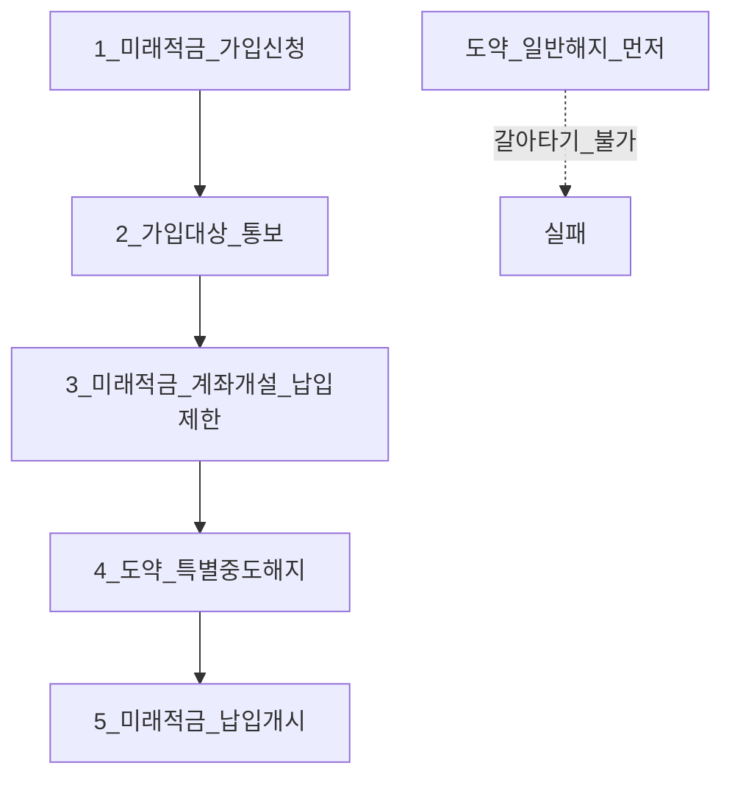
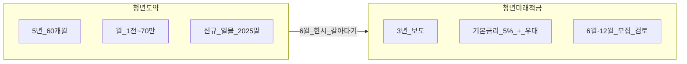

# 청년미래적금 — 2026 한시·갈아타기·특별중도해지

> **면책**: 본 문서는 교육 목적이며, 특정 개인·법인에 대한 투자·세무·법률 자문이 아닙니다. 제도·세율·상품 조건은 변경될 수 있으므로 실행 전 [서민금융진흥원(kinfa)](https://ylaccount.kinfa.or.kr) 및 금융위·취급 금융기관 공식 안내를 확인하세요.

## 메타

| 항목 | 내용 |
|------|------|
| 최종 검증일 | 2026-05-24 |
| 정책·법령 기준일 | 2025-12-31 확정, 2026-06 출시·갈아타기 한시 (보도·점검회의) |
| 난이도 | L3 (Deep) — [READER-GUIDE](../docs/READER-GUIDE.md) |
| 예상 읽기 시간 | 40~50분 |
| 관련 bucket | Bucket 1 (정책·고정), 청년도약과 상호 배타·전환 |

## 0. 이 편 읽기 전 (5분)

| 항목 | 내용 |
|------|------|
| **난이도** | L3 (Deep) — [READER-GUIDE §L등급](../docs/READER-GUIDE.md) |
| **선수** | [youth-leap-account](youth-leap-account.md), [time-horizon-and-buckets](../04-portfolio/time-horizon-and-buckets.md) |
| **이번 편에서 쓰는 기호** | 본문 §4·§4a 표 참고 |
| **복습 한 줄** | — |

## TL;DR

1. **청년미래적금**은 2026년 6월부터 출시되는 **3년 만기** 정책 적금(보도·점검회의 기준), 기본금리 **5%** + 기관별 우대 **최대 3%p** 수준.
2. **청년도약계좌** 신규 가입은 **~2025.12.31 일몰**; 기존 가입자는 만기까지 혜택 유지.
3. **갈아타기**는 **2026년 6월 최초 가입 기간 한시** — 도약→미래적금, **순서 엄수** 필수.
4. **특별중도해지**: 갈아타기·불가피 사유 시 **정부기여금·이자 비과세** 유지(일반 중도해지와 다름).
5. 도약을 **먼저 일반 해지**하면 갈아타기 **불가** — 반드시 미래적금 **가입대상 통보·계좌개설 후** 도약 특별중도해지.

## 1. 한 줄 정의 + 왜 중요한가

**정의**: **청년미래적금**은 청년층 자산 형성을 위해 정부가 **기여금·세제(이자소득 비과세 등)** 를 연계한 **정책 적금**으로, 2026년 이후 **연 2회(6월·12월)** 신규 모집이 검토되는 후속·대체 상품군입니다(금융위 점검회의·보도).

!!! info "Bucket"
    시간·목적별 **자금 슬롯**(0 비상금 → 3 코어 등)

!!! info "ETF"
    지수·자산 **바구니**를 한 종목처럼 거래

**왜 중요한가**: 청년도약(5년·60개월) 가입자는 **6월 한 달** 갈아타기 창이 열리며, **절차 한 번** 어기면 기여금·비과세를 잃을 수 있습니다. 주식·ETF가 아니라 **Bucket 1** 고정 슬롯이므로 ISA·IRP와 **목적·기간**을 분리해야 합니다.

## 2. 선수 지식 / 이후 읽을 것

**선수**:
- [youth-leap-account.md](youth-leap-account.md) — 청년도약 5년 구조
- [time-horizon-and-buckets.md](../04-portfolio/time-horizon-and-buckets.md)

**이후**:
- [isa.md](isa.md) — Bucket 2b 주식·ETF
- [irp.md](irp.md) — 퇴직·연금 슬롯
- [investment-tax-overview.md](tax/investment-tax-overview.md)

## 3. 직관·비유

**청년도약**은 “**5년 묶음 적금 + 정부가 매달 보너스**”이고, **청년미래적금**은 “**3년으로 줄인 신형 적금 + 금리·기여 구조 개편**”에 가깝습니다. **갈아타기**는 통신사 **번호이동**과 비슷합니다 — **새 회선(미래적금) 개통 승인**을 받은 뒤에야 **옛 회선(도약) 해지**를 해야 보너스가 따라옵니다.

반대로 도약을 **일반 해지**하면 “번호이동 자격”이 사라져, 6월에 미래적금으로 **환승**할 수 없습니다.

## 4. 정식 개념·용어

| 용어 | English | 정의 |
|------|------|----------------|
| 청년미래적금 | Youth Future Savings | 2026~ 정책 적금(3년 만기, 보도 기준) |
| 청년도약계좌 | Youth Leap Account | 5년(60개월) 정책 적금, 신규 일몰 |
| 갈아타기 | Switch / portability | 도약→미래적금 **한시** 전환 |
| 특별중도해지 | Special early termination | 정부기여·세제 **유지**하는 해지 사유 |
| 일반 중도해지 | Ordinary early termination | 기여금·비과세 **상실** |
| 정부기여금 | Government matching | 소득구간별 **기여율** (일반형·우대형) |

### 4a. 핵심 용어 (본문 등장 순)

> 복습용. 정의는 §4 본표·[glossary](../00-roadmap/glossary.md)·본문 `!!! info` 박스.

| 용어 | 한 줄 | 관련 이론 | glossary |
|------|------|------|----------------|
| 청년미래적금 | 2026~ 정책 적금 | §4 | [glossary](../00-roadmap/glossary.md#청년미래적금) |
| 청년도약계좌 | 5년 | §4 | [glossary](../00-roadmap/glossary.md#청년도약계좌) |
| 갈아타기 | 도약→미래적금 **한시** 전환 | §4 | [glossary](../00-roadmap/glossary.md#갈아타기) |
| 특별중도해지 | 정부기여·세제 **유지**하는 해지 사유 | §4 | [glossary](../00-roadmap/glossary.md#특별중도해지) |
| 일반 중도해지 | 기여금·비과세 **상실** | §4 | [glossary](../00-roadmap/glossary.md#일반-중도해지) |
| 정부기여금 | 소득구간별 **기여율** | §4 | [glossary](../00-roadmap/glossary.md#정부기여금) |

## 5. 메커니즘

### 5.1 갈아타기 순서 (2026년 6월 한시)

| 순서 | 행동 | 주의 |
|------|------|----------------|
| ① | 청년미래적금 **가입신청** (취급 은행 앱) | kinfa·금융위 요건 확인 |
| ② | **가입대상 통보** 수신 | 미통보 시 다음 단계 금지 |
| ③ | 미래적금 **계좌개설** | 이 시점 **납입 제한** 상태 |
| ④ | 청년도약 **특별중도해지** | 일반 해지 **아님** |
| ⑤ | 미래적금 **납입 개시** | 해지 완료 후 |

**근거**: 금융위 2026.4~5 점검회의·언론 보도(아시아경제·뉴스웍스·한국경제 등) — **kinfa 공식 FAQ**로 최종 확인.

### 5.2 도약 vs 미래적금 비교 (교육용)

| 항목 | 청년도약 (기존) | 청년미래적금 (2026 보도) |
|------|------|----------------|
| 만기 | **5년**(60개월) | **3년** |
| 신규 | **~2025.12.31 일몰** | 2026-06~, 연 2회 모집 검토 |
| 투자 형태 | **적금** (ETF 직접 X) | **적금** |
| 갈아타기 | → 미래적금 **6월 한시** | 도약 가입자만 |

## 6. 수식·모델

정책 적금은 **복리 ETF**가 아니라 **납입액 × (이자 + 정부기여율)** 구조입니다. 교육용 단순 추정:

| 기호 | 이름 | 이 식에서 의미 |
|------|------|----------------|

\[
\text{만기 수령액} \approx \sum_{t=1}^{T} P_t \cdot (1 + r_{\text{eff},t}) + G_t
\]

**읽는 법**: **만기 수령액**와 **t**의 관계를 위 식으로 쓴다. 경제·재무 해석은 변수표 「이 식에서 의미」와 [DEPTH-STANDARD](../docs/DEPTH-STANDARD.md) 기호 예제를 맞춘다.
- \(P_t\): 월 납입(가상)  
- \(r_{\text{eff}}\): 기본+우대 금리(기관·요건별)  
- \(G_t\): 정부기여(일반형·우대형 **소득·가구** 기준)  

**실제**는 금융기관 약관·kinfa 계산기로 확인. 보도상 미래적금 **3년 유지 시 정부 보너스 최대 약 216만 원** 수준 언급(한국경제 등) — **개인별 상이**.

---

와 **t**의 관계를 위 식으로 쓴다. 경제·재무 해석은 변수표 「이 식에서 의미」와 [DEPTH-STANDARD](../docs/DEPTH-STANDARD.md) 기호 예제를 맞춘다.
- \(P_t\): 월 납입(가상)  
- \(r_{\text{eff}}\): 기본+우대 금리(기관·요건별)  
- \(G_t\): 정부기여(일반형·우대형 **소득·가구** 기준)  

**실제**는 금융기관 약관·kinfa 계산기로 확인. 보도상 미래적금 **3년 유지 시 정부 보너스 최대 약 216만 원** 수준 언급(한국경제 등) — **개인별 상이**.

| 항목 | 내용 |

| 항목 | 내용 |
| 신규 가입 | 조세특례 **~2025.12.31** 일몰 (kinfa) |
| 기존 가입자 | **만기까지** 정부기여·비과세 유지 |
| Bucket | **1** — 중도해지 최소화 |

### 7.2 2026년 (미래적금·갈아타기)

| 항목 | 2025 | 2026 (보도·시행 확인) |
|------|------|----------------|
| 청년도약 신규 | 일몰 | **신규 불가** |
| 청년미래적금 | — | **6월 최초 출시** |
| 갈아타기 | — | **6월 최초 가입 기간만** (1회 한정) |
| 특별중도해지 우대금리 | 기본금리만(기존 지적) | **충족·일부 충족 우대 인정** 확대 협의(금융위) |
| 결혼 청년 소득 | 기존 중위소득 % | **완화** (일반 200→250%, 우대 150→200% 보도) |
| 신용점수 가점 | — | 2년+·누적 800만+ **5~10점** 추진, 도약 기간 **합산** |

**법·정책 근거**: 조세특례제한법(청년도약), 금융위·kinfa 점검회의 보도 — **시행령·약관**은 출시 전후 갱신.

### 7.3 특별중도해지 vs 일반 중도해지

| 구분 | 정부기여금 | 이자 비과세 | 대표 사유 |
|------|------|------|----------------|
| **일반 중도해지** | 상실 | 상실 | 단순 자금 필요 |
| **특별중도해지** | 유지(요건) | 유지(요건) | **갈아타기**, 사망·해외이주·퇴직·폐업·질병 등 |
| **만기 해지** | 수령 | 비과세 유지 | 3년·5년 완료 |

---

|

## 8. 숫자 예제 (가상)

> 모든 인물·금액은 가상입니다.

### 예제 1: 갈아타기 실익 비교 (가상)

| 항목 | 가상 직장인 B (도약 2년 경과) | 가상 직장인 C (도약 4.5년 경과) |
|------|------|----------------|
| 도약 잔여 | 38개월 | 6개월 |
| 미래적금 우대형 기여 가정 | 월 **M** × 36개월 + 12% 기여 | 동일 |
| **판단(교육)** | 갈아타기 **검토** | **만기 유지** 유리할 수 있음 |

→ **남은 기간·이미 받은 기여·우대금리 인정**을 합산해 결정. 보도: “만기 임박하면 유지가 나을 수 있다”(한국경제).

### 예제 2: 순서 위반 (가상)

| 단계 | 가상 D의 행동 | 결과 |
|------|------|----------------|
| 1 | 도약 **일반 해지** (미래적금 신청 전) | 갈아타기 **불가** |
| 2 | 6월에 미래적금 신청 | **중복·요건** 불충족 가능 |

### 예제 3: 월 납입 설계 (가상)

| 항목 | 가상 E |
|------|--------|
| 월 소득(가상) | **M** (만 원 단위, 교육용) |
| 미래적금 납입 | 월 **M** (만 원 단위, 교육용)** (3년 유지 가능 수준) |
| 3년 원금 | 1,**M** (만 원 단위, 교육용) |
| 정부기여+이자(가상) | 구간별 — kinfa 계산기로 확인 |

→ **무리한 **M** (만 원 단위, 교육용)** 납입 후 중도해지가 최대 리스크.

## 9. FAQ

**Q1. 청년미래적금에 QQQ를 살 수 있나요?**  
**A1.** **아니요.** 적금형 정책 상품입니다. 주식·ETF는 [isa.md](isa.md)·[irp.md](irp.md).

**Q2. 도약과 미래적금을 동시에 가입할 수 있나요?**  
**A2.** **중복 불가.** 6월 한시 **갈아타기** 절차로만 전환(보도).

**Q3. 갈아타기는 언제까지인가요?**  
**A3.** **2026년 6월 최초 가입 기간**에 한정(1회). 이후 신규는 미래적금 **일반 모집**만.

**Q4. 도약을 먼저 해지하면 어떻게 되나요?**  
**A4.** 갈아타기 **불가**. 정부기여·비과세도 일반 해지 규칙 적용.

**Q5. 특별중도해지 시 우대금리는?**  
**A5.** 2026 개편으로 **도약에서 이미 충족한 우대** 일부 **인정** 방향(금융위 협의 중) — 약관·출시 FAQ 확인.

**Q6. ISA·IRP와 병행되나요?**  
**A6.** **가능.** Bucket 1(적금)과 2b(증권)는 **별도**.

**Q7. 청년도약 신규는 2026년에도 되나요?**  
**A7.** **신규 불가**(일몰). 기존자·미래적금 신규·갈아타기만.

**Q8. 중도해지하면?**  
**A8.** **일반** 중도해지: 기여·비과세 상실. **특별**: 사유·갈아타기 시 유지.

## 10. 함정·리스크·한계

- **순서 역전** — 도약 선해지  
- **6월 창 놓침** — 1년 대기(12월 모집 검토)  
- **만기 임박 도약** 무조건 갈아타기  
- **적금=투자** 착각 — Bucket 1은 **현금흐름·정책**  
- 보도 수치·금리·기여율은 **출시 약관**과 다를 수 있음  
- 본 문서는 **kinfa·금융위** 교차 검증 전제, 단독 언론 인용 금지

---

**Q. 실무에서는?**  
교과서 식·기호를 그대로 적용하기 전에 **수수료·세금·데이터 시점**을 분리한다. 숫자는 [DEPTH-STANDARD](../docs/DEPTH-STANDARD.md)처럼 기호만 먼저 맞추고, 법령·시장 수치는 §8 표·외부 출처로 갱신한다.

## 11. 심화 읽기

- [references/sources.md](../references/sources.md) — kinfa, 금융위  
- [youth-leap-account.md](youth-leap-account.md)  
- 금융위 청년미래적금 점검회의 보도(2026.4~5)

## 12. 스스로 점검 퀴즈

1. 갈아타기 시 도약 해지와 미래적금 개설 중 무엇이 먼저인가?  
2. 도약을 일반 해지하면 갈아타기가 가능한가?  
3. 청년미래적금에서 ETF를 직접 매수하는가?  
4. 특별중도해지와 일반 중도해지의 핵심 차이는?  
5. 청년도약 신규 가입이 2026년에 가능한가?

??? note "정답 힌트"

    1. 미래적금 가입신청→통보→개설 **후** 도약 특별중도해지 · 2. 아니오 · 3. 아니오 · 4. 기여·비과세 유지 여부 · 5. 아니오(일몰)