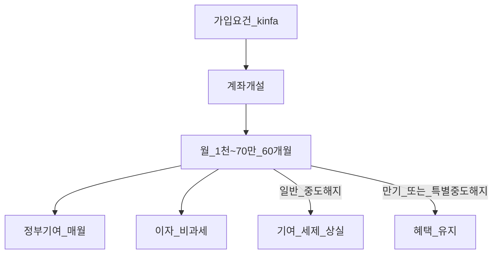
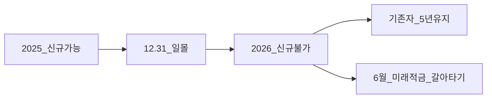
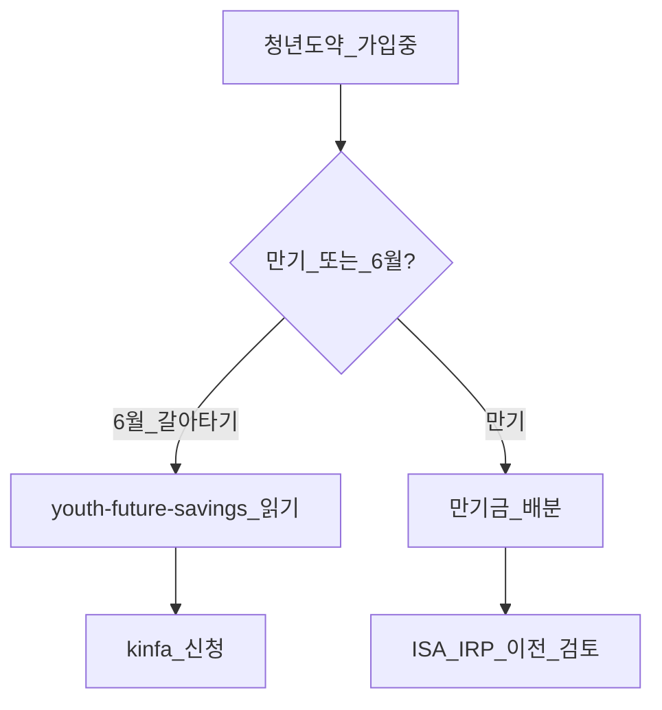

# 청년도약계좌 완전 가이드

> **면책**: 본 문서는 교육 목적이며, 특정 개인·법인에 대한 투자·세무·법률 자문이 아닙니다. 제도·세율·상품 조건은 변경될 수 있으므로 실행 전 [서민금융진흥원(kinfa)](https://ylaccount.kinfa.or.kr)을 확인하세요.

## 메타

| 항목 | 내용 |
|------|------|
| 최종 검증일 | 2026-05-24 |
| 정책·법령 기준일 | 신규 일몰 ~2025.12.31, 기존 가입자 만기 유지 |
| 난이도 | L3 (Deep) — [READER-GUIDE](../docs/READER-GUIDE.md) |
| 예상 읽기 시간 | 40~50분 |
| 관련 bucket | Bucket 1 (정책·고정) |

## 0. 이 편 읽기 전 (5분)

| 항목 | 내용 |
|------|------|
| **난이도** | L3 (Deep) — [READER-GUIDE §L등급](../docs/READER-GUIDE.md) |
| **선수** | [time-horizon-and-buckets](../04-portfolio/time-horizon-and-buckets.md), [cash-flow-basics](../01-foundations/cash-flow-basics.md) |
| **이번 편에서 쓰는 기호** | 본문 §4·§4a 표 참고 |
| **복습 한 줄** | — |

## TL;DR

1. **만 19~34**·소득·가구 요건 — kinfa에서 **가입대상** 확인.
2. **월 1천~70만 원**, **5년(60개월)** 유지 시 정부기여·**이자 비과세**.
3. **신규 가입** 조세특례 **~2025.12.31 일몰** — 2026년 **신규 불가**, 기존자는 **만기까지** 혜택.
4. **적금형** — ETF·주식 **직접 불가**; ISA·IRP와 **병행** 가능.
5. 2026년 6월 **청년미래적금 갈아타기** — [youth-future-savings.md](youth-future-savings.md) 순서 필수.

## 1. 한 줄 정의 + 왜 중요한가

**정의**: **청년도약계좌**는 청년의 자산 형성을 위해 **정부기여금**과 **이자소득 비과세** 등을 제공하는 **5년 만기 정책 적금**입니다(조세특례제한법).

!!! info "Bucket"
    시간·목적별 **자금 슬롯**(0 비상금 → 3 코어 등)

**왜 중요한가**: 장기 목표(10년+) 포트폴리오에서 **Bucket 1** 은 “**깨지 않는 고정 층**”입니다. 중도해지·일몰 후 착각·2026 **갈아타기** 실수는 **수백만 원** 기여금 손실로 이어질 수 있습니다.

## 2. 선수 지식 / 이후 읽을 것

**선수**:
- [time-horizon-and-buckets.md](../04-portfolio/time-horizon-and-buckets.md)
- [cash-flow-basics.md](../01-foundations/cash-flow-basics.md)

**이후**:
- [youth-future-savings.md](youth-future-savings.md) — 2026 미래적금·갈아타기
- [isa.md](isa.md), [irp.md](irp.md)

## 3. 직관·비유

청년도약은 “**정부가 매달 보너스를 얹어 주는 5년 묶음 적금**”입니다. 중간에 깨면(일반 중도해지) 보너스가 **회수**됩니다. 주식 ISA는 “**증시 엘리베이터**”, 도약은 “**금고 적금**” — 속도·위험·유동성이 다릅니다.

## 4. 정식 개념·용어

| 용어 | 정의 |
|------|------|
| 일반형 | 소득·가구 기준 **일반** 기여율 |
| 우대형 | 더 높은 기여 — **요건** 엄격 |
| 정부기여금 | 납입액 대비 **정부 매칭** |
| 가입기간 | **60개월** (5년) |
| 일몰 | 신규 가입 **종료** |
| 특별중도해지 | 사유·갈아타기 시 혜택 **유지** |

### 4a. 핵심 용어 (본문 등장 순)

> 복습용. 정의는 §4 본표·[glossary](../00-roadmap/glossary.md)·본문 `!!! info` 박스.

| 용어 | 한 줄 | 관련 이론 | glossary |
|------|------|------|----------------|
| 일반형 | 소득·가구 기준 **일반** 기여율 | §4 | [glossary](../00-roadmap/glossary.md#일반형) |
| 우대형 | 더 높은 기여 | §4 | [glossary](../00-roadmap/glossary.md#우대형) |
| 정부기여금 | 납입액 대비 **정부 매칭** | §4 | [glossary](../00-roadmap/glossary.md#정부기여금) |
| 가입기간 | **60개월** | §4 | [glossary](../00-roadmap/glossary.md#가입기간) |
| 일몰 | 신규 가입 **종료** | §4 | [glossary](../00-roadmap/glossary.md#일몰) |
| 특별중도해지 | 사유·갈아타기 시 혜택 **유지** | §4 | [glossary](../00-roadmap/glossary.md#특별중도해지) |

## 5. 메커니즘

### 2025 vs 2026

## 6. 수식·모델

만기 **원금**(가상):

| 기호 | 이름 | 이 식에서 의미 |
|------|------|----------------|
| **r** | 할인율·수익률 | 기간당 이자·요구수익률 |
| **n** | 기간 | 연·월 등 복리·할인에 쓰는 횟수 |
| **PV** | 현재가치 | 오늘 시점으로 환산한 금액 |
| **FV** | 미래가치 | 미래 시점의 목표·결과 금액 |

\[
\text{원금} = \sum_{t=1}^{60} P_t
\]

**읽는 법**: **원금**와 **t**의 관계를 위 식으로 쓴다. 경제·재무 해석은 변수표 「이 식에서 의미」와 [DEPTH-STANDARD](../docs/DEPTH-STANDARD.md) 기호 예제를 맞춘다.
**정부기여** (구간별, kinfa):

| 기호 | 이름 | 이 식에서 의미 |
|------|------|----------------|
| **r** | 할인율·수익률 | 기간당 이자·요구수익률 |
| **n** | 기간 | 연·월 등 복리·할인에 쓰는 횟수 |
| **PV** | 현재가치 | 오늘 시점으로 환산한 금액 |
| **FV** | 미래가치 | 미래 시점의 목표·결과 금액 |

\[
G_t = P_t \times g(\text{유형}, \text{소득})
\]

**읽는 법**: **G_t**와 **P_t**의 관계를 위 식으로 쓴다. 경제·재무 해석은 변수표 「이 식에서 의미」와 [DEPTH-STANDARD](../docs/DEPTH-STANDARD.md) 기호 예제를 맞춘다.- \(g\): 일반형·우대형 **기여율** — 공식 계산기 사용  
- **이자**: 금융기관 **우대금리** 누적, **비과세**

---

 |
|------|
| 신규 | **~2025.12.31** 까지 |
| 기간 | **60개월** |
| 기여 확대 | 보도상 월 최대 기여 **3.3만** 등 (시점별 확인) |

### 7.2 2026년

| 항목 | 내용 |
|------|------|
| 신규 | **불가** |
| 기존 가입자 | **만기·특별중도해지** 규칙 유지 |
| 후속 | [청년미래적금](youth-future-savings.md) 6월 출시·**갈아타기 한시** |

### 7.3 kinfa 확인 체크리스트

| # | 확인 항목 |
|------|------|
| 1 | 만 19~34 **나이** |
| 2 | **소득·가구** (일반·우대) |
| 3 | **타 정책 중복** 여부 |
| 4 | **일몰** 후 신규 불가 |
| 5 | 2026 **6월 갈아타기** — [youth-future-savings.md](youth-future-savings.md) |

### 7.4 Bucket 1 운영 원칙

- **중도해지 최소화** — 비상금은 Bucket 0.  
- **주식 대체 아님** — ISA·IRP 병행.  
- **만기 자금** — 일시 소비 vs 장기 **이전** 계획.

### 7.5 청년도약 vs 청년미래적금 — 2026 갈아타기 (필수 링크)

| 항목 | 청년도약 (본 문서) | [청년미래적금](youth-future-savings.md) |
|------|------|----------------|
| 신규 (2026) | **불가** (일몰) | **6월 출시** 보도 |
| 기존 가입자 | 60개월 **만기** 또는 특별중도해지 | **6월 한시 갈아타기** 절차 |
| 혜택 | 정부기여·이자 비과세 | 별도 설계 — kinfa 확인 |
| 주식 | **불가** | **불가** |
| 연계 문서 | 본 문서 | **갈아타기 순서·서류·기한** — 반드시 선독 |

**주의**: 도약을 **일반 중도해지**한 뒤 미래적금을 신청하면 기여금 **반환·혜택 상실**이 발생할 수 있습니다. 반드시 [youth-future-savings.md](youth-future-savings.md)의 **특별중도해지·갈아타기** 조항을 따르세요.

### 7.6 kinfa·현금흐름 연동

| Bucket | 제도 | 월 현금흐름 (가상 설계) |
|------|------|----------------|
| 0 | 비상금 | 3~6개월 생활비 — [emergency-fund.md](../01-foundations/emergency-fund.md) |
| 1 | 청년도약 | 1천~70만 **상한 내** — 무리 금지 |
| 2b | ISA | 도약 **이후** 잔여 — [cash-flow-basics.md](../01-foundations/cash-flow-basics.md) |

**법·정책 근거**: 조세특례제한법 청년도약 특례, kinfa 운영 요강·FAQ, 2025.12.31 신규 일몰 공고.

### 7.7 만기 후 자금 배분 (교육)

| 선택 | 장점 | 단점 |
|------|------|----------------|
| 일시 소비 | 유동성 | 장기 복리 **상실** |
| ISA·IRP 이전 | 세제·성장 | 계좌 규칙·기간 |
| 부채 상환 | 이자 절감 | 주식 기회비용 |
| 비상금 보강 | Bucket 0 | 수익률 낮음 |

만기금 **전액**을 코스닥·NXT 단타에 넣는 것은 Bucket 1 **목적**과 맞지 않습니다. [youth-future-savings.md](youth-future-savings.md) 갈아타기를 검토하는 경우에도 **kinfa 절차** 없이 일반 해지하지 마세요.

## 8. 숫자 예제 (가상)

> 가상 인물·금액.

> 모든 인물·금액은 가상입니다.

### 예제 1: 만기 시나리오 (가상)

| 항목 | 가상 M |
|------|--------|
| 월 납입 | **M** (만 원 단위, 교육용) × 60 |
| 원금 | 3,**M** (만 원 단위, 교육용) |
| 정부기여+이자(가상) | +약 **M** (구간·금리 가정) |
| **만기(가상)** | 약 **M** |

→ **kinfa 계산기**로 재산출.

### 예제 2: 중도해지 (가상)

| 항목 | 가상 N |
|------|--------|
| 24개월 후 일반 해지 | 기여금 **전액 반환**·비과세 **상실** |
| 본인 손실(가상) | 기대 기여 **약 M** 상실 (교육용) |

### 예제 3: ISA 병행 (가상)

| Bucket | 가상 O | 월 |
|------|------|----------------|
| 1 도약 | **M** | **PMT** |
| 2b ISA | **T** | QQQ DCA |
| 0 비상금 | 완비 | — |

## 9. FAQ

**Q1. 주식 대신 도약만 넣어도 되나요?**  
**A1.** Bucket 1만으로 **장기 주식 목표**는 부족 — ISA·IRP **병행**.

**Q2. 2026년에 처음 가입?**  
**A2.** 도약 **신규 불가** — **미래적금** 모집 확인.

**Q3. ISA와 세금 중복?**  
**A3.** **별도** 제도.

**Q4. DB·DC와?**  
**A4.** 퇴직연금과 **무관**.

**Q5. 갈아타기는?**  
**A5.** [youth-future-savings.md](youth-future-savings.md) — **6월·순서**.

**Q6. 우대형 조건?**  
**A6.** kinfa **소득·가구** 표.

**Q7. 급전 필요?**  
**A7.** 일반 해지 **손실** — 비상금 Bucket 0 먼저.

**Q8. 만기 후 자금?**  
**A8.** ISA·IRP **이전** 등 장기 설계.

**Q9. 청년미래적금과 차이는?**  
**A9.** [youth-future-savings.md](youth-future-savings.md) — 2026 **6월 갈아타기**·신규 모집.

**Q10. 비상금으로 도약을 써도 되나요?**  
**A10.** **권장하지 않음** — 일반 중도해지 시 기여 **반환** — [emergency-fund.md](../01-foundations/emergency-fund.md).

## 10. 함정·리스크·한계

- **일반 중도해지** — 기여·비과세 상실  
- **도약 선해지** 후 갈아타기 시도  
- **적금=QQQ** 착각  
- **70만 원** 무리 납입  
- 일몰·미래적금 **혼동**

---

**Q. 실무에서는?**  
교과서 식·기호를 그대로 적용하기 전에 **수수료·세금·데이터 시점**을 분리한다. 숫자는 [DEPTH-STANDARD](../docs/DEPTH-STANDARD.md)처럼 기호만 먼저 맞추고, 법령·시장 수치는 §8 표·외부 출처로 갱신한다.

## L3 보충 — 장기 자산 형성 연결

본 절은 [DEPTH-STANDARD.md](../../docs/DEPTH-STANDARD.md) L3 게이트를 충족하기 위한 **실행·교차 링크** 보충입니다.

### Bucket·현금흐름 연결

| Bucket | 대표 제도·자산 | 본 문서와의 관계 |
|------|------|----------------|
| 0 | 비상금 MMDA | 세금·투자 **전** 우선 |
| 1 | [청년도약](youth-leap-account.md)·[미래적금](youth-future-savings.md) | 정책 적금 — 주식 **대체 아님** |
| 2a | DB·DC | [db-vs-dc-pension.md](db-vs-dc-pension.md) |
| 2b | ISA·IRP | [isa.md](isa.md)·[isa-irp-pension-tax.md](tax/isa-irp-pension-tax.md) |
| 3 | QQQ·채권 코어 | [capm-and-risk-return.md](../08-advanced/capm-and-risk-return.md) |
| 4 | NXT·코스닥·QLD | [fomo-and-trading-hours.md](../05-behavioral/fomo-and-trading-hours.md) |

### 연간 점검 루틴 (교육)

| 분기 | 할 일 |
|------|--------|
| Q1 | [investment-tax-overview.md](tax/investment-tax-overview.md) 캘린더 확인 |
| Q2 | [rebalancing-and-dca.md](../04-portfolio/rebalancing-and-dca.md) 코어 비중 |
| Q3 | 해외 배당·금융소득 **누적** — Part2 |
| Q4 | 익년 **5월** 양도세 자료 정리 — Part1 |
| ISA | 개설일 +36개월 **만기** 알림 |

### 2025 vs 2026 정책 추적

| 항목 | 확인 출처 |
|------|-----------|
| ISA 한도·비과세 | 금융위·조세특례 시행일 |
| DC +300만 공제 | 국세청·통합연금포털 |
| 청년도약 일몰·미래적금 | [kinfa](https://ylaccount.kinfa.or.kr) |
| 금융투자소득세 | 금융위 보도·[sources.md](../../references/sources.md) |
| NXT 종목·거래중단 | [nextrade.co.kr](https://www.nextrade.co.kr) |

**면책 재확인**: 가상 예제·보도 수치는 **시점별 개정**됩니다. 실행·신고 전 공식 출처를 확인하세요.

## 11. 심화 읽기

- [references/sources.md](../references/sources.md)  
- [youth-future-savings.md](youth-future-savings.md)  
- kinfa FAQ

## 12. 스스로 점검 퀴즈

1. 청년도약 만기(개월)는?  
2. 2026 신규 가입 가능?  
3. ETF 직접 매수 가능?  
4. 일반 중도해지 시 정부기여는?  
5. 갈아타기 문서는?

??? note "정답 힌트"

    1. 60개월 · 2. 아니오 · 3. 아니오 · 4. 상실(반환) · 5. youth-future-savings.md