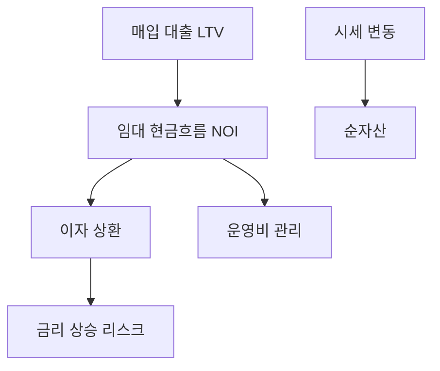
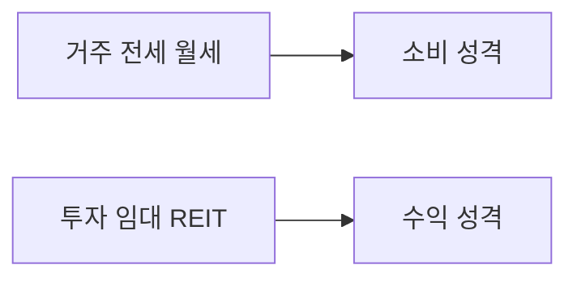
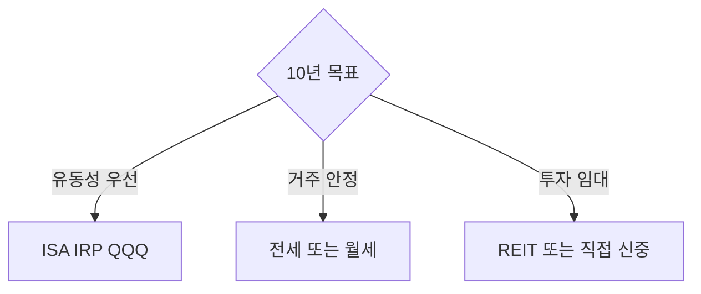
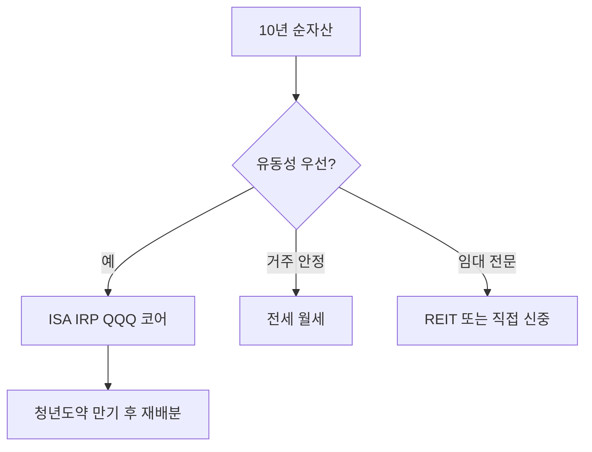

# 부동산 투자 기초

> **면책**: 본 문서는 교육 목적이며, 특정 개인·법인에 대한 투자·세무·법률 자문이 아닙니다.

## 메타

| 항목 | 내용 |
|------|------|
| 최종 검증일 | 2026-05-24 |
| 난이도 | L3 (Deep) — [READER-GUIDE](../docs/READER-GUIDE.md) |
| 예상 읽기 시간 | 40~50분 |
| 관련 bucket | 주식·연금과 **별도** — 거주 vs 투자 구분 |

## 0. 이 편 읽기 전 (5분)

| 항목 | 내용 |
|------|------|
| **난이도** | L3 (Deep) — [READER-GUIDE §L등급](../docs/READER-GUIDE.md) |
| **선수** | 없음 |
| **이번 편에서 쓰는 기호** | 본문 §4·§4a 표 참고 |
| **복습 한 줄** | — |

## TL;DR

1. **부동산** = **거주(소비)** vs **투자**(임대·시세) — 목적이 다르면 회계·세금도 다름.
2. **레버리지**(대출)·**유동성 낮음**·거래비용·**양도세·종부세**.
3. **전세·월세** — 현금흐름·[debt](../01-foundations/debt-and-interest.md).
4. 주식 포트(**ISA·IRP·QQQ**)와 **상관·비중** 별도 설계.
5. 10년 자산 목표에 **부동산 필수 아님** — 청년 정책·주식과 **트레이드오프**.

## 1. 한 줄 정의 + 왜 중요한가

!!! info "REIT (Real Estate Investment Trust)"
    부동산투자신탁. 부동산 수익을 배분하는 증권.

**정의**: **부동산 투자**는 임대수익·자본이득(시세 차익)을 목적으로 부동산·**REIT** 등에 자본을 배치하는 것입니다. **거주**는 소비에 가깝습니다.

**이것이 중요한 이유**: 한국에서 부동산은 재산의 큰 비중을 차지하는 경우가 많습니다. “집 사야 성공”이라는 서사와 장기 주식·연금 목표가 충돌할 수 있습니다. **쉽게 말하면:** 대출 레버리지를 이해하지 못하면 금리 상승 시 이자 부담으로 전체 재무 계획이 흔들립니다. 부동산 투자는 거주 목적과 투자 목적을 분리해 판단해야 하며, 거주용 집은 소비에 가깝고 투자용 부동산은 현금흐름(임대수익)과 자본이득의 합으로 평가해야 합니다.

## 2. 선수 / 이후

**선수**: [cash-flow-basics.md](../01-foundations/cash-flow-basics.md), [macroeconomics-basics.md](../02-economics/macroeconomics-basics.md), [debt-and-interest.md](../01-foundations/debt-and-interest.md)  
**이후**: REIT ETF 심화, 지역별 규제(별도 문서)

## 3. 직관·비유

**핵심은:** 부동산 투자는 "월세(임대수익)와 가격 상승(자본이득)이라는 두 가지 수익원을 가지지만, 유동성이 낮고 레버리지(대출)를 많이 쓰는 특수한 자산"입니다.

**비유 1 — 부동산은 무거운 가구, 주식은 바퀴 달린 서랍**
쉽게 말하면: 부동산은 한번 사면 팔기 어렵고(유동성 낮음), 거래 비용이 큽니다(취득세, 중개수수료, 양도세). 반면 ETF는 거래소에서 실시간으로 사고팔 수 있습니다. 이 유동성 차이가 부동산 리스크의 핵심입니다.

**비유 2 — 대출 레버리지: 빌린 힘으로 키우기**
내 돈 W3억으로 W10억짜리 아파트를 살 때 W7억을 대출받는다면, 레버리지 비율이 3.3배입니다. 아파트 가격이 10% 오르면 내 자본(W3억) 기준 수익률은 33%가 됩니다. 반대로 10% 내리면 내 자본의 33%가 사라집니다. 이것이 LTV 레버리지의 양날입니다.

**비유 3 — 전세는 "이자 없는 보증금 대출"**
임차인이 목돈(전세금)을 집주인에게 맡기고 임대료 없이 거주하는 한국 고유 제도입니다. 집주인 입장에서는 무이자 자금을 조달하는 것과 같고, 임차인 입장에서는 집값 상승을 따라가지 못하는 리스크가 있습니다.

**비유 4 — Cap Rate는 부동산의 수익률**
Cap Rate(자본화율) = NOI(순영업이익) / 부동산 가격. 은행 이자율이 4%인데 Cap Rate가 3%라면, 임대수익만으로는 은행 이자보다 못한 상황입니다. 이를 이 이론의 한계와 연결하면: 가격 상승 기대가 낮을 때 Cap Rate가 낮은 부동산은 저평가가 아니라 위험 신호일 수 있습니다.

**비유 5 — 실물자산의 인플레이션 헤지**
부동산은 실물 자산이므로 인플레이션 시 가격이 오르는 경향이 있습니다. 물가가 오르면 건설 비용도 오르고, 임대료도 오르면서 부동산 가치가 유지됩니다. 이것이 많은 사람들이 "인플레이션 헤지"로 부동산을 선호하는 이유입니다.

**이 이론의 한계는 다음과 같습니다:** 부동산은 유동성이 낮아 급히 팔아야 할 때 제값을 못 받을 수 있습니다. 또한 정부 규제(종합부동산세, 임대차 3법, LTV 규제)가 수익성에 직접 영향을 미칩니다. 레버리지를 크게 쓸 경우 금리 상승 시 이자 부담이 급격히 커집니다.

## 4. 정식 용어

| 용어 | English | 정의 |
|------|------|----------------|
| NOI | Net Operating Income | 임대수익−운영비 |
| 캡레이트 | Cap rate | NOI/가격 |
| LTV | Loan-to-Value | 대출/담보가치 |
| REIT | Real Estate Investment Trust | 상장 부동산 신탁 |
| 전세 | Jeonse | 보증금 거주 |
| 양도소득세 | CGT on property | 매도 차익 과세 |
| 종부세 | Comprehensive real estate tax | 보유 세금 |

### 4a. 핵심 용어 (본문 등장 순)

> 복습용. 정의는 §4 본표·[glossary](../00-roadmap/glossary.md)·본문 `!!! info` 박스.

| 용어 | 한 줄 | 관련 이론 | glossary |
|------|------|------|----------------|
| NOI | 임대수익−운영비 | §4 | [glossary](../00-roadmap/glossary.md#noi) |
| 캡레이트 | NOI/가격 | §4 | [glossary](../00-roadmap/glossary.md#캡레이트) |
| LTV | 대출/담보가치 | §4 | [glossary](../00-roadmap/glossary.md#ltv) |
| REIT | 상장 부동산 신탁 | §4 | [glossary](../00-roadmap/glossary.md#reit) |
| 전세 | 보증금 거주 | §4 | [glossary](../00-roadmap/glossary.md#전세) |
| 양도소득세 | 매도 차익 과세 | §4 | [glossary](../00-roadmap/glossary.md#양도소득세) |
| 종부세 | 보유 세금 | §4 | [glossary](../00-roadmap/glossary.md#종부세) |

## 5. 메커니즘

## 6. 수식·모델

| 기호 | 이름 | 이 식에서 의미 |
|------|------|----------------|
| **r** | 할인율·수익률 | 기간당 이자·요구수익률 |
| **n** | 기간 | 연·월 등 복리·할인에 쓰는 횟수 |
| **PV** | 현재가치 | 오늘 시점으로 환산한 금액 |
| **FV** | 미래가치 | 미래 시점의 목표·결과 금액 |

\[
\text{Cap rate} = \frac{\text{NOI}}{\text{가격}}
\]

**식 (기호)**: **Cap** **rate** = (**NOI**) / (가격)

**식 (기호)**: **Cap** **rate** = (**NOI**) / (가격)

**식 (기호)**: **Cap** **rate** = (**NOI**) / (가격)

**읽는 법**: **Cap**와 **NOI**의 관계를 위 식으로 쓴다. 경제·재무 해석은 변수표 「이 식에서 의미」와 [DEPTH-STANDARD](../docs/DEPTH-STANDARD.md) 기호 예제를 맞춘다.
| 기호 | 이름 | 이 식에서 의미 |
|------|------|----------------|
| **r** | 할인율·수익률 | 기간당 이자·요구수익률 |
| **n** | 기간 | 연·월 등 복리·할인에 쓰는 횟수 |
| **PV** | 현재가치 | 오늘 시점으로 환산한 금액 |

\[
\text{LTV} = \frac{\text{대출잔액}}{\text{담보가치}}
\]

**식 (기호)**: **LTV** = (대출잔액) / (담보가치)

**식 (기호)**: **LTV** = (대출잔액) / (담보가치)

**식 (기호)**: **LTV** = (대출잔액) / (담보가치)

**읽는 법**: **r**와 **n**의 관계를 위 식으로 쓴다. 경제·재무 해석은 변수표 「이 식에서 의미」와 [DEPTH-STANDARD](../docs/DEPTH-STANDARD.md) 기호 예제를 맞춘다.
**현금흐름**(단순):

| 기호 | 이름 | 이 식에서 의미 |
|------|------|----------------|
| **r** | 할인율·수익률 | 기간당 이자·요구수익률 |
| **n** | 기간 | 연·월 등 복리·할인에 쓰는 횟수 |
| **PV** | 현재가치 | 오늘 시점으로 환산한 금액 |

\[
CF = \text{임대료} - \text{이자} - \text{운영비} - \text{원금상환}
\]

**식 (기호)**: **CF** = 임대료 - 이자 - 운영비 - 원금상환

**식 (기호)**: **CF** = 임대료 - 이자 - 운영비 - 원금상환

**식 (기호)**: **CF** = 임대료 - 이자 - 운영비 - 원금상환

**읽는 법**: **r**와 **n**의 관계를 위 식으로 쓴다. 경제·재무 해석은 변수표 「이 식에서 의미」와 [DEPTH-STANDARD](../docs/DEPTH-STANDARD.md) 기호 예제를 맞춘다.---

ocs/DEPTH-STANDARD.md) 기호 예제를 맞춘다.---

## 7. 한국 적용

### 7.1 2025~2026

| 항목 | 내용 |
|------|------|
| 양도소득세 | **거주·보유 기간**·주택 수 |
| 취득세 | 매입 시 |
| 종부세 | 고액 **보유** |
| 전세 | 보증금 **채권**·[debt](../01-foundations/debt-and-interest.md) |
| REIT ETF | **주식 계좌·ISA** — 상품별 |

### 7.2 주식·정책과 관계

| | 부동산 | 주식·ISA·IRP |
|------|------|----------------|
| 유동성 | 낮음 | 상대적 높음 |
| 청년도약 | **무관** | 별도 |
| DB QQQ | 무관 | IRP·ISA |

### 7.3 2025 vs 2026 (거시)

| 요인 | 부동산 | 주식 포트 |
|------|------|----------------|
| 금리↑ | **대출 부담** | 채권·성장주 변동 |
| 전세가 | 보증금 **규모** | 현금흐름 |
| REIT | **금리 민감** | ISA 편입 검토 |

### 7.4 의사결정 (교육)

### 7.5 전세·월세·대출 — 현금흐름 연결

| 선택 | 현금흐름 | 주식 포트와 충돌 |
|------|------|----------------|
| 전세 | 보증금 **일시 유출** | DCA **축소** 위험 |
| 월세 | 매월 **고정 지출** | 비상금 Bucket 0 우선 |
| 매수+LTV | 이자·원금 | **레버리지** — 금리 shock |
| REIT ETF | **소액**·유동 | ISA·IRP 편입 검토 |

### 7.6 10년 목표 — 부동산 vs 주식·연금 (교육)

| | 주식·ISA·IRP | 직접 부동산 |
|------|------|----------------|
| 최소 금액 | 낮음 | 높음 |
| 유동성 | 상대 높음 | **낮음** |
| 레버리지 | QLD 등 **비권장** | **LTV** |
| 세금 문서 | tax 시리즈 | 본 문서·전문가 |

**법·정책 근거**: 소득세법(양도·보유), 지방세(취득·종부), 주택법·전세 관련 규정 — **개요만**.

### 7.7 REIT·부동산 ETF — 주식 포트 연동

| 상품 | 특징 | 세금·계좌 |
|------|------|----------------|
| 상장 REIT ETF | 유동성·소액 | 국내주식·ISA 규칙 |
| 미국 REIT ETF | 배당·양도 | Part1·2 |
| 직접 임대 | LTV·관리 | 양도·보유세 |

**10억 목표**를 부동산 **직접**만으로 맞추려면 LTV·금리·공실 리스크가 큽니다. [asset-allocation.md](../04-portfolio/asset-allocation.md)에서 **주식·연금·REIT** 비중을 함께 설계하세요.

## 8. 숫자 예제 (가상)

> 가상 인물·금액.

> 가상 인물·금액.

### 예제 1: 전세 vs 매수 (가상)

| | 가상 AH (전세) |
|--|----------------|
| 보증금 | **F**(가상) |
| 주식 ISA | 월 80만 DCA |
| **유동성** | 높음 |

| | 가상 AI (매수) |
|--|----------------|
| 대출 LTV 70% | 금리 4% |
| 월 이자(가상) | **M** |
| **주식 DCA** | 축소 |

### 예제 2: REIT vs 직접 (가상)

| | REIT ETF | 직접 임대 |
|------|------|----------------|
| 최소 금액 | 낮음 | 높음 |
| 레버리지 | 펀드 구조 | **본인 LTV** |
| 유동성 | **장중 매도** | 매도 어려움 |

### 예제 3: 금리 shock (가상)

| | 가상 AJ |
|--|---------|
| 금리 +2%p | 월 상환 +**M** |
| 임대료 고정 | CF **악화** |

## 9. FAQ

**Q1. 20대에 집을 사야 하나요?**  
A1. 필수는 아닙니다. 부동산 구매 전에 비상금, 연금(IRP·DC), ISA 투자 등 다른 재무 목표를 먼저 점검하세요. 주거비 부담이 적은 시기에 장기 투자를 시작하는 것이 복리 효과를 크게 키울 수 있습니다. 다만 부동산이 본인의 장기 자산 배분에서 합리적인 비중을 차지한다면 구매를 검토할 수 있습니다.

**Q2. 리츠 ETF와 직접 부동산 투자 중 무엇이 나은가요?**  
A2. 목적에 따라 다릅니다. 직접 부동산은 레버리지 활용이 가능하고 실거주 겸용이 가능하지만 유동성이 낮고 관리 부담이 있습니다. 리츠 ETF는 소액 투자, 높은 유동성, 분산 투자가 가능하지만 금리에 민감하고 직접 레버리지를 활용하기 어렵습니다.

**Q3. 부동산과 주식을 어떻게 나눠야 하나요?**  
A3. 부동산(실거주 포함)이 자산에서 너무 큰 비중을 차지하면 포트폴리오 다각화가 어려워집니다. 주식·채권 ETF와 별도의 버킷으로 관리하되, 부동산 대출(LTV)을 포함한 총 레버리지 위험도 함께 고려해야 합니다.

**Q4. 청년도약계좌와 부동산 투자는 연관이 있나요?**  
A4. 청년도약계좌는 적금형 정책 금융 상품으로 부동산 직접 투자와는 무관합니다. 단, 목돈 마련 후 전세 보증금이나 주택 구매 자금으로 활용할 수 있습니다. 주거비 절감을 위한 단계적 계획에서 활용 가능합니다.

**Q5. ISA 계좌에서 리츠 ETF를 살 수 있나요?**  
A5. 상품에 따라 다릅니다. 국내 상장 리츠 ETF는 일반적으로 ISA에서 매수 가능합니다. 해외 리츠 ETF는 중개형 ISA에서 매수 가능한 경우가 있으므로 가입한 증권사의 ISA 상품 목록을 확인하세요.

**Q6. 전세는 투자인가요 거주 소비인가요?**  
A6. 전세는 거주 목적의 소비에 더 가깝습니다. 전세금을 집주인에게 무이자로 빌려주는 것이므로 전세금 이자 기회비용을 고려하면 월세와 비교하여 반드시 유리하지는 않습니다. 전세금이 집값 대비 높아질수록 리스크(역전세, 보증금 미반환)가 커집니다.

**Q7. AI·전력 인프라 섹터 투자와 부동산은 어떤 관계인가요?**  
A7. AI·전력 인프라 투자는 주식 시장에서 관련 기업 ETF나 개별 종목을 통해 접근합니다. 부동산 측면에서는 데이터센터 리츠가 AI 인프라 투자와 연결됩니다. 자세한 내용은 [power-grid](../03-markets/sectors/power-grid-electrification.md)를 참고하세요.

**Q8. 자산 목표를 부동산으로 달성할 수 있나요?**  
A8. 부동산은 장기 자산 형성의 한 수단이지만, 유일한 수단은 아닙니다. 레버리지 효과로 단기간에 큰 자산을 만들 수 있지만, 금리 상승·유동성 위기·정책 변화에 취약합니다. 주식 장기 투자와 병행하는 분산 전략이 리스크를 줄입니다.

## 10. 함정·리스크·한계

- **거주=투자** 착각  
- **금리·LTV** 무시  
- **전세·보증금** 리스크  
- **유동성** 과소평가  
- **세법** 개정

---

**Q. 실무에서는?**  
교과서 식·기호를 그대로 적용하기 전에 **수수료·세금·데이터 시점**을 분리한다. 숫자는 [DEPTH-STANDARD](../docs/DEPTH-STANDARD.md)처럼 기호만 먼저 맞추고, 법령·시장 수치는 §8 표·외부 출처로 갱신한다.

## L3 보충 — 장기 자산 형성 연결

본 절은 [DEPTH-STANDARD.md](../../docs/DEPTH-STANDARD.md) L3 게이트를 충족하기 위한 **실행·교차 링크** 보충입니다.

### Bucket·현금흐름 연결

| Bucket | 대표 제도·자산 | 본 문서와의 관계 |
|------|------|----------------|
| 0 | 비상금 MMDA | 세금·투자 **전** 우선 |
| 1 | [청년도약](../06-korea-policy/youth-leap-account.md)·[미래적금](../06-korea-policy/youth-future-savings.md) | 정책 적금 — 주식 **대체 아님** |
| 2a | DB·DC | [db-vs-dc-pension.md](../06-korea-policy/db-vs-dc-pension.md) |
| 2b | ISA·IRP | [isa.md](../06-korea-policy/isa.md)·[isa-irp-pension-tax.md](../06-korea-policy/tax/isa-irp-pension-tax.md) |
| 3 | QQQ·채권 코어 | [capm-and-risk-return.md](../08-advanced/capm-and-risk-return.md) |
| 4 | NXT·코스닥·QLD | [fomo-and-trading-hours.md](../05-behavioral/fomo-and-trading-hours.md) |

### 연간 점검 루틴 (교육)

| 분기 | 할 일 |
|------|--------|
| Q1 | [investment-tax-overview.md](../06-korea-policy/tax/investment-tax-overview.md) 캘린더 확인 |
| Q2 | [rebalancing-and-dca.md](../04-portfolio/rebalancing-and-dca.md) 코어 비중 |
| Q3 | 해외 배당·금융소득 **누적** — Part2 |
| Q4 | 익년 **5월** 양도세 자료 정리 — Part1 |
| ISA | 개설일 +36개월 **만기** 알림 |

### 2025 vs 2026 정책 추적

| 항목 | 확인 출처 |
|------|-----------|
| ISA 한도·비과세 | 금융위·조세특례 시행일 |
| DC +300만 공제 | 국세청·통합연금포털 |
| 청년도약 일몰·미래적금 | [kinfa](https://ylaccount.kinfa.or.kr) |
| 금융투자소득세 | 금융위 보도·[sources.md](../../references/sources.md) |
| NXT 종목·거래중단 | [nextrade.co.kr](https://www.nextrade.co.kr) |

**면책 재확인**: 가상 예제·보도 수치는 **시점별 개정**됩니다. 실행·신고 전 공식 출처를 확인하세요.

## 11. 심화 읽기

- [asset-allocation.md](../04-portfolio/asset-allocation.md)  
- [time-horizon-and-buckets.md](../04-portfolio/time-horizon-and-buckets.md)

## 12. 퀴즈

1. REIT 장점 한 가지?  
2. 전세 vs 투자 매입?  
3. 금리↑ LTV 보유자?  
4. 청년도약과?  
5. Cap rate 식?

힌트
1. 유동성 2. 거주 vs 수익 3. 이자 부담 4. 무관 5. NOI/가격
