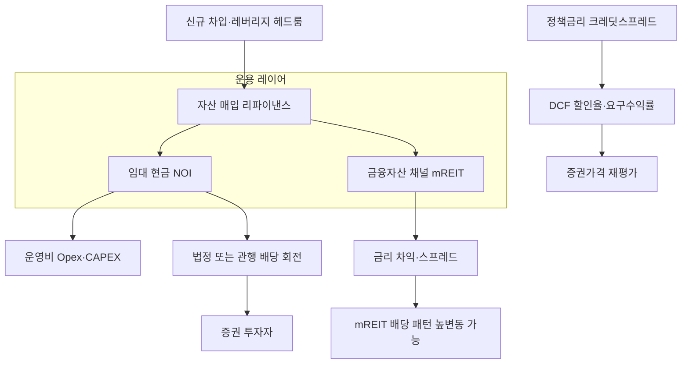
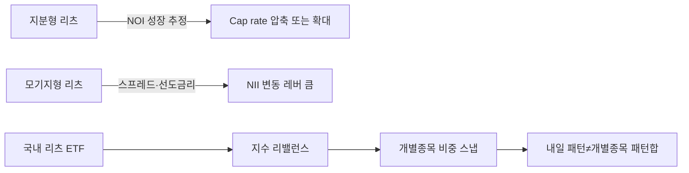
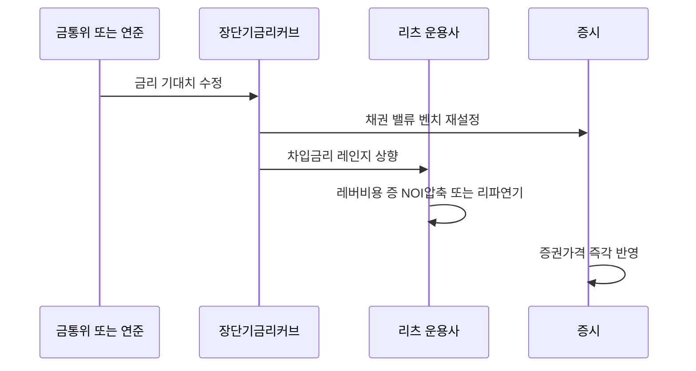
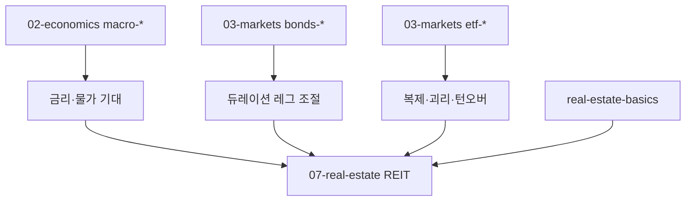

# 리츠(REIT) 심화: 구조·배당·금리민감도·국내 리츠 ETF

> **면책**: 본 문서는 교육 목적이며, 특정 개인·법인에 대한 투자·세무·법률 자문이 아닙니다. 제도·세율·상품 명칭·지수 편입·추적오차 등은 변경될 수 있으므로 매매·신고 실행 전 증권사 약관·금융투자협회·거래소·국세청 공식 안내와 최근 공시를 확인하세요. 본문의 회사명·종목 코드·금액·수익률은 설명력을 높이기 위한 **가상 교육용 예시**입니다.

## 메타

| 항목 | 내용 |
|------|------|
| 최종 검증일 | 2026-05-25 |
| 정책·법령 기준일 | 2026-05-25 (개별 조세·신탁 규제는 시행 일자별로 상이함) |
| 난이도 | L4 (Graduate) — [READER-GUIDE](../docs/READER-GUIDE.md) |
| 예상 읽기 시간 | 48~62분 |
| 관련 bucket | 위성(Core–Satellite) 또는 대체(Alternatives)·부동산 **간접** 노출 |

## 0. 이 편 읽기 전 (5분)

| 항목 | 내용 |
|------|------|
| **난이도** | L4 (Graduate) — [READER-GUIDE §L등급](../docs/READER-GUIDE.md) |
| **선수** | [real-estate-basics](real-estate-basics.md), [cash-flow-basics](../01-foundations/cash-flow-basics.md) |
| **이번 편에서 쓰는 기호** | 본문 §4·§4a 표 참고 |
| **복습 한 줄** | L3 선수 편을 먼저 읽으면 수식이 수월함 |

## TL;DR

1. **리츠(REIT)** 는 **부동산·부동산 관련 자산**을 집합투자하도록 설계된 **직접 거주 분리 가능한 간접 투자 채널**이며, 상장이라도 **변동성·금리민감·세목**은 주식 단순 종목과 다를 수 있습니다.
2. 많은 형태에서 **운용현금배당(또는 이에 준하는 배당)·배당의무**(관할별 상이)**를 전제로** 수익 투자자 기대치가 형성되며,
   **금리 및 신용환경 변화가 할인율과 자본조달비용을 동시에 흔드는 구조적 이중 채널**을 이해해야 합니다.
3. **금리 민감도(Intuition)** 는 “채권처럼 만기가 있는 증권이 아니라도, 현금흐름 할인값이 금리·리스프레드 움직임에 따라 변한다”는 **유효 듀레이션** 관점으로 읽습니다(정밀 매칭에는 한계).
4. **국내 리츠 ETF**(가칭 교육용: “리츠지수추종·TOP10·종합테마” 형태 등)는 **지수 방법론·괴리·배당캘린더·종목별 비중 한도·거래 규모**가 성과 패턴을 좌우하므로, “부동산 = 리츠 ETF” 라는 과단순 매핑을 피해야 합니다.
5. 학습 목표는 **수익률 예언**이 아니라 **[real-estate-basics.md](real-estate-basics.md)·[bonds](../03-markets/bonds-fixed-income.md)·[macro](../02-economics/macro-02-money-inflation.md)·ETF 규격** 간 **개념 정합성**과 **포지션 상한 규칙**을 세우는 것입니다.

---

## 1. 한 줄 정의 + 왜 중요한가
!!! info "REIT (Real Estate Investment Trust)"
    부동산 수익증권.

**정의**: **리츠(Real Estate Investment Trust)**는 (관할별로 명칭·형태가 다르지만) 원칙적으로 **부동산·임대 현금흐름 또는 부동산 관련 채권**(모기지류 등) 기반 포트폴리오를 **합성·운용하고**, 투자자에게 **양도 가능한 증권**(상장 포함) 형태로 **소액 분할 소유 구조를 제공하는 집합투자**입니다.

**왜 중요한가** (장기 자산 형성·bucket 연결):

- **직거주·직접 임대**(물리 거주 또는 개인 간 임차)와 **상호 배타적 선택지가 아니라**, 같은 “부동산 틸트” 우려를 다른 **중개비·유동성·세목** 패키지로 받을 수 있습니다. [실거래·종부세·양도 문제는 real-estate-basics](real-estate-basics.md)에서 다룹니다.
- 리츠 증권 가격은 **시장 금리·크레딧 스프레드·임대 현금흐름 성장 추정**(NOI)·**추정 자본화율**(Cap rate 시장)·**추정 할인현금흐름(DCF) 밸류**가 동시에 반영되어, **금리 순환**(연준·금통위·예대금리 채널)과 **내재 상관관계** 논의에 자주 등장합니다. 관련 거시 채널은 [통화·인플레이션](../02-economics/macro-02-money-inflation.md)과 [통화정책·QE](../02-economics/macro-04-monetary-policy-qe.md) 문서를 함께 읽습니다(본 문서에서는 수식 직관에 집중).

!!! info "ETF"
    지수·자산 **바구니**를 한 종목처럼 거래

- 세번째로, 포트폴리오에서는 **직접 부동산**과 다른 **변동·특성·배당캘린더**를 갖추었는지 검토해야 합니다. 따라서 코어 채권의 **듀레이션**([bonds-fixed-income-deep](../03-markets/bonds-fixed-income-deep.md)), 코어 ETF의 추적 규격([etf-index-funds-deep](../03-markets/etf-index-funds-deep.md)), **그리고** 리츠 **위성** 한도 규칙을 동일한 장표에 놓습니다.

---

## 2. 선수 지식 / 이후 읽을 것

**선수**:

- [real-estate-basics.md](real-estate-basics.md) — 직거주 vs 투자, NOI·Cap rate 표기 레벨, 레버리지 직관
- [cash-flow-basics](../01-foundations/cash-flow-basics.md), [macroeconomics-basics](../02-economics/macroeconomics-basics.md)
- [bonds-fixed-income](../03-markets/bonds-fixed-income.md) 및 [bonds-fixed-income-deep](../03-markets/bonds-fixed-income-deep.md) — 이자민감·듀레이션·금리 순환 매핑
- [etf-index-funds](../03-markets/etf-index-funds.md) — NAV·괴리·복제 방법

**이후**:

- [alternatives-reits-commodities](../03-markets/alternatives-reits-commodities.md) — 대체 자산 패키지에서 리츠 **베타·상관 한도**
- [asset-allocation](../04-portfolio/asset-allocation.md), [risk-management-portfolio](../04-portfolio/risk-management-portfolio.md)
- 참고 레퍼런스 디렉터리: [sources.md](../../references/sources.md)

---

## 3. 직관·비유

리츠는 **“커피 업체 로열티를 모아 패키지로 판 채권에 가까운 종이” PLUS “내일 가격이 내일 임대료만으로 안 정해진다는 주식 속성”**의 합입니다. 체인 매장 같은 **앵커 임차인이 줄면** NOI가 줄고 내일의 추정 현금배당이 줄어든다면, 순수 고정coupon 채권과 달리 **현금흐름 다운사이즈** 채널이 열립니다. 반대로 명목금리 급등이 현금배당을 당장 못 줄여도 할인율이 올라가서 **증권 가격**은 깎일 수 있습니다. 이 때문에 “배당이 나오니 방어적인 채권”이라고 **과도하게 단축 귀결**하면 오판이 발생합니다.

두 번째 비유: **건축 크레인**처럼, 리츠는 **대형 자산 교체**(리파이낸스·건설·CAPEX)·**합병** 이벤트가 이자커브·건설금리 스프레드에 걸린 **사업 경영 사이클**을 드러냅니다. 교육용으로 크레인이 **더 자주 분수를 바꿔**(자산 순환)·**더 크게 깔고**(외생적 레버)·**더 오래**(개발 기간)·**허가리스크**까지 있으므로, 주식처럼 “EPS 분기 놀림” 하나로 전부 설명 안 됩니다.

세 번째: **방수 레이어**. ETF로 리츠에 들어간다면, 투명한 방수 레이어 3중 — (1)**지수 제공자 방법론** (Free-float? 부채·개발 노출 포함?) → (2)**ETF 포트 증량·복제**(실물복제 불가 현실) → (3)**거래 시간·통화 헤지** — 순으로 누수가 발생할 수 있습니다. 위 계층을 인지해야 “왜 채권 ETF와 패턴 다르지?” 질문에 학술 레벨로 답변합니다.

---

## 4. 정식 개념·용어

| 용어 | 한글 표기 흔히 쓰이는 이름 | English | 정의 |
|------|----------------------------|---------|------|
| REIT | 부동산투자회사 또는 유사 명칭(관할에 따름) | Real Estate Investment Trust | 부동산·임대 또는 모기지 기반 현금흐름 패키지를 증권형태로 제공 |
| Equity REIT | 지분형 리츠 | Equity REIT | **임대·운영**(상업·물류 등) 현금 중심, 자산 밸류·Cap rate 채널 민감 |
| mREIT · Mortgage REIT | 모기지·대출 채널 리츠 | Mortgage REIT | **부동산 담보대출·MBS 채널**(레버 많은 유형 존재) — 금리·스프레드 **고민감** |
| AFFO · FFO | 조정운용자금 또는 운용 현금 근사 | Adjusted Funds From Operations · FFO | 감가·비현금항목 조정한 **운용 현금 근사**를 분모로 배당가능현금 논의(회계기준 따라 상이) |
| Cap rate | 자본환수율(시장) | Capitalization Rate | \\( \\mathrm{Cap} = \\mathrm{NOI}/V \\) 또는 시장 균형 \\(y\\approx g+\\mathrm{spread}\\) 근처에서 해석 가능 |
| NAV | 순자산가치 평가 | Net Asset Value | 보유 건물·금융자산 재평가·부채 반영 순가치 추정 후 발행단위 또는 주당 귀속 |
| 괴리 | ETF 시장가 vs NAV 차이 | Premium / Discount | [etf 문서 규격 참조](../03-markets/etf-index-funds-deep.md) |
| 유효듀레이션(직관) | — | Equity REIT empirical duration 추정 분위 | 금리 100bp 움직일 때 주가(or ETF) 평균 반응 **회귀로 추정**(시기·표본 따라 변동 크다는 한계 포함) |

### 4a. 핵심 용어 (본문 등장 순)

> 복습용. 정의는 §4 본표·[glossary](../00-roadmap/glossary.md)·본문 `!!! info` 박스.

| 용어 | 한 줄 | 관련 이론 | glossary |
|------|-------|-----------|----------|
| REIT | 부동산투자회사 또는 유사 명칭 | §4 | [glossary](../00-roadmap/glossary.md#reit) |
| Equity REIT | 지분형 리츠 | §4 | [glossary](../00-roadmap/glossary.md#equity-reit) |
| mREIT · Mortgage REIT | 모기지·대출 채널 리츠 | §4 | [glossary](../00-roadmap/glossary.md#mreit-·-mortgage-reit) |
| AFFO · FFO | 조정운용자금 또는 운용 현금 근사 | §4 | [glossary](../00-roadmap/glossary.md#affo-·-ffo) |
| Cap rate | 자본환수율 | §4 | [glossary](../00-roadmap/glossary.md#cap-rate) |
| NAV | 순자산가치 평가 | §4 | [glossary](../00-roadmap/glossary.md#nav) |
| 괴리 | ETF 시장가 vs NAV 차이 | §4 | [glossary](../00-roadmap/glossary.md#괴리) |
| 유효듀레이션(직관) | 금리 100bp 움직일 때 주가(or ETF) 평균 반응 **회귀로 추정**(시기·표본 | §4 | [glossary](../00-roadmap/glossary.md#유효듀레이션) |

---

## 5. 메커니즘

**(본문 설명)**

- **블록 도식 1**은 직물 **현금흐름**과 **DCF 할인 채널**이 교차함을 표시했습니다.
- **도식 2**는 종목 간 **상이한 민감 매트릭스**가 ETF에서는 **평균화**된다는 교육용 메시지를 담습니다.
- **시퀀스** 도식은 “운용사 회계 일정 보다 빠르게 시장 반응”할 수 있는 **전방경기 국면**에서 자주 회자되는 패턴입니다(과거 데이터로 확정 명제화 금지 — L4는 직관).

---

## 6. 수식·모델

### 6.1 캡레이트 $\\mathrm{Cap}$

표준 교과서 근처 정의로, 순영업소득을 가치로 나눈 비율입니다.

\
| 기호 | 이름 | 이 식에서 의미 |
|------|------|----------------|

| 기호 | 이름 | 이 식에서 의미 |
|------|------|----------------|
| \(Cap\) | Cap | §4·본문 정의 참고 |
| \(NOI\) | NOI | §4·본문 정의 참고 |
| \(V\) | V | §4·본문 정의 참고 |

\[
\\mathrm{Cap}\\;=\\;\\frac{\\mathrm{NOI}}{V}
\\]

여기서 $V$는 **거래 또는 평가가치**(동일 회계 블록에서 일관 선택). 변형으로 **종가 또는 시사가**를 분모로 넣되, 시장 교란 때 괴리 주의합니다.

근사 직관(성장 포함 단순화): 요구임대수익률 $\\mathrm{required\\_yield}$ 과 영구근사 성장 $g$ 를 쓸 때

\\[
V \\;=\\; \\frac{\\mathrm{NOI}_1}{\\mathrm{required\\_yield}-g}\\quad(\\mathrm{요구}\\!-\\! g>0)
\\]

따라서 **금리 상승**이 $\\mathrm{required\\_yield}$로 전이되면, $g$ 즉시 못 따라잡을 때 $\\downarrow V$ 패턴 직관이 생깁니다.

### 6.2 리츠·부동산 밸류의 $\\mathrm{NAV}$ 골격(교과서형 단순화)

평가기준 통일 교육 목적:

\\[
\\mathrm{NAV}_{\\mathrm{portfolio}} \\;=\\; \\sum_j V_j(\\mathrm{건자산}_j)\\;-\\;\\mathrm{금융\\_순부채}\\;-\\;(기타 순부채)
\\]

단위증권(또는 주당) 귀속은

\\[
\\mathrm{NAV}_{\\mathrm{per\\_share}} \\;=\\; \\frac{\\mathrm{NAV}_{\\mathrm{portfolio}}}{N_{\\mathrm{units}}}
\\]

실무 논점: **건자산**은 시가·DCF·판매근거 불일치 가능, 장외 데이터라 **스튜던트 교육**과 **직접 거래 레벨**(아파트 시세 크롤) 직렬 비교 불가입니다.

### 6.3 “듀레이션 인튜이션”— 왜 채권 듀레이션을 그대로 못 포팅할까?

채권 **Macaulay / Modified Duration**은 고정coupon·만기 패턴 명확 증권에 정립되었습니다. 지분 리츠는 **가변 NOI·외생적 Cap rate 재평가**가 있어, 본 교육문서에서는 **회귀로 추정한 유효 민감도**(예: 무위험이자율 또는 텐저 변동에 대한 자산 회귀계수 근처) 또는 **금리변동 Scenario P\\&L**을 **두레이션 은유**로만 사용합니다:

\\[
\\frac{\\partial P}{P}\\;\\approx\\;-D_{\\mathrm{eff}}\\,\\partial r\\,+\\;(NOI 성장항)\\,+\\;(\\mathrm{스프레드}\\,\\mathrm{항})
\\]

따라서 $D_{\\mathrm{eff}}$는 **양수로 커 보이던 시기**(금리금융패닉)·**음수로 회귀로 나오던 장세**(금리내리며 성장 레이블)·**등 실증적으로 덜 안정적**입니다. 교육용 결론: **금리 헤직을 리츠 증분으로 간접 처리하지 말 것** ([bond 깊음](../03-markets/bonds-fixed-income-deep.md) 채널에서 듀레이션 조절 우선 고려라는 순서 규칙).

### 6.4 해당 없음 명시 블록

이 문서에서는 **복리 레버 ETF 일중 리셋**과 같은 순수 장내파생 교육은 다룹니다([leveraged ETF](../04-portfolio/leveraged-etf-qqq-qld.md)). 리츠는 직접적으로 동일 레버 구조 묶음이 아닙니다 — **별도 과목**.

---

## 7. 한국 적용

### 7.1 2026년 교육용 체크리스트 (확정이라고 단언하지 않음 — 본 문서 작성일 기준)

| 항목 | 개인 교육 점검 포인트 | 비고 |
|------|------------------------|------|
| 상품 유형 | **상장 펀드(ETF/ETN)·상장 종목 형태별** 과세 차이 존재 — 약관·세목 세부별로 구분 필요 | 과세 규칙은 상품 구조 따라 상이할 수 있습니다 |
| 배당 과세 레이아웃 | **국내외 소스·통화 헤지·원천 레이어**가 다층이라 일괄 문장 귀결 회피 | [investment-tax-overview](../06-korea-policy/tax/investment-tax-overview.md) 병행 |
| 레버리지 | 일부 종목 레버 패키지·부채비중 공시 따라 **변동 패턴 초과** 가능 | 종목 공시 페이지 주기적 확인 교육 |
| 유동성 | 일부 종목 또는 ETF **매매대금 매우 적은 구간 존재** — 슬리피지 교육 | [market microstructure 필요시](../03-markets/market-microstructure.md) |

### 7.2 2027 이후 또는 개편이 알려졌으나 교육용으로 명시 회피

| 항목 | 2026 인지 상태 | 교육용 메모 |
|------|-----------------|-------------|
| 금융투자소득세 체계 | 지역별 시행 속도 차이 존재 | 본 교육문서에서는 **예시 금액 산술 교육**만 |
| 신탁·리츠 법 규 라벨 | 한국 명칭·규격은 해외 명칭 직렬 비교 위해 **증권정의서** 참조해야 함 | 교과서 레이블 과대 일반화 회피 |

**법·정책 근거(교육용 안내)** : 소득세법·조세특례제한법 관련 규정, 금융투자업규정, 금융위원회·금융투자협회 보도·유의사항 및 거래소 시장설명 자료 등 — 신고·매매 실행 전 **항상 최근 개정·공식 Q&A**를 확인하세요.

---

## 8. 숫자 예제 (가상)

> 모든 금리·종목 라벨·주가·금액·통화 헤더는 교육용 가상 세팅입니다.

### 예제 A — 지분형 리츠에서 Cap rate 변동 후 가치(교육용 숫자)

어떠한 가상 회사 $\\mathrm{Purple\\_Ware}$ 의 NOI가 연 **18억 원**, 무차입이라 가정 순수 수익. 시장 초기 균형 **Cap rate 5.5%**(가상)이라면 교육용 내재가치 초기 근사

\\[
V_0 \\approx \\frac{18}{0.055} \\approx 327.3\\mathrm{억 원}
\\]

가상 시나리오로 금리·위험프리미엄 전이로 **동일 NOI** 상태에서 필요자본환수만 **Cap 6.3%**(가상 재평가)로 상승했다면,

\\[
V_1 \\approx \\frac{18}{0.063} \\approx 285.7\\mathrm{억 원}
\\]

약 **−12.7%(가상)** 규모로 가치가 하향 — **실제 NOI가 당장 늘지 않았다**는 전제를 둔 교육용 계산입니다.

### 예제 B — 국내 가상 리츠 ETF 패턴 디버깅 교육

가상 교육용 ETF **“HANAREIT‑TOP50”**(가명) 종목별 비중표를 열어보면, 지수 제공자 방법론에 따라 **통신·판매시설**(가상 업종 레이블) 비중합이 높거나 낮거나 **수시 리밸런스**됩니다.

| 가상종목 레이블 | 가상 목표 비중 | 가상 교육 메모 |
|-----------------|----------------|----------------|
| H‑LOGI | 8% | 물류 Cap rate 시장 전환 |
| H‑MALL | 7% | 소매·소비 순환 |
| H‑OFC_B | 5% | 오피스 재임대 |
| 현금등가 | 2% | 현금충당·거래 비용 레이어 |

**가상 교육 결론**: 동일 이름의 “리츠 ETF”라도 용도·지역·통화 헤지 구성에 따라 표반이 다른 **건축·임대 포트 레이더**를 가지므로, [macro-01 GDP](../02-economics/macro-01-gdp-accounts-growth.md)에서 말하는 **사이클 전이와 단순 일대일 매핑되지 않을 수 있습니다**.

---

## 9. FAQ

**Q1.** 리츠는 채권인가 주식인가?  
**A1.** 법·회계 형식은 많은 경우 **주식**(또는 이에 준하는 상장증권)에 가깝지만, 가격 형성은 **NOI 성장**(주식 채널)과 **할인율·스프레드**(채권형 채널)가 겹치는 **복합 민감도**를 갖습니다. 변동금리 부채가 크면 차입 레그가 금리에 노출되어 **증권가격 패턴에 “이자 레이어”**가 더해질 수 있습니다.

**Q2.** “배당이 나오니까 현금흐름 방어주”?  
**A2.** **배당·분배**가 안정적으로 보일 수 있어도, 금리 충격이 먼저 오면 **가격 레그에서 자본손**(가상 시나리오)이 선행할 수 있습니다. 특히 **mREIT·고레버** 구조는 배당 패턴 변동폭이 커져 **표현 과단축**(“채권 대체품”) 위험이 큽니다.

**Q3.** Cap rate와 NOI를 왜 헷갈리나요?  
**A3.** 출발점이 다릅니다. **NOI**(순영업소득)는 운영·회계 선택(CAPEX·유지보수 구분)·임대 회계에 따라 **표면값과 내재 패턴**이 어긋날 수 있고, **Cap rate**는 시장 또는 평가자가 특정 순간 분모분자를 맞춰 읽어낸 **환산 비율**입니다. 교육용으로는 **먼저 정의를 명시하고** 같은 분모분자 기준만 비교해야 합니다.

**Q4.** NAV 프리미엄·할인은 어떻게 읽나요?  
**A4.** 많은 교육·실무 논의에서 시장가와 **근사 NAV**의 차를 보며, 지속적인 프리미엄에 **과열 또는 성장 내러티브 과대** 신호처럼 읽으려 하지만 이는 조건부입니다. 신뢰하려면 **평가 가정**(시가 근거, 부채 공시)·**증권가격 레이블**을 함께 보아야 단정을 피할 수 있습니다.

**Q5.** 국내 상장 리츠·리츠성 ETF 하나로 “글로벌 부동산 헷지”가 되나요?  
**A5.** 되지 않음을 전제하는 편이 안전합니다. **지수 구성**(국내외 비중)·**통화 헤지 여부**(환노출 vs 헤지)·**원천·과세**(국내 과세 레이아웃)가 레이어별로 갈립니다. [etf-index-funds-deep](../03-markets/etf-index-funds-deep.md) 방식대로 정의서·보유종목을 직접 열어볼 것을 권합니다.

**Q6.** 금리 급등기에 포지션 줄일 때 순서 규칙이 있나요?  
**A6.** 보편적 답은 없습니다(개인별 제도·금액 한도 차이). 교육용으로 많이 논하는 **예시 순서**(가상)만 말하면: (1)**유동성·생활 현금 레그** 재점검 → (2) 코어 채권 **듀레이션**( [bonds-fixed-income-deep](../03-markets/bonds-fixed-income-deep.md) 의 프레임) → (3) **위성** 리츠·테마 재조정. 본 순서가 맞다는 규범 의미가 아니라 학습 편람입니다.

**Q7.** 지수에 Equity REIT과 mREIT이 섞이면 무엇이 바뀌나요?  
**A7.** **평균화**됩니다. 개별종목처럼 “임대 성장 채널”만 또는 “금리·스프레드 차익”만 크게 보일 때와 달리, 지수 패턴은 **혼합 민감도**로 수렴합니다. 따라서 “내가 산 게 지분 리츠냐 모기지냐”를 이름만 보고 알기 어렵다면 **정의서·전자공시 포트폴리오**를 확인해야 합니다.

**Q8.** 리서치에 나온 “리츠 듀레이션” 숫자를 신뢰할 수 있나요?  
**A8.** **표본 기간**(금리 추세 vs 횡보)·모형에 넣은 **설명변수**(무위험이자율·텐즈·신용)·**종목 교체**(지수 편출입) 때문에 추정값이 들쭉날쭉합니다. 교육용으로는 절대 불변 상수처럼 쓰지 말고, **부호·순위(민감/덜민감)**만 참고합니다.

**Q9.** 자가 주거 아파트 + 리츠 ETF를 동시에 들면 상관 과잉 위험이 있나요?  
**A9.** 회계적·현금흐름 레벨에서는 **직접 거주**(소비+자산 복합)와 **간접 상업 리츠**가 완전 동일 레그는 아니지만, **심리·내러티브 과밀**(“결국 다 부동산이네”) 때문에 비중 과대에 빠지기 쉽습니다. [real-estate-basics.md](real-estate-basics.md)의 “거주 vs 투자” 구분표와 함께 **합산 베타·노출 지도**를 그려보세요.

**Q10.** 리츠는 인플레이션 헷지인가요?  
**A10.** 장기 계약 구조에는 **임대료 인덱스 연동**처럼 인플 패스스루가 있기도 하나, 금리·건설 비용·공실 패턴 때문에 **항상 헷지**가 된다고 말하기 어렵습니다. 교육용으로는 [macro-02-money-inflation](../02-economics/macro-02-money-inflation.md)의 **실질금리·기대물가** 채널과 연결하여 읽습니다.

---

## 10. 함정·리스크·한계

- **법제도 기계 번역**: 미국 등 해외 리츠(배당의무 비율·과세 레이블) 문헌을 **국내 리츠·ETF 라벨**에 그대로 대응하면 오판이 납니다.
- **괴리·매매 비용 중첩**: ETF는 [NAV 괴리](../03-markets/etf-index-funds-deep.md)와 장내 호가 스프레드가 **합산 비용·슬리피지**로 나타날 수 있습니다.
- **표면 고배당**: 일회적 처분·보수 차감 레이블·모기지형 고레버 때문에 **양(%)만 보고 안정이라 단정하면 위험**합니다.
- **과거 Cap rate 덫**: 역사적 교역 Cap을 그대로 **미래 레짐**(금리 레벨)에 적용하면 부적절합니다.
- **단순 DCF 과신**: 교육용 Gordon·DCF 스켈레톤은 **직관 제공** 목적일 뿰이며, 종목별 실무 모델(세션·건축 상태·CAPEX 줄기)보다 거칩니다.
- **금리 단일 요인 귀속**: 무위험 금리와 **신용 스프레드·사이클**을 분리해 보지 않으면 “금리 때문에 다 설명된다” 오류로 이어질 수 있습니다.

---

## 11. 심화 읽기

- [references/sources.md](../../references/sources.md) — 출처 허브
- 교재·기관 레퍼런스(영문): CFA Institute 재테크·부동산 모듈, BIS 금융안정 브리프(부동산·신용 순환 교육)
- 본 저장소 거시 계열 연쇄: [macro-01 GDP](../02-economics/macro-01-gdp-accounts-growth.md) · [macro-02-money-inflation](../02-economics/macro-02-money-inflation.md) · [macro-04-monetary-policy-qe](../02-economics/macro-04-monetary-policy-qe.md)

---

## 12. 스스로 점검 퀴즈

1. Equity REIT과 mREIT의 **금리·수익 민감 채널**을 각각 두 줄로 요약하면?
2. NOI가 같은데 Cap만 상승한 가상 케이스에서 **내재 평균 균형 가격** 방향은?
3. $\\mathrm{NAV}_{\\mathrm{per\\ share}}$ 교육용 정의(분자·분모 각각 무엇인지)?
4. 리츠 ETF에서 **분기별 지수 리밸런스**가 학습 포인트에서 왜 중요한가?(용도 편향·턴오버 교육)
5. 채권 $\\mathrm{Modified\\ Duration}$을 리츠에 **그대로 복사해 쓸 수 없는** 이유를 NOI·Cap 두 축으로 말하면?

??? note "정답 힌트"

    1. 지분형: NOI 성장과 Cap 재평가·레버 차입 레그. 모기지형: 순이자이익·스프레드·레버·선도 채널.
    2. Cap↑이면 같은 NOI일 때 균형가치 하향 분모 로직.$V\\approx \\mathrm{NOI}/\\mathrm{Cap}$.
    3. (재평가된 건물·건자산·금융자산 등 합계 − 순부채 등의 근사) ÷ 발행단위 또는 주식 수.
    4. 업종 비중 스냅·편출입으로 패턴 변형·턴오버 교육.
    5. 채권은 쿠폰·만기가 명확해 듀레이션 정식이 성립하지만, 리츠는 NOI 성장 불확실성과 외생적 Cap 재평가 때문에 동일 $\\partial P/P\\approx -D\\partial r$를 그대로 이식하면 왜곡됩니다.

---

## 부록 A — 공식 요약 카드(L4 교육)

| 식 | 표현 | 교육용 직관 |
|-----|------|-------------|
| Cap rate | $\\mathrm{NOI}/V$ | Cap↑ 같은 NOI면 균형 $V$는 하향 |
| Gordon 근사 | $V= \\mathrm{NOI}_1/(y-g)$ | $y$가 요구수익률, $g$는 성장 근사 — 둘 다 추정 불확실 |
| 순자산(포트폴리오) | $\\sum_j V_j(\\text{건자산})-\\text{금융순부채}\\cdots$ | 공시 재평가 가정 따라 NAV 추정 차이 가능 |
| 유효 민감도($D_{\\mathrm{eff}}$) | 회귀·시나리오 교육 | 부호·크기 표본 따라 변함 — 교육용 은유 |

## 부록 B — 국내 리츠·리츠성 ETF 교육용 체크리스트

1. **증권정의서** — 지수 이름·복제 방식·과세·헤지
2. 지수 제공자 **방법론 PDF** — Free-float, 리밸런스 주기, 업종 비중 한도
3. **금융투자소득·배당·양도**(해당 상품)·**종합소득** 규칙을 개인 과세 상태와 대조([investment-tax-overview](../06-korea-policy/tax/investment-tax-overview.md))
4. **환율·통화 헤지** 포함 여부(해외 구성 종목)·과세 레이블
5. **거래대금·매매 호가 유동성** — 슬리피지·괴리 체험 교육

## 부록 C — 매크로·채권·ETF 내비게이션 맵

---

*문서 ID: R7-REIT-01 · real-estate-reits · **L4 Graduate** · 검증일 2026-05-25*
