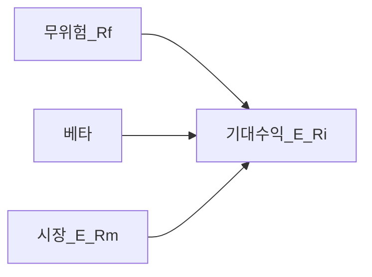
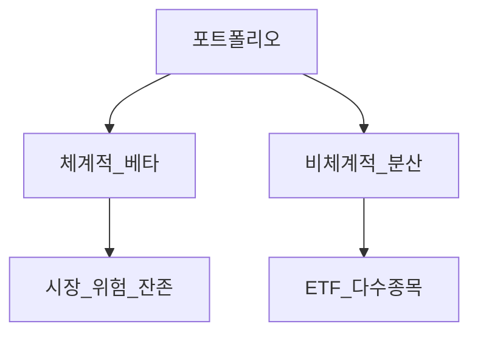

# CAPM·위험과 수익 (입문~표준)

> **면책**: 교육 목적. 과거 수익·베타는 미래를 보장하지 않습니다.

## 메타

| 항목 | 내용 |
|------|------|
| 최종 검증일 | 2026-05-24 |
| 난이도 | L3 (Deep) — [READER-GUIDE](../docs/READER-GUIDE.md) |
| 예상 읽기 시간 | 40~50분 |
| 관련 bucket | Bucket 3 코어 — QQQ·채권 배분 |

## 0. 이 편 읽기 전 (5분)

| 항목 | 내용 |
|------|------|
| **난이도** | L3 (Deep) — [READER-GUIDE §L등급](../docs/READER-GUIDE.md) |
| **선수** | 없음 |
| **이번 편에서 쓰는 기호** | 본문 §4·§4a 표 참고 |
| **복습 한 줄** | — |

## TL;DR

1. **위험** = 결과 **불확실성** — 주식은 변동성 큼.
2. **CAPM**: \(E(R_i) = R_f + \beta_i (E(R_m) - R_f)\).
3. **베타** > 1: 시장보다 **출렁** (QQQ·성장).
4. **분산**은 **비체계적 위험** 감소 — ETF 코어.
5. CAPM은 **단순 모델** — [factor-investing-primer](factor-investing-primer.md).

## 1. 한 줄 정의 + 왜 중요한가

**정의**: **CAPM(Capital Asset Pricing Model)** 은 자산의 **기대수익**이 **시장 베타**에 선형으로 연결된다는 이론 모델입니다.

**왜 중요한가**: “QQQ가 왜 더 무섭지?” → **베타·시장 민감도**로 설명. **채권·분산**이 왜 코어에 붙는지 **언어**가 됩니다.

## 2. 선수 / 이후

**선수**: [asset-allocation.md](../04-portfolio/asset-allocation.md), [stocks-equities-intro.md](../03-markets/stocks-equities-intro.md)  
**이후**: [factor-investing-primer.md](factor-investing-primer.md)

## 3. 직관·비유

**베타** = 시장 **파도**에 얼마나 **흔들리는 보트**인가. 베타 1.2 보트(QQQ 근사)는 파도 10m면 **12m** 출렁. **분산** = 여러 보트 — **한 척 침몽**(개별주) 위험은 줄이나 **바다 자체**(시장) 위험은 남습니다.

## 4. 정식 용어

| 용어 | 정의 |
|------|------|
| 무위험 \(R_f\) | 국채 근사 |
| 시장 \(R_m\) | 대표 지수 |
| 베타 \(\beta\) | 시장 민감도 |
| α | 모델 **초과** 잔차 |
| 체계적 위험 | **시장** 공통 |
| 비체계적 | **개별** 회사 |
| 변동성 σ | 수익률 **표준편차** |

### 4a. 핵심 용어 (본문 등장 순)

> 복습용. 정의는 §4 본표·[glossary](../00-roadmap/glossary.md)·본문 `!!! info` 박스.

| 용어 | 한 줄 | 관련 이론 | glossary |
|------|------|------|----------------|
| 무위험 \(R_f\) | 국채 근사 | §4 | [glossary](../00-roadmap/glossary.md#무위험-\) |
| 시장 \(R_m\) | 대표 지수 | §4 | [glossary](../00-roadmap/glossary.md#시장-\) |
| 베타 \(eta\) | 시장 민감도 | §4 | [glossary](../00-roadmap/glossary.md#베타-\) |
| α | 모델 **초과** 잔차 | §4 | [glossary](../00-roadmap/glossary.md#α) |
| 체계적 위험 | **시장** 공통 | §4 | [glossary](../00-roadmap/glossary.md#체계적-위험) |
| 비체계적 | **개별** 회사 | §4 | [glossary](../00-roadmap/glossary.md#비체계적) |
| 변동성 σ | 수익률 **표준편차** | §4 | [glossary](../00-roadmap/glossary.md#변동성-σ) |

## 5. 메커니즘

## 6. 수식·모델

| 기호 | 이름 | 이 식에서 의미 |
|------|------|----------------|
| **r** | 할인율·수익률 | 기간당 이자·요구수익률 |
| **n** | 기간 | 연·월 등 복리·할인에 쓰는 횟수 |
| **PV** | 현재가치 | 오늘 시점으로 환산한 금액 |
| **FV** | 미래가치 | 미래 시점의 목표·결과 금액 |

\[
E(R_i) = R_f + \beta_i (E(R_m) - R_f)
\]

**읽는 법**: 시장 초과수익에 대한 민감도가 **β**다. 

**R_f**·**ERP**와 함께 요구수익 **r**을 구성한다. [DEPTH-STANDARD](../docs/DEPTH-STANDARD.md) 참고.
**포트폴리오 베타**:

| 기호 | 이름 | 이 식에서 의미 |
|------|------|----------------|
| **r** | 할인율·수익률 | 기간당 이자·요구수익률 |
| **n** | 기간 | 연·월 등 복리·할인에 쓰는 횟수 |
| **PV** | 현재가치 | 오늘 시점으로 환산한 금액 |
| **FV** | 미래가치 | 미래 시점의 목표·결과 금액 |

\[
\beta_p = \sum w_i \beta_i
\]

**읽는 법**: 시장 초과수익에 대한 민감도가 **β**다. 

**R_f**·**ERP**와 함께 요구수익 **r**을 구성한다. [DEPTH-STANDARD](../docs/DEPTH-STANDARD.md) 참고.**예**: \(R_f=3\%\), \(E(R_m)=8\%\), \(\beta=1.2\) → \(E(R)=3+1.2\times5=9\%\).

---

\beta_i

**읽는 법**: 시장 초과수익에 대한 민감도가 **β**다. 

**R_f**·**ERP**와 함께 요구수익 **r**을 구성한다. [DEPTH-STANDARD](../docs/DEPTH-STANDARD.md) 참고.**예**: \(R_f=3\%\), \(E(R_m)=8\%\), \(\beta=1.2\) → \(E(R)=3+1.2\times5=9\%\).

## 7. 한국 적용

### 7.1 자산별 베타·역할 (교육)

| 자산(가상 β) | 대략 β | Bucket | 코멘트 |
|------|------|------|----------------|
| 단기 국채·MMDA | 0~0.2 | 0~1 | \(R_f\) 근사 |
| 국내 채권 ETF | 0.2~0.5 | 3 | 변동 완충 |
| KOSPI 200 | 1.0 | 3 | 시장 기준 |
| QQQ | 1.1~1.3 | 3 | 성장·대형·미국 |
| 코스닥 소형 1종 | 1.3~1.8+ | 4 | **비체계적** 집중 |
| QLD | 비선형 | 4 | CAPM **오용 금지** |

### 7.2 2025 vs 2026 맥락

| 항목 | 투자 설계에 미치는 영향 |
|------|-------------------------|
| 금리·인플레 | \(R_f\), \(E(R_m)\) **변동** → β 해석은 유지, **수치**는 갱신 |
| ISA·IRP 확대 | 세금이 아니라 **리밸런싱 실행** 용이 — β 목표 유지 |
| NXT·장후 | β를 바꾸지 않음 — **거래 빈도**만 증가 위험 |

**법·정책 근거**: 해당 없음(이론). 실무 β는 증권사·데이터 벤더 **추정치**.

### 7.3 CAPM의 한계 (L3에서 반드시 알 것)

- **단일 기간·균형** 가정 — 현실 시장은 구조 변화.  
- **β 안정** 가정 — 위기 시 **상관↑**(코로나·금리 쇼크).  
- **QLD·레버리지** — 일일 리셋으로 β²가 **아님**.  
- **대안**: [factor-investing-primer](factor-investing-primer.md) 다요인.

| 항목 | CAPM | 팩터 모델 |
|------|------|----------------|
| 설명 변수 | 시장 β | β+가치·규모·모멘텀 등 |
| QQQ | 고β 성장 | 성장·모멘텀 **중복** |
| 실무 | **입문 직관** | 보조·학술 |

### 7.4 포트폴리오 β 목표와 리밸런싱

| 목표 βp (가상) | 구성 예 | 리밸런싱 트리거 |
|------|------|----------------|
| 0.7 (보수) | QQQ 40% + 채권 40% + 현금 20% | βp > 0.85 |
| 1.0 (시장) | KOSPI200 60% + QQQ 40% | 분기 점검 |
| 1.2 (공격) | QQQ 70% + 소형 30% | **Bucket 4** 한도 |

**DB 가입자**: DB β는 **통제 불가** — **IRP·ISA**에서 βp 목표 설정.

### 7.5 SML(증권시장선) 직관

기대수익이 β에 비례한다는 **직선** 이미지입니다. 같은 β라면 **α(초과)** 는 장기적으로 **0에 수렴**한다는 가정이 CAPM의 핵심이며, “α를 낸다”는 액티브·팩터·섹터 베팅으로 이어집니다 — [factor-investing-primer](factor-investing-primer.md).

## 8. 숫자 예제 (가상)

> 모든 인물·금액·β는 가상입니다.

### 예제 1: 베타 (가상)

| 자산 | β(가상) | E(R)(가상) |
|------|------|----------------|
| 시장 | 1.0 | 8% |
| QQQ | 1.15 | 8.75% |
| 단기채 | 0.1 | 3.5% |

### 예제 2: 분산 (가상)

| | 1종목 | 20종목 ETF |
|------|------|----------------|
| 비체계적 | 높음 | **낮음** |
| 체계적 | 동일 | 동일 |

### 예제 3: 코어 70/30 (가상)

| | 비중 |
|--|------|
| QQQ β=1.15 | 50% |
| 채권 β=0.1 | 20% |
| 국내 | 30% |
| **βp(가상)** | ≈ 0.85 |

### 예제 4: 위기 시 베타 상승 (가상)

| 국면 | 가상 AL 포트폴리오 |
|------|-------------------|
| 평시 βp | 0.9 |
| 급락 주 βp | **1.1** (상관 증가) |
| 교훈 | “채권이 항상 방어”는 **아님** — 듀레이션·신용 확인 |

### 예제 5: DB·IRP와 분리 (가상)

| 슬롯 | β 기여 |
|------|--------|
| DB (운용 불명) | 본인 **통제 밖** |
| IRP QQQ 50% | 본인 **통제** |
| 행동 | DB β 추정보다 **IRP·ISA β 목표** 관리 |

## 9. FAQ

**Q1.** CAPM 맞나? — **근사** — 팩터 확장.  
**Q2.** β 낮은 자산? — 방어·채권.  
**Q3.** 분산 한계? — **시장** 위험.  
**Q4.** ISA? — **무관**.  
**Q5.** 섹터 ETF? — **β 중복**.  
**Q6.** QLD β=2? — **오해** — 레버리지 리셋.  
**Q7.** DB? — **운용** 별도.  
**Q8.** 장기? — 모델은 **기대** not 보장.  
**Q9.** 코스닥 티어·β? — 유동성·변동성 — [kosdaq-tier-system](../03-markets/kosdaq-tier-system.md).  
**Q10.** 리밸런싱 주기? — [rebalancing-and-dca](../04-portfolio/rebalancing-and-dca.md) — β **목표** 유지.

**Q11. ISA·IRP가 β를 바꾸나요?**  
**A11.** **아니오** — 세금·계좌만 다름. β는 **보유 자산**으로 계산.

### 실행 워크숍 체크리스트 (교육)

| # | 질문 | Yes 시 다음 문서 |
|------|------|----------------|
| 1 | 해외 ETF·주식을 보유 중인가? | [overseas-stocks-tax-part1-cgt.md](overseas-stocks-tax-part1-cgt.md) |
| 2 | 해외 배당이 연 500만 이상인가? | [part2-dividend](overseas-stocks-tax-part2-dividend.md) |
| 3 | DB 재직인가? | [db-pension.md](../db-pension.md) + IRP·ISA |
| 4 | 국내주식을 NXT에서 거래하는가? | [korea-ats-nextrade.md](../03-markets/korea-ats-nextrade.md) |
| 5 | 10년 코어가 QQQ인가? | [isa.md](../isa.md) 또는 [isa-irp-pension-tax.md](isa-irp-pension-tax.md) |

위 표는 **의사결정 보조**이며, 개인 소득·가구·회사 제도에 따라 답이 달라집니다. 불확실하면 [investment-tax-overview.md](investment-tax-overview.md) → [account-product-tax-map.md](account-product-tax-map.md) 순으로 읽으세요.

## 10. 함정·리스크·한계

- CAPM **만능**  
- **QLD**를 β2 주식  
- **과거 β** = 미래  
- **분산=무위험** 착각  
- **단일 섹터** 코어

---

**Q. 실무에서는?**  
교과서 식·기호를 그대로 적용하기 전에 **수수료·세금·데이터 시점**을 분리한다. 숫자는 [DEPTH-STANDARD](../docs/DEPTH-STANDARD.md)처럼 기호만 먼저 맞추고, 법령·시장 수치는 §8 표·외부 출처로 갱신한다.

## L3 보충 — 장기 자산 형성 연결

본 절은 [DEPTH-STANDARD.md](../../docs/DEPTH-STANDARD.md) L3 게이트를 충족하기 위한 **실행·교차 링크** 보충입니다.

### Bucket·현금흐름 연결

| Bucket | 대표 제도·자산 | 본 문서와의 관계 |
|------|------|----------------|
| 0 | 비상금 MMDA | 세금·투자 **전** 우선 |
| 1 | [청년도약](../06-korea-policy/youth-leap-account.md)·[미래적금](../06-korea-policy/youth-future-savings.md) | 정책 적금 — 주식 **대체 아님** |
| 2a | DB·DC | [db-vs-dc-pension.md](../06-korea-policy/db-vs-dc-pension.md) |
| 2b | ISA·IRP | [isa.md](../06-korea-policy/isa.md)·[isa-irp-pension-tax.md](../06-korea-policy/tax/isa-irp-pension-tax.md) |
| 3 | QQQ·채권 코어 | [capm-and-risk-return.md](../08-advanced/capm-and-risk-return.md) |
| 4 | NXT·코스닥·QLD | [fomo-and-trading-hours.md](../05-behavioral/fomo-and-trading-hours.md) |

### 연간 점검 루틴 (교육)

| 분기 | 할 일 |
|------|--------|
| Q1 | [investment-tax-overview.md](../06-korea-policy/tax/investment-tax-overview.md) 캘린더 확인 |
| Q2 | [rebalancing-and-dca.md](../04-portfolio/rebalancing-and-dca.md) 코어 비중 |
| Q3 | 해외 배당·금융소득 **누적** — Part2 |
| Q4 | 익년 **5월** 양도세 자료 정리 — Part1 |
| ISA | 개설일 +36개월 **만기** 알림 |

### 2025 vs 2026 정책 추적

| 항목 | 확인 출처 |
|------|-----------|
| ISA 한도·비과세 | 금융위·조세특례 시행일 |
| DC +300만 공제 | 국세청·통합연금포털 |
| 청년도약 일몰·미래적금 | [kinfa](https://ylaccount.kinfa.or.kr) |
| 금융투자소득세 | 금융위 보도·[sources.md](../../references/sources.md) |
| NXT 종목·거래중단 | [nextrade.co.kr](https://www.nextrade.co.kr) |

**면책 재확인**: 가상 예제·보도 수치는 **시점별 개정**됩니다. 실행·신고 전 공식 출처를 확인하세요.

## 11. 심화 읽기

- [factor-investing-primer.md](factor-investing-primer.md)  
- Sharpe, Markowitz 원전(선택)

## 12. 퀴즈

1. β=1?  
2. 분산이 줄이는 위험?  
3. CAPM 식?  
4. QQQ β 대략?  
5. QLD CAPM?

힌트
1. 시장 동행 2. 비체계적 3. Rf+β(Rm-Rf) 4. >1 5. 부적합
