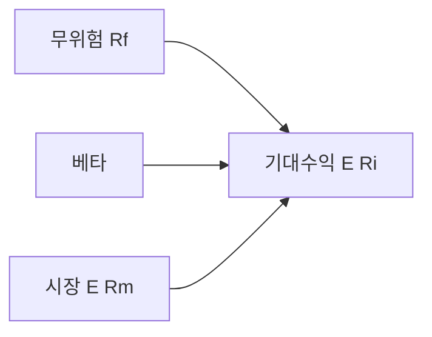
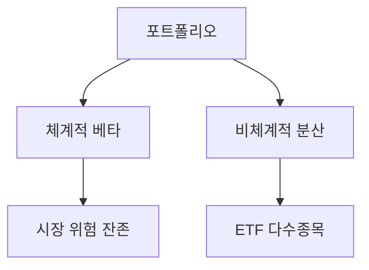

# CAPM·위험과 수익 (입문~표준)

> **면책**: 교육 목적. 과거 수익·베타는 미래를 보장하지 않습니다.

## 메타

| 항목 | 내용 |
|------|------|
| 최종 검증일 | 2026-05-24 |
| 난이도 | L3 (Deep) — [READER-GUIDE](../docs/READER-GUIDE.md) |
| 예상 읽기 시간 | 40~50분 |
| 관련 bucket | Bucket 3 코어 — QQQ·채권 배분 |

## 0. 이 편 읽기 전 (5분)

| 항목 | 내용 |
|------|------|
| **난이도** | L3 (Deep) — [READER-GUIDE §L등급](../docs/READER-GUIDE.md) |
| **선수** | 없음 |
| **이번 편에서 쓰는 기호** | 본문 §4·§4a 표 참고 |
| **복습 한 줄** | — |

## TL;DR

1. **위험** = 결과 **불확실성** — 주식은 변동성 큼.
2. **CAPM**: \(E(R_i) = R_f + \beta_i (E(R_m) - R_f)\).
3. **베타** > 1: 시장보다 **출렁** (QQQ·성장).
4. **분산**은 **비체계적 위험** 감소 — ETF 코어.
5. CAPM은 **단순 모델** — [factor-investing-primer](factor-investing-primer.md).

## 1. 한 줄 정의 + 왜 중요한가

!!! info "CAPM (Capital Asset Pricing Model)"
    β로 기대수익을 설명하는 단일요인 모형.

**정의**: **CAPM(Capital Asset Pricing Model)** 은 자산의 **기대수익**이 **시장 베타**에 선형으로 연결된다는 이론 모델입니다.

**이것이 중요한 이유**: 이 이론을 알아야 “QQQ가 왜 코스피보다 위험한지”, “채권을 왜 코어에 넣는지”를 **숫자로** 설명할 수 있습니다. 팩터 ETF·스마트베타 상품설명서에 등장하는 β, 알파, 샤프지수가 모두 CAPM에서 파생됩니다. **쉽게 말하면:** IRP·ISA 내 자산을 고를 때 “내 포트폴리오 총 β가 얼마인가”를 계산해 리밸런싱 시점을 결정하는 실용 언어가 됩니다.

## 2. 선수 / 이후

**선수**: [asset-allocation.md](../04-portfolio/asset-allocation.md), [stocks-equities-intro.md](../03-markets/stocks-equities-intro.md)  
**이후**: [factor-investing-primer.md](factor-investing-primer.md)

## 3. 직관·비유

**핵심은:** CAPM은 "더 위험한 자산은 더 높은 기대수익을 요구한다"는 리스크-리턴 트레이드오프를 수식으로 표현한 것입니다.

**비유 1 — 베타는 파도에 흔들리는 보트**
바다(시장)가 10% 출렁일 때, 베타 1.2인 보트(예: 성장주 ETF)는 12% 출렁이고, 베타 0.3인 보트(예: 단기 채권 ETF)는 3%만 흔들립니다. 베타가 1보다 크면 시장보다 더 오르고 더 내리고, 1보다 작으면 더 완만하게 움직입니다.

**비유 2 — 리스크 프리미엄은 위험 감수에 대한 보상**
쉽게 말하면: 누군가에게 돈을 빌려줄 때, 신용 좋은 정부(국채)보다 망할 수 있는 신생기업(하이일드채)에게는 더 높은 이자를 요구합니다. 주식도 마찬가지입니다. 시장 전체보다 많이 출렁이는 주식(β > 1)에 투자자들이 더 높은 기대수익을 요구하는 것이 리스크 프리미엄의 본질입니다.

**비유 3 — 분산은 달걀을 여러 바구니에 나누는 것**
한 종목 집중 투자는 그 회사만의 위험(비체계적 위험)에 노출됩니다. ETF로 100개 종목에 분산하면 이 개별 위험은 서로 상쇄되어 줄어들지만, 시장 전체가 내리는 위험(체계적 위험·베타)은 줄일 수 없습니다. 이것이 ETF를 아무리 많이 들어도 시장 하락의 영향은 피할 수 없는 이유입니다.

**이 이론의 한계는 다음과 같습니다:** CAPM은 단일 기간, 완전 시장, 모든 투자자가 동일한 기대를 갖는다는 비현실적 가정에 기반합니다. 실제로는 가치주·소형주·모멘텀 등 베타 하나로 설명되지 않는 초과수익(팩터)이 존재합니다.

## 4. 정식 용어

| 용어 | 정의 |
|------|------|
| 무위험 \(R_f\) | 국채 근사 |
| 시장 \(R_m\) | 대표 지수 |
| 베타 \(\beta\) | 시장 민감도 |
| α | 모델 **초과** 잔차 |
| 체계적 위험 | **시장** 공통 |
| 비체계적 | **개별** 회사 |
| 변동성 σ | 수익률 **표준편차** |

### 4a. 핵심 용어 (본문 등장 순)

> 복습용. 정의는 §4 본표·[glossary](../00-roadmap/glossary.md)·본문 `!!! info` 박스.

| 용어 | 한 줄 | 관련 이론 | glossary |
|------|------|------|----------------|
| 무위험 \(R_f\) | 국채 근사 | §4 | [glossary](../00-roadmap/glossary.md#무위험-\) |
| 시장 \(R_m\) | 대표 지수 | §4 | [glossary](../00-roadmap/glossary.md#시장-\) |
| 베타 \(eta\) | 시장 민감도 | §4 | [glossary](../00-roadmap/glossary.md#베타-\) |
| α | 모델 **초과** 잔차 | §4 | [glossary](../00-roadmap/glossary.md#α) |
| 체계적 위험 | **시장** 공통 | §4 | [glossary](../00-roadmap/glossary.md#체계적-위험) |
| 비체계적 | **개별** 회사 | §4 | [glossary](../00-roadmap/glossary.md#비체계적) |
| 변동성 σ | 수익률 **표준편차** | §4 | [glossary](../00-roadmap/glossary.md#변동성-σ) |

## 5. 메커니즘

## 6. 수식·모델

| 기호 | 이름 | 이 식에서 의미 |
|------|------|----------------|
| **E(Ri)** | 자산 i의 기대수익 | CAPM이 예측하는 요구수익 |
| **Rf** | 무위험수익률 | 국채 수익률로 근사 |
| **betai** | 자산 i의 베타 | 시장 수익률 변화에 대한 민감도 |
| **E(Rm)** | 시장 기대수익 | 시장 지수의 기대수익 |
| **ERP** | 시장 위험 프리미엄 | 무위험 대비 시장 초과수익 |

**CAPM 핵심 방정식**:

\[
E(R_i) = R_f + \beta_i (E(R_m) - R_f)
\]

**식 (기호)**: **E**(**R_i**) = **R_f** + **β_i** (**E**(**R_m**) - **R_f**)

**읽는 법**: 시장 초과수익에 대한 자산의 민감도가 **β**다. **R_f**·**ERP**와 함께 자산의 요구수익 **r**을 구성한다. [DEPTH-STANDARD](../docs/DEPTH-STANDARD.md) 참고.

**예**: \(R_f=3\%\), \(E(R_m)=8\%\), \(\beta=1.2\) → \(E(R)=3+1.2\times5=9\%\).

**포트폴리오 베타** (비중 가중 평균):

| 기호 | 이름 | 이 식에서 의미 |
|------|------|----------------|
| **betap** | 포트폴리오 베타 | 구성 자산 β의 비중 가중 합 |
| **wi** | 비중 | 자산 i의 투자 비중 (합 = 1) |
| **betai** | 개별 자산 β | 자산 i의 시장 민감도 |

\[
\beta_p = \sum w_i \beta_i
\]

**식 (기호)**: **β_p** = Σ **w_i** **β_i**

**읽는 법**: 포트폴리오 전체의 시장 민감도는 구성 자산 β의 **비중 가중 평균**이다. QQQ 50%(β=1.15) + 채권 50%(β=0.2)이면 βp = 0.5×1.15 + 0.5×0.2 = **0.675**.

## 7. 한국 적용

### 7.1 자산별 베타·역할 (교육)

| 자산(가상 β) | 대략 β | Bucket | 코멘트 |
|------|------|------|----------------|
| 단기 국채·MMDA | 0~0.2 | 0~1 | \(R_f\) 근사 |
| 국내 채권 ETF | 0.2~0.5 | 3 | 변동 완충 |
| KOSPI 200 | 1.0 | 3 | 시장 기준 |
| QQQ | 1.1~1.3 | 3 | 성장·대형·미국 |
| 코스닥 소형 1종 | 1.3~1.8+ | 4 | **비체계적** 집중 |
| QLD | 비선형 | 4 | CAPM **오용 금지** |

### 7.2 2025 vs 2026 맥락

| 항목 | 투자 설계에 미치는 영향 |
|------|-------------------------|
| 금리·인플레 | \(R_f\), \(E(R_m)\) **변동** → β 해석은 유지, **수치**는 갱신 |
| ISA·IRP 확대 | 세금이 아니라 **리밸런싱 실행** 용이 — β 목표 유지 |
| NXT·장후 | β를 바꾸지 않음 — **거래 빈도**만 증가 위험 |

**법·정책 근거**: 해당 없음(이론). 실무 β는 증권사·데이터 벤더 **추정치**.

### 7.3 CAPM의 한계 (L3에서 반드시 알 것)

- **단일 기간·균형** 가정 — 현실 시장은 구조 변화.  
- **β 안정** 가정 — 위기 시 **상관↑**(코로나·금리 쇼크).  
- **QLD·레버리지** — 일일 리셋으로 β²가 **아님**.  
- **대안**: [factor-investing-primer](factor-investing-primer.md) 다요인.

| 항목 | CAPM | 팩터 모델 |
|------|------|----------------|
| 설명 변수 | 시장 β | β+가치·규모·모멘텀 등 |
| QQQ | 고β 성장 | 성장·모멘텀 **중복** |
| 실무 | **입문 직관** | 보조·학술 |

### 7.4 포트폴리오 β 목표와 리밸런싱

| 목표 βp (가상) | 구성 예 | 리밸런싱 트리거 |
|------|------|----------------|
| 0.7 (보수) | QQQ 40% + 채권 40% + 현금 20% | βp > 0.85 |
| 1.0 (시장) | KOSPI200 60% + QQQ 40% | 분기 점검 |
| 1.2 (공격) | QQQ 70% + 소형 30% | **Bucket 4** 한도 |

**DB 가입자**: DB β는 **통제 불가** — **IRP·ISA**에서 βp 목표 설정.

### 7.5 SML(증권시장선) 직관

기대수익이 β에 비례한다는 **직선** 이미지입니다. 같은 β라면 **α(초과)** 는 장기적으로 **0에 수렴**한다는 가정이 CAPM의 핵심이며, “α를 낸다”는 액티브·팩터·섹터 베팅으로 이어집니다 — [factor-investing-primer](factor-investing-primer.md).

## 8. 숫자 예제 (가상)

> 모든 인물·금액·β는 가상입니다.

### 예제 1: 베타 (가상)

| 자산 | β(가상) | E(R)(가상) |
|------|------|----------------|
| 시장 | 1.0 | 8% |
| QQQ | 1.15 | 8.75% |
| 단기채 | 0.1 | 3.5% |

### 예제 2: 분산 (가상)

| | 1종목 | 20종목 ETF |
|------|------|----------------|
| 비체계적 | 높음 | **낮음** |
| 체계적 | 동일 | 동일 |

### 예제 3: 코어 70/30 (가상)

| | 비중 |
|--|------|
| QQQ β=1.15 | 50% |
| 채권 β=0.1 | 20% |
| 국내 | 30% |
| **βp(가상)** | ≈ 0.85 |

### 예제 4: 위기 시 베타 상승 (가상)

| 국면 | 가상 AL 포트폴리오 |
|------|-------------------|
| 평시 βp | 0.9 |
| 급락 주 βp | **1.1** (상관 증가) |
| 교훈 | “채권이 항상 방어”는 **아님** — 듀레이션·신용 확인 |

### 예제 5: DB·IRP와 분리 (가상)

| 슬롯 | β 기여 |
|------|--------|
| DB (운용 불명) | 본인 **통제 밖** |
| IRP QQQ 50% | 본인 **통제** |
| 행동 | DB β 추정보다 **IRP·ISA β 목표** 관리 |

## 9. FAQ

**Q1. CAPM은 실제로 맞나요?**  
A1. 완전히 맞지는 않습니다. CAPM은 시장이 완전하고 투자자가 합리적이라는 비현실적 가정 위에 세워진 **근사 모형**입니다. 실증 연구에서 베타 하나만으로 수익을 설명하면 오차가 크고, 가치주·소형주·모멘텀 같은 팩터가 추가로 설명력을 가집니다. 그러나 리스크-리턴 트레이드오프의 **직관을 이해하는 도구**로서 여전히 가치 있습니다.

**Q2. 베타가 낮을수록 안전한가요?**  
A2. 베타가 낮으면 시장 변동에 덜 흔들리지만, 이것이 곧 '안전'을 의미하지는 않습니다. 방어주·채권은 β가 낮지만, 금리 상승 국면에서는 채권 가격이 크게 내릴 수 있습니다. β는 시장 리스크 하나만 반영할 뿐, 금리·신용·유동성 위험은 포함하지 않습니다.

**Q3. 분산 투자로 모든 위험을 없앨 수 있나요?**  
A3. 아니오. 분산 투자로 줄일 수 있는 것은 **비체계적 위험(개별 종목 위험)**뿐입니다. 시장 전체가 하락하는 **체계적 위험(β)**은 분산으로 없앨 수 없습니다. 코로나 쇼크처럼 전체 시장이 급락하면 아무리 분산된 ETF도 함께 내립니다.

**Q4. ISA나 IRP 계좌가 β를 바꾸나요?**  
A4. 아니오. ISA·IRP는 **세금 혜택 계좌**일 뿐, 안에 담긴 자산의 β는 동일합니다. QQQ를 ISA에 넣든 일반 계좌에 넣든 β는 같습니다. 계좌는 세후 수익을 높이는 도구이고, β 관리는 **어떤 자산을 담느냐**로 결정됩니다.

**Q5. 섹터 ETF를 여러 개 담으면 분산이 되나요?**  
A5. 같은 방향으로 움직이는 섹터끼리는 분산 효과가 작습니다. 반도체 ETF와 AI ETF는 모두 기술주 성격이 강해 **β 중복**이 발생합니다. 진정한 분산은 주식·채권·부동산·원자재처럼 **상관관계가 낮은 자산군** 간에 이루어집니다.

**Q6. QLD는 β=2인가요?**  
A6. 아닙니다. QLD는 QQQ 일일 수익률의 **2배**를 추구하지만, 복리 효과로 인해 장기 보유 시 2배에 미치지 못하거나 초과할 수 있습니다. 일일 리셋 구조 때문에 CAPM의 단순 β로 계산하면 오류가 생깁니다. 레버리지 ETF에는 CAPM을 그대로 적용하지 않는 것이 좋습니다.

**Q7. DB 연금과 β는 어떤 관계인가요?**  
A7. DB 연금은 운용이 회사 책임이므로 가입자가 β를 직접 통제할 수 없습니다. 따라서 본인이 **β 목표를 설정**할 수 있는 IRP·ISA에서 전체 자산 β를 조정하는 방식이 현실적입니다.

**Q8. CAPM으로 장기 수익을 예측할 수 있나요?**  
A8. CAPM은 기대수익의 **장기 평균** 방향성은 제시하지만, 1~3년의 실현 수익은 크게 다를 수 있습니다. β×ERP는 "이 자산을 10년 이상 보유했을 때 시장 대비 어느 정도 수익을 기대해야 하는가"의 참고 지표지, 내년 수익 예측값이 아닙니다.

**Q9. 코스닥 소형주의 β는 어느 정도인가요?**  
A9. 가상 기준으로 코스닥 소형주는 β 1.3~1.8 이상인 경우도 많습니다. 유동성이 낮고 변동성이 높기 때문입니다. 다만 개별 종목 β는 데이터 기간에 따라 크게 달라지므로 참고값으로만 사용하세요. 자세한 내용은 [kosdaq-tier-system](../03-markets/kosdaq-tier-system.md)을 참고하세요.

**Q10. 리밸런싱 주기는 어떻게 결정하나요?**  
A10. β 목표에서 크게 벗어났을 때가 리밸런싱 시점입니다. 예를 들어 목표 βp=0.85에서 급등 후 1.1이 되었다면 주식 비중을 줄여 β를 내리는 식입니다. 구체적인 방법은 [rebalancing-and-dca](../04-portfolio/rebalancing-and-dca.md)를 참고하세요.

**Q11. ISA·IRP가 β를 바꾸나요?**  
A11. **아니오** — 세금·계좌만 다름. β는 **보유 자산**으로 계산.

## 10. 함정·리스크·한계

- CAPM **만능**  
- **QLD**를 β2 주식  
- **과거 β** = 미래  
- **분산=무위험** 착각  
- **단일 섹터** 코어

---

**Q. 실무에서는?**  
교과서 식·기호를 그대로 적용하기 전에 **수수료·세금·데이터 시점**을 분리한다. 숫자는 [DEPTH-STANDARD](../docs/DEPTH-STANDARD.md)처럼 기호만 먼저 맞추고, 법령·시장 수치는 §8 표·외부 출처로 갱신한다.

## L3 보충 — 장기 자산 형성 연결

본 절은 [DEPTH-STANDARD.md](../../docs/DEPTH-STANDARD.md) L3 게이트를 충족하기 위한 **실행·교차 링크** 보충입니다.

### Bucket·현금흐름 연결

| Bucket | 대표 제도·자산 | 본 문서와의 관계 |
|------|------|----------------|
| 0 | 비상금 MMDA | 세금·투자 **전** 우선 |
| 1 | [청년도약](../06-korea-policy/youth-leap-account.md)·[미래적금](../06-korea-policy/youth-future-savings.md) | 정책 적금 — 주식 **대체 아님** |
| 2a | DB·DC | [db-vs-dc-pension.md](../06-korea-policy/db-vs-dc-pension.md) |
| 2b | ISA·IRP | [isa.md](../06-korea-policy/isa.md)·[isa-irp-pension-tax.md](../06-korea-policy/tax/isa-irp-pension-tax.md) |
| 3 | QQQ·채권 코어 | [capm-and-risk-return.md](../08-advanced/capm-and-risk-return.md) |
| 4 | NXT·코스닥·QLD | [fomo-and-trading-hours.md](../05-behavioral/fomo-and-trading-hours.md) |

### 연간 점검 루틴 (교육)

| 분기 | 할 일 |
|------|--------|
| Q1 | [investment-tax-overview.md](../06-korea-policy/tax/investment-tax-overview.md) 캘린더 확인 |
| Q2 | [rebalancing-and-dca.md](../04-portfolio/rebalancing-and-dca.md) 코어 비중 |
| Q3 | 해외 배당·금융소득 **누적** — Part2 |
| Q4 | 익년 **5월** 양도세 자료 정리 — Part1 |
| ISA | 개설일 +36개월 **만기** 알림 |

### 2025 vs 2026 정책 추적

| 항목 | 확인 출처 |
|------|-----------|
| ISA 한도·비과세 | 금융위·조세특례 시행일 |
| DC +300만 공제 | 국세청·통합연금포털 |
| 청년도약 일몰·미래적금 | [kinfa](https://ylaccount.kinfa.or.kr) |
| 금융투자소득세 | 금융위 보도·[sources.md](../../references/sources.md) |
| NXT 종목·거래중단 | [nextrade.co.kr](https://www.nextrade.co.kr) |

**면책 재확인**: 가상 예제·보도 수치는 **시점별 개정**됩니다. 실행·신고 전 공식 출처를 확인하세요.

## 11. 심화 읽기

- [factor-investing-primer.md](factor-investing-primer.md)  
- Sharpe, Markowitz 원전(선택)

## 12. 퀴즈

1. β=1?  
2. 분산이 줄이는 위험?  
3. CAPM 식?  
4. QQQ β 대략?  
5. QLD CAPM?

힌트
1. 시장 동행 2. 비체계적 3. Rf+β(Rm-Rf) 4. >1 5. 부적합
