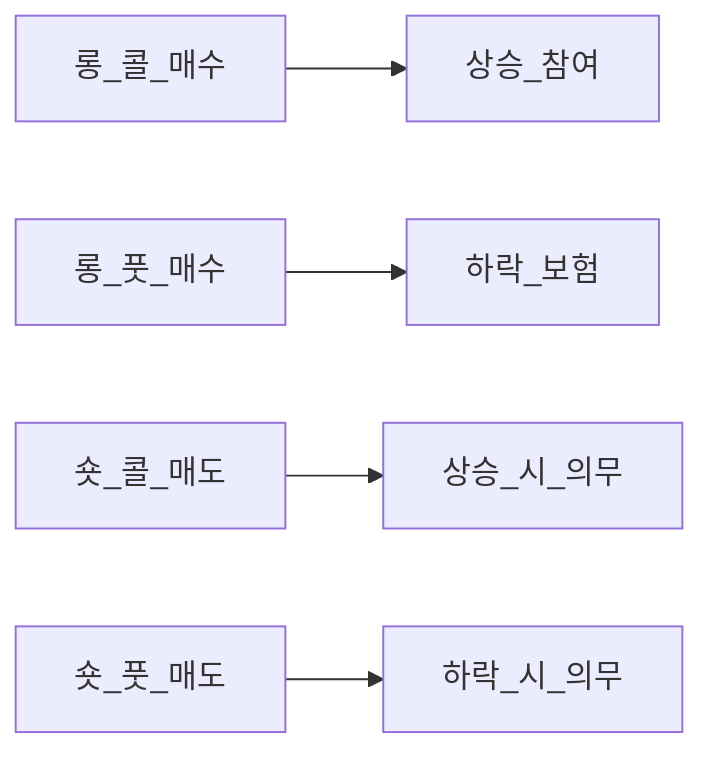

# 파생상품·옵션 입문 — 콜·풋·헤지·레버리지·위험

> **면책**: 본 문서는 **교육 목적**입니다. **개인 투자자의 단기 옵션·선물 투기·고레버리지 매매를 권장하지 않습니다.** 한국·미국 규제, 세금, 증거금·손실 한도는 상품·계좌별로 다르며, **원금 초과 손실**이 가능한 구조가 있습니다. 실행 전 **공식 설명서·위험고지·전문가 상담**을 확인하세요. **본문은 투자 권유가 아닙니다.**

## 메타

| 항목 | 내용 |
|------|------|
| 최종 검증일 | 2026-05-24 |
| 정책·법령 기준일 | 2025-12-31 (파생상품 규제는 개정 잦음) |
| 난이도 | L4 (Graduate) — [READER-GUIDE](../docs/READER-GUIDE.md) |
| 예상 읽기 시간 | 150~180분 |
| 관련 bucket | Bucket 3~4 — **이해** 목적; **투기**는 **비권장** |

## 0. 이 편 읽기 전 (5분)

| 항목 | 내용 |
|------|------|
| **난이도** | L4 (Graduate) — [READER-GUIDE §L등급](../docs/READER-GUIDE.md) |
| **선수** | [stocks-equities-intro](../03-markets/stocks-equities-intro.md), [capm-and-risk-return](capm-and-risk-return.md) |
| **이번 편에서 쓰는 기호** | 본문 §4·§4a 표 참고 |
| **복습 한 줄** | L3 선수 편을 먼저 읽으면 수식이 수월함 |


## TL;DR

1. **옵션**은 **특정 가격·기일**에 **매수(콜)·매도(풋)** 할 **권리**(및 **의무**는 **매도 포지션**) — **프리미엄** 지불.
2. **페이오프 다이어그램**으로 **만기 손익**을 **한눈에** — **롱 콜**=상승 참여, **롱 풋**=하락 보험.
3. **헤지**: 보유 **주식·지수** **하방** **보호** — **보험료** **개념**.
4. **레버리지**: **적은 자본**으로 **큰 노출** — **손실도** **비례·비선형** 확대.
5. **지수 옵션**은 **개별주** **비체계적 위험** **분산** — **시장·변동성** **노출**.
6. **개인 투기** — **시간가치 소멸·변동성·유동성·세금**으로 **장기** **기대값** **불리**한 경우 **다수** — **코어는 현물·ETF**.

---

## 1. 한 줄 정의 + 왜 중요한가

**정의**: **파생상품(Derivatives)** 은 **기초자산(underlying)** 의 가격·이자율·환율 등에 **연동**된 **계약**입니다. **옵션(Option)** 은 **행사가격(K)** · **만기(T)** 에 **기초자산**을 **사거나 팔 권리**를 **거래**하는 **계약**입니다.


!!! info "ETF"
    지수·자산 **바구니**를 한 종목처럼 거래

**왜 중요한가**: 뉴스의 **“풋 옵션 급증”**·**VIX**·**선물 프리미엄**을 **읽을** **언어**가 됩니다. **기업**은 **환·금리 헤지**에 **사용**합니다. **개인**은 **QLD·레버리지 ETF**와 **혼동**하지 않도록 **비선형** **손익**을 **이해**해야 합니다. **본 저장소**는 **장기 자산 형성** — **옵션 투기**는 **교육상** **경고** 대상입니다.

---

## 2. 선수 지식 / 이후 읽을 것

**선수**:
- [stocks-equities-intro](../03-markets/stocks-equities-intro.md)
- [capm-and-risk-return](capm-and-risk-return.md)
- [compound-interest-and-time-value](../01-foundations/compound-interest-and-time-value.md)

**이후**:
- [market-efficiency-emh](market-efficiency-emh.md)
- [wacc-capital-structure](../09-corporate-finance/wacc-capital-structure.md)
- [fomo-and-trading-hours](../05-behavioral/fomo-and-trading-hours.md)

---

## 3. 직관·비유

**보험(풋)**: **자동차 보험** — **사고(주가 하락)** 시 **보상**, **평소**는 **보험료(프리미엄)** **소멸**. **만기**에 **사고 없으면** **보험료** **전액** **손실**.

**콜 옵션 = 입장권**: **콘서트(상승)** **티켓**을 **미리** **싸게** **삼** — **콘서트** **취소**되면 **입장권** **값** **0**.

**레버리지 = 빌려 탄 산**: **오르면** **빠르게** **오르고**, **내리면** **강제** **청산** — **옵션**은 **시간**이 **적**을 **때문**에 **“산** **등반** **시간** **제한”** **추가**.

---

## 4. 정식 개념·용어

| 용어 | English | 정의 |
|------|------|----------------|
| 기초자산 | Underlying | 주식·지수·환율 등 |
| 콜 | Call | **매수** 권리 |
| 풋 | Put | **매도** 권리 |
| 행사가 | Strike K | 권리 행사 가격 |
| 만기 | Expiration T | 계약 종료 |
| 프리미엄 | Premium | 옵션 가격 |
| 내재가치 | Intrinsic | max(S-K,0) 등 |
| 시간가치 | Time value | 프리미엄 − 내재 |
| 롱/숏 | Long/Short | 권리 매수 vs 의무 매도 |
| ITM/ATM/OTM | In/At/Out of the money | 행사 유리 여부 |
| 델타 Δ | Delta | 기초 1단위당 옵션 가격 변화 |
| 감마 Γ | Gamma | 델타의 변화율 |
| 베가 ν | Vega | 변동성 민감도 |
| 쎄타 Θ | Theta | 시간 경과 손실 |
| 내재변동성 IV | Implied vol | 시장이 내재한 σ |
| 헤지 | Hedge | 기존 위험 상쇄 |
| 커버드 콜 | Covered call | 주식 보유 + 콜 매도 |

### 4a. 핵심 용어 (본문 등장 순)

> 복습용. 정의는 §4 본표·[glossary](../00-roadmap/glossary.md)·본문 `!!! info` 박스.

| 용어 | 한 줄 | 관련 이론 | glossary |
|------|------|----------------|
| 기초자산 | 주식·지수·환율 등 | §4 | [glossary](../00-roadmap/glossary.md#기초자산) |
| 콜 | **매수** 권리 | §4 | [glossary](../00-roadmap/glossary.md#콜) |
| 풋 | **매도** 권리 | §4 | [glossary](../00-roadmap/glossary.md#풋) |
| 행사가 | 권리 행사 가격 | §4 | [glossary](../00-roadmap/glossary.md#행사가) |
| 만기 | 계약 종료 | §4 | [glossary](../00-roadmap/glossary.md#만기) |
| 프리미엄 | 옵션 가격 | §4 | [glossary](../00-roadmap/glossary.md#프리미엄) |
| 내재가치 | max | §4 | [glossary](../00-roadmap/glossary.md#내재가치) |
| 시간가치 | 프리미엄 − 내재 | §4 | [glossary](../00-roadmap/glossary.md#시간가치) |
| 롱/숏 | 권리 매수 vs 의무 매도 | §4 | [glossary](../00-roadmap/glossary.md#롱/숏) |
| ITM/ATM/OTM | 행사 유리 여부 | §4 | [glossary](../00-roadmap/glossary.md#itm/atm/otm) |
| 델타 Δ | 기초 1단위당 옵션 가격 변화 | §4 | [glossary](../00-roadmap/glossary.md#델타-δ) |
| 감마 Γ | 델타의 변화율 | §4 | [glossary](../00-roadmap/glossary.md#감마-γ) |
| 베가 ν | 변동성 민감도 | §4 | [glossary](../00-roadmap/glossary.md#베가-ν) |
| 쎄타 Θ | 시간 경과 손실 | §4 | [glossary](../00-roadmap/glossary.md#쎄타-θ) |
| 내재변동성 IV | 시장이 내재한 σ | §4 | [glossary](../00-roadmap/glossary.md#내재변동성-iv) |


---

## 5. 메커니즘 — 콜·풋



### 5.1 롱 콜 (Call buyer)

- **지불**: 프리미엄 \(C\)
- **만기 손익**: \(\max(S_T - K, 0) - C\)
- **최대 손실**: \(C\) (프리미엄)
- **최대 이익**: **이론상 무한** (주식 콜)

### 5.2 롱 풋 (Put buyer)

- **지불**: 프리미엄 \(P\)
- **만기 손익**: \(\max(K - S_T, 0) - P\)
- **최대 손실**: \(P\)
- **최대 이익**: \(K - P\) (주식 0까지)

### 5.3 숏 포지션 (매도)

**옵션 매도**는 **프리미엄 수취** + **의무** — **손실** **무한**(숏 콜) 또는 **큼**(숏 풋). **개인** **초보** **금지** **수준** **위험** — **교육**만.

---

## 6. 페이오프 다이어그램 (교육)

### 6.1 만기 시 롱 콜

```
손익
  ↑
  |          /
  |         /  기울기 1
  |________/________→ S_T
         K
  |_______
        -C (최대 손실)
```

**ATM 근처**: \(S_T = K\) → 손익 \(-C\).

### 6.2 만기 시 롱 풋

```
손익
  ↑
  |\
  | \  기울기 -1 (보호)
  |__\________→ S_T
     K
```

### 6.3 보호풋 헤지 (Protective put)

**주식 1주 + 풋 1계약**: 하락 시 **풋**이 **손실** **상쇄** — **합성** **콜**과 **유사** (Put-call parity).

| 기호 | 이름 | 이 식에서 의미 |
|------|------|----------------|
|   \(C\)   | 지출 | 기간 총 현금 유출 |
|------|------|----------------|
|   \(r\)   | 할인율·수익률 | 기간당 이자·요구수익률 |
|   \(P\)   | 포트 규모 | 가상 포트폴리오 규모(만 원) |
|            \(S\)            | S | 소득 대비 남는 비율 |
\[
C + K e^{-rT} = P + S
\]


**읽는 법**: **C**와 **K**의 관계를 위 식으로 쓴다. 경제·재무 해석은 변수표 「이 식에서 의미」와 [DEPTH-STANDARD](../docs/DEPTH-STANDARD.md) 기호 예제를 맞춘다.
**유도 (L4)**:
1. **정의**: **C**, **K**, **e**를 동일 시점·동일 통화로 맞춘다. — 단위 불일치면 식이 무의미해진다.
2. **식 변형**: 양변을 정리해 목표 변수를 한쪽에 둔다. — 할인·복리는 **시점 이동**이 핵심이다.
3. **해석**: 부호·크기가 경제 직관과 맞는지 확인한다. — 극단값에서 단조성·한계를 점검한다.

(배당·거래비용 **무시** **교육** 식)

---

## 7. 헤지·레버리지

### 7.1 헤지 (기업·장기 투자자 관점)

| 목적 | 도구 | 교육적 함의 |
|------|------|----------------|
| **주가 하락** | **보호풋** | **보험료** **지속** **부담** |
| **환율** | **선물·스왑** | **수출** **기업** — [macro-05](../02-economics/macro-05-open-economy-fx.md) 예정 |
| **금리** | **스왑** | **채권** **듀레이션** |
| **변동성** | **VIX** **연동** | **복잡** — **개인** **비권장** |

**한국 개인**: **KOSPI200** **풋** **지수옵션**으로 **포트** **하방** **헤지** **가능**(자격·계좌 **제한**) — **비용**·**롤오버** **필수** **이해**.

### 7.2 레버리지

| 방식 | 메커니즘 | 위험 |
|------|------|----------------|
| **마진 매수** | 차입 | **마진콜** |
| **레버리지 ETF(QLD)** | **일일** 리셋 | **경로** **의존** — [capm](capm-and-risk-return.md) |
| **옵션** | **델타** **노출** | **시간** **소멸**·**IV** **급변** |
| **선물** | **증거금** | **일일** **정산** **추가** **증거금** |

**교육**: **“10배 수익”** **광고** — **10배 손실**·**100%** **프리미엄** **손실** **동시**.

---

## 8. 지수 옵션·선물

### 8.1 지수 vs 개별주 옵션

| | 지수 옵션 | 개별주 옵션 |
|------|------|----------------|
| 기초 | KOSPI200, S&P500 | 삼성전자 등 |
| 비체계적 위험 | **낮음** | **높음** |
| 변동성 | **지수 σ** | **개별 σ** **↑** |
| 유동성 | **대형** **지수** **높음** | **종목별** |

### 8.2 현물·선물·옵션 관계 (교육)

**선물 가격** ≈ **현물** × \(e^{(r-q)T}\) (**비용·배당** 조정). **콘탱고**·**백워데이션** — **ETF** **추적오차**와 **연결** ([commodities](../03-markets/) 예정).

### 8.3 VIX (교육)

**S&P500** **옵션** **내재변동성** **지수** — **공포** **지표**. **VIX** **상품** **직접** **매매**는 **롤** **비용**·**구조** **복잡** — **개인** **투기** **비권장**.

---

## 9. 그릭스·가격 결정 (입문)

**Black-Scholes**(배당 무시 교육):

\[
C = S N(d_1) - K e^{-rT} N(d_2)
\]

**직관**:
- **S↑** → 콜 ↑ (**델타** > 0)
- **σ↑** → 옵션 ↑ (**베가** > 0) — **롱** **유리**·**숏** **불리**
- **T↓** → 시간가치 ↓ (**쎄타** < 0 for long)
- **r↑** → 콜 ↑ (복잡)

**한국**: **KOSPI200** **옵션** **시장** **IV** **스마일** — **위기** 시 **OTM** **풋** **비쌈**.

---

## 10. 위험 — 개인 투기 비권장 근거

| 위험 | 설명 |
|------|------|
| **시간가치 소멸** | **OTM** **단기** — **만기** **접근** **가속** **손실** |
| **IV crush** | 실적·이벤트 **후** **프리미엄** **급락** |
| **유동성** | **호가** **스프레드** — **이론**≠**체결** |
| **비선형** | **델타** **변함** — **헤지** **비율** **재조정** |
| **세금** | **파생** **손익** **분류** — **전문** **확인** |
| **심리** | **단기** **도박** — [fomo](../05-behavioral/fomo-and-trading-hours.md) |
| **자격** | **파생** **계좌** **개설** **요건** |

### 10.1 레버리지 ETF vs 옵션 (교육)

| | QLD (2x ETF) | 단기 OTM 콜 |
|------|------|----------------|
| 손실 한도 | **원금** **이상** **가능**(극단) | **프리미엄** **100%** |
| 시간 | **일일** 리셋 | **만기** **명시** |
| 본 저장소 | Bucket 4 **한도** | **투기** **비권장** |

---


**Q. 실무에서는?**  
교과서 식·기호를 그대로 적용하기 전에 **수수료·세금·데이터 시점**을 분리한다. 숫자는 [DEPTH-STANDARD](../docs/DEPTH-STANDARD.md)처럼 기호만 먼저 맞추고, 법령·시장 수치는 §8 표·외부 출처로 갱신한다.

## 11. 한국 시장 (교육)

| 항목 | 내용 |
|------|------|
| **거래소** | **한국거래소** **지수·주식** **옵션** |
| **KOSPI200 옵션** | **기관**·**개인** **혼합** — **변동성** **지표** |
| **개인** | **교육** **이수**·**모의** **투자** **요건** (시점별 **변경**) |
| **야간** | **글로벌** **연동** — **갭** **위험** |
| **세금** | **금융소득** **종합** — [investment-tax-overview](../06-korea-policy/tax/investment-tax-overview.md) |

**코스닥** **개별** **옵션** — **유동성** **제한** **종목** **다수** — **투기** **추가** **위험**.

---


## 연습문제 (L4, 기호)

1. 위 §6 주요 식에서 변수 하나를 미지로 두고, 나머지를 기호로 둔 **관계식**을 쓰시오.
2. 가정이 깨질 때(유동성·세금·다중 IRR 등) 위 식의 **한계**를 기호·부등식으로 서술하시오.
3. §8 예제와 동일 기호(M·P·PV 등)로 **부호·단조성**만 검증하는 짧은 논증을 하시오.

### 해설 키

1. 직전 변수표의 「이 식에서 의미」를 이용해 동일 차원으로 정리한다.
2. 「가정이 깨지면」 절의 한계 사례와 연결한다.
3. 숫자 대입 없이 **부호**·**단위** 일치만 확인한다.
## 12. 숫자 예제 (가상)

> **가상** **수치** — **투자** **권유** **아님**.

### 예제 1: 보호풋 (가상)

| | 값 |
|--|-----|
| 주식 매입 | 70,000원 |
| 풋 K | 65,000원 |
| 프리미엄 | 2,000원 |
| 만기 S=60,000 | 풋 payoff 5,000 − 2,000 = **+3,000** (주식 −10,000과 **합산** **−7,000** vs **풋** **없으면** **−10,000**) |

### 예제 2: OTM 콜 투기 (가상·경고)

| | 값 |
|--|-----|
| 프리미엄 | 500원 |
| 만기 S **<** K | **−100%** |
| 10회 반복 **기대** | **비용** **누적** |

### 예제 3: 델타 헤지 (개념·가상)

**콜** **Δ=0.5** → **주식** **0.5주** **숏**으로 **델타** **중립** — **Γ** 때문에 **재조정** **필요** — **기관** **영역**.

---

## 13. FAQ

**Q1.** 옵션으로 빠르게 부자?  
**A1.** **교육상** **비현실** — **대다수** **프리미엄** **소멸**·**비용**.

**Q2.** 헤지 없이 QQQ만?  
**A2.** **장기** **코어** **전략** — **풋**은 **보험** **선택**.

**Q3.** 지수 옵션 vs 개별?  
**A3.** **지수**가 **분산**·**유동성** **유리** (상대).

**Q4.** ISA에서 옵션?  
**A4.** **상품**·**계좌** **제한** — **공식** **확인**.

**Q5.** 콜 매도(커버드)?  
**A5.** **소득** **vs** **상승** **포기** — **고급** — **투기** **아님** **전략**.

**Q6.** 선물 vs 옵션?  
**A6.** 선물 **의무**·**일일정산** — **옵션** **권리**.

**Q7.** IV 높을 때?  
**A7.** **롱** **옵션** **비쌈** — **이벤트** **전후** **주의**.

**Q8.** 본 문서 따라 매매?  
**A8.** **아니오** — **이해**만.

---

## 14. 함정·리스크·한계

- **단기 OTM** **콜** **연속** **매수** = **복권** **세금**
- **숏** **옵션** **무제한** **손실**
- **BS** **모형** **가정** **위반** — **점프**·**fat tail**
- **헤지** **미조정** → **헤지** **실패**
- **파생** **계좌** **개설** = **고위험** **허용** **의미**

---

## 15. 실행 체크리스트 (교육)

| # | 질문 | 권장 |
|------|------|----------------|
| 1 | 옵션으로 **월급** **대부분**? | **중단** — **현물** **코어** |
| 2 | **만기** **1주** **미만** **OTM**? | **투기** **패턴** **인지** |
| 3 | **손실** **뒤** **더블**? | [loss-aversion](../05-behavioral/) |
| 4 | **헤지** **목적** **명확**? | **기업**·**기관** **논리** |
| 5 | **10년** **자산**? | [asset-allocation](../04-portfolio/asset-allocation.md) |

---

## 16. 심화·퀴즈

**읽기**: Hull *Options, Futures* — 선택  
**퀴즈**: (1) 롱 콜 최대 손실? (2) 보호풋 목적? (3) 쎄타 부호(롱)? (4) 숏 콜 위험? (5) 개인 투기 본 문서 입장?

<details><summary>힌트</summary>1. 프리미엄 2. 하락 보험 3. 음 4. 무한 5. 비권장</details>

---


## 부록 A — 전략 조합 (교육만)

| 전략 | 구성 | 프로필 |
|------|------|----------------|
| **Bull spread** | 콜 매수+매도 | **비용** **절감**·**이익** **상한** |
| **Straddle** | 콜+풋 **동일** K | **변동성** **베팅** |
| **Iron condor** | **복합** | **숏** **변동성** — **고위험** |

**개인**: **조합** = **수수료**×**N** — **투기** **비권장**.

---

## 부록 B — 기업 헤지 사례 (교육)

**수출** **기업** **달러** **선물** — **환율** **고정** **근사**. **항공** **유가** **헤지**. **투자자**는 **공시** **파생** **포지션** **주석** **읽기** — [financial-statements-analysis](../01-foundations/financial-statements-analysis.md).

---

## 부록 C — 변동성 스마일 (장문)

**BS**는 **σ** **상수** — **시장**은 **행사가**별 **IV** **다름** — **스마일**·**스큐**. **위기** **OTM** **풋** **IV** **↑** — **보험** **수요**. **개인** **풋** **매수** **시점** = **이미** **비쌀** **수** 있음.

---

## 부록 D — 규제·투자자 보호 (한국)

**파생상품** **거래** **중요성** **고지**·**적격** **투자자** — **법** **개정** **추적**. **모의거래** **이수** — **지식** **필터** — **수익** **보장** **아님**.

---

## 부록 E — 윤리·행동 (장문)

**옵션** **커뮤니티**·**유튜브** **“주간** **10%”** — **생존편향**·**레버리지** **한** **번** **성공**. **장기** **부** = **저비용** **분산** **현물** — [passive-vs-active](../04-portfolio/passive-vs-active.md). **FOMO**로 **옵션** **진입** — **최악** **조합** — [fomo-and-trading-hours](../05-behavioral/fomo-and-trading-hours.md).

---

## 부록 F — 연습: 페이오프 계산

**S_T=80, K=75, C=4** 롱 콜 만기 손익?  
<details><summary>답</summary>max(5,0)-4=1</details>

---

## 부록 G — 학습 로드맵

**L4** **3주차** — **이론** **6h**, **페이오프** **그리기** **3h**, **가상** **헤지** **2h**, **규제** **읽기** **1h**. **실계좌** **개설** **필수** **아님**. **다음**: [factor-investing-fama-french](factor-investing-fama-french.md).

---

## 부록 H — 선물·스왑 맵 (교육)

**선물(Futures)**: **의무** **매수·매도** — **일일** **정산**(**mark-to-market**). **KOSPI200** **선물** — **지수** **방향** **베팅**·**헤지** — **옵션** **보다** **선형**. **스왑(Swap)**: **금리**·**환** **현금흐름** **교환** — **기업** **재무** **담당** **영역**. **개인** **투기** **비권장** **동일**.

---

## 부록 I — 옵션 조합 손익표 (가상 교육)

| 전략 | 최대 이익 | 최대 손실 | 개인 권장 |
|------|------|----------------|
| 롱 콜 | 무한 | 프리미엄 | 투기 **X** |
| 롱 풋 | K-P | 프리미엄 | 헤지 **검토** |
| 숏 콜 | 프리미엄 | 무한 | **금지** |
| Bull call spread | 제한 | 제한 | 고급 |
| Straddle | 변동성 | 프리미엄 합 | 고급 |

---

## 부록 J — 변동성 거래와 개인 (장문)

**IV** **랭크** **높을** **때** **롱** **옵션** **매수** = **비싼** **보험**. **IV** **낮을** **때** **숏** **옵션** = **무한** **위험**. **개인** **유튜브** **“변동성** **수익”** — **숏** **감마** **위험** **숨김**. **교육** **결론**: **변동성** **거래** = **기관**·**시장** **만들기** — **개인** **현물** **코어**.

---

## 부록 K — KOSPI200 옵션 일일 시나리오 (가상)

**전일** **지수** **2500**, **보유** **현물** **포트** **1억**, **풋** **K=2450** **프리미엄** **0.8%**. **시나리오** **A**: **지수** **2400** — **풋** **상승** **일부** **상쇄**. **B**: **지수** **2550** — **프리미엄** **전액** **손실**(**보험료**). **연** **헤지** **비용** **누적** **≈** **2%** — **채권** **방어**와 **비교** [asset-allocation](../04-portfolio/asset-allocation.md).

---

## 부록 L — 세금·계좌 (한국 교육)

**파생** **손익** **금융소득** — **분리** **과세** **여부** **시점별** **변경** — [investment-tax-overview](../06-korea-policy/tax/investment-tax-overview.md). **ISA** **내** **파생** **가능** **여부** — **증권사** **확인**. **세금** **후** **순** **기대값** **악화** — **투기** **추가** **불리**.

---

## 부록 M — QLD·옵션·선물 비교표

| | QLD | 롱 콜 | 선물 롱 |
|------|------|----------------|
| 손실 한도 | 원금 | 프리미엄 | 증거금+ |
| 시간 | 일일리셋 | 만기 | 연속 |
| 본 저장소 | 한도 | **비권장** | **비권장** |

---

## 부록 N — 그릭스 관리 (기관)

**델타** **헤지** **포트** — **Γ** **급등** **시** **헤지** **깨짐** — **개인** **회피**. **베가** **중립** — **변동성** **펀드**.

---

## 부록 O — 연습 10제

페이오프 **계산** **10문항** — **만기** **손익** **그래프** **손** **그리기**. **보호풋** **손익** **표** **주식**+**풋** **합산**.

---

## 부록 P — 윤리·광고 문구 해석

**“제한적** **위험”** = **프리미엄** **100%** **손실** **가능**. **“무제한** **수익”** = **이론** — **실현** **확률** **미기재**. **금융소비자보호** — **적합성** **원칙**.

---

## 부록 Q — 학습 시간표

| 일 | 내용 | 시간 |
|------|------|----------------|
| 1 | 콜·풋 정의 | 2h |
| 2 | 페이오프 그림 | 2h |
| 3 | 헤지·parity | 2h |
| 4 | 그릭스 직관 | 2h |
| 5 | 한국 규제·면책 | 1h |
| 6 | 복습·퀴즈 | 2h |

**실계좌** **없이** **완료** **가능**.

---

## 부록 R — 개인 투자자를 위한 파생상품 교육 정책 (장문)

본 저장소는 **장기 자산 형성**을 목표로 하며, **파생상품을 통한 단기 투기**를 **교육 과정에서도 권장하지 않는다**. 그 이유는 통계적·구조적·행동적이다. **통계적으로** 단기 **외가격(OTM)** 옵션 매수는 **만기 시 프리미엄 전액 손실** 비율이 높고, **기대값**이 **거래비용·스프레드**를 고려하면 **불리**한 경우가 많다. **구조적으로** 개인은 **델타·감마·베가**를 **동시에 관리**할 **인프라**가 없으며, **기관**의 **상대방**이 된다. **행동적으로** 옵션은 **소액으로 큰 꿈**을 **판매**하여 **도박**과 **유사한** **도파민** **패턴**을 만든다.

**헤지** 목적의 **보호풋**은 **이론적으로** **합리적**일 수 있으나, **지속적** **보험료**는 **채권·현금** **비중** **확대**와 **대체** 관계다. **10년** **코어** **투자자**가 **매년** **풋**을 **사는** **전략**은 **복리**를 **깎는** **지출**일 수 있다. **기업** **CFO**의 **환헤지**·**금리 스왑**과 **개인** **주식** **옵션** **투기**는 **목적·규모·전문성**이 **다르다**. **혼동 금지**.

**지수 옵션**은 **개별주 옵션**보다 **분산** 측면에서 **낫지만**, **여전히** **비선형** **위험**이다. **KOSPI200** **옵션**으로 **포트**를 **헤지**하려면 **델타** **노출** **계산**, **만기** **롤**, **IV** **환경** **판단**이 **필요**하다. **대부분** **개인**에게 **채권** **ETF**·**현금**·**리밸런싱**이 **실행 가능한** **방어**다.

**레버리지 ETF(QLD 등)**와 **옵션** **비교**: **QLD**는 **원금** **범위** **손실**, **일일** **리셋** **경로** **의존**. **옵션**은 **프리미엄** **100%** **손실** **가능**·**만기** **시한**. **본 저장소**는 **둘 다** **Bucket 4** **한도** — **코어** **아님**.

**규제**는 **투자자** **보호**를 위해 **파생** **계좌** **개설** **장벽**을 둔다. **모의투자** **이수**는 **지식** **필터**이지 **수익** **보장**이 **아니다**. **유튜브·커뮤니티**의 **“주간 10%”**는 **생존편향**이다. **교육** **완료** **후**에도 **실계좌** **개설**은 **필수** **아님**. **이해**만으로 **뉴스** **해석**·**기업** **헤지** **공시** **읽기**에 **충분**할 수 있다.

**파생** **없이** **배울** **수** **있는** **대체**: (1) **현물** **지수** **ETF** **+** **채권** (2) **DCA**·**리밸런싱** (3) **행동** **규율** (4) **세금** **효율** **계좌** **ISA**. **옵션** **은** **금융** **문맹** **탈출**이 **아니라** **고급** **전문** **영역**이다. **필요** 시 **CFA·파생** **자격** **과정** **후** **재평가**.

---

## 부록 S — Payoff·Greeks 통합 예제 (가상)

**포트**: **주식 1000만** + **풋** **프리미엄 2%**. **지수** **-15%** 시 **주식** **-150만**, **풋** **+80만**(가상) → **순** **-70만**. **동일** **하락**에서 **채권 30%** **+3%** **수익** → **-150만** **+90만** = **-60만** (가상) — **단순** **비교** **교육**.


## 부록 T — 만기·행사·결제 (한국 교육)

**유럽형** vs **미국형** **행사** — **KOSPI200** **옵션** **규칙** **확인**. **현금** **결제** vs **실물** **결제**. **만기** **주** **감마**·**유동성** **위험**. **롤**: **만기** **다가오면** **포지션** **이동** **비용**.

---

## 부록 U — 선물-현물-옵션 삼각 (교육)

**선물** **베이시스** = **선물** − **현물**. **옵션** **퍼티** **위반** 시 **차익** **이론** — **개인** **실행** **불가** **근접**. **프로그램** **매매** **영역**.

---

## 부록 V — 사례: 레버리지 ETF 일일 리셋 (가상)

**지수** **3일** **+10%,** **-10%,** **+10%** — **2x** **ETF** **복리** **괴리** — **옵션** **경로** **의존**과 **유사** **교훈**. **QLD** **장기** **보유** **함정** — [capm-and-risk-return](capm-and-risk-return.md).

---

## 부록 W — 기업 공시에서 파생 (교육)

**주석** **“파생상품** **평가”** — **헤지** **회계** — **현금흐름** **헤지** vs **공정가치** — [financial-statements-analysis](../01-foundations/financial-statements-analysis.md). **개인** **매매** **아님** **읽기** **목적**.


## 부록 X — 옵션 교육 커리큘럼 vs 투기 경계 (교육 장문)

파생상품 교육의 목표는 개인이 ‘매매 신호’를 얻는 것이 아니라, 기업 헤지 공시·지수 변동성 뉴스·레버리지 상품 위험을 읽는 문해력을 기르는 것이다. 콜·풋의 페이오프는 만기 손익의 절대값이 아니라 방향과 비선형성을 이해하는 도구다.

롱 콜은 상승 참여와 프리미엄 손실 한도를 동시에 준다. 그러나 시간가치 소멸로 ‘맞추면 대박’ 구조는 확률적으로 불리할 수 있다. 롱 풋은 보험이지만 연간 보험료를 내며 복리를 깎을 수 있다.

숏 옵션은 프리미엄 수취와 대칭적으로 큰 의무를 진다. 개인 교육에서는 ‘하지 말 것’ 예시로만 다룬다. 기관은 마진·리스크 모델로 운용한다.

지수 옵션은 개별주 이벤트 리스크를 줄이지만 변동성·시간 리스크는 남는다. KOSPI200 옵션은 국내 포트 헤지 논의에 등장하나, 실행은 전문성·비용·세금을 합산해 채권·현금 대안과 비교해야 한다.

QLD 등 레버리지 ETF는 옵션과 다른 메커니즘이지만 ‘적은 돈으로 큰 노출’이라는 마케팅이 유사하다. 본 저장소는 둘 다 코어가 아닌 한도 자산으로 분류한다.

파생 계좌 개설·모의투자 이수는 규제가 설정한 지식 필터다. 이수 후에도 투기 권장은 없다. 교육 완료 기준은 페이오프 그림 4종을 손으로 그리고, 보호풋 손익을 주식과 합산해 설명할 수 있는 것이다.


## 부록 Y — 최종 경고·요약 (교육 장문)

옵션·선물·레버리지는 **문해력** 교육 대상이지 **개인 투기** 권장 대상이 아니다. 만기·시간가치·IV·그릭스는 기관 리스크 관리 언어다. **보호풋**은 이론적 헤지이나 연간 비용을 채권·현금과 비교해야 한다. **숏 옵션**·**단기 OTM**·**주간 수익 광고**는 교육상 금지 패턴이다. **KOSPI200 옵션**·**지수 선물**은 지수 방향·변동성 베팅이며 현물 코어를 대체하지 않는다. **QLD**와 혼동하지 말 것. **파생 계좌** 개설은 지식 필터일 뿐 수익 보장이 아니다. **10년 자산 형성**은 [asset-allocation](../04-portfolio/asset-allocation.md)·[passive-vs-active](../04-portfolio/passive-vs-active.md)·[rebalancing-and-dca](../04-portfolio/rebalancing-and-dca.md)가 기본이다. 본 문서를 읽은 뒤에도 **실계좌 파생 매매는 필수 아님**이다.


**교육 메모**: 본 장은 L4 graduate 수준으로 시장 효율성·파생·팩터·WACC를 한국 투자자 맥락에서 통합한다. 수치·종목은 가상이며 실행 전 공식 출처를 확인한다. 코어는 저비용 인덱스, 보조는 한도 내 팩터, 파생 투기는 비권장, 밸류에이션은 WACC 민감도를 본다. 
**교육 메모**: 본 장은 L4 graduate 수준으로 시장 효율성·파생·팩터·WACC를 한국 투자자 맥락에서 통합한다. 수치·종목은 가상이며 실행 전 공식 출처를 확인한다. 코어는 저비용 인덱스, 보조는 한도 내 팩터, 파생 투기는 비권장, 밸류에이션은 WACC 민감도를 본다. 
**교육 메모**: 본 장은 L4 graduate 수준으로 시장 효율성·파생·팩터·WACC를 한국 투자자 맥락에서 통합한다. 수치·종목은 가상이며 실행 전 공식 출처를 확인한다. 코어는 저비용 인덱스, 보조는 한도 내 팩터, 파생 투기는 비권장, 밸류에이션은 WACC 민감도를 본다. 
**교육 메모**: 본 장은 L4 graduate 수준으로 시장 효율성·파생·팩터·WACC를 한국 투자자 맥락에서 통합한다. 수치·종목은 가상이며 실행 전 공식 출처를 확인한다. 코어는 저비용 인덱스, 보조는 한도 내 팩터, 파생 투기는 비권장, 밸류에이션은 WACC 민감도를 본다. 
**교육 메모**: 본 장은 L4 graduate 수준으로 시장 효율성·파생·팩터·WACC를 한국 투자자 맥락에서 통합한다. 수치·종목은 가상이며 실행 전 공식 출처를 확인한다. 코어는 저비용 인덱스, 보조는 한도 내 팩터, 파생 투기는 비권장, 밸류에이션은 WACC 민감도를 본다. 
**교육 메모**: 본 장은 L4 graduate 수준으로 시장 효율성·파생·팩터·WACC를 한국 투자자 맥락에서 통합한다. 수치·종목은 가상이며 실행 전 공식 출처를 확인한다. 코어는 저비용 인덱스, 보조는 한도 내 팩터, 파생 투기는 비권장, 밸류에이션은 WACC 민감도를 본다. 
**교육 메모**: 본 장은 L4 graduate 수준으로 시장 효율성·파생·팩터·WACC를 한국 투자자 맥락에서 통합한다. 수치·종목은 가상이며 실행 전 공식 출처를 확인한다. 코어는 저비용 인덱스, 보조는 한도 내 팩터, 파생 투기는 비권장, 밸류에이션은 WACC 민감도를 본다. 
**교육 메모**: 본 장은 L4 graduate 수준으로 시장 효율성·파생·팩터·WACC를 한국 투자자 맥락에서 통합한다. 수치·종목은 가상이며 실행 전 공식 출처를 확인한다. 코어는 저비용 인덱스, 보조는 한도 내 팩터, 파생 투기는 비권장, 밸류에이션은 WACC 민감도를 본다. 
**교육 메모**: 본 장은 L4 graduate 수준으로 시장 효율성·파생·팩터·WACC를 한국 투자자 맥락에서 통합한다. 수치·종목은 가상이며 실행 전 공식 출처를 확인한다. 코어는 저비용 인덱스, 보조는 한도 내 팩터, 파생 투기는 비권장, 밸류에이션은 WACC 민감도를 본다. 
**교육 메모**: 본 장은 L4 graduate 수준으로 시장 효율성·파생·팩터·WACC를 한국 투자자 맥락에서 통합한다. 수치·종목은 가상이며 실행 전 공식 출처를 확인한다. 코어는 저비용 인덱스, 보조는 한도 내 팩터, 파생 투기는 비권장, 밸류에이션은 WACC 민감도를 본다. ---

**L4 완료 기준**: 12블록·면책 강조·FAQ 8+·검증일 2026-05-24.