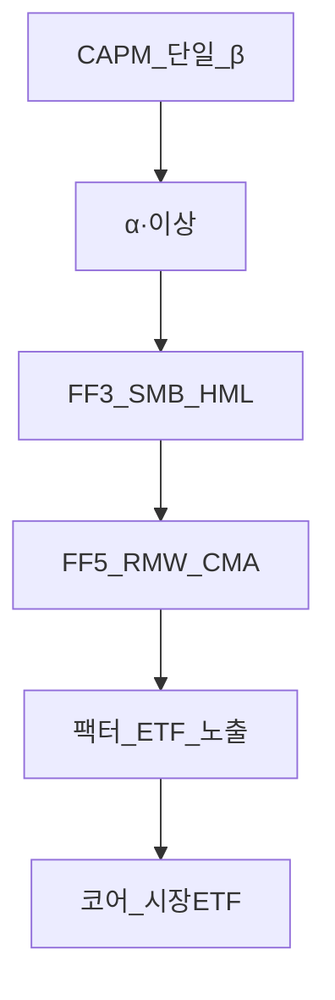
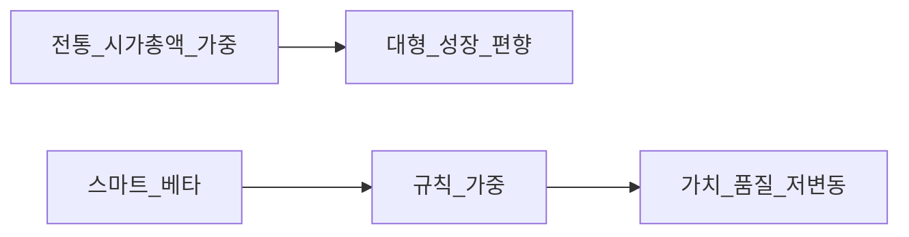

# 팩터 투자·Fama-French — FF3·FF5·한국 ETF

> **면책**: 교육 목적. **팩터 프리미엄**은 **소멸·역전·추적오차**할 수 있습니다. 과거 **HML·SMB** 수익이 미래를 보장하지 않습니다.

## 메타

| 항목 | 내용 |
|------|------|
| 최종 검증일 | 2026-05-24 |
| 난이도 | L4 (Graduate) — [READER-GUIDE](../docs/READER-GUIDE.md) |
| 예상 읽기 시간 | 150~180분 |
| 관련 bucket | Bucket 3 보조·코어 대비 |

## 0. 이 편 읽기 전 (5분)

| 항목 | 내용 |
|------|------|
| **난이도** | L4 (Graduate) — [READER-GUIDE §L등급](../docs/READER-GUIDE.md) |
| **선수** | 없음 |
| **이번 편에서 쓰는 기호** | 본문 §4·§4a 표 참고 |
| **복습 한 줄** | L3 선수 편을 먼저 읽으면 수식이 수월함 |


## TL;DR

1. **Fama-French 3요인(FF3)**: **시장(MKT)** + **규모(SMB)** + **가치(HML)**.
2. **FF5**: FF3 + **수익성(RMW)** + **투자(CMA)**.
3. **팩터 프리미엄** = **장기** **위험** **보상** **가설** — **이상** **재해석** ([EMH](market-efficiency-emh.md)).
4. **스마트 베타** = **규칙** **기반** **팩터** **노출** — **액티브** **아님** **완전** **패시브** **아님**.
5. **한국** **팩터** **ETF** — **가치·배당·모멘텀** **등** — **코어** **보조**·**과최적화** **주의**.
6. **섹터(AI·반도체)** ≠ **팩터** — [sector-investing-framework](../03-markets/sectors/sector-investing-framework.md).

---

## 1. 한 줄 정의 + 왜 중요한가
!!! info "SMB (Small Minus Big)"
    소형−대형 규모 팩터.

**정의**: **팩터 투자**는 **수익률 공분산**을 설명하는 **공통 특성(팩터)** 에 **체계적 노출**을 취하는 전략입니다. **Fama & French (1993, 2015)** 는 **CAPM** [capm-and-risk-return](capm-and-risk-return.md) **잔차** **이상**을 **다요인**으로 **설명**합니다.

**왜 중요한가**: “**가치 ETF** vs **QQQ** vs **코스닥**”을 **같은** **축**으로 **비교**합니다. **스마트 베타** **마케팅**과 **학술** **팩터**를 **구분**합니다.

---

## 2. 선수 / 이후

**선수**: [capm-and-risk-return](capm-and-risk-return.md), [factor-investing-primer](factor-investing-primer.md)  
**이후**: [market-efficiency-emh](market-efficiency-emh.md), [wacc-capital-structure](../09-corporate-finance/wacc-capital-structure.md)

---

## 3. 직관·비유

**시장(MKT)** = **전체** **경기** **파도**. **SMB** = **작은 배** — **파도**에 **더** **흔들림**. **HML** = **할인** **매장** — **싸게** **샀다** **오래** **보유**. **RMW** = **돈** **잘** **버는** **가게**. **CMA** = **과소비** **안** **하는** **가게** (**보수적** **투자**).

---

## 4. 정식 용어

| 약어 | English | 정의 |
|------|---------|------|
| MKT | Market | 시장 초과수익 |
| SMB | Small Minus Big | 소형 − 대형 |
| HML | High Minus Low | 고B/M − 저B/M (가치) |
| RMW | Robust Minus Weak | 고수익성 − 저수익성 |
| CMA | Conservative Minus Aggressive | 저투자 − 고투자 |
| FF3 | Fama-French 3-factor | MKT+SMB+HML |
| FF5 | 5-factor | FF3+RMW+CMA |
| α | Alpha | 팩터 후 잔차 |
| 스마트 베타 | Smart beta | 규칙형 팩터 ETF |
| 롱숏 | Long-short | 팩터 포트 (학술) |

### 4a. 핵심 용어 (본문 등장 순)

> 복습용. 정의는 §4 본표·[glossary](../00-roadmap/glossary.md)·본문 `!!! info` 박스.

| 용어 | 한 줄 | 관련 이론 | glossary |
|------|-------|-----------|----------|
| MKT | 시장 초과수익 | §4 | [glossary](../00-roadmap/glossary.md#mkt) |
| SMB | 소형 − 대형 | §4 | [glossary](../00-roadmap/glossary.md#smb) |
| HML | 고B/M − 저B/M | §4 | [glossary](../00-roadmap/glossary.md#hml) |
| RMW | 고수익성 − 저수익성 | §4 | [glossary](../00-roadmap/glossary.md#rmw) |
| CMA | 저투자 − 고투자 | §4 | [glossary](../00-roadmap/glossary.md#cma) |
| FF3 | MKT+SMB+HML | §4 | [glossary](../00-roadmap/glossary.md#ff3) |
| FF5 | FF3+RMW+CMA | §4 | [glossary](../00-roadmap/glossary.md#ff5) |
| α | 팩터 후 잔차 | §4 | [glossary](../00-roadmap/glossary.md#α) |
| 스마트 베타 | 규칙형 팩터 ETF | §4 | [glossary](../00-roadmap/glossary.md#스마트-베타) |
| 롱숏 | 팩터 포트 | §4 | [glossary](../00-roadmap/glossary.md#롱숏) |


---

## 5. 메커니즘



### 5.1 왜 CAPM만으로 부족한가

**롤링** **회귀**: **가치**·**소형** **포트**가 **시장** **β**만으로 **설명** **안** **되는** **평균** **수익** **차이**. **FF**는 **추가** **요인** **회귀**:

\[
R_{i,t} - R_{f,t} = \alpha_i + \beta_{i,M}(R_{M,t}-R_{f,t}) + \beta_{i,SMB} SMB_t + \beta_{i,HML} HML_t + \varepsilon_{i,t}
\]

**FF5**:

\[
+\beta_{i,RMW} RMW_t + \beta_{i,CMA} CMA_t
\]

### 5.2 팩터 포트 구성 (학술)

1. **유니버스** (예: NYSE+AMEX+NASDAQ)  
2. **Size** **중위** **분할** → **Big/Small**  
3. **B/M** **30/40/30** → **Value/Neutral/Growth**  
4. **6** **포트** **교차** — **SMB** = **평균** **소형** − **평균** **대형** (가치·성장 **각각**)

**한국**: **데이터** **벤더**·**ETF** **제공사** **규칙** **상이** — **추적오차** **원인**.

---

## 6. 각 팩터 심화

| 기호 | 이름 | 이 식에서 의미 |
|       ------       | ------ | ------이(가) 이 식에서 맡는 역할(§4·본문 참고) |
| SMB | 규모 팩터 | 소형−대형 초과수익 |
| HML | 가치 팩터 | 고B/M−저B/M 초과수익 |
| RMW | 수익성 팩터 | 견조−취약 수익성 |
| CMA | 투자 팩터 | 보수−공격 투자 |

### 6.1 SMB (규모)

**현상**: **소형주** **장기** **초과** (미국 **역사**).  
**해석**: (1) **유동성** **위험** (2) **뉴욕** **거래소** **최소** **시총** **필터** **생존편향** (3) **한국** **코스닥** — **규제**·**유동성** **별도**.

**투자**: **소형** **집중** = **SMB** **노출** + **비체계적** **리스크** — [kosdaq-tier-system](../03-markets/kosdaq-tier-system.md).

### 6.2 HML (가치)

**지표**: **P/B** **주** (P/E, **현금흐름** **보완**).  
**해석**: **위험** — **가치** **함정**(value trap)·**경기** **민감**; **행동** — **과잉** **비관**.

**한국**: **저PBR** **ETF**·**배당** — **금융**·**조선** **사이클** **섞임** — **순수** **가치** **아님**.

### 6.3 RMW (수익성) — FF5

**지표**: **영업이익/자본** 등 **견조** **수익성**.  
**직관**: **퀄리티** **근접** — **저수익** **성장주** **베팅** **과다** **시** **RMW** **낮은** **노출**.

### 6.4 CMA (투자 conservatism)

**지표**: **자산** **성장률** **낮은** vs **높은**.  
**직관**: **과도한** **CAPEX**·**M&A** **기대** **주의** — [wacc](../09-corporate-finance/wacc-capital-structure.md) **연결**.

### 6.5 모멘텀 (FF 외 확장)

**UMD**: **12-1** **개월** **수익** — **FF5** **에** **없음** — **별도** **팩터**. **크래시** **리스크** — **2009** **급반전**.

---

## 7. 팩터 프리미엄

| 질문 | 학술 답 | 실무 함의 |
|------|---------|-----------|
| 왜 존재? | **위험** **보상** | **장기** **보유** |
| 영구? | **불확실** | **소멸** **가능** |
| 공개 후? | **약화** **논쟁** | **비용** **중요** |
| 한국? | **표본** **짧음** | **보수** **해석** |

**팩터** **타이밍** — **학술** **불리** — **DCA** **유지** [rebalancing-and-dca](../04-portfolio/rebalancing-and-dca.md).

---

## 8. 스마트 베타



| | 시가총액 지수 | 스마트 베타 |
|--|---------------|-------------|
| 가중 | **시총** | **P/B**·**배당**·**변동성** |
| 비용 | **낮음** | **중간** |
| 추적 | **지수** | **커스텀** **규칙** |
| α 기대 | **0** (EMH) | **팩터** **프리미엄** **베팅** |

**주의**: **마케팅** **“알파”** — **실제**는 **팩터** **β** **노출**.

---

## 9. 한국 팩터 ETF (교육·비종목 추천)

> **상품명**은 **시점**별 **변경** — **투자** **권유** **아님**. **분류** **학습**용.

| 유형 | 대표적 접근 (카테고리) | 팩터 축 | 코어와 관계 |
|------|------------------------|---------|-------------|
| **시장** | KOSPI200·S&P500 ETF | MKT | **코어** |
| **가치/저PBR** | 저PBR·가치 ETF | HML 근사 | **보조** 10~20% |
| **배당** | 배당 ETF | **수익**·**가치** **혼합** | **소득** **목적** |
| **모멘텀** | 모멘텀·테마 | UMD | **턴오버** **↑** |
| **품질/ESG** | ESG·ROE | RMW 근사 | **섹터** **편향** **주의** |
| **소형** | 코스닥·소형 ETF | SMB | **Bucket** **4** **한도** |
| **미국 팩터** | KODEX·TIGER **MSCI** **가치** 등 | HML·RMW | **환헤지** **이슈** |

### 9.1 설계 체크리스트

1. **팩터** **정의** (P/B? 배당?)  
2. **리밸런싱** **주기** → **비용**  
3. **추적오차**·**괴리율**  
4. **세금** (배당·양도) — [isa](../06-korea-policy/isa.md)  
5. **코어** **중복** (이미 **KOSPI200** = **대형** **성장** **편향**)

### 9.2 한국 시장 특수

- **지수** **대형** **집중** — **삼성**·**SK하이닉스** — **MKT** = **반도체** **β** — [semiconductor](../03-markets/sectors/semiconductor.md)
- **가치** **ETF** **금융** **비중**  
- **모멘텀** **ETF** **단기** **회전** — **거래세**  
- **팩터** **프리미엄** **미국** **대비** **불안정** **표본**

---

## 10. 포트폴리오 통합 (교육)

| 슬롯 | 비중(가상) | 팩터 노출 |
|------|------------|-----------|
| 코어 QQQ+채권 | 70% | MKT·성장 |
| 가치 보조 | 15% | HML |
| 소형 | 5% | SMB |
| 현금 | 10% | — |

**β** **목표**: [capm](capm-and-risk-return.md) — **팩터** **추가** 시 **시장** **β** **+** **HML** **β**.

---


**Q. 실무에서는?**  
교과서 식·기호를 그대로 적용하기 전에 **수수료·세금·데이터 시점**을 분리한다. 숫자는 [DEPTH-STANDARD](../docs/DEPTH-STANDARD.md)처럼 기호만 먼저 맞추고, 법령·시장 수치는 §8 표·외부 출처로 갱신한다.

## 11. 숫자 예제 (가상)

### FF3 회귀 (가상)

| | β_M | β_SMB | β_HML | α(연) |
|--|-----|-------|-------|-------|
| 펀드 A | 1.1 | 0.3 | 0.5 | −0.5% |
| ETF B | 1.0 | 0.0 | 0.8 | 0.2% |

**해석**: B는 **가치** **순수** **노출** — **시장** **하락** 시 **HML** **방어** **여부** **별도**.

### 프리미엄 (가상 장기)

| 팩터 | 연율 프리미엄(가상) |
|------|---------------------|
| MKT | 5% |
| SMB | 2% |
| HML | 3% |
| RMW | 2% |
| CMA | 1% |

---


## 연습문제 (L4, 기호)

1. 위 §6 주요 식에서 변수 하나를 미지로 두고, 나머지를 기호로 둔 **관계식**을 쓰시오.
2. 가정이 깨질 때(유동성·세금·다중 IRR 등) 위 식의 **한계**를 기호·부등식으로 서술하시오.
3. §8 예제와 동일 기호(M·P·PV 등)로 **부호·단조성**만 검증하는 짧은 논증을 하시오.

### 해설 키

1. 직전 변수표의 「이 식에서 의미」를 이용해 동일 차원으로 정리한다.
2. 「가정이 깨지면」 절의 한계 사례와 연결한다.
3. 숫자 대입 없이 **부호**·**단위** 일치만 확인한다.
## 12. FAQ

**Q1.** FF3 vs FF5? — **5**가 **성장**·**투자** **이상** **추가** **설명**.  
**Q2.** 가치 ETF = HML? — **근사** — **규칙** **확인**.  
**Q3.** QQQ에 가치 섞기? — **성장**+**가치** **상쇄** — **의도** **설계**.  
**Q4.** 팩터만으로 충분? — [passive-vs-active](../04-portfolio/passive-vs-active.md) **코어** **우선**.  
**Q5.** AI 섹터 = 모멘텀? — **다름** — **산업** **베팅**.  
**Q6.** 한국 SMB? — **코스닥** **리스크** **큼**.  
**Q7.** 스마트 베타 수수료? — **시장** **ETF** **보다** **높은** **경우** **다수**.  
**Q8.** α 추구? — **팩터** **노출** **명시** — **숨은** **섹터** **주의**.

---

## 13. 함정

- **팩터** **채굴** — **백테스트** **만능**  
- **다팩터** **중복** — **실질** **MKT** **한** **번**  
- **리밸런싱** **세금**  
- **환헤지** **미국** **팩터**  
- **프리미엄** **소멸** **무시**

---

## 14. 퀴즈·부록

**퀴즈**: SMB 정의? HML? RMW? CMA? FF5 식?

---


## 부록 A — Carhart 4요인

**MKT+SMB+HML+UMD(모멘텀)** — **FF5** **와** **별도** **라인**.

---

## 부록 B — 팩터 투자 vs 액티브

| | 액티브 펀드 | 팩터 ETF |
|--|-------------|----------|
| 선택 | **재량** | **규칙** |
| 비용 | **높음** | **중간** |
| 투명성 | **낮음** | **높음** |
| α | **주장** | **팩터** **β** |

---

## 부록 C — 한국 학술·실무 (장문)

**서울대·연구소** **논문** — **한국** **HML** **유효** **기간** **제한**·**구조** **변화** **(chaebol**·**지배구조)**. **실무**: **연기금**·**자산운용** **멀티팩터** — **개인**은 **저비용** **복제** **어려움** → **ETF** **근사**.

---

## 부록 D — ESG·팩터

**ESG** **높은** **종목** = **대형**·**저변동** **편향** — **RMW**·**MKT** **혼합**. **탈탄소** = **에너지** **Underweight** — **섹터** **베팅**.

---

## 부록 E — 연습: 포트 팩터 노출

**70% QQQ, 30% 저PBR ETF** — **성장**+**가치** — **시장** **하락** **시** **시나리오** **2개** **작성**.

---

## 부록 F — primer와 차이

[factor-investing-primer](factor-investing-primer.md) **L3** — 본 문서 **L4** **FF** **정식**·**한국** **ETF** **맥락**.

---

## 부록 G — 학습 로드맵

**4주차** — **FF** **논문** **요약** **읽기**(선택), **ETF** **분해** **표** **작성**, **코어** **비중** **재확인**.

---

## 부록 H — FF3 회귀 해석 가이드 (장문)

**β_HML** **=** **0.8** → **가치** **팩터** **노출** **강함** — **시장** **하락** **국면**에서 **HML** **양(+)이면** **방어** **가능**(**역사적** **패턴** **불보장**). **β_SMB** **=** **0.5** → **소형** **민감** — **코스닥** **혼합** **펀드** **가능**. **α** **유의** → **모형** **밖** **스킬** **주장** — **비용** **전** **재검정**. **R²** **상승** — **CAPM** **대비** **설명력** **개선** — **≠** **투자** **성공**.

**한국** **펀드** **팩터** **로딩** — **공시** **없음** — **ETF** **분해** **표**만 **가능**.

---

## 부록 I — 팩터 프리미엄 역사·소멸 (교육)

| 시기 | 관찰 |
|------|------|
| 1990s | FF **HML** **강세** |
| 2000s | **가치** **함정** **논쟁** |
| 2010s | **성장** **대형** **우위** (미국) |
| 2020s | **팩터** **ETF** **AUM** **↑** **→** **약화** **가설** |

**교육**: **프리미엄** **=** **위험**이면 **소멸** **안** **해도** **됨** — **크기** **변동**.

---

## 부록 J — 한국 ETF 유형별 체크리스트 (15항)

1. 추적 **지수** **명칭** 2. **가중** (**시총** vs **P/B**) 3. **리밸런싱** 4. **보수** 5. **괴리율** 6. **배당** **처리** 7. **세금** 8. **환헤지** 9. **섹터** **상한** 10. **종목** **수** 11. **유동성** 12. **추적오차** **3년** 13. **MKT** **중복** 14. **HML** **순도** 15. **코어** **비중** **한도**

---

## 부록 K — 다팩터 포트 시뮬레이션 (가상)

**시장** **-20%** **월**: **MKT** **손실** **주도**. **동월** **HML** **+5%** (가상) → **가치** **보조** **-15%** **합산** **개선**. **SMB** **-10%** → **소형** **보조** **악화**. **교훈**: **보조** **완전** **헤지** **아님**.

---

## 부록 L — 모멘텀·퀄리티·저변동 확장

| 팩터 | ETF 라벨 | 주의 |
|------|----------|------|
| UMD | 모멘텀 | **급반전** |
| QMJ | 퀄리티 | **대형** **편향** |
| BAB | 저β | **레버** **내재** |

**FF5** **와** **중복** **노출** **진단** — **상관** **행렬** **작성**.

---

## 부록 M — 학술 vs 실무 격차

**학술**: **롱숏** **포트**, **월말** **리밸런스**, **거래비용** **무시** **근사**. **실무**: **롱온리** **ETF**, **일간** **괴리**, **분배금**. **격차** = **추적오차** + **세금**.

---

## 부록 N — 섹터·팩터 교차표 (교육)

| | HML 높음 | HML 낮음 |
|--|----------|----------|
| **반도체** | 장비 **저PBR**? | **성장** **고PER** |
| **금융** | **은행** **저PBR** | — |
| **바이오** | — | **고PER** |

**순수** **팩터** **아님** — **섹터** **베팅** **분리**.

---

## 부록 O — Robeco·AQR 스타일 (개념)

**멀티팩터** **통합** **스코어** — **개인** **복제** **불가** — **ETF** **근사** **만**.

---

## 부록 P — 연습: 회귀표 읽기

**가상** **표** **제공** — **β** **해석** **5문항** **작성**.

---

## 부록 Q — 코어-위성과 팩터

**코어** **70%** **MKT** + **위성** **15%** **HML** + **15%** **채권** — [asset-allocation](../04-portfolio/asset-allocation.md). **위성** **합** **>30%** → **팩터** **베팅** **과다**.

---

## 부록 R — FAQ 보충

**Q9.** **멀티팩터** **ETF** **하나**로 **충분**? — **편의** **↑** **투명성** **↓** — **분해** **읽기**.  
**Q10.** **팩터** **타이밍**? — **학술** **비추** — **DCA**.

---

## 부록 S — 12블록 복습 카드

**앞면**: SMB / **뒷면**: Small minus Big … **8장** **암기**.

---

## 부록 T — Fama-French 모형 심화·한국 적용 (교육용 장문)

**Fama-French 3요인**은 **CAPM의 단일 β**가 **평균 수익률 단면(cross-section)**을 **충분히 설명하지 못한다**는 **경험적 발견**에서 출발했다. **SMB**는 **소형주가 대형주보다 높은 평균 수익**을 보인다는 **규칙성**을 **포착**하고, **HML**은 **장부가 대비 시가가 낮은(가치) 종목**이 **높은(성장) 종목**보다 **높은 수익**을 보인다는 **규칙성**을 **포착**한다. **학술적 해석**은 **위험 프리미엄**이다. **소형·가치**는 **경기 침체·유동성 위기**에 **더 취약**할 수 있으며, **투자자**는 **그 대가**로 **장기 초과수익**을 **요구**한다는 **이야기**다. **행동적 해석**은 **과잉 반응·과소 반응**으로 **일시적 오가격**이 **존재**한다는 **것**이다. **투자 설계**에서는 **어느 쪽이 진실이든** **팩터 노출**은 **추가 위험**을 **의미**한다.

**FF5**는 **성장주·고투자 기업**의 **수익률**을 **더 잘 설명**하기 위해 **RMW(수익성)**와 **CMA(투자 보수성)**를 **추가**했다. **직관**: **돈을 잘 버는 회사**와 **무리한 확장을 하지 않는 회사**가 **장기적으로** **우수**했다는 **경험**이다. **한국** **시장**에서 **FF5** **요인**의 **유효성**은 **미국**보다 **표본이 짧고** **구조적** **특수성**( **대기업 집중**·**지배구조**·**금융** **비중**)이 **커서** **보수적** **해석**이 **필요**하다.

**스마트 베타 ETF**는 **학술 팩터**를 **규칙**으로 **구현**한 **상품**이다. **시가총액 가중 지수**와 **달리** **P/B·배당·변동성** 등으로 **가중**한다. **장점**은 **투명성**과 **팩터** **노출** **명시**다. **단점**은 **추적오차**·**리밸런싱 비용**·**섹터** **편향**·**팩터** **크라우딩**이다. **한국** **상장** **팩터** **ETF**는 **가치(저PBR)·배당·모멘텀·ESG·소형** 등 **라벨**이 **다양**하다. **투자자**는 **라벨**이 **아니라** **지수** **방법론**을 **읽어야** 한다. **“가치 ETF”**가 **금융·조선**에 **쏠려** 있으면 **HML** **순수** **노출**이 **아닐** **수** 있다.

**코어-위성** **전략**에서 **팩터**는 **위성** **10~20%** **한도**가 **합리적**이다. **QQQ(성장·대형·미국)** **코어**에 **저PBR** **한국** **ETF**를 **섞으면** **성장+가치** **혼합**이 **되어** **의도**를 **명확히** **해야** 한다. **시장** **하락** **국면**에서 **HML**이 **방어**할 **수도** **있으나** **보장**되지 **않는다**. **2008** **가치** **함정**, **2020~21** **성장** **우위**는 **팩터** **타이밍** **위험**을 **보여** 준다.

**팩터 프리미엄** **소멸** **논쟁**: **공개** **이후** **수익** **감소** **연구**가 **있으나** **완전** **소멸** **증거**는 **아니다**. **개인** **행동** **규칙**: (1) **팩터** **ETF** **추가** **전** **코어** **비중** **확정** (2) **중복** **팩터** **금지** (3) **연** **1회** **리밸런싱** (4) **백테스트** **수익** **맹신** **금지**. **본 문서**는 [factor-investing-primer](factor-investing-primer.md) **L3**를 **심화**하며, [market-efficiency-emh](market-efficiency-emh.md) **이상** **재해석**과 **연결**된다.

---

## 부록 U — 팩터·섹터·테마 매트릭스 (교육)

| 질문 | 팩터 | 섹터 | 테마 |
|------|------|------|------|
| 무엇에 베팅? | 가치·규모·모멘텀 | 산업 | AI·2차전지 |
| 분산 | 교차 종목 | 업종 내 | 좁음 |
| 한국 ETF | 저PBR 등 | 반도체 ETF | 테마 ETF |
| 본 저장소 | 보조 | 섹터 문서 | Bucket 4 |


## 부록 V — FF 회귀 Stata/R 의사코드 (교육)

```
# Ri-Rf = a + b_M*(Rm-Rf) + b_S*SMB + b_H*HML + e
# Newey-West t-stat on 60 months
```

**해석** **보고서** **템플릿**: **α** **t값**, **β** **경제적** **크기**, **R²** **변화**.

---

## 부록 W — 한국 팩터 ETF due diligence (장문)

**Step 1**: **KRX** **지수** **규모** **방법** **PDF** **다운로드**. **Step 2**: **구성종목** **상위** **10** **섹터** **비중**. **Step 3**: **연간** **턴오버** **추정**. **Step 4**: **총보수**·**거래비용** **합**. **Step 5**: **3년** **추적오차**. **Step 6**: **코어** **MKT** **중복** **계산**. **Step 7**: **ISA** **적격**. **Step 8**: **결론** — **보조** **유지** **또는** **제외**.

**금지**: **백테스트** **1년** **만** **보고** **매수**. **권장**: **5년** **이상** **+** **최악** **구간** **포함**.

---

## 부록 X — 팩터 크라우딩·용량 (교육)

**AUM** **↑** → **프리미엄** **↓** **가설**. **소형** **팩터** **용량** **작음** — **개인** **자금** **규모** **대비** **영향** **미미**하나 **ETF** **괴리** **주의**. **모멘텀** **크래시** **월** **역사** **표** **작성**.

---

## 부록 Y — CAPM-FF-섹터 3층 모델

**1층** **MKT** (QQQ·KOSPI200) → **2층** **HML/SMB** (보조 ETF) → **3층** **섹터** (반도체 등) — **각** **층** **목적** **문장** **1개** **씩** **작성**.


## 부록 Z — 스마트 베타·한국 ETF 실무 시나리오 (교육 장문)

시나리오 A: 코어 70% KOSPI200 ETF + 15% 저PBR ETF + 15% 국채. 시장 하락 시 MKT 손실이 주도되고, HML 노출이 부분 완충될 수 있으나 보장되지 않는다. 리밸런싱은 연 1회.

시나리오 B: QQQ 60% + 미국 가치 ETF 20% + 채권 20%. 달러·성장·가치·금리가 동시에 작동한다. 환헤지 여부를 별도 문서에서 점검한다.

시나리오 C: 모멘텀 ETF 30%를 코어에 추가. 턴오버·거래세·추적오차가 커지고 2022형 모멘텀 급반전 리스크가 있다. Bucket 4 한도 검토.

시나리오 D: ESG ETF를 퀄리티 대용으로 사용. 실질 노출은 대형·저변동·특정 섹터 underweight일 수 있다. RMW 순수 노출이 아닐 수 있음.

시나리오 E: 코스닥 소형 ETF로 SMB 추구. 비체계적 리스크·유동성·공시 리스크가 팩터 프리미엄을 잠식할 수 있다.

공통 교훈: 팩터 라벨보다 지수 방법론 PDF를 읽는다. 백테스트 1년 수익률만으로 매수하지 않는다. 코어 비중을 먼저 고정한다.

FF5 회귀에서 α가 유의해도 펀드가 미래 α를 낸다는 보장은 없다. β 해석으로 노출을 관리하는 것이 개인에게 현실적이다.


## 부록 AA — FF3·FF5·한국 ETF 최종 정리 (교육 장문)

**MKT**는 시장 베타, **SMB**는 소형 대형, **HML**은 가치 대 성장, **RMW**는 수익성, **CMA**는 보수적 투자 대 공격적 투자다. FF3는 CAPM 확장, FF5는 성장·투자 이상 추가 설명이다. 팩터 프리미엄은 위험 보상이거나(합리) 오가격(행동)일 수 있다. 스마트 베타 ETF는 규칙 기반 노출이며 액티브 스킬 주장과 다르다. 한국 저PBR·배당·모멘텀·ESG·소형 ETF는 라벨이 아니라 지수 PDF로 검증한다. 코어 70%+ 시장 ETF, 보조 10~20% 팩터, 섹터·테마는 별도 한도가 합리적이다. 백테스트·1년 수익·팩터 타이밍 맹신은 금지. [factor-investing-primer](factor-investing-primer.md) L3에서 본 L4로 심화했으며 [market-efficiency-emh](market-efficiency-emh.md)와 [capm-and-risk-return](capm-and-risk-return.md)과 함께 읽는다.


**교육 메모**: 본 장은 L4 graduate 수준으로 시장 효율성·파생·팩터·WACC를 한국 투자자 맥락에서 통합한다. 수치·종목은 가상이며 실행 전 공식 출처를 확인한다. 코어는 저비용 인덱스, 보조는 한도 내 팩터, 파생 투기는 비권장, 밸류에이션은 WACC 민감도를 본다. 
**교육 메모**: 본 장은 L4 graduate 수준으로 시장 효율성·파생·팩터·WACC를 한국 투자자 맥락에서 통합한다. 수치·종목은 가상이며 실행 전 공식 출처를 확인한다. 코어는 저비용 인덱스, 보조는 한도 내 팩터, 파생 투기는 비권장, 밸류에이션은 WACC 민감도를 본다. 
**교육 메모**: 본 장은 L4 graduate 수준으로 시장 효율성·파생·팩터·WACC를 한국 투자자 맥락에서 통합한다. 수치·종목은 가상이며 실행 전 공식 출처를 확인한다. 코어는 저비용 인덱스, 보조는 한도 내 팩터, 파생 투기는 비권장, 밸류에이션은 WACC 민감도를 본다. 
**교육 메모**: 본 장은 L4 graduate 수준으로 시장 효율성·파생·팩터·WACC를 한국 투자자 맥락에서 통합한다. 수치·종목은 가상이며 실행 전 공식 출처를 확인한다. 코어는 저비용 인덱스, 보조는 한도 내 팩터, 파생 투기는 비권장, 밸류에이션은 WACC 민감도를 본다. 
**교육 메모**: 본 장은 L4 graduate 수준으로 시장 효율성·파생·팩터·WACC를 한국 투자자 맥락에서 통합한다. 수치·종목은 가상이며 실행 전 공식 출처를 확인한다. 코어는 저비용 인덱스, 보조는 한도 내 팩터, 파생 투기는 비권장, 밸류에이션은 WACC 민감도를 본다. 
**교육 메모**: 본 장은 L4 graduate 수준으로 시장 효율성·파생·팩터·WACC를 한국 투자자 맥락에서 통합한다. 수치·종목은 가상이며 실행 전 공식 출처를 확인한다. 코어는 저비용 인덱스, 보조는 한도 내 팩터, 파생 투기는 비권장, 밸류에이션은 WACC 민감도를 본다. 
**교육 메모**: 본 장은 L4 graduate 수준으로 시장 효율성·파생·팩터·WACC를 한국 투자자 맥락에서 통합한다. 수치·종목은 가상이며 실행 전 공식 출처를 확인한다. 코어는 저비용 인덱스, 보조는 한도 내 팩터, 파생 투기는 비권장, 밸류에이션은 WACC 민감도를 본다. 
**교육 메모**: 본 장은 L4 graduate 수준으로 시장 효율성·파생·팩터·WACC를 한국 투자자 맥락에서 통합한다. 수치·종목은 가상이며 실행 전 공식 출처를 확인한다. 코어는 저비용 인덱스, 보조는 한도 내 팩터, 파생 투기는 비권장, 밸류에이션은 WACC 민감도를 본다. 
**교육 메모**: 본 장은 L4 graduate 수준으로 시장 효율성·파생·팩터·WACC를 한국 투자자 맥락에서 통합한다. 수치·종목은 가상이며 실행 전 공식 출처를 확인한다. 코어는 저비용 인덱스, 보조는 한도 내 팩터, 파생 투기는 비권장, 밸류에이션은 WACC 민감도를 본다. 
**교육 메모**: 본 장은 L4 graduate 수준으로 시장 효율성·파생·팩터·WACC를 한국 투자자 맥락에서 통합한다. 수치·종목은 가상이며 실행 전 공식 출처를 확인한다. 코어는 저비용 인덱스, 보조는 한도 내 팩터, 파생 투기는 비권장, 밸류에이션은 WACC 민감도를 본다. 
**교육 메모**: 본 장은 L4 graduate 수준으로 시장 효율성·파생·팩터·WACC를 한국 투자자 맥락에서 통합한다. 수치·종목은 가상이며 실행 전 공식 출처를 확인한다. 코어는 저비용 인덱스, 보조는 한도 내 팩터, 파생 투기는 비권장, 밸류에이션은 WACC 민감도를 본다. 
**교육 메모**: 본 장은 L4 graduate 수준으로 시장 효율성·파생·팩터·WACC를 한국 투자자 맥락에서 통합한다. 수치·종목은 가상이며 실행 전 공식 출처를 확인한다. 코어는 저비용 인덱스, 보조는 한도 내 팩터, 파생 투기는 비권장, 밸류에이션은 WACC 민감도를 본다. 
**교육 메모**: 본 장은 L4 graduate 수준으로 시장 효율성·파생·팩터·WACC를 한국 투자자 맥락에서 통합한다. 수치·종목은 가상이며 실행 전 공식 출처를 확인한다. 코어는 저비용 인덱스, 보조는 한도 내 팩터, 파생 투기는 비권장, 밸류에이션은 WACC 민감도를 본다. 
**교육 메모**: 본 장은 L4 graduate 수준으로 시장 효율성·파생·팩터·WACC를 한국 투자자 맥락에서 통합한다. 수치·종목은 가상이며 실행 전 공식 출처를 확인한다. 코어는 저비용 인덱스, 보조는 한도 내 팩터, 파생 투기는 비권장, 밸류에이션은 WACC 민감도를 본다. 
**교육 메모**: 본 장은 L4 graduate 수준으로 시장 효율성·파생·팩터·WACC를 한국 투자자 맥락에서 통합한다. 수치·종목은 가상이며 실행 전 공식 출처를 확인한다. 코어는 저비용 인덱스, 보조는 한도 내 팩터, 파생 투기는 비권장, 밸류에이션은 WACC 민감도를 본다. 
**교육 메모**: 본 장은 L4 graduate 수준으로 시장 효율성·파생·팩터·WACC를 한국 투자자 맥락에서 통합한다. 수치·종목은 가상이며 실행 전 공식 출처를 확인한다. 코어는 저비용 인덱스, 보조는 한도 내 팩터, 파생 투기는 비권장, 밸류에이션은 WACC 민감도를 본다. 
**교육 메모**: 본 장은 L4 graduate 수준으로 시장 효율성·파생·팩터·WACC를 한국 투자자 맥락에서 통합한다. 수치·종목은 가상이며 실행 전 공식 출처를 확인한다. 코어는 저비용 인덱스, 보조는 한도 내 팩터, 파생 투기는 비권장, 밸류에이션은 WACC 민감도를 본다. ---

**L4 완료**: [DEPTH-STANDARD](../docs/DEPTH-STANDARD.md).