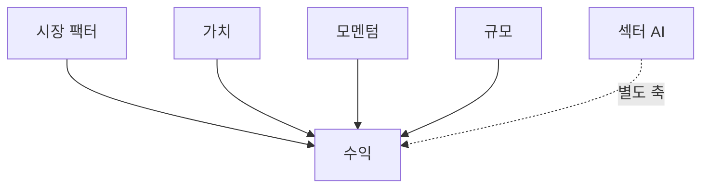
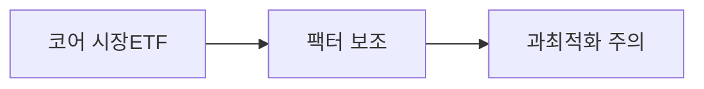
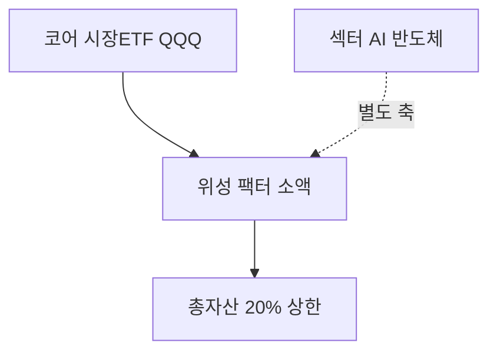

# 팩터 투자 입문

> **면책**: 교육 목적. 팩터 프리미엄은 소멸·역전할 수 있습니다.

## 메타

| 항목 | 내용 |
|------|------|
| 최종 검증일 | 2026-05-24 |
| 난이도 | L3 (Deep) — [READER-GUIDE](../docs/READER-GUIDE.md) |
| 예상 읽기 시간 | 40~50분 |
| 관련 bucket | Bucket 3 보조·코어 단순화와 대비 |

## 0. 이 편 읽기 전 (5분)

| 항목 | 내용 |
|------|------|
| **난이도** | L3 (Deep) — [READER-GUIDE §L등급](../docs/READER-GUIDE.md) |
| **선수** | 없음 |
| **이번 편에서 쓰는 기호** | 본문 §4·§4a 표 참고 |
| **복습 한 줄** | — |

## TL;DR

1. **팩터** = 수익을 설명하는 **공통 특성**(가치·규모·모멘텀 등).
2. **CAPM 확장** — 시장 β 외 **추가 노출**.
3. **팩터 ETF** — 코어 **보조** 가능, **과최적화** 주의.
4. **섹터 테마**(AI·반도체) ≠ 팩터 — **목적** 다름.
5. [passive-vs-active](../04-portfolio/passive-vs-active.md) — **시장 ETF만**으로도 충분.

## 1. 한 줄 정의 + 왜 중요한가
!!! info "SMB (Small Minus Big)"
    소형−대형 규모 팩터.

**정의**: **팩터 투자**는 특정 **특성(팩터)** 에 체계적 **노출**을 취해 장기 **위험 프리미엄**을 받으려는 전략입니다.

!!! info "CAPM (Capital Asset Pricing Model)"
    β로 기대수익을 설명하는 단일요인 모형.

!!! info "ETF"
    지수·자산 **바구니**를 한 종목처럼 거래

**왜 중요한가**: “QQQ vs 가치 ETF vs 코스닥 소형”을 **같은 말**로 비교하지 않게 합니다. **섹터 베팅**과 **팩터**를 분리하면 포트 설계가 선명해집니다.

## 2. 선수 / 이후

**선수**: [capm-and-risk-return.md](capm-and-risk-return.md)  
**이후**: Fama-French 3/5 factor 논문, [sector-investing-framework](../03-markets/sectors/sector-investing-framework.md)

## 3. 직관·비유

**핵심은:** 팩터 투자는 "시장 전체가 아닌, 특정 특성(팩터)을 가진 주식들이 장기적으로 초과수익을 낸다"는 실증 발견에 기반한 투자 전략입니다.

**비유 1 — 시장 베타는 전체 경기에 베팅**
코스피·S&P500 전체에 투자하는 것이 시장 베타 노출입니다. 경기가 좋으면 같이 오르고, 나쁘면 같이 내립니다. 가장 기본적인 팩터입니다.

**비유 2 — 가치 팩터는 "싸게 파는 팀"에 베팅**
쉽게 말하면: 시장에서 저평가된 주식들(낮은 PBR, 낮은 PER)을 모아서 투자하는 것입니다. 이마트 특가 세일처럼 본질 대비 싼 것을 골라 장기 보유하는 전략입니다.

**비유 3 — 모멘텀은 "최근 잘하는 팀"에 베팅**
최근 6~12개월간 오른 주식이 단기적으로 더 오르는 경향을 활용합니다. 스포츠에서 '핫 스트릭(hot streak)'이 있는 팀에 베팅하는 것과 비슷합니다.

**비유 4 — 섹터 투자는 팩터 투자가 아님**
"AI 섹터에 투자한다"는 특정 산업에 베팅하는 것으로, 팩터 투자(가치·규모·모멘텀 등)와는 다른 개념입니다. 팩터는 산업을 가리지 않고 특성만 봅니다.

**스마트 베타 ETF 선택 시 주의할 점:**
팩터 ETF를 고를 때 이름이 아닌 실제 지수 방법론을 확인해야 합니다. "가치 ETF"라고 이름이 붙어 있어도 실제로 어떤 기준으로 종목을 선정하는지, 리밸런싱 주기는 어떻게 되는지, 수수료(TER)는 얼마인지가 핵심입니다.

**이 이론의 한계는 다음과 같습니다:** 팩터 프리미엄은 발견된 후 많은 자금이 몰리면 약해질 수 있습니다(크라우딩). 또한 학술 롱숏 팩터 포트폴리오와 실제 ETF 성과는 수수료·거래비용·추적오차로 크게 다를 수 있습니다.

## 4. 정식 용어

| 팩터 | 설명 | 대표 지표 |
|------|------|----------------|
| 시장(MKT) | 베타 | 시장 지수 |
| 규모(SMB) | 소형주 | 시가총액 |
| 가치(HML) | 저평가 | P/B, P/E |
| 모멘텀(UMD) | 과거 강세 | 12-1개월 |
| 퀄리티(QMJ) | 수익성·안정 | ROE 등 |
| 저변동 | 낮은 σ | 역사적 변동성 |

### 4a. 핵심 용어 (본문 등장 순)

> 복습용. 정의는 §4 본표·[glossary](../00-roadmap/glossary.md)·본문 `!!! info` 박스.

| 용어 | 한 줄 | 관련 이론 | glossary |
|------|------|------|----------------|
| 팩터 | 대표 지표 | §4 | [glossary](../00-roadmap/glossary.md#팩터) |
| 시장(MKT) | 시장 지수 | §4 | [glossary](../00-roadmap/glossary.md#시장) |
| 규모(SMB) | 시가총액 | §4 | [glossary](../00-roadmap/glossary.md#규모) |
| 가치(HML) | P/B, P/E | §4 | [glossary](../00-roadmap/glossary.md#가치) |
| 모멘텀(UMD) | 12-1개월 | §4 | [glossary](../00-roadmap/glossary.md#모멘텀) |
| 퀄리티(QMJ) | ROE 등 | §4 | [glossary](../00-roadmap/glossary.md#퀄리티) |
| 저변동 | 역사적 변동성 | §4 | [glossary](../00-roadmap/glossary.md#저변동) |

## 5. 메커니즘

## 6. 수식·모델

| 기호 | 이름 | 이 식에서 의미 |
|------|------|----------------|
| **Ri** | 자산 i의 수익률 | 해당 기간 초과 수익 |
| **Rf** | 무위험금리 | 국채·예금 등 기준 금리 |
| **α** | 알파 | 팩터 설명 후 잔차 초과수익 |
| **βmkt** | 시장 β | 시장 요인 민감도 |
| **βSMB** | 규모 β | SMB 팩터 민감도 |
| **βHML** | 가치 β | HML 팩터 민감도 |
| **SMB** | 소형-대형 팩터 | 소형주 - 대형주 수익 |
| **HML** | 고B/M-저B/M 팩터 | 가치주 - 성장주 수익 |

**Fama-French 3요인 회귀식**:

\[
R_i - R_f = \alpha + \beta_{\text{mkt}}(R_m - R_f) + \beta_{\text{SMB}}\text{SMB} + \beta_{\text{HML}}\text{HML} + \epsilon
\]

**식 (기호)**: **R_i** - **R_f** = **α** + **β_mkt**(**R_m** - **R_f**) + **β_SMB**·**SMB** + **β_HML**·**HML** + **ε**

**읽는 법**: 자산 i의 초과수익은 시장 요인, 규모 요인, 가치 요인 세 가지로 분해됩니다. 설명되지 않는 나머지가 α입니다. [DEPTH-STANDARD](../docs/DEPTH-STANDARD.md) 참고.

심화: FF5(+RMW, CMA), Carhart 4요인(+모멘텀) → [factor-investing-fama-french](factor-investing-fama-french.md).

## 7. 한국 적용

### 7.1 국면별 팩터 성과 (교육, 역사적 경향 — 미래 보장 X)

| 국면 | 상대적 강세 팩터(경향) | 약세 |
|------|------|----------------|
| 금리 상승·인플레 | 가치·저변동 | 성장·모멘텀 |
| 금리 하락·성장 | 성장·모멘텀 | 가치 |
| 버블 붕괴 후 | 가치·퀄리티 | 모멘텀(추격 손실) |

### 7.2 QQQ·섹터·팩터 매핑

| 포지션 | 팩터 노출 | 섹터? |
|------|------|----------------|
| QQQ | 시장·성장·대형·모멘텀 | 기술 **집중** |
| 국내 AI ETF | 섹터 + 성장 | **예** |
| 가치 ETF | HML | **아니오** |
| 코스닥 소형 3종 | SMB + Idio | 부분 |

### 7.3 2025 vs 2026

| | 내용 |
|--|------|
| 2025 | 팩터 ETF **보수 경쟁** — 추적오차 비교 |
| 2026 | ISA 한도↑ → 팩터 **보조** 편입 비용 감소 가능 |

### 7.4 팩터 ETF 선택 체크리스트

| # | 확인 |
|---|------|
| 1 | **추적 지수** 정의(가치·모멘텀·규모) |
| 2 | **총보수**(TER)·추적오차 |
| 3 | QQQ·섹터 ETF와 **상관** — 중복 노출 |
| 4 | ISA·IRP **상품목록** |
| 5 | 백테스트 **기간·생존편향** |

### 7.5 코어-위성에서 팩터 위치

| | 코어 | 팩터 위성 | 섹터 위성 |
|------|------|------|----------------|
| 목적 | 시장 β | 가치·규모 등 | 산업 베팅 |
| QQQ 중복 | — | **일부** | **높음** |
| bucket | 3 | 3~4 | **4** |

**법·정책 근거**: 해당 없음(전략). 상장 ETF는 금융투자업규정·투자설명서·KRX 공시.

### 7.6 학술·실무 연결 (교육)

| 모델 | 저자·연도(대표) | 실무 함의 |
|------|------|----------------|
| CAPM | Sharpe 등 | β·시장 노출 |
| FF3 | Fama-French 1993 | 가치·규모 |
| Carhart | 1997 | 모멘텀 |
| QMJ | 이후 | 퀄리티 |

**한국 시장**: 팩터 프리미엄은 **미국과 동일하지 않을** 수 있습니다. 소액·개인은 **시장 ETF 코어 + 팩터 1~2개**로 단순화하고, [passive-vs-active.md](../04-portfolio/passive-vs-active.md)와 대조하세요.

## 8. 숫자 예제 (가상)

> 가상 인물·비중.

### 예제 1: 단순 코어 (가상)

| | 비중 |
|--|------|
| 시장 ETF | 70% |
| 가치 | 15% |
| 채권 | 15% |

### 예제 2: QQQ vs 가치 (가상)

| 국면 | QQQ | 가치 |
|------|------|----------------|
| 금리↓ 성장 | **우세** | 상대 약세 |
| 인플레 역전 | 상대 약세 | **우세** 가능 |

### 예제 3: 팩터 남발 (가상)

| | 가상 AK |
|--|---------|
| 팩터 ETF 5개 | **상관 중복** |
| 보수 합 | **1.2%/년** |

### 예제 4: ISA 안 팩터+QQQ (가상)

| | 비중 | bucket |
|------|------|----------------|
| QQQ | 60% | 코어 |
| 국내 가치 | 25% | 팩터 보조 |
| 현금 | 15% | 유동 |

### 예제 5: DB 가입자 (가상)

| | 가상 AM |
|--|---------|
| DB | 팩터 **통제 불가** |
| IRP | 시장+가치 **단순 2팩터** |

## 9. FAQ

**Q1.** 팩터 vs 섹터? — 섹터=**산업**, 팩터=**특성**.  
**Q2.** 항상 이기나? — **아니오** — 국면별.  
**Q3.** AI 주식? — 성장·모멘텀 **중복**.  
**Q4.** 필수? — **아니오**.  
**Q5.** QLD? — 팩터 **아님**.  
**Q6.** 백테스트? — **과신** 금물.  
**Q7.** DB? — **무관**.  
**Q8.** 코스닥 티어? — **규모·유동성** 리스크.

**Q9. 팩터 ETF 5개는?**  
**A9.** **과최적화**·보수 중복 — 코어 **시장 1 + 팩터 1** 단순화.

**Q10. NXT·장후와 팩터?**  
**A10.** **무관** — 거래 빈도·FOMO 이슈 — [fomo-and-trading-hours.md](../05-behavioral/fomo-and-trading-hours.md).

**Q11. 팩터만으로 10년 10억?**  
**A11.** **보장 없음** — 납입·세제·β·운이 복합. 코어 **시장 ETF**가 기본, 팩터는 **보조**.

### 실행 워크숍 체크리스트 (교육)

| # | 질문 | Yes 시 다음 문서 |
|------|------|----------------|
| 1 | 해외 ETF·주식을 보유 중인가? | [overseas-stocks-tax-part1-cgt.md](overseas-stocks-tax-part1-cgt.md) |
| 2 | 해외 배당이 연 500만 이상인가? | [part2-dividend](overseas-stocks-tax-part2-dividend.md) |
| 3 | DB 재직인가? | [db-pension.md](../db-pension.md) + IRP·ISA |
| 4 | 국내주식을 NXT에서 거래하는가? | [korea-ats-nextrade.md](../03-markets/korea-ats-nextrade.md) |
| 5 | 10년 코어가 QQQ인가? | [isa.md](../isa.md) 또는 [isa-irp-pension-tax.md](isa-irp-pension-tax.md) |

위 표는 **의사결정 보조**이며, 개인 소득·가구·회사 제도에 따라 답이 달라집니다. 불확실하면 [investment-tax-overview.md](investment-tax-overview.md) → [account-product-tax-map.md](account-product-tax-map.md) 순으로 읽으세요.

## 10. 함정·리스크·한계

- 팩터 ETF **남발**  
- **백테스트** 과신  
- **섹터=팩터** 혼동  
- **QQQ**에 모든 팩터 기대  
- **프리미엄 소멸**

---

**Q. 실무에서는?**  
교과서 식·기호를 그대로 적용하기 전에 **수수료·세금·데이터 시점**을 분리한다. 숫자는 [DEPTH-STANDARD](../docs/DEPTH-STANDARD.md)처럼 기호만 먼저 맞추고, 법령·시장 수치는 §8 표·외부 출처로 갱신한다.

## L3 보충 — 장기 자산 형성 연결

본 절은 [DEPTH-STANDARD.md](../../docs/DEPTH-STANDARD.md) L3 게이트를 충족하기 위한 **실행·교차 링크** 보충입니다.

### Bucket·현금흐름 연결

| Bucket | 대표 제도·자산 | 본 문서와의 관계 |
|------|------|----------------|
| 0 | 비상금 MMDA | 세금·투자 **전** 우선 |
| 1 | [청년도약](../06-korea-policy/youth-leap-account.md)·[미래적금](../06-korea-policy/youth-future-savings.md) | 정책 적금 — 주식 **대체 아님** |
| 2a | DB·DC | [db-vs-dc-pension.md](../06-korea-policy/db-vs-dc-pension.md) |
| 2b | ISA·IRP | [isa.md](../06-korea-policy/isa.md)·[isa-irp-pension-tax.md](../06-korea-policy/tax/isa-irp-pension-tax.md) |
| 3 | QQQ·채권 코어 | [capm-and-risk-return.md](../08-advanced/capm-and-risk-return.md) |
| 4 | NXT·코스닥·QLD | [fomo-and-trading-hours.md](../05-behavioral/fomo-and-trading-hours.md) |

### 연간 점검 루틴 (교육)

| 분기 | 할 일 |
|------|--------|
| Q1 | [investment-tax-overview.md](../06-korea-policy/tax/investment-tax-overview.md) 캘린더 확인 |
| Q2 | [rebalancing-and-dca.md](../04-portfolio/rebalancing-and-dca.md) 코어 비중 |
| Q3 | 해외 배당·금융소득 **누적** — Part2 |
| Q4 | 익년 **5월** 양도세 자료 정리 — Part1 |
| ISA | 개설일 +36개월 **만기** 알림 |

### 2025 vs 2026 정책 추적

| 항목 | 확인 출처 |
|------|-----------|
| ISA 한도·비과세 | 금융위·조세특례 시행일 |
| DC +300만 공제 | 국세청·통합연금포털 |
| 청년도약 일몰·미래적금 | [kinfa](https://ylaccount.kinfa.or.kr) |
| 금융투자소득세 | 금융위 보도·[sources.md](../../references/sources.md) |
| NXT 종목·거래중단 | [nextrade.co.kr](https://www.nextrade.co.kr) |

**면책 재확인**: 가상 예제·보도 수치는 **시점별 개정**됩니다. 실행·신고 전 공식 출처를 확인하세요.

## 11. 심화 읽기

- Fama-French 원전  
- [capm-and-risk-return.md](capm-and-risk-return.md)  
- [core-satellite-framework.md](../04-portfolio/core-satellite-framework.md)

## 12. 퀴즈

1. 가치 팩터 한 줄?  
2. QQQ 스타일?  
3. 팩터 투자 목적?  
4. AI 섹터 = 가치?  
5. 코어만으로 충분?

힌트
1. 저평가 2. 성장·대형 3. 체계적 노출 4. 아니오 5. 예
