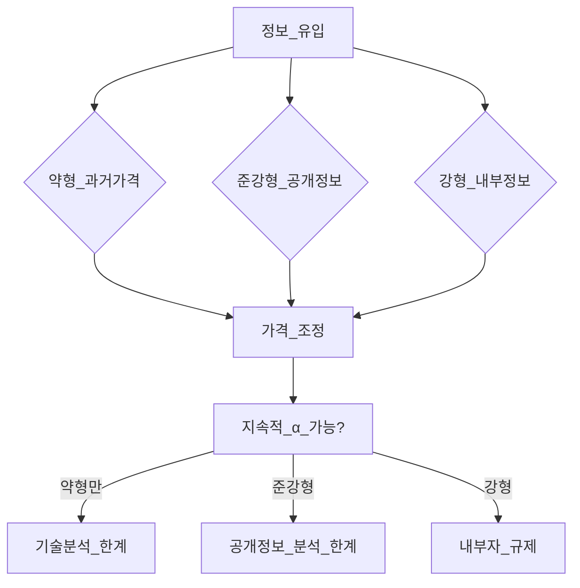
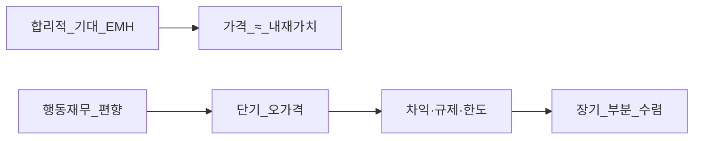

# 시장 효율성·EMH — 약형·준강형·강형과 한국 논쟁

> **면책**: 본 문서는 교육 목적이며, 특정 개인·법인에 대한 투자·세무·법률 자문이 아닙니다. EMH는 **규범적·경험적 논쟁**이 있는 이론이며, “시장이 항상 옳다”는 뜻이 아닙니다. 실행 전 공식 출처·본인 위험감내도를 확인하세요.

## 메타

| 항목 | 내용 |
|------|------|
| 최종 검증일 | 2026-05-24 |
| 정책·법령 기준일 | 해당 없음(이론·시장 구조) |
| 난이도 | L4 (Graduate) — [READER-GUIDE](../docs/READER-GUIDE.md) |
| 예상 읽기 시간 | 150~180분 |
| 관련 bucket | Bucket 3~4 (패시브 코어 vs 액티브·테마 베팅 판단) |

## 0. 이 편 읽기 전 (5분)

| 항목 | 내용 |
|------|------|
| **난이도** | L4 (Graduate) — [READER-GUIDE §L등급](../docs/READER-GUIDE.md) |
| **선수** | [stocks-equities-intro](../03-markets/stocks-equities-intro.md), [capm-and-risk-return](capm-and-risk-return.md) |
| **이번 편에서 쓰는 기호** | 본문 §4·§4a 표 참고 |
| **복습 한 줄** | L3 선수 편을 먼저 읽으면 수식이 수월함 |

## TL;DR

1. **EMH(Efficient Market Hypothesis)** 는 가격이 **가용 정보**를 반영한다는 가설 — **정보 집합**에 따라 **약형·준강형·강형**으로 구분.
2. **약형**: 과거 가격·거래량만으로 **초과수익** 지속 어렵다 → **기술적 분석** 한계 논의.
3. **준강형**: **공시·뉴스·재무제표**가 이미 반영 → **기본적 분석**으로 **공개 정보**만으로 α 어렵다 → **인덱스·패시브** 논리의 핵심.
4. **강형**: **내부정보**까지 반영 → **내부자 거래 규제**·정보 비대칭; 현실에서는 **완전 강형** 거의 받아들이지 않음.
5. **이상(Anomaly)**·**행동재무**는 EMH **도전**이나, **거래비용·데이터 마이닝** 후에는 **약한 효율**과 **공존** 가능.
6. **한국**은 **담합·공시 지연·외국인·프로그램·동전주** 등으로 **준강형 효율** **논쟁** — **코스피 대형** vs **코스닥·저유동** **이질성**.

---

## 1. 한 줄 정의 + 왜 중요한가

**정의**: **시장 효율성**은 자산 가격이 **관련 정보**를 **신속·합리적으로** 반영하여, **체계적 초과수익(α)** 을 **지속적으로** 얻기 어렵다는 **가설군**입니다. **Fama(1970)** 의 **EMH**는 금융의 **기준 모형**이자, **패시브 vs 액티브**, **공시 규제**, **행동재무**의 **출발점**입니다.

!!! info "ETF"
    지수·자산 **바구니**를 한 종목처럼 거래

**왜 중요한가**: “**지수 ETF만** 살까, **액티브·팩터·섹터**를 더할까?”는 **EMH를 어느 정도 믿는가**에 달려 있습니다. [passive-vs-active](../04-portfolio/passive-vs-active.md)와 [factor-investing-fama-french](factor-investing-fama-french.md)는 **준강형 효율 + 팩터 위험프리미엄** 해석이 공존합니다. 한국 투자자는 **공시·NXT·장후·외국인 순매수**가 **정보 반영 속도**에 미치는 영향을 **제도·시장 미시구조**와 함께 봐야 합니다.

---

## 2. 선수 지식 / 이후 읽을 것

**선수**:
- [stocks-equities-intro](../03-markets/stocks-equities-intro.md)
- [capm-and-risk-return](capm-and-risk-return.md)
- [compound-interest-and-time-value](../01-foundations/compound-interest-and-time-value.md)
- [passive-vs-active](../04-portfolio/passive-vs-active.md)

**이후**:
- [factor-investing-fama-french](factor-investing-fama-french.md)
- [derivatives-options-intro](derivatives-options-intro.md)
- [wacc-capital-structure](../09-corporate-finance/wacc-capital-structure.md)
- [fomo-and-trading-hours](../05-behavioral/fomo-and-trading-hours.md)

---

## 3. 직관·비유

**뉴스 반영 = 스펀지**: **준강형** 세계에서는 **실적 서프라이즈** 뉴스가 나오면 가격 스펀지가 **몇 분~몇 일** 안에 **물을 흡수**합니다. 스펀지가 **느리거나**(저유동) **구멍이 뚫려**(정보 유출) 있으면 **차익** 여지가 생깁니다.

**보물지도(내부정보)**: **강형**은 **지도 원본**까지 이미 **가격에 그려져** 있다고 주장합니다. 현실에서는 **내부자 규제**·**공시**가 “지도 복사본”을 **합법적으로** 배포하는 **제도**입니다.

**카지노 vs 경마**: **행동재무**는 투자자가 **확률을 잘못** 읽는다고 봅니다. **합리적 기대** 학파는 **장기적으로** 시장이 **실수를 평균화**한다고 봅니다. **교육적 결론**: 개인이 **“나는 카지노에서 이긴다”**고 믿기 전에 **거래비용·세금·심리**를 [behavioral](../05-behavioral/) 문서와 함께 점검.

---

## 4. 정식 개념·용어

| 용어 | English | 정의 |
|------|------|----------------|
| EMH | Efficient Market Hypothesis | 정보 반영 가설 |
| 약형 효율 | Weak-form | 과거 가격 정보 반영 |
| 준강형 효율 | Semi-strong | 공개 정보 반영 |
| 강형 효율 | Strong-form | 모든 정보(내부 포함) 반영 |
| 정보 집합 | Information set | 가격에 반영되어야 할 정보 |
| α | Alpha | 모델 대비 초과수익 |
| 이상 | Anomaly | 모형·EMH와 어긋나는 패턴 |
| 행동재무 | Behavioral finance | 심리·편향 설명 |
| 합리적 기대 | Rational expectations | 편향 없는 기대 형성 |
| 적응적 시장 | Adaptive markets | Lo — 효율성 **시변** |
| 시장 미시구조 | Market microstructure | 호가·유동성·거래 규칙 |
| 차익거래 | Arbitrage | 무위험 이익 (이론) |
| 데이터 스누핑 | Data snooping | 과적합된 이상 발견 |

### 4a. 핵심 용어 (본문 등장 순)

> 복습용. 정의는 §4 본표·[glossary](../00-roadmap/glossary.md)·본문 `!!! info` 박스.

| 용어 | 한 줄 | 관련 이론 | glossary |
|------|------|------|----------------|
| EMH | 정보 반영 가설 | §4 | [glossary](../00-roadmap/glossary.md#emh) |
| 약형 효율 | 과거 가격 정보 반영 | §4 | [glossary](../00-roadmap/glossary.md#약형-효율) |
| 준강형 효율 | 공개 정보 반영 | §4 | [glossary](../00-roadmap/glossary.md#준강형-효율) |
| 강형 효율 | 모든 정보 | §4 | [glossary](../00-roadmap/glossary.md#강형-효율) |
| 정보 집합 | 가격에 반영되어야 할 정보 | §4 | [glossary](../00-roadmap/glossary.md#정보-집합) |
| α | 모델 대비 초과수익 | §4 | [glossary](../00-roadmap/glossary.md#α) |
| 이상 | 모형·EMH와 어긋나는 패턴 | §4 | [glossary](../00-roadmap/glossary.md#이상) |
| 행동재무 | 심리·편향 설명 | §4 | [glossary](../00-roadmap/glossary.md#행동재무) |
| 합리적 기대 | 편향 없는 기대 형성 | §4 | [glossary](../00-roadmap/glossary.md#합리적-기대) |
| 적응적 시장 | Lo | §4 | [glossary](../00-roadmap/glossary.md#적응적-시장) |
| 시장 미시구조 | 호가·유동성·거래 규칙 | §4 | [glossary](../00-roadmap/glossary.md#시장-미시구조) |
| 차익거래 | 무위험 이익 | §4 | [glossary](../00-roadmap/glossary.md#차익거래) |
| 데이터 스누핑 | 과적합된 이상 발견 | §4 | [glossary](../00-roadmap/glossary.md#데이터-스누핑) |

---

## 5. 메커니즘 — 세 가지 형태

### 5.1 약형 효율 (Weak-form)

**주장**: **과거** 가격·거래량·차트 패턴만으로 **위험조정 초과수익**을 **지속** 얻기 어렵다.

**함의**:
- **랜덤워크** 근사 — 오늘 수익률이 내일을 **완벽 예측**하지 않음.
- **기술적 분석**의 **검증**은 **거래비용** 후 **순α** 여부.
- **모멘텀**·**역추세** 이상은 **약형 도전** — 학술적으로 **단기 모멘텀** 존재 논문 다수, **실무**에서는 **턴오버·비용**.

### 5.2 준강형 효율 (Semi-strong)

**주장**: **공시된** 재무·거시·뉴스·애널리스트 리포트(합법적 공개 범위)가 **신속히** 반영.

**함의**:
- **이벤트 스터디**: 실적 발표 **전후** **비정상수익(CAR)** — 발표 **당일** 대부분 반영되면 **준강형** **지지**.
- **패시브 인덱싱**: **시장 β**만 받고 **선택·타이밍** 비용 절감.
- **액티브 펀드**: **공개 정보**만으로 **지속 α** — **경험적으로** 대다수 **지수 하회**(비용 전후).

### 5.3 강형 효율 (Strong-form)

**주장**: **비공개** 정보까지 반영 — **내부자**도 α 없음.

**현실**: **내부자 거래 규제**·**형사 처벌** 사례 → **강형** **기각**이 일반적. **교육**: **공정공시**·**DART**·**금감원** 제도가 **정보 비대칭**을 **줄이는** **정책** 목표.

---

## 6. 수식·모델 (교육)

### 6.1 랜덤워크 (약형 직관)

| 기호 | 이름 | 이 식에서 의미 |
|------|------|----------------|
| \(r\) | 할인율·수익률 | 기간당 이자·요구수익률 |
| \(n\) | 기간 | 연·월 등 복리·할인에 쓰는 횟수 |
| \(PV\) | 현재가치 | 오늘 시점으로 환산한 금액 |
| \(FV\) | 미래가치 | 미래 시점의 목표·결과 금액 |

\[
P_{t+1} = P_t + \varepsilon_{t+1}, \quad E[\varepsilon_{t+1} \mid \mathcal{I}_t^{weak}] = 0
\]

**읽는 법**: **P_**와 **t**의 관계를 위 식으로 쓴다. 경제·재무 해석은 변수표 「이 식에서 의미」와 [DEPTH-STANDARD](../docs/DEPTH-STANDARD.md) 기호 예제를 맞춘다.
**유도 (L4)**:
1. **정의**: **P_**, **t**, **varepsilon**를 동일 시점·동일 통화로 맞춘다. — 단위 불일치면 식이 무의미해진다.
2. **식 변형**: 양변을 정리해 목표 변수를 한쪽에 둔다. — 할인·복리는 **시점 이동**이 핵심이다.

\(\mathcal{I}_t^{weak}\): 시점 \(t\)까지 **과거 가격** 정보.

### 6.2 이벤트 스터디 (준강형 검정)

| 기호 | 이름 | 이 식에서 의미 |
|------|------|----------------|
| \(r\) | 할인율·수익률 | 기간당 이자·요구수익률 |
| \(n\) | 기간 | 연·월 등 복리·할인에 쓰는 횟수 |
| \(PV\) | 현재가치 | 오늘 시점으로 환산한 금액 |
| \(FV\) | 미래가치 | 미래 시점의 목표·결과 금액 |

\[
R_{i,t} = \alpha_i + \beta_i R_{m,t} + \sum_k \gamma_{i,k} D_{t,k} + u_{i,t}
\]

**읽는 법**: 시장 초과수익에 대한 민감도가 **β**다. **R_f**·**ERP**와 함께 요구수익 **r**을 구성한다. [DEPTH-STANDARD](../docs/DEPTH-STANDARD.md) 참고.
**유도 (L4)**:
1. **정의**: **R_**, **pha_i**, **eta_i**를 동일 시점·동일 통화로 맞춘다. — 단위 불일치면 식이 무의미해진다.
2. **식 변형**: 양변을 정리해 목표 변수를 한쪽에 둔다. — 할인·복리는 **시점 이동**이 핵심이다.
\(D_{t,k}\): 이벤트 **더미**(실적·M&A 등). **\(\gamma\)** 가 발표 **이후**에만 유의하면 **지연 반영** → 준강형 **약화** 증거.

### 6.3 합리적 기대 vs 행동 (개념)

**합리적**: \(E_t[P_{t+1}] = f(\mathcal{I}_t)\) — 편향 없음.  
**행동**: \(E_t[\cdot]\)에 **과신·손실회피·앵커링** — **가격**이 **내재가치**에서 **이탈** 가능(단기).

### 6.4 Grossman-Stiglitz 직관

**정보 수집 비용**이 있으면 **완전 효율** 불가 — **일부**가 정보를 **사면** 시장이 **어느 정도** 효율. **패시브** 확대 시 **정보 생산자(액티브)** **감소** → 효율성 **역설** 논의.

---

**유도 (L4)**:
1. **정의**: **R_**, **pha_i**, **eta_i**를 동일 시점·동일 통화로 맞춘다. — 단위 불일치면 식이 무의미해진다.
2. **식 변형**: 양변을 정리해 목표 변수를 한쪽에 둔다. — 할인·복리는 **시점 이동**이 핵심이다.
\(D_{t,k}\): 이벤트 **더미**(실적·M&A 등). **\(\gamma\)** 가 발표 **이후**에만 유의하면 **지연 반영** → 준강형 **약화** 증거.

### 6.3 합리적 기대 vs 행동 (개념)

**합리적**: \(E_t[P_{t+1}] = f(\mathcal{I}_t)\) — 편향 없음.  
**행동**: \(E_t[\cdot]\)에 **과신·손실회피·앵커링** — **가격**이 **내재가치**에서 **이탈** 가능(단기).

### 6.4 Grossman-Stiglitz 직관

**정보 수집 비용**이 있으면 **완전 효율** 불가 — **일부**가 정보를 **사면** 시장이 **어느 정도** 효율. **패시브** 확대 시 **정보 생산자(액티브)** **감소** → 효율성 **역설** 논의.

---
## 7. 이상(Anomaly)과 해석

| 이상 | 설명 | EMH 도전 강도 | 대안 해석 |
|------|------|------|----------------|
| 1월 효과 | 연초 소형주 강세 | 중 | 세금·리밸런싱·데이터 스누핑 |
| 주말 효과 | 월요일 약세 등 | 약 | 표본·거래비용 |
| 가치(HML) | 저P/B 장기 프리미엄 | 강 | **위험 프리미엄** ([factor](factor-investing-fama-french.md)) |
| 규모(SMB) | 소형주 프리미엄 | 강 | 유동성·생존편향 |
| 모멘텀 | 12-1개월 강세 지속 | 강 | 위험·크래시 리스크 |
| IPO underpricing | 상장 초기 고평가 후 조정 | 중 | 불확실성·락업 |
| 포스트-실적 드리프트 | 서프라이즈 후 지속 | 중 | 반영 **지연** |
| 버블 | 1999·2020 등 | 강 | **강형·준강형** 모두 도전 |

**Fama의 구분**: (1) **진짜 이상** — 모형 오류 (2) **데이터 마이닝** — 우연 (3) **위험 프리미엄** — **비이상**.

---

## 8. 행동재무 vs 합리·효율

| 관점 | 핵심 | 투자 설계 함의 |
|------|------|----------------|
| **합리·EMH** | α 지속 어려움 | **저비용 인덱스** 코어 |
| **행동** | 편향·버블 | **규율·DCA·리밸런싱** |
| **적응적 시장(Lo)** | 효율성 **국면** 의존 | 위기 시 **상관↑** — [capm](capm-and-risk-return.md) |
| **노이즈 트레이더** | 비정보 거래가 가격 왜곡 | **유동성**·**변동성** 주의 |

**한국 행동 이슈**: **동전주·테마주** **몰림**, **공매도 금지** 구간 **왜곡**, **개인 순매수**와 **프로그램·외국인** **대립** — [fomo-and-trading-hours](../05-behavioral/fomo-and-trading-hours.md).

---

## 9. 패시브 vs 액티브 — EMH 함의

| 전제 | 패시브 | 액티브·팩터·섹터 |
|------|------|----------------|
| **준강형 + 비용** | **시장 ETF**가 **합리적 기본** | α 기대 **낮춤** |
| **이상=위험** | 팩터는 **β 확장** | **가치·소형** **의도적 노출** |
| **이상=오가격** | 일부 **타이밍**·**이벤트** | **비용·세금** 후 **순** 검증 |
| **한국 비효율** | **대형·유동**만 패시브 | **소형·저유동**은 **비용↑** |

**교육적 포지션**(본 저장소): [passive-vs-active](../04-portfolio/passive-vs-active.md) — **코어 70%+** **시장·채권** 인덱스, **보조**로 팩터·섹터 **한도**.

**액티브 펀드 실증(요약)**: 장기 **대다수**가 벤치마크 **하회** — **선택·타이밍·비용**. **생존편향** — 폐지 펀드 제외 시 성과 **더 나쁨**.

---

## 10. 한국 시장 효율성 논쟁

### 10.1 제도·미시구조

| 요소 | 효율성에 미치는 영향 |
|------|----------------------|
| **공시(DART·전자공시)** | 준강형 **강화** — **동시** 공개 원칙 |
| **공정공시·조회공시** | 유출 **완화** |
| **NXT·장후·시간외** | **거래 기회** ≠ **정보** — **노이즈** 증가 가능 |
| **외국인·기관** | **대형주** **가격 발견** |
| **개인 비중·동전주** | **저유동** **왜곡** |
| **공매도 규제** | 하락 **가격 발견** **제한** 논쟁 |
| **세금·거래세** | **턴오버** 억제 — **단기 α** **비용** |

### 10.2 코스피 vs 코스닥

| 구분 | 대형·코스피 | 코스닥·소형·저유동 |
|------|------|----------------|
| 유동성 | 높음 | 낮음 |
| 정보 반영 | **상대적 빠름** | **지연·갭** |
| EMH 해석 | **준강형 근사** | **약형도** **도전** |
| 투자 함의 | **인덱스·ETF** | **개별주** **집중 리스크** — [kosdaq-tier-system](../03-markets/kosdaq-tier-system.md) |

### 10.3 한국 연구·실무 논점 (교육)

- **가치·규모 프리미엄** 한국 표본에서 **존재** 논문 다수 — **위험** vs **비효율** **해석 분기**.
- **실적 시즌** **서프라이즈** **당일** 반영 vs **드리프트** — **종목·시총**별 **이질**.
- **지수 편입·편출** **이벤트** — **수동적** 자금 **흐름**이 **가격**과 **분리**된 **메커니즘**.
- **환율·수출** 뉴스 — **반도체·자동차** **섹터** **동조** — [semiconductor](../03-markets/sectors/semiconductor.md).

### 10.4 2025~2026 맥락 (교육)

| 항목 | EMH·투자 설계 |
|------|----------------|
| **NXT 확대** | **스프레드·체결** 변화 — **α**보다 **실행 품질** |
| **ISA·분리과세** | **세후** **턴오버** — **과매매** 억제 |
| **금융투자소득세 논의** | **매매 빈도** **인센티브** |
| **글로벌 ETF(KODEX TIGER 등)** | **한국 장** **효율**과 **미국** **효율** **분리** |

---

**Q. 실무에서는?**  
교과서 식·기호를 그대로 적용하기 전에 **수수료·세금·데이터 시점**을 분리한다. 숫자는 [DEPTH-STANDARD](../docs/DEPTH-STANDARD.md)처럼 기호만 먼저 맞추고, 법령·시장 수치는 §8 표·외부 출처로 갱신한다.

## 11. 숫자 예제 (가상)

> 모든 수치·종목은 **교육용 가상**입니다.

### 예제 1: 이벤트 스터디 (가상)

| 일 | CAR(누적 비정상수익) |
|----|----------------------|
| 실적 발표 **전** 5일 | +0.5% (유출 의심) |
| 발표 **당일** | +8% |
| 발표 **후** 20일 | +1% |

**해석**: 대부분 **당일** 반영 → **준강형** **부분 지지**; **전** **누적**은 **공정공시** **점검** 필요.

### 예제 2: 액티브 vs 인덱스 10년 (가상)

| 전략 | 연율 수익(가상) | 비용 | 순수익 |
|------|------|------|----------------|
| KOSPI 200 ETF | 7.0% | 0.05% | 6.95% |
| 액티브 A펀드 | 6.2% | 1.5% | 4.7% |
| 팩터 ETF | 7.5% | 0.3% | 7.2% |

**교훈**: **총수익**만 보면 팩터 **우위**; **비용·추적오차** **필수**.

### 예제 3: 기술적 규칙 (가상)

**골든크로스** 후 1년 **평균** 초과수익 +2% — **거래비용·세금 1.5%** → **순 +0.5%** — **표본 30년** **한 번** 테스트 vs **다중 검정** **주의**.

---

## 연습문제 (L4, 기호)

1. 위 §6 주요 식에서 변수 하나를 미지로 두고, 나머지를 기호로 둔 **관계식**을 쓰시오.
2. 가정이 깨질 때(유동성·세금·다중 IRR 등) 위 식의 **한계**를 기호·부등식으로 서술하시오.
3. §8 예제와 동일 기호(M·P·PV 등)로 **부호·단조성**만 검증하는 짧은 논증을 하시오.

### 해설 키

1. 직전 변수표의 「이 식에서 의미」를 이용해 동일 차원으로 정리한다.
2. 「가정이 깨지면」 절의 한계 사례와 연결한다.
3. 숫자 대입 없이 **부호**·**단위** 일치만 확인한다.
## 12. FAQ

**Q1.** EMH가 “시장이 항상 맞다”는 뜻인가?  
**A1.** **아니오** — **정보 반영**과 **올바른 가격**은 다름. **버블**도 **가능**.

**Q2.** 그럼 패시브가 항상 이기나?  
**A2.** **비용·세금** 후 **대다수**에게 **합리적** — **절대** 보장 아님.

**Q3.** 가치·모멘텀 이상이면 EMH 붕괴?  
**A3.** **위험 프리미엄**으로 **재해석** 가능 — [factor-investing-fama-french](factor-investing-fama-french.md).

**Q4.** 한국은 비효율하니 소형주?  
**A4.** **비효율=α** **아님** — **유동성·비용·리스크** — Bucket 4 **한도**.

**Q5.** DART 읽으면 α?  
**A5.** **준강형**에서는 **공개 정보** — **다수**가 **동시** 접근.

**Q6.** 행동재무 vs EMH?  
**A6.** **단기·극단** vs **장기·평균** — **둘 다** 교육에 **유용**.

**Q7.** NXT가 효율성을?  
**A7.** **유동성 분할** — **정보** 자체는 **공시** **동일**.

**Q8.** 암호화폐는?  
**A8.** 본 문서 **범위 밖** — **규제·유동성** **별도**.

---

## 13. 함정·리스크·한계

- EMH = **투자 무능** **아님** — **비용·세금·행동** **관리**는 **필요**.
- **이상** **하나**로 **액티브** **정당화** — **다중검정·과최적화**.
- **백테스트** **α** = **미래** **보장** **아님**.
- **한국** **일부** **비효율** → **전 포트** **고위험** **베팅** **오류**.
- **강형** **믿음** → **내부자** **착각** — **불법** **위험**.

---

## 14. 실행 체크리스트 (교육)

| # | 질문 | Yes → |
|------|------|----------------|
| 1 | 코어가 **시장 ETF**인가? | [passive-vs-active](../04-portfolio/passive-vs-active.md) 유지 |
| 2 | 연간 **턴오버** > 100%? | EMH 관점 **비용** 재검토 |
| 3 | **차트만**으로 매매? | 약형 **검증**·행동 점검 |
| 4 | **코스닥** **집중**? | 효율성 **이질** — [kosdaq-tier-system](../03-markets/kosdaq-tier-system.md) |
| 5 | **팩터** **보조**? | [factor-investing-fama-french](factor-investing-fama-french.md) |

---

## 15. 심화 읽기

- Fama (1970, 1991) — EMH **정리**
- Shiller — **버블**·행동
- Lo — **Adaptive Markets**
- [factor-investing-primer](factor-investing-primer.md) — L3 **입문**

---

## 16. 퀴즈

1. 약형이 배제하는 정보?  
2. 준강형과 패시브 관계?  
3. 강형이 현실에서 기각되는 이유?  
4. 가치 이상의 두 해석?  
5. Grossman-Stiglitz 요지?

힌트
1. 미래는 과거 가격만 2. 공개정보 반영→인덱스 3. 내부자 거래 4. 비효율 vs 위험 5. 정보 비용

---

## 부록 A — EMH 연대표 (교육)

| 연도 | 기여 |
|------|------|
| 1953 | Kendall — 주가 **무상관** |
| 1965 | Samuelson — **랜덤워크** |
| 1970 | Fama — EMH **체계화** |
| 1981 | Roll — **벤치마크** 문제 |
| 1990s | Fama-French — **이상→팩터** |
| 2000s | Behavioral **부흥** |

---

## 부록 B — 정보 반영 속도와 유동성

**Amihud·Kyle** 등 **미시구조**: **거래량**이 적으면 **가격 충격**이 크고 **정보 반영**이 **느리다**. 한국 **저유동** 종목에서 **실적** **갭** **상승** 후 **며칠** **드리프트** — **준강형** **약화** **사례**로 **인용**되기도 함. **투자자**는 “**비효율**이니 **산다**”가 아니라 “**팔 때** **슬리피지**”를 **가정**.

---

## 부록 C — 액티브 산업과 EMH

**0원** **수수료** **인덱스** **확대** → **액티브** **수수료** **압박** → **AUM** **집중** → **투표권**·**스ewardship** **이슈**. **한국** **자산운용** **협회** **통계**로 **액티브** **초과수익** **분포** **학습**(교육 목적).

---

## 부록 D — 공시 제도와 준강형 (한국)

**주요사항보고**·**분기보고**·**공정공시** — **동시** **접근** **원칙**. **조회공시** **폭주**는 **정보** **불확실** **신호**. **투자** **전** **DART** **원문** **습관** — **α**보다 **리스크** **회피**.

---

## 부록 E — 버블과 EMH (교육 장문)

**닷컴**·**부동산**·**밈스톡**·**2020~21** **성장주** **집중**은 **준강형** **도전** **사례**로 **인용**된다. **반론**: (1) **위험** **프리미엄** **변화** (2) **할인율** **하락** (3) **단기** **오가격** **장기** **수렴** **불명**. **투자** **설계**: **버블** **구간**에서 **레버리지**·**집중** **금지** — [fomo-and-trading-hours](../05-behavioral/fomo-and-trading-hours.md). **한국** **테마주** **사이클**은 **실적** **부재** **상승** → **공시** **리스크** **극대**.

---

## 부록 F — 연습: 정보 형태 분류

| 정보 | 형태 | EMH |
|------|------|----------------|

답
약형/준강형/강형(불법)/준강형/준강형

---

## 부록 G — 패시브 확대의 역설 (장문)

**인덱스** **비중** **상승** → **편입** **종목** **수요** **비가격** **민감** → **편입** **이벤트** **α**? — **미시구조** **연구** **영역**. **한국** **KOSPI200** **리밸런싱** **시즌** **변동성** — **EMH** **위반**이 아니라 **수급** **메커니즘**. **코어** **투자자**는 **리밸런싱** **일정** **인지**만 — **추격** **금지**.

---

## 부록 H — 학습 로드맵

본 문서는 **08-advanced** **L4** **2주차** 권장. **이론 5h**, **이벤트 스터디** **예제 3h**, **한국** **사례** **2h**, **퀴즈** **2h**. **다음**: [factor-investing-fama-french](factor-investing-fama-french.md). **병행**: [passive-vs-active](../04-portfolio/passive-vs-active.md) **재독**.

---

## 부록 I — 이벤트 스터디 실무 절차 (교육)

**1단계**: 이벤트일 \(t=0\) 정의(실적·지배구조·지수편입). **2단계**: 추정기간 \([-250,-30]\)로 **시장모형** \(\beta\) 추정. **3단계**: 이벤트창 \([-1,+1]\) 또는 \([0,+20]\) **비정상수익** \(AR_{i,t}=R_{i,t}-(\hat\alpha+\hat\beta R_{m,t})\). **4단계**: \(CAR=\sum AR\) **t검정**. **한국**: **장중** **공시** **시각** — **당일** **종가** **반영** vs **다음날** **시초** — **미시구조** **차이**. **투자자**는 **학술** **재현** **불필요** — **“대부분** **당일** **반영”** **인지**만.

---

## 부록 J — 액티브 펀드 성과 분해 (교육)

**Brinson** **분해**: **배분**·**선택**·**상호작용**. **EMH** **관점**: **선택** **α** **지속** **어려움**. **한국** **액티브** **펀드** — **벤치** **KOSPI200** — **연간** **초과** **분포** **왜곡**(**생존**). **교육**: **5년** **누적** **순** **초과** **음수** **펀드** **비율** **상상** **후** **패시브** **재확인**.

---

## 부록 K — 정보 계층과 규제 (한국 장문)

**1급** **정보**: **공시** **동시**. **2급**: **애널** **리포트**·**컨센서스** — **준강형**. **3급**: **루머**·**테마** — **준강형** **위반** **가능** — **동전주**. **4급**: **내부** — **불법**. **금감원**·**거래소** **감시** — **시세조종**·**미공개** **정보** **이용**. **투자** **판단**: **3급** **정보**만으로 **매매** = **행동** **+** **비효율** **노이즈** **거래**.

---

## 부록 L — 글로벌 효율성과 한국 연동

**미국** **SPY** **효율** **상대** **높음** → **한국** **투자자** **미국** **코어** **합리**. **한국** **ADR**·**해외상장** **괴리** — **차익** **한계**(**자본통제**·**비용**). **환헤지** **ETF** — **효율** **시장** **분리**. **야간** **선물** **갭** — **KOSPI** **시초** **정보** **반영**.

---

## 부록 M — 연습 문제 세트

1. **약형** **위반** **사례** **3개** **분류**. 2. **준강형** **지지** **실험** **설계**. 3. **버블** **기간** **EMH** **반론** **1페이지**. 4. **패시브** **확대** **역설** **요약**. 5. **코스닥** **비효율** **논거** **vs** **리스크** **반론** **각** **5줄**.

---

## 부록 N — 문헌·저널 (선택)

*Journal of Finance*, *JFE*, *Review of Financial Studies* — **EMH** **특집** **읽기**. **한국**: *Asia-Pacific Journal* 등 **국내** **표본** **연구** — **SMB**·**HML** **재검증**.

---

## 부록 O — 12블록 체화 노트

**블록** **1** **정의** → **블록** **12** **퀴즈** **까지** **자기** **설명** **녹음** **15분**. **동료** **질문**: “**왜** **패시브**?” — **30초** **EMH** **답변** **준비**.

---

## 부록 P — 한국 시장 효율성 종합 논평 (교육용 장문)

한국 주식시장의 효율성을 평가할 때 **단일한 예·아니오**로 답하는 것은 오해를 낳는다. **코스피 200** 대형·고유동 종목은 **글로벌 기관·프로그램 매매·실시간 공시** 덕분에 **준강형 효율에 가깝다**는 주장이 설득력을 가진다. 반면 **코스닥·동전주·테마주**는 **정보 비대칭·유동성 부족·공매도 제약**으로 **가격이 펀더멘털과 장기간 괴리**되는 사례가 관찰된다. 따라서 **“한국 시장은 비효율하니 적극 매매하라”**는 결론은 **표본 편향**이다. 비효율이 존재하더라도 **개인이 체계적으로 수익**을 내기 어려운 이유는 **거래비용·세금·슬리피지·심리적 오류**가 **잠재적 α를 잠식**하기 때문이다.

**외국인 순매수·순매도**는 **글로벌 리스크 프리미엄·환율·지수 헤지**와 연동되어 **정보**라기보다 **수급**으로 작동하는 구간이 있다. **연기금·자산운용**의 **지수 추종 확대**는 **편입·편출 이벤트**를 만들며, 이는 EMH **위반**이 아니라 **수요 곡선의 기울기 변화**로 이해하는 것이 정확하다. **개인 투자자**에게 실무적 교훈은 다음과 같다. 첫째, **코어는 유동성 높은 지수 ETF**로 **시장 위험 프리미엄**을 **저비용**으로 취한다. 둘째, **액티브·테마·단기 매매**는 **α 기대**가 아니라 **명시적 위험 한도(Bucket 4)** 안에서만 검토한다. 셋째, **공시·실적**은 **리스크 회피**용으로 읽되, **“남들보다 빨리 안다”**는 환상을 버린다.

**행동재무** 관점에서 **한국 시장**은 **FOMO·손실회피·Herding**이 **강한** 편으로 알려져 있다. 이는 **준강형 효율과 모순**되지 않는다. **다수의 비합리적 거래자**가 있어도 **차익·기관·알고리즘**이 **극단적 괴리**를 **완전히 제거하지는 못해도** **개인의 지속적 초과수익**을 **보장하지는 않는다**. **적응적 시장** 관점에서는 **변동성 국면**에서 **효율성이 일시적으로 약화**되었다가 **회복**될 수 있다. **2008·2020·2022** 같은 **스트레스** 구간은 **β 상승·상관 증가**를 보여 주었고, **“분산=안전”**의 **단순화**를 **깨뜨렸다**.

**정책** 측면에서 **공정공시·내부자 규제·공매도 제도**는 **정보의 공공재적 성격**을 보호한다. **금융투자소득세·거래세** 논의는 **시장 효율성 자체보다** **거래 빈도·유동성**에 영향을 준다. **NXT·야간·시간외**는 **가격 발견의 시간 분산**을 늘릴 수 있으나, **정보 집합**을 **확장**하지는 않는다. **투자 교육**의 목표는 **EMH를 맹신**하거나 **전면 부정**하는 것이 아니라, **자신의 정보·실행·비용 우위**를 **냉정히 평가**한 뒤 **패시브 코어 + 행동 규율**을 **기본값**으로 두는 것이다. 이 문서와 [passive-vs-active](../04-portfolio/passive-vs-active.md), [factor-investing-fama-french](factor-investing-fama-french.md)를 **함께** 읽으면 **효율성·팩터·비용**의 **삼각**이 **정리**된다.

---

## 부록 Q — 케이스 스터디 3건 (가상·교육)

**케이스 A**: **실적 서프라이즈 +20%** **당일** **주가 +12%** — **준강형** **지지**. **케이스 B**: **루머** **3일** **상승** **후** **공시** **무관** **하락** — **가짜** **α**. **케이스 C**: **지수** **편입** **전** **5일** **상승** — **수급** **이벤트** — **차익** **한계**.

## 부록 R — EMH와 포트폴리오 정책 매핑 (교육)

| EMH 신념 | 코어 | 보조 | 금지 패턴 |
|------|------|------|----------------|
| 강한 준강형 | 시장 ETF 80%+ | 채권 | 단기 차트 매매 |
| 중간 | 70% 시장 + 20% 채권 | 팩터 10% | 코스닥 집중 |
| 약한(비효율) | 60% 시장 | 섹터·소형 한도 | 레버리지 투기 |

**한국**: **준강형** **대형** + **비효율** **저유동** **혼합** → **표** **첫** **행** **기본**.

---

## 부록 S — 용어 인덱스 (A–Z 요약)

**α**, **β**, **CAR**, **EMH**, **HML**, **IV**(정보가치), **MPT**, **NPV**, **SML**, **SMB**, **UMD** — 각 **한** **줄** **정의** **암기** **카드** **20장** **제작** **권장**.

## 부록 T — 효율성·세금·행동 통합 시나리오 (교육 장문)

**시나리오 1**: 개인이 DART 실적을 읽고 장 시작 전 매수한다. 준강형 관점에서 동일 정보에 수천 명이 접근하므로 시초가에 대부분 반영될 수 있다. 초과수익은 거래비용·슬리피지를 넘기기 어렵다.

**시나리오 2**: 테마주 루머로 3일 상승 후 공시 부재 하락. 이는 비효율이 아니라 잘못된 정보 거래의 손실이다. EMH 위반을 이용했다기보다 노이즈에 베팅한 결과다.

**시나리오 3**: KOSPI200 편입 발표 후 5일 상승. 지수 ETF·패시브 자금의 구조적 매수다. 차익으로 완전 제거되지 않을 수 있으나 개인이 지속 복제하기 어렵다.

**시나리오 4**: 금리 인하 발표 당일 은행주 상승. 거시 공개 정보의 준강형 반영. 섹터 ETF로 노출했는지 개별 종목 타이밍이었는지에 따라 비용이 달라진다.

**시나리오 5**: 10년 패시브 코어 + 연 1회 리밸런싱. EMH와 행동재무를 동시에 만족하는 기본 전략이다. 액티브 α 추구 없이 시장 프리미엄과 규율로 장기 목표에 접근한다.

## 부록 U — 최종 복습 (교육)

**약형**은 차트·과거 가격, **준강형**은 공시·뉴스, **강형**은 내부정보까지 반영한다는 주장이다. 한국 **코스피 대형**은 준강형에 가깝고 **코스닥·테마**는 논쟁이 크다. **패시브 코어**는 준강형+비용 논리, **팩터 보조**는 이상을 위험 프리미엄으로 본다. **행동 규율**은 버블·FOMO 대응. 세 가지를 동시에 쓰면 EMH 맹신·전면 부정을 피할 수 있다.

**교육 메모**: 본 장은 L4 graduate 수준으로 시장 효율성·파생·팩터·WACC를 한국 투자자 맥락에서 통합한다. 수치·종목은 가상이며 실행 전 공식 출처를 확인한다. 코어는 저비용 인덱스, 보조는 한도 내 팩터, 파생 투기는 비권장, 밸류에이션은 WACC 민감도를 본다. 
**교육 메모**: 본 장은 L4 graduate 수준으로 시장 효율성·파생·팩터·WACC를 한국 투자자 맥락에서 통합한다. 수치·종목은 가상이며 실행 전 공식 출처를 확인한다. 코어는 저비용 인덱스, 보조는 한도 내 팩터, 파생 투기는 비권장, 밸류에이션은 WACC 민감도를 본다. ---

**L4 완료 기준**: 12블록·FAQ 8+·검증일 2026-05-24 — [DEPTH-STANDARD](../docs/DEPTH-STANDARD.md).