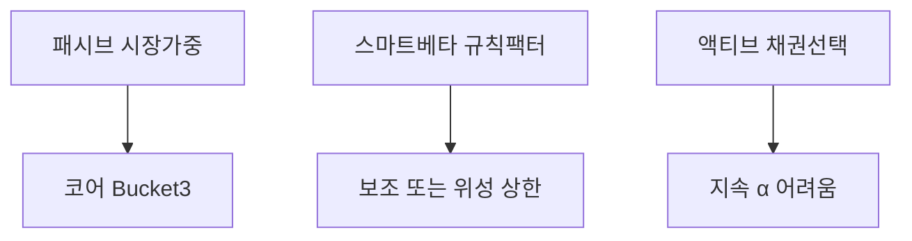
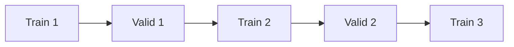
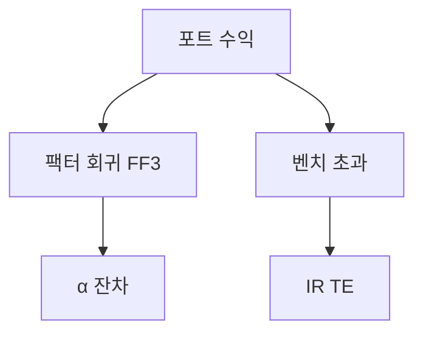
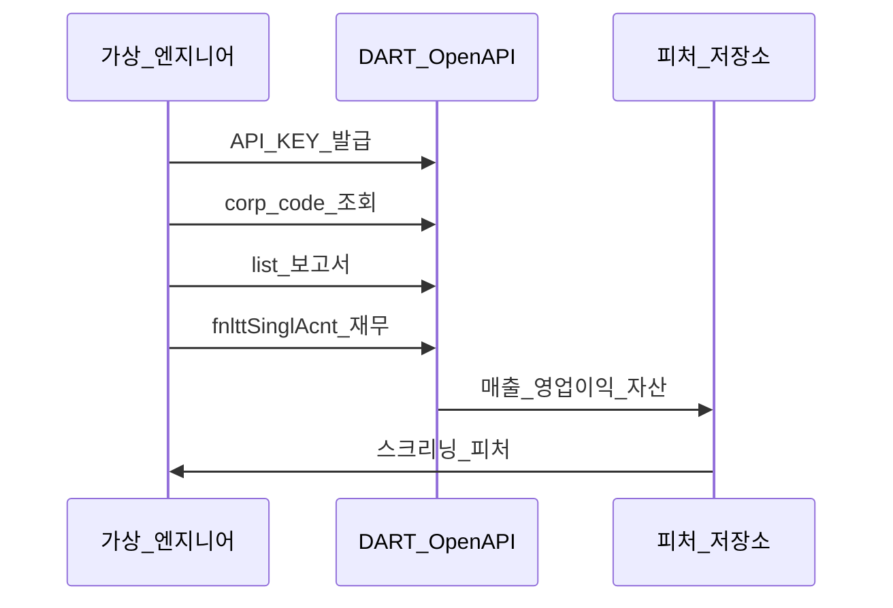

# 퀀트 투자 입문 — 팩터·백테스트·과최적화·DART API

> **면책**: 본 문서는 교육 목적이며, 특정 개인·법인에 대한 투자·세무·법률 자문이 아닙니다. **팩터 프리미엄·백테스트 수익은 미래를 보장하지 않습니다.** 과최적화된 규칙으로 실전 매매하는 것은 **원금 손실**로 이어질 수 있습니다. **개인 투자자의 고빈도·레버리지 퀀트 투기를 권장하지 않습니다.** 제도·API·세율은 변경될 수 있으므로 실행 전 공식 출처를 확인하세요. 본문 수치·종목·코드는 **가상 교육용**입니다.

## 메타

| 항목 | 내용 |
|------|------|
| 최종 검증일 | 2026-05-25 |
| 정책·법령 기준일 | 2025-12-31 확정 |
| 난이도 | L4 (Graduate) — [READER-GUIDE](../docs/READER-GUIDE.md) |
| 예상 읽기 시간 | 180~240분 |
| 관련 bucket | Bucket 3 (코어·팩터 ETF 보조) · Bucket 4 (위성·스크리닝 한계 인지) |

## 0. 이 편 읽기 전 (5분)

| 항목 | 내용 |
|------|------|
| **난이도** | L4 (Graduate) — [READER-GUIDE §L등급](../docs/READER-GUIDE.md) |
| **선수** | [capm-and-risk-return](capm-and-risk-return.md), [market-efficiency-emh](market-efficiency-emh.md) |
| **이번 편에서 쓰는 기호** | 본문 §4·§4a 표 참고 |
| **복습 한 줄** | L3 선수 편을 먼저 읽으면 수식이 수월함 |

## TL;DR

1. **퀀트 투자** = 규칙·데이터·통계로 포트 구성·성과 평가 — “감”을 **프로세스**로 대체하려는 시도이지 **수익 보장**이 아니다.
2. **팩터 투자**는 수익률 공분산을 설명하는 **공통 특성(가치·규모·모멘텀 등)** 에 체계적 노출 — [factor-investing-fama-french](factor-investing-fama-french.md).
3. **백테스트**는 과거 데이터에 전략을 **재현** — **생존편향·전망편향·거래비용·세금** 없으면 **과대평가**.
4. **과최적화(Overfitting)** = 샘플에만 맞춘 규칙 — **아웃오브샘플·워크포워드**로 방어.
5. **성과 측정**은 α·β·Sharpe·추적오차·IR — [performance-measurement](../04-portfolio/performance-measurement.md).
6. **DART Open API** = 한국 공시 **구조화 데이터** — ML 파이프라인과 **유사**하나 **투자 신호 ≠ API 호출**.
7. **AI 엔지니어**에게 익숙한 ETL·피처·검증 분할을 **금융 도메인 제약**(저표본·레짐 변화)과 함께 이해한다.


## 1. 한 줄 정의 + 왜 중요한가

**정의**: **퀀트 투자(Quantitative Investing)** 는 가격·재무·대체 데이터를 **정량화**하고, **명시적 규칙**으로 포트폴리오를 구성·리밸런싱·성과를 평가하는 투자 접근이다. 학술에서는 **자산가격 이론·팩터 모형·시장 미시구조**와 연결되고, 실무에서는 **인덱스·스마트베타·헤지펀드·은행 리스크 모형** 등으로 분화한다.

!!! info "CAPM (Capital Asset Pricing Model)"
    β로 기대수익을 설명하는 단일요인 모형.

**왜 중요한가 (장기 자산 형성·bucket 연결)**:

| 독자 상황 | 본 문서 역할 |
|-----------|--------------|
| **코어 ETF** 투자자 | “팩터 ETF·백테스트 광고”를 **검증 가능한 언어**로 해독 |
| **AI/ML 엔지니어** | 자신의 **MLOps·데이터 파이프라인** 비유를 **금융 함정**(과최적화·레짐)에 대입 |
| **위성·섹터** | 스크리닝 규칙이 **우연히 좋았던** 것인지 **구분** |
| **행동** | “시스템이 사줬다”는 **책임 회피** 방지 — [behavioral-finance-complete](../05-behavioral/behavioral-finance-complete.md) |

본 문서는 **헤지펀드 운용 매뉴얼**이 아니라, 개인 장기 투자자가 **퀀트 마케팅·학술 요약·공시 API**를 **비판적으로** 읽기 위한 **L4 입문**이다. 실행은 [passive-vs-active](../04-portfolio/passive-vs-active.md)·[core-satellite-framework](../04-portfolio/core-satellite-framework.md)와 정렬한다.


## 2. 선수 지식 / 이후 읽을 것

**선수**:
- [capm-and-risk-return](capm-and-risk-return.md)
- [market-efficiency-emh](market-efficiency-emh.md)
- [portfolio-theory-mpt](../04-portfolio/portfolio-theory-mpt.md)
- [financial-statements-analysis](../01-foundations/financial-statements-analysis.md)
- [factor-investing-primer](factor-investing-primer.md)

**이후**:
- [factor-investing-fama-french](factor-investing-fama-french.md) — FF3·FF5·한국 ETF
- [performance-measurement](../04-portfolio/performance-measurement.md) — α·Sharpe·IR
- [apt-multi-factor-models](apt-multi-factor-models.md)
- [reading-annual-reports-dart](../01-foundations/reading-annual-reports-dart.md)
- [quant-investing-intro](quant-investing-intro.md) ← 본 문서


## 3. 직관·비유 — AI 엔지니어 데이터 파이프라인

**핵심은:** 퀀트 투자는 "감이나 직관이 아닌 데이터와 통계 모델로 투자 결정을 내린다"는 방법론입니다. 소프트웨어 개발자·데이터 엔지니어에게는 익숙한 파이프라인 방식으로 생각할 수 있습니다.

퀀트 워크플로는 ML 제품 파이프라인과 형태가 비슷합니다. 차이는 데이터가 노이즈가 크고, 레이블(미래 수익)이 비정상이며, 배포(실전 매매) 비용이 크다는 점입니다.

| ML / 데이터 엔지니어링 | 퀀트 투자 | 금융 함정 |
|------|------|----------------|
| **원천 DB** (로그·이벤트) | 가격·재무·공시(DART) | **수정·상폐·생존편향** |
| **ETL** | 클린징·조정·통화 통일 | **룩어헤드 누수 주의** |
| **피처 엔지니어링** | 팩터 계산 (모멘텀·PBR 등) | **다중 검정·과적합** |
| **모델 학습** | 백테스트 | **인샘플 과적합** |
| **검증** | 워크포워드 OOS | **충분한 표본 크기** |
| **배포** | 실전 주문 실행 | **슬리피지·세금·수수료** |

**비유 — 요리 레시피와 식당 운영**
백테스트는 요리 레시피 개발과 같습니다. 맛있는 레시피를 만들었다고 해서 식당 운영이 성공한다는 보장은 없습니다. 실전에서는 식재료 가격 변동(시장 변화), 주방 속도 한계(슬리피지), 세금·인건비(거래비용)가 모두 성과를 갉아먹습니다.

**쉽게 말하면:** 개인 투자자도 DART OpenAPI + Python으로 간단한 팩터 모델을 만들 수 있습니다. 하지만 그 백테스트 성과를 그대로 믿으면 안 됩니다. 생존편향(망한 기업은 데이터에 없음), 룩어헤드 편향(미래 데이터가 과거 모델에 스며든 오류)을 반드시 점검해야 합니다.

**이 이론의 한계는 다음과 같습니다:** 아무리 좋은 백테스트 결과도 미래를 보장하지 않습니다. 팩터는 발견 후 약해지고, 시장 구조는 변합니다. 개인이 사용할 수 있는 공개 데이터(DART, 주가)로 만든 전략은 기관의 대안 데이터 전략과 경쟁해야 합니다.

## 4. 정식 개념·용어

| 용어 | English | 정의 |
|------|------|----------------|
| 퀀트 | Quant | 정량 규칙 기반 투자·리스크 |
| 팩터 | Factor | 수익률 공분산 설명 변수 |
| 롱숏 | Long-short | 팩터 포트(학술) |
| 백테스트 | Backtest | 과거 데이터 전략 재현 |
| OOS | Out-of-sample | 표본 밖 검증 |
| 과최적화 | Overfitting | 샘플 특이 패턴 학습 |
| 생존편향 | Survivorship bias | 상폐·퇴출 종목 누락 |
| 전망편향 | Look-ahead bias | 미래 정보 사용 |
| 워크포워드 | Walk-forward | 롤링 학습·검증 |
| α | Alpha | 모형 대비 초과 |
| β | Beta | 시장 민감도 |
| TE | Tracking error | 벤치 대비 변동 |
| IR | Information ratio | 초과/TE |
| 스마트 베타 | Smart beta | 규칙형 팩터 ETF |

### 4a. 핵심 용어 (본문 등장 순)

> 복습용. 정의는 §4 본표·[glossary](../00-roadmap/glossary.md)·본문 `!!! info` 박스.

| 용어 | 한 줄 | 관련 이론 | glossary |
|------|------|------|----------------|
| 퀀트 | 정량 규칙 기반 투자·리스크 | §4 | [glossary](../00-roadmap/glossary.md#퀀트) |
| 팩터 | 수익률 공분산 설명 변수 | §4 | [glossary](../00-roadmap/glossary.md#팩터) |
| 롱숏 | 팩터 포트 | §4 | [glossary](../00-roadmap/glossary.md#롱숏) |
| 백테스트 | 과거 데이터 전략 재현 | §4 | [glossary](../00-roadmap/glossary.md#백테스트) |
| OOS | 표본 밖 검증 | §4 | [glossary](../00-roadmap/glossary.md#oos) |
| 과최적화 | 샘플 특이 패턴 학습 | §4 | [glossary](../00-roadmap/glossary.md#과최적화) |
| 생존편향 | 상폐·퇴출 종목 누락 | §4 | [glossary](../00-roadmap/glossary.md#생존편향) |
| 전망편향 | 미래 정보 사용 | §4 | [glossary](../00-roadmap/glossary.md#전망편향) |
| 워크포워드 | 롤링 학습·검증 | §4 | [glossary](../00-roadmap/glossary.md#워크포워드) |
| α | 모형 대비 초과 | §4 | [glossary](../00-roadmap/glossary.md#α) |
| β | 시장 민감도 | §4 | [glossary](../00-roadmap/glossary.md#β) |
| TE | 벤치 대비 변동 | §4 | [glossary](../00-roadmap/glossary.md#te) |
| IR | 초과/TE | §4 | [glossary](../00-roadmap/glossary.md#ir) |
| 스마트 베타 | 규칙형 팩터 ETF | §4 | [glossary](../00-roadmap/glossary.md#스마트-베타) |

## 5. 메커니즘 — 팩터 투자 개요

### 5.1 CAPM에서 팩터로

단일 **시장 β**만으로 설명되지 않는 **평균 수익 차이** → **다요인 모형**. [factor-investing-fama-french](factor-investing-fama-french.md)의 FF3:

\[
R_{i,t} - R_{f,t} = \alpha_i + \beta_{i,M}(R_{M,t}-R_{f,t}) + \beta_{i,SMB} SMB_t + \beta_{i,HML} HML_t + \varepsilon_{i,t}
\]

| 팩터 | 직관 | 개인 투자자 접점 |
|------|------|----------------|
| **MKT** | 시장 | 코어 지수 ETF |
| **SMB** | 소형 | 코스닥·소형 ETF |
| **HML** | 가치(저P/B) | 가치·배당 스마트베타 |
| **RMW·CMA** (FF5) | 수익성·투자보수 | 퀄리티·저변동 혼합 |

**섹터(AI·GPU)** ≠ **팩터** — [sector-investing-framework](../03-markets/sectors/sector-investing-framework.md). 반도체 ETF는 **산업 베팅** + 우연히 **성장·모멘텀** 노출.

### 5.2 스마트 베타 vs 액티브 vs 패시브



[passive-vs-active](../04-portfolio/passive-vs-active.md): 개인은 **코어 패시브** + **팩터 ETF 소량**이 현실적. **직접 롱숏·파생**은 [derivatives-options-intro](derivatives-options-intro.md) 리스크.

### 5.3 팩터 프리미엄이 사라질 때

- **군중화**: 동일 팩터 추종 자금 증가  
- **레짐**: 저금리 → 고금리에서 **성장·모멘텀** 역전  
- **구조 변화**: 회계·공시·지수 편입 규칙 변경  
- **데이터 마이닝**: 학술·브로커가 **수백 팩터** 시도 → **유의한 것만** 보고 ([p-hacking](https://en.wikipedia.org/wiki/Data_dredging) 유사)


## 6. 백테스트 — 설계·함정·체크리스트

| 기호 | 이름 | 이 식에서 의미 |
|------|------|----------------|
| OOS | 표본 외 검증 | 튜닝에 쓰지 않은 구간 성과 |
| IC | 정보계수 | 시그널·수익 상관(개념) |

### 6.1 백테스트 파이프라인 (단계)

1. **유니버스 정의**: KOSPI200·전 종목·시총 필터 — **상폐 포함** 여부  
2. **리밸런싱 주기**: 월·분기 — **미래 수익률 미사용**  
3. **시그널 계산**: t말 재무 → **t+1** 매수(공시 **지연** 반영)  
4. **포트 구성**: 상위 20% 가치 등 — **가중**(시총·동일)  
5. **비용**: 수수료·스프레드·**슬리피지**·세금([domestic-stocks-tax](../06-korea-policy/tax/domestic-stocks-tax.md))  
6. **벤치**: 시장·섹터 — [performance-measurement](../04-portfolio/performance-measurement.md)  
7. **OOS**: 최근 20% 기간 **한 번도 튜닝 안 한** 규칙으로 테스트

### 6.2 편향 카탈로그

| 편향 | 설명 | 엔지니어 비유 |
|------|------|----------------|
| **생존편향** | 상장 폐지 종목 제외 | 삭제된 로그만으로 SLA 계산 |
| **전망편향** | 수정 재무·당일 종가로 t일 신호 | 미래 타임스탬프 로그 혼입 |
| **데이터 스누핑** | 100 규칙 중 1개만 보고 | 100 실험 중 p<0.05 하나 |
| **거래비용 무시** | 총수익만 보고 | CDN 비용 0원 가정 |
| **유동성 무시** | 소형주 대량 매수 | 프로덕션 QPS 무제한 |
| **레버리지 과다** | 샤프만 보고 DD 숨김 | p99 지연 미보고 |

### 6.3 가상 백테스트 예 (교육용)

> **가상**: 2015~2024, KOSPI 유니버스, **분기** 리밸, **P/B 하위 30%** 20종목 동일가중, 비용 0.3%/회.

| 구간 | 연환산 | MDD | 비고 |
|------|------|------|----------------|
| IS 2015~2020 | +12% | −25% | 튜닝 **금지** 구간 아님 |
| OOS 2021~2024 | +3% | −18% | **성과 급감** — 과최적화 의심 |

**교훈**: IS만 보고 “가치 전략 만능” 홍보 → **OOS·비용** 필수.

### 6.4 워크포워드 (Walk-forward)



**롤링**: 3년 학습 → 1년 검증 → 창 이동. **파라미터 고정** 규칙이 이상적; 매 창마다 재튜닝하면 **누수**.

## 7. 과최적화(Overfitting) — 진단·방어

### 7.1 정의·신호

**과최적화**: 노이즈까지 “학습”한 규칙 → **OOS·실전**에서 성과 붕괴.

| 신호 | 해석 |
|------|------|
| IS 샤프 2.0, OOS 0.2 | **전형적 과최적화** |
| 규칙 **파라미터 10개**+, 표본 5년 | 자유도 과다 |
| “**월요일만** 매수” 등 비경제적 | 데이터 스누핑 |
| 백테스트 **완벽** 곡선 | 비용·편향 누락 |

### 7.2 방어 원칙 (개인 투자자)

1. **규칙 단순화**: 파라미터 **≤3**  
2. **경제적 스토리**: 가치·모멘텀 — **이유 없는 패턴** 거부  
3. **OOS·워크포워드**  
4. **비용·세금** 보수적 가정  
5. **실전 소액·페이퍼** 전 풀배치 금지  
6. **코어는 패시브** 유지 — 퀀트 위성은 [core-satellite-framework](../04-portfolio/core-satellite-framework.md) **상한**

### 7.3 Bonferroni 직관

\(N\)개 전략을 시도하면 우연히 유의한 전략 수 ≈ \(N \times \alpha\). **100번** 시도·α=0.05 → **5개**는 우연. → **사전 등록**(pre-registration)처럼 **규칙을 먼저** 적고 테스트.


## 8. 성과 측정 — 퀀트와 연결

[factor-investing-fama-french](factor-investing-fama-french.md) 회귀 후 **α**가 “진짜 초과”인지는 **벤치·기간·팩터 선택**에 민감 — [performance-measurement](../04-portfolio/performance-measurement.md).

| 지표 | 식(요약) | 퀀트 해석 |
|------|------|----------------|
| **Sharpe** | \((R_p-R_f)/\sigma_p\) | 총위험 대비 — **레버** 왜곡 주의 |
| **Sortino** | 하방 σ만 | 하락만 페널티 |
| **Treynor** | \((R_p-R_f)/\beta_p\) | 체계적 위험 단위 |
| **TE** | \(\sigma(R_p-R_b)\) | 벤치 추적 변동 |
| **IR** | 초과/TE | **액티브** 품질 |

**한국 개인**: QQQ 코어의 벤치를 **NASDAQ100 vs S&P500** 중 무엇으로 두느냐에 **α 부호**가 바뀔 수 있음.




## 9. DART Open API 개요 — 공시 데이터 파이프라인

### 9.1 DART란

**DART(Data Analysis, Retrieval and Transfer)** 는 금융감독원 **전자공시** 시스템. [reading-annual-reports-dart](../01-foundations/reading-annual-reports-dart.md)가 **사람이 읽는** 흐름이라면, **Open API**는 **기계가 읽는** 경로다.

| 구분 | 용도 |
|------|------|
| **웹 UI** | 사업보고서·주석 **정성** 읽기 |
| **Open API** | 종목·보고서 목록·재무 **XBRL/JSON** 등 **정량** 추출 |

### 9.2 API 워크플로 (교육용·가상)



**대표 개념 엔드포인트(이름은 시점별 변경 가능 — 공식 문서 확인)**:

| 기능 | 교육적 용도 |
|------|-------------|
| 고유번호(corp_code) | 종목명 ↔ **8자리 코드** |
| 공시 목록 | **보고서 id**·접수일 |
| 단일회사 재무 | **IS/BS/CF** 계정과목 |
| 다중회사 재무 | **유니버스 스크리닝** |

**공식**: [opendart.fss.or.kr](https://opendart.fss.or.kr) — 이용약관·**호출 한도**·상업 이용 제한 확인.

### 9.3 엔지니어 주의사항

| 함정 | 설명 |
|------|------|
| **연결/별도** | 연결재무 vs 별도 — 팩터 정의 통일 |
| **회계 변경** | 기준 변경 시 **시계열 단절** |
| **공시 지연** | 결산 → **제출일** — look-ahead |
| **정정 공시** | 원본 supersede — **버전 관리** |
| **API ≠ 투자 조언** | 파이프라인 성공 ≠ α |

**코드 예시(가상·의사코드)**:

```python
# 교육용 의사코드 — 실행 전 공식 SDK/엔드포인트 확인
def fetch_operating_income(corp_code: str, year: int) -> float:
    rows = dart_api.fnlttSinglAcnt(corp_code, year, reprt_code="11011")
    return parse_account(rows, account_nm="영업이익")
```

실무: **캐시·재시도·rate limit**·**감사 로그** — MLOps와 동일 discipline.

### 9.4 DART + 백테스트 연결

1. t년 **사업보고서** 재무 → 시그널  
2. **접수일 다음 거래일** 이후 매수 (전망편향 방지)  
3. 분기 리밸  
4. 상폐 종목 **생존편향** 처리  

[financial-statements-study-roadmap](../01-foundations/financial-statements-study-roadmap.md) Week 9~11과 **동일 윤리**.


## 10. 한국 적용 — 개인 투자자 현실

### 10.1 2025년 기준

| 항목 | 퀀트 관점 |
|------|-----------|
| **코어** | KOSPI200·S&P500 **지수 ETF** — 팩터 노출 **부수** |
| **스마트베타** | 가치·배당·모멘텀 ETF — **추적오차·보수** |
| **계좌** | ISA **3년**·손익통산 — 리밸런싱 **세무** — [isa](../06-korea-policy/isa.md) |
| **해외** | 환율·양도세 — [overseas-stocks-tax-part1-cgt](../06-korea-policy/tax/overseas-stocks-tax-part1-cgt.md) |
| **공매도·파생** | 개인 **제한**·고위험 — 본 코퍼스 비권장 |

### 10.2 2026년

- 금투세·ISA 개편 — **백테스트 net return** 가정 **갱신**

---


**Q. 실무에서는?**  
교과서 식·기호를 그대로 적용하기 전에 **수수료·세금·데이터 시점**을 분리한다. 숫자는 [DEPTH-STANDARD](../docs/DEPTH-STANDARD.md)처럼 기호만 먼저 맞추고, 법령·시장 수치는 §8 표·외부 출처로 갱신한다.

## 11. 숫자 예제 (가상)

### 예제 1 — 팩터 회귀 (가상 ETF P)

| | β_M | β_SMB | β_HML | α(연) |
|------|------|------|------|----------------|
| P | 1.05 | 0.2 | 0.4 | −1% |

**해석**: 시장 베타 ≈1, **가치·소형** 노출. α 음수 → 벤치·팩터 대비 **우연 범위** 가능.

### 예제 2 — 과최적화 규칙

- 규칙: “RSI<30 & P/B<0.8 & **월요일**” — IS 샤프 1.8  
- OOS 샤프 0.1 → **폐기**

### 예제 3 — DART 파이프라인

- 유니버스 200종 → 영업이익 YoY 상위 30 → **다음 분기** 매수  
- **비용 0.4%** 반영 후 연 4% → 코어 ETF 6% **미달** → **코어 유지**, 스크리닝 **취미**로 격하


## 연습문제 (L4, 기호)

1. 위 §6 주요 식에서 변수 하나를 미지로 두고, 나머지를 기호로 둔 **관계식**을 쓰시오.
2. 가정이 깨질 때(유동성·세금·다중 IRR 등) 위 식의 **한계**를 기호·부등식으로 서술하시오.
3. §8 예제와 동일 기호(M·P·PV 등)로 **부호·단조성**만 검증하는 짧은 논증을 하시오.

### 해설 키

1. 직전 변수표의 「이 식에서 의미」를 이용해 동일 차원으로 정리한다.
2. 「가정이 깨지면」 절의 한계 사례와 연결한다.
3. 숫자 대입 없이 **부호**·**단위** 일치만 확인한다.
## 12. FAQ

**Q1. AI 엔지니어면 퀀트가 쉬운가?**  
**A1.** **도구는 유리**, **통계·금융 제약**은 동일. 과최적화·레짐이 **더 위험**(자신감 과잉).

**Q2. 파이썬 백테스트 라이브러리 추천?**  
**A2.** 교육 목적 **vectorbt·backtrader·zipline 개념** 수준 이해. **라이브러리 ≠ 수익**. 라이선스·데이터 비용 확인.

**Q3. DART API로 자동매매?**  
**A3.** 기술 가능 ≠ **합리적**. 실행·규제·**과최적화**·세금. **코어 DCA** 우선.

**Q4. 머신러닝 주가 예측?**  
**A4.** 노이즈 대비 신호 약함. **피처 누수·과적합** 극심. 학술·실무 모두 **회의적** — [market-efficiency-emh](market-efficiency-emh.md).

**Q5. 팩터 ETF 몇 개까지?**  
**A5.** **중복 노출**(가치+배당+저PBR). 코어 1~2 + 팩터 **1** — [asset-allocation](../04-portfolio/asset-allocation.md).

**Q6. 백테스트 기간?**  
**A6.** 최소 **10년**·**한 사이클** 포함. 한국은 **짧은 역사** — 글로벌 **교차 검증**.

**Q7. Sharpe 1.5면 좋은가?**  
**A7.** **IS**면 의미 약함. **OOS·비용 후**·**MDD** 동시.

**Q8. [factor-investing-fama-french](factor-investing-fama-french.md)와 차이?**  
**A8.** 본 문서 = **프로세스·API·과최적화**; 해당 문서 = **FF 이론·한국 ETF**.

**Q9. 데이트레이딩 퀀트?**  
**A9.** 본 저장소 **비권장**. 인프라·세금·심리 — [fomo-and-trading-hours](../05-behavioral/fomo-and-trading-hours.md).

**Q10. 다음 학습?**  
**A10.** [apt-multi-factor-models](apt-multi-factor-models.md), [technical-analysis-critical](technical-analysis-critical.md) (비판적 읽기).


## 13. 함정·리스크·한계

- **과신**: 백테스트 곡선 = **마케팅** 가능성.  
- **데이터 라이선스**: 상업 API·KRX 데이터 **약관**.  
- **레짐**: 2020~21 성장주 → 22~23 가치 **전환** — 고정 규칙 **손실**.  
- **유동성**: 코스닥·소형 — [kosdaq-tier-system](../03-markets/kosdaq-tier-system.md).  
- **윤리**: 내부정보·공시 전 **누수** 거래 **불법** — API도 **공개 후**만.  
- **교육 한계**: API 스펙·세법 **시점별 변경**.


## 14. 심화 읽기

- [factor-investing-fama-french](factor-investing-fama-french.md)
- [performance-measurement](../04-portfolio/performance-measurement.md)
- [factor-investing-primer](factor-investing-primer.md)
- [office-worker-investing-playbook](../00-roadmap/office-worker-investing-playbook.md)
- [references/sources.md](../references/sources.md)
- 교재: **Active Portfolio Management** (Grinold & Kahn) — 고급


## 15. 스스로 점검 퀴즈

1. 팩터와 **섹터** 차이 1문장?  
2. 전망편향 정의?  
3. OOS가 필요한 이유?  
4. DART API에서 **look-ahead** 방지 방법 1가지?  
5. IR = ?  
6. IS 샤프 높고 OOS 낮으면?  
7. FF3 세 팩터는?  
8. AI 파이프라인에서 **ETL**에 대응하는 퀀트 단계는?

??? note "정답 힌트"

    1. 산업 vs 공통 특성 · 2. 미래 정보 사용 · 3. 과최적화 검출 · 4. 접수일 후 매수 등 · 5. 초과/TE · 6. 과최적화 의심 · 7. MKT SMB HML · 8. 클린징·조정


## 부록 A. 백테스트 체크리스트 (인쇄용)

- [ ] 유니버스·상폐  
- [ ] 공시 **지연**  
- [ ] 비용·세금  
- [ ] 벤치 일치  
- [ ] OOS·워크포워드  
- [ ] 규칙 **경제적 해석**  
- [ ] 파라미터 개수  
- [ ] 실전 **슬리피지**  
- [ ] 코어 대비 **위성 상한**  
- [ ] 결과 **노트** (가상 금액만)


## 부록 B. 용어 ↔ ML 대응표 (확장)

| Quant | ML |
|-------|-----|
| Universe | Dataset population |
| Signal | Feature / score |
| Portfolio weights | Model output / ensemble |
| Rebalance | Batch redeploy |
| Drawdown | SLO breach duration |
| Factor exposure | Embedding direction (느슨한 비유) |

## 부록 C. 가상 시나리오 — 엔지니어 C의 6개월

| 월 | 행동 | 결과 |
|------|------|----------------|
| 1 | DART API ETL | 파이프라인 성공 |
| 2 | P/B 스크리너 백테스트 IS | 샤프 1.6 |
| 3 | OOS 추가 | 샤프 0.3 |
| 4 | 비용·세금 반영 | 샤프 0.1 |
| 5 | 규칙 단순화 | 포기, **코어 ETF DCA** |
| 6 | [performance-measurement](../04-portfolio/performance-measurement.md)로 코어만 IR 측정 | TE 낮음, 수면 개선 |

**교훈**: **엔지니어링 성공 ≠ 투자 α**. 프로세스는 **코어·ISA·행동**에 투입.


## 부록 D. 모멘텀·퀄리티·저변동 (FF5 확장)

[factor-investing-fama-french](factor-investing-fama-french.md) FF5의 **RMW·CMA** 외에 실무에서 자주 쓰는 **비학술 팩터**:

| 팩터 | 신호(예) | 한국 ETF 접점 | 함정 |
|------|------|------|----------------|
| **모멘텀** | 12-1개월 수익 | 모멘텀·기술주 혼합 | **급락** 시 반전 |
| **퀄리티** | ROE·부채·이익 안정 | 배당·저부채 | **성장주 배제** |
| **저변동** | 역사적 σ 낮음 | 저변동 ETF | **금리 급등** 시 패배 |
| **배당** | 배당수익률 | 배당 ETF | **가치 함정** 겹침 |

**AI 섹터**: 모멘텀·성장 **동시 노출** — “팩터 다각화” 착각. [core-satellite-framework](../04-portfolio/core-satellite-framework.md)로 **한도**.

### D.1 모멘텀 크래시 (교육)

가상 2020~21: 모멘텀 상위 20% **+40%** → 2022: **−30%** (레짐 전환). 백테스트에 **2022 포함** 여부가 **전략 생존**을 가른다.


## 부록 E. 한국 팩터·스마트베타 실무 (교육용)

| 유형 | 구현 | 개인 주의 |
|------|------|----------------|
| **가치** | 저PBR·저PER ETF | 금융·사이클 **섞임** |
| **배당** | 고배당 지수 | **배당락**·세금 |
| **모멘텀** | 규칙형 순환 | **회전율·비용** |
| **멀티팩터** | 복합 스코어 | **투명도**·보수 |

**코어 vs 팩터**: 시장가중 **70~90%** + 팩터 **0~20%** — [asset-allocation](../04-portfolio/asset-allocation.md). **팩터만** 5개 = **중복 베팅**.


## 부록 F. 백테스트 의사코드 (가상·전체)

```python
# 가상 교육용 — look-ahead 방지 강조
def backtest_value(universe, start, end):
    equity = 1.0
    for date in rebalance_dates(start, end):
        # t: 공시 접수일 이후만 재무 사용
        financials = load_fundamentals(as_of=last_disclosure(date))
        scores = rank_pb(financials)  # 낮을수록 good
        weights = equal_weight(top_quintile(scores))
        returns = apply_costs(portfolio_return(date, weights), fee_bps=30)
        equity *= (1 + returns)
    return equity

def report(equity_curve, benchmark):
    sharpe = annualized_sharpe(equity_curve)
    mdd = max_drawdown(equity_curve)
    te = tracking_error(equity_curve, benchmark)  # performance-measurement
    return {"sharpe": sharpe, "mdd": mdd, "te": te}
```

**OOS 분리**:

```python
is_end = "2020-12-31"
oos_start = "2021-01-01"
# is_end 이전 데이터로 규칙 고정 후 oos만 evaluate
```


## 부록 G. DART API 엔드포인트 맵 (교육·명칭 변동 주의)

| 단계 | API 개념 | 출력 |
|------|------|----------------|
| 1 | `corpCode.xml` 다운로드 | 종목↔corp_code |
| 2 | `list.json` | 보고서 목록·rcept_no |
| 3 | `fnlttSinglAcnt.json` | 계정과목 금액 |
| 4 | `fnlttMultiAcnt.json` | 다종목 스크리닝 |
| 5 | (선택) `dart.json` 공시 원문 | MD&A 텍스트 — **NLP 주의** |

**Rate limit**: 초당·일일 호출 — **배치 ETL**·캐시. **ML 피처**: 분기마다 **스냅샷 고정** (point-in-time DB).

**개인 투자**: API로 **스크리닝 리스트**만 만들고, **매매는 분기 규칙** + [rebalancing-and-dca](../04-portfolio/rebalancing-and-dca.md).


## 부록 H. 통계 검정 직관 (L4)

| 개념 | 투자 맥락 |
|------|-----------|
| **t-stat** | α가 0인지 — 표본 짧으면 **불안정** |
| **p-value** | 우연 확률 — 100 전략이면 **5개** 유의 |
| **HAC 표준오차** | 시계열 **자기상관** 보정 |
| **Deflated Sharpe** | 여러 시도 보정 (Bailey & López de Prado) |

개인은 **검정 계산**보다 **OOS·비용·경제 논리** 3축이 실용적.


## 부록 I. 퀀트 vs [technical-analysis-critical](technical-analysis-critical.md)

| | 퀀트(본 문서) | 기술적 분석 |
|------|------|----------------|
| 신호 | 재무·가격 **규칙** | 차트·지표 |
| 검증 | 백테스트·OOS | **과최적화** 동일 위험 |
| 코퍼스 | **팩터·공시** | **비판적** 읽기 권장 |

**RSI+월요일** 규칙은 **둘 다** 데이터 스누핑 위험.


## 부록 J. 성과 측정 워크시트 (가상)

| 월 | 포트 % | 벤치 % | 초과 | 누적 TE |
|------|------|------|------|----------------|
| 1 | 2.1 | 1.8 | 0.3 | — |
| 2 | −1.0 | −0.8 | −0.2 | … |

[performance-measurement](../04-portfolio/performance-measurement.md) §예제와 **동일 정의** 사용 — 월간 vs 연환산 **혼동 금지**.


## 부록 K. FAQ 추가

**Q11. 공시 텍스트 NLP로 감성 팩터?**  
**A11.** **누수·과적합** 극심. 학술 연구 수준 — 개인 **비권장**.

**Q12. 암호화폐 온체인 = 퀀트?**  
**A12.** 본 코퍼스 **범위 외**. [alternatives-reits-commodities](../03-markets/alternatives-reits-commodities.md).

**Q13. 팩터 timing(타이밍)?**  
**A13.** **이중 액티브** — EMH·과최적화 — [market-efficiency-emh](market-efficiency-emh.md).

**Q14. 한국 HML 데이터 어디?**  
**A14.** 학술 DB·증권사 — **정의 상이** — ETF **규약**이 실무 기준.

**Q15. 백테스트 Sharpe 0.5면?**  
**A15.** **비용 후·OOS** — 코어 ETF **0.4~0.6**과 **비교**만, 우월 주장 금지.

---

**L4 완료 기준**: [TEMPLATE](../docs/TEMPLATE.md) 12블록·FAQ 15+·mermaid 5+·부록 11·가상 예제 5+ — 검증일 2026-05-25 — [DEPTH-STANDARD](../docs/DEPTH-STANDARD.md).