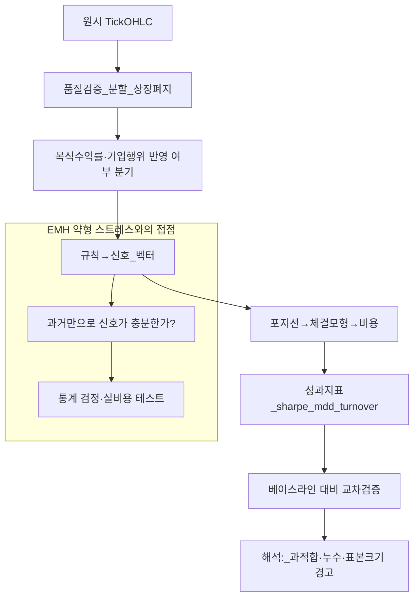

# 기술적 분석(TA) 비판적 입문 — 신호·백테스트·데이터 엔지니어링 관점

> **면책**: 본 문서는 교육 목적이며, 특정 개인·법인에 대한 투자·세무·법률 자문이 아닙니다. **단타·데이트레이딩을 권장하지 않으며**, 기술적 지표의 **수익 보장**을 암시하지 않습니다. 모든 사례·수치·인물은 **가상의 교육용 예시**입니다. 제도·세율·상품 조건은 변경될 수 있으므로 실행 전 공식 출처를 확인하세요.

## 메타

| 항목 | 내용 |
|------|------|
| 최종 검증일 | 2026-05-25 |
| 정책·법령 기준일 | 해당 없음(방법론·시장 구조 일반) |
| 난이도 | L4 (Graduate) — [READER-GUIDE](../docs/READER-GUIDE.md) |
| 예상 읽기 시간 | 90~120분 |
| 관련 bucket | Bucket 3~4 (액티브 판단·리스크 인식) |

## 0. 이 편 읽기 전 (5분)

| 항목 | 내용 |
|------|------|
| **난이도** | L4 (Graduate) — [READER-GUIDE §L등급](../docs/READER-GUIDE.md) |
| **선수** | [시장 효율성·EMH](market-efficiency-emh.md), [CAPM·위험·수익](capm-and-risk-return.md) |
| **이번 편에서 쓰는 기호** | 본문 §4·§4a 표 참고 |
| **복습 한 줄** | L3 선수 편을 먼저 읽으면 수식이 수월함 |

## TL;DR

1. **기술적 분석(TA)** 은 주로 **과거 가격·거래량**에서 **규칙(신호)** 을 추출해 **매매 타이밍**을 정하려는 **휴리스틱군**이다. [시장 효율성·EMH](market-efficiency-emh.md)의 **약형** 관점과 **직접 충돌**하며, 실무 검증은 **거래비용·슬리피지·생존편향** 이후 **순초과수익**으로 해야 한다.
2. **데이터 엔지니어 관점**에서는 TA를 “**알파가 있다**”가 아니라 “**일관된 파이프라인에서 재현 가능한가**”로 본다. **데이터 품질**(분할·공시·상장폐지·기업행위), **누수(leakage)**, **다중검정**이 흔한 **실패 원인**이다.
3. **백테스트**는 **과거에 맞춘 연극**이 될 수 있다. **표본 외 검증**, **워크포워드**, **단순한 베이스라인(매수·보유, 시장β)** 대비 개선 여부를 **동시에** 보지 않으면 **과적합**을 스스로 포장하기 쉽다.
4. **생존편향·룩어헤드**는 “차트가 예쁘게 보인 종목”만 남기는 **필터**와 같다. **전 종목 유니버스**·**현재 시점 기준 편입 규칙**을 코드로 고정하지 않으면 성과는 **허상**에 가깝다.
5. 본 문서는 **데이트레이딩·초단타를 권장하지 않는다**. **세금·수수료·정신적 비용**은 짧은 보유기간에서 **기하급수적**으로 중요해지며, [FOMO·거래시간](../05-behavioral/fomo-and-trading-hours.md) 문서와 함께 **행동적 함정**을 병행 점검해야 한다.
6. TA를 공부하더라도 **포트폴리오의 기본 축**은 보통 **장기 자산배분·비용·분산**에 있다. [패시브 vs 액티브](../04-portfolio/passive-vs-active.md), [CAPM·위험·수익](capm-and-risk-return.md), [팩터 투자](factor-investing-fama-french.md)와 **논리적으로 연결**해 “TA가 **대체재**인지 **보조적 시각화**인지”를 구분하라.

## 1. 한 줄 정의 + 왜 중요한가

**정의**: **기술적 분석**은 **과거 시장 데이터**(가격, 거래량, 때로는 호가·미결제약정 등)로부터 **규칙적 패턴**을 찾아 **매매 결정**을 내리는 **방법론 묶음**이다. 이동평균 교차, RSI, 볼린저 밴드, 추세선, 캔들 패턴, **지지·저항** 등이 대표적이나, 핵심은 “**동일한 입력이면 동일한 신호**”를 내는 **명시적 함수**로 표현 가능한가이다.

!!! info "Bucket"
    시간·목적별 **자금 슬롯**(0 비상금 → 3 코어 등)

**왜 중요한가** (장기 자산 형성·bucket 연결): TA는 **미디어·커뮤니티**에서 **접근성**이 매우 높아, 투자 입문자가 **첫 번째로 배우는 언어**가 되기 쉽다. 그러나 **교육적 위험**은 “**차트가 말해준다**”는 **내러티브**가 **인과**를 **착각**하게 만든다는 점이다. **Bucket 3~4**에서 TA는 (i) **리스크 관리 시각화**(손절·변동성 인식), (ii) **시스템 트레이딩 연구**의 **출발점**, (iii) **행동 편지를 억제하는 규칙**으로 **제한적** 역할을 할 수 있으나, **기대수익의 근원**을 TA만으로 **정당화**하기는 **학술·실무 모두에서 매우 어렵다**. [EMH](market-efficiency-emh.md)의 **약형**命題는 “**과거 가격만으로 지속적 α**”를 **의심**하라고 요구한다.

## 2. 선수 지식 / 이후 읽을 것

**선수**:
- [시장 효율성·EMH](market-efficiency-emh.md)
- [CAPM·위험·수익](capm-and-risk-return.md)
- [복리·환산](../01-foundations/compound-interest-and-time-value.md)
- [현금흐름 기본](../01-foundations/cash-flow-basics.md)
- [패시브 vs 액티브](../04-portfolio/passive-vs-active.md)

**이후**:
- [Fama‑French 팩터](factor-investing-fama-french.md)
- [파생상품 입문](derivatives-options-intro.md)
- [FOMO·거래시간](../05-behavioral/fomo-and-trading-hours.md)
- [미시구조 입문](../03-markets/market-microstructure.md) · [국내 증시 구조](../03-markets/korea-equity-market-structure.md)

## 3. 직관·비유

**등대와 파도**: **가격 차트**는 지나간 파도가 남긴 **모래 무늬**와 비슷하다. 무늬는 **설명(descriptive)** 에는 좋지만, “내일 파도가 정확히 어디까지 올까?”는 **예측(predictive)** 문제로 바뀌는 순간 **불확실성 폭발**을 전제해야 한다.

**금속탐지기와 쓰레기장**: 많은 신호 탐색은 **금속탐지기를 쓰레기장 전체에 휘두르는 것**과 같다. 무언가 **삑** 소리가 나더라도, 그게 **금**인지 **캔 뚜껑**인지는 **별도 검증**(비용 포함)이 필요하다.

**블랙박스가 아니라 회로도**: 데이터 엔지니어에게 TA 규칙은 **회로도**여야 한다. “감으로 지지선”이 아니라, **어떤 시각·어떤 조정분할·어떤 공시 공백**에서 **코드 한 줄로 재현되는가**가 핵심이다.

## 4. 정식 개념·용어

| 용어 | 한글 보조 | English | 정의 |
|------|------|------|----------------|
| OHLCV | 시가·고가·저가·종가·거래량 | OHLCV | 캔들 단위 표준 입력 |
| 지표 | 인디케이터 | Indicator | 가격열의 함수값 시계열 |
| 신호 | 시그널 | Signal | 매수·매도·청산 규칙의 이진 또는 연속 출력 |
| 룩어헤드 | 미래 참조 버그 | Look-ahead bias | 미래 정보가 과거 규칙에 스며든 오류 |
| 생존편향 | 살아남은 종목만 | Survivorship bias | 폐지·상장 초기 제외가 성과를 과대 |
| 과적합 | 샘플에만 맞춤 | Overfitting | 복잡 규칙이 노이즈를 언어로 학습 |
| 다중검정 | 많이 시험하면 우연히 유의 | Multiple testing | p‑해킹·데이터 스누핑과 연결 |
| 슬리피지·충격 | 체결가 악화 | Slippage / Impact | 특히 저유동·급변 시 증폭 |
| 워크포워드 | 국소 기간 순차 검증 | Walk-forward | 롤링 OOS 검증 패턴 |
| 베이스라인 | 비교 준 거 | Baseline | 매수·보유, 시장지수 등 |

### 4a. 핵심 용어 (본문 등장 순)

> 복습용. 정의는 §4 본표·[glossary](../00-roadmap/glossary.md)·본문 `!!! info` 박스.

| 용어 | 한 줄 | 관련 이론 | glossary |
|------|------|------|----------------|
| OHLCV | 시가·고가·저가·종가·거래량 | §4 | [glossary](../00-roadmap/glossary.md#ohlcv) |
| 지표 | 인디케이터 | §4 | [glossary](../00-roadmap/glossary.md#지표) |
| 신호 | 시그널 | §4 | [glossary](../00-roadmap/glossary.md#신호) |
| 룩어헤드 | 미래 참조 버그 | §4 | [glossary](../00-roadmap/glossary.md#룩어헤드) |
| 생존편향 | 살아남은 종목만 | §4 | [glossary](../00-roadmap/glossary.md#생존편향) |
| 과적합 | 샘플에만 맞춤 | §4 | [glossary](../00-roadmap/glossary.md#과적합) |
| 다중검정 | 많이 시험하면 우연히 유의 | §4 | [glossary](../00-roadmap/glossary.md#다중검정) |
| 슬리피지·충격 | 체결가 악화 | §4 | [glossary](../00-roadmap/glossary.md#슬리피지·충격) |
| 워크포워드 | 국소 기간 순차 검증 | §4 | [glossary](../00-roadmap/glossary.md#워크포워드) |
| 베이스라인 | 비교 준 거 | §4 | [glossary](../00-roadmap/glossary.md#베이스라인) |

## 5. 메커니즘

본 절에서는 TA를 **파이프라인**으로 본다. **입력**(원시 또는 조정 데이터)에서 **품질 관리**(missing, limit up/down, 장중 휴장)를 거치지 않으면 신호 자체가 **허깅 헛점**이다. 신호 생성 후에는 **포지션 스케일링**(고정 계약 · 변동성 타깃링)과 **체결 규칙**(다음 바 시가, 종가 VWAP 근사 등)을 명시해야 **재현 가능**하다.

**학문적 교차점**: [EMH](market-efficiency-emh.md) **약형**은 “차트 신호만으로 장기 초과성과”가 **설득력 있게 존재**한다는 명제와 **긴장**을 이룬다. 이는 “절대 불가능”이 아니라 “**증명 부담**이 매우 크다”는 뜻에 가깝다. 따라서 TA 연구에서는 **통제 집합**과 **거래 비용 현실값**을 **전제 깔고 시작**해야 한다.

## 6. 수식·모델 (해당 시)

단순 **로그수익** \( r_t = \ln(P_t/P_{t-1}) \) 와 **이동평균 교차** 예:

| 기호 | 이름 | 이 식에서 의미 |
|------|------|----------------|
| **r** | 할인율·수익률 | 기간당 이자·요구수익률 |
| **n** | 기간 | 연·월 등 복리·할인에 쓰는 횟수 |
| **PV** | 현재가치 | 오늘 시점으로 환산한 금액 |
| **FV** | 미래가치 | 미래 시점의 목표·결과 금액 |

\[
\text{MA}_t^{(k)} = \frac{1}{k}\sum_{i=0}^{k-1} P_{t-i},\quad
\text{Signal}_t = \mathbf{1}\{\text{MA}_t^{(s)} > \text{MA}_t^{(\ell)}\}
\]

**읽는 법**: **MA**와 **t**의 관계를 위 식으로 쓴다. 경제·재무 해석은 변수표 「이 식에서 의미」와 [DEPTH-STANDARD](../docs/DEPTH-STANDARD.md) 기호 예제를 맞춘다.
**유도 (L4)**:
1. **정의**: **MA**, **t**, **k**를 동일 시점·동일 통화로 맞춘다. — 단위 불일치면 식이 무의미해진다.
2. **식 변형**: 양변을 정리해 목표 변수를 한쪽에 둔다. — 할인·복리는 **시점 이동**이 핵심이다.

**해석 주의**: 위는 **표기**일 뿐, **최적 (s,ℓ)** 을 **동일 표본에서 고르면** 전형적 **과적합**이다. **교차검증·페널티(복잡도 제한)** 없이 파라미터 망을 탐색하는 행위는 데이터 과학에서 **금지 수준에 가까운 나쁜 관행**으로 취급된다.

**해당 없음(일부)**: 옵션 그릭스·연속시간 확률미분방정식 수준의 모형은 본 문서 범위 밖이며, 필요 시 [파생상품 입문](derivatives-options-intro.md)으로 이동한다.

---

·복리는 **시점 이동**이 핵심이다.

**해석 주의**: 위는 **표기**일 뿐, **최적 (s,ℓ)** 을 **동일 표본에서 고르면** 전형적 **과적합**이다. **교차검증·페널티(복잡도 제한)** 없이 파라미터 망을 탐색하는 행위는 데이터 과학에서 **금지 수준에 가까운 나쁜 관행**으로 취급된다.

**해당 없음(일부)**: 옵션 그릭스·연속시간 확률미분방정식 수준의 모형은 본 문서 범위 밖이며, 필요 시 [파생상품 입문](derivatives-options-intro.md)으로 이동한다.

## 7. 한국 적용

### 7.1 구조적 고려 (일반)

한국 장은 **시간대·유동성 이질성·공매도 제도·세금·세부 호가 규칙**이 **해외 선진 시장과 다르다**. TA 백테스트를 **미국 ADR 데이터로만** 연습한 뒤 국내 소형주에 **그대로 이식**하면 **체결가정**이 틀어져 **성과 착시**가 난다.

### 7.2 실무 체크 (교육용·가상)

| 항목 | 점검 질문 | 흔한 오류 |
|------|------|----------------|
| 분할 | **액면분할·무상** 반영했는가? | 가격 단절로 **가짜 돌파** |
| 상장폐지 | **전 기간 유니버스**인가? | 생존편향 |
| 거래정지 | 정지 구간 **체결 불가** 반영? | 미래 정보 유입 |
| 비용 | **세금·수수료·슬리피지** 포함? | 그로스 α 착시 |
| 장 운영 | **시간외·단일가** 혼입? | 바 구성 오류 |

**법·정책 근거**: 본 절은 **특정 조문 나열** 대신 “**공식 제도 문서·증권사 약관**을 확인하라”는 **교육적 주의**로 한정한다. 세제는 개정이 잦다.

## 8. 숫자 예제 (가상)

> 모든 인물·금액·종목명은 가상입니다.

### 예제 1 — “완벽해 보이는” 백테스트

**가상 상황**: 연구자 A는 2015~2020년 **가상의 `ABC` 지수 구성 종목 50개**에서 RSI(14) 역매매 규칙을 최적화했다. **인샘플 샤프 비율**은 1.8로 화려하다. 그러나 A는 (i) **2021년 이후 상장** 종목을 **알지 못한 채** 편입 샘플을 고정하지 않았고, (ii) **상장폐지 종목**을 제거했으며, (iii) **파라미터 망 2000개**를 돌려 최고값을 골랐다.

**교훈**: 화려한 인샘플은 **다중검정·생존편향·누수**의 **합성물**일 확률이 높다. **표본 외**·**단순 규칙 베이스라인**이 없으면 **발표 불가 수준**이다.

### 예제 2 — 데이터 누수 한 방에 무너지는 신호

**가상 상황**: B는 “**당일 종가**”로 매수 여부를 정하는데, 코드 버그로 **고가**를 **미래에서 읽는** 실수를 했다. 백테스트는 **년 40%** 같은 비현실적 초과수익을 낸다.

**교훈**: **이벤트 시간 정렬**과 **bar 생성 규칙**을 **단위 테스트**하라. 금융 시계열에서 누수는 **한 줄**로 **전부 거짓**이 된다.

### 예제 3 — 데이트레이딩 비용의 기하급수 (가상)

**가정**: 가상 투자자가 **일 10회** 회전, **편도 비용 0.05%**(수수료+슬리피지 합성)만 잡아도 **이론상 연 250일** 기준 대략 **양편도 누적 비용**이 매우 커질 수 있다(거래소·상품별로 다름). **본 문서는 이런 전략을 권장하지 않는다.**

## 9. FAQ

**Q1. TA는 완전히 쓸모없나요?**  
**A1.** “**완전 무가치**”와 “**지속적 초과수익의 근거**”는 다르다. TA는 **시각적 요약**·**규칙적 리스크관리**·**연구 베이스라인**으로 **제한적 가치**가 있을 수 있다. 다만 **기대수익을 TA만으로 정당화**하려면 [EMH](market-efficiency-emh.md)와 **정면 충돌**하며 **증거 부담**이 크다.

**Q2. 약형 EMH가 틀렸다는 논문도 있지 않나요?**  
**A2.** **단기 모멘텀** 등 **이상(anomaly)** 문헌은 존재한다. 그러나 **이상 ≠ 개인 단타 졸업장**이다. 논문 효과는 종종 **턴오버·용량(capacity)·거래 비용 후 소멸**한다. 데이터 엔지니어는 “**유의한 회귀계수**”와 “**거래 가능한 순이익**”을 **분리**해 본다.

**Q3. 머신러닝을 쓰면 TA 문제가 해결되나요?**  
**A3.** 오히려 **과적합·해석 불가·누수 위험이 증폭**될 수 있다. **더 단순한 선형 베이스라인을 이기지 못하는** 복잡 모형은 **실무 배제**가 합리적이다.

**Q4. 백테스트에서 꼭 넣어야 하는 최소 현실 장치는?**  
**A4.** (i) 비용·슬리피지 민감도 분석 (ii) **생존편향 안티패턴**(전 종목 레이블) (iii) **워크포워드** 또는 **순열 검정** 같은 **무작위화 대조군**.

**Q5. 지표 조합은 괜찮나요?**  
**A5.** 조합 자체가 나쁘지 않다. 문제는 조합 공간을 **무제한 탐색**할 때 발생한다. **사전등록**(어떤 지표 후보 몇 개인지 문서화)하지 않으면 **스스로 p‑해킹**한다.

**Q6. “차트 패턴 교과서 패턴과 닮았다”는 근거로 충분한가요?**  
**A6.** **시각 유사성**과 **통계적 예측력**은 별개다. 사람 눈은 **클러스터 착각**에 강하다. **코드화·브라인드 테스트** 없는 패턴 매칭은 **재현 불가**.

**Q7. 데이트레이딩보다 장기 매매가 TA에 유리한가요?**  
**A7.** 본 문서는 **데이트레이딩을 권하지 않으며**, 장기 규칙이 **반드시 유리**하다고도 말하지 않는다. 다만 보유 기간이 짧아질수록 **마찰 비용 비중**은 커져 **통계 검정 동력**(신호‑대‑잡음)이 약화되는 경향이 있다.

**Q8. 퀀트 펀드는 TA 안 쓰나요?**  
**A8.** 많은 펀드는 **가격 정보** 자체를 쓰지만, 그것이 대중 교과서 RSI와 같은 것은 아니다. 종종 **팩터·미시구조·통계 차익**으로 **포장**된다. 개인 입장에서는 **블랙박스를 미신처럼** 따르는 것과 **연구 방법을 배우는 것**을 구분해야 한다.

**Q9. 거래량 지표는 정보가 더 있지 않나요?**  
**A9.** 거래량은 **유동성 상태** 정보를 줄 수 있다. 그러나 “**항상 미래 방향 예측**”으로 연결되는 것은 별개 가설이다. **프로그램 매매 비중**，**외국인·기관 순매매**처럼 **범주가 다른 변수**와 **교란(confound)** 될 수 있다.

**Q10. 이 문서만 읽고 바로 매매해도 되나요?**  
**A10.** 아니다. 교육용이며 **개별 상황 자문이 아니다**. 장기 형성 접근은 [패시브 vs 액티브](../04-portfolio/passive-vs-active.md)와 **기본 현금흐름 안목**부터 정리하는 것이 일반적으로 **더 낮은 후회 분산**과 연결된다(행동금융 근거는 다수).

## 10. 함정·리스크·한계

- **룩어헤드·공시 시간 정렬**: 실적발표 일정과 가격바가 **안 맞으면** 사실상 **미래 참조**.
- **생존편향**: “지금 존재하는 대형주”만 보면 **과거 버블 잔존 편향**.
- **데이터 스누핑 / 다중검정**: 수천 규칙 중 최고를 고르면 **우연의 황제**가 된다.
- **과소 표본 길이**: 구조변화 레짐에서는 **통계 불안정**.
- **슬리피지 과소평가**: 특히 급등락·저유동·장 초반.
- **인과 과장**: 차트 스토리는 **설명**(내러티브)에는 강하지만 **예측**은 따로 증명.
- **행동 편향**: 손실회피·과신이 **규칙 이탈**을 부른다 ([FOMO](../05-behavioral/fomo-and-trading-hours.md)).
- **세금·규제 변동 리스크**: 단기 회전은 **세제 민감도↑**.

---

**Q. 실무에서는?**  
교과서 식·기호를 그대로 적용하기 전에 **수수료·세금·데이터 시점**을 분리한다. 숫자는 [DEPTH-STANDARD](../docs/DEPTH-STANDARD.md)처럼 기호만 먼저 맞추고, 법령·시장 수치는 §8 표·외부 출처로 갱신한다.

## 11. 심화 읽기

- **공식·참조 모음**: [references/sources](../references/sources.md)
- **교차 문서**: [EMH 본편](market-efficiency-emh.md), [CAPM](capm-and-risk-return.md), [팩터](factor-investing-fama-french.md)
- 교재·논문 방향성 키워드(링크 없이): *Fama(1970) EMH*, *Lo adaptive markets*, *Harvey 후행 p‑값 논의*, **다중검정 보정**(False Discovery Rate), **White’s Reality Check**

## 연습문제 (L4, 기호)

1. 위 §6 주요 식에서 변수 하나를 미지로 두고, 나머지를 기호로 둔 **관계식**을 쓰시오.
2. 가정이 깨질 때(유동성·세금·다중 IRR 등) 위 식의 **한계**를 기호·부등식으로 서술하시오.
3. §8 예제와 동일 기호(M·P·PV 등)로 **부호·단조성**만 검증하는 짧은 논증을 하시오.

### 해설 키

1. 직전 변수표의 「이 식에서 의미」를 이용해 동일 차원으로 정리한다.
2. 「가정이 깨지면」 절의 한계 사례와 연결한다.
3. 숫자 대입 없이 **부호**·**단위** 일치만 확인한다.
## 12. 스스로 점검 퀴즈

1. 약형 EMH 관점에서 **기술적 분석 신호가 지녀야 할 증명 부담**을 한 줄로 말하면?
2. **생존편향**이 성과 지표 중 **샤프 비율**을 어떤 방향으로 왜곡할 수 있는가?
3. **워크포워드 검증**이 단순 K‑폴드 교차검증보다 금융에서 선호되는 이유 두 가지.
4. **룩어헤드** 예시 세 가지(데이터 레이블·기업행위·공시 시간대 등).
5. TA 연구 설계에서 **베이스라인 두 개 이상**을 동시에 둘 때의 장점은?

??? note "정답 힌트"

    1. 과거 공개 정보(가격·거래량)만으로 **거래 비용 차감 후**에도 위험조정 **지속 초과수익**을 **설득력 있게 보여야 한다**는 부담. 자세히는 [market-efficiency-emh.md의 약형 절](market-efficiency-emh.md) 참고.  
    2. 실패 종목 제거 시 **변동성·손실 꼬리**가 과소표현되어 **분모(위험) 과소 또는 분자(평균) 과대**로 **비율 왜곡** 가능.  
    3. 시간축 순서 유지와 **점진 정보 도착**(non‑IID) 존중, **레짐 의존도** 점검 용이.  
    4. 조정안 된 분할, **종가가 아니라 종가 후 공시 참조**, **폐지 종목 레이블 누락 후 편향적 제거**.  
    5. **우연 초과설명 방지**(여러 허무 가설 동시 패배시키기).

## 부록 A — 재현 가능한 TA 연구 최소 체크리스트 (데이터 엔지니어망)

1. 소스 버전(git hash)·데이터 **스냅샷 id** 명시  
2. **조정 선택**(복식 vs 단순)과 이유 분기  
3. **체결 규칙 한 줄 정의**(다음바 시가 vs 당바 종가)  
4. **비용표** 두 개 이상(낙관/현실/비관)  
5. **동일 규칙 랜덤화 대조**(shuffle labels / block bootstrap 근사)  
6. **논문 급 주장**(“알파 있다”) 문구는 **통제 실험 통과 후**만

## 부록 B — 지표≠신호≠전략 (개념 분리표)

| 층위 | 출력 | 검증 초점 |
|------|------|----------------|
| 지표 | 실수 시계열 | 스케일·정상성 |
| 신호 | {‑1,0,1} 등 | 교차 검정 안정성 |
| 전략 | 손익 곡선 | 비용 포함 OOS |

## 부록 C — 검증 없이 확산되는 내러티브 과정을 피하기 위한 심리적 주의문

커뮤니티에서 검증 없이 순환되어 **바이럴 되는 패턴**(가상)·**플랫폼 알고리즘 추천**은 **표본 편향**을 증폭한다. 교육적 자세는 “**설명 가능한 디버깅 가능한 회로도**가 있는가?”다.

---

**L4 — 2026-05-25**