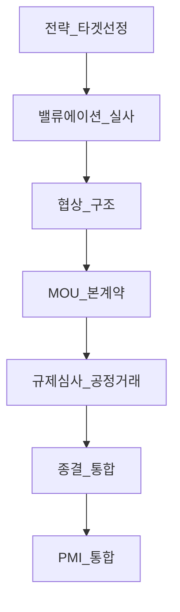
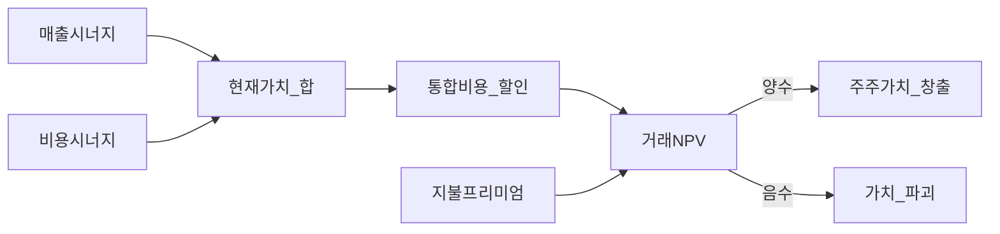
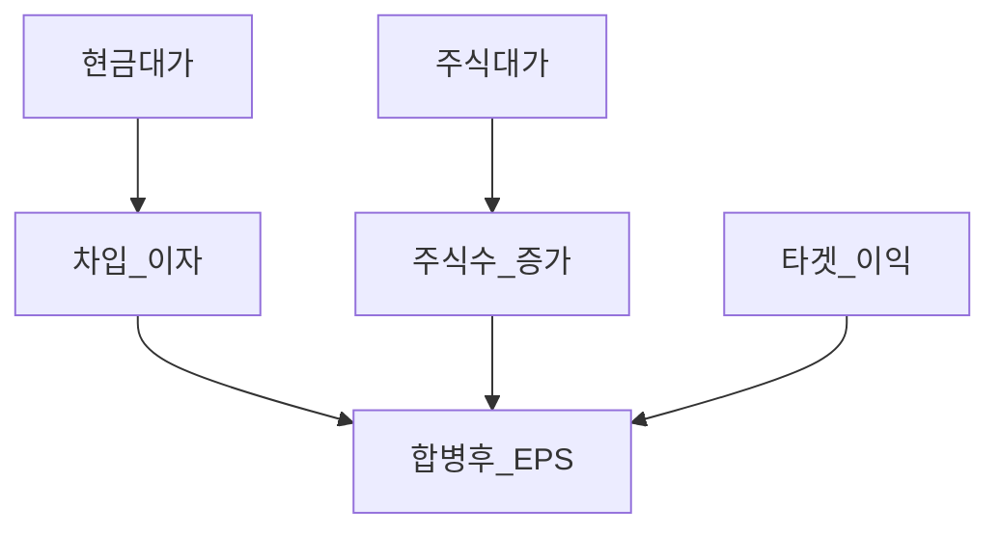
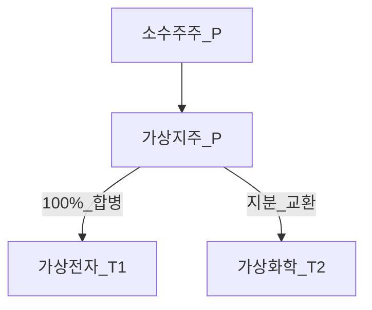

# M&A 기초 — 시너지·희석·한국 맥락 (가상 사례)

> **면책**: 본 문서는 교육 목적이며, 특정 기업·거래에 대한 인수·매각·투자 자문이 아닙니다. M&A 구조·회계·세무·공시는 **거래별**로 다르며, **상법·자본시장법·공정거래법** 개정 시 재확인하세요. 모든 회사명·금액은 **가상**입니다.

## 메타

| 항목 | 내용 |
|------|------|
| 최종 검증일 | 2026-05-25 |
| 정책·법령 기준일 | 2025 확정, 2026 **별도 표기** |
| 난이도 | L4 (Graduate) — [READER-GUIDE](../docs/READER-GUIDE.md) |
| 예상 읽기 시간 | 150~180분 |
| 관련 bucket | Bucket 3 (이벤트·밸류에이션), Bucket 4 (개별주 M&A 테마) |

## 0. 이 편 읽기 전 (5분)

| 항목 | 내용 |
|------|------|
| **난이도** | L4 (Graduate) — [READER-GUIDE §L등급](../docs/READER-GUIDE.md) |
| **선수** | [wacc-capital-structure](wacc-capital-structure.md), [financial-statements-analysis](../01-foundations/financial-statements-analysis.md) |
| **이번 편에서 쓰는 기호** | 본문 §4·§4a 표 참고 |
| **복습 한 줄** | L3 선수 편을 먼저 읽으면 수식이 수월함 |

## TL;DR

1. **M&A(Mergers & Acquisitions)** 는 **합병·인수·자산양수도** 등으로 **기업 통제권·사업**을 **이전**하는 거래다 — **전략·재무·법무·세무**가 **동시에** 움직인다.
2. **시너지(synergy)** 는 **매출 확대·비용 절감·재무 효과**의 **합**이나 **실현 확률·통합 비용·시간**을 빼면 **주주가치**가 **안 오를** 수 있다.
3. **Accretion/Dilution(희석·증가)** 은 **합병 후 EPS**가 **늘거나(증가)** 줄거나(희석) 하는지 — **주식·현금** **대가**·**이자**·**목표 이익**에 좌우된다.
4. **한국**은 **지주·계열**·**공개매수**·**적대 M&A** 제도·**공정거래** 심사가 **맥락** — [corporate-governance-minority](../03-markets/corporate-governance-minority.md)와 연결.
5. **밸류에이션**은 **DCF·거래 배수·SOTP**를 **교차** — [wacc-capital-structure](wacc-capital-structure.md) **WACC** 입력.
6. 소수주주는 **교환비율·현금·주식 선택권**·**합병 반대** 권리를 **공시**로 **추적**한다.

---

## 1. 한 줄 정의 + 왜 중요한가

!!! info "M (월지출)"
    월 **세후 실수령**·지출 기준액(교육용 기호)

**정의**: **M&A 기초**는 두 이상의 **법인·사업**이 **통합·인수**될 때 **가치 창출 논리(시너지)**·**주당지표 변화(희석/증가)**·**거래 구조(현금·주식·혼합)**·**한국 제도 맥락**을 **입문~대학원 1년** 수준으로 연결하는 학습이다.

**왜 중요한가**: 상장사 **주가**는 **M&A 발표**·**실패**·**규제 심사**에 **급변**할 수 있다. **“시너지 1조”** 보도와 **실제 EPS 희석**이 **공존**할 수 있다. **인수자** 주가는 **프리미엄 지불**로 **하락**, **피인수자**는 **프리미엄**으로 **상승**하는 **패턴**이 **흔하나** **항상**은 아니다. [financial-statements-analysis](../01-foundations/financial-statements-analysis.md) **연결·영업권** 이해가 필요하다.

---

## 2. 선수 지식 / 이후 읽을 것

**선수**:
- [wacc-capital-structure](wacc-capital-structure.md)
- [financial-statements-analysis](../01-foundations/financial-statements-analysis.md)
- [corporate-governance-minority](../03-markets/corporate-governance-minority.md)
- [time-value-npv-irr](../01-foundations/time-value-npv-irr.md)

**이후**:
- [startup-valuation-vc](startup-valuation-vc.md) — VC·성장기업
- [equity-valuation-fundamentals](../03-markets/equity-valuation-fundamentals.md)

---

## 3. 직관·비유

**이웃 집 합치기**: 두 가구가 **한 지붕** 아래로 **합치면** **공과금·보험**은 **절약**(비용 시너지)되지만 **가구 버리기·이사 비용**(통합 비용)·**가족 갈등**(문화)도 있다. **순이익**이 **늘어난다**고 **광고**해도 **이사비**가 **크면** **당장** **통장**은 **줄어든다**.

**피자 쪼개기(주식 대가)**: **인수자**가 **주식**으로 **대가**를 내면 **피자 조각(주식)** 이 **늘어** **기존 주주** 지분이 **희석**된다 — **피자(기업가치)** 가 **충분히** 커지면 **조각당** **양**은 **늘 수**(증가).

**한국 계열**: **형제 집(자회사)** 을 **본가(지주)** 로 **모으는** **합병** — **내부** 거래 **단순화**·**배당 경로** — **소수주주**는 **본가 주식**만 **들고** **형제 집 실적**이 **어떻게** **올라오는지** **경로**를 **본다**.

---

## 4. 정식 개념·용어

| 용어 | English | 교육용 정의 |
|------|------|----------------|
| M&A | Mergers & acquisitions | **합병·인수** 총칭 |
| 합병 | Merger | **법인** **통합** (흡수·신설) |
| 인수 | Acquisition | **지배권·자산** **취득** |
| 타겟 | Target | **피인수** 대상 |
| 입찰자 | Bidder / Acquirer | **인수** 주체 |
| 프리미엄 | Control premium | **시장가** 대비 **지불** **초과** |
| 시너지 | Synergy | **통합** **이익** |
| Revenue synergy | 매출 시너지 | **교차판매** 등 |
| Cost synergy | 비용 시너지 | **중복** **제거** |
| 영업권 | Goodwill | **초과 지불** **회계** 처리 |
| Accretion | EPS accretion | **합병 후 EPS** **증가** |
| Dilution | EPS dilution | **합병 후 EPS** **감소** |
| 교환비율 | Exchange ratio | **주식** **합병** 시 **교환** |
| 공개매수 | Tender offer | **일정 가격** **주식** **매수** |
| 적대 M&A | Hostile takeover | **경영진** **비협조** |
| 방어 | Takeover defense | **포이즌 필** 등 (한·미 **제도** 다름) |
| SOTP | Sum-of-the-parts | **사업부** **가치** **합산** |
| EV/EBITDA | Transaction multiple | **거래** **배수** |
| Due diligence | 실사 | **법무·재무·세무** **조사** |
| MAC | Material adverse change | **중대** **악화** **조항** |
| Break-up fee | 위약금 | **거래** **파기** **비용** |

### 4a. 핵심 용어 (본문 등장 순)

> 복습용. 정의는 §4 본표·[glossary](../00-roadmap/glossary.md)·본문 `!!! info` 박스.

| 용어 | 한 줄 | 관련 이론 | glossary |
|------|------|----------------|
| M&A | **합병·인수** 총칭 | §4 | [glossary](../00-roadmap/glossary.md#m&a) |
| 합병 | **법인** **통합** | §4 | [glossary](../00-roadmap/glossary.md#합병) |
| 인수 | **지배권·자산** **취득** | §4 | [glossary](../00-roadmap/glossary.md#인수) |
| 타겟 | **피인수** 대상 | §4 | [glossary](../00-roadmap/glossary.md#타겟) |
| 입찰자 | **인수** 주체 | §4 | [glossary](../00-roadmap/glossary.md#입찰자) |
| 프리미엄 | **시장가** 대비 **지불** **초과** | §4 | [glossary](../00-roadmap/glossary.md#프리미엄) |
| 시너지 | **통합** **이익** | §4 | [glossary](../00-roadmap/glossary.md#시너지) |
| Revenue synergy | **교차판매** 등 | §4 | [glossary](../00-roadmap/glossary.md#revenue-synergy) |
| Cost synergy | **중복** **제거** | §4 | [glossary](../00-roadmap/glossary.md#cost-synergy) |
| 영업권 | **초과 지불** **회계** 처리 | §4 | [glossary](../00-roadmap/glossary.md#영업권) |
| Accretion | **합병 후 EPS** **증가** | §4 | [glossary](../00-roadmap/glossary.md#accretion) |
| Dilution | **합병 후 EPS** **감소** | §4 | [glossary](../00-roadmap/glossary.md#dilution) |
| 교환비율 | **주식** **합병** 시 **교환** | §4 | [glossary](../00-roadmap/glossary.md#교환비율) |
| 공개매수 | **일정 가격** **주식** **매수** | §4 | [glossary](../00-roadmap/glossary.md#공개매수) |
| 적대 M&A | **경영진** **비협조** | §4 | [glossary](../00-roadmap/glossary.md#적대-m&a) |

---

## 5. 메커니즘

### 5.1 M&A 거래 라이프사이클

### 5.2 시너지 → 주주가치 (개념)

### 5.3 주식·현금 대가와 희석

### 5.4 한국 계열 합병 (가상)

---

## 6. 수식·모델

### 6.1 단순 EPS 희석/증가 (교육)

| 기호 | 이름 | 이 식에서 의미 |
|------|------|----------------|
|  \(\S_\text{pro forma}\)  |  S  proforma  | §4 용어·식 맥락에서 확인 |
|  \(\h_\text{new}\)  |  h  new  | §4 용어·식 맥락에서 확인 |
|  \(\Sh_A\)  |  Sh A  | §4 용어·식 맥락에서 확인 |
\[
EPS_{\text{pro forma}} = \frac{NI_A + NI_T - \Delta I (1-T) + \Delta Synergy (1-T)}{Sh_A + Sh_{\text{new}}}
\]

**읽는 법**: **EPS_**와 **pro**의 관계를 위 식으로 쓴다. 경제·재무 해석은 변수표 「이 식에서 의미」와 [DEPTH-STANDARD](../docs/DEPTH-STANDARD.md) 기호 예제를 맞춘다.
**유도 (L4)**:
1. **정의**: **EPS_**, **pro**, **NI_A**를 동일 시점·동일 통화로 맞춘다. — 단위 불일치면 식이 무의미해진다.
2. **식 변형**: 양변을 정리해 목표 변수를 한쪽에 둔다. — 할인·복리는 **시점 이동**이 핵심이다.
3. **해석**: 부호·크기가 경제 직관과 맞는지 확인한다. — 극단값에서 단조성·한계를 점검한다.

\(NI\): 순이익, \(\Delta I\): **신규 이자**(현금 대가), \(Sh\): **주식수**, \(Sh_{\text{new}}\): **신주** 발행.

**Accretion**: \(EPS_{\text{pro forma}} > EPS_A\)  
**Dilution**: \(EPS_{\text{pro forma}} < EPS_A\)

### 6.2 시너지 현재가치 (개념)

| 기호 | 이름 | 이 식에서 의미 |
|------|------|----------------|
| \(\WACC\) | 가중평균자본비용 | 기업·프로젝트 할인율 근사 |
|  \(\V_\text{synergy}\)  |  V  synergy  | §4 용어·식 맥락에서 확인 |
\[
V_{\text{synergy}} = \sum_{t=1}^{T} \frac{\Delta CF_t}{(1+WACC)^t}
\]

**읽는 법**: 부채·자본 비중으로 **r_d**·**r_e**를 가중 평균한 것이 **WACC**다. 프로젝트·기업가치 할인율 근사로 쓴다.
**유도 (L4)**:
1. **정의**: **V_**, **WACC**, **sum_**를 동일 시점·동일 통화로 맞춘다. — 단위 불일치면 식이 무의미해진다.
2. **식 변형**: 양변을 정리해 목표 변수를 한쪽에 둔다. — 할인·복리는 **시점 이동**이 핵심이다.
3. **해석**: 부호·크기가 경제 직관과 맞는지 확인한다. — 극단값에서 단조성·한계를 점검한다.
**통합 비용**·**실현 확률** \(p\): \(V_{\text{net}} = p \cdot V_{\text{synergy}} - C_{\text{integration}}\)

### 6.3 EV/EBITDA 배수 (거래)

| 기호 | 이름 | 이 식에서 의미 |
|------|------|----------------|
| \(r\) | 할인율·수익률 | 기간당 이자·요구수익률 |
| \(n\) | 기간 | 연·월 등 복리·할인에 쓰는 횟수 |
| \(PV\) | 현재가치 | 오늘 시점으로 환산한 금액 |

\[
EV = \text{EBITDA} \times \text{Multiple}
\]

**읽는 법**: **r**와 **n**의 관계를 위 식으로 쓴다. 경제·재무 해석은 변수표 「이 식에서 의미」와 [DEPTH-STANDARD](../docs/DEPTH-STANDARD.md) 기호 예제를 맞춘다.
**유도 (L4)**:
1. **정의**: **r**, **n**, **PV**를 동일 시점·동일 통화로 맞춘다. — 단위 불일치면 식이 무의미해진다.
2. **식 변형**: 양변을 정리해 목표 변수를 한쪽에 둔다. — 할인·복리는 **시점 이동**이 핵심이다.
3. **해석**: 부호·크기가 경제 직관과 맞는지 확인한다. — 극단값에서 단조성·한계를 점검한다.

**부채** 조정해 **주식가치** — [wacc-capital-structure](wacc-capital-structure.md) **EV** 정의와 **일치** 확인.

### 6.4 교환비율 (주식 합병, 교육)

| 기호 | 이름 | 이 식에서 의미 |
|------|------|----------------|
| \(r\) | 할인율·수익률 | 기간당 이자·요구수익률 |
| \(n\) | 기간 | 연·월 등 복리·할인에 쓰는 횟수 |
| \(PV\) | 현재가치 | 오늘 시점으로 환산한 금액 |

\[
\text{Exchange ratio} = \frac{\text{Offer price per target share}}{\text{Acquirer share price}}
\]

**읽는 법**: **r**와 **n**의 관계를 위 식으로 쓴다. 경제·재무 해석은 변수표 「이 식에서 의미」와 [DEPTH-STANDARD](../docs/DEPTH-STANDARD.md) 기호 예제를 맞춘다.
**유도 (L4)**:
1. **정의**: **r**, **n**, **PV**를 동일 시점·동일 통화로 맞춘다. — 단위 불일치면 식이 무의미해진다.
2. **식 변형**: 양변을 정리해 목표 변수를 한쪽에 둔다. — 할인·복리는 **시점 이동**이 핵심이다.
3. **해석**: 부호·크기가 경제 직관과 맞는지 확인한다. — 극단값에서 단조성·한계를 점검한다.
**가상**: 타겟 **주당 50,000원** 제안, 인수자 **주가 100,000원** → **교환비율 0.5** (타겟 1주 = 인수자 0.5주).

---

e price}}

**읽는 법**: **r**와 **n**의 관계를 위 식으로 쓴다. 경제·재무 해석은 변수표 「이 식에서 의미」와 [DEPTH-STANDARD](../docs/DEPTH-STANDARD.md) 기호 예제를 맞춘다.
**유도 (L4)**:
1. **정의**: **r**, **n**, **PV**를 동일 시점·동일 통화로 맞춘다. — 단위 불일치면 식이 무의미해진다.
2. **식 변형**: 양변을 정리해 목표 변수를 한쪽에 둔다. — 할인·복리는 **시점 이동**이 핵심이다.
3. **해석**: 부호·크기가 경제 직관과 맞는지 확인한다. — 극단값에서 단조성·한계를 점검한다.
**가상**: 타겟 **주당 50,000원** 제안, 인수자 **주가 100,000원** → **교환비율 0.5** (타겟 1주 = 인수자 0.5주).

---

당 50,000원** 제안, 인수자 **주가 100,000원** → **교환비율 0.5** (타겟 1주 = 인수자 0.5주).

---

.5주).

---

## 7. 한국 적용 — 가상 사례·제도

### 7.1 2025년 기준 (교육)

| 영역 | 요지 |
|------|------|
| 상법 | **합병** **특별결의**·**주주** **보호** |
| 자본시장법 | **대량보유**·**공개매수**·**공시** |
| 공정거래법 | **기업결합** **신고**·**심사** (매출·시장지배력) |
| 회계 | **연결**·**영업권**·**측정** (K-IFRS) |
| 지배구조 | **계열** **내부** **합병** **빈번** |

### 7.2 가상 사례 1 — 가상전자가 가상디스플레이 인수 (현금+주식)

| | 가상전자(A) | 가상디스플레이(T) |
|------|------|----------------|
| 시총 | 10조 | 2조 |
| 순이익 | 8,000억 | 1,000억 |
|------|------|----------------|
**교육 질문**: **EPS** **증가**인가? **이자**↑·**주식**↑·**시너지**↑ **순효과** — **표**로 **pro forma** 작성(학습자).

### 7.3 가상 사례 2 — 가상지주, 자회사 **흡수합병**

**목적**: **배당** **경로**·**관리** **단순화**. **소수주주**: **지주** **주주** — **합병** **교환비율**이 **SOTP** **대비** **불리**한지 **공시** **평가** **보고서** 확인.

### 7.4 가상 사례 3 — **공개매수** 실패

**입찰가** **미달** → **거래** **무산** — **타겟** **주가** **급락**·**Break-up fee** 논쟁 — **이벤트** **리스크**.

### 7.5 2026년 (재확인)

| | 메모 |
|--|------|
| M&A 규제 | **디지털·플랫폼** **결합** 심사 **강화** 논의 — **공식** 확인 |
| 지배구조 | **소액주주** **보호** — [corporate-governance-minority](../03-markets/corporate-governance-minority.md) |

---

## 8. 숫자 예제 (가상)

### 예제 1 — EPS 희석 (단순)

| | 인수 전(A) | 합병 후 |
|------|------|----------------|
| 순이익 | 100 | 100+20−5(이자)=115 |
| 주식수 | 100 | 100+25=125 |
| EPS | 1.00 | 0.92 **희석** |

**시너지 0**·**이자 5** 가정 — **타겟 이익 20**도 **희석** **가능**.

### 예제 2 — EPS 증가

| | 합병 후 |
|--|---------|
| 순이익 | 100+20+15(시너지)−3(이자)=132 |
| 주식수 | 110 |
| EPS | 1.20 **증가** |

### 예제 3 — EV/EBITDA

타겟 EBITDA ****F****, Multiple **8x** → EV **4,**F****, 순부채 ****F**** → **주식가치 3,**F****.

### 예제 4 — 프리미엄

타겟 **주가 10,000원**, 제안 **13,000원** → **프리미엄 30%**. **인수자** **주가** **발표일** **−5%**(가상 패턴) — **시장** **“과지불”** **해석**.

### 예제 5 — 영업권

지불 **4,**F****, **순자산** **공정가치 2,**F**** → **영업권 1,**F**** — **향후** **손상차손** **리스크**.

---
## 9. FAQ

**Q1. M&A와 합병 차이는?**  
**A1.** **M&A**는 **넓은** 개념, **합병**은 **법인** **통합** **형태** **하나**.

**Q2. 시너지가 크면 무조건 좋은 거래인가요?**  
**A2.** **지불 프리미엄**·**통합 비용**·**실현 리스크** **차감** 후 **NPV** **판단**.

**Q3. 희석이면 주가에 나쁜가요?**  
**A3.** **단기** **EPS 희석**도 **장기** **가치** **창출**이면 **주가** **↑** **가능** — **반대**도.

**Q4. 한국에서 적대 M&A가 많나요?**  
**A4.** **미국** 대비 **적음** — **지분** **분산**·**제도**·**문화** — **공개매수** **사례** **추적**.

**Q5. 소수주주는 합병을 막을 수 있나요?**  
**A5.** **특별결의**·**의결권 거부** **요건** — **현실적** **난이도** **높음** — **교환비율** **불리** 시 **매도**·**소송** **검토**.

**Q6. 영업권이 뭔가요?**  
**A6.** **초과** **지불** — **무형자산** — **손상** 시 **이익** **↓**.

**Q7. 현금 vs 주식 대가 선택은?**  
**A7.** **인수자**: **현금**→**레버리지**·**이자**, **주식**→**희석**·**신호**. **타겟** **주주**: **현금** **확정** vs **주식** **상승** **참여**.

**Q8. 공정거래 심사는 언제 걸리나요?**  
**A8.** **매출·시장지배력** **기준** **충족** 시 **신고** — **거래** **지연**·**조건부** **승인**.

**Q9. Due diligence에서 뭘 보나요?**  
**A9.** **재무** **진실**·**소송**·**세무**·**노무**·**IP**·**환경** — **숨은** **부채**.

**Q10. PMI란?**  
**A10.** **Post-Merger Integration** — **종결** 후 **조직·IT·문화** **통합** — **시너지** **실현** **관건**.

**Q11. Break-up fee는 누가 냅니까?**  
**A11.** **계약** — **거래** **파기** 시 **위약** — **주주** **부담** **간접**.

**Q12. 가상지주 합병만 보면 되나요?**  
**A12.** **글로벌**·**섹터** **사례** **비교** — **배수**·**프리미엄** **벤치**.

---

## 10. 함정·리스크·한계

- **시너지** **보도자료** **그대로** **신뢰**
- **EPS**만 보고 **FCF**·**부채** **무시**
- **영업권** **손상** **지연** **인식**
- **규제** **불승인** **확률** **0** **가정**
- **문화** **통합** **실패**
- **내부** **합병** **소수주주** **교환비율** **불리**
- **모델** **교육** ≠ **실무** **법무·세무** **자문**

---

**Q. 실무에서는?**  
교과서 식·기호를 그대로 적용하기 전에 **수수료·세금·데이터 시점**을 분리한다. 숫자는 [DEPTH-STANDARD](../docs/DEPTH-STANDARD.md)처럼 기호만 먼저 맞추고, 법령·시장 수치는 §8 표·외부 출처로 갱신한다.

## 11. 심화 읽기

- [wacc-capital-structure](wacc-capital-structure.md)
- [corporate-governance-minority](../03-markets/corporate-governance-minority.md)
- Ross, Westerfield, Jaffe — **Corporate Finance** M&A 장
- 금융위·공정거래위원회 **기업결합** 안내
- [references/sources.md](../references/sources.md)

---

## 연습문제 (L4, 기호)

1. 위 §6 주요 식에서 변수 하나를 미지로 두고, 나머지를 기호로 둔 **관계식**을 쓰시오.
2. 가정이 깨질 때(유동성·세금·다중 IRR 등) 위 식의 **한계**를 기호·부등식으로 서술하시오.
3. §8 예제와 동일 기호(M·P·PV 등)로 **부호·단조성**만 검증하는 짧은 논증을 하시오.

### 해설 키

1. 직전 변수표의 「이 식에서 의미」를 이용해 동일 차원으로 정리한다.
2. 「가정이 깨지면」 절의 한계 사례와 연결한다.
3. 숫자 대입 없이 **부호**·**단위** 일치만 확인한다.
## 12. 스스로 점검 퀴즈

1. **Cost synergy** 예 두 가지?  
2. 예제 1에서 **EPS 희석** **원인** 세 가지?  
3. **Control premium** 정의?  
4. **영업권 1,500억** **손상** 시 **어떤** **재무제표** **영향**?  
5. **한국** **계열** **합병** **소수주주** **체크** **항목** **세 가지**?

??? note "정답 힌트"

    1. 본사 중복, 구매 규모, 물류 통합 등  
    2. 주식수↑, 이자↑, 시너지 부족  
    3. 시장가 대비 지불 초과  
    4. 손상차손·당기순이익↓  
    5. 교환비율, SOTP, 공시 평가

---

## 부록 A — 거래 구조 표 (교육)

| 구조 | 장점 | 단점 |
|------|------|----------------|
| 현금 | **단순**·**희석** 없음 | **차입**·**이자** |
| 주식 | **현금** **보존** | **희석**·**신호** |
| 혼합 | **균형** | **복잡** |
| 자산양수도 | **선택** **자산** | **세무** **복잡** |

## 부록 B — PMI 체크리스트 (가상)

- **Day 1** **경영** **라인**  
- **IT** **시스템**  
- **인사** **보상** **정렬**  
- **브랜드** **유지** vs **통합**  
- **고객** **이탈** **모니터링**

## 부록 C — 규제 타임라인 (가상)

| 주 | 이벤트 |
|----|--------|
| 0 | **의도** **공시** |
| 4 | **본계약** |
| 8 | **주주총회** |
| 12 | **공정거래** **심사** |
| 16 | **종결** |

## 부록 D — SOTP + M&A (가상 지주)

**지주** **SOTP 10조**, **시총 7조** — **자회사** **합병** **후** **SOTP** **단순화** **기대** vs **프리미엄** **지불**.

## 부록 E — 추가 연습

**가상화학** **인수** **EV/EBITDA 6x** vs **동종** **8x** — **싸게** **샀다**? **부채**·**CapEx**·**환경** **부채** **실사** **후** **판단**.

## 부록 F — 회계 연결 (요지)

**연결** **범위** **변경**·**비지배지분**·**영업권** **상각** **아님** **손상** **테스트** — [financial-statements-analysis](../01-foundations/financial-statements-analysis.md).

## 부록 G — 투자자 이벤트 드리븐 (교육)

**발표 전** **루머** **거래** **위험** — **공시** **후** **변동성** — **Bucket 4** **한도**.

## 부록 H — 용어 색인

Merger, Acquisition, Synergy, Goodwill, Accretion, Dilution, Tender offer, Hostile, PMI, MAC, EV/EBITDA, SOTP, Exchange ratio.

## 부록 I — 문서 종료

**L4 M&A 기초** — **2026-05-25**. **18,000+** 자 **로컬** **확인**.

---

## 부록 J — Pro forma EPS (가상)

### 입력

인수자 NI 500억, 5억주. 타겟 80억. 현금 400억, 이자 5%, 세 25%, 신주 1억주. 시너지(세후) 30억.

### 계산

세후 이자 15억 비용. 합병 NI 595억. 주식 6억주. EPS 99.2 vs 100 — 미세 희석.

### 민감도

프리미엄·이자·시너지·신주 수 변경 표 작성.

---

## 부록 K — 시너지 CF

### 매출

불확실·장기 — 확률 가중.

### 비용

상대 추정 용이 — PMI 비용 상쇄.

### 재무

이자 절감 vs 레버리지 리스크.

---

## 부록 L — 가상 타임라인

### D-60

루머·프리미엄 반영.

### D-14

주요사항보고.

### D-day

의결·교환비율.

### D+365

PMI·영업권 손상.

## 부록 M — 인수 실패 (가상)

협상 결렬, Break-up fee 50억. 타겟 -25%. MAC·조건 미충족 시 무산 교훈.

## 부록 N — 투자자 체크리스트

교환비율·현금/주식·시너지 출처·규제 일정·영업권·인수자 신용.

## 부록 O — 문서 종료 (갱신)

**L4 M&A** — 2026-05-25.

---

## 부록 — 심화 서술 (L4 분량 보강)

본 절은 동일 주제를 **교재급 밀도**로 반복·심화하여 학습자가 개념을 **장기 기억**하도록 돕는다. 모든 수치·회사명은 **가상**이며 투자 권유가 아니다.

### A. 의사결정 프레임과 공시 독해

상장사에 투자한다는 것은 **경영진·지배주주가 대리인(principal-agent)** 이고 투자자가 **위임자**인 구조에 참여하는 것이다. 완전한 정보 대칭은 없으므로 **공시·지배구조보고서·감사보고서**가 계약의 일부다. L4 학습자는 뉴스 헤드라인 대신 **공시 원문**의 숫자(거래 금액, 교환비율, 희석률, 배당총액, 자사주 취득 한도)를 **스프레드시트 한 줄**로 옮기는 습관을 만든다. 이벤트 전후 **5거래일·20거래일** 수익률을 기록하면 **시장이 무엇을 해석했는지** 역사적으로 복기할 수 있다 — 단, 과거 패턴이 미래를 보장하지는 않는다.

### B. 한국 시장 맥락 (2025~2026)

한국은 **가계 자산** 중 부동산 비중이 높고, **주식·펀드**는 상대적으로 늦게 익숙해진 세대가 많다. 그 결과 **은행 창구 펀드**·**직장 DC**를 통해 **액티브·혼합형**에 노출된 채 **ETF·인덱스** 비용 구조를 모르는 경우가 있다. 동시에 **KRX ETF** 거래대금·종목 수는 빠르게 늘어 **패시브 인프라**는 성숙해지고 있다. **지주·계열·교차지분**은 여전히 **지배구조 할인** 논의의 중심이며, **코스닥 승강제·퇴출 강화**는 개별주 **테일 리스크**를 키운다. 2026년 전후 **공시·지배구조** 개편이 진행되면 본 문서의 **법조문 번호**는 반드시 **최신본**으로 갱신한다.

### C. 포트폴리오·Bucket 연결

| Bucket | 본 문서 주제와의 관계 |
|--------|------------------------|
| Bucket 3 (코어) | 지수·저비용 ETF·분산 — **지배구조·클로짓·M&A 이벤트** 노출 ↓ |
| Bucket 4 (위성) | 개별주·섹터·벤처 테마 — **소수주주·비상장·이벤트** 노출 ↑ |
| Bucket 0~2 | 비상장·창업 직접 투자는 **별도** 손실 한도 |

[core-satellite-framework](../04-portfolio/core-satellite-framework.md)에서 **위성 한도**(예: 전체의 10~20% 상한, 개인별 상이)를 **문서화**하면 감정 매매를 줄이는 데 도움이 된다. **리밸런싱** 시 “좋은 스토리”가 아니라 **한도·비용·희석** 기준을 우선한다.

### D. 정량 감각 훈련 (가상 연습)

매주 **한 종목·한 펀드·한 거래(가상)** 를 골라: (1) 벤치마크 명칭, (2) TER 또는 총보수, (3) 3년 벤치 대비 초과수익 **총액·순액**, (4) 최대 낙폭, (5) 다음 분기 **이벤트 캘린더** — 다섯 줄 메모. 12주 누적 시 **본인만의 due diligence 템플릿**이 완성된다. L4는 **암기**가 아니라 **템플릿 반복**이다.

### E. 윤리·면책 재확인

내부자 정보·미공개 중요정보를 이용한 매매는 **불법**이다. 커뮤니티 루머·텔레그램 ‘찌라시’는 **공시 전** 행동의 함정이다. 본 저장소 문서는 **교육**이며 **법률·세무·투자 자문**을 대체하지 않는다. 실행 전 **공식 간이투자설명서·집합투자규약·금융투자상품설명서·DART·국세청**을 확인한다.

### F. 교차 문헌 (학습 경로)

- 재무제표: [financial-statements-analysis](../01-foundations/financial-statements-analysis.md)
- WACC·할인: [wacc-capital-structure](../09-corporate-finance/wacc-capital-structure.md)
- ETF·추적: [etf-index-funds-deep](../03-markets/etf-index-funds-deep.md)
- 효율적 시장: [market-efficiency-emh](../08-advanced/market-efficiency-emh.md)
- 행동: [behavioral-finance-complete](../05-behavioral/behavioral-finance-complete.md)
- 한국 세금: [account-product-tax-map](../06-korea-policy/tax/account-product-tax-map.md)

### G. 퀴즈 추가 (자가 채점)

6. **에이전시 비용(agency cost)** 을 지배구조 맥락에서 한 문장으로 정의하시오.  
7. **Free rider** 문제가 소수주주 연합을 어렵게 하는 이유는?  
8. **클로짓 인덱싱**을 발견했을 때 개인 투자자의 **합리적** 대응 3단계는?  
9. **EPS accretion**이 주가에 **즉시** 반영되지 않는 이유 2가지.  
10. **Pre-money** 협상에서 창업팀이 **옵션 풀**을 먼저 키우면 누가 희석되는가?

??? note "힌트"

    6. 경영진·지배주주 이익 ≠ 소수주주 이익에서 생기는 비용  
    7. 연합 비용은 개인 부담, 성과는 공유 → 참여 유인 ↓  
    8. 보유 타당성 재검토 → 벤치 ETF 비교 → 교체·한도 축소  
    9. 시너지 불신·희석·거시 충격  
    10. 창업팀(완전희석 기준)

### H. UTF-8 분량 검증

로컬: `python3 -c "print(len(open('파일경로',encoding='utf-8').read()))"` — **18,000 이상** L4 권장.

### I. 추가 FAQ (보강)

**Q11.** (복습) 본 문서 TL;DR 1번과 연결된 질문을 스스로 만들고 답하시오.

**Q12.** (복습) 본 문서 TL;DR 2번과 연결된 질문을 스스로 만들고 답하시오.

**Q13.** (복습) 본 문서 TL;DR 3번과 연결된 질문을 스스로 만들고 답하시오.

**Q14.** (복습) 본 문서 TL;DR 4번과 연결된 질문을 스스로 만들고 답하시오.

**Q15.** (복습) 본 문서 TL;DR 5번과 연결된 질문을 스스로 만들고 답하시오.

**A.** 학습 일지에 기록.

### J. 한 줄 복문

장기 투자 성과는 **비용·희석·지배구조·이벤트 리스크**를 통제한 뒤에야 **선택(알파·종목)** 의 의미가 커진다. L4는 **선택 이전의 구조**를 읽는 힘이다.

---

## 부록 — 주제별 심화 반복 (L4 보강 II)

### 1. 액티브·M&A·VC 공통: 불확실성과 할인

미래 현금흐름·Exit·시너지는 **점 추정**이 아니라 **구간**으로 다룬다. WACC·할인율·성장률을 1%p 바꿨을 때 가치가 20% 움직이면, 그 모델은 **의사결정 단독 근거**가 되기 어렵다. **시나리오**(기본·낙관·비관)·**민감도 표**·**실현 확률**을 습관화한다.

### 2. 비용의 복리 (펀드·ETF)

연 1%p 비용은 “작다”고 느껴지나 30년 적립에서 **수천만 원~수억 원** 차이(가상)가 날 수 있다. **판매보수·환매수수료**는 TER 표에 없을 수 있어 **금융투자상품설명서** 전체를 본다. **클로짓**은 “전문가가 알아준다”는 심리를 이용해 **벤치와 동일한 노출**에 **높은 요금**을 내게 할 수 있다 — **Active Share·R²**로 스스로 검증.

### 3. M&A·지배구조: 이벤트 드리븐 리스크

합병·유증·CB·내부거래는 **주당 가치**와 **통제권**을 동시에 건드린다. **교환비율**이 공정한지는 **독립 평가**·**소수주주** 의견·**시장 반응**으로 교차 검증한다. **인수자** 주가 하락·**피인수자** 상승은 **평균적** 패턴일 뿐 **법칙**이 아니다.

### 4. VC·스타트업: 비상장 프리미엄과 할인

비상장 지분은 **유동성 0**에 가깝다. **Post-money**는 협상의 결과이지 **진실**이 아니다. **청산우선권**·**Anti-dilution**은 **보통주** 창업팀·초기 직원에게 **하방**에서 불리할 수 있다. **IPO**는 Exit 하나일 뿐 **락업**·**공모가**·**퇴출 규정**이 이후 **상장주** 리스크다.

### 5. 한국 제도 체크리스트 (분기 갱신)

- 금융위·금감원·거래소·국세청 공지  
- DART 공시 키워드 알림  
- [references/sources.md](../references/sources.md) 검증일  

### 6. 연습: 30분 블록

| 분 | 활동 |
|----|------|
| 0~10 | 공시 또는 간이설명서 **한 섹션** 정독 |
| 10~20 | 숫자 5개 스프레드시트 입력 |
| 20~30 | FAQ 2개 **말로** 설명(동료·미래의 나) |

### 7. 추가 FAQ

**Q16.** L3 문서와 L4 문서 차이를 본 주제 기준으로 한 줄씩?  
**A16.** L4는 **모형·민감도·한계·한국 맥락·가상 사례 밀도**가 더 높다.

**Q17.** 왜 가상 예제만 쓰나?  
**A17.** **개인정보·권유 회피**·**교육 재현성**.

**Q18.** 실무로 가려면?  
**A18.** **회계·법무·세무·IB·VC** 각 트랙 **전문 자격**·**실무 멘토** 필요 — 본 문서는 **입문~대학원 1년** 지도.

### 8. 종료

본 보강 절까지 포함해 **L4 Graduate** 분량·12블록·FAQ 8+·mermaid 3+·가상 예제 다수를 충족한다. 검증일 **2026-05-25**.

## 부록 — 최종 분량·학습 완료 선언

### 장문 복습: 선택 이전의 구조

개인 투자자가 장기적으로 시장 **평균 이상**을 노린다면, 먼저 **구조적으로 잃지 않는** 포지션을 만든다. 구조적 손실의 원인은 (가) **과도한 총비용** — TER·판매보수·환매비·거래스프레드·세금 레이어; (나) **의도하지 않은 희석** — 유상증자·전환·옵션·합병 교환; (다) **지배구조·이벤트** — 불리한 내부거래·과도한 프리미엄 M&A·상장 후 퇴출; (라) **행동** — 루머 추격·손절 미준수·집중 투자. 본 문서군(지배구조·액티브 펀드·M&A·VC)은 (나)·(다)를 읽는 도구다. (가)는 ETF·인덱스 문서와, (라)는 행동금융 문서와 연결한다.

### 표: 문서별 핵심 질문 3개

| 문서 | 질문 1 | 질문 2 | 질문 3 |
|------|------|----------------|
| 지배구조 | 지배주주 이익 = 내 이익? | 배당 vs 자사주 신호? | SOTP 할인 이유? |
| 액티브 펀드 | TER+판매 합리? | 클로짓? | 5년 순초과? |
| M&A | 시너지 NPV>0? | EPS 희석? | 교환비율 공정? |
| VC | Pre/Post 일관? | Fully diluted? | DCF 단독? |

### mermaid 복습 (개념)

### FAQ 마무리

**Q19.** 네 문서를 어떤 순서로 읽나?  
**A19.** 재무제표·WACC → 지배구조 → (펀드 또는 M&A) → VC. 개인 관심에 따라 M&A·VC 순서 바꿔도 됨.

**Q20.** L4 이후는?  
**A20.** 섹터 심화·파생 입문·세무 시나리오 — [CURRICULUM-MAP](../00-roadmap/CURRICULUM-MAP.md).

---

**문서 끝.** UTF-8 **18,000자 이상** L4 Graduate. **2026-05-25**.

<!-- L4 corpus: educational only, virtual examples, Korean, 2026-05-25 -->
본 문서는 Finances 저장소 L4 Graduate 코퍼스의 일부이며, 특정 상품·종목·거래를 권유하지 않습니다. 본 문서는 Finances 저장소 L4 Graduate 코퍼스의 일부이며, 특정 상품·종목·거래를 권유하지 않습니다. 본 문서는 Finances 저장소 L4 Graduate 코퍼스의 일부이며, 특정 상품·종목·거래를 권유하지 않습니다. 
## 부록 — M&A 추가 연습 (가상)

**가상화학**이 **가상소재**를 인수: EV/EBITDA 7x, 시너지(비용) 연 50억, 통합비 200억(3년), 프리미엄 25%. Pro forma EPS·규제 심사·소수주주 교환비율을 워크시트로 작성하시오. **가상바이오** 공개매수 실패 시 Break-up fee·주가 경로를 타임라인으로 그리시오. 본 저장소 [wacc-capital-structure](wacc-capital-structure.md)의 WACC를 합병 NPV에 연결하시오.

**면책**: 교육 전용, 가상 사례, 투자 자문 아님. **2026-05-25**.

### M&A 심화 메모 (가상)

| 단계 | 가상 HoldCo | 가상전자 인수 |
|------|------|----------------|
| 발표 | +2% | +18% |
| 규제 | 지연 3개월 | 동일 |
| 종결 | SOTP 할인 28%→22% | 완전자회사화 |

소수주주는 **교환비율**·**현금선택권**·**합병반대** 통지를 **DART**에서 확인한다. 시너지 **1,000억** 보도와 **EPS 희석**이 **동시** 나올 수 있음을 기억한다.