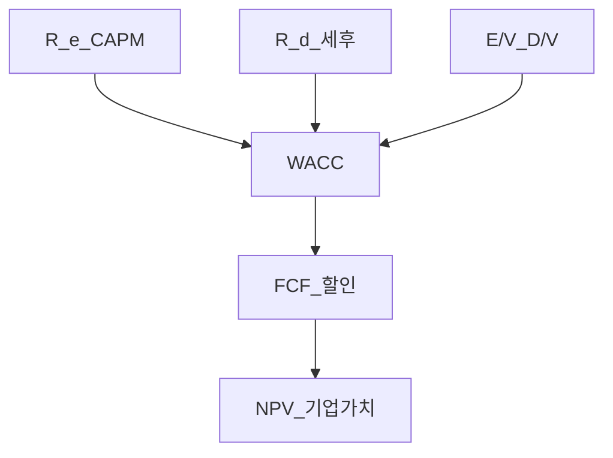
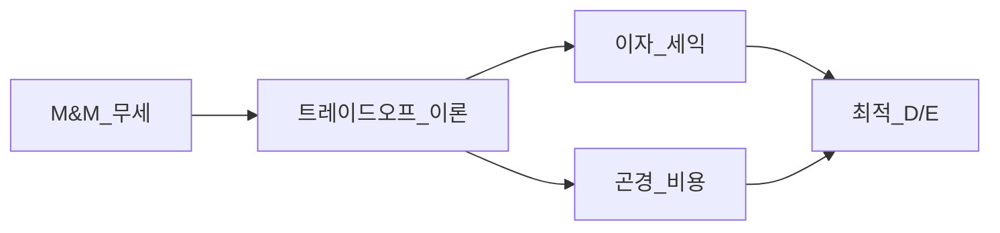

# WACC·자본구조 — CAPM·부채비용·M&M·최적 구조 입문

> **면책**: 본 문서는 교육 목적이며, 특정 기업·개인 투자에 대한 자문이 아닙니다. WACC·베타·신용스프레드는 **추정치**이며 시점·정의에 따라 달라집니다. 실행·밸류에이션 전 **공시·감사보고서·전문가** 확인.

## 메타

| 항목 | 내용 |
|------|------|
| 최종 검증일 | 2026-05-24 |
| 난이도 | L4 (Graduate) — [READER-GUIDE](../docs/READER-GUIDE.md) |
| 예상 읽기 시간 | 150~180분 |
| 관련 bucket | Bucket 3 (밸류에이션·섹터 이해) |

## 0. 이 편 읽기 전 (5분)

| 항목 | 내용 |
|------|------|
| **난이도** | L4 (Graduate) — [READER-GUIDE §L등급](../docs/READER-GUIDE.md) |
| **선수** | 없음 |
| **이번 편에서 쓰는 기호** | 본문 §4·§4a 표 참고 |
| **복습 한 줄** | L3 선수 편을 먼저 읽으면 수식이 수월함 |

## TL;DR

1. **WACC(Weighted Average Cost of Capital)** = **부채·자기자본** **비용**의 **시장가치 가중 평균** — **할인율**로 **사용**.
2. **자기자본 비용** \(R_e\) — **CAPM** [capm-and-risk-return](../08-advanced/capm-and-risk-return.md) **주류**: \(R_e = R_f + \beta_e (R_m - R_f)\).
3. **부채 비용** \(R_d\) — **이자율**·**신용등급**; **세후** \(R_d(1-T)\) (**이자** **세금** **공제**).
4. **M&M**: **완전시장** **가정** 하 **자본구조**와 **기업가치** **무관** (Proposition I) — **현실**에서는 **세금**·**파산비용**·**정보** **비대칭**.
5. **최적 자본구조** — **세무** **실익** vs **재무** **곤경** **비용** **트레이드오프**.
6. **한국** **대기업** — **낮은** **부채**·**지배구조**·**현금** **보유** — **섹터**·**조선**·**반도체** **사이클** **별도**.

---

## 1. 한 줄 정의 + 왜 중요한가

**정의**: **WACC**는 기업이 **자산**에 **투자**할 때 **요구되는** **최소** **수익률**(기회비용)의 **가중평균**입니다. **DCF** **밸류에이션**·**NPV**·**프로젝트** **선택**의 **핵심** **입력**입니다.

**왜 중요한가**: “**이 회사** **싸다**”는 **미래** **현금흐름**을 **어떤** **할인율**로 **현재가치**화하느냐에 **달림**. **부채** **많은** **회사** vs **현금** **많은** **회사** — **리스크**·**WACC** **다름**. [financial-statements-analysis](../01-foundations/financial-statements-analysis.md) **재무** **비율**과 **연결**.

---

## 2. 선수 / 이후

**선수**: [financial-statements-intro](../01-foundations/financial-statements-intro.md), [capm-and-risk-return](../08-advanced/capm-and-risk-return.md), [compound-interest-and-time-value](../01-foundations/compound-interest-and-time-value.md)  
**이후**: [ma-basics.md](ma-basics.md) (예정), [wacc](../09-corporate-finance/) 섹터 **사례**

---

## 3. 직관·비유

**WACC = 회사의 “혼합 금리”**: **은행** **대출**(부채)과 **주주** **요구** **수익**(자본)을 **시장** **가치** **비율**로 **섞은** **평균**. **프로젝트** **수익률**이 **WACC** **초과**해야 **주주** **가치** **창출**(NPV>0).

**레버리지 = 빌려 키우기**: **ROE** **확대** **가능** but **파산** **위험** **↑** — **M&M** **트레이드오프**.

---

## 4. 정식 용어

| 용어 | English | 정의 |
|------|---------|------|
| WACC | Weighted avg cost of capital | 가중 자본비용 |
| \(R_e\) | Cost of equity | 주주 요구수익 |
| \(R_d\) | Cost of debt | 부채 비용 |
| \(T\) | Tax rate | 법인세율 |
| D/V, E/V | Capital weights | 부채·자본 비중 |
| β_L, β_U | Levered/unlevered beta | 부채 반영 여부 |
| D/E | Debt-to-equity | 레버리지 |
| NPV | Net present value | WACC 할인 |
| APV | Adjusted present value | M&M 대안 |
| 재무 곤경 | Financial distress | 부도 근접 비용 |
| 신용스프레드 | Credit spread | 무위험 대비 |

### 4a. 핵심 용어 (본문 등장 순)

> 복습용. 정의는 §4 본표·[glossary](../00-roadmap/glossary.md)·본문 `!!! info` 박스.

| 용어 | 한 줄 | 관련 이론 | glossary |
|------|-------|-----------|----------|
| WACC | 가중 자본비용 | §4 | [glossary](../00-roadmap/glossary.md#wacc) |
| \(R_e\) | 주주 요구수익 | §4 | [glossary](../00-roadmap/glossary.md#\) |
| \(R_d\) | 부채 비용 | §4 | [glossary](../00-roadmap/glossary.md#\) |
| \(T\) | 법인세율 | §4 | [glossary](../00-roadmap/glossary.md#\) |
| D/V, E/V | 부채·자본 비중 | §4 | [glossary](../00-roadmap/glossary.md#d/v,-e/v) |
| β_L, β_U | 부채 반영 여부 | §4 | [glossary](../00-roadmap/glossary.md#β_l,-β_u) |
| D/E | 레버리지 | §4 | [glossary](../00-roadmap/glossary.md#d/e) |
| NPV | WACC 할인 | §4 | [glossary](../00-roadmap/glossary.md#npv) |
| APV | M&M 대안 | §4 | [glossary](../00-roadmap/glossary.md#apv) |
| 재무 곤경 | 부도 근접 비용 | §4 | [glossary](../00-roadmap/glossary.md#재무-곤경) |
| 신용스프레드 | 무위험 대비 | §4 | [glossary](../00-roadmap/glossary.md#신용스프레드) |

---

## 5. WACC 공식

\[
WACC = \frac{E}{V} R_e + \frac{D}{V} R_d (1 - T)
\]

\(V = D + E\) (**시장** **가치** **기준** **권장**).

### 5.1 가중치: 장부 vs 시장

| | 장부가치 | 시장가치 |
|--|----------|----------|
| E | **회계** **자본** | **시총** |
| D | **장부** **부채** | **채권** **시가** (또는 **장부** **근사**) |
| 밸류에이션 | **부적합** | **표준** |

### 5.2 \(R_e\) — CAPM

\[
R_e = R_f + \beta_L (E(R_m) - R_f) + \text{(optional premium)}
\]

- **\(R_f\)**: **국채** **수익률** — [macro-02](../02-economics/macro-02-money-inflation.md) **금리**
- **\(\beta_L\)**: **레버** **베타** — **주가** **회귀**
- **ERP** \(E(R_m)-R_f\): **역사** **평균** **또는** **전망** — **5~7%** **논쟁** (교육)

**한국**: **KOSPI** **개별** **β** — **데이터** **벤더**; **글로벌** **사업** → **글로벌** **β** **논의**.

### 5.3 \(R_d\) — 부채 비용

\[
R_d \approx YTM_{\text{채권}} \quad \text{또는} \quad R_f + \text{Credit Spread}
\]

**세후**: **이자** **비용** **절감** — **법인세** **\(T\)**.

**한계**: **적자**·**세금** **공제** **한도** — **\(T\)** **효과** **축소**.

### 5.4 Unlever · Relever β (Hamada 교육)

\[
\beta_L = \beta_U \left[1 + (1-T)\frac{D}{E}\right]
\]

**동종** **β_U**에서 **목표** **D/E**로 **재조정** — **비교** **기업** **밸류에이션**.

---

## 6. Modigliani-Miller (M&M) 직관

### 6.1 Proposition I (무세·완전시장)

**기업가치** = **자산** **현금흐름** — **자본구조** **무관**.  
**피자** **크기** — **조각** **수**(부채·주식)만 **바뀜**.

### 6.2 Proposition II (무세)

| 기호 | 이름 | 이 식에서 의미 |
|       ------       | ------ | ------이(가) 이 식에서 맡는 역할(§4·본문 참고) |
|   \(R_\)   | R  | R 이(가) 이 식에서 맡는 역할(§4·본문 참고) |
|             \(e\)             | e | e이(가) 이 식에서 맡는 역할(§4·본문 참고) |
|   \(R_0\)   | R 0 | R 0이(가) 이 식에서 맡는 역할(§4·본문 참고) |
|             \(d\)             | d | d이(가) 이 식에서 맡는 역할(§4·본문 참고) |
|             \(D\)             | D | D이(가) 이 식에서 맡는 역할(§4·본문 참고) |
|             \(E\)             | E | E이(가) 이 식에서 맡는 역할(§4·본문 참고) |
\[
R_e = R_0 + (R_0 - R_d)\frac{D}{E}
\]

**읽는 법**: **R_**와 **e**의 관계를 위 식으로 쓴다. 경제·재무 해석은 변수표 「이 식에서 의미」와 [DEPTH-STANDARD](../docs/DEPTH-STANDARD.md) 기호 예제를 맞춘다.
**유도 (L4)**:
1. **정의**: **R_**, **e**, **R_0**를 동일 시점·동일 통화로 맞춘다. — 단위 불일치면 식이 무의미해진다.
2. **식 변형**: 양변을 정리해 목표 변수를 한쪽에 둔다. — 할인·복리는 **시점 이동**이 핵심이다.
3. **해석**: 부호·크기가 경제 직관과 맞는지 확인한다. — 극단값에서 단조성·한계를 점검한다.

**레버리지** **↑** → **\(R_e\)** **↑** — **주주** **위험** **보상**.

### 6.3 세금과 M&M

**이자** **공제** → **부채** **유리** — **하지만** **무한** **부채** **아님** — **파산**·**에이전시** **비용**.

### 6.4 현실 마찰

| 마찰 | 효과 |
|------|------|
| **법인세** | **부채** **유리** |
| **파산비용** | **부채** **불리** |
| **에이전시** | **과투자**·**무배당** |
| **정보** **비대칭** | **우선주**·**전환** |
| **시장** **비효율** | **타이밍** **발행** |

---

## 7. 최적 자본구조 (입문)

**Trade-off theory**: **한계** **세무** **이익** = **한계** **곤경** **비용**인 **D/E**.

**Pecking order**: **내부** **자금** → **부채** → **주식** ( **주식** **발행** = **부정** **신호**).

| 이론 | 최적 구조 |
|------|-----------|
| M&M 무세 | **무관** |
| Trade-off | **중간** **D/E** |
| Pecking order | **계층** **예측** |
| 시장 타이밍 | **실증** **혼재** |

**투자자** **관점**: **고부채** **주식** = **레버** **β** **↑** — [capm](../08-advanced/capm-and-risk-return.md).

---

## 8. DCF와 WACC (교육)

**기업가치**:

\[
V = \sum_{t=1}^{T} \frac{FCF_t}{(1+WACC)^t} + \frac{TV}{(1+WACC)^T}
\]

**TV** (Gordon):

\[
TV = \frac{FCF_{T+1}}{WACC - g}
\]

**\(g\)** **> WACC** **불가** — **민감도** **극대** — **2×2** **표** **필수**.

**FCF** 정의: **영업** **현금** − **CAPEX** — [cash-flow-basics](../01-foundations/cash-flow-basics.md).

---

## 9. 한국 기업·시장

### 9.1 구조적 특징

| 특징 | WACC·구조 함의 |
|------|----------------|
| **대기업** **낮은** **부채** | **\(R_d\)** **낮음** but **\(E/V\)** **높음** |
| **현금** **보유** | **실질** **순부채** **음수** |
| **지배구조** | **지주** **할인** |
| **조선·해운** | **사이클** **고부채** **구간** |
| **바이오** | **적자** — **\(R_e\)** **only** |
| **금리** | [macro-02](../02-economics/macro-02-money-inflation.md) **\(R_f\)** **변동** |

### 9.2 섹터 예시 (교육·가상)

| 섹터 | D/E(가상) | WACC(가상) | 코멘트 |
|------|-----------|------------|--------|
| 반도체 | 낮음 | 8% | **현금** — [semiconductor](../03-markets/sectors/semiconductor.md) |
| 유틸리티 | 중간 | 6% | **안정** **FCF** |
| 리츠 | 높음 | 7% | **구조** **다름** |
| 스타트업 | — | 12%+ | **\(R_e\)** **주도** |

### 9.3 개인 투자자

**WACC** **직접** **계산** **드묾** — **이해**로 **“부채** **많은** **저PBR”** **리스크** **인지**. **애널** **목표주가** **=** **그들의** **WACC** **가정** **검증** **불가** → **보수**.

---

## 10. 숫자 예제 (가상)

### 예제 1: WACC 계산

| | |
|--|--|
| E/V | 70% |
| D/V | 30% |
| \(R_e\) | 10% |
| \(R_d\) | 5% |
| T | 25% |

\[
WACC = 0.7 \times 10\% + 0.3 \times 5\% \times (1-0.25) = 7\% + 1.125\% = 8.125\%
\]

### 예제 2: 레버리지와 ROE

| | 무레버 | 레버 50% |
|--|--------|----------|
| ROA | 8% | 8% |
| ROE | 8% | **12%** (가상) |
| 위험 | 낮음 | **높음** |

### 예제 3: NPV

**FCF** **100**, **WACC** **8%**, **영구** **g=2%**:

\[
V = \frac{100}{0.08-0.02} = 1{,}667 \quad \text{(가상 교육)}
\]

**WACC** **9%** → **1,429** — **1%** **↑** **가치** **14%** **↓**.

---

**Q. 실무에서는?**  
교과서 식·기호를 그대로 적용하기 전에 **수수료·세금·데이터 시점**을 분리한다. 숫자는 [DEPTH-STANDARD](../docs/DEPTH-STANDARD.md)처럼 기호만 먼저 맞추고, 법령·시장 수치는 §8 표·외부 출처로 갱신한다.

## 11. FAQ

**Q1.** WACC 낮으면 좋은 회사? — **리스크** **조정** **후** **프로젝트** **수익** **비교**.  
**Q2.** 장부 D/E? — **시장** **가중** **권장**.  
**Q3.** M&M 현실? — **직관** — **세금**·**곤경** **중요**.  
**Q4.** 한국 **저PBR** = **저WACC**? — **아님** — **곤경** **프리미엄**.  
**Q5.** β **어디서**? — **증권사**·**Bloomberg** — **정의** **확인**.  
**Q6.** **음의** **순부채**? — **현금** **많음** — **D** **0** **근사**.  
**Q7.** **APV**? — **부채** **효과** **분리** — **고급**.  
**Q8.** **개인** **필수**? — **개념** **수준** **권장**.

---

## 연습문제 (L4, 기호)

1. 위 §6 주요 식에서 변수 하나를 미지로 두고, 나머지를 기호로 둔 **관계식**을 쓰시오.
2. 가정이 깨질 때(유동성·세금·다중 IRR 등) 위 식의 **한계**를 기호·부등식으로 서술하시오.
3. §8 예제와 동일 기호(M·P·PV 등)로 **부호·단조성**만 검증하는 짧은 논증을 하시오.

### 해설 키

1. 직전 변수표의 「이 식에서 의미」를 이용해 동일 차원으로 정리한다.
2. 「가정이 깨지면」 절의 한계 사례와 연결한다.
3. 숫자 대입 없이 **부호**·**단위** 일치만 확인한다.
## 12. 함정

- **WACC** **고정** **가정** **10년**  
- **β** **과거** **=** **미래**  
- **ERP** **임의**  
- **TV** **g** **과대**  
- **M&M** **만능** — **세금** **무시**

---

## 13. 체크리스트·퀴즈

| # | 항목 |
|---|------|
| 1 | E/V **시총** **기준**? |
| 2 | \(R_d\) **세후**? |
| 3 | **동종** **β**? |
| 4 | **TV** **민감도**? |
| 5 | **섹터** **D/E**? |

**퀴즈**: WACC 식? M&M I? Trade-off 요지? \(R_e\) CAPM? 세후 \(R_d\)?

---

## 부록 A — APV vs WACC

**APV**: **무레버** **가치** + **부채** **세이브** **NPV** — **복잡** **자본구조** **에** **유리**.

---

## 부록 B — Fama-French와 \(R_e\)

**CAPM** **대신** **FF** **요구수익** — [factor-investing-fama-french](../08-advanced/factor-investing-fama-french.md) — **고급** **밸류에이션**.

---

## 부록 C — 한국 조세 (교육)

**법인세** **율** **변경** → **\(T\)** **갱신** — **이자** **공제** **한도** **규정** **추적**.

---

## 부록 D — ESG·WACC

**탄소** **비용** **내부화** → **FCF** **↓** 또는 **\(R_e\)** **프리미엄** **↑** — [micro-04](../02-economics/micro-04-welfare-externalities.md).

---

## 부록 E — 지배구조·할인 (장문)

**지주사** **밸류에이션** — **SOTP** **합산** **후** **지배** **할인** — **WACC** **단일** **회사** **모형** **한계**. **순환** **출자** — **이중** **계산** **주의**.

---

## 부록 F — 프로젝트 WACC vs 회사 WACC

**사업부** **β** **다름** — **순수** **플레이** **규칙** — **반도체** **vs** **바이오** **합병** **시** **분리**.

---

## 부록 G — 금리·WACC (2025~2026)

**\(R_f\)** **상승** → **WACC** **↑** → **성장주** **밸류에이션** **압박** — **2022~23** **교훈**. **채권** **듀레이션** — [bonds](../03-markets/) 예정.

---

## 부록 H — 연습: 민감도 표

**WACC** **7,8,9%** × **g** **1,2,3%** — **TV** **9칸** **표** **작성** (가상 FCF).

---

## 부록 I — 재무제표 연결 (장문)

**이자보상배율** **EBIT/이자** — **\(R_d\)** **리스크** **신호**. **부채비율** **D/E** — **레버** **β** **예측**. **영업현금흐름**/**총부채** — **곤경** **거리**. [financial-statements-analysis](../01-foundations/financial-statements-analysis.md) **비율** **표** **병행**.

---

## 부록 J — M&A와 WACC (예고)

**인수** **시** **합병** **WACC** — **타겟** **β** **변화** — [ma-basics](ma-basics.md) 예정.

---

## 부록 K — 한국 산업 D/E 스캔 (교육)

**제조** **대형** **낮음**, **건설** **중간**, **게임** **현금** **많음**, **항공** **고변동** — **표** **직접** **작성** **연습**.

---

## 부록 L — 학습 로드맵

**Phase** **9** **1주차** — **WACC** **손계산** **3회**, **M&M** **그림** **그리기**, **공시** **부채** **1사** **읽기**. **다음**: M&A 입문.

---

## 부록 M — WACC 민감도 워크시트 (교육)

**입력**: \(R_f, \beta, ERP, D/V, R_d, T, g, FCF_1\). **출력**: **기업가치** **9시나리오**. **규칙**: **WACC** **+1%p** → **가치** **10~20%** **하락** **가능**(가상) — **성장주** **민감**.

---

## 부록 N — 부채 만기·구조

**단기** **부채** **↑** → **재융자** **리스크** → **\(R_d\)** **스프레드** **↑**. **만기** **사다리** — **곤경** **완화**. **한국** **회사채** **시장** **깊이** — **대형** **우선**.

---

## 부록 O — 배당·자사주와 구조

**배당** **↑** → **자본** **환원** — **부채** **비율** **상대** **↑**? **자사주** **취득** — **E** **↓** — **레버** **↑** **효과**. **투자자**: **배당** **수익률** **≠** **\(R_e\)**.

---

## 부록 P — 비교기업 선정 (Comps)

**동종** **3~5社** **EV/EBITDA** — **WACC** **역산** **민감**. **한국** **같은** **섹터** **다른** **지배구조** — **할인** **조정**.

---

## 부록 Q — 실무 인터뷰 질문 (교육)

“**WACC** **어떻게** **잡았나**?” “**β** **출처**?” “**TV** **g**?” — **애널** **리포트** **읽을** **때** **체크**.

---

## 부록 R — 조선·해운 사이클 (장문)

**호황** **EBITDA** **↑** → **부채** **상환** **능력** **↑** → **\(R_d\)** **↓**. **불황** **역전** — **곤경** **비용** **급등** — **주가** **선행** **반영** — **WACC** **비선형**. **투자**: **사이클** **정점** **저PBR** **≠** **안전**.

---

## 부록 S — 바이오·적자 기업

**\(R_e\)** **만** — **WACC** **≈** **\(R_e\)** — **NPV** **불안정** — **옵션** **성** **가치** **논의**(실무 **고급**).

---

## 부록 T — ESG WACC 프리미엄

**탄소** **집약** **기업** **\(R_e\)** **+0.5~2%p** **가정** **시나리오** — **교육**.

---

## 부록 U — 연습: β relever

**\(\beta_U=1.0\)**, **T=25%**, **목표** **D/E=0.5** → **\(\beta_L\)** **계산** — **Hamada**.

---

## 부록 V — 공시 읽기 실습

**DART** **재무상태표** **부채** **비율** + **시총** → **D/V** **근사** **1社**.

---

## 부록 W — M&M 퀴즈 확장

**피자** **비유** **그림** **그리기**. **레버** **↑** **시** **\(R_e\)** **↑** **이유** **설명** **30초**.

---

## 부록 X — Phase 9 로드맵

**2주차** **M&A** — **WACC** **합산** **모형**. **3주차** **실무** **케이스** **2건**.

---

## 부록 Y — WACC·자본구조 통합 교육 (장문)

**WACC**는 **기업**이 **자산**에 **투자**할 때 **요구되는** **최소** **할인율**로, **DCF** **가치평가**의 **심장**이다. **자기자본 비용** \(R_e\)는 **주주**가 **같은** **위험** **투자**에서 **기대**하는 **수익**이며, **CAPM**으로 **추정**하는 것이 **표준**이다. **무위험** **수익률** \(R_f\)는 **국채** **수익률**에 **가깝고**, **시장** **위험** **프리미엄** \(E(R_m)-R_f\)는 **역사적** **평균** **또는** **전망**에 **따라** **5~7%** **부근**에서 **논쟁**한다. **레버** **베타** \(\beta_L\)는 **부채** **비율**이 **높을수록** **커질** **수** **있어**, **고부채** **기업** **주식**은 **시장** **하락**에 **더** **민감**할 **수** 있다.

**부채 비용** \(R_d\)는 **회사채** **만기** **수익률** **또는** **신용** **등급** **스프레드**로 **추정**한다. **법인세** **\(T\)** **때문에** **이자** **비용**은 **세후** \(R_d(1-T)\)로 **WACC**에 **들어간다**. **이것**이 **M&M** **세금** **버전**에서 **부채**가 **유리**해 **보이는** **이유**다. **그러나** **무한** **부채**는 **최적**이 **아니다**. **파산** **비용**·**재무** **곤경** **비용**·**에이전시** **비용**이 **부채** **한계** **이익**을 **상쇄**한다. **Trade-off** **이론**은 **최적** **D/E**가 **존재**한다고 **말**하며, **Pecking** **order**는 **기업**이 **내부** **자금**을 **먼저** **쓰고** **주식** **발행**을 **피한다**고 **말**한다.

**한국** **대기업**은 **글로벌** **대비** **낮은** **부채** **비율**과 **높은** **현금** **보유**가 **특징**인 **경우**가 **많다**. **이는** **WACC**에서 **\(R_d\)** **비중**이 **작고** **\(R_e\)** **비중**이 **크다**는 **뜻**이다. **지배구조** **할인**은 **SOTP** **합산** **가치**에 **할인**을 **적용**하는 **방식**으로 **반영**되며, **단일** **WACC** **모형**만으로는 **부족**할 **수** 있다. **조선·해운** **사이클** **기업**은 **호황**에 **부채** **비율**이 **낮아** **보이다** **불황**에 **급격히** **악화**될 **수** **있다**.

**개인** **투자자**는 **WACC**를 **매일** **계산**하지 **않아도** **된다**. **다만** **다음**을 **이해**하면 **밸류에이션** **뉴스**가 **선명**해진다. **첫째**, **금리** **상승**은 **\(R_f\)** **↑** → **WACC** **↑** → **성장** **주식** **밸류에이션** **압박**. **둘째**, **고부채** **저PBR**은 **저평가**가 **아니라** **곤경** **프리미엄**일 **수** **있다**. **셋째**, **애널** **목표가**는 **암묵적** **WACC**·**g** **가정**을 **포함**한다. **넷째**, **FCF** **할인**은 [cash-flow-basics](../01-foundations/cash-flow-basics.md) **영업** **현금** **흐름** **문법**과 **연결**된다.

**실습** **권장**: **가상** **기업** **1社**에 **E/V=70%**, **\(R_e=10%\)**, **\(R_d=5%\)**, **T=25%** → **WACC≈8.1%** **손계산**. **FCF=100**, **g=2%** → **가치** **민감도** **표** **작성**. **Hamada**로 **동종** **β** **재레버**. **DART**에서 **부채** **비율** **읽기**. **다음** **단계** [ma-basics](ma-basics.md)에서 **인수** **합산** **WACC**를 **확장**한다.

---

## 부록 Z — M&M·WACC 퀴즈 15선

1. WACC 식? 2. 세후 \(R_d\)? 3. M&M I 무세? 4. Trade-off? 5. β_L↑ 원인? 6. TV 민감? 7. 한국 낮은 D/E? 8. Pecking order? 9. APV vs WACC? 10. 고부채 저PBR?

## 부록 AA — DCF 단계별 체크리스트 (15단계)

1. **FCF** **정의** **일관** 2. **WACC** **시장** **가중** 3. **β** **출처** 4. **ERP** **가정** 5. **\(R_d\)** **YTM** 6. **T** **법인세** 7. **예측기** **5~10년** 8. **TV** **g<WACC** 9. **민감도** **표** 10. **순차입** **현금** 11. **비영업** **자산** 12. **지분** **가치** 13. **주당** **가치** 14. **시장** **비교** 15. **결론** **범위**

---

## 부록 AB — 한국 채권·신용 스프레드 (교육)

**국고채** **3년** **=** **\(R_f\)** **근사**. **AA** **회사채** **스프레드** **+80bp** (가상) → **\(R_d\)**. **투기** **등급** **스프레드** **급등** **국면** — **곤경** **신호**.

---

## 부록 AC — 자본구조 사건 연구 (가상)

**A社**: **현금** **많음** **→** **자사주** **→** **E↓** **→** **β_L↑**?. **B社**: **회사채** **발행** **→** **D↑** **→** **WACC**? **세금** **vs** **신용** **등급** **하락**.

---

## 부록 AD — 투자자용 WACC 오해 10가지

1. WACC↓=좋은 주식 2. 장부 D/E 3. β 고정 4. ERP 임의 5. TV g=GDP 6. M&M 만능 7. 배당=WACC 8. PER=WACC 9. 현금 무시 10. 지배할인 무시

## 부록 AE — 밸류에이션·자본구조 통합 워크숍 (교육 장문)

워크숍 1: 가상 기업의 부채비율·이자보상배율·현금을 DART 형식 표로 정리하고, 곤경 거리를 평가한다.

워크숍 2: 동종 3社 PER·EV/EBITDA를 비교하고, WACC 차이가 배수 차이에 어떻게 연결되는지 가설을 쓴다.

워크숍 3: 금리 +1%p 시 WACC와 TV 민감도 표를 갱신한다. 성장주 vs 가치주 중 어느 쪽이 더 민감한지 토론한다.

워크숍 4: M&M 무세·세금·곤경 비용을 그림 3개로 그린다. 최적 D/E는 산업·국가·사이클마다 다름을 정리한다.

워크숍 5: 자사주·배당·부채 발행이 D/E와 β_L에 미치는 방향을 사건 순서로 설명한다.

워크숍 6: 한국 대기업의 낮은 부채가 WACC에 미치는 영향 — Rd 비중 작음, Re 비중 큼.

워크숍 7: 지배구조 할인을 WACC에 더하는 대안 vs SOTP 할인 — 언제 어떤 모형을 쓰는지.

개인 투자자는 DCF를 매일 돌리지 않아도, ‘고부채 저PBR=저평가’ 오해를 피하는 것만으로도 리스크 관리에 도움이 된다.

## 부록 AF — WACC·M&M 최종 정리 (교육 장문)

WACC = E/V·Re + D/V·Rd·(1-T)이다. Re는 CAPM Rf + β(E(Rm)-Rf)로 추정한다. Rd는 채권 YTM·신용 스프레드, 세후 반영이 핵심이다. M&M 무세 세계에서는 자본구조가 무관하고, 세금·곤경·에이전시가 현실의 마찰이다. Trade-off는 최적 D/E, Pecking order는 내부자금 우선이다. DCF에서 WACC로 FCF를 할인하고 TV는 g<WACC를 강제한다. 한국 대기업은 낮은 D/E·현금·지배구조 이슈가 있다. 개인은 WACC를 매일 계산하지 않아도 고부채 저PBR 오해·금리 민감·애널 가정 검증에 쓴다. [capm-and-risk-return](../08-advanced/capm-and-risk-return.md)·[financial-statements-analysis](../01-foundations/financial-statements-analysis.md)·[cash-flow-basics](../01-foundations/cash-flow-basics.md)와 연결한다.

**교육 메모**: 본 장은 L4 graduate 수준으로 시장 효율성·파생·팩터·WACC를 한국 투자자 맥락에서 통합한다. 수치·종목은 가상이며 실행 전 공식 출처를 확인한다. 코어는 저비용 인덱스, 보조는 한도 내 팩터, 파생 투기는 비권장, 밸류에이션은 WACC 민감도를 본다. 
**교육 메모**: 본 장은 L4 graduate 수준으로 시장 효율성·파생·팩터·WACC를 한국 투자자 맥락에서 통합한다. 수치·종목은 가상이며 실행 전 공식 출처를 확인한다. 코어는 저비용 인덱스, 보조는 한도 내 팩터, 파생 투기는 비권장, 밸류에이션은 WACC 민감도를 본다. 
**교육 메모**: 본 장은 L4 graduate 수준으로 시장 효율성·파생·팩터·WACC를 한국 투자자 맥락에서 통합한다. 수치·종목은 가상이며 실행 전 공식 출처를 확인한다. 코어는 저비용 인덱스, 보조는 한도 내 팩터, 파생 투기는 비권장, 밸류에이션은 WACC 민감도를 본다. 
**교육 메모**: 본 장은 L4 graduate 수준으로 시장 효율성·파생·팩터·WACC를 한국 투자자 맥락에서 통합한다. 수치·종목은 가상이며 실행 전 공식 출처를 확인한다. 코어는 저비용 인덱스, 보조는 한도 내 팩터, 파생 투기는 비권장, 밸류에이션은 WACC 민감도를 본다. 
**교육 메모**: 본 장은 L4 graduate 수준으로 시장 효율성·파생·팩터·WACC를 한국 투자자 맥락에서 통합한다. 수치·종목은 가상이며 실행 전 공식 출처를 확인한다. 코어는 저비용 인덱스, 보조는 한도 내 팩터, 파생 투기는 비권장, 밸류에이션은 WACC 민감도를 본다. 
**교육 메모**: 본 장은 L4 graduate 수준으로 시장 효율성·파생·팩터·WACC를 한국 투자자 맥락에서 통합한다. 수치·종목은 가상이며 실행 전 공식 출처를 확인한다. 코어는 저비용 인덱스, 보조는 한도 내 팩터, 파생 투기는 비권장, 밸류에이션은 WACC 민감도를 본다. 
**교육 메모**: 본 장은 L4 graduate 수준으로 시장 효율성·파생·팩터·WACC를 한국 투자자 맥락에서 통합한다. 수치·종목은 가상이며 실행 전 공식 출처를 확인한다. 코어는 저비용 인덱스, 보조는 한도 내 팩터, 파생 투기는 비권장, 밸류에이션은 WACC 민감도를 본다. 
**교육 메모**: 본 장은 L4 graduate 수준으로 시장 효율성·파생·팩터·WACC를 한국 투자자 맥락에서 통합한다. 수치·종목은 가상이며 실행 전 공식 출처를 확인한다. 코어는 저비용 인덱스, 보조는 한도 내 팩터, 파생 투기는 비권장, 밸류에이션은 WACC 민감도를 본다. 
**교육 메모**: 본 장은 L4 graduate 수준으로 시장 효율성·파생·팩터·WACC를 한국 투자자 맥락에서 통합한다. 수치·종목은 가상이며 실행 전 공식 출처를 확인한다. 코어는 저비용 인덱스, 보조는 한도 내 팩터, 파생 투기는 비권장, 밸류에이션은 WACC 민감도를 본다. 
**교육 메모**: 본 장은 L4 graduate 수준으로 시장 효율성·파생·팩터·WACC를 한국 투자자 맥락에서 통합한다. 수치·종목은 가상이며 실행 전 공식 출처를 확인한다. 코어는 저비용 인덱스, 보조는 한도 내 팩터, 파생 투기는 비권장, 밸류에이션은 WACC 민감도를 본다. 
**교육 메모**: 본 장은 L4 graduate 수준으로 시장 효율성·파생·팩터·WACC를 한국 투자자 맥락에서 통합한다. 수치·종목은 가상이며 실행 전 공식 출처를 확인한다. 코어는 저비용 인덱스, 보조는 한도 내 팩터, 파생 투기는 비권장, 밸류에이션은 WACC 민감도를 본다. 
**교육 메모**: 본 장은 L4 graduate 수준으로 시장 효율성·파생·팩터·WACC를 한국 투자자 맥락에서 통합한다. 수치·종목은 가상이며 실행 전 공식 출처를 확인한다. 코어는 저비용 인덱스, 보조는 한도 내 팩터, 파생 투기는 비권장, 밸류에이션은 WACC 민감도를 본다. 
**교육 메모**: 본 장은 L4 graduate 수준으로 시장 효율성·파생·팩터·WACC를 한국 투자자 맥락에서 통합한다. 수치·종목은 가상이며 실행 전 공식 출처를 확인한다. 코어는 저비용 인덱스, 보조는 한도 내 팩터, 파생 투기는 비권장, 밸류에이션은 WACC 민감도를 본다. 
**교육 메모**: 본 장은 L4 graduate 수준으로 시장 효율성·파생·팩터·WACC를 한국 투자자 맥락에서 통합한다. 수치·종목은 가상이며 실행 전 공식 출처를 확인한다. 코어는 저비용 인덱스, 보조는 한도 내 팩터, 파생 투기는 비권장, 밸류에이션은 WACC 민감도를 본다. 
**교육 메모**: 본 장은 L4 graduate 수준으로 시장 효율성·파생·팩터·WACC를 한국 투자자 맥락에서 통합한다. 수치·종목은 가상이며 실행 전 공식 출처를 확인한다. 코어는 저비용 인덱스, 보조는 한도 내 팩터, 파생 투기는 비권장, 밸류에이션은 WACC 민감도를 본다. 
**교육 메모**: 본 장은 L4 graduate 수준으로 시장 효율성·파생·팩터·WACC를 한국 투자자 맥락에서 통합한다. 수치·종목은 가상이며 실행 전 공식 출처를 확인한다. 코어는 저비용 인덱스, 보조는 한도 내 팩터, 파생 투기는 비권장, 밸류에이션은 WACC 민감도를 본다. ---

**L4 완료**: [DEPTH-STANDARD](../docs/DEPTH-STANDARD.md).