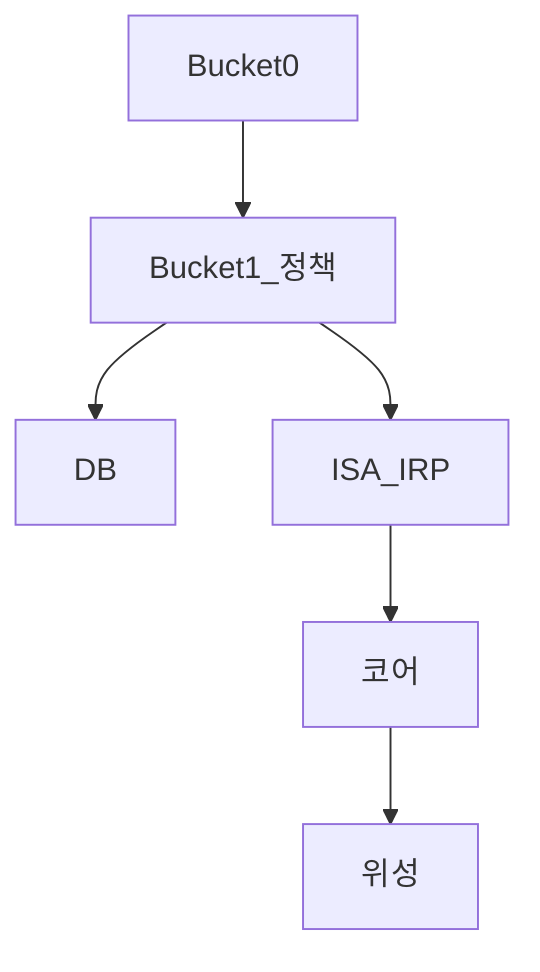

# 금융·투자 학습 지식 베이스 (L3 코퍼스)

경제학·금융 수준의 **교재급(L3+)** 장문 학습 자료입니다. 개인 급여·잔고·회사명은 포함하지 않습니다.

> **처음이신가요?** [독자 가이드](docs/READER-GUIDE.md)에서 **L1~L4 난이도**, Phase 읽기 순서, FV·PMT 같은 약어 읽는 법을 먼저 보세요.

## 면책

교육 목적이며 투자·세무·법률 자문이 아닙니다. 제도·세율·상품은 수시로 변경됩니다.

## 공부 시작

0. **[READER-GUIDE](docs/READER-GUIDE.md)** — **L1~L4** · Phase 순서 · 약어·수식  
1. **[CURRICULUM-MAP](00-roadmap/CURRICULUM-MAP.md)** — **전체 과목 지도** (~89과목 ✅)  
2. **[STUDY-START](00-roadmap/STUDY-START.md)** — Day 1·1주차  
3. **[ai-engineer-investing-playbook](00-roadmap/ai-engineer-investing-playbook.md)** — 가상 1년 실행  
4. **[required-reading-guide](00-roadmap/required-reading-guide.md)** — 필독서 **챕터별 요약** (책 없이)  
5. **[master-roadmap](00-roadmap/master-roadmap.md)** — Phase 0~9  
6. [glossary](00-roadmap/glossary.md) · [DEPTH-STANDARD](docs/DEPTH-STANDARD.md)(저자용) · [TERMINOLOGY-STANDARD](docs/TERMINOLOGY-STANDARD.md)

## Phase 맵

| Phase | 경로 | 핵심 |
|-------|------|------|
| 0~1 | [01-foundations/](01-foundations/) | 복리·**가계부**·보험·**재무제표 L4** |
| 2 | [02-economics/](02-economics/) | 미시·거시 **L4 11편** |
| 3 | [03-markets/](03-markets/) | **미국 ETF·Mag7**·밸류·채권·대안 |
| 3b | [sectors/](03-markets/sectors/) | 배터리·반도체·AI·피지컬 AI |
| 4 | [04-portfolio/](04-portfolio/) | **MPT·리스크·성과**·bucket |
| 5 | [06-korea-policy/](06-korea-policy/) | DB·ISA·**실전 세팅**·세금 |
| 6~9 | [05](05-behavioral/) · [07](07-real-estate/) · [08](08-advanced/) · [09](09-corporate-finance/) | 행동·REIT·**퀀트**·M&A |

## Bucket



[time-horizon-and-buckets.md](04-portfolio/time-horizon-and-buckets.md)

## DB 가입자 우선 5편

| # | 문서 |
|---|------|
| 1 | [db-pension](06-korea-policy/db-pension.md) |
| 2 | [irp](06-korea-policy/irp.md) |
| 3 | [isa](06-korea-policy/isa.md) |
| 4 | [overseas-stocks-tax-part1](06-korea-policy/tax/overseas-stocks-tax-part1-cgt.md) |
| 5 | [leveraged-etf-qqq-qld](04-portfolio/leveraged-etf-qqq-qld.md) |

**청년도약 → 미래적금**: [youth-future-savings](06-korea-policy/youth-future-savings.md)

## 분량

- **~95편** (L3 입문 + **L4 전공자** 50편+)  
- L4 편당 **2.5~4h** · 전체 **18~24개월** ([CURRICULUM-MAP](00-roadmap/CURRICULUM-MAP.md))

## 웹으로 읽기 (GitHub Pages)

- **배포**: `main` 브랜치 push 시 [GitHub Actions](.github/workflows/pages.yml)가 린트 후 MkDocs Material 사이트를 빌드합니다.
- **URL**: [https://goldanghenry.github.io/Finances/](https://goldanghenry.github.io/Finances/) — 수식·Phase 메뉴·`!!! info` 박스는 **사이트**에서 확인 ([READER-GUIDE](docs/READER-GUIDE.md) §GitHub vs Pages).
- **로컬 미리보기**:
  ```bash
  python3 -m venv .venv && source .venv/bin/activate
  pip install -r requirements-docs.txt
  python scripts/materialize_webdocs.py && python scripts/generate_phase_nav.py
  SITE_URL=https://goldanghenry.github.io/Finances/ mkdocs serve
  ```
- **비공개 노트**: `private/` 폴더는 [`.gitignore`](.gitignore) 대상 — [설명](docs/private-notes.md)
- **최초 배포 절차**: [github-pages-deploy.md](docs/github-pages-deploy.md)
