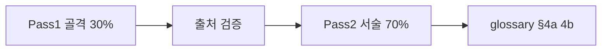

# 문서 깊이 표준 (DEPTH-STANDARD)

> **저자·편집용** — 일반 독자는 [읽는 법](READER-GUIDE.md)만 보시면 됩니다. GitHub Pages 사이트 메뉴에는 없습니다.

본 저장소의 모든 학습 문서는 아래 등급·품질 게이트를 따릅니다.

> **현황**: Phase 0~8 **본문**은 [L3-CORPUS-STATUS.md](L3-CORPUS-STATUS.md) 기준 **L3(≥10,000자)**. `*-primer.md`·폴더 `README.md`는 L1 인덱스.

## 문서 등급

| 등급 | 목표 분량 | 용도 | 품질 게이트 |
|------|-----------|------|-------------|
| **L1 Primer** | 800~1,500 단어 (약 1,500~3,000자) | 첫 훑어보기·복습 | TL;DR + 핵심 표 + 3 FAQ |
| **L2 Standard** | 3,000~5,000 단어 (약 6,000~10,000자) | 본 학습 | [TEMPLATE](TEMPLATE.md) 12블록 중 **10개 이상** |
| **L3 Deep** | 5,000~8,000+ 단어 (약 10,000~16,000자+) | 교재·공유 | 12블록 **전부** + 가상 예제 **3개 이상** + mermaid 2개 이상 |
| **L4 Graduate** | 8,000~12,000+ 단어 (약 **18,000~30,000자+**) | **전공자·대학원 입문** | L3 + **모형 유도·비교정태학·한계 사례** + 교재급 FAQ 8+ + 연습문제 |

> **독자용 설명**은 [READER-GUIDE.md](READER-GUIDE.md) — L1~L4·Phase·약어. 본 문서는 **저자·편집** 표준.

## 독자 친화 (L2+ 필수, L3/L4 강제)

| 요소 | 위치 | 규칙 |
|------|------|------|
| **§0 선행 5분** | 메타 직후, TL;DR **앞** | 난이도·선수·이번 편 기호·복습 한 줄 |
| **첫 등장 박스** | 본문 약어 **첫 사용** | `!!! info "영문 (한글)"` — §0에 이미 있으면 생략 가능 |
| **§6 변수표** | 각 수식 **앞** | 기호·이름·이 식에서 의미 → LaTeX → 기호 예시 |
| **메타 난이도** | 메타 표 | `L3 (Deep)` 등 + [READER-GUIDE](READER-GUIDE.md) 링크 |
| **§4a** | §4 아래 | L3/L4: **8~15개**, 본문 등장 순 |

## 12블록 체크리스트 (L2+)

- [ ] 0. **이 편 읽기 전** (§0) — L2+
- [ ] 1. 메타 (검증일, 기준일, **난이도+READER-GUIDE**, 읽기 시간, 신규 기호)
- [ ] 2. 한 줄 정의 + bucket 연결
- [ ] 3. 선수 / 이후 링크
- [ ] 4. 직관·비유
- [ ] 5. 정식 용어 표
- [ ] 6. 메커니즘 (mermaid)
- [ ] 7. 수식·모델 (또는 "해당 없음")
- [ ] 8. 한국 적용 (2025 vs 2026 구분)
- [ ] 9. 가상 숫자 예제 2~3개
- [ ] 10. FAQ 5+
- [ ] 11. 함정·리스크
- [ ] 12. 심화 읽기 + 퀴즈

## 작성 워크플로 (2-pass)

1. **Pass 1**: 목차, 표, mermaid, 법조문·URL 목록  
2. **Pass 2**: 서술, 예제, FAQ, 퀴즈  
3. **용어**: [TERMINOLOGY-STANDARD.md](TERMINOLOGY-STANDARD.md) — §4a·§4b, [glossary.md](../00-roadmap/glossary.md) 교차링크  
4. **검증**: `references/sources.md`에 URL·검증일 기록

## 분할 규칙

- 한 파일 **12,000자 초과** 시 Part 1/2/3 분할  
- 같은 주제는 L1 primer + L2/L3 본문 분리 가능

## 공유·개인정보

- **금지**: 실제 연봉, 잔고, 회사명, 계좌번호  
- **허용**: 가상 인물(예: "가상의 직장인 A"), **기호·비율** 예제, 일반적 제도 설명(법정 한도 등)  
- **DB/DC**: 교재에는 둘 다 기술; 학습자 개인 유형은 문서에 넣지 않음

## 교육용 금액 기호 (공유·GitHub Pages)

**원칙**: 독자가 **본인 수치로 치환**할 수 있게 **구체 월급·지출액(예: 420만)** 은 쓰지 않는다. 제도 **법정 한도**(`L_ISA` 등)는 예외.

| 기호 | 의미 | 단위 |
|------|------|------|
| **M** | 월 **세후 실수령** | 만 원 |
| **R** | 월세·주거 (E01) | 만 원 |
| **C** | 생활·변동 (E05~E06) | 만 원 |
| **B** | 비상금 이체 (E08) | 만 원 |
| **T** | 투자·ISA/IRP 이체 (E07) | 만 원 |
| **NMB** | 필수 **순소비**(비상금 runway 분모) | 원/월 |
| **F₀** | 비상금·유동성 **합계**(runway 분자) | 원 |
| **L_ISA** | ISA **연 납입 한도**(제도) | 만 원 |
| **α_ISA, α_P, α_G** | ISA·연금·일반 **배분 비율** (합=1) | — |
| **P** | 가상 **포트폴리오 규모**(예제) | 만 원 |

**자주 쓰는 식**:

- 가계: \(M \approx R + C + B + T + \text{버퍼}\), 광의 저축률 \(= (B+T)/M\)  
- 플레이북: \(\text{ISA}_\text{월} = \alpha_\text{ISA} \cdot M\), 연 \(12\alpha_\text{ISA}M \stackrel{?}{\leq} L_\text{ISA}\)  
- runway: \(\text{개월} = F_0 / \text{NMB}\)

**퀴즈 정답**: 숫자 대신 **식·부등식** 또는 「독자 M 대입」으로 적는다.

## 출처 우선순위

1. 법령 ([law.go.kr](https://www.law.go.kr))  
2. 국세청·금융위·고용노동부·금감원·통합연금포털·kinfa  
3. 거래소·넥스트레이드 공식  
4. 블로그·언론 (보조, 단독 인용 금지)

## 파일 명명

- `kebab-case.md`  
- 시리즈: `topic-part1-subject.md`  
- 요약: `topic-primer.md`
