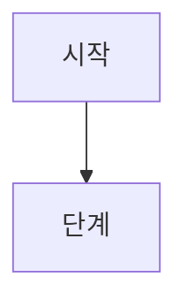

# [문서 제목]

> **면책**: 본 문서는 교육 목적이며, 특정 개인·법인에 대한 투자·세무·법률 자문이 아닙니다. 제도·세율·상품 조건은 변경될 수 있으므로 실행 전 공식 출처를 확인하세요.

## 메타

| 항목 | 내용 |
|------|------|
| 최종 검증일 | YYYY-MM-DD |
| 정책·법령 기준일 | YYYY-MM-DD (2025 확정 / 2026 개편 구분) |
| 난이도 | L1 / L2 / L3 |
| 예상 읽기 시간 | N분 |
| 관련 bucket | Bucket 0~4 중 해당 |

## TL;DR

1. (핵심 한 줄)
2. 
3. 
4. 
5. 

---

## 1. 한 줄 정의 + 왜 중요한가

**정의**: 

**왜 중요한가** (장기 자산 형성·bucket 연결):

---

## 2. 선수 지식 / 이후 읽을 것

**선수**:
- 

**이후**:
- 

---

## 3. 직관·비유

(비전공자도 이해할 수 있는 2~3단락)

---

## 4. 정식 개념·용어

| 용어 | 한글 | English | 정의 |
|------|------|---------|------|
| | | | |

### 4a. 핵심 용어 (본문 등장 순) — L2+ 권장

| 용어 | 한 줄 | 관련 이론 | glossary |
|------|-------|-----------|----------|
| | | | [glossary](../00-roadmap/glossary.md) |

→ 형식: [TERMINOLOGY-STANDARD.md](TERMINOLOGY-STANDARD.md) (8~15개)

### 4b. 관련 이론 미니맵 — L2+ 권장

- **이론/모형명** → 본 문서 §N / [관련 문서](../path.md)

---

## 5. 메커니즘

(본문에서 표·mermaid로 흐름 설명)

---

## 6. 수식·모델 (해당 시)

(복리, 세율, 레버리지 일일 리셋 등 — 해당 없으면 "해당 없음" 명시)

---

## 7. 한국 적용

### 7.1 2025년 기준 (확정)

### 7.2 2026년 개편·시행 예정 (해당 시)

| 항목 | 2025 | 2026 (시행 여부 명시) |
|------|------|------------------------|
| | | |

**법·정책 근거**: 소득세법 §N, 금융위·국세청 안내 등

---

## 8. 숫자 예제 (가상)

> 모든 인물·금액은 가상입니다.

### 예제 1

### 예제 2

---

## 9. FAQ

**Q1.**  
**A1.**

(최소 5쌍)

---

## 10. 함정·리스크·한계

- 

---

## 11. 심화 읽기

- [공식 출처](../references/sources.md)
- 교재·논문:

---

## 12. 스스로 점검 퀴즈

1. 
2. 
3. 

정답 힌트

