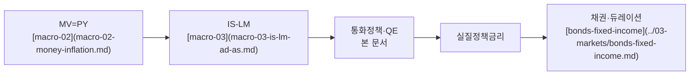
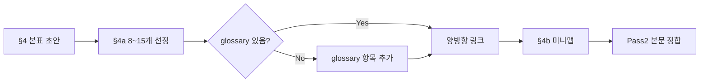
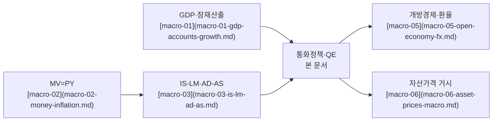
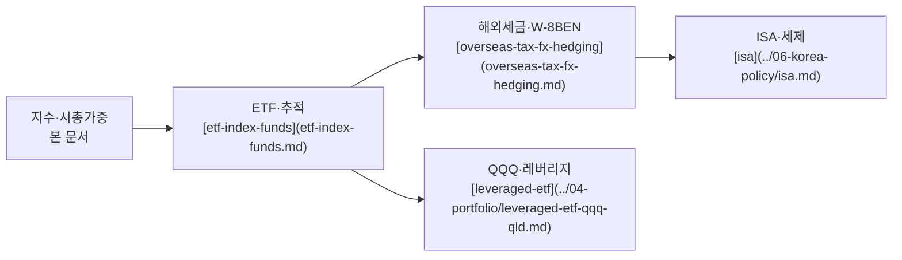
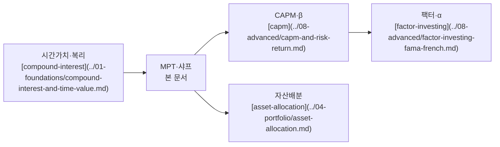

# 용어 블록 표준 (TERMINOLOGY-STANDARD)

> **저자·편집용** — 사이트 메뉴·검색에는 없습니다.

L2 이상 학습 문서의 **§4 정식 개념·용어** 안에 **`§4a 핵심 용어`** 와 **`§4b 관련 이론 미니맵`** 을 넣는 규칙입니다. 본문 표(§4 본표)와 분리해 **복습·교차 링크·이론 지도**에 쓰입니다.

> **연계**: [DEPTH-STANDARD](DEPTH-STANDARD.md) 12블록 · [TEMPLATE](TEMPLATE.md) §4 · [glossary.md](../00-roadmap/glossary.md) · **독자** [READER-GUIDE](READER-GUIDE.md)

---

## 0. 독자 친화 (§0·첫 등장)

- **§0**: [TEMPLATE](TEMPLATE.md) — 메타 다음, TL;DR 앞. L3/L4 **필수**.
- **첫 등장**: 본문에서 약어(FV, NPV, ISA…) **첫 사용** 시 `!!! info` 박스 — [READER-GUIDE §4](READER-GUIDE.md).
- **§6**: 수식 앞 **변수 설명표** — [DEPTH-STANDARD §독자 친화](DEPTH-STANDARD.md).
- §4a는 **복습 포인터**; 정의는 §4 본표·glossary·첫 등장 박스가 우선.

---

## 1. 적용 범위

| 등급 | §4 본표 | §4a | §4b |
|------|---------|-----|-----|
| L1 Primer | 선택(짧은 표) | **생략** | **생략** |
| L2 Standard | **필수** | **권장** | **권장** |
| L3 Deep | **필수** | **필수** | **필수** |
| L4 Graduate | **필수** | **필수** | **필수** (+ 심화 노드) |

- **§4 본표**: 문서 전용 정의·한글·English·한 줄 정의(기존 [TEMPLATE](TEMPLATE.md) 형식 유지).
- **§4a**: 독자가 **다른 장에서 다시 만날 핵심 어휘** — [glossary](../00-roadmap/glossary.md) 앵커로 연결.
- **§4b**: 이 문서가 **어떤 모형·선수 문서 위에 놓이는지** 한눈에 보는 **이론 그래프**(미니맵).

---

## 2. §4a 핵심 용어

### 2.1 목적

- 본문·FAQ·퀴즈에서 반복되는 **8~15개** 용어를 **한 블록**으로 모아 복습한다.
- 첫·재등장 시 `[용어](../00-roadmap/glossary.md#anchor)` 로 사전과 **양방향** 연결한다(사전 항목에는 **primary doc** 링크).

### 2.2 개수·선정 기준

| 기준 | 권장 |
|------|------|
| 개수 | **8~15개** (L2 최소 8, L3/L4 최대 15) |
| 포함 | 본 §4 표에 있거나, TL;DR·메커니즘에서 **3회 이상** 등장하는 용어 |
| 제외 | 해당 문서에서만 쓰이는 **고유명사·일회성 약어** (본표에만 두기) |
| 우선 | 다른 Phase 문서의 **선수·이후** 링크에 나오는 용어 |
| 사전 | [glossary](../00-roadmap/glossary.md)에 **없으면** 문서 완성 전 항목 추가 |

**너무 많을 때**: 15개 초과 예상이면 §4a에는 **8~10개 코어**만 두고, 나머지는 §4 본표·부록에 둔다.

**너무 적을 때**: L2라도 핵심 메커니즘 용어가 8개 미만이면 §4a를 **생략**하고 §4 본표만 유지(억지로 채우지 않음).

### 2.3 형식 (복사용 템플릿)

```markdown
## 4. 정식 개념·용어

(기존 §4 본표 — 변경 없음)

### 4a. 핵심 용어

> 복습용. 정의는 [용어 사전](../00-roadmap/glossary.md) 및 §4 본표를 따른다.

| 용어 | 한 줄 (한국어) | 사전 |
|------|----------------|------|
| [Taylor rule](macro-04-monetary-policy-qe.md) | 인플레·산출 갭에 반응하는 정책금리 규칙 | [glossary#taylor-rule](../00-roadmap/glossary.md#taylor-rule) |
| [QE](macro-04-monetary-policy-qe.md) | 장기자산 매입으로 유동성·장기금리를 누르는 비전통 정책 | [glossary#qe](../00-roadmap/glossary.md#qe) |
| … | … | … |

### 4b. 관련 이론 미니맵

(§4b — 아래 §3 참고)
```

**대안(짧은 L2)**: 표 대신 불릿 8~15줄도 허용한다.

```markdown
### 4a. 핵심 용어

- **[VOO](../00-roadmap/glossary.md#voo)** — S&P 500 저비용 ETF; [us-equity-indices-etf](../03-markets/us-equity-indices-etf.md)
- **[QQQ](../00-roadmap/glossary.md#qqq)** — 나스닥100 1배 ETF; 동일 문서
```

### 2.4 작성 규칙

1. **한 줄 정의**는 glossary와 **동일 문장**을 쓰거나, glossary가 더 짧으면 §4a는 glossary를 **요약하지 말고** 링크만 둔다.
2. 용어 표기: 본문과 같게 — 한글 우선, 괄호에 English (`실질정책금리 (real policy rate)`).
3. **사전 앵커**: glossary의 `###` 제목과 동일 철자·대소문자( GitHub 앵커: 소문자, 공백→`-`, 괄호 제거).
4. 문서 내 2차 정의가 필요하면 §4 **본표**에만 쓰고, §4a는 **포인터** 역할만 한다.

---

## 3. §4b 관련 이론 미니맵

### 3.1 목적

- “이 장이 **어디에 붙는지**”를 **노드 5~12개**로 그린다.
- 선수([§2](TEMPLATE.md))·이후 문서와 **중복되지 않게**: §2는 **읽기 순서**, §4b는 **개념 의존 관계**.

### 3.2 형식

- **기본**: `mermaid` `flowchart` (LR 또는 TD). [DEPTH-STANDARD](DEPTH-STANDARD.md) L3+는 mermaid 2개 이상 권장 — §4b가 그중 하나가 될 수 있다.
- **노드 라벨**: 한글(English) 또는 한글만; **파일 링크**는 노드 클릭용으로 `["표시명"](relative-path.md)` 형태.
- **엣지**: `A --> B` = “A를 알면 B 이해가 쉬움” / “A가 B의 선수 개념”.
- **깊이**: 미니맵 **1단** — 세부 메커니즘은 §5로 내린다.

### 3.3 템플릿

문서에 아래 두 블록을 **연속**으로 붙인다(바깥은 일반 마크다운, 중첩 코드펜스 없음).

**§4b 제목 + mermaid**

### 4b. 관련 이론 미니맵



**읽는 법** (mermaid 직후 1문장): 왼쪽(화폐·총수요)에서 오른쪽(자산 가격)으로 갈수록 투자 실무에 가깝다.

### 3.4 미니맵에 넣을 것·넣지 말 것

| 넣기 | 넣지 않기 |
|------|-----------|
| 선수 거시·미시 **모형 이름** | 법조문 번호·세율 숫자 |
| 직접 연결된 **1~2hop 문서** | 전 Phase 전체 목차 |
| 본 문서 **핵심 산출 개념**(실질금리, 스프레드 등) | FAQ 질문 목록 |
| Bucket·포트폴리오 **연결 1노드** (해당 시) | Mag7 종목 나열 |

---

## 4. glossary와의 워크플로



1. Pass 1: §4 본표 + §4b 골격  
2. glossary 갱신: 새 용어는 `### English or 한글` + **한 줄 한국어** + primary doc  
3. §4a에 `glossary.md#anchor` 링크  
4. Pass 2: TL;DR·§5 메커니즘과 용어 표기 **통일**

**앵커 확인**: 로컬에서 `### Taylor rule` → `#taylor-rule` (미리보기 또는 GitHub).

---

## 5. 예시 A — 거시 L4 ([macro-04-monetary-policy-qe](../02-economics/macro-04-monetary-policy-qe.md))

### 4a (발췌)

| 용어 | 한 줄 | 사전 |
|------|-------|------|
| Taylor rule | 산출·인플레 갭에 반응하는 정책금리 규칙 | [glossary#taylor-rule](../00-roadmap/glossary.md#taylor-rule) |
| Output gap | 실제 GDP − 잠재 GDP | [glossary#output-gap](../00-roadmap/glossary.md#output-gap) |
| QE | 장기자산 매입·대차대조표 확대 | [glossary#qe](../00-roadmap/glossary.md#qe) |
| QT | 보유자산 축소·유동성 흡수 | [glossary#qt](../00-roadmap/glossary.md#qt) |
| Real policy rate | \(i - \pi^e\) | [glossary#real-policy-rate](../00-roadmap/glossary.md#real-policy-rate) |
| Transmission | 정책금리→신용·자산·환율 경로 | [glossary#monetary-transmission](../00-roadmap/glossary.md#monetary-transmission) |
| Dot plot | FOMC 금리 전망 분포 | [glossary#dot-plot](../00-roadmap/glossary.md#dot-plot) |
| Duration | 금리 1%p 변화 시 채권가격 % | [glossary#duration](../00-roadmap/glossary.md#duration) |

### 4b (발췌)



---

## 6. 예시 B — 시장 L3 ([us-equity-indices-etf](../03-markets/us-equity-indices-etf.md))

### 4a (발췌)

| 용어 | 한 줄 | 사전 |
|------|-------|------|
| S&P 500 | 미국 대형 500사 시총 가중 지수 | [glossary#sp-500](../00-roadmap/glossary.md#sp-500) |
| Mag7 | 대형 기술·성장주 집중 묶음 | [glossary#mag7](../00-roadmap/glossary.md#mag7) |
| VOO | S&P 500 저TER ETF | [glossary#voo](../00-roadmap/glossary.md#voo) |
| QQQ | 나스닥100 1배 ETF | [glossary#qqq](../00-roadmap/glossary.md#qqq) |
| Tracking error | 지수 대비 ETF 수익률 차이 | [glossary#tracking-error](../00-roadmap/glossary.md#tracking-error) |
| AP | ETF 설정·환매 참가회사 | [glossary#authorized-participant](../00-roadmap/glossary.md#authorized-participant) |
| FX hedge | 환율 노출 축소 | [glossary#fx-hedge](../00-roadmap/glossary.md#fx-hedge) |
| W-8BEN | 미국 원천징수 조약세율 증명 | [glossary#w-8ben](../00-roadmap/glossary.md#w-8ben) |

### 4b (발췌)



---

## 7. 예시 C — 포트폴리오 L4 ([portfolio-theory-mpt](../04-portfolio/portfolio-theory-mpt.md))

### 4a (발췌)

| 용어 | 한 줄 | 사전 |
|------|-------|------|
| MPT | 평균·분산으로 포트폴리오 선택 | [glossary#mpt](../00-roadmap/glossary.md#mpt) |
| Sharpe ratio | 초과수익/표준편차 | [glossary#sharpe-ratio](../00-roadmap/glossary.md#sharpe-ratio) |
| Beta | 시장 대비 민감도 | [glossary#beta](../00-roadmap/glossary.md#beta) |
| Alpha | CAPM 대비 초과수익 | [glossary#alpha](../00-roadmap/glossary.md#alpha) |
| Efficient frontier | 동일 σ에서 최대 μ 경계 | [glossary#efficient-frontier](../00-roadmap/glossary.md#efficient-frontier) |
| Correlation | 두 자산 수익률 연동(ρ) | [glossary#correlation](../00-roadmap/glossary.md#correlation) |

### 4b (발췌)



---

## 8. 가계·한국 정책 문서 (짧은 §4a 예)

[household-ledger-practical](../01-foundations/household-ledger-practical.md)류:

| 용어 | 한 줄 | 사전 |
|------|-------|------|
| Accrual | 현금이 아닌 **발생 시점**에 수입·지출 인식 | [glossary#accrual](../00-roadmap/glossary.md#accrual) |
| Take-home pay | 세금·4대보험 공제 후 **실수령** | [glossary#take-home-pay](../00-roadmap/glossary.md#take-home-pay) |
| DSR | 원리금 상환 / 소득 (대출 부담률) | [glossary#dsr](../00-roadmap/glossary.md#dsr) |

§4b 예: `현금흐름 → 가계부 → DSR → [debt-and-interest](../01-foundations/debt-and-interest.md) → [emergency-fund](../01-foundations/emergency-fund.md)`.

---

## 9. 흔한 실수 (안티패턴)

| 실수 | 수정 |
|------|------|
| §4a에 장문 정의 복붙 | glossary + §4 본표로 분리 |
| 사전 없이 링크만 `[QE](glossary.md#qe)` | glossary 항목 먼저 추가 |
| §4b에 20노드 이상 | 12노드 이하로 압축, 세부는 §5 |
| L1에 §4a 15개 | L1은 TL;DR + 짧은 표만 |
| 영문 앵커 불일치 (`Taylor-Rule` vs `taylor-rule`) | glossary 제목·앵커 규칙 통일 |
| 미니맵에 순환 화살표 남발 | DAG에 가깝게(복습은 §2) |

---

## 10. 체크리스트 (L2+ 발행 전)

- [ ] §4 본표 완료
- [ ] §4a **8~15** (또는 L2 생략 사유 명시)
- [ ] §4a 각 항목 → `glossary.md#…` 링크
- [ ] glossary 신규 항목 → primary doc 링크
- [ ] §4b mermaid(또는 동등 다이어그램) + “읽는 법” 1문장
- [ ] TL;DR·§5와 용어 표기 일치

---

## 11. 변경 이력

| 날짜 | 내용 |
|------|------|
| 2026-05-25 | 초안 — §4a·§4b 표준, glossary 연동, 예시 3종 |
