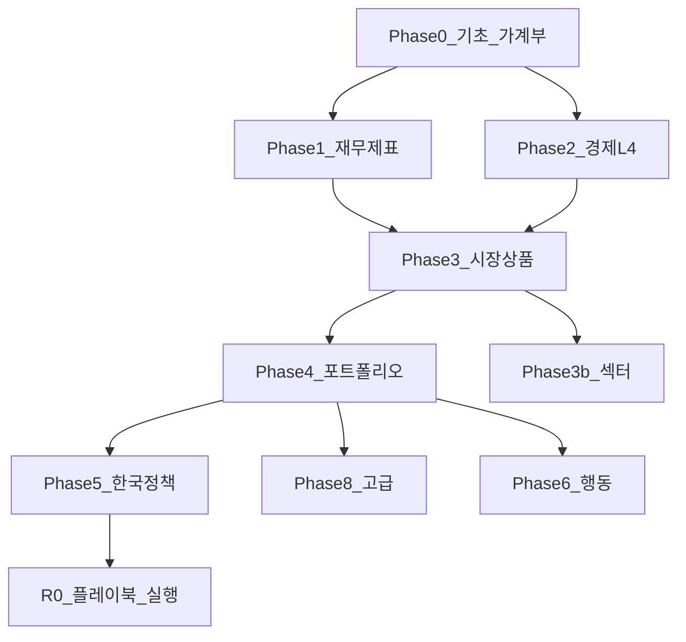

# 전체 커리큘럼 맵 — 필수 과목·누락·우선순위

> **목표**: 금융·주식·투자 **필수** 과목을 **과목 단위**로 쪼개고, 편마다 L3/L4로 채운다.  
> **범례**: ✅ 있음 · 🟡 개요만(L3) · ❌ 없음 · 🔨 작성 중  
> **난이도**: [READER-GUIDE §L1~L4](../docs/READER-GUIDE.md) — **L3**=교재 본문, **L4**=전공 심화

**최종 갱신**: 2026-05-25

---

## Phase 0 — 돈·현금흐름·부채 (`01-foundations/`)

| ID | 과목 | 파일 | 상태 | 우선순위 |
|----|------|------|------|----------|
| F0-1 | 복리·시간가치 | compound-interest-and-time-value.md | ✅ L3 | — |
| F0-2 | NPV·IRR·할인현금흐름 | time-value-npv-irr.md | ✅ **L4** | **A** |
| F0-3 | 비상금·유동성 | emergency-fund.md | ✅ L3 | — |
| F0-4 | 가계 현금흐름·저축률 | cash-flow-basics.md | ✅ L3 | — |
| F0-5 | 부채·이자·대출 | debt-and-interest.md | ✅ L3 | — |
| F0-6 | 단기 금융상품 (CMA·MMF·RP·예금) | financial-products-short-term.md | ✅ L4 | — |
| F0-7 | 보험·리스크 전가 (기초) | insurance-risk-transfer.md | ✅ **L4** | B |
| F0-8 | **가계부 실전** (카드·공과금·분류) | household-ledger-practical.md | ✅ L3 | — |

---

## Phase 1 — 재무제표·기업분석 (`01-foundations/` + `09-corporate-finance/`)

| ID | 과목 | 파일 | 상태 | 우선순위 |
|----|------|------|------|----------|
| F1-1 | 재무제표 입문 (3표) | financial-statements-intro.md | ✅ L3 | — |
| F1-2 | **재무제표 분석** (비율·품질·조작 신호) | financial-statements-analysis.md | ✅ **L4** | **A** |
| F1-3 | 손익·현금흐름 심화 (OCF·FCF) | cash-flow-statement-fcf.md | ✅ **L4** | **A** |
| F1-4 | 사업보고서·DART 읽기 | reading-annual-reports-dart.md | ✅ **L4** | **A** |
| F1-5 | 배당·자사주·주주환원 | dividends-buybacks.md | ✅ L4 | — |
| F1-6 | **재무제표 공부 로드맵** (12주) | financial-statements-study-roadmap.md | ✅ L3 | — |

---

## Phase 2 — 경제학 (`02-economics/`)

| ID | 과목 | 파일 | 상태 |
|----|------|------|------|
| E2-미시 | 소비자·생산·IO·후생·섹터응용 | micro-01 ~ 05 + basics | ✅ **L4** |
| E2-거시 | GDP·화폐·IS-LM·통화·개방·자산가격 | macro-01 ~ 06 + basics | ✅ **L4** |

→ [L4-ECONOMICS-STATUS](../docs/L4-ECONOMICS-STATUS.md)

---

## Phase 3 — 시장·상품 (`03-markets/`)

### 3A. 주식·지수

| ID | 과목 | 파일 | 상태 | 우선순위 |
|----|------|------|------|----------|
| M3-1 | 주식 입문 (소유권·시장) | stocks-equities-intro.md | ✅ L3 | — |
| M3-2 | **주식 밸류에이션** (DCF·멀티플·DDM) | equity-valuation-fundamentals.md | ✅ L4 | — |
| M3-3 | 시장 효율성·EMH | ../08-advanced/market-efficiency-emh.md | ✅ L4 | — |
| M3-4 | 주주·거버넌스·소수주주 | corporate-governance-minority.md | ✅ **L4** | C |

### 3B. 채권·금리

| ID | 과목 | 파일 | 상태 | 우선순위 |
|----|------|------|------|----------|
| M3-5 | 채권 입문 | bonds-fixed-income.md | ✅ L3 | — |
| M3-6 | **채권 심화** (듀레이션·컨벡시티·신용·스프레드) | bonds-fixed-income-deep.md | ✅ L4 | — |
| M3-7 | 금리·수익률 곡선 전략 | yield-curve-strategies.md | ✅ L4 | — |

### 3C. ETF·펀드

| ID | 과목 | 파일 | 상태 | 우선순위 |
|----|------|------|------|----------|
| M3-8 | ETF·인덱스 | etf-index-funds.md | ✅ L3 | — |
| M3-9 | ETF 심화 (추적·괴리·인덱스 구성) | etf-index-funds-deep.md | ✅ L4 | — |
| M3-10 | 뮤추얼펀드·액티브 펀드 | mutual-funds-active.md | ✅ **L4** | C |

### 3D. 파생·대안

| ID | 과목 | 파일 | 상태 | 우선순위 |
|----|------|------|------|----------|
| M3-11 | **옵션·선물 입문** | ../08-advanced/derivatives-options-intro.md | ✅ L4 | — |
| M3-12 | 레버리지·인버스 ETF | ../04-portfolio/leveraged-etf-qqq-qld.md | ✅ L3 | — |
| M3-13 | 대안투자 (리츠·원자재·PE 개요) | alternatives-reits-commodities.md | ✅ **L4** | B |

### 3E. 시장구조·거래

| ID | 과목 | 파일 | 상태 | 우선순위 |
|----|------|------|------|----------|
| M3-14 | **시장 미시구조** (호가·스프레드·유동성) | market-microstructure.md | ✅ L4 | — |
| M3-15 | 주문 유형·체결·슬리피지 | order-types-execution.md | ✅ L4 | — |
| M3-16 | ATS·넥스트레이드 | korea-ats-nextrade.md | ✅ L3 | — |
| M3-17 | 코스닥 승강제 | kosdaq-tier-system.md | ✅ L3 | — |
| M3-18 | KRX·코스피 구조 | korea-equity-market-structure.md | ✅ L4 | — |

### 3F. 해외·미국

| ID | 과목 | 파일 | 상태 |
|----|------|------|------|
| M3-19 | 해외주식·환율 입문 | overseas-equities-intro.md | ✅ L3 |
| M3-20 | 환헷지·W-8BEN | overseas-tax-fx-hedging.md | ✅ **L4** |
| M3-21 | **미국 지수·ETF** (S&P·나스닥·Mag7) | us-equity-indices-etf.md | ✅ L3 |
| M3-22 | **한국 vs 미국 주식** | korea-vs-us-equities.md | ✅ L3 |

### 3G. 섹터 (`sectors/`)

| ID | 과목 | 상태 |
|----|------|------|
| M3-S | 프레임·배터리·반도체·AI·피지컬AI·전력 | ✅ L3~L4 |

---

## Phase 4 — 포트폴리오 (`04-portfolio/`)

| ID | 과목 | 파일 | 상태 | 우선순위 |
|----|------|------|------|----------|
| P4-1 | Bucket·기간 | time-horizon-and-buckets.md | ✅ L3 | — |
| P4-2 | 코어-위성 | core-satellite-framework.md | ✅ L3 | — |
| P4-3 | **MPT·평균분산·효율적 프론티어** | portfolio-theory-mpt.md | ✅ L4 | — |
| P4-4 | 자산배분 실전 | asset-allocation.md | ✅ L3 | — |
| P4-5 | 지역·통화 | geographic-diversification.md | ✅ L3 | — |
| P4-6 | 리밸런싱·DCA | rebalancing-and-dca.md | ✅ L3 | — |
| P4-7 | 패시브 vs 액티브 | passive-vs-active.md | ✅ L3 | — |
| P4-8 | **리스크 관리** (VaR 개념·MDD·포지션) | risk-management-portfolio.md | ✅ L4 | — |
| P4-9 | **성과 측정** (샤프·알파·IR·추적오차) | performance-measurement.md | ✅ L4 | — |
| P4-10 | QQQ·QLD | leveraged-etf-qqq-qld.md | ✅ L3 | — |

---

## Phase 5 — 한국 정책·세금 (`06-korea-policy/`)

| ID | 과목 | 파일 | 상태 |
|----|------|------|------|
| K5-1 | DB·DC·IRP·ISA·청년 | ✅ L3+ |
| K5-2 | 세금 시리즈 | ✅ L3+ |
| K5-3 | **연금저축** (IRP와 비교) | pension-savings-account.md | ✅ L4 |
| K5-4 | **금융투자소득세** (배당·이자 2천만) | tax/financial-investment-income-tax.md | ✅ L4 |
| K5-5 | **ISA·IRP 실전 세팅** | isa-irp-practical-setup.md | ✅ L3 |

---

## Phase 6 — 행동금융 (`05-behavioral/`)

| ID | 과목 | 파일 | 상태 | 우선순위 |
|----|------|------|------|----------|
| B6-1 | FOMO·거래시간 | fomo-and-trading-hours.md | ✅ L3 | — |
| B6-2 | **행동금융 전편** (편향·프로스펙트·넛지) | behavioral-finance-complete.md | ✅ L4 | — |
| B6-3 | 투자 심리·일지 | investment-journal-psychology.md | ✅ **L4** | B |

---

## Phase 7 — 부동산 (`07-real-estate/`)

| ID | 과목 | 파일 | 상태 |
|----|------|------|------|
| R7-1 | 부동산 기초 | real-estate-basics.md | ✅ L3 |
| R7-2 | REIT·부동산 ETF | real-estate-reits.md | ✅ **L4** |

---

## Phase 8 — 고급 (`08-advanced/`)

| ID | 과목 | 파일 | 상태 | 우선순위 |
|----|------|------|------|----------|
| A8-1 | CAPM | capm-and-risk-return.md | ✅ L3 | — |
| A8-2 | 팩터 (Fama-French) | factor-investing-fama-french.md | ✅ L4 | — |
| A8-3 | EMH | market-efficiency-emh.md | ✅ L4 | — |
| A8-4 | 파생·옵션 | derivatives-options-intro.md | ✅ L4 | — |
| A8-5 | APT·다요인 모형 | apt-multi-factor-models.md | ✅ **L4** | B |
| A8-6 | 기술적 분석 (비판적 입문) | technical-analysis-critical.md | ✅ **L4** | B |
| A8-7 | **퀀트·데이터 투자 입문** | quant-investing-intro.md | ✅ **L4** | — |

---

## Phase 9 — 기업재무 (`09-corporate-finance/`)

| ID | 과목 | 파일 | 상태 | 우선순위 |
|----|------|------|------|----------|
| C9-1 | **WACC·자본구조** | wacc-capital-structure.md | ✅ L4 | — |
| C9-2 | M&A·인수합병 개요 | ma-basics.md | ✅ **L4** | C |
| C9-3 | 스타트업·VC 밸류 (개념) | startup-valuation-vc.md | ✅ **L4** | C |

---

## Phase R0 — 실행 플레이북 (`00-roadmap/`)

| ID | 과목 | 파일 | 상태 |
|----|------|------|------|
| R0-1 | **AI 엔지니어 1년 투자 플레이북** | ai-engineer-investing-playbook.md | ✅ L3 |

---

## 우선순위 A — 1차 완료 (2026-05-24) ✅

위 20편 + 배당·연금저축·한국시장구조 포함 **28편 L4 신규** 추가.

## 우선순위 B — 완료 (2026-05-25) ✅

F0-7, M3-13, M3-20, B6-3, R7-2, A8-5, A8-6 — **7편 L4**.

## 우선순위 C — 완료 (2026-05-25) ✅

M3-4, M3-10, C9-2, C9-3 — **4편 L4**.

---

## 확장 검토 (미작성 ❌)

| ID | 과목 | 비고 |
|----|------|------|
| X-1 | 공매도·마진 | Phase 3 확장 |
| X-2 | IPO·상장 | Phase 3 |
| X-3 | 4대보험·국민연금 심화 | Phase 0/5 |
| X-4 | 상속·증여 | Phase 5 |
| X-5 | 금융사기·투자자보호 | Phase 6 |
| X-6 | 백테스트 심화 | Phase 8 |
| X-7 | ESG 투자 | Phase 3/4 |
| X-8 | 금융위기 사례 | Phase 2 |

---

## 권장 학습 순서 (전체)

**병행**: Phase 5(세금)는 Phase 3~4와 **병행**. [ai-engineer-investing-playbook.md](ai-engineer-investing-playbook.md)로 1년 실행.

---

## 통계 (2026-05-25)

| | 개수 |
|--|------|
| 커리큘럼 **총 과목** | **~89** |
| ✅ L3 이상 완료 | **~89** |
| ❌ 미작성 (확장 X) | **8** |
| L4 신규 (B+C 이번) | **+11편** |
| L3 신규 (이번) | **+7편** |
| glossary | **133항** — [glossary.md](glossary.md) · [TERMINOLOGY-STANDARD](../docs/TERMINOLOGY-STANDARD.md) |

---

## 연관

- [master-roadmap.md](master-roadmap.md)  
- [STUDY-START.md](STUDY-START.md)  
- [ai-engineer-investing-playbook.md](ai-engineer-investing-playbook.md)  
- [DEPTH-STANDARD.md](../docs/DEPTH-STANDARD.md)
