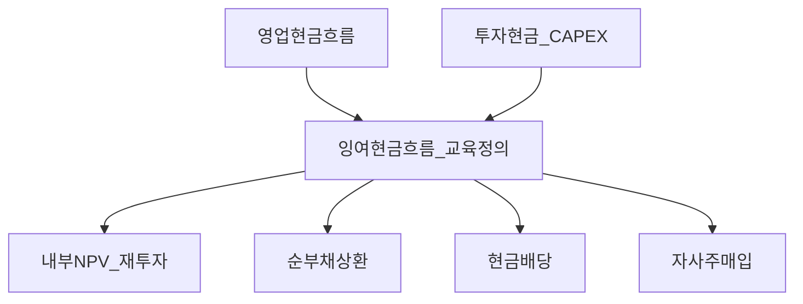
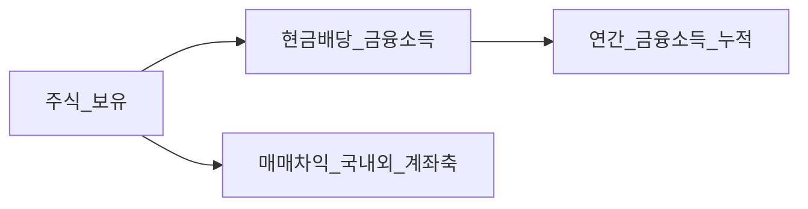

# 배당 정책과 자사주 매입 — 배당성향·자사 매입·한미 구조 차이·국내 개인 과세·Bucket 3

> **면책**: 본 문서는 교육 목적으로 작성되었으며 특정 기업·증권에 대한 매수·매도 권유나 세무 확정 자문이 아닙니다.

## 메타

| 항목 | 내용 |
|------|------|
| 최종 검증일 | 2026-05-25 |
| 정책·법령 기준일 | 2026-05-25 (교육용 개괄 · 실무는 법령·공시·국세청 최신 자료 우선) |
| 난이도 | L4 (Graduate) — [READER-GUIDE](../docs/READER-GUIDE.md) |
| 예상 읽기 시간 | 95~125분 |
| 관련 bucket | Bucket 3(코어)·Bucket 2b(ISA 등)·세무 절차 인지 레이어 전반 |

## 0. 이 편 읽기 전 (5분)

| 항목 | 내용 |
|------|------|
| **난이도** | L4 (Graduate) — [READER-GUIDE §L등급](../docs/READER-GUIDE.md) |
| **선수** | [financial-statements-intro](financial-statements-intro.md), [cash-flow-statement-fcf](cash-flow-statement-fcf.md) |
| **이번 편에서 쓰는 기호** | 본문 §4·§4a 표 참고 |
| **복습 한 줄** | L3 선수 편을 먼저 읽으면 수식이 수월함 |

> **가상 사례 회사**: 본 Phase 재무제표 심화 편은 **「가상 주식회사 한빛전자」** (가상의 코스피 제조·전자 부품) 숫자로 3표·DART·FCF를 **같은 스레드**로 읽는다. 실제 종목·실적이 아니다.
## TL;DR

1. **배당 정책**과 **페이아웃 비율**은 순이익 기준이냐 자유현금(FCF) 기준이냐에 따라 같은 “비율”도 의미가 달라진다. [cash-flow-statement-fcf.md](cash-flow-statement-fcf.md)
2. **배당수익률**은 주가 분모에 민감하며, 페이아웃 성향과 단순 동행하지 않을 수 있다.[equity-valuation-fundamentals.md](../03-markets/equity-valuation-fundamentals.md)
3. **자사주 매입**과 **현금 배당**은 현금성·과세·보상·유동성 패키지까지 달라 **동일 과세 축으로 놓으면 오류**이다 — 개인은 증평(매매차익)과 금융소득을 먼저 분리한다.[investment-tax-overview.md](../06-korea-policy/tax/investment-tax-overview.md)
4. **미국**과 **한국 지주·연결 구조**는 배당·매입 문화 이전에 공시·연결 주석·내부 거래 리스크가 달라 **표면 규모 비교만으로는 위험**하다.
5. 한국 거주 개인에게 배당·이자는 원칙적으로 **금융소득 누적**(연 2,000만 원 기준선)과 연결될 여지가 있고, 증평은 별축이다.[financial-investment-income-tax.md](../06-korea-policy/tax/financial-investment-income-tax.md)
6. Bucket 3에서는 배당 입금이 소액 리밸런싱 재료가 될 수 있으나 과세·증빙 업무량이 늘어 **시간 패키지 비용**과 동시에 존재한다.[time-horizon-and-buckets.md](../04-portfolio/time-horizon-and-buckets.md)·[isa-irp-pension-tax.md](../06-korea-policy/tax/isa-irp-pension-tax.md)

## 1. 한 줄 정의 + 왜 중요한가

**정의**: 배당 정책은 이사회·주주총회를 거쳐 적용되는 **무상 귀속 규격**으로, 현금 배당·주식 배당·중간 배당·변동 배당과 함께 **자사주 매입·보유·소각**까지 한 설계 패밀리로 묶는 게 기업금융에서의 표준 정리다. **페이아웃 비율**은 순이익 대비일 수도 있고, FCF 대비이거나,(자사 매입까지 주주 환류 정의에 넣어) **통합 환류 분모**일 수도 있다.

!!! info "Bucket"
    시간·목적별 **자금 슬롯**(0 비상금 → 3 코어 등)

!!! info "ETF"
    지수·자산 **바구니**를 한 종목처럼 거래

**왜 중요한가**: Bucket 3는 코어 장기 슬롯인데, 같은 ETF라도 **배당 캘린더**가 많으면 현금 유입이 규칙적이어서 리밸런싱이 쉬울 수 있다. 그러나 현금 유입이 늘어나면 **금융소득 누적**(특히 다른 이자·배당까지 합하면)이 커져 종합소득세 설계·5월 절차까지 같이 커질 수 있다. 자사 프로그램이 큰 회사는 배당이 작아 보여도 **주가 패스·주당 지표(EPS)·보상 프로그램**과 얽혀 코어 버킷의 무게 패스 조정 규칙이 달라질 수 있으므로 “배당 없음 단순” 가정만으로 시간축 학습 설계가 완결되지 않는다.[time-horizon-and-buckets.md](../04-portfolio/time-horizon-and-buckets.md)

## 2. 선수 지식 / 이후 읽을 것

**선수**:
- [financial-statements-intro.md](financial-statements-intro.md)
- [cash-flow-statement-fcf.md](cash-flow-statement-fcf.md)
- [compound-interest-and-time-value.md](compound-interest-and-time-value.md)
- [stocks-equities-intro.md](../03-markets/stocks-equities-intro.md)
- [etf-index-funds.md](../03-markets/etf-index-funds.md)

**이후**:
- [equity-valuation-fundamentals.md](../03-markets/equity-valuation-fundamentals.md)
- [investment-tax-overview.md](../06-korea-policy/tax/investment-tax-overview.md)·[financial-investment-income-tax.md](../06-korea-policy/tax/financial-investment-income-tax.md)
- [isa-irp-pension-tax.md](../06-korea-policy/tax/isa-irp-pension-tax.md)
- [domestic-stocks-tax.md](../06-korea-policy/tax/domestic-stocks-tax.md)·[overseas-stocks-tax-part2-dividend.md](../06-korea-policy/tax/overseas-stocks-tax-part2-dividend.md)
- [core-satellite-framework.md](../04-portfolio/core-satellite-framework.md)·[rebalancing-and-dca.md](../04-portfolio/rebalancing-and-dca.md)·[asset-allocation.md](../04-portfolio/asset-allocation.md)

## 3. 직관·비유

**양동이와 간접 제어 장치**(비유 확장): 순현금을 우물물에 비유하면 현금 배당은 **통장 입금 줄기**(원천징수·명세)가 선명히 따른다. 자사 매입은 유통 주식 수·EPS 같은 표시 패스·가격 패스를 동시에 움직여 **세목을 배당과 같은 축으로 놓기 어렵게** 만든다.[investment-tax-overview.md](../06-korea-policy/tax/investment-tax-overview.md)

**메인 테이블(Bucket 3)**: 장기 코어 학습은 시간축 버킷 규칙이 선행이다.[time-horizon-and-buckets.md](../04-portfolio/time-horizon-and-buckets.md) 배당 입금이 주기적이면 소액 리밸런싱 타이밍을 잡기 쉬울 수 있지만, 배당이 커질수록 금융소득 누적과 5월 신고 부담이 동시에 커질 수 있다. 자사 매입이 크면 배당이 작아 보여도 재평가 변동 무게가 커져 코어 트리거가 민감해질 수 있다.

**한국과 미국**(거버넌스만의 비유): 미국 대형주는 기관·행동주주 문화와 자사 매입 결합이 잘 관찰되는 경우가 많고, 한국은 지주·연결·순환 구조가 같이 읽혀야 **현금이 주주 지갑까지 오는 패스**를 판단할 수 있다.

## 4. 정식 개념·용어

| 용어 | English | 정의(교육) |
|------|------|----------------|
| 배당 정책 | Dividend policy | 주주 환류의 수단·속도·연속성 패키지 |
| 주당 현금 배당 | DPS | 주 1주당 배당 명목 |
| 페이아웃 비율 | Payout ratio | 배당(또는 환류 합)÷순이익 또는 ÷FCF(정의 의존) |
| 배당수익률 | Dividend yield | 연 배당 ÷ 주가(또는 시가) |
| 자유현금흐름 | FCF | CAPEX 등 투자현금을 차감한 영업 기반 잔여(정의 의존) |
| 자사주 매입 | Share repurchase | 회사가 자기 주식을 매입·보유·소각 |
| Lintner 조정 | Dividend smoothing | 이익 급변 속에서도 배당을 천천히 맞추려는 패턴(학습 명제) |
| 클라이언텔 | Clientele effect | 세제·연령 등으로 선호 종목군이 갈리는 현상 |
| 대리 문제 | Agency friction | 경영자·주주 간 유보·환류 충돌 |
| EPS 기계 효과 | Mechanical EPS | 주식수 변화로 표시 주당이익이 변하는 효과 |
| 과세 축 분리 | Tax mapping | 배당=금융소득 축, 증평=국내외·계좌 축 |

### 4a. 핵심 용어 (본문 등장 순)

> 복습용. 정의는 §4 본표·[glossary](../00-roadmap/glossary.md)·본문 `!!! info` 박스.

| 용어 | 한 줄 | 관련 이론 | glossary |
|------|------|------|----------------|
| 배당 정책 | 주주 환류의 수단·속도·연속성 패키지 | §4 | [glossary](../00-roadmap/glossary.md#배당-정책) |
| 주당 현금 배당 | 주 1주당 배당 명목 | §4 | [glossary](../00-roadmap/glossary.md#주당-현금-배당) |
| 페이아웃 비율 | 배당 | §4 | [glossary](../00-roadmap/glossary.md#페이아웃-비율) |
| 배당수익률 | 연 배당 ÷ 주가 | §4 | [glossary](../00-roadmap/glossary.md#배당수익률) |
| 자유현금흐름 | CAPEX 등 투자현금을 차감한 영업 기반 잔여 | §4 | [glossary](../00-roadmap/glossary.md#자유현금흐름) |
| 자사주 매입 | 회사가 자기 주식을 매입·보유·소각 | §4 | [glossary](../00-roadmap/glossary.md#자사주-매입) |
| Lintner 조정 | 이익 급변 속에서도 배당을 천천히 맞추려는 패턴 | §4 | [glossary](../00-roadmap/glossary.md#lintner-조정) |
| 클라이언텔 | 세제·연령 등으로 선호 종목군이 갈리는 현상 | §4 | [glossary](../00-roadmap/glossary.md#클라이언텔) |
| 대리 문제 | 경영자·주주 간 유보·환류 충돌 | §4 | [glossary](../00-roadmap/glossary.md#대리-문제) |
| EPS 기계 효과 | 주식수 변화로 표시 주당이익이 변하는 효과 | §4 | [glossary](../00-roadmap/glossary.md#eps-기계-효과) |
| 과세 축 분리 | 배당=금융소득 축, 증평=국내외·계좌 축 | §4 | [glossary](../00-roadmap/glossary.md#과세-축-분리) |

## 5. 메커니즘

### 5.1 순현금부터 환류까지

### 5.2 한국 거주 개인 관점 세목 맵(교육)

## 6. 수식·모델

### 6.1 성장·유보·페이아웃 근사(교육)

| 기호 | 이름 | 이 식에서 의미 |
|------|------|----------------|
| \(r\) | 할인율·수익률 | 기간당 이자·요구수익률 |
| \(n\) | 기간 | 연·월 등 복리·할인에 쓰는 횟수 |
| \(PV\) | 현재가치 | 오늘 시점으로 환산한 금액 |
| \(FV\) | 미래가치 | 미래 시점의 목표·결과 금액 |

\[
g \approx ROE \times (1-\mathrm{payout})
\]

**읽는 법**: **g**와 **ROE**의 관계를 위 식으로 쓴다. 경제·재무 해석은 변수표 「이 식에서 의미」와 [DEPTH-STANDARD](../docs/DEPTH-STANDARD.md) 기호 예제를 맞춘다.
**유도 (L4)**:
1. **정의**: **g**, **ROE**, **payout**를 동일 시점·동일 통화로 맞춘다. — 단위 불일치면 식이 무의미해진다.
2. **식 변형**: 양변을 정리해 목표 변수를 한쪽에 둔다. — 할인·복리는 **시점 이동**이 핵심이다.

여기서 \(\mathrm{payout}\) 은 이익 유보 대비 환류 패키지에서 쓰는 교육용 정의다.

### 6.2 단순 배당 세후 수익(가정·교육)

연간 배당수익률 \(y\). 현금 과세를 단순화한 유효세율 \(\tau\) 가정:

| 기호 | 이름 | 이 식에서 의미 |
|------|------|----------------|
| \(r\) | 할인율·수익률 | 기간당 이자·요구수익률 |
| \(n\) | 기간 | 연·월 등 복리·할인에 쓰는 횟수 |
| \(PV\) | 현재가치 | 오늘 시점으로 환산한 금액 |

\[
r_{\text{after}} \approx y(1-\tau)
\]

**읽는 법**: **r**와 **n**의 관계를 위 식으로 쓴다. 경제·재무 해석은 변수표 「이 식에서 의미」와 [DEPTH-STANDARD](../docs/DEPTH-STANDARD.md) 기호 예제를 맞춘다.
**유도 (L4)**:
1. **정의**: **r**, **n**, **PV**를 동일 시점·동일 통화로 맞춘다. — 단위 불일치면 식이 무의미해진다.
2. **식 변형**: 양변을 정리해 목표 변수를 한쪽에 둔다. — 할인·복리는 **시점 이동**이 핵심이다.
종합 과세가 열리면 \(\tau\) 는 표면적으로 선형이 아님.

### 6.3 EPS 기계 효과(교육)

| 기호 | 이름 | 이 식에서 의미 |
|------|------|----------------|
| \(S\) | 발행주식수 | EPS 분모 |
| \(\Pi\) | 순이익 | EPS 분자 |
| \(\Delta\) | 순감소 주식수 | 자사주 매입 등으로 줄어든 주식수 |

주식수 **S**·순이익 **Π**·순감소 **Δ** 일 때:

\[
EPS \approx \frac{\Pi}{S-\Delta}
\]

**읽는 법**: 분모 **S−Δ**가 줄면 같은 **Π**에서 **EPS**는 올라간다 — **기계적** 효과이며, **현금**·**성장**과 분리해 본다.

**유도 (L4)**:
1. **정의**: **EPS**, **Pi**, **S**를 동일 시점·동일 통화로 맞춘다. — 단위 불일치면 식이 무의미해진다.
2. **식 변형**: 양변을 정리해 목표 변수를 한쪽에 둔다. — 할인·복리는 **시점 이동**이 핵심이다.

옵션 보상·내재가치·금융비용이 동반되면 기계 효과만으로 주가를 논하지 않는다.

### 6.4 비교정태 확장(교육)

내부 수익률이 떨어지면 유보를 늘리고 환류를 줄이는 경향이 생길 수 있고, 금리가 오르면 배당주 상대 매력이 약해질 수 있으며, 환율은 해외 매출 비중이 큰 기업의 원화 기준 이익·배당 변동성을 키운다. 규제·정책 논의는 섹터별로 환류 제약이 달라질 수 있고, 지배주주 구조는 공시상 배당과 실제 주주 현금 귀속 사이의 간극을 읽게 만드는 주석 요인이 된다.

## 7. 한국 적용

### 7.1 2025년 기준 교육 요약

| 항목 | 한국 거주 개인 투자자 관점 |
|------|---------------------------|
| 국내 배당 | 금융소득 누적·원천·종합과세 검토 |
| 국내 증평(일반 개인) | 원칙적으로 비과세(예외 별도) |
| 해외 배당 | 금융소득 누적 + 증빙 패키지 |
| ISA | 계좌 내부 손익통산·만기·중도 규격 |
| 연금·IRP | 과세 이연·수령 시별 축 |

### 7.2 재벌·지주 vs 미국(정성 비교)

미국 대형주는 기관·행동주주 문화 속에서 자사 매입이 자주 관찰된다. 한국은 지주사·연결 대상·종속 구조를 읽지 않고 **배당 규모 텍스트만** 놓고 미국과 같은 주주 환류 패스를 기대하면 위험하다. 같은 “배당” 표기라도 **실제 연결현금·특수관계자 주석** 패턴이 현금의 목적지와 타이밍을 바꿀 수 있다.[financial-statements-intro.md](financial-statements-intro.md)

### 7.3 2026 변화 추적 포인트

ISA 비과세·납입, DC 추가납입 논의, 금융투자소득세 보도는 [investment-tax-overview.md](../06-korea-policy/tax/investment-tax-overview.md)에서 시계열로 추적하고, 본 문서는 **배당이라는 현금 축** 관점에서 버킷 연결만 강조한다.

**법 출발점**(교육 링크 시작): 상법(배당)·자본시장법령 일부(자사주)·소득세법(금융소득)·국세청 안내.

### 7.4 Bucket 3 운영 체크리스트(실행 학습)

연초: 코어 목표 비중·리밸 트리거를 [rebalancing-and-dca.md](../04-portfolio/rebalancing-and-dca.md)로 고정한다.

분기: 배당·이자 누적을 스프레드시트에 분리 기록(국내외·ISA 여부·DRIP 여부).

연말 전: 금융소득 게이트 접근 시 [financial-investment-income-tax.md](../06-korea-policy/tax/financial-investment-income-tax.md) 재검토.

## 8. 숫자 예제(가상)

> 모든 인물·금액·환율은 가상이다.

### 예제 1: 국내·해외 배당 누적

| 항목 | 금액(만 원) |
|------|------------|
| 국내 이자 | 500 |
| 해외 ETF 배당 | 1,200 |
| 국내 고배당 | 400 |
| 합계 | 2,100 → **M** (만 원 단위, 교육용) 초과(교육 게이트 접근) |

### 예제 2: 해외 양도 이익 병행(교육)

| 항목 | 금액(만 원) |
|------|------------|
| 금융소득 합(예제 1) | 2,100 |
| 해외 양도 이익 | 300 |
| 해석 | 양도와 금융소득 축은 **단순 합산하면 안 된다**(교육) |

### 예제 3: ISA 내부 동일 ETF

배당 문자가 와도 계좌 규격이 우선 — 외부 누적 직접 합산 금지.[isa-irp-pension-tax.md](../06-korea-policy/tax/isa-irp-pension-tax.md)

### 예제 4: 고배당주만의 코어 편중(행동 위험)

배당이 크면 현금 문자는 장점이지만, 동시에 같은 섹터·같은 스타일에 묶여 **코어 버킷의 변동성 부담**이 커질 위험이 있다.[sector-investing-framework.md](../03-markets/sectors/sector-investing-framework.md)

## 9. FAQ (12쌍 — L4)

**Q1.** 배당 규모만 보고 회사 판단해도 되나요?  
**A1.** 아니요. 배당은 결과 지표입니다. 순현금·차입 상태·내재 투자 기회까지 같이 확인해야 과대·과소 판단을 줄입니다.[cash-flow-statement-fcf.md](cash-flow-statement-fcf.md)

**Q2.** 자사주 매입이 배당보다 항상 이득인가요?  
**A2.** 아닙니다. 매입 단가·유통성·옵션·보상 프로그램이 결과를 바꿉니다.

**Q3.** 한국 회사 배당이 낮다는 말의 의미는?  
**A3.** 성장·지배·재투자 기회·규제 환경이 복합된 결과입니다. 미국과 같은 패턴으로 그대로 기대하면 위험합니다.

**Q4.** 국내 주식 배당은 세목상 어디로 가나요?  
**A4.** 일반적인 경우 금융소득 누적에 포함되며, 종합 과세 가능성은 다른 소득·공제 상태와 결합됩니다.[financial-investment-income-tax.md](../06-korea-policy/tax/financial-investment-income-tax.md)

**Q5.** 해외 주식 배당은 왜 번거롭다고 하나요?  
**A5.** 명세·환율·원천지 증빙·이중 과세 조정 등 정리 비용이 커질 수 있습니다.[overseas-stocks-tax-part2-dividend.md](../06-korea-policy/tax/overseas-stocks-tax-part2-dividend.md)

**Q6.** ETF 배당은 어떻게 기록하나요?  
**A6.** 편입 자산·분배 정책에 따라 다르므로 증권사 월간·연간 명세를 기준으로 분류합니다.

**Q7.** Bucket 3에서 배당을 늘리면 좋은가요?  
**A7.** 목표 변동성·섹터 편중·세후 순위를 함께 봐야 합니다. 배당만 늘리면 특정 섹터로 코어 무게가 쏠릴 수 있습니다.

**Q8.** DRIP 재투자는 세금이 어떻게 되나요?  
**A8.** 증권사 처리방식과 현금성 판단에 따라 달라져 명세로 확정해야 합니다.

**Q9.** ISA에 넣으면 배당이 면세인가요?  
**A9.** 계좌 세제(3년·통산·한도) 패키지가 달라질 뿐 “면세” 단정은 금지입니다.[isa-irp-pension-tax.md](../06-korea-policy/tax/isa-irp-pension-tax.md)

**Q10.** 국내 증평 줄기와 배당 줄기를 한 열로 합쳐도 되나요?  
**A10.** 아니요. 배당·이자는 금융소득 누적으로, 국내 상장 증평은 일반 개인 원칙 노선처럼 **다른 줄기로 분리**해야 합니다.[investment-tax-overview.md](../06-korea-policy/tax/investment-tax-overview.md)·[domestic-stocks-tax.md](../06-korea-policy/tax/domestic-stocks-tax.md)

**Q11.** 금융투자소득세는 일반적인 배당·이자 과세와 같나요?  
**A11.** 학습 순서에서는 **별도 논점**입니다. 세부 라우팅은 [investment-tax-overview.md](../06-korea-policy/tax/investment-tax-overview.md) 7절 패키지처럼 읽습니다.

**Q12.** 배당 줄기 줄이고 성장 줄기만 늘리면 되나요?  
**A12.** 단일 규칙은 없습니다. 우선 코어·위성 프레임부터 고정합니다.[core-satellite-framework.md](../04-portfolio/core-satellite-framework.md)·[asset-allocation.md](../04-portfolio/asset-allocation.md)

## 10. 함정·리스크·한계

- 배당수익률이 커 보였더니 주가 하락 탓이라 뒤늦게 깨닫는 경우.
- 페이아웃 비율의 분모(순이익 대비인지 FCF 대비인지)·분자(배당만인지 자사까지 포함 주주환류인지)를 업종 간에 섞어 비교표를 망치는 경우.
- ISA 안 배당 줄기와 밖 줄기 금융소득을 한 칸으로 합산해 연간 누적·게이트를 오판.[isa-irp-pension-tax.md](../06-korea-policy/tax/isa-irp-pension-tax.md)
- 해외 배당·이자 증명을 연말에 몰아서 정리하다 시간이 터지는 경우.[overseas-stocks-tax-part2-dividend.md](../06-korea-policy/tax/overseas-stocks-tax-part2-dividend.md)
- 국내 상장 증평 줄기와 배당 줄기를 같은 표 열에서 합산해 금융소득 게이트를 오판함.[investment-tax-overview.md](../06-korea-policy/tax/investment-tax-overview.md)

- 자사주 매입이 주주에게 즉각적인 현금을 준 것처럼 착각하는 경우.
- 고배당주만 채워 섹터·금리 민감도가 한 번에 커져 코어가 흔들리는 경우.
- 연결·특수관계자 주석 없이 표면 배당 문자만 추적해 그룹 내부 현금 순환 간극을 놓치는 경우.[financial-statements-intro.md](financial-statements-intro.md)
- Lintner 점진 조정 가정을 “미래 규격 보증”처럼 읽는 경우.
- 수업형 Modigliani–Miller 무교착 결과를 과세·거래비용이 존재하는 실제 장에 그대로 이식하는 경우.
- 배당 재투자(DRIP)와 순현금 입금 줄기를 증빙 없이 같은 행으로 합산하는 경우.
- 대주주성 주주에게 적용되는 금융투자소득세 라우팅 일반 원칙과, 일반 직장 개인에게 말되는 금융소득 2천만 원 기준선을 같은 판별식에 우겨 넣는 경우.[investment-tax-overview.md](../06-korea-policy/tax/investment-tax-overview.md)·[financial-investment-income-tax.md](../06-korea-policy/tax/financial-investment-income-tax.md)

---

**Q. 실무에서는?**  
교과서 식·기호를 그대로 적용하기 전에 **수수료·세금·데이터 시점**을 분리한다. 숫자는 [DEPTH-STANDARD](../docs/DEPTH-STANDARD.md)처럼 기호만 먼저 맞추고, 법령·시장 수치는 §8 표·외부 출처로 갱신한다.

## 11. 심화 읽기

- Brealey·Myers·Allen *Principles of Corporate Finance* 의 주주환류·자본비용 교차 구간.[wacc-capital-structure.md](../09-corporate-finance/wacc-capital-structure.md)·[equity-valuation-fundamentals.md](../03-markets/equity-valuation-fundamentals.md)
- [references/sources.md](../references/sources.md) — 법령·국세청·금융위 공식 링크
- 한국 과세 라우팅 지도 재확인: [investment-tax-overview.md](../06-korea-policy/tax/investment-tax-overview.md)·[financial-investment-income-tax.md](../06-korea-policy/tax/financial-investment-income-tax.md)·[isa-irp-pension-tax.md](../06-korea-policy/tax/isa-irp-pension-tax.md)

## 연습문제 (L4, 기호)

1. 위 §6 주요 식에서 변수 하나를 미지로 두고, 나머지를 기호로 둔 **관계식**을 쓰시오.
2. 가정이 깨질 때(유동성·세금·다중 IRR 등) 위 식의 **한계**를 기호·부등식으로 서술하시오.
3. §8 예제와 동일 기호(M·P·PV 등)로 **부호·단조성**만 검증하는 짧은 논증을 하시오.

### 해설 키

1. 직전 변수표의 「이 식에서 의미」를 이용해 동일 차원으로 정리한다.
2. 「가정이 깨지면」 절의 한계 사례와 연결한다.
3. 숫자 대입 없이 **부호**·**단위** 일치만 확인한다.
## 12. 스스로 점검 퀴즈

1. 페이아웃 분모를 순이익과 자유현금흐름 두 가지로 제시하고, 같은 페이아웃이라도 무엇이 달라질 수 있는지 말하시오.
2. 배당수익률이 높은데 회사의 실제 현금 환류 패키지가 약해 보일 수 있는 재무적 이유 두 가지를 들라.
3. Lintner 패턴으로 설명 가능한 현상 한 가지와, 설명이 깨지는 외생 충격 예 한 가지.
4. 미국 대형주의 자사 매입 문화를 한국 회사 표면 문자에 그대로 대응하면 생기는 거버넌스 착시를 한 문단으로 적으시오.
5. ISA 내부 배당과 과세특례 패키지를 왜 외부 일반 과세증권계좌의 금융소득 누적과 직접 합산하면 위험한가.[isa-irp-pension-tax.md](../06-korea-policy/tax/isa-irp-pension-tax.md)
6. 고든 성장모형 교육 문장에서 할인요인과 배당 성장률 근접 시 모형 해석이 흔들리는 논법을 재작성하라.
7. 자사 매입 후 주식 보상이 상쇄될 때 “순 소각 규격” 학습표를 어떻게 나누어야 하는가.
8. Bucket 3에서 배당 문자가 과세 업무량을 키우는 경로를 시간축 순서대로 적으시오.[time-horizon-and-buckets.md](../04-portfolio/time-horizon-and-buckets.md)

??? note "정답 힌트(요지)"

    1. 순이익 분모는 비현금항·재고·완충이 섞여 있고 FCF 분모는 투자·운전자금 변화가 포함되어 환류가 가용한 현금 패키지 의미와 다르다.
    2. 주가 폭락으로 분모만 작아지는 착시, 일회성 이익에 기대어 배당 문자만 과대하게 보이는 착시.
    3. 이익이 요동치는데 배당 패스만 완만하게 보이려는 패턴 vs 금리급등·유동성 규격 붕괴 등은 배당 점진 패턴 논외.
    4. 지주 출자 순환과 연결 내부거래 때문에 외관상 매입 문자가 같은 주식군 현금 패스 보장처럼 읽히는 오류 가능.
    5. 계좌 내부 손익통산과 만기 규격, 비과세 한도 패키지가 일반 과세증권과 다르기 때문이다.
    6. 성장항이 분모 근처로 가면 교육 가치만 남은 발산형 결과에 접근하지만 실무 해석에는 부적절해서 보정한 모형 또는 다단계 캐시플로 교정이 필요하다고 기록한다.
    7. 매입·보유·소각 줄기와 옵션·RSU 줄기를 분리 행으로 두고 순 주식수만 별칼럼 계산해야 한다.
    
    8. 연간 입금 문자가 늘어날수록 금융소득 누적·명세 검증 시간이 들고 5월 이전 종합설계 패키지로 연결된다.

## L4 보충 — 비교정태·행위·증빙·버킷을 한 줄기로 묶기

### A. Lintner와 신호 규격

린트너형 분석은 과거 배당을 닻으로 삼고 목표 페이아웃 근처로 천천히 조정된다는 패턴입니다. 교육 맥락에서는 신호 비용 줄이기·차입 약정(covenant)·노동·내부 승인 절차 같은 다층 이유를 한 스케치로 묶을 수 있습니다. 현장에서는 연결 현금 패스표와 교차해야 하며 레버리지나 유동성 약정이 깨지면 과거 패턴도 함께 무효화될 수 있음을 L4 학습 노트로 반드시 남겨 두어야 합니다.

### B. 클라이언텔과 한국 과세 패키지

과세 규격이 다른 투자자 집합이 선호하는 현금 문자가 갈린다고 정리되는데, 한국 거주 개인은 금융소득 누적으로 가는 축 때문에 배당이 많은 패키지는 ISA·연금 슬롯을 먼저 설계 순서로 둘지 검토하게 됩니다. 이는 과세 회피가 아니라 증빙·정리 업무의 시간가치를 줄이려는 교육적 해석입니다. 과세 결과는 신고 상태에 따라 달라질 수 있으므로 문서에서는 법령과 국세청 안내를 출발점으로 명시해야 합니다.

### C. 자사주 매입의 이중 효과

매입은 즉각적인 현금 지급과 다르므로 과세 차원에서는 배당과 같은 축으로만 묶어서 판별하면 안 됩니다. 평가 쪽에서는 유통 주식수 감소가 주당 지표에 주는 표시 교정을 함께 읽어야 합니다. 주식 보상이 상쇄되면 순 주식수만으로 매입 성과나 EPS 교정 논법을 재구성하면 오판됩니다. 학습표에서는 배당 열과 자사주·보상 상쇄 열을 분리하는 것이 기본 규격입니다.[equity-valuation-fundamentals.md](../03-markets/equity-valuation-fundamentals.md)

### D. 지주·연결 패키지 읽기

한국에서는 공시 문자상 배당이 연결 내부 순환 현금 패스와 맞물려 주주에게 도달하기까지 간극이 생길 수 있어 미국처럼 “대형 블루칩 배당 문자 = 즉각 주주 지갑”이라는 단선형 모형만 적용하면 위험합니다. 특수관계자 채무·예치·약정과 관련 각주를 함께 따라가야 외관상 배당과 실제 순현금의 거리가 드러납니다.

### E. 교과서 MM 결과와 과세 교착 차이

무교차 MM 교육형 결과는 과세 차별과 거래비용이 무시된다는 전제 허브에서 유도됩니다. 실무에서는 현금 배당의 원천·합산 과세 순간과 자사 문자(매매·보상·증권 과세 패키지)가 서로 달라 “어느 쪽 주주환류가 세후 순위가 높은가” 같은 질문이 단순화되지 않습니다. 비교 패널 오른쪽에 “과세·거래비용 가정 교과서≠실장”이라는 주석 줄을 새겨 두는 버릇이 L4 수준에서는 필수에 가깝습니다.[investment-tax-overview.md](../06-korea-policy/tax/investment-tax-overview.md)

### F. 높은 배당수익률 속 행태 함정

배당수익률만 크다는 이유로 유사 업종 고배당주를 과도하게 쌓으면 금리·유가·환율 민감도 패널티가 겹치는 스타일 응축 패턴으로 이어지기 쉽습니다. Bucket 3처럼 코어 슬롯에서는 배당이라는 현금 줄기 장점만큼 분산 규격을 함께 걸어두어야 시간축 전체 분산 논법이 깨지지 않습니다.[asset-allocation.md](../04-portfolio/asset-allocation.md)

### G. DRIP와 증명 행렬

배당을 자동으로 같은 종목에 재투자하는 DRIP 문자는 증권사·종목별로 처리 방식이 달라 “현금이 통장을 거쳤는지 미세 조각으로 바로 재매입했는지”까지 명세 줄이 갈린다면 같은 연도라도 과세 패키지 이해관계가 바뀔 수 있습니다. L4 교육 단계에서는 DRIP 존재 자체보다 **증권거래내역 월별·연말 명세 줄** 고정 패턴을 학습 순서 우선순위에 둡니다. 배당 줄기 학습표에 DRIP 열 하나를 신설하면 나중 금융소득 누적 합계와 교차 검증하기 쉬워집니다.

### H. ETF·펀드 분배와 추적 차이 배당 문자

편입 채권·해외 종목 비중 때문에 분배 구성 요소 이름이 같은 “배당”이라도 이자 분박·외국 원천·국내 과세 과목이 섞인 혼합 영수증 패턴입니다. 과세증권 종합 또는 ISA 내부라도 문자 해석 순서만 같아지고 계좌 내 통산 패키지는 다를 수 있습니다. 코어 버킷에서 ETF 문자가 많아지면 **명세 카테고리 분해** 학습 업무량이 들어간다고 가정해야 Bucket 3 운영 설계 시간이 과소평가되지 않습니다.[etf-index-funds.md](../03-markets/etf-index-funds.md)

### I. 금리·유동성과 배당 매력 상대 순위 교육

금리 구조가 높아지면 이자 줄기 문자가 증평 없이 명확하게 주어지므로 배당이라는 간접 환류의 상대 매력 순위가 교육 교과서 패널에서는 흔들릴 수 있습니다. 기업 레버리지가 깊으면 높은 배당 문자가 채무 상환 순위와 긴장관계라는 패턴도 같이 학습해야 합니다. Bucket 3는 장기 패스이지만 **금리 국면이 바뀔 때 재측정할 지표**(섹터 민감도·현금 패스 지속성) 노트만 미리 작성해 두면 리밸런싱 이유 문자가 시간 지나도 일관되게 남습니다.

### J. 5월·연말 절차와 배당 줄기 교차 검증

한국 거주 개인 교육 흐름에서 금융소득 누적이 게이트에 접근하면 종합 과세 문자와 제도적 정리 순서까지 같이 학습해야 합니다.[financial-investment-income-tax.md](../06-korea-policy/tax/financial-investment-income-tax.md) 배당 입금 줄기만 따로 놓아두면 증평 줄기 또는 해외 양도 이익과 **잘못 합산**하는 오류로 이어질 수 있습니다. 교육용 체크는 “먼저 과세 줄기 이름을 라벨한 뒤에만 같은 스프레드시트 같은 행에 숫자를 넣는다” 순서 고정입니다.

### K. 국내 상장 증평 줄기와 분리 학습 명제 재강조

국내 일반 증권 패키지에서 상장 증평은 원칙적으로 비과세 축이라는 교과서 줄기와, 배당은 금융소득 축이라는 줄기가 **별도 카드**입니다. 학습 과제에서 같은 색표로 두 줄기를 채워 넣어 한 좌표에 합치면 교육 목표와 충돌합니다.[domestic-stocks-tax.md](../06-korea-policy/tax/domestic-stocks-tax.md)

### L. 현금환류 순위 교육용 비교 표

역할 교육용으로 현금 즉시성·표시 교정 폭·증빙 부담·세목 축을 한 표에 새겨 비교 순서 논법을 매년 한 번이라도 따라가도록 합니다. 실제 기업 선택이 아니라 **개념 카드 교육 패널**로만 씁니다.

| 수단 분류 | 즉시 현금성 교육 강점 | 세목 줄기 교육 강점 | 증명·표시 줄기 교육 강점 |
|------|------|------|----------------|
| 현금배당 | 높음(입금 줄기 명확) | 금융소득 축 패키지 | 원천·명세 카드 교차 용이 |
| 자사 매입 문자 | 간접(주가 패스·유통주식수) | 배당 비교 과세 순간 다름 가능 | 순 주식수·보상 상쇄 각주 교차 필요 |
| DRIP 문자 | 간접(재투자) | 패키지가 명세 정의 따라 다름 | 연간 명세 카테고리 분해 패턴 중요 |

### M. 버킷 3에서의 배당·리밸런싱 연동 시나리오(가상)

코어 비중이 목표에서 벗어났는데 배당 입금이 분기마다 규칙적으로 들어온다고 가정합니다. 이때 소액 리밸 로트를 배당 입금 타이밍 직후에 맞추면 거래 횟수 비용을 줄일 수 있지만 그만큼 **과세 누적 증가** 가능성도 같이 커질 수 있습니다. 세후 순위와 운영 시간 패키지를 같은 결정식에 넣지 않으면 “편의성만 큰 설계”로만 남습니다.[rebalancing-and-dca.md](../04-portfolio/rebalancing-and-dca.md)

### N. 한국 지주 그룹 시나리오 읽기 연습(가상)

지주사가 배당을 정책적으로 유지하는 동시에 종속에 대한 내부 예치·대여 계열이 커지는 공시 패턴이 있다고 가정합니다. 주주 입장에서는 “DPS 문자는 안정”처럼 보여도 **연결현금흐름표에서 운전자금·대여 변동**이 같이 움직이면 실질 환류 간극을 설명할 수 있습니다. 이때 미국 대형주 자사 매입 스토리를 그대로 덧씌우면 안 됩니다.

### O. 연습 문장 — 스스로 번역·완성

다음 문장을 한국어로 마음대로 재작성해 보십시오. 출발 문장 예시는 이렇습니다. 배당 정책은 단기 이익 변동만큼 즉각 따라가기 어려운 문자로 남지만, 장기 패스에서는 경영측 의지 문자로 읽히는 경우도 있다. 같은 단락에 자사 문자를 두고 즉각 현금이 아닐 수 있다고 대조해 보십시오.

### P. 문서 링크 클로저 — Bucket 3 이후 과제

코어 무게 교정 규격은 코어·위성 프레임을 다시 참고하면 배당이라는 현금 줄기가 위성 줄기 과도 확장까지 밀어붙이지 않도록 제동 레버를 제공합니다.[core-satellite-framework.md](../04-portfolio/core-satellite-framework.md) 금융투자소득세·대주주 과세 줄기 같은 별도 논법은 과세 라우팅 개요 장에서 교차 확인합니다.[investment-tax-overview.md](../06-korea-policy/tax/investment-tax-overview.md)

### Q. 교육용 한계·면책 반복 블록(의도적 중복)

본 문서 설명은 과세 결과를 확정하거나 종목 선택을 조언하지 않으며, 과세 문자는 신고 상태·추가 특례 논법·증빙 품질에 따라 달라질 수 있습니다. 연 2천만 원 교육 기준선·ISA 내부 패키지·해외 증명 같은 실무 카드는 과세 라우팅 개요 장과 금융소득 장을 같이 순회해야 전체 좌표가 닫히며 여기에서는 Bucket 3에서 배당·자사 줄기 패키지만 강조합니다. 공시 문자가 없는 비상장 이슈·사모 지분 이슈는 범위 밖이라고 학습 카드 라벨을 붙였다고 보시면 됩니다.

### R. 교과서 카드 순서 재배열 미니 과제

다음 카드를 원하는 순서로 재정렬하여 “배당을 이해했다”는 학습 패스 증표 문단을 새로 작성해 보십시오: 유통 주식수, 연결 순현금 문자, Lintner 문자, 과세 카테고리 라벨, 코어 무게 교정 문자, 증평 줄기 카드 분리 문자. 순서 변경 이유 한 문장을 각 블록마다 덧붙이면 같은 개념을 반복 교육하는 효과가 생깁니다.

### S. 한 문단 요약(문서 회수)

페이아웃 문자는 순이익과 자유현금·통합환류 패키지마다 이름이 같은 비율로 남더라도 경제 패스 의미가 달라져 비교 과정 곳곳에 주석 줄이 필요합니다. 자사 문자는 과세 순간부터 표시 교정 순간까지 현금 배당과 교차 패스가 얽히므로 배당 카드 하나로 합류시키면 Bucket 3에서 시계열 과세 문자와 패널 문자가 함께 왜곡됩니다. 한국 지주 패키지는 미국 대형 블루칩 비유만으로 교육을 닫아선 안 되며 연결·특수관계 각주 카드 순회가 패스 일관성 문자를 제공합니다. 학습표에는 배당 줄기·증평 줄기·명세 카테고리·DRIP 카드 순으로 열만 유지했다가 연말에 한 번 카드 순서를 교차 검증하는 절차를 명시하면 이후 과세·패널 무게 문자 교육이 덜 헷갈리는 효과를 기대할 수 있습니다. 해외 주식에서 양도 이익 과세와 국내 거주자의 금융소득·종합과세 축을 한 좌표로 섞는 학습 오류는 과세 개요 문서에서 차단하는 것이 교육 순서상 더 안전합니다. 본 문서의 메타 블록 검증일과 정책 기준일은 2026-05-25이며, 규정 변경 시 링크 장을 먼저 갱신한 뒤 본문 교육 카드 문장을 후행 정리하는 순서를 추천합니다. 해외 증권 양도 차익 과세(CGT 축)와 국내 거주자에게 말하는 금융소득·종합과세 축을 배당 문맥에서 같은 표 한 칸에 포개면 실무 설계가 크게 흔들리므로 [investment-tax-overview.md](../06-korea-policy/tax/investment-tax-overview.md)와 금융소득 장 교차 절차를 교육 순서에 고정해 두는 편이 안전합니다.[financial-investment-income-tax.md](../06-korea-policy/tax/financial-investment-income-tax.md) 교육용 허브가 넓어질수록 “배당” 문자와 증권 과세 카드 패키지를 같은 표 한 줄에 놓지 않는 편집 규격을 메모해 두면 L4 과제 회수 시 오류 빈도를 줄일 수 있습니다. 학습 카드 줄 사이 빈 줄을 유지하면 diff와 스크롤 교정이 더 쉬워집니다.