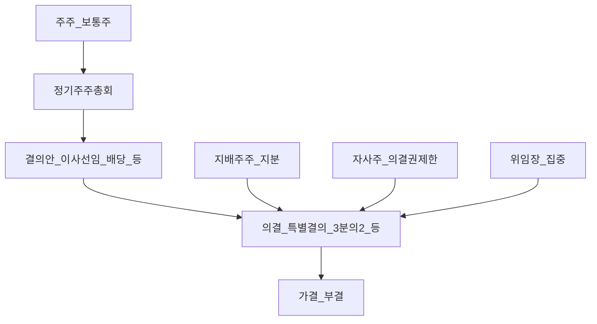
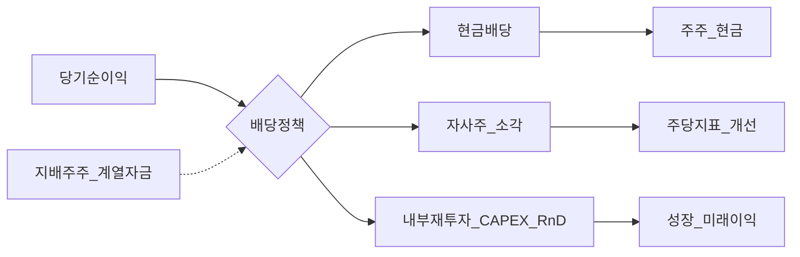
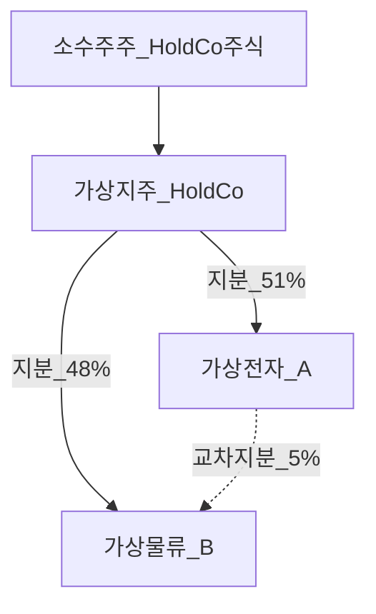
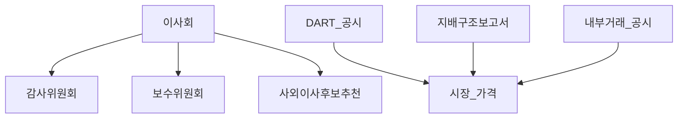

# 기업지배구조·소수주주 — 의결권·배당·재벌 맥락 (한국)

> **면책**: 본 문서는 교육 목적이며, 특정 종목·기업에 대한 매수·매도·행동주의·소송 권고가 아닙니다. 상법·자본시장법·거래소 규정·정관은 개정될 수 있으므로 실행 전 **DART 공시·금융위·한국거래소·법률 전문가** 확인이 필요합니다. 사례 기업명은 **가상**이며 실제 상장사와 무관합니다.

## 메타

| 항목 | 내용 |
|------|------|
| 최종 검증일 | 2026-05-25 |
| 정책·법령 기준일 | 상법·자본시장법 2025 확정, 2026 지배구조·공시 개편 **별도 표기** |
| 난이도 | L4 (Graduate) — [READER-GUIDE](../docs/READER-GUIDE.md) |
| 예상 읽기 시간 | 150~180분 |
| 관련 bucket | Bucket 3 (개별주·밸류에이션), Bucket 4 (지배구조·이벤트 리스크) |

## 0. 이 편 읽기 전 (5분)

| 항목 | 내용 |
|------|------|
| **난이도** | L4 (Graduate) — [READER-GUIDE §L등급](../docs/READER-GUIDE.md) |
| **선수** | [stocks-equities-intro](stocks-equities-intro.md), [dividends-buybacks](../01-foundations/dividends-buybacks.md) |
| **이번 편에서 쓰는 기호** | 본문 §4·§4a 표 참고 |
| **복습 한 줄** | L3 선수 편을 먼저 읽으면 수식이 수월함 |

## TL;DR

1. **소수주주(minority shareholder)** 는 의결권·이익배당·청산잔여재산 분배에서 **지배주주·경영진과 정보·영향력 비대칭**에 놓인다 — 가격은 “PER”만이 아니라 **지배구조 프리미엄/디스카운트**에 반응할 수 있다.
2. **의결권**은 1주 1표가 원칙이나, **의결권 없는 주식·차등의결권·교차지분·자사주·위임**이 실질 표결력을 왜곡한다 — 한국 **재벌·지주사** 맥락에서 특히 중요하다.
3. **배당정책**은 주주환원 수단이지만 **지배주주 현금흐름·계열사 자금순환·세무·재투자**와 얽혀 **소수주주 체감 수익**과 괴리될 수 있다.
4. **기업지배구조(governance)** 는 이사회 독립성·감사·공시·내부거래·특수관계인 거래 규율의 **묶음** — ESG·스튜어드십 코드는 **권고·준수 공시** 성격이 강하다.
5. **한국**은 **지주사–계열** 구조·**보호예수·교차지분**·**적대 M&A 제도**가 미국과 다른 **제도적 배경**을 만든다 — [equity-valuation-fundamentals](equity-valuation-fundamentals.md)와 병행.
6. 개인 투자자는 “싸 보이는 PER” 전에 **특수관계인 거래·무상감자·유상증자·CB/BW** 이벤트가 **희석·자금 유출**을 만드는지 **공시 타임라인**으로 점검한다.

---

## 1. 한 줄 정의 + 왜 중요한가

**정의**: **기업지배구조·소수주주** 학습은 상장사에서 **경영 통제권을 가진 집단(지배주주·최대주주·경영진)** 과 **그 외 주주** 사이의 **권리·의무·이해충돌**을, **의결권·배당·이사회·공시·계열 거래** 축으로 설명하는 과제다.

**왜 중요한가**: 장기 주식 투자자의 수익은 **영업이익 성장**뿐 아니라 **주당 이익(EPS) 희석 방지**, **배당·자사주 매입**, **지배구조 리스크(소송·규제·지분 싸움)** 에 좌우된다. 한국 대형주 다수는 **가족·지주 중심 지배**가 남아 있어, 동일 업종·PER라도 **소수주주 보호 수준**에 따라 **밸류에이션 멀티플**이 갈릴 수 있다. [reading-annual-reports-dart](../01-foundations/reading-annual-reports-dart.md)의 **지배구조보고서·특수관계인 거래** 항목과 직결된다.

---

## 2. 선수 지식 / 이후 읽을 것

**선수**:
- [stocks-equities-intro](stocks-equities-intro.md) — 주식·주주권 기초
- [dividends-buybacks](../01-foundations/dividends-buybacks.md) — 배당·자사주
- [reading-annual-reports-dart](../01-foundations/reading-annual-reports-dart.md) — DART 공시
- [financial-statements-analysis](../01-foundations/financial-statements-analysis.md) — 재무제표

**이후**:
- [ma-basics](../09-corporate-finance/ma-basics.md) — M&A·지배권 변동
- [passive-vs-active](../04-portfolio/passive-vs-active.md) — 스튜어드십·행동주의
- [korea-equity-market-structure](korea-equity-market-structure.md) — 시장 구조

---

## 3. 직관·비유

**아파트 입주자총회**: **소유 지분 51%** 를 가진 **시공사 관계 대표**가 안건을 주도하면, **1세대 1표**라도 **핵심 안건(관리비 인상·시설 매각)** 은 사실상 통과된다. 소수 입주자는 **회의록(공시)** 을 읽고 **이사회(관리위원회)** 에 **독립 이사**가 있는지, **특수관계 업체**와의 **수의계약**이 반복되는지 본다 — “월세(배당)를 올려 주는가”와 “건물 가치(주가)”는 **별개**일 수 있다.

**배당 = 현금 인출 버튼**: 지배주주는 **계열사 간 배당·로열티·브랜드 사용료**로 현금을 **원하는 지점**으로 옮길 수 있다. 소수주주는 **모회사 주식**만 들고 있으면 **자회사 성과**가 **모회사 배당**으로 **늦게·적게** 전달될 수 있다 — **지주사 디스카운트**의 직관적 뿌리다.

**의결권 = 리모컨 채널**: **보통주**는 채널 전환, **우선주(의결권 제한)** 는 음량만, **자사주**는 리모컨을 서랍에 넣은 것, **교차지분**은 이웃 집 리모컨이 우리 TV에도 연결된 상태다.

---

## 4. 정식 개념·용어

| 용어 | English | 교육용 정의 |
|------|---------|-------------|
| 소수주주 | Minority shareholder | 의결권·경영 참여에서 **소수** 지분 보유자 |
| 지배주주 | Controlling shareholder | 사실상 **경영·의사결정** 영향력 보유자 |
| 최대주주 | Largest shareholder | **지분율** 기준 1위 (지배와 **불일치** 가능) |
| 의결권 | Voting rights | 주주총회 **안건 표결** 권리 |
| 1주 1표 | One share one vote | 보통주 **평등 의결** 원칙 |
| 차등의결권 | Dual-class shares | 주식 종류별 **표결권 차등** (한국 제한적) |
| 배당성향 | Payout ratio | 순이익 대비 **배당·환원** 비율 |
| 자사주 | Treasury stock | 회사가 **취득한 자기 주식** — 의결권 **행사 제한** |
| 이사회 | Board of directors | **경영 감독**·주요 결정 기구 |
| 사외이사 | Outside director | **경영진·특수관계인**과 분리된 이사 |
| 특수관계인 | Related party | 지배·피지배·친족 등 **공시 대상** 관계 |
| 내부거래 | Related-party transaction | 특수관계인과 **자산·용역·자금** 거래 |
| 지배구조보고서 | Governance report | **이사회·보수·주주권** 등 연 1회 공시 |
| 스튜어드십 코드 | Stewardship code | 기관 **의결권 행사·소통** 권고 |
| 행동주의 | Shareholder activism | **의결권·공개 압박**으로 경영 변화 요구 |
| 지주사 할인 | Holding company discount | **순자산·SOTP** 대비 **시장총액** 할인 |
| 소수주주권 | Minority rights | **의결권 거부·손해배상·대표소송** 등 |
| 적대 M&A | Hostile takeover | **경영진 비협조** 인수 시도 |
| 보호예수 | Lock-up | 상장·유증 후 **매도 제한** |
| 교차지분 | Cross-shareholding | 계열사 간 **상호 지분** 보유 |

### 4a. 핵심 용어 (본문 등장 순)

> 복습용. 정의는 §4 본표·[glossary](../00-roadmap/glossary.md)·본문 `!!! info` 박스.

| 용어 | 한 줄 | 관련 이론 | glossary |
|------|-------|-----------|----------|
| 소수주주 | 의결권·경영 참여에서 **소수** 지분 보유자 | §4 | [glossary](../00-roadmap/glossary.md#소수주주) |
| 지배주주 | 사실상 **경영·의사결정** 영향력 보유자 | §4 | [glossary](../00-roadmap/glossary.md#지배주주) |
| 최대주주 | **지분율** 기준 1위 | §4 | [glossary](../00-roadmap/glossary.md#최대주주) |
| 의결권 | 주주총회 **안건 표결** 권리 | §4 | [glossary](../00-roadmap/glossary.md#의결권) |
| 1주 1표 | 보통주 **평등 의결** 원칙 | §4 | [glossary](../00-roadmap/glossary.md#1주-1표) |
| 차등의결권 | 주식 종류별 **표결권 차등** | §4 | [glossary](../00-roadmap/glossary.md#차등의결권) |
| 배당성향 | 순이익 대비 **배당·환원** 비율 | §4 | [glossary](../00-roadmap/glossary.md#배당성향) |
| 자사주 | 회사가 **취득한 자기 주식** | §4 | [glossary](../00-roadmap/glossary.md#자사주) |
| 이사회 | **경영 감독**·주요 결정 기구 | §4 | [glossary](../00-roadmap/glossary.md#이사회) |
| 사외이사 | **경영진·특수관계인**과 분리된 이사 | §4 | [glossary](../00-roadmap/glossary.md#사외이사) |
| 특수관계인 | 지배·피지배·친족 등 **공시 대상** 관계 | §4 | [glossary](../00-roadmap/glossary.md#특수관계인) |
| 내부거래 | 특수관계인과 **자산·용역·자금** 거래 | §4 | [glossary](../00-roadmap/glossary.md#내부거래) |
| 지배구조보고서 | **이사회·보수·주주권** 등 연 1회 공시 | §4 | [glossary](../00-roadmap/glossary.md#지배구조보고서) |
| 스튜어드십 코드 | 기관 **의결권 행사·소통** 권고 | §4 | [glossary](../00-roadmap/glossary.md#스튜어드십-코드) |
| 행동주의 | **의결권·공개 압박**으로 경영 변화 요구 | §4 | [glossary](../00-roadmap/glossary.md#행동주의) |

---

## 5. 메커니즘 — 의결권·배당·지배구조 흐름

### 5.1 주주총회 의결권 체인

**교육 포인트**: **특별결의**(정관 변경·합병 등)는 **높은 정족·찬성 비율**이 필요하나, **최대주주·우호 지분**이 있으면 **소수주주 반대**만으로는 막기 어렵다. **분리안건**·**전자투표** 확대는 **소액주주 참여**를 높이지만 **구조적 지배**를 자동 해소하지는 않는다.

### 5.2 배당·자금 환원 vs 재투자

### 5.3 한국 지주·계열 구조 (개념)

**함의**: 소수주주가 **HoldCo**만 보유하면 **SubA·B의 이익**은 **연결·배당·특수관계 거래** 경로로 **늦게·왜곡되어** 반영될 수 있다.

### 5.4 이사회·감사·공시 감시

---

## 6. 수식·모델 (해당 시)

### 6.1 배당성향·주당배당

| 기호 | 이름 | 이 식에서 의미 |
|------|------|----------------|
| \(배당성향\) | Payout ratio | 순이익 대비 **배당·환원** 비율 |
| \(현금배당총액\) | 현금배당총액 | §4·본문 정의 참고 |
| \(당기순이익(지배주주 귀속)\) | 당기순이익(지배주주 귀속) | §4·본문 정의 참고 |

\[
\text{배당성향} = \frac{\text{현금배당총액}}{\text{당기순이익(지배주주 귀속)}} \times 100\%
\]

\[
DPS = \frac{\text{현금배당총액}}{\text{발행보통주식수(희석조정 후)}}
\]

**주의**: **순이익**이 일회성·연결조정에 흔들리면 **성향**이 왜곡된다 — **조정 EPS**·**FCF 배당력** 병행.

### 6.2 지배권 프리미엄·소수주주 할인 (개념)

\[
V_{\text{SOTP}} = \sum_i V_i - \text{순부채} \quad (\text{사업부문·자회사 합산})
\]

시장총액 \(M < V_{\text{SOTP}}\) 이면 **지주 할인**; \(M > V_{\text{SOTP}}\) 이면 **지배 프리미엄** (드묾). **소수주주**는 **할인 구간**에서 **추가 하락**·**거래량 축소** 리스크를 감안.

### 6.3 의결권 지분율 (단순)

\[
\text{의결권 비율} = \frac{\text{의결권 있는 주식수}}{\text{발행주식총수 - 자사주 등 제외}} \times 100\%
\]

**교차지분**·**우선주**·**의결권 제한 주식**이 있으면 **경제적 지분** ≠ **의결권 지분**.

### 6.4 M&M과 배당 무관성 (교육)

완전시장·무비용·무법인세 가정 하 **배당정책**은 **기업가치**와 무관(**Miller-Modigliani**) — **현실**에서는 **세금·정보·자금조달·지배주주 선호**로 **정책이 신호**가 된다.

---

## 7. 한국 적용 — 재벌·지주·제도

### 7.1 2025년 기준 (확정·교육 요지)

| 영역 | 요지 |
|------|------|
| 상법·자본시장법 | **주주총회**·**특별결의**·**소수주주권** (의결권 거부권·주주대표소송 등) |
| 공시 | **지배구조보고서**·**특수관계인 거래**·**대량보유**·**공개매수** |
| 거래소 | **기업지배구조 모범규준**·**ESG 정보공시** 가이드 |
| 스튜어드십 | **기관투자자** 의결권 행사·소통 **권고** (법적 강제와 구분) |
| 적대 M&A | **과거 대비** 제도 변화 논의 지속 — **방어수단·국민연금 역할** 이슈 |

### 7.2 재벌·지주사 맥락 (교육)

| 특징 | 소수주주 함의 |
|------|----------------|
| **지주사 상장** | **SOTP 할인**·**배당 경로** 복잡 |
| **계열사 간 거래** | **이전가격**·**로열티** — **이익 이동** 가능성 |
| **교차지분** | **의결권 고착**·**지분 매각** 어려움 |
| **보호예수·지분 확약** | **유통 물량** 제한 → **유동성**·**변동성** |
| **유상증자·CB/BW** | **희석**·**전환** 시 **지배주주 우선 참여** |
| **자사주·소각** | **주당지표** 개선 but **지배 안정**에 쓰이기도 |

### 7.3 2026년 개편·시행 예정 (해당 시 — 재확인)

| 항목 | 방향 (보도·정책 요지) | 투자 교육 함의 |
|------|----------------------|----------------|
| 지배구조·공시 강화 | **이사회 책임**·**내부통제** 공시 확대 추진 | **연간 보고서** 분량·항목 증가 |
| 소액주주 보호 | **전자투표**·**분리안건**·**배당 공시** 세분화 논의 | **참여 비용**↓, **구조 리스크**는 별개 |
| 내부거래·공정거래 | **특수관계인** 규율·**불공정 거래** 제재 | **이벤트 드리븐** 리스크 |

**법·정책 근거**: 상법, 자본시장법, 금융위원회·한국거래소 규정 — **조문 번호는 개정 시 변경**되므로 [law.go.kr](https://www.law.go.kr)에서 최신본 확인.

---

## 8. 숫자 예제 (가상)

> 모든 회사·인물·금액은 **가상**입니다.

### 예제 1 — 의결권과 특별결의 (가상 HoldCo)

| 항목 | 수치 |
|------|------|
| 발행 보통주 | 100백만 주 |
| 최대주주(가족) | 38% |
| 자사주 | 8% (의결권 제한) |
| 기관·외국인 | 41% |
| 개인 소액 | 13% |

**안건**: 자회사 **가상전자 A** 흡수합병 — **특별결의** 필요. 최대주주·우호 **40%+** 가 찬성하면 **가결** 가능성 높음. 소수주주 연합 **15%** 의결권 거부권 등 **요건 충족 여부**는 **최신 상법·지분 구조**로 별도 검토(교육상 “거부권 행사 **검토 필요**”로만 기록).

**교훈**: **PER 저평가**만으로 매수하지 말고 **합병 공시**의 **교환비율·상대가치**를 읽는다.

### 예제 2 — 배당 vs 자사주 (가상 SubA)

| | 2024 | 2025 (가정) |
|--|------|-------------|
| 지배주주 귀속 순이익 | 1,000억 | 1,200억 |
| 현금배당 | 200억 | 240억 |
| 자사주 매입·소각 | 0 | 300억 |
| 배당성향 | 20% | 20% (순이익 기준) |
| **총 환원율** | 20% | **45%** |

소수주주: **배당 소득**은 느리게 늘지만 **주당순이익**은 자사주로 **↑** 가능 — **세금·계좌**(배당소득 vs 매도차익)는 [domestic-stocks-tax](../06-korea-policy/tax/domestic-stocks-tax.md) 참고.

### 예제 3 — 지주 할인 (가상 SOTP)

| 자회사 | 지분 | 가치(억) |
|--------|------|----------|
| 가상전자 | 60% | 6,000 |
| 가상물류 | 100% | 2,000 |
| 순부채 | — | (500) |
| **SOTP 합계** | | **7,500** |
| HoldCo 시총 | | **5,250** |
| **할인율** | | **30%** |

**해석**: 시장이 **계열 거래 불확실성·배당 경로·지배 리스크**를 **30%** 할인. **할인 축소**는 **지배구조 개선·배당 정책** 신호 없이는 **느릴** 수 있음.

### 예제 4 — 무상감자·주식병합 (가상)

**10:1 액면병합(주식병합)** — 주식 수 ↓, 주가 **표시** ↑. **경제적 가치** 불변 but **유동성·지수 편입**·**심리** 효과. 소수주주: **호가 단위**·**최소 거래 금액** 변화 확인.

### 예제 5 — CB 발행과 희석 (가상)

전환가 **50,000원**, 발행액 **500억**, 현재가 **42,000원**. 주가 상승 시 **전환** → **희석** — 지배주주가 **전환 전 유상증자 참여**하면 **지분율 방어** 가능, 소수주주는 **방어 여부** 공시 추적.

---

## 9. FAQ

**Q1. 소수주주도 의결권이 있나요?**  
**A1.** **보통주**는 원칙적으로 **1주 1표**다. 다만 **지분이 작으면** 실질 영향력은 제한적이며, **의결권 없는 주식**·**자사주**·**위임 집중**이 결과를 좌우할 수 있다.

**Q2. 배당을 많이 주면 무조건 좋은 주식인가요?**  
**A2.** 아니다. **높은 배당**이 **재투자 부족**·**일회성 이익 소진**·**부채 상환** 신호일 수 있다. **FCF·부채비율·성장 단계**와 함께 본다.

**Q3. 지주사 할인은 언제 줄어드나요?**  
**A3.** **SOTP 대비** 할인 축소는 **배당·지분 매각·지배구조 개편·계열 정리** 등 **명확한 촉매**가 있을 때 자주 논의된다 — **보장되지 않음**.

**Q4. 사외이사가 많으면 안전한가요?**  
**A4.** **형식적 독립**과 **실질적 감시**는 다르다. **출석률·보수·내부거래 승인** 이력을 **지배구조보고서**에서 연속으로 본다.

**Q5. 특수관계인 거래가 나쁜 건가요?**  
**A5.** **불가피한 계열 거래**도 있다. 문제는 **시장가 대비 불리한 조건**·**반복**·**공시 지연** — **이사회 승인·감사 의견** 확인.

**Q6. 행동주의 펀드가 들어오면 주가에 도움이 되나요?**  
**A6.** **단기 이벤트**·**거래량**은 늘 수 있으나 **구조 개선 실현**은 **불확실** — [market-efficiency-emh](../08-advanced/market-efficiency-emh.md) 관점에서 **정보 반영 속도** 논의.

**Q7. 자사주 매입은 소수주주에게 항상 이득인가요?**  
**A7.** **주당지표**·**주주환원**에 유리할 수 있으나 **저평가 시점 매입**인지·**소각 vs 재발행**·**지배 안정 목적**인지 **공시 목적**을 읽는다.

**Q8. 한국 재벌 구조는 언제까지 투자에 영향을 주나요?**  
**A8.** **지배 구조**는 **천천히** 변한다. **글로벌 패시브·ESG·스튜어드십**이 **압력**을 가하지만 **단기 해소** 기대는 **위험** — **장기 할인율** 가정에 반영.

**Q9. 소액주주도 대표소송을 할 수 있나요?**  
**A9.** **요건**(지분·기간·절차)을 **상법·판례**로 충족해야 한다 — **개인 투자자**에게 **비용·시간** 부담 큼. **교육상** “권리 존재 vs 실익” 구분.

**Q10. ESG 등급이 높으면 지배구조가 좋은가요?**  
**A10.** **ESG 점수**와 **소수주주 보호**는 **완전 일치하지 않음** — **환경** 강점·**지배구조** 약점이 공존할 수 있다.

---

## 10. 함정·리스크·한계

- **저PER = 소수주주 친화**로 단순화 — **지배 할인**이 **영구적**일 수 있음.
- **배당 수익률**만 추종 — **감배당**·**적자 전환** 리스크.
- **합병·분할** 교환비율 **불리** — **공시 초안** 미독.
- **내부자·대량매도**와 **지배구조 악화** 혼동.
- **스튜어드십 공시**를 **실질 개선**으로 오인.
- **해외 ADR/GDR** — **권리 행사·통지** 경로 복잡.
- **법률 자문 대체** — 소송·의결권 거부는 **전문가** 영역.

---

## 11. 심화 읽기

- [references/sources.md](../references/sources.md) — 금융위·거래소·DART
- 상법·자본시장법 (국가법령정보센터)
- 한국거래소 **기업지배구조 모범규준**
- OECD **Corporate Governance Factbook** (비교)
- [dividends-buybacks](../01-foundations/dividends-buybacks.md)
- [ma-basics](../09-corporate-finance/ma-basics.md)

---

## 12. 스스로 점검 퀴즈

1. **의결권 지분**과 **경제적 지분**이 달라지는 경우 세 가지를 쓰시오.  
2. **지주사 할인** 30%의 가상 SOTP에서 시총이 7,500억→6,000억으로 **20% 상승**했을 때, 할인율은?  
3. **배당성향 20%**와 **총 환원율 45%** 차이의 원인은?  
4. **특별결의**가 필요한 안건 예를 두 가지 들으시오.  
5. 소수주주가 **공시**에서 먼저 볼 **세 가지 항목**은?

??? note "정답 힌트"

    1. 우선주(의결권 제한), 교차지분·자사주, 차등의결권 등  
    2. (7500−6000)/7500 = **20%** (할인 축소)  
    3. **자사주 매입·소각** 포함  
    4. 정관 변경, 합병, 영업양도 등 (최신법 확인)  
    5. 특수관계인 거래, 지배구조보고서, 유증·CB/BW 등

---

## 부록 A — 주주총회 안건 체크리스트 (가상 실습)

| 안건 유형 | 소수주주 점검 질문 |
|-----------|-------------------|
| 이사 선임 | 사외이사 **비율**·**전문성**·**겸직** |
| 배당 | **총액**·**성향**·**분기배당** 도입 여부 |
| 정관 변경 | **의결권 제한**·**배당 정책** 조항 |
| 합병·분할 | **교환비율**·**상대가치** 평가 근거 |
| 자사주 | **취득 한도**·**소각 계획** |

## 부록 B — DART 공시 키워드 (교육)

`지배구조보고서`, `특수관계인`, `주요사항보고서`, `대량보유`, `공개매수`, `의결권대리행사`, `주식매수선택권`, `전환사채`, `무상증자`.

## 부록 C — 비교: 한국 vs 미국 (요지)

| | 한국 (교육) | 미국 (교육) |
|--|-------------|-------------|
| 지배 | 지주·계열 **잔존** | **분산 주주** 상대적 다수 |
| M&A 방어 | **제도·관행** 다름 | **포이즌 필** 등 시장 관행 |
| 배당 | **성향** 점진 상승 논의 | **Buyback** 비중 큼 |
| 소수주주 소송 | **요건** 엄격 | **Class action** 생태계 |

## 부록 D — 연습: 가상 “가나다지주” 워크시트

1. 연결 순이익·**지배주주 귀속** 분리  
2. 계열 **내부거래** 매출 비중  
3. **자사주**·**CB** 잔액  
4. **배당** 3년 추이  
5. **SOTP** vs 시총 **할인율** 기록  

## 부록 E — 의결권 거부권·대표소송 (교육 개요)

**의결권 거부권**은 특정 중요 안건에 대해 **소수 지분**이라도 **결의 무효·손해배상**을 구할 수 있는 **법정 권리**다. 요건(지분 비율·보유 기간·안건 유형)은 **개정**될 수 있으므로 **최신 상법**을 본다. **주주대표소송**은 회사가 **이사·감사**에게 손해배상 청구를 **대신** 행사하는 제도로, **소수주주**가 **요건**을 갖추면 **제기**를 추진할 수 있다. **개인 투자자**에게는 **비용·기간·승소 불확실성**이 커서 **교육상** “권리 존재”와 “실익적 행사”를 구분한다.

| 단계 | 교육용 설명 |
|------|-------------|
| 1 | **위법 결의** 또는 **특수관계인 거래** 손해 발생 |
| 2 | **요건** 충족 여부 (지분·기간) |
| 3 | **이사회**에 청구 촉구 |
| 4 | **대표소송** 또는 **의결권 거부** 절차 |
| 5 | **판결**·**배상** → **주가** 반영은 **지연·불확실** |

## 부록 F — 스튜어드십·기관투자자 의결권 (개념)

**연기금·자산운용**은 **스튜어드십 코드**에 따라 **의결권 행사 정책**·**대상 회사와의 대화**를 공시하는 경우가 많다. **반대표**·**분리표**는 **지배주주 안건**에 **제동**을 걸 **신호**가 될 수 있으나, **항상** 소수주주 의견과 **일치**하지는 않는다 — **ESG·지수**·**리스크** 관리 목적이 섞인다. 개인은 **의결권 위임** 시 **위임장 용지**·**대리인**을 확인하고, **전자투표** 시 **마감 시한**을 놓치지 않는다.

## 부록 G — 배당 정책 유형 (교육 분류)

| 유형 | 설명 | 소수주주 관점 |
|------|------|----------------|
| **잔여 배당** | 이익·자금 여건에 따라 **변동** | **예측 어려움** |
| **고정 배당** | 주당 **일정 금액** 목표 | **안정** but **감배당** 충격 |
| **안정 배당** | **하한** 유지·**점진 상향** | **신호** 긍정적 인식 가능 |
| **자사주 중심** | 배당보다 **매입·소각** | **세금·수익 실현** 경로 다름 |

**한국** 대형 **지주**는 **배당**보다 **계열 재배치**·**M&A**에 **현금**을 쓰는 **연도**가 있어 **배당성향**이 **낮아** 보일 수 있다 — **총 주주환원**(배당+자사주)으로 본다.

## 부록 H — 지배구조 사건 타임라인 읽기 (가상)

**T−30일**: **내부거래** 예정 공시 — 거래 규모·조건  
**T−14일**: **유상증자** 청약 — **할인율**·**대주주 인수** 비율  
**T−7일**: **주주총회** 소집 — **안건** 목록  
**T일**: **의결** — **가결** 시 **다음날** 주가 반응  
**T+30일**: **합병** 기일 — **교환** 주식 **입고**

소수주주는 **T−** 구간에서 **의견 제시**·**매도·보유** 결정을 한다 — **T일** **장중** **추격 매수**는 **정보 열세**다.

## 부록 I — ESG·지배구조 점수와 투자 (비판적 교육)

**ESG 등급**은 **환경·사회·지배**를 **종합**한다. **E**는 **양호**해도 **G**에서 **이사회 독립성 부족**·**특수관계인 거래**가 **지적**될 수 있다. **지수 편입**·**패시브** 자금이 **ESG 필터**를 쓰면 **유동성**·**밸류에이션**에 **2차 효과**가 있으나, **필터 통과**가 **소수주주 보호 완성**을 뜻하지는 **않는다**.

## 부록 J — 연습문제 (추가)

6. **교차지분**이 **의결권 고착**에 기여하는 메커니즘을 한 단락으로 설명하시오.  
7. **가상 HoldCo** 예제에서 **기관 41%**가 **합병 반대**해도 **가결**될 수 있는 이유는?  
8. **Miller-Modigliani** 배당 무관성이 **한국 지주사**에 **약하게** 적용되는 이유 세 가지.

??? note "추가 정답 힌트"

    6. 상호 지분으로 **매각**·**적대 M&A** 비용 ↑, **경영 교체** 어려움  
    7. **최대주주 38%+α**·**위임**·**안건 구조**  
    8. **세금·정보 비대칭·지배주주 배당 선호·계열 자금 이동**

## 부록 K — Bucket·포트폴리오 연결

| Bucket | 지배구조 관점 |
|--------|----------------|
| Bucket 3 (코어 지수) | **다수 종목** 분산 — **개별 지배 리스크** ↓ |
| Bucket 4 (개별·테마) | **소수주주·지주 할인** **직접** 노출 |
| 장기 적립 | **지배구조 악화** 종목 **장기 보유** 비용 |

[core-satellite-framework](../04-portfolio/core-satellite-framework.md)에서 **위성** 포지션에 **지배 할인** 종목을 **과다** 넣지 않도록 **한도**를 두는 **교육적** 방법을 쓸 수 있다.

## 부록 L — 용어 색인

Minority shareholder, Controlling shareholder, AGM, Special resolution, Dividend payout, Treasury stock, Related-party transaction, Governance report, Stewardship code, Activism, Holding discount, SOTP, Cross-shareholding, Lock-up, Poison pill (비교), Class action (비교).

## 부록 M — 문서 종료

**L4 기업지배구조·소수주주** — 12블록·FAQ 10·mermaid 4·가상 예제 5·부록 M. 검증일 **2026-05-25**. UTF-8 길이는 `python3 -c "print(len(open('corporate-governance-minority.md',encoding='utf-8').read()))"` 로 로컬 재확인.

---

## 부록 N — 주주총회 결의 요건 심화 (교육)

### 보통결의 vs 특별결의

보통결의는 정족·찬성 요건이 상대적으로 낮아 이사 선임·재무제표 승인·배당(정관 범위) 등 일상 안건에 쓰인다. 특별결의는 정관 변경·합병·영업양도·자본금 감소 등 구조적 변화에 요구되며, 소수주주에게는 의결권 거부권·주주제안권 등 추가 보호 장치가 특정 안건에 한해 작동할 수 있다. 교육용으로는 항상 최신 상법 조문과 해당 상장사 정관을 대조한다.

### 전자투표·위임장

전자투표 확대는 소액주주의 참여 비용을 낮춘다. 다만 위임장을 최대주주·경영진에게 집중하면 표결력은 형식상 1인 1표와 달라질 수 있다. 기관의 스튜어드십 공시는 위임 정책을 읽는 단서가 된다.

### 분리안건

이사 선임을 개별 후보별로 분리하면 특정 후보에 대한 반대 표가 가능해진다. 소수주주 연합이 아니어도 개별 투자자가 거부 의사를 표시할 수 있는 제도적 통로다.

---

## 부록 O — 배당·자사주·세무 연결 (한국 교육)

### 배당소득 분리과세

국내 상장주 배당은 계좌·금액에 따라 분리과세·종합과세 경로가 달라진다. 지주사를 통해 배당을 받을 때와 자회사 직접 보유 시 세무·현금흐름 경로가 다를 수 있다.

### 자사주 취득 한도

자사주 취득·처분은 상법·자본시장법·정관의 한도와 절차를 따른다. 소각은 발행주식수를 줄여 주당지표를 개선할 수 있으나, 지배 안정·주가 부양 목적과 구분해 공시 목적을 읽어야 한다.

### 분기배당·중간배당

분기배당 도입·확대는 현금 환원의 가시성을 높인다. 다만 일회성 이익·부채 상환을 배당으로 가리는 패턴은 FCF 지속가능성과 대조한다.

---

## 부록 P — 지배구조 사건 스터디 (가상, 3건)

### 사건 1: 가상전자 유상증자

시가 대비 30% 할인 유상증자, 대주주 100% 인수 약정. 소수주주는 희석률·자금 사용처(부채 상환 vs R&D)를 공시에서 확인한다.

### 사건 2: 가상물류 특수관계인 거래

모회사에 물류 서비스 200억 공급, 가격은 시장가 대비 5% 할인(공시). 소수주주는 이전가격이 지배주주에게 유리한지 감사·사외이사 의견을 본다.

### 사건 3: 가상지주 자회사 상장

자회사 IPO로 지분 30% 매각, 지주사 SOTP 재평가 기대. 소수주주는 지주사 주가가 SOTP 할인 축소로 따라가는지 판단한다.

## 부록 Q — 연습문제 세트 (심화)

1. 가상 HoldCo가 자회사를 흡수합병할 때 소수주주가 DART에서 확인할 문서 5가지를 나열하시오.
2. 배당성향 0%인데 자사주 매입이 큰 회사 — 주주환원 관점에서 긍정·부정 논거를 각 2개씩 쓰시오.
3. 교차지분 10%가 양방향으로 존재할 때 적대 M&A 비용이 어떻게 달라지는지 설명하시오.
4. 지주사 할인 25%가 5년간 유지될 때, 개인 장기 투자자의 합리적 대응(교육) 3가지.
5. 의결권 없는 우선주를 발행한 경우 소수 보통주주의 리스크 3가지.

## 부록 R — 교재급 요약

한국 상장사 투자에서 소수주주는 공시·지배구조보고서·특수관계인 거래를 통해 이해충돌을 추적한다. PER·PBR만으로 매수하지 않고, 유상증자·CB·합병·배당·자사주 이벤트가 주당 가치에 미치는 경로를 타임라인으로 기록하는 습관이 L4 학습의 핵심 산출물이다. 재벌·지주 맥락은 단기 해소가 어려울 수 있으므로 포트폴리오 한도·분산·지수 코어로 테일 리스크를 관리한다.

## 부록 S — 문서 종료 (갱신)

**L4 기업지배구조·소수주주** — FAQ 10+, mermaid 4+. 검증일 **2026-05-25**.

---

## 부록 — 심화 서술 (L4 분량 보강)

본 절은 동일 주제를 **교재급 밀도**로 반복·심화하여 학습자가 개념을 **장기 기억**하도록 돕는다. 모든 수치·회사명은 **가상**이며 투자 권유가 아니다.

### A. 의사결정 프레임과 공시 독해

상장사에 투자한다는 것은 **경영진·지배주주가 대리인(principal-agent)** 이고 투자자가 **위임자**인 구조에 참여하는 것이다. 완전한 정보 대칭은 없으므로 **공시·지배구조보고서·감사보고서**가 계약의 일부다. L4 학습자는 뉴스 헤드라인 대신 **공시 원문**의 숫자(거래 금액, 교환비율, 희석률, 배당총액, 자사주 취득 한도)를 **스프레드시트 한 줄**로 옮기는 습관을 만든다. 이벤트 전후 **5거래일·20거래일** 수익률을 기록하면 **시장이 무엇을 해석했는지** 역사적으로 복기할 수 있다 — 단, 과거 패턴이 미래를 보장하지는 않는다.

### B. 한국 시장 맥락 (2025~2026)

한국은 **가계 자산** 중 부동산 비중이 높고, **주식·펀드**는 상대적으로 늦게 익숙해진 세대가 많다. 그 결과 **은행 창구 펀드**·**직장 DC**를 통해 **액티브·혼합형**에 노출된 채 **ETF·인덱스** 비용 구조를 모르는 경우가 있다. 동시에 **KRX ETF** 거래대금·종목 수는 빠르게 늘어 **패시브 인프라**는 성숙해지고 있다. **지주·계열·교차지분**은 여전히 **지배구조 할인** 논의의 중심이며, **코스닥 승강제·퇴출 강화**는 개별주 **테일 리스크**를 키운다. 2026년 전후 **공시·지배구조** 개편이 진행되면 본 문서의 **법조문 번호**는 반드시 **최신본**으로 갱신한다.

### C. 포트폴리오·Bucket 연결

| Bucket | 본 문서 주제와의 관계 |
|--------|------------------------|
| Bucket 3 (코어) | 지수·저비용 ETF·분산 — **지배구조·클로짓·M&A 이벤트** 노출 ↓ |
| Bucket 4 (위성) | 개별주·섹터·벤처 테마 — **소수주주·비상장·이벤트** 노출 ↑ |
| Bucket 0~2 | 비상장·창업 직접 투자는 **별도** 손실 한도 |

[core-satellite-framework](../04-portfolio/core-satellite-framework.md)에서 **위성 한도**(예: 전체의 10~20% 상한, 개인별 상이)를 **문서화**하면 감정 매매를 줄이는 데 도움이 된다. **리밸런싱** 시 “좋은 스토리”가 아니라 **한도·비용·희석** 기준을 우선한다.

### D. 정량 감각 훈련 (가상 연습)

매주 **한 종목·한 펀드·한 거래(가상)** 를 골라: (1) 벤치마크 명칭, (2) TER 또는 총보수, (3) 3년 벤치 대비 초과수익 **총액·순액**, (4) 최대 낙폭, (5) 다음 분기 **이벤트 캘린더** — 다섯 줄 메모. 12주 누적 시 **본인만의 due diligence 템플릿**이 완성된다. L4는 **암기**가 아니라 **템플릿 반복**이다.

### E. 윤리·면책 재확인

내부자 정보·미공개 중요정보를 이용한 매매는 **불법**이다. 커뮤니티 루머·텔레그램 ‘찌라시’는 **공시 전** 행동의 함정이다. 본 저장소 문서는 **교육**이며 **법률·세무·투자 자문**을 대체하지 않는다. 실행 전 **공식 간이투자설명서·집합투자규약·금융투자상품설명서·DART·국세청**을 확인한다.

### F. 교차 문헌 (학습 경로)

- 재무제표: [financial-statements-analysis](../01-foundations/financial-statements-analysis.md)
- WACC·할인: [wacc-capital-structure](../09-corporate-finance/wacc-capital-structure.md)
- ETF·추적: [etf-index-funds-deep](../03-markets/etf-index-funds-deep.md)
- 효율적 시장: [market-efficiency-emh](../08-advanced/market-efficiency-emh.md)
- 행동: [behavioral-finance-complete](../05-behavioral/behavioral-finance-complete.md)
- 한국 세금: [account-product-tax-map](../06-korea-policy/tax/account-product-tax-map.md)

### G. 퀴즈 추가 (자가 채점)

6. **에이전시 비용(agency cost)** 을 지배구조 맥락에서 한 문장으로 정의하시오.  
7. **Free rider** 문제가 소수주주 연합을 어렵게 하는 이유는?  
8. **클로짓 인덱싱**을 발견했을 때 개인 투자자의 **합리적** 대응 3단계는?  
9. **EPS accretion**이 주가에 **즉시** 반영되지 않는 이유 2가지.  
10. **Pre-money** 협상에서 창업팀이 **옵션 풀**을 먼저 키우면 누가 희석되는가?

??? note "힌트"

    6. 경영진·지배주주 이익 ≠ 소수주주 이익에서 생기는 비용  
    7. 연합 비용은 개인 부담, 성과는 공유 → 참여 유인 ↓  
    8. 보유 타당성 재검토 → 벤치 ETF 비교 → 교체·한도 축소  
    9. 시너지 불신·희석·거시 충격  
    10. 창업팀(완전희석 기준)

### H. UTF-8 분량 검증

로컬: `python3 -c "print(len(open('파일경로',encoding='utf-8').read()))"` — **18,000 이상** L4 권장.

