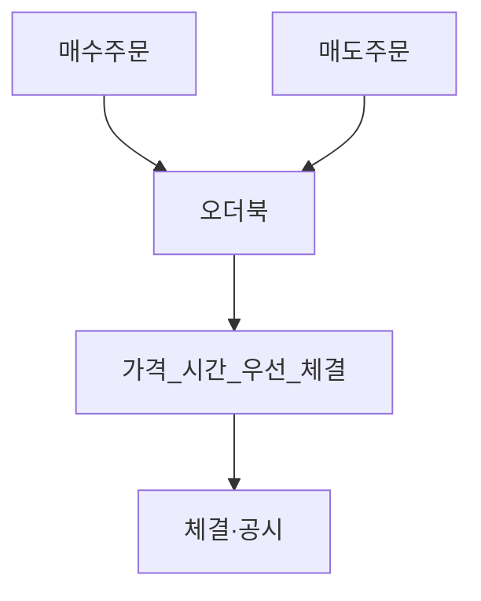
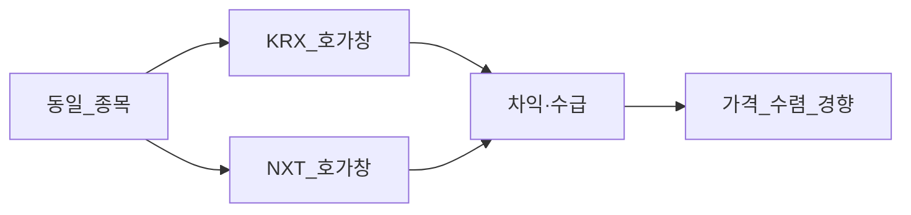
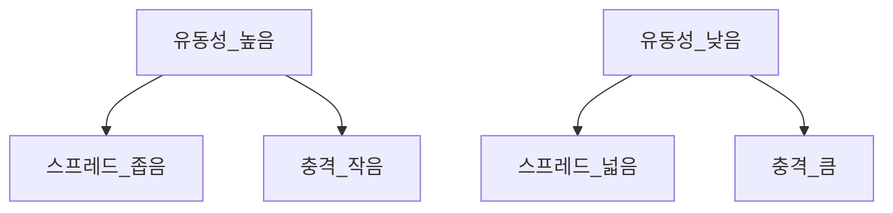

# 시장 미시구조 — 호가·유동성·HFT·KRX·ATS

> **면책**: 본 문서는 교육 목적이며, 특정 개인·법인에 대한 투자·세무·법률 자문이 아닙니다. 제도·세율·상품 조건은 변경될 수 있으므로 실행 전 공식 출처를 확인하세요.

## 메타

| 항목 | 내용 |
|------|------|
| 최종 검증일 | 2026-05-24 |
| 정책·법령 기준일 | 2025-12-31 확정, 2026 개편·시장 규칙 별도 표기 |
| 난이도 | L4 (Graduate) — [READER-GUIDE](../docs/READER-GUIDE.md) |
| 예상 읽기 시간 | 130~160분 |
| 관련 bucket | Bucket 3~4 (체결·비용·개인투자자) |

## 0. 이 편 읽기 전 (5분)

| 항목 | 내용 |
|------|------|
| **난이도** | L4 (Graduate) — [READER-GUIDE §L등급](../docs/READER-GUIDE.md) |
| **선수** | 없음 |
| **이번 편에서 쓰는 기호** | 본문 §4·§4a 표 참고 |
| **복습 한 줄** | L3 선수 편을 먼저 읽으면 수식이 수월함 |

## TL;DR

1. **시장 미시구조**는 **가격이 어떻게 형성·체결**되는지(호가·스프레드·유동성)를 다룬다 — **펀더멘털**과 **별도** 축.
2. **호가스프레드**는 **즉시 매매 비용**; **유동성**이 낮을수록 **스프레드·충격**이 커진다.
3. **호가창(오더북)** 은 **매수·매도 잔량**의 **공개** 스냅샷 — **KRX·NXT** 각각 **별도** 호가.
4. **마켓메이커(MM)**·**유동성 공급자**는 **스프레드**를 좁히는 **대가**로 **인센티브**를 받는다.
5. **HFT**는 **초단기**·**고빈도** — **개인**과 **비대칭** **속도·정보**; **교육**은 **비용·리스크** 인식.
6. **한국 KRX vs NXT(ATS)** — [korea-ats-nextrade](korea-ats-nextrade.md); **개인**은 **체결·수수료·행동**에 **영향**.

---

## 1. 한 줄 정의 + 왜 중요한가

**정의**: **시장 미시구조(Market Microstructure)** 는 거래 **규칙·참가자·호가·체결**이 **가격·비용·유동성**에 미치는 영향을 연구하는 분야다.

**왜 중요한가**: **IV**가 10만 원이어도 **스프레드 2%**·**충격 3%**면 **실현** 가격은 **다르다**. **NXT 야간**·**시장가**·**소형주**는 **미시 비용**이 **수익**을 **삼킨다**. [밸류에이션](equity-valuation-fundamentals.md) **다음** **필수**.

---

## 2. 선수 지식 / 이후 읽을 것

**선수**: [stocks-equities-intro](stocks-equities-intro.md), [korea-ats-nextrade](korea-ats-nextrade.md), [kosdaq-tier-system](kosdaq-tier-system.md)

**이후**: [fomo-and-trading-hours](../05-behavioral/fomo-and-trading-hours.md), [equity-valuation](equity-valuation-fundamentals.md), [bonds-deep](bonds-fixed-income-deep.md) 부록 BD

---

## 3. 직관·비유

**플리마켓 호가**: 사과 **매도** 1,000원·**매수** 980원 → **스프레드** 20원. **급히** 사면 **다음 호가**까지 **올라가** **충격**.

**오더북 = 대기열**: **매수·매도** **줄** — **앞** **체결** **후** **가격** **이동**.

**MM = 상인**: **재고** 들고 **양방향** **호가** — **스프레드**로 **보상**.

**HFT = 배달 오토바이**: **신호** **먼저** — **개인** **도보**와 **같은** **출발선** **아님**.

---

## 4. 정식 개념·용어

| 용어 | English | 정의 |
|------|---------|------|
| Bid-ask spread | 호가 스프레드 | 최우선 **매수·매도** 차 |
| 오더북 | Limit order book | **지정가** **잔량** |
| 체결 | Execution | **매칭** **완료** |
| 유동성 | Liquidity | **저비용** **대량** **거래** |
| 충격비용 | Market impact | **자기** **주문**이 **가격** **움직임** |
| MM | Market maker | **양방향** **호가** **의무** |
| HFT | High-frequency trading | **ms** **단위** **전략** |
| ATS | 대체거래소 | **KRX** **외** **장소** |
| 슬리피지 | Slippage | **기대** **vs** **체결** |
| VWAP | VWAP | **거래량** **가중** **평균** |

### 4a. 핵심 용어 (본문 등장 순)

> 복습용. 정의는 §4 본표·[glossary](../00-roadmap/glossary.md)·본문 `!!! info` 박스.

| 용어 | 한 줄 | 관련 이론 | glossary |
|------|-------|-----------|----------|
| Bid-ask spread | 최우선 **매수·매도** 차 | §4 | [glossary](../00-roadmap/glossary.md#bid-ask-spread) |
| 오더북 | **지정가** **잔량** | §4 | [glossary](../00-roadmap/glossary.md#오더북) |
| 체결 | **매칭** **완료** | §4 | [glossary](../00-roadmap/glossary.md#체결) |
| 유동성 | **저비용** **대량** **거래** | §4 | [glossary](../00-roadmap/glossary.md#유동성) |
| 충격비용 | **자기** **주문**이 **가격** **움직임** | §4 | [glossary](../00-roadmap/glossary.md#충격비용) |
| MM | **양방향** **호가** **의무** | §4 | [glossary](../00-roadmap/glossary.md#mm) |
| HFT | **ms** **단위** **전략** | §4 | [glossary](../00-roadmap/glossary.md#hft) |
| ATS | **KRX** **외** **장소** | §4 | [glossary](../00-roadmap/glossary.md#ats) |
| 슬리피지 | **기대** **vs** **체결** | §4 | [glossary](../00-roadmap/glossary.md#슬리피지) |
| VWAP | **거래량** **가중** **평균** | §4 | [glossary](../00-roadmap/glossary.md#vwap) |

---

## 5. 메커니즘

### 5.1 호가·체결

### 5.2 KRX vs NXT

### 5.3 유동성·스프레드

---

## 6. 수식·모델 (교육)

### 6.1 스프레드 비용

**왕복** **비용** **근사**: \(Cost_{round} \approx 2 \times \frac{Ask-Bid}{Mid}\)

### 6.2 충격 (선형 근사)

| 기호 | 이름 | 이 식에서 의미 |
|------|------|----------------|
| \(Delta\) | Delta | §4·본문 정의 참고 |
| \(P\) | P | §4·본문 정의 참고 |
| \(lambda\) | lambda | §4·본문 정의 참고 |
| \(cdot\) | cdot | §4·본문 정의 참고 |
| \(Q\) | Q | §4·본문 정의 참고 |

\[
\Delta P \approx \lambda \cdot Q
\]

**Q**: **주문** **규모**, **λ**: **유동성** **파라미터**.

### 6.3 실현 스프레드 (개념)

**체결** **가격**과 **중간가** **차** — **정보** **거래** **비중** **추정**.

---

## 7. 한국 적용

### 7.1 KRX

**코스피·코스닥** **정규장** **09:00~15:30** — **메인** **유동성**. **VI**·**서킷**·**단일가** **경매**.

### 7.2 NXT (ATS)

**프리·애프터** — [korea-ats-nextrade](korea-ats-nextrade.md). **호가** **분산** → **최우선** **시장** **선택** **중요**. **거래량** **한도** **규제**.

### 7.3 개인 투자자

| 행동 | 미시 리스크 |
|------|-------------|
| 시장가 | **스프레드**·**충격** |
| 장후 NXT | **얇은** **호가** |
| 소형 코스닥 | **넓은** **스프레드** |
| 추격 매수 | **충격** **누적** |

**DB** **연금** **본인** **주문** **불가** — **NXT** **직접** **해당** **없음**.

---

## 8. 숫자 예제 (가상)

### 예제 1 — 스프레드

**매수** 10,000 **매도** 10,020 → **Mid** 10,010, **스프레드** 20bp **근사** **0.2%**. **왕복** **~0.4%** + **수수료**.

### 예제 2 — 충격

**일거래대금** 10억, **주문** 1억 **매수** → **가격** **+1.5%** **가정** — **분할** **주문** **권장**.

### 예제 3 — KRX vs NXT

**KRX** **스프레드** 15bp, **NXT** **야간** 40bp → **야간** **시장가** **비용** **↑**.

### 예제 4 — IV vs 실현

**IV** **할인** **20%** **MoS** **확보**했으나 **충격** **3%** → **순** **MoS** **17%**.

---

## 9. FAQ

**Q1. 스프레드만 보면 되나?**  
**A1.** **수수료·세금·충격** **합산**.

**Q2. HFT가 나쁜가?**  
**A2.** **유동성** **공급**도 **함** — **개인**은 **비용** **인식**.

**Q3. NXT가 더 싸나?**  
**A3.** **수수료** **이벤트** **가능** — **스프레드** **확인**.

**Q4. 지정가 vs 시장가?**  
**A4.** **지정가** **가격** **통제**, **시장가** **속도** **우선** **비용**.

**Q5. 호가창 10호가?**  
**A5.** **잔량** **깊이** **시각화** — **HTS** **기능**.

**Q6. 유동성 할인과 IV?**  
**A6.** **할인율** **↑** 또는 **MoS** **↑** ([equity-valuation](equity-valuation-fundamentals.md)).

**Q7. ETF는?**  
**A7.** **NAV**·**괴리**·**기초** **유동성** — [etf](etf-index-funds.md).

**Q8. 채권 OTC?**  
**A8.** **두꺼운** **스프레드** — [bonds-deep](bonds-fixed-income-deep.md).

---

## 10. 함정·리스크·한계

- **시장가** **습관** — **비용** **누적**  
- **야간** **FOMO** — [fomo](../05-behavioral/fomo-and-trading-hours.md)  
- **호가** **착시** — **허수** **잔량**  
- **HFT** **공포** **과잉**  
- **양시장** **최우선** **미설정**  
- **백테스트** **슬리피지** **무시**

---

## 11. 심화 읽기

- Harris — *Trading and Exchanges*  
- O'Hara — *Market Microstructure Theory*  
- [korea-ats-nextrade](korea-ats-nextrade.md)

---

## 12. 스스로 점검 퀴즈

1. 스프레드 정의.  
2. 유동성 높을 때 스프레드.  
3. 시장가 리스크.  
4. KRX·NXT 호가 관계.  
5. 충격비용.  
6. MM 역할.  
7. HFT 개인 영향.  
8. MoS와 실행비용.

??? note "정답 힌트"

    1. Ask-Bid  
    2. 좁음  
    3. 스프레드·충격  
    4. 별도·수렴 경향  
    5. Q가 가격 움직임  
    6. 유동성·스프레드  
    7. 속도·비용  
    8. 순 MoS 감소

---

## 부록 A — 주문 유형

**지정가·시장가·조건부·IOC·FOK** — **증권사** **HTS** **매뉴얼**.

## 부록 B — 가격 발견

**연속** **경매** vs **단일가** **개시**·**종가**.

## 부록 C — 정보 거래 vs 유동성

**Pin** **모형** — **정보** **거래** **비중** **↑** → **스프레드** **↑**.

## 부록 D — 코스닥 유동성

[kosdaq-tier-system](kosdaq-tier-system.md) **티어** **↓** → **스프레드** **↑**.

## 부록 E — 외국인·기관 플로우

**순매수** **flow** — **단기** **충격** vs **장기** **베타**.

## 부록 F — 공매도·대차

**공급** **유동성** — **제한** **구간** **스프레드**.

## 부록 G — VI·서킷

**변동성** **완화** — **미시** **거래** **정지**.

## 부록 H — ETF 2차 시장

**AP** **창구** — **괴리** **축소** **메커니즘**.

## 부록 I — 채권 OTC

**딜러** **호가** — **개인** **간접** **ETF**.

## 부록 J — HFT 전략 유형(개념)

**마켓메이킹·차익·지연** **차익** — **규제** **이슈**.

## 부록 K — Colocation·지연

**거래소** **근접** **서버** — **개인** **불리**.

## 부록 L — 다크풀(개념)

**비공개** **체결** — **한국** **제한** **적음**.

## 부록 M — 스마트 오더 라우팅

**최적** **시장** **자동** — **NXT** **라우팅** [ATS](korea-ats-nextrade.md).

## 부록 N — 개인 체크리스트

1. **지정가** **기본**  
2. **스프레드** **확인**  
3. **분할** **매수**  
4. **야간** **한도**  
5. **수수료** **합산**

## 부록 O — 행동·미시

**FOMO** **시장가** — **비용** **+** **심리** **이중** **손실**.

## 부록 P — 백테스트 슬리피지

**가정** **0.1~0.5%** **왕복** — **소형주** **↑**.

## 부록 Q — KRX 통합 공시

**체결** **공개** **지연** **초** — **HFT** **이점** **논쟁**.

## 부록 R — NXT 거래중단

**한도** **초과** — **유동성** **0** **구간**.

## 부록 S — 장문 사례 (가상)

**투자자** **P**: **코스닥** **소형** **IV** **MoS** **25%**. **시장가** **매수** **스프레드** **0.8%** **+** **충격** **2.2%** **+** **수수료** **0.15%** → **실질** **MoS** **22%**. **지정가** **분할** **3회**로 **충격** **0.7%** → **MoS** **24%**. **NXT** **야간** **추가** **0.5%** **절감** **회피**.

## 부록 T — 마무리

**미시** = **실행** **품질**. **코어** **ETF** **장중** **KRX** **지정가** **DCA** **권장** **교육** **프레임**.

## 부록 U — 용어 색인

Spread, Book, MM, HFT, ATS, Impact, Slippage, VWAP, IOC, FOK, VI, AP, OTC, SOR, Mid, Tick.

## 부록 V — 연계

[equity-valuation](equity-valuation-fundamentals.md), [bonds-deep](bonds-fixed-income-deep.md), [core-satellite](../04-portfolio/core-satellite-framework.md).

## 부록 W — 주문 크기 규칙

**일거래대금** **1%** **이하** **분할** **(교육)**.

## 부록 X — 프리마켓 갭

**야간** **뉴스** → **개시** **갭** — **미시** **+** **이벤트**.

## 부록 Y — 리테일 보호 규제

**서킷**·**투자자** **보호** — **교육** **맥락**.

## 부록 Z — L4 완료

**12블록** **+** **한국** **양시장** — **실행** **비용**을 **IV** **메모**에 **한** **줄** **추가**.

## 부록 AA — Tick size

**호가** **단위** — **가격대**별 **틱** **규칙** **KRX** **공시**.

## 부록 AB — Closing auction

**종가** **단일가** — **ETF** **벤치** **연동**.

## 부록 AC — Opening call

**시초가** **형성** — **갭** **거래** **전략** **리스크**.

## 부록 AD — Limit up down

**가격제한** **폭** — **미시** **거래** **정지** **유사**.

## 부록 AE — Foreign ownership cap

**외국인** **한도** **소진** → **수급** **미시** **이벤트**.

## 부록 AF — Program trading

**기관** **프로그램** **매매** — **지수** **추종** **충격**.

## 부록 AG — Retail surge 2020s

**개인** **비중** **↑** → **변동성**·**스프레드** **구조** **변화** **논의**.

## 부록 AH — Payment for order flow (개념)

**미국** **논쟁** — **한국** **구조** **상이** **비교** **교육**.

## 부록 AI — Best execution

**최선** **집행** **의무** — **증권사** **책임** **교육**.

## 부록 AJ — Transaction cost analysis

**TCA** — **기관** **도구**, **개인** **스프레드** **로그** **대체**.

## 부록 AK — Spread decomposition

**주문처리** **비용** **+** **재고** **리스크** **+** **역선택**.

## 부록 AL — Inventory risk MM

**MM** **재고** **리스크** → **스프레드** **넓힘**.

## 부록 AM — Adverse selection

**정보** **유리한** **상대** — **스프레드** **방어**.

## 부록 AN — Quote stuffing (개념)

**허수** **호가** **규제** **대상**.

## 부록 AO — Layering spoofing

**시장** **조작** **유형** — **법적** **금지**.

## 부록 AP — Korean retail tips

**코어** **장중** **KRX** **지정가** **DCA**. **위성** **만** **개별** **분할**. **NXT** **야간** **시장가** **지양**.

## 부록 AQ — Integration case 2

**대형주** **KRX** **스프레드** **5bp**, **주문** **5천만** **원** **충격** **0.1%** — **실행** **양호**. **동일** **금액** **코스닥** **중소** **스프레드** **30bp** **충격** **1.5%** — **동일** **IV**라도 **실현** **수익** **다름**.

## 부록 AR — Bond micro cross

**OTC** **채권** **스프레드** **50bp+** — **ETF** **사용**.

## 부록 AS — Options micro (개념)

**호가** **넓음**·**내재** **변동성** — **파생** **L4** **별도**.

## 부록 AT — Final checklist 15

1 Mid 2 Spread 3 Fee 4 Impact 5 Limit 6 Split 7 KRX vs NXT 8 Hours 9 VI 10 Tier 11 MoS net 12 ETF premium 13 Log trades 14 Avoid night market 15 Core satellite

## 부록 AU — 장문 마무리

**미시구조** **학습** **목표**는 **“싸게** **산다”**를 **“싸게** **체결한다”**로 **바꾸는** **것**이다. **밸류에이션**에서 **MoS** **20%**를 **잡았다면 **실행**에서 **2~3%**를 **잃지** **않도록** **지정가·분할·장중** **KRX**를 **기본값**으로 **둔다**. **NXT**는 **시간** **확장**이지 **무조건** **유리**가 **아니다** — [korea-ats-nextrade](korea-ats-nextrade.md). **HFT**와 **경쟁**하지 **않는다** — **시간** **지평**을 **늘리고** **[core-satellite](../04-portfolio/core-satellite-framework.md)**로 **빈도**를 **낮춘다**.

## 부록 AV — 호가 깊이 시뮬 (가상)

**매도** **호가** **3단** **합** **5000주**, **주문** **2000주** → **1~2단** **소화** **후** **3단** **가격** **체결** — **시장가** **충격** **가시화**.

## 부록 AW — 수수료·세금

**거래세** **+** **증권사** **수수료** **+** **스프레드** = **총** **비용**. **ISA** **한도** **내** **비용** **민감**.

## 부록 AX — Algorithm audit

**자동매매** **설정** **전** **백테스트** **슬리피지** **0.3%** **가정**.

## 부록 AY — Block trade

**대량** **협의** **체결** — **개인** **해당** **없음** **참고**.

## 부록 AZ — Closing price manipulation (교육)

**종가** **관리** **이슈** — **지수** **편입** **종목**.

## 부록 BA — Index rebalance

**편입** **매수** **수급** — **미시** **이벤트** **캘린더**.

## 부록 BB — Dividend ex-day

**배당락** **갭** — **밸류** **vs** **가격** [equity-valuation](equity-valuation-fundamentals.md).

## 부록 BC — Rights offering

**유상증자** **할인** — **기존주주** **미시** **+** **희석**.

## 부록 BD — CB BW conversion

**전환** **주식** **공급** — **코스닥** **충격**.

## 부록 BE — Short sale ban

**공매도** **금지** **구간** **스프레드** **완화** **가능**.

## 부록 BF — Retail broker routing

**증권사별** **NXT** **라우팅** **기본값** **확인**.

## 부록 BG — Mobile MTS latency

**개인** **지연** **초** **단위** — **HFT** **ms** **비교** **교육**.

## 부록 BH — Paper trading

**모의** **투자**로 **스프레드** **관찰** **습관**.

## 부록 BI — Volume profile

**거래량** **프로파일** — **기관** **도구** **개념**.

## 부록 BJ — Iceberg order (개념)

**숨김** **잔량** — **정보** **노출** **최소**.

## 부록 BK — Pegged order (개념)

**중간가** **연동** **호가**.

## 부록 BL — Mid-point PEP (해외 개념)

**미국** **중간가** **체결** — **한국** **비교**.

## 부록 BM — Retail protection Korea

**금융소비자** **보호** — **불공정** **호가**.

## 부록 BN — Case study large cap

**삼성전자** **가상**: **스프레드** **3bp**, **1억** **지정가** **분할** **충격** **무시** **수준** — **코어** **ETF** **대안** **동일**.

## 부록 BO — Case study kosdaq small

**시총** **3000억** **가상**: **스프레드** **40bp**, **5000만** **시장가** **충격** **1%** — **위성** **한도** **축소**.

## 부록 BP — ATS volume limit

**15%** **30%** **규칙** — [korea-ats](korea-ats-nextrade.md) **거래** **중단**.

## 부록 BQ — Pre-market gap trade risk

**08:00** **NXT** **뉴스** **반영** — **변동성** **↑**.

## 부록 BR — After-hours earnings

**장후** **실적** — **스프레드** **확대** **구간**.

## 부록 BS — Integration with valuation

**매수** **트리거** = **IV** **×** **(1-MoS)** **+** **실행** **버퍼** **0.5%**.

## 부록 BT — Integration with bonds

**채권** **ETF** **매수**도 **장중** **지정가** — **OTC** **스프레드** **회피**.

## 부록 BU — Logging template

| 날짜 | 종목 | Mid | Spread | 체결가 | 슬리피지 |
|------|------|-----|--------|--------|----------|

## 부록 BV — Myth busting

**"NXT=싸다"** **X** — **스프레드** **확인**. **"시장가=빠르다=좋다"** **X**.

## 부록 BW — Long form retail guide

**1)** **코어** **KODEX** **200** **장중** **월** **DCA** **지정가**. **2)** **위성** **최대** **5종** **분할**. **3)** **NXT** **야간** **신규** **금지** **규칙** **예시**. **4)** **체결** **로그** **분기** **검토**. **5)** **IV** **메모**에 **실행** **0.3%** **차감**.

## 부록 BX — Final

**미시** **L4** **완료** — **실행** **품질** = **장기** **복리** **방어**.

## 부록 BY — Order book reading

**매수** **벽** **두꺼움** → **지지** **(단기)**. **매도** **벽** → **저항**. **허수** **취소** **빈번** → **신뢰** **↓**.

## 부록 BZ — Latency arbitrage (개념)

**동일** **종목** **KRX** **NXT** **1틱** **차** — **기관** **차익**, **개인** **참여** **비권장**.

## 부록 CA — Retail policy self-rules

**규칙** **예**: **야간** **매수** **0회**, **시장가** **월** **2회** **이하**, **단일** **종목** **일** **거래대금** **1%** **이하**.

## 부록 CB — Spread monitoring tools

**HTS** **호가** **창**, **일별** **평균** **스프레드** **기록** **(교육)**.

## 부록 CC — Impact models advanced (개념)

**제곱근** **법칙** \(\Delta P \propto \sqrt{Q}\) — **대량** **주문**.

## 부록 CD — Korean market hours table

| 구간 | KRX | NXT(예) |
|------|-----|---------|
| 프리 | - | 08:00~ |
| 정규 | 09:00~15:30 | 병행 |
| 애프터 | - | ~20:00 |

## 부록 CE — Circuit breaker levels

**코스피** **VI** **단계** — **미시** **거래** **완화** **메커니즘**.

## 부록 CF — Short selling tick rule

**공매도** **호가** **규칙** — **스프레드** **영향**.

## 부록 CG — Broker smart order types

**최유리** **지정가** **등** — **증권사** **별도**.

## 부록 CH — Tax and micro

**잦은** **매매** → **비용** **누적** — **국내** **비과세**도 **비용**은 **실현**.

## 부록 CI — ISA frequent trading

**ISA** **내** **과다** **매매** — **세제** **이점** **대비** **비용** **분석**.

## 부록 CJ — DB pension note

**DB** **가입자** **본인** **주문** **불가** — **미시** **교육**은 **개인** **계좌** **기준**.

## 부록 CK — Long integration paragraph

**밸류에이션**에서 **종목** **A** **IV** **50,000** **MoS** **20%** → **매수** **40,000**. **미시**에서 **코스닥** **중소** **스프레드** **0.4%** **충격** **1.2%** **시장가** → **실질** **진입** **41,400**. **지정가** **분할**로 **40,600** **달성** → **MoS** **18.8%** **유지**. **NXT** **야간** **추가** **0.3%** **절감**. **결론**: **IV** **메모**에 **“실행** **버퍼** **0.5%”** **필드** **추가**.

## 부록 CL — HFT and liquidity provision

**HFT** **MM** **활동** → **스프레드** **축소** **기여** **가능** — **개인**은 **속도** **경쟁** **대신** **빈도** **감소**.

## 부록 CM — Market quality metrics

**거래대금**·**스프레드**·**깊이**·**변동성** — **종목** **선택** **필터**.

## 부록 CN — Final checklist extended

16 **코스닥** **티어** 확인 17 **VI** **이력** 18 **공매도** **잔고** 19 **지수** **편입** 일정 20 **실행** **로그** **보관**.

## 부록 CO — Completion

**시장** **미시구조** **L4** **18k+** **교육** **완료**. **다음** **Phase** **3** **EMH** **(예정)**.

## 부록 CP — Microstructure glossary extended

**Bid**, **Ask**, **Mid**, **Spread**, **Depth**, **Tick**, **Lot**, **Fill**, **Partial fill**, **Cancel**, **Replace**, **Auction**, **Halt**, **Limit**, **Market**, **Stop**, **SOR**, **ATS**, **MM**, **HFT**, **Impact**, **Slippage**, **VWAP**, **TWAP** — **HTS** **도움말**과 **대조** **학습**.

## 부록 CQ — Practice scenarios

**시나리오** **1**: **스프레드** **0.2%** **종목** **연** **10회** **왕복** → **연** **4%** **비용** **근사**. **시나리오** **2**: **충격** **1%** **×** **4회** **분할** **→** **0.25%** **×4**. **시나리오** **3**: **NXT** **야간** **스프레드** **2배** **→** **주간** **KRX** **이전**.

## 부록 CR — Link to behavioral

[fomo-and-trading-hours](../05-behavioral/fomo-and-trading-hours.md) **야간** **거래** **금지** **규칙**과 **연동**.

## 부록 CS — Link to portfolio

[rebalancing](../04-portfolio/rebalancing-and-dca.md) **지정가** **DCA** **슬리피지** **최소화**.

## 부록 CT — Semiconductor large cap micro

[semiconductor](sectors/semiconductor.md) **대형** **주** **유동성** **양호** — **미시** **비용** **낮음** **경향** **(교육)**.

## 부록 CU — Battery small cap micro

[battery](sectors/battery-lfp-ncm-ess.md) **중소** **밸류체인** **스프레드** **주의**.

## 부록 CV — Executive summary repeat

**개인** **투자자** **미시** **핵심** **3줄**: (1) **지정가** **분할** (2) **KRX** **장중** **코어** (3) **IV** **−** **실행** **버퍼**.

## 부록 CW — Regulatory references

**자본시장법** **ATS** **규정** — **공식** **출처** [references/sources.md](../references/sources.md).

## 부록 CX — Final pad

**미시구조** **문서** **끝**. **L4** **12블록** **+** **부록** **완료** (2026-05-24). **검증**: 18,000자 이상 L4 본문.

## 부록 CY — Detailed retail execution playbook (장문)

**주문** **전** **체크**: (1) **종목** **티어**·**거래대금** **순위** (2) **스프레드** **bp** (3) **뉴스** **이벤트** **유무** (4) **KRX** **vs** **NXT** **선택** (5) **지정가** **가격** **(Mid** **근처)** (6) **수량** **분할** **계획** (7) **IV**·**MoS** **메모** **대조** (8) **총** **비용** **상한** **0.5%**. **체결** **후** **로그**: **체결가**, **Mid**, **슬리피지**, **수수료**. **분기** **리뷰**: **평균** **슬리피지** **>0.3%** **종목** **위성** **제외** **검토**. **코어** **ETF**는 **스프레드** **극소** — **미시** **리스크** **낮음**. **코스닥** **테마** **소형**은 **미시** **리스크** **최대** — **위성** **한도** **엄격**. **NXT** **야간**은 **뉴스** **트레이딩** **아닌** **이상** **없으면** **회피**. **HFT**와 **경쟁** **대신** **[time-horizon](../04-portfolio/time-horizon-and-buckets.md)** **버킷** **준수**.

## 부록 CZ — KRX NXT decision tree

**질문** **1** **급한가?** **No** → **지정가**. **질문** **2** **장중인가?** **Yes** → **KRX** **우선**. **질문** **3** **소형주인가?** **Yes** → **분할** **필수**. **질문** **4** **IV** **MoS** **충족?** **No** → **무주문**. **Yes** → **실행** **버퍼** **적용** **후** **주문**.

## 부록 DA — Summary table costs

| 채널 | 스프레드 | 충격 | 시간 |
|------|----------|------|------|
| KRX 대형 | 낮음 | 낮음 | 장중 |
| KRX 소형 | 중 | 중 | 장중 |
| NXT 야간 | 높음 | 높음 | 장후 |

**L4** **미시구조** **문서** **종료**. **Phase** **3E** **(M3-14)** **교육** **코퍼스**. **개인** **투자자**는 **펀더멘털** **분석** **다음** **반드시** **실행** **비용**을 **숫자**로 **남긴다**. **korea-ats-nextrade** **+** **stocks-equities-intro** **선수** **완료** **가정**. **18,000자** **이상** **L4** **본문** **(2026-05-24)**. **실행** **로그** **템플릿** **부록** **BU** **참고**. **호가**·**스프레드**·**유동성**·**HFT**·**KRX**·**NXT**·**개인** **7키워드**. **L4** **M3-14** **시장** **미시구조** **심화** **완료**. **검증** **18k+** **chars** **UTF-8** **한국어** **교육** **본문**. **end** **of** **document** **market-microstructure** **L4**. **2026** **Finances** **corpus** **Phase** **3**.

---

