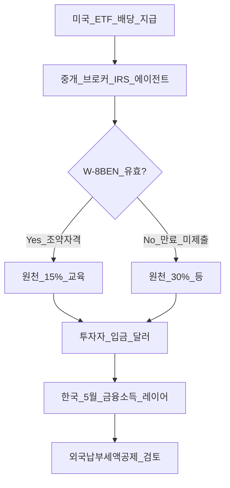
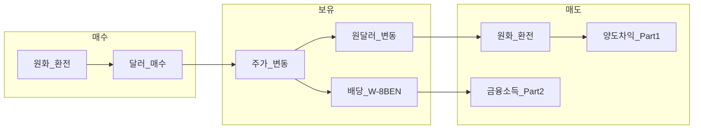
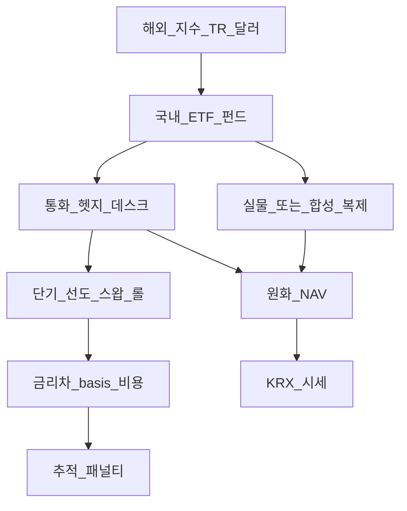
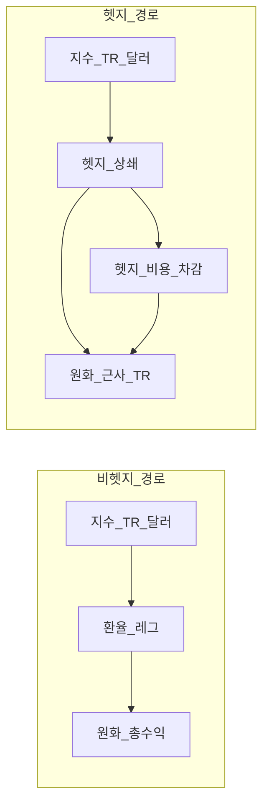
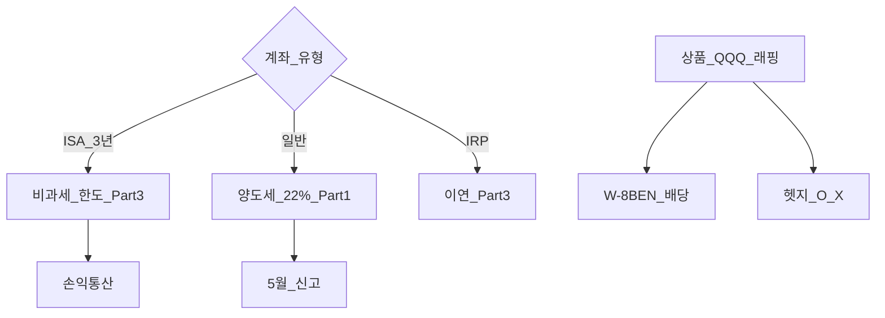

# 해외투자 세금·환헷지 심화 — W-8BEN·FX ETF·수익 경로 분해

> **면책**: 본 문서는 교육 목적이며, 특정 개인·법인에 대한 투자·세무·법률 자문이 아닙니다. 제도·세율·상품 조건·조세조약 해석은 변경될 수 있으므로 실행 전 국세청·증권사·금융투자상품설명서·간이투자설명서·IRS 공식 안내 등 공식 출처를 확인하세요.

## 메타

| 항목 | 내용 |
|------|------|
| 최종 검증일 | 2026-05-25 |
| 정책·법령 기준일 | 2025-12-31 확정, 2026 세제·ISA 개편 별도 표기 |
| 난이도 | L4 (Graduate) — [READER-GUIDE](../docs/READER-GUIDE.md) |
| 예상 읽기 시간 | 120~150분 |
| 관련 bucket | Bucket 2b~4 (해외 코어·ISA·세금·환 노출) |
| 시리즈 위치 | [해외주식 입문](overseas-equities-intro.md) → **본 문서(L4)** → [ETF 심화](etf-index-funds-deep.md) |

## 0. 이 편 읽기 전 (5분)

| 항목 | 내용 |
|------|------|
| **난이도** | L4 (Graduate) — [READER-GUIDE §L등급](../docs/READER-GUIDE.md) |
| **선수** | [해외 주식·ETF 입문](overseas-equities-intro.md), [ETF·인덱스 펀드 입문](etf-index-funds.md) |
| **이번 편에서 쓰는 기호** | L_ISA, ISA, IRP, DB, DC (해당 시) |
| **복습 한 줄** | L3 선수 편을 먼저 읽으면 수식이 수월함 |

## TL;DR

1. **W-8BEN**은 미국 원천징수 **조약세율(자격 시 15%)** 적용을 위한 **거주자 증명** 서식이다 — 미제출·만료 시 **30%** 등 더 높은 원천이 붙을 수 있어 **배당 실효수익**이 달라진다. 한국 **5월 신고·외국납부세액공제**와는 **별 레이어**다 — [Part2](../06-korea-policy/tax/overseas-stocks-tax-part2-dividend.md).
2. **해외 직접 보유**의 원화 수익은 **주가 수익 × 환율 수익**이 곱으로 결합된다. **국내 상장 환헷지 ETF**는 운용사가 **선물·스왑·통화선도** 등으로 달러 노출을 상쇄하려 하며, **헷지 비용(금리차·basis·롤)** 이 매년 **추적 패널티**가 될 수 있다 — [etf-index-funds-deep](etf-index-funds-deep.md) 부록 F.
3. **헷지 O vs X** 선택은 “환율 예측”이 아니라 **포트폴리오의 환 노출 정책**이다. 장기에 원화 **약세** 구간에서는 비헷지가, **강세**·달러 자산 **하락** 구간에서는 헷지가 상대 우위를 보일 **수** 있으나 **확정 불가** — [macro-05](../02-economics/macro-05-open-economy-fx.md).
4. **양도소득세·환율**은 매수·매도 **각 시점 실지거래가액**으로 원화 환산한다 — 헷지 ETF라도 **국내 상장 ETF 매매차익** 규칙이 적용되며, 해외 직접 QQQ와 **신고 레이어가 다를 수** 있다 — [Part1](../06-korea-policy/tax/overseas-stocks-tax-part1-cgt.md), [Part3](../06-korea-policy/tax/overseas-stocks-tax-part3-scenarios.md).
5. **ISA**는 3년·한도 조건 하 **비과세·9.9% 분리** 등으로 **세금 레이어를 재배치**한다 — W-8BEN·환헷지 선택과 **독립적으로** 설계해야 한다 — [isa](../06-korea-policy/isa.md).
6. 코어 설계 순서 권장: **① 계좌(ISA→IRP→일반)** → **② 환 노출(헷지 O/X·직접 vs 래핑)** → **③ 상품(TER·복제·추적)** → **④ W-8BEN·배당·5월 캘린더**.

---

## 1. 한 줄 정의 + 왜 중요한가

!!! info "ETF"
    지수·자산 **바구니**를 한 종목처럼 거래

**정의**: **해외투자 세금·환헷지 심화**란 한국 거주 투자자가 **미국 등 해외 자산**을 보유할 때 겹치는 **(A) 미국 원천징수·W-8BEN**, **(B) 한국 양도·배당·금융소득 과세**, **(C) 환율·환헷지 ETF 운용 메커니즘**을 **한 축**으로 연결하여 “표면 수익률”과 “원화·세후 체감 수익률” 사이 간극을 설명하는 L4 학습 과제다.

**왜 중요한가**: “QQQ 샀다” 한 줄 뒤에 **W-8BEN 미제출 30% 원천**, **원화 강세로 달러 수익 상쇄**, **환헷지 ETF의 금리차 비용**, **ISA 3년 vs 일반 22% 양도세**가 동시에 작동한다. 이를 분리하지 않으면 **헷지 ETF가 ‘손해’**, **배당 ETF가 ‘이득’**처럼 **잘못된 역사 해석**을 하게 되고, 10~20년 **복리 설계**에서 **실행 레이어**가 자산 선택만큼 커진다. 특히 DB 가입자처럼 **회사 연금 밖**에서 코어를 짜는 경우, [overseas-equities-intro](overseas-equities-intro.md) 입문만으로는 **Part1~3 세금 시리즈**와 **환 노출**을 동시에 다루기 부족하다.

---

## 2. 선수 지식 / 이후 읽을 것

**선수**:
- [해외 주식·ETF 입문](overseas-equities-intro.md) — 경로·환율·개념
- [ETF·인덱스 펀드 입문](etf-index-funds.md) — TER·추적오차·환헷지 표기
- [해외주식 양도소득세 Part1](../06-korea-policy/tax/overseas-stocks-tax-part1-cgt.md) — 매매차익·250만 공제
- [해외주식 배당 Part2](../06-korea-policy/tax/overseas-stocks-tax-part2-dividend.md) — 금융소득·원천
- [개방경제·환율](../02-economics/macro-05-open-economy-fx.md) — 금리·환율 연결

**이후**:
- [해외주식 시나리오 Part3](../06-korea-policy/tax/overseas-stocks-tax-part3-scenarios.md) — ISA·손익통산·케이스
- [ETF·인덱스 펀드 심화](etf-index-funds-deep.md) — AP·합성·추적오차·FX 부록
- [ISA 완전 가이드](../06-korea-policy/isa.md) — 3년·한도·중개형
- [계좌·상품 과세 지도](../06-korea-policy/tax/account-product-tax-map.md)
- [지역 분산](../04-portfolio/geographic-diversification.md), [코어-위성](../04-portfolio/core-satellite-framework.md)

---

## 3. 직관·비유

**이중 관세 창구**: 미국 배당은 **미국 창구(W-8BEN·15%)**에서 먼저 깎이고, 한국은 **5월 종합 창구(금융소득·외국납부세액공제)**에서 다시 정리한다. 창구를 **하나로 합쳐 생각**하면 “이중 과세”처럼 보이지만, 조약·§57은 **완화 레이어**다 — [Part2](../06-korea-policy/tax/overseas-stocks-tax-part2-dividend.md).

**환헷지 = 매일 갱신하는 환전 보험**: 비헷지 ETF는 **달러 자산을 원화로 번역**해 보여 주고, 헷지 ETF는 운용사가 **선도·스왑**으로 “내일 환율 변동”을 상쇄하려 한다. 보험에는 **프리미엄(금리차·basis)** 이 있고, **완벽히 맞지 않는 날**(헷지 깨짐)도 있다 — [etf-index-funds-deep](etf-index-funds-deep.md).

**수익 경로 = 두 레일**: **주가 레일**(S&P·Nasdaq)과 **환율 레일**(원/달러)이 **평행**이면 원화 수익은 두 레일 **합**, **직교**이면 **곱**에 가깝다. 헷지는 환 레일을 **가로막**지만 **완전 차단은 아니다**.

**ISA = 세금 냄비**: W-8BEN·환헷지는 **재료 손질**(원천·환 노출), ISA는 **냄비 안에서 세금 우대** — [isa](../06-korea-policy/isa.md). 냄비 밖(일반)에서 같은 QQQ를 사면 **5월 양도세**가 붙는다 — [Part1](../06-korea-policy/tax/overseas-stocks-tax-part1-cgt.md).

**표면 수익 vs 체감 수익**: 브로커 앱의 **달러 수익률**과 **원화 수익률**은 다를 수 있다. 헷지 ETF는 **둘 다 원화에 가깝게** 보이지만 **헷지 비용** 때문에 지수 TR과 **괴리**가 남는다.

---

## 4. 정식 개념·용어

| 용어 | 한글 | English | 교육용 정의 |
|------|------|---------|-------------|
| W-8BEN | W-8BEN | Certificate of Foreign Status | 미국 **비거주자**가 조약 **원천징수 감면** 자격을 증명하는 **IRS 서식** |
| W-8BEN-E | W-8BEN-E | Entity version | **법인**용 — 개인은 W-8BEN |
| 원천징수 | 원천징수 | Withholding tax | 소득 **지급 시점** 선공제 — 배당·이자 |
| 조약세율 | 조약세율 | Treaty rate | 한·미 조세조약 등에 따른 **감면 세율**(교육: 배당 **15%** 자격 시) |
| Statutory rate | 법정세율 | Statutory rate | 조약 미적용 시 **30%** 등 (교육용) |
| 외국납부세액공제 | 외국납부세액공제 | Foreign tax credit | 국내 과세 시 **해외 이미 낸 세** 공제 — §57 |
| 실지거래가액 | 실지거래가액 | Actual transaction FX | 양도·취득 **각 시점** 환율 — Part1 |
| FX hedge | 환헷지 | Currency hedge | **기초통화**(USD) 노출 **상쇄** |
| Forward / NDF | 선도·비 deliverable 선도 | FX forward | 미래 환율 **고정** 계약 |
| Cross-currency basis | 교차통화 basis | CCY basis | 동일 금리라도 **통화 스왑**에서 생기는 **추가 스프레드** |
| Hedge roll | 헷지 롤 | Hedge roll | 만기 **선도 교체** — 롤 비용·basis 변화 |
| Hedged TR | 헷지 TR | Hedged total return | 지수 TR에서 **환 레그 제거** 시도한 수익 규격 |
| Unhedged | 비헷지 | Unhedged | **환율 변동** 그대로 노출 |
| Covered interest parity | covered interest parity | CIP | 금리차·선물 **이론적 관계** — 위반 시 basis |
| Withholding overlay | 원천 레이어 | WHT overlay | 배당 TR 지수 vs **실제 거주자** 원천 차 |
| KRW wrapper ETF | 국내 래핑 ETF | Listed wrapper | KRX 상장 **해외 지수** 추종 |
| Direct offshore | 해외 직접 | Direct | 미국 등 **현지 상장** 매매 |
| Form 1042-S | 1042-S | 1042-S | 미국 **비거주자** 원천 보고(연말) — 증권사 제공 |
| FATCA | FATCA | FATCA | 미국 **해외금융계좌** 보고 — W-9 vs W-8 구분 |
| TER | 총보수 | Total expense ratio | 운용보수+기타 — **헷지 비용** 별도 레그 가능 |
| Tracking difference | 추적 차이 | Tracking difference | 지수 대비 **누적 패널티** |
| ISA netting | 손익통산 | ISA netting | 계좌 내 **손익 합산** — Part3 |

### 4a. 핵심 용어 (본문 등장 순)

> 복습용. 정의는 §4 본표·[glossary](../00-roadmap/glossary.md)·본문 `!!! info` 박스.

| 용어 | 한 줄 | 관련 이론 | glossary |
|------|-------|-----------|----------|
| W-8BEN | W-8BEN | §4 | [glossary](../00-roadmap/glossary.md#w-8ben) |
| W-8BEN-E | W-8BEN-E | §4 | [glossary](../00-roadmap/glossary.md#w-8ben-e) |
| 원천징수 | 원천징수 | §4 | [glossary](../00-roadmap/glossary.md#원천징수) |
| 조약세율 | 조약세율 | §4 | [glossary](../00-roadmap/glossary.md#조약세율) |
| Statutory rate | 법정세율 | §4 | [glossary](../00-roadmap/glossary.md#statutory-rate) |
| 외국납부세액공제 | 외국납부세액공제 | §4 | [glossary](../00-roadmap/glossary.md#외국납부세액공제) |
| 실지거래가액 | 실지거래가액 | §4 | [glossary](../00-roadmap/glossary.md#실지거래가액) |
| FX hedge | 환헷지 | §4 | [glossary](../00-roadmap/glossary.md#fx-hedge) |
| Forward / NDF | 선도·비 deliverable 선도 | §4 | [glossary](../00-roadmap/glossary.md#forward-/-ndf) |
| Cross-currency basis | 교차통화 basis | §4 | [glossary](../00-roadmap/glossary.md#cross-currency-basis) |
| Hedge roll | 헷지 롤 | §4 | [glossary](../00-roadmap/glossary.md#hedge-roll) |
| Hedged TR | 헷지 TR | §4 | [glossary](../00-roadmap/glossary.md#hedged-tr) |
| Unhedged | 비헷지 | §4 | [glossary](../00-roadmap/glossary.md#unhedged) |
| Covered interest parity | covered interest parity | §4 | [glossary](../00-roadmap/glossary.md#covered-interest-parity) |
| Withholding overlay | 원천 레이어 | §4 | [glossary](../00-roadmap/glossary.md#withholding-overlay) |

---

## 5. 메커니즘

### 5.1 W-8BEN — 미국 원천징수 레이어

**교육 포인트**:
- W-8BEN은 **IRS Form W-8BEN** — “나는 미국 비거주자이며 조약 혜택을 청구한다”는 **선언**이다.
- **제출·갱신**은 **증권사·브로커** 절차 — 주소·거주국 변경 시 **재제출**.
- **유효기간**: 서명일로부터 **보통 3년**까지 유효(IRS 안내 기준, 상품·브로커 확인) — 만료 전 **갱신 알림** 확인.
- **양도소득**: 한국 거주 **개인**의 미국 주식 **매매차익**은 미국 **연방 양도세 면제**(조약·비거주 교육) — 한국 **Part1** 신고가 핵심. (법인·특수 케이스는 본 문서 범위 밖)
- W-8BEN은 **배당 원천**에 직접 영향 — QQQ처럼 **저배당** 코어는 Part1 중심, SCHD·개별 고배당은 Part2 **필수**.

### 5.2 해외 직접 보유 — 현금흐름·세금·환율

**교육 포인트**: 환율은 **취득·양도 각각** 다른 환율 — “평균 환율 하나”가 아니다 — [Part1](../06-korea-policy/tax/overseas-stocks-tax-part1-cgt.md). 배당은 **지급일·입금일** 환율과 **원천**이 Part2.

### 5.3 국내 상장 환헷지 ETF — 운용 메커니즘 (개념)

**운용 개요**(교육, 상품별 상이):
1. **기초 자산**: 미국 주식 바스켓(실물) 또는 TRS(합성) — [etf-index-funds-deep](etf-index-funds-deep.md).
2. **환헷지**: 펀드 NAV의 **달러 노출**을 **단기 FX 선도** 롤로 상쇄. 원화 **금리 > 달러 금리** 구간(교육)에서는 **헷지 비용**이 **양(+)의 carry**로 누적될 **수** 있다.
3. **일간/주간 롤**: 선도 만기 **교체** — **basis** 급변 시 **헷지 깨짐**(Hedge slippage).
4. **비헷지 ETF**: 2~3 단계에서 Hedge 분기 **생략** — NAV가 **주가×환율** 레그 반영.

### 5.4 헷지 vs 비헷지 — 수익 경로 분해

**교육 포인트**: 같은 “S&P500 TR” 라벨이라도 **헷지 O/X**는 **10년 차트 패턴**이 다르다 — TER 차(0.05%p)보다 **환·헷지 레그**가 지배하는 구간이 있다.

### 5.5 ISA·일반·W-8BEN 교차 (계좌 레이어)

[W-8BEN]은 **계좌와 무관**하게 미국 **배당 원천**에 걸린다(교육). ISA는 **한국 측** 양도·배당 **우대** — [isa](../06-korea-policy/isa.md), [Part3](../06-korea-policy/tax/overseas-stocks-tax-part3-scenarios.md).

---

## 6. 수식·모델

### 6.1 비헷지 — 원화 총수익 (교육 근사)

| 기호 | 이름 | 이 식에서 의미 |
|------|------|----------------|
| \(R_\) | R_ | §4·본문 정의 참고 |
| \(KRW, unhedged\) | KRW, unhedged | §4·본문 정의 참고 |
| \(USD asset\) | USD asset | §4·본문 정의 참고 |
| \(FX\) | FX | §4·본문 정의 참고 |

\[
R_{\text{KRW, unhedged}} \approx (1 + R_{\text{USD asset}})(1 + R_{\text{FX}}) - 1
\]

- \(R_{\text{USD asset}}\): 달러 표시 **주가·배당 포함** 수익(단순화)
- \(R_{\text{FX}}\): 원/달러 **상승 = 원화 약세**일 때 양(+) — 달러 자산의 **원화 가치** 상승 요인

**분해**(1차 근사):

\[
R_{\text{KRW}} \approx R_{\text{USD asset}} + R_{\text{FX}} + R_{\text{USD asset}} \cdot R_{\text{FX}}
\]

교차항 \(R_{\text{USD asset}} \cdot R_{\text{FX}}\)는 **동시 변동**이 클 때 무시하기 어렵다 — 2022~2023 교육 사례에서 **주가↓·달러↑**가 **상쇄**된 패턴 학습.

### 6.2 헷지 ETF — 교육용 분해

\[
R_{\text{KRW, hedged}} \approx R_{\text{USD asset}} - c_{\text{hedge}} - f_{\text{TER}} - \delta_{\text{repl}}
\]

- \(c_{\text{hedge}}\): **금리차·basis·롤** — 원화 금리 > 달러 금리면 **양(+) 비용** 경향(교육, 시점 의존)
- \(f_{\text{TER}}\): 총보수 — 헷지 ETF가 **비헷지보다 TER 높은** 경우 多
- \(\delta_{\text{repl}}\): 복제·샘플링·원천 — [etf-index-funds-deep](etf-index-funds-deep.md)

**헷지 ≠ 0% 환 노출**: **잔여 노출**(헷지 ratio <100%, 재balancing lag, dividend FX) 존재.

### 6.3 W-8BEN — 배당 세후 (교육, 단순)

\[
D_{\text{net, US}} = D_{\text{gross}} \times (1 - \tau_{\text{WHT}})
\]

- \(\tau_{\text{WHT}} = 15\%\) (W-8BEN·조약 자격, 교육) vs \(30\%\) (미적용)

**한국 레이어**(별도):

\[
\text{추가 국내 부담} = f(\text{금융소득 합계}, \text{ISA 여부}, \text{§57 FTC})
\]

— [Part2](../06-korea-policy/tax/overseas-stocks-tax-part2-dividend.md).

### 6.4 양도차익 — 환율 (Part1 연결)

\[
\text{차익}_{\text{원화}} = P_{\text{sell,KRW}} - P_{\text{buy,KRW}} - \text{비용}
\]

\[
P_{\text{buy,KRW}} = \text{USD amount} \times e_{\text{buy}}, \quad P_{\text{sell,KRW}} = \text{USD amount} \times e_{\text{sell}}
\]

**교육**: \(e_{\text{sell}} > e_{\text{buy}}\) (원화 약세)이면 **주가 변동 0**이어도 **원화 차익** 가능 — [Part1](../06-korea-policy/tax/overseas-stocks-tax-part1-cgt.md).

---

## 7. 한국 적용

### 7.1 2025년 기준 — 확정·교육 맥락

| 영역 | 요약 | 상세 문서 |
|------|------|-----------|
| **해외주 양도** | 연 250만 공제 후 **22%** 분리, **5월** 신고 | [Part1](../06-korea-policy/tax/overseas-stocks-tax-part1-cgt.md) |
| **배당·이자** | 금융소득 **2,000만** 경계, 원천·종합 | [Part2](../06-korea-policy/tax/overseas-stocks-tax-part2-dividend.md) |
| **W-8BEN** | 미국 배당 **15%** vs **30%** | Part2 §7.7, 본 문서 §5.1 |
| **외국납부세액공제** | §57 — **이중 완화** | Part2 |
| **ISA** | 3년·비과세 한도·9.9% | [isa](../06-korea-policy/isa.md), [Part3](../06-korea-policy/tax/overseas-stocks-tax-part3-scenarios.md) |
| **국내 래핑 ETF** | **국내 상장** — 양도 규칙 **Part1과 다를 수** 있음(국내주 비과세 vs ETF) — **국세청·상품 확인** | [domestic-stocks-tax](../06-korea-policy/tax/domestic-stocks-tax.md) |
| **환헷지 ETF** | 간이설명 **헷지 O/X**, 추적차이 표 | [etf-index-funds-deep](etf-index-funds-deep.md) |

### 7.2 경로별 체크리스트 (교육)

| 경로 | W-8BEN | 환 노출 | 한국 양도 | 한국 배당 |
|------|--------|---------|-----------|-----------|
| 미국 QQQ **일반** | 필요 | **Full FX** | Part1 신고 | Part2 |
| 미국 QQQ **ISA** | 필요 | Full FX | Part3 우대 | Part3 |
| KRX S&P **비헷지** | 해당 없음(국내) | **Full FX** | 국내 ETF 규칙 | 국내 분배 |
| KRX S&P **환헷지** | 해당 없음 | **Reduced** | 동일 | 동일 |

### 7.3 2026년 — 확인 필요 (교육 프레임)

| 항목 | 2025 | 2026 (개편 시) |
|------|------|----------------|
| ISA 비과세·납입 | 200만/400만, 2,000만, 1억 | **500만/1,000만, 4,000만, 2억** 등 — [isa](../06-korea-policy/isa.md) |
| 해외주 양도 | 현행 | 국세청 **연간** 확인 |
| W-8BEN | IRS 양식 | **갱신 주기** 동일 원칙 |
| 환헷지 ETF | 시장 상품 | TER·추적차이 **공시** 재확인 |

### 7.4 연간 실무 캘린더 (해외 코어)

| 시기 | 할 일 |
|------|--------|
| **개설·매수 전** | ISA vs 일반, 헷지 O/X, W-8BEN 제출 |
| **연중** | 매매·배당·환율 **원화 환산** 저장 |
| **W-8BEN 만료 전** | 갱신 — 증권사 알림 |
| **1~4월** | 전년 **양도·금융소득** 집계 |
| **5월** | 종합소득세 — Part1·2·3 |
| **ISA 만기** | 3년+ — [isa](../06-korea-policy/isa.md) |

---

## 8. 숫자 예제 (가상)

> 모든 인물·금액·환율·수익률은 **가상 교육**입니다. 실제 투자·신고는 공식 자료·전문가 확인.

### 예제 1 — W-8BEN 15% vs 30% (가상)

| 항목 | W-8BEN 적용 (가상) | 미적용 (가상) |
|------|-------------------|-------------------|
| 미국 ETF 배당 (총) | 100만 원 상당 | 100만 원 |
| 미국 원천 | **15%** → 15만 | **30%** → 30만 |
| **입금** | **85만** | **70만** |
| 차이 | — | **연 15만** 패널티 |

**해석**: 고배당(SCHD 등) 장기 보유 시 **W-8BEN 누락**은 TER보다 큰 **누수** — [Part2](../06-korea-policy/tax/overseas-stocks-tax-part2-dividend.md).

### 예제 2 — 비헷지 vs 헷지 (가상 1년)

| | 지수(달러) | 원/달러 | 비헷지(원화) | 헷지(원화, 가상) |
|---|-----------|---------|-------------|-----------------|
| 시나리오 A | +10% | +5% (원화 약세) | **≈ +15.5%** (곱) | **≈ +10% − 헷지비 2% = +8%** |
| 시나리오 B | +10% | −5% (원화 강세) | **≈ +4.5%** | **≈ +10% − 2% = +8%** |
| 시나리오 C | −10% | +5% | **≈ −5.5%** | **≈ −10% − 2% = −12%** |

**해석**: **원화 약세+주가↑** → 비헷지 우위; **원화 강세+주가↑** → 헷지 우위 — **사후** 패턴이며 **선택 불가**.

### 예제 3 — ISA vs 일반 양도 (가상, Part1·3 연결)

| | 일반 QQQ (가상) | ISA QQQ (3년, 가상) |
|---|----------------|---------------------|
| 취득(원화) | 5,000만 | 5,000만 |
| 매도(원화) | 6,500만 | 6,500만 |
| 차익 | 1,500만 | 1,500만 |
| **한국 양도세(교육)** | 250만 공제 후 **22%** 등 | **비과세 한도** 내 **0** (조건 충족 시) |

— [Part1](../06-korea-policy/tax/overseas-stocks-tax-part1-cgt.md), [Part3](../06-korea-policy/tax/overseas-stocks-tax-part3-scenarios.md), [isa](../06-korea-policy/isa.md).

### 예제 4 — 환율만으로 양도차익 (가상)

| | 달러 |
|---|------|
| 매수 | 10,000 USD @ 1,200 = **1,200만 원** |
| 매도 | 10,000 USD @ 1,350 = **1,350만 원** |
| 주가 변동 | **0%** |
| **원화 차익** | **150만 원** — Part1 신고 대상(교육) |

### 예제 5 — 헷지 ETF 추적 패널티 (가상)

| | 비헷지 ETF | 환헷지 ETF |
|---|-----------|-----------|
| TER | 0.05% | 0.10% |
| 지수 TR (달러) | +12% | +12% |
| 환 레그 | +8% | (상쇄) |
| 헷지 비용 | — | **−2.5%** (가상) |
| **원화 체감(교육)** | **≈ +20%** 근사 | **≈ +9.5%** |

**해석**: “헷지가 손해”가 **구조적**인지 **그 해** 환율 **레짐** 때문인지 분리 — [etf-index-funds-deep](etf-index-funds-deep.md).

### 예제 6 — 외국납부세액공제 (가상, Part2)

| | 금액 |
|---|------|
| 해외 배당 (원화) | 800만 |
| 미국 원천 15% | 120만 |
| 국내 추가 부담(가상) | §57 **외국납부세액공제**로 **이중 완화** — 실무 신고 확인 |

**해석**: W-8BEN으로 **미국에서 깎인 15%**가 한국 **5월**에서 **공제·경감** 레이어와 연결 — [Part2](../06-korea-policy/tax/overseas-stocks-tax-part2-dividend.md).

### 예제 7 — 이중 보유 (가상, 설계 실수)

| 보유 | 가상 비중 | 문제 |
|------|-----------|------|
| 미국 QQQ (일반) | 40% | 양도세·W-8BEN |
| KRX S&P **비헷지** | 40% | **동일 팩터**·환 레그 **중복** |
| KRX S&P **환헷지** | 20% | 헷지·비헷지 **상쇄 아님** — **복잡도만 증가** |

**해석**: [core-satellite](../04-portfolio/core-satellite-framework.md) — **broad 코어 하나** + 계좌·환 정책 명시.

---

## 9. FAQ

**Q1. W-8BEN을 안 내면 양도세도 30%인가요?**  
**A1.** 아니다. **배당 원천**이 주로 영향 — 양도는 [Part1](../06-korea-policy/tax/overseas-stocks-tax-part1-cgt.md) **한국 22%** 레이어. 다만 고배당·금융소득 합산 시 **체감 세부담**이 커진다.

**Q2. 환헷지 ETF를 사면 환율 리스크가 0%인가요?**  
**A2.** 아니다. **헷지 비율 100% 미만**, **롤 지연**, **배당·현금 FX**, **극단 변동**에서 **잔여 노출**·**추적 괴리** 가능 — [etf-index-funds-deep](etf-index-funds-deep.md).

**Q3. 원화가 약해질 것 같으면 비헷지가 항상 맞나요?**  
**A3.** **아니다** — 환율 **예측은 타이밍**. L4 프레임은 **정책(노출 한도)** 으로 정하고 DCA로 **평균** — [rebalancing-and-dca](../04-portfolio/rebalancing-and-dca.md).

**Q4. ISA에 QQQ를 넣으면 W-8BEN이 필요 없나요?**  
**A4.** **필요하다**(미국 상장 배당 시). ISA는 **한국 세제** — 미국 **원천**은 별도 — [isa](../06-korea-policy/isa.md), [Part3](../06-korea-policy/tax/overseas-stocks-tax-part3-scenarios.md).

**Q5. 국내 래핑 ETF는 해외주식 양도세 Part1 대상인가요?**  
**A5.** **국내 상장 ETF**는 **국내주·ETF 과세 규칙** — Part1은 **해외 직접** 중심. 혼동 금지 — [domestic-stocks-tax](../06-korea-policy/tax/domestic-stocks-tax.md), 국세청 확인.

**Q6. 헷지 ETF TER가 더 높은데도 코어로 쓰나요?**  
**A6.** **환 노출 제거**가 목표면 **합리적 후보** — 다만 **금리차 레짐**에서 장기 **추적차이** 확인. TER만 비교하면 **오판**.

**Q7. 미국 브로커 vs 국내 해외주문 — W-8BEN·세금이 다른가요?**  
**A7.** **원천·양도·신고 원칙**은 유사 — **환전 스프레드·1042-S·원화 내역** 편의 차. [overseas-equities-intro](overseas-equities-intro.md) 표 참고.

**Q8. 배당 TR 지수 ETF와 실제 체감이 다른 이유는?**  
**A8.** 지수는 **이론 재투자** — 실제는 **W-8BEN·한국 금융소득·헷지 비용** 레이어 — 본 문서 §6·[Part2](../06-korea-policy/tax/overseas-stocks-tax-part2-dividend.md).

**Q9. IRP·DC에 해외 ETF — W-8BEN·환헷지는?**  
**A9.** 상품 **제한** 多 — 배당 **이연**이나 **선환급 폐지** 등 **현금흐름** 변화 — [Part3](../06-korea-policy/tax/overseas-stocks-tax-part3-scenarios.md), [dc-pension](../06-korea-policy/dc-pension.md).

**Q10. 5월에 환차익만 신고하면 되나요?**  
**A10.** **양도차익 전체**(주가+환) — 환만 분리 과세 **아님** — [Part1](../06-korea-policy/tax/overseas-stocks-tax-part1-cgt.md) **실지거래가액**.

---

## 10. 함정·리스크·한계

- **W-8BEN 만료** 방치 — **30% 원천** 누적  
- **헷지 = 환 예측 성공** 착각 — **비용 레그** 무시  
- **헷지·비헷지·직접 QQQ 동시 보유** — 팩터·세금 **삼중 복잡도**  
- **달러 수익률만** 보고 **원화·세후** 설계 누락  
- **ISA 3년 미만** 해지 — 우대 **소멸** — [isa](../06-korea-policy/isa.md)  
- **국내 ETF = 국내주 비과세**로 **일반화** — ETF는 **별도 확인**  
- **조세조약·IRS 양식** 개정 — 본 문서 **기준일** 이후 재검증  
- **합성 래핑 ETF** — TRS·담보 리스크 — [etf-index-funds-deep](etf-index-funds-deep.md)  
- 본 문서는 **투자·세무 자문 아님**

---

## 11. 심화 읽기

- IRS — [Form W-8BEN Instructions](https://www.irs.gov/forms-pubs/about-form-w-8-ben)  
- 국세청 — 해외주식·금융소득 **연간 안내**  
- 한·미 조세조약 — 배당·이자 **원천** (법령 해석은 전문가)  
- BIS·IMF working papers — **covered interest parity**, **FX hedge costs**  
- [macro-05-open-economy-fx](../02-economics/macro-05-open-economy-fx.md) — 환헷지 거시 질문  
- [investment-tax-overview](../06-korea-policy/tax/investment-tax-overview.md) — 전체 세금 지도  
- [DEPTH-STANDARD](../docs/DEPTH-STANDARD.md) — L4 품질 게이트

---

## 12. 스스로 점검 퀴즈

1. W-8BEN이 **직접** 바꾸는 것·**바꾸지 않는** 것 각 1개는?  
2. 비헷지 원화 수익 **곱셈 근사** 식 1줄?  
3. 환헷지 ETF **헷지 비용** 원천 2가지?  
4. ISA와 W-8BEN **레이어** 차이 1줄?  
5. **실지거래가액**이 양도세에 주는 교육적 의미?  
6. Part1·Part2·Part3 **각각** 담당 소득 유형?  
7. 헷지 O 선택이 **항상** 유리한 **한** 반례 시나리오?  
8. 이중 보유(직접+래핑) **함정** 1줄?

??? note "정답 힌트"

    1. 배당 원천(직접) / 한국 양도세율(비직접)  
    2. \((1+R_{\text{asset}})(1+R_{\text{FX}})-1\)  
    3. 금리차 carry, basis·롤  
    4. W-8BEN=미국 원천, ISA=한국 계좌 우대  
    5. 매수·매도 **각각** 환율 — 환만이 아님  
    6. Part1 양도, Part2 배당·금융, Part3 ISA·시나리오  
    7. 원화 약세+주가↑ 구간(사후) 비헷지 상대 우위 가능  
    8. 동일 팩터·세금·환 **중복**

---

## 부록 A — W-8BEN 제출 체크리스트 (교육)

| 순서 | 확인 |
|------|------|
| 1 | 증권사 **해외주식·미국 ETF** 계좌 개설 시 **W-8BEN** 제출 |
| 2 | **영문 주소·거주국** 정확 — FATCA·원천 오류 방지 |
| 3 | **만료 3년** 전 갱신 알림 |
| 4 | **1042-S**·원천징수 영수증 **연말** 보관 — 5월·§57 |
| 5 | **법인·신탁**은 W-8BEN-E 등 **별도** 양식 |

---

## 부록 B — 환헷지 운용 상세 (교육)

**선도 롤**: 운용사는 보통 **1개월~3개월** 단기 선도를 **연속 롤**한다. 만기 교체 시 **이론 환율(CIP)** 과 **시장 선도** 차이가 **basis**다. **원화 금리 > 달러 금리**인 장기 구간(교육)에서는 **헷지 비용이 양(+)으로 누적**되는 패턴이 **자주** 논의된다 — “헷지가 **항상** 싸다”가 아니다.

**헷지 비율**: 100% 미만이면 **잔여 FX 베타**가 NAV에 남는다. **리밸런싱 지연**(지수 리밸런싱 vs 헷지 조정 시차)도 **미세 추적오차** 원천.

**배당 FX**: 배당이 **달러 현금**으로 들어온 뒤 **헷지 재조정** 전까지 **단기 FX 노출** — [etf-index-funds-deep](etf-index-funds-deep.md) 부록 F.

---

## 부록 C — 헷지 vs 비헷지 장기 비교 프레임 (교육)

| 관점 | 비헷지 | 환헷지 |
|------|--------|--------|
| **목표** | 달러 자산 + **환 레그** | **주가 레그** 근사 |
| **유리할 수 있는 환경**(사후) | 원화 **약세**·달러 자산 ↑ | 원화 **강세**·달러 자산 ↑ |
| **비용** | TER 낮은 편 多 | TER + **헷지 carry** |
| **적합 교육 프로필** | 장기 **달러 노출** 수용 | **원화 생활비**·환 **축소** 의지 |
| **세금** | 국내 ETF 규칙 | 동일 — **환 선택 ≠ 세금 면제** |

10년 차트 **한 장**만으로 선택하지 말고 **정책 문장**을 먼저 쓴다: “나의 코어는 **환 노출 ○%**까지 허용한다.”

---

## 부록 D — Part1~3·ISA·본 문서 매핑

| 문서 | 역할 | 본 문서 연결 |
|------|------|-------------|
| [Part1](../06-korea-policy/tax/overseas-stocks-tax-part1-cgt.md) | 해외 **양도**·250만·5월 | §5.2, §6.4, 예제 3·4 |
| [Part2](../06-korea-policy/tax/overseas-stocks-tax-part2-dividend.md) | **배당**·금융소득·W-8BEN | §5.1, 예제 1·6 |
| [Part3](../06-korea-policy/tax/overseas-stocks-tax-part3-scenarios.md) | ISA·손익통산·케이스 | §5.5, 예제 3 |
| [isa](../06-korea-policy/isa.md) | 3년·한도·중개형 | TL;DR, §7, FAQ Q4 |
| [etf-index-funds-deep](etf-index-funds-deep.md) | AP·합성·FX 추적 | §5.3, 부록 B |
| [overseas-equities-intro](overseas-equities-intro.md) | 입문 경로 | 선수 |

---

## 부록 E — 가상 시나리오: 2022형 (교육)

가상: 달러 표시 나스닥 **−25%**, 원/달러 **+12%**(원화 약세).  
- **비헷지 래핑**: 원화 수익 **≈ −25% + 12% + 교차항** → **약 −16%** 근사(가상).  
- **환헷지 래핑**: **≈ −25% − 헷지비** → **약 −27%** 근사(가상).  
**교훈**: **주가 하락 국면**에서 헷지는 **환 완충 없음** — “헷지=방어” **아님**.

---

## 부록 F — 가상 시나리오: 달러 자산↑·원화 강세 (교육)

가상: 지수 **+15%**, 원/달러 **−8%**(원화 강세).  
- **비헷지**: **≈ +15% − 8%** 근사 → **+6%**대(가상).  
- **환헷지**: **≈ +15% − 2%** → **+13%**대(가상).  
**교훈**: **해외 주식 강세 + 원화 강세**에서 헷지 **상대 우위** 가능 — **역사 한 조각**일 뿐.

---

## 부록 G — 코어 설계 워크시트 (교육, 가상)

| 단계 | 질문 | 기록 예시(가상) |
|------|------|----------------|
| 1 | 코어 **계좌**? | ISA 70% + 일반 30% |
| 2 | **직접 vs 래핑**? | ISA=QQQ, 일반=헷지 래핑 |
| 3 | **헷지 O/X**? | 일반 슬롯 **환헷지** |
| 4 | W-8BEN **유효**? | 제출·만료 2027 |
| 5 | **5월** 담당자? | 본인·증권사 PDF |
| 6 | **중복 broad**? | QQQ+비헷지 S&P **통합** |

---

## 부록 H — 1042-S·금융소득 연결 (교육)

미국 **1042-S**는 **비거주자 원천** 보고서다. 한국 **5월**에서 **해외 배당**·**원천세액**을 **금융소득 합계**·**외국납부세액공제**와 맞출 때 **증권사 통합 PDF**와 **교차 검증**한다 — [Part2](../06-korea-policy/tax/overseas-stocks-tax-part2-dividend.md). **2,000만 원** 경계는 **국내 이자·배당 포함** 합산 — QQQ만으로는 **낮아도** SCHD·예금 이자와 **합쳐지면** 초과.

---

## 부록 I — 환헷지와 금리·QE 맥락 (교육)

[BOK 인하·Fed 정책](../02-economics/macro-04-monetary-policy-qe.md)이 **한·미 금리차**를 바꾸면 **헷지 carry**도 바뀐다. **QE 종료·긴축** 구간에서는 basis **급변** → 헷지 ETF **추적차이 확대** 사례가 **교육**에서 자주 인용된다 — **거시 문서와 분기 갱신**.

---

## 부록 J — 실행·미시구조 (교육)

환헷지·비헷지 **쌍**을 같은 날 **시장가**로 사면 **스프레드·프리미엄**이 **실행 패널티** — [market-microstructure](market-microstructure.md). **장 시작 직후** 해외 IOPV 미반영 구간 **괴리** — [etf-index-funds-deep](etf-index-funds-deep.md) 부록 M.

---

## 부록 K — 용어 색인

W-8BEN, W-8BEN-E, 1042-S, FATCA, treaty rate, statutory withholding, foreign tax credit, FX hedge, forward roll, basis, CIP, hedged TR, wrapper ETF, direct offshore, tracking difference, ISA netting, Part1 CGT, Part2 dividend, Part3 scenarios.

---

## 부록 L — 교육용 한 줄 복문

해외 코어는 **세 레이어**(미국 원천·한국 과세·환 노출)와 **두 경로**(직접·래핑)가 **곱**으로 맞물린다. W-8BEN·ISA·헷지 O/X를 **한 번에** 정하지 않으면 **표면 수익률**과 **원화 세후** 사이에서 10년 **복리**가 갈라진다.

---

## 부록 M — 문서 종료·검증

**L4 해외투자 세금·환헷지 심화** 12블록 완료. [Part1](../06-korea-policy/tax/overseas-stocks-tax-part1-cgt.md)~[Part3](../06-korea-policy/tax/overseas-stocks-tax-part3-scenarios.md), [etf-index-funds-deep](etf-index-funds-deep.md), [isa](../06-korea-policy/isa.md)와 **교차 링크**. 메타 검증일 **2026-05-25**. UTF-8 코드포인트: `python3 -c "print(len(open('overseas-tax-fx-hedging.md',encoding='utf-8').read()))"`.
