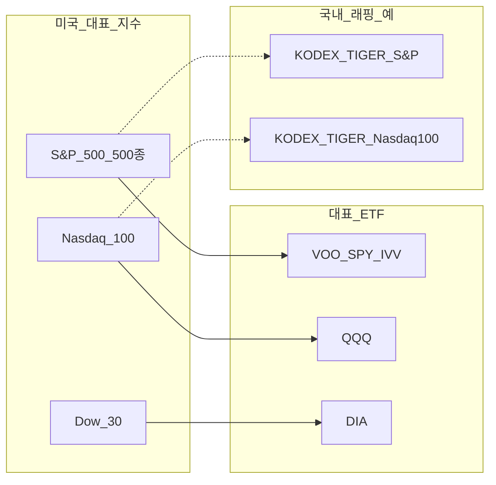
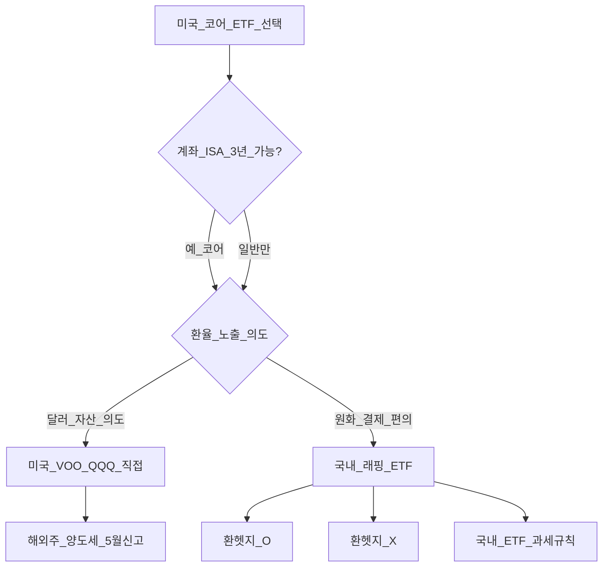

# 미국 주요 지수·ETF — S&P500·나스닥100·다우, SPY/VOO/QQQ, Mag7·래핑·코어 중복

> **면책**: 본 문서는 교육 목적이며, 특정 개인·법인에 대한 투자·세무·법률 자문이 아닙니다. 모든 인물·금액·수익률은 **가상 예시**입니다. 지수 구성·ETF 보수·세제·상품 조건은 변경될 수 있으므로 실행 전 공식 출처·간이투자설명서를 확인하세요.

## 메타

| 항목 | 내용 |
|------|------|
| 최종 검증일 | 2026-05-25 |
| 정책·법령 기준일 | 2025-12-31 확정, 2026 ISA·세제 별도 표기 |
| 난이도 | L3 (Deep) — [READER-GUIDE](../docs/READER-GUIDE.md) |
| 예상 읽기 시간 | 60~75분 |
| 관련 bucket | Bucket 3 (미국 코어 지수 ETF), Bucket 4 (Mag7·섹터 위성) |

## 0. 이 편 읽기 전 (5분)

| 항목 | 내용 |
|------|------|
| **난이도** | L3 (Deep) — [READER-GUIDE §L등급](../docs/READER-GUIDE.md) |
| **선수** | [etf-index-funds](etf-index-funds.md), [stocks-equities-intro](stocks-equities-intro.md) |
| **이번 편에서 쓰는 기호** | 본문 §4·§4a 표 참고 |
| **복습 한 줄** | — |

## TL;DR

1. **S&P 500**(대형 500)·**나스닥 100**(비금융 대형 100)·**다우 30**(가격가중 30)은 **같은 “미국 주식”이 아니다** — 섹터·종목 수·가중 방식이 다르다.
2. **SPY·VOO·IVV**는 모두 S&P 500 추종이나 **보수·구조·분배**가 다르다. 코어는 **하나만** 고르는 편이 [core-satellite-framework.md](../04-portfolio/core-satellite-framework.md)와 맞다.
3. **QQQ**(나스닥100)는 **성장·테크·Mag7** 비중이 크다. “미국 분산”이라고 해도 **팩터 집중**이 따른다.
4. **국내 래핑**(TIGER·KODEX 등)은 **환헷지 O/X** 선택이 수익 경로를 바꾼다. 미국 **직접**(VOO·QQQ)과 **래핑**은 세금·환율·거래 시간이 다르다 — [overseas-equities-intro.md](overseas-equities-intro.md).
5. **코어 중복 경고**: S&P 래핑 + QQQ + Mag7 개별주를 동시에 쌓으면 **같은 종목·같은 팩터**에 여러 번 베팅한 것과 비슷하다.
6. **DB 재직자**는 퇴직연금에서 ETF 선택이 제한되는 경우가 많아, **ISA**에 미국 코어를 두는 **가상 경로**가 흔하다 — [isa.md](../06-korea-policy/isa.md).

## 1. 한 줄 정의 + 왜 중요한가

!!! info "ETF"
    지수·자산 **바구니**를 한 종목처럼 거래

**정의**: **미국 주요 지수·ETF**란 S&P 500, 나스닥 100, 다우존스 산업평균 등 **미국 대표 벤치마크**와, 이를 **1:1 또는 근사** 추종하는 상장 ETF(SPY·VOO·IVV·QQQ·DIA 등) 및 국내 상장 **래핑 ETF**(TIGER·KODEX 계열)를 통칭한다.

**왜 중요한가**: 한국 개인 투자자의 장기 코어는 종종 “**미국 지수 ETF 하나**”로 시작한다. 그러나 채팅·커뮤니티에서 **S&P·나스닥·Mag7**이 뒤섞이면, 실제로는 **Apple·Microsoft·NVIDIA**에 **3~4중 노출**인데 “분산했다”고 착각하기 쉽다. 지수 **정의 차이**, ETF **보수·복제**, **환헷지**, **계좌(ISA)** 까지 한 번에 정리해야 [etf-index-funds.md](etf-index-funds.md)와 [overseas-equities-intro.md](overseas-equities-intro.md)가 **실행**으로 이어진다.

## 2. 선수 지식 / 이후 읽을 것

**선수**:
- [etf-index-funds.md](etf-index-funds.md) — TER·추적오차·괴리율
- [stocks-equities-intro.md](stocks-equities-intro.md) — 주식·시가총액 기본
- [macro-06-asset-prices-macro.md](../02-economics/macro-06-asset-prices-macro.md) — 금리·달러와 주가

**이후**:
- [overseas-equities-intro.md](overseas-equities-intro.md) — 해외 직접 vs 래핑·세금
- [core-satellite-framework.md](../04-portfolio/core-satellite-framework.md) — 코어 하나·위성 제한
- [geographic-diversification.md](../04-portfolio/geographic-diversification.md) — 미국 코어만으로는 지역 분산 부족
- [leveraged-etf-qqq-qld.md](../04-portfolio/leveraged-etf-qqq-qld.md) — QQQ vs QLD
- [isa.md](../06-korea-policy/isa.md) — 3년·비과세 코어 슬롯

## 3. 직관·비유

**3개의 미국 지도**: S&P 500은 **전국 인구·산업 전체를 반영한 대형 도시 지도**, 나스닥 100은 **실리콘밸리·클라우드·반도체 허브가 크게 그려진 지도**, 다우 30은 **역사적 명문 30개 건물만 찍은 엽서**에 가깝다. 세 장 모두 “미국”이지만 **길 찾기(수익·리스크)** 결과가 다르다.

**SPY·VOO·IVV = 같은 햄버거, 다른 포장·수수료**: 패티(지수)는 S&P 500으로 같다. **TER·분배금 처리·세금 효율(미국 내)** 차이는 포장비·쿠폰에 해당한다. 한국 투자자는 **달러 직접 vs 원화 래핑**까지 추가로 본다.

**Mag7 = 지도 위의 7개 랜드마크**: S&P·나스닥 지도에서 **Apple·Microsoft·Alphabet·Amazon·NVIDIA·Meta·Tesla**(보도상 “Magnificent 7”)가 면적(비중)을 크게 차지한다. QQQ와 S&P ETF를 **동시에** 사면 랜드마크를 **두 번 방문**한 셈이다.

**환헷지 O/X = 창문 유리**: **비헷지(환노출)** 는 달러 창문 — 원화가 약하면 **환율이 수익을 키우고**, 강하면 **깎는다**. **환헷지**는 이중창 — **주가(달러) 수익만** 원화로 가져오려 시도한다(완벽하지 않을 수 있음).

**ISA 코어 슬롯 = 3년짜리 면세 냉장고**: 미국 ETF를 **일반 계좌(매번 계산대)** 대신 **ISA**에 두면, 조건 충족 시 **after-tax**가 달라진다 — [isa.md](../06-korea-policy/isa.md).

## 4. 정식 개념·용어

| 용어 | 한글 | English | 설명 |
|------|------|------|----------------|
| S&P 500 | S&P 500 | S&P 500 Index | 미국 **대형** 500사, **시가총액 가중** |
| 나스닥 100 | 나스닥100 | Nasdaq-100 | 나스닥 상장 **비금융 대형** 100, 시총 가중 |
| 다우 30 | 다우 | Dow Jones Industrial Average | **30** 대형주, **가격 가중**(시총 아님) |
| 시가총액 가중 | 시총 가중 | Market-cap weight | 큰 회사일수록 지수·ETF 비중 ↑ |
| Mag7 | 매그니피센트 7 | Magnificent Seven | 대형 기술·성장주 **집중** (구성·명칭은 시점별 변동) |
| SPY | — | SPDR S&P 500 ETF | S&P 500, **역사·유동성** 큼, TER 상대적 ↑ |
| VOO | — | Vanguard S&P 500 ETF | S&P 500, **낮은 TER** 대표 |
| IVV | — | iShares Core S&P 500 ETF | S&P 500, VOO와 유사 축 |
| QQQ | — | Invesco QQQ Trust | **나스닥 100** 추종 |
| DIA | — | SPDR Dow Jones Industrial Average ETF | **다우 30** 추종 |
| 래핑 ETF | 국내 상장 해외 ETF | Wrapper / K-listed | KRX에서 거래, **원화 결제** |
| 환헷지 | 환헷지 | FX hedge | 환율 변동 **노출 축소** 시도 |
| 추적오차 | 추적오차 | Tracking error | 지수 대비 ETF 수익률 차이 |
| 코어 중복 | — | Core overlap | S&P+나스닥+개별 **동일 종목** 겹침 |

## 4a. 핵심 용어 (본문 등장 순)

| 용어 | 한 줄 | 관련 이론 | glossary |
|------|------|------|----------------|
| S&P 500 | 미국 대형 500사 시총 가중 지수 | 시장지수 | — |
| 나스닥 100 | 비금융 대형 100; 성장·테크 편중 | 지수·팩터 | — |
| 다우 30 | 30대형 가격 가중; 대표성 제한 | 지수편향 | — |
| 시가총액 가중 | 큰 종목일수록 지수·ETF 비중 ↑ | MPT·집중 | — |
| Mag7 | 대형 기술·성장주 지수 내 집중 | 팩터·집중 | — |
| SPY·VOO·IVV | S&P 500 추종; TER·유동성 차이 | 인덱싱 | — |
| QQQ | 나스닥100 추종; 코어 성장 후보 | 인덱스 ETF | [QQQ](../00-roadmap/glossary.md#qqq) |
| DIA | 다우 30 추종 ETF | 지수 ETF | — |
| 래핑 ETF | KRX 원화 결제 해외 지수 ETF | 복제·환율 | [해외](overseas-equities-intro.md) |
| 환헷지 | 환 노출 축소 vs 비헷지 달러 노출 | 환율 | [macro-05](../02-economics/macro-05-open-economy-fx.md) |
| 추적오차 | 지수 대비 ETF 수익률 차이 | 추적 | [ETF](etf-index-funds.md) |
| 코어 중복 | S&P+QQQ+Mag7 동일 종목 다중 노출 | 분산 | [core-satellite](../04-portfolio/core-satellite-framework.md) |
| ISA 코어 | 3년·비과세 미국 ETF 슬롯 | 세제 | [ISA](../00-roadmap/glossary.md#isa-individual-savings-account-개인종합자산관리계좌) |

## 4b. 관련 이론 미니맵

- **[ETF·인덱스](etf-index-funds.md)** — TER·NAV·괴리율·AP
- **[해외 주식·ETF](overseas-equities-intro.md)** — 직접 vs 래핑·양도세
- **[코어-위성](../04-portfolio/core-satellite-framework.md)** — broad 코어 하나·중복 경고
- **[지역 분산](../04-portfolio/geographic-diversification.md)** — 미국 코어만의 한계
- **[자산가격 거시](../02-economics/macro-06-asset-prices-macro.md)** — 금리·Mag7·할인율

## 5. 메커니즘

### 5.1 세 지수 비교 (교육용 스냅샷)

| 항목 | S&P 500 | 나스닥 100 | 다우 30 |
|------|------|------|----------------|
| 종목 수 | 약 500 | 약 100 | 30 |
| 가중 | 시가총액 | 시가총액 | **주가(가격)** |
| 섹터 | **광범위** 대형 | **기술·커뮤니케이션** 편중 | 산업 **혼합** |
| 대표 ETF | SPY·VOO·IVV | QQQ | DIA |
| 코어 적합성 | **broad US** 코어 | **성장·테크** 코어 | 교육·벤치마지, 코어 **드묾** |
| Mag7 | **높은 비중** | **더 높은 편** | 일부 포함 |

### 5.2 SPY · VOO · IVV — 같은 지수, 다른 ETF

| ETF | 발행사 | TER(교육·시점별 변동) | 특징 |
|------|------|------|----------------|
| **SPY** | State Street | ~0.09% 수준 | **최초·거래대금** 최대급, 옵션·유동성 |
| **VOO** | Vanguard | ~0.03% 수준 | **저비용** 코어 후보 |
| **IVV** | BlackRock | ~0.03% 수준 | VOO와 **유사** 축 |

**메커니즘**: 세 ETF 모두 S&P 500 구성종목을 **실물 복제**하는 경우가 일반적이다. 차이는 **보수·분배금 재투자·세금 효율(미국)**·**거래 스프레드**에서 난다. 한국 투자자가 **미국 직접** 매수 시 **달러 환전·미국 장 시간·해외주식 양도세**가 추가된다.

### 5.3 QQQ와 Mag7 집중

나스닥 100은 **시총 상위** 종목 비중이 **규칙상 크다**(상위 종목 캡 등 리밸런스 규칙 존재 — 공식 지수 방법론 확인). 그 결과:

- **QQQ** = “미국 **성장·대형 기술** 바스켓”에 가깝다.
- **Mag7** 종목은 S&P 500에서도 **지수 비중 상한**을 크게 차지하는 시기가 있다(교육상 “집중 리스크”).
- QQQ + **개별 Mag7** 위성 = **코어와 위성이 같은 종목** — [core-satellite-framework.md](../04-portfolio/core-satellite-framework.md) 위반 패턴.

### 5.4 국내 래핑 ETF (TIGER·KODEX) — 환헷지 O/X

| 유형 | 메커니즘(개념) | 원화 투자자 체감 |
|------|------|----------------|
| **환헷지 X** (Unhedged) | 해외 지수 **달러** 수익 + **환율** | 원화 약세 시 **추가 tailwind** 가능 |
| **환헷지 O** (Hedged) | 스왑·선물 등으로 **환 노출 축소** | **주가(달러)** 수익에 가깝게(헷지 비용·오차 존재) |

**상품명 예시(교육, 추천 아님)**: KODEX 미국 S&P500 / TIGER 미국 S&P500 / KODEX 미국나스닥100 / TIGER 미국나스닥100 — **동일 지수라도 “환헷지” 표기**를 반드시 구분한다. 간이투자설명서에서 **복제 방식·헷지 비율·추적오차**를 확인한다.

### 5.5 미국 직접 vs 국내 래핑 — 결정 트리

## 6. 수식·모델

**원화 수익(비헷지, 교육)**:

| 기호 | 이름 | 이 식에서 의미 |
|------|------|----------------|
| 기호 | 이름 | 이 식에서 의미 |
|------|------|----------------|
|         R         | R | 기간당 이자·요구수익률 |
|         approx         | approx | 위 식의 approx |
|         FX         | FX | 위 식의 FX |
|         DEPTH         | DEPTH | 위 식의 DEPTH |
|         STANDARD         | STANDARD | 위 식의 STANDARD |
|         docs         | docs | 위 식의 docs |
|         md         | md | 위 식의 md |
|         Mag         | Mag | 위 식의 Mag |

\[
R_{\text{원화}} \approx (1 + R_{\text{달러}})(1 + R_{\text{FX}}) - 1
\]

**읽는 법**: **R_**와 **원화**의 관계를 위 식으로 쓴다. 경제·재무 해석은 변수표 「이 식에서 의미」와 [DEPTH-STANDARD](../docs/DEPTH-STANDARD.md) 기호 예제를 맞춘다.
**예**: 달러 +10%, 원화 대비 달러 +5%(원화 약세) → 원화 **약 +15.5%** (가상).

**코어 중복 지수(교육)** — 포트폴리오 가중 평균 **유효 Mag7 노출**:

| 기호 | 이름 | 이 식에서 의미 |
|------|------|----------------|

\[
E_{\text{Mag7}} \approx w_{\text{S&P}} \cdot s_{\text{S&P}} + w_{\text{QQQ}} \cdot s_{\text{NDX}} + w_{\text{개별}}
\]

**읽는 법**: **E_**와 **w_**의 관계를 위 식으로 쓴다. 경제·재무 해석은 변수표 「이 식에서 의미」와 [DEPTH-STANDARD](../docs/DEPTH-STANDARD.md) 기호 예제를 맞춘다.\(s\): 각 바스켓의 Mag7 비중(시점별 변동), \(w\): 포트 비중. \(w_{\text{S&P}}=50\%, w_{\text{QQQ}}=50\%\)이면 **broad 2개**만으로도 Mag7 **이중**.

**장기 수익 분해** ([etf-index-funds.md](etf-index-funds.md)와 동일 프레임):

| 기호 | 이름 | 이 식에서 의미 |
|------|------|----------------|

\[
R_{\text{투자자}} \approx R_{\text{지수}} - TER - \text{추적오차} - \text{헷지비용} - \text{세금}
\]

**읽는 법**: **R_**와 **R_**의 관계를 위 식으로 쓴다. 경제·재무 해석은 변수표 「이 식에서 의미」와 [DEPTH-STANDARD](../docs/DEPTH-STANDARD.md) 기호 예제를 맞춘다.

| TER (가상) | 10년 누적 비용 영향(근사) |---
**읽는 법**: **R_**와 **R_**의 관계를 위 식으로 쓴다. 경제·재무 해석은 변수표 「이 식에서 의미」와 [DEPTH-STANDARD](../docs/DEPTH-STANDARD.md) 기호 예제를 맞춘다.

| TER (가상) | 10년 누적 비용 영향(근사) |---

| 헷지 **드립슬론** 추가 가능 |

## 7. 한국 적용

### 7.1 계좌·세금 (교육)

| 경로 | 상품 예 | 양도세·신고 | ISA 3년 |
|------|------|------|----------------|
| 미국 직접 | VOO, QQQ | **해외주식** — [part1](../06-korea-policy/tax/overseas-stocks-tax-part1-cgt.md) | 가능(중개형) |
| 국내 래핑 | KODEX·TIGER S&P/나스닥 | **국내 ETF** 규칙 | 가능 |
| DB 퇴직연금 | — | **개인 ETF 선택 불가** 다수 | 해당 없음 |

**DB 재직자 코어 경로(교육)**: DB(2a)는 **모니터링** → **ISA(2b~3)** 에 미국 코어 → 필요 시 IRP — [db-vs-dc-pension.md](../06-korea-policy/db-vs-dc-pension.md).

### 7.2 코어 설계 원칙 — 중복 경고

| 패턴 | 문제 | 교육적 대안 |
|------|------|----------------|
| VOO 40% + QQQ 40% + 채권 20% | **미국 대형·테크 이중** | **S&P 또는 QQQ 하나** + 채권·비미국 |
| S&P 래핑 + QQQ 직접 | **Mag7·Microsoft 등 중복** | 코어 **하나** + [geographic-diversification.md](../04-portfolio/geographic-diversification.md) |
| QQQ + NVDA 개별 10% | **위성이 코어와 동일 팩터** | 위성은 **다른 섹터·소형** 또는 **상한 5%** |
| SPY + VOO 동시 보유 | **같은 지수 2벌** | **TER 낮은 하나**로 통합 |

[core-satellite-framework.md](../04-portfolio/core-satellite-framework.md): 코어는 **80~100%를 1~2개 broad** 로 단순화, Mag7·섹터는 **위성 상한**.

### 7.3 2026 확인 항목

| 항목 | 확인 |
|------|------|
| ISA 한도·비과세 | [isa.md](../06-korea-policy/isa.md) 2026 개편 |
| 래핑 ETF 보수·헷지 | 운용사 **간이투자설명서** |
| Mag7 지수 비중 | S&P·Nasdaq **공식 fact sheet** |

## 8. 숫자 예제 (가상)

> 모든 인물·금액·수익률은 **가상**입니다. 특정 ETF 매수·매도를 권유하지 않습니다.

### 예제 1: DB 재직 가상 직장인 B — ISA 코어 (3년)

| 항목 | 값 (가상) |
|------|-----------|
| 프로필 | 32세, **DB** 가입, 연봉 **Y** (교육용) (만 원 단위, 교육용) |
| ISA | 중개형, 연 납입 **2,000만 원**(한도 내) × 3년 |
| 코어 | **VOO 70%** + 국내 단기채 ETF 30% (가상) |
| 3년 후 평가(세전, 가상) | ISA 내 **약 6,800만 원** |
| 매도 시 차익(가상) | **M** (만 원 단위, 교육용) |
| **세금(가상)** | 3년·비과세 한도·규정 충족 시 **0** — [isa.md](../06-korea-policy/isa.md) |

**해석**: DB에서는 ETF를 고를 수 없으므로 **개인 ISA**가 미국 코어 **주 경로**. QQQ로 바꾸면 **테크 집중**이 커진다.

### 예제 2: S&P 래핑(환헷지 X) vs VOO 직접 — 1년 (가상)

| | VOO (달러) | KODEX S&P500 **비헷지** (가상) |
|------|------|----------------|
| S&P 수익 | +12% | +12% (추적) |
| 원/달러 | +6% | +6% |
| **원화 수익(가상)** | **약 +18.7%** | **약 +18.5%** (추적오차) |
| TER | 0.03% | 0.07% (가상) |
| 신고 | 5월 **해외주** | **국내 ETF** |

### 예제 3: 환헷지 O vs X — 원화 강세 구간 (가상)

| | S&P +12% | 원/달러 **−8%** (원화 강세) |
|------|------|----------------|
| **비헷지 래핑** | — | 원화 **약 +3.0%** |
| **환헷지 래핑** | — | 원화 **약 +11%** (헷지 후, 가상) |

**해석**: “어느 쪽이 항상 유리”가 **없다**. 환율 뷰·헷지 **비용**을 함께 본다 — [overseas-equities-intro.md](overseas-equities-intro.md).

### 예제 4: 코어 중복 — Mag7 유효 노출 (가상)

| 보유 (가상) | 비중 | Mag7 비중(가상, 바스켓 내) | 기여 |
|------|------|------|----------------|
| TIGER S&P500 | 50% | 30% | 15%p |
| QQQ | 50% | 45% | 22.5%p |
| **합산 Mag7 유사 노출** | — | — | **~37.5%p** |

NVDA 개별 5%를 **추가**하면 **40%p+** — “분산 코어”가 아니라 **대형 기술 집중**.

### 예제 5: SPY vs VOO 20년 TER 차 (가상, 동일 지수)

| | SPY TER 0.09% | VOO TER 0.03% |
|------|------|----------------|
| **M** 달러, 지수 연 8% (가상) | 20년 후 **약 **M** 달러** | **약 **M** 달러** |
| **차이(가상)** | — | **약 +**M** 달러** |

**해석**: 같은 S&P라도 **코어 장기**에서 TER 차이는 누적된다. SPY를 고른 이유가 **유동성·옵션**이 아니면 **VOO·IVV** 재검토.

### 예제 6: QQQ vs DIA — 같은 “미국” 다른 1년 (가상)

| 지수 ETF | 1년 (가상) | 해석 |
|------|------|----------------|
| QQQ | +22% | 테크 **랠리** 구간 |
| DIA | +8% | **30사·가격가중** — 테크 비중 상대적 ↓ |
| VOO | +15% | **중간** broad |

**해석**: DIA는 “미국 코어”보다 **벤치마크 참고·역사적 지수**에 가깝다.

## 9. FAQ

**Q1. 코어는 VOO와 QQQ 중 무엇?**  
**A.** **broad 미국**이면 S&P(VOO·IVV·SPY **하나**). **성장·테크**를 의도적으로 받아들이면 QQQ. 둘 다 50%는 [core-satellite-framework.md](../04-portfolio/core-satellite-framework.md)에서 **중복**으로 본다.

**Q2. SPY vs VOO vs IVV — 뭐가 다름?**  
**A.** 지수는 **동일(S&P 500)**. **TER·유동성·분배** 차이. 장기 코어는 **TER 낮은 쪽**이 흔하고, SPY는 **거래·옵션** 목적이 많다.

**Q3. KODEX S&P vs TIGER S&P?**  
**A.** 지수·**환헷지 O/X**·TER·추적오차·거래대금을 **표로 비교** 후 선택. 브랜드보다 **스펙** — [etf-index-funds.md](etf-index-funds.md).

**Q4. ISA에 VOO vs 국내 래핑?**  
**A.** 둘 다 ISA 가능(중개형). **환율 노출·신고 편의·TER·5월 신고**를 비교. 3년 **코어**면 after-tax 시뮬 — 예제 1·2.

**Q5. Mag7 개별주는 코어?**  
**A.** **위성(Bucket 4)**. QQQ 코어와 **동시**면 중복. 위성 **상한** 문서화.

**Q6. DIA도 사야 하나?**  
**A.** 코어 **필수 아님**. S&P·나스닥과 **상관**은 있으나 **구성·가중**이 달라 **세 번째 미국 코어**는 드물다.

**Q7. 다우가 뉴스에 많은데 S&P보다 낫나?**  
**A.** **아님**. 다우는 **30종·가격가중**으로 **대표성·투자 실무**에서 S&P·나스닥100보다 **코어 후보로 덜 쓰임**.

**Q8. QLD는 QQQ 대신?**  
**A.** **코어 금지**. [leveraged-etf-qqq-qld.md](../04-portfolio/leveraged-etf-qqq-qld.md) — 위성·소액·상한.

**Q9. 환헷지 ETF는 환율 리스크 0?**  
**A.** **0은 아님**. 헷지 **비율·롤·비용**으로 추적오차. “완전 제거”가 아니라 **축소 시도**.

**Q10. 2026 ISA 늘리면 VOO 더 사면 되나?**  
**A.** 한도↑는 **납입 여력**이 있을 때. **코어 중복** 없이 [isa.md](../06-korea-policy/isa.md) 규칙 확인.

## 10. 함정·리스크·한계

- **“S&P 샀으니 미국 분산 끝”** — Mag7·미국 **단일 국가** 집중 잔존.
- **VOO + QQQ + 반도체 ETF** — **테크·반도체 3중**; 하락 시 **동반**.
- **환헷지/비헷지를 과거 1년 수익만 보고 선택** — 환율 **역사는 반복하지 않음**.
- **래핑 TER만 보고 직접 무시** — **양도세·신고·환전 스프레드** 포함 **총비용** 비교.
- **DIA = 미국 코어** 착각 — **30종·가격가중**.
- **Mag7 = 영원한 승자** — 지수 **리밸런스·규제·밸류에이션** 변동.
- **ISA 3년 미만 매도** — 비과세 **상실·추징** 위험.

---

**Q. 실무에서는?**  
교과서 식·기호를 그대로 적용하기 전에 **수수료·세금·데이터 시점**을 분리한다. 숫자는 [DEPTH-STANDARD](../docs/DEPTH-STANDARD.md)처럼 기호만 먼저 맞추고, 법령·시장 수치는 §8 표·외부 출처로 갱신한다.

## 11. 심화 읽기

- [etf-index-funds.md](etf-index-funds.md) — ETF 선택 체크리스트
- [overseas-equities-intro.md](overseas-equities-intro.md) — 해외 직접·래핑·5월 신고
- [core-satellite-framework.md](../04-portfolio/core-satellite-framework.md) — 코어 하나·위성 상한
- [S&P Dow Jones Indices — S&P 500 Methodology](https://www.spglobal.com/spdji/en/indices/equity/sp-500/) (영문)
- [Nasdaq-100 Index Methodology](https://www.nasdaq.com/solutions/global-indexes/nasdaq-100) (영문)
- [references/sources.md](../references/sources.md)

## 12. 스스로 점검 퀴즈

1. S&P 500·나스닥 100·다우 30의 **가중 방식** 차이는?  
2. SPY·VOO·IVV가 추종하는 **동일 지수** 이름은?  
3. QQQ 코어 + NVDA 개별 8%의 **중복 유형**은?  
4. 국내 래핑 ETF에서 **환헷지 O**가 의미하는 것은?  
5. DB 재직자가 미국 코어 ETF를 넣기 **쉬운 계좌**는?

??? note "정답 힌트"

    1. 시총·시총·**가격(30)** · 2. **S&P 500** · 3. **Mag7/테크 코어-위성 중복** · 4. **환율 노출 축소** 시도 · 5. **ISA**(또는 IRP, DC는 회사별)