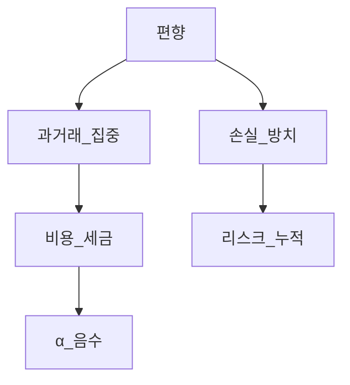
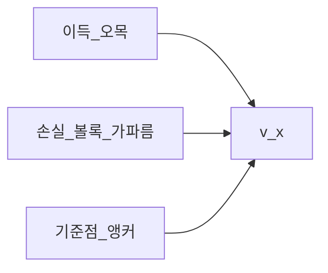
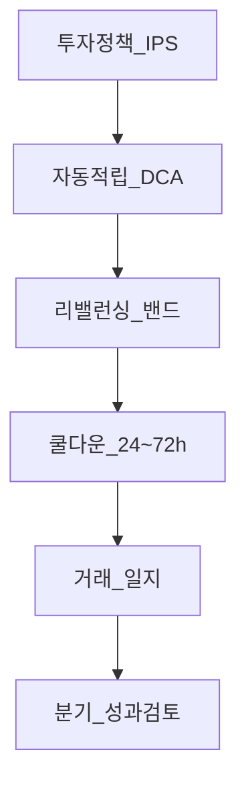
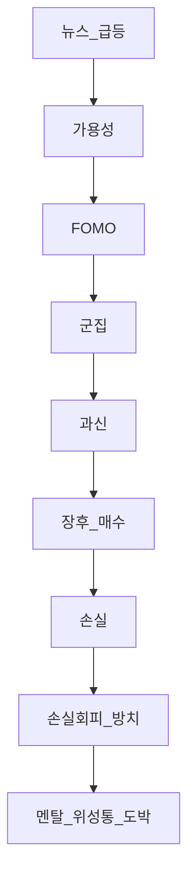

# 행동금융 완전 가이드 — 전망이론·손실회피·편향·디스포지션·디바이어싱

> **면책**: 본 문서는 교육 목적이며, 심리·투자 습관 개선을 위한 일반 정보입니다. 정신건강·중독 문제는 전문가 상담이 필요할 수 있습니다.

## 메타

| 항목 | 내용 |
|------|------|
| 최종 검증일 | 2026-05-24 |
| 정책·법령 기준일 | 2025-12-31 확정 |
| 난이도 | L4 (Graduate) — [READER-GUIDE](../docs/READER-GUIDE.md) |
| 예상 읽기 시간 | 150~180분 |
| 관련 bucket | Bucket 3~4 (코어 규율·위성 유혹) |

## 0. 이 편 읽기 전 (5분)

| 항목 | 내용 |
|------|------|
| **난이도** | L4 (Graduate) — [READER-GUIDE §L등급](../docs/READER-GUIDE.md) |
| **선수** | [passive-vs-active](../04-portfolio/passive-vs-active.md), [core-satellite-framework](../04-portfolio/core-satellite-framework.md) |
| **이번 편에서 쓰는 기호** | 본문 §4·§4a 표 참고 |
| **복습 한 줄** | L3 선수 편을 먼저 읽으면 수식이 수월함 |

## TL;DR

1. **전망이론(Prospect Theory)** 은 이득·손실을 **가치함수**로 평가하며, **손실 구간이 더 가파르다(손실회피 λ>1)**.
2. **과신**은 거래 빈도·집중·레버리지를 키우고 **α를 음수**로 만드는 경향(연구 요지).
3. **앵커링**은 첫 가격·52주 고가에 **비중**이 묶이게 한다.
4. **군집(herd)**·**FOMO**는 [fomo-and-trading-hours.md](fomo-and-trading-hours.md)와 NXT·장후 **과거래**를 부른다.
5. **멘탈 어카운팅**은 통·종목별 **상자** — 손실 통만 **방치**, 이익 통만 **조기 실현** 유발.
6. **디스포지션 효과**: 이익주 **빨리 팔고** 손실주 **오래 보유** — α·세금·리스크 모두 악화.
7. **디바이어싱 규칙**: 사전 규칙·쿨다운·벤치·자동화로 **시스템 1** 충동을 **시스템 2** 절차가 대체.

---

## 1. 한 줄 정의 + 왜 중요한가

**정의**: **행동금융(Behavioral Finance)** 은 투자자가 **완전합리·베이지안**이 아니라 **편향·감정·프레이밍**에 반응한다는 관찰과 모형을 다룬다.

!!! info "Bucket"
    시간·목적별 **자금 슬롯**(0 비상금 → 3 코어 등)

**왜 중요한가**: [portfolio-theory-mpt.md](../04-portfolio/portfolio-theory-mpt.md)·[performance-measurement.md](../04-portfolio/performance-measurement.md)는 **최적**을 계산하지만, 실제 인간은 **EF 밖**에서 거래한다. [passive-vs-active.md](../04-portfolio/passive-vs-active.md)의 **코어 패시브**는 행동 비용을 **낮추는** 제도 설계다. Bucket 4 **위성·QLD·장후 단타**는 행동 리스크 **최대** 구간 — 본 문서의 **디바이어싱 규칙**이 [core-satellite-framework.md](../04-portfolio/core-satellite-framework.md)와 맞물린다.

---

## 2. 선수 지식 / 이후 읽을 것

**선수**:
- [passive-vs-active.md](../04-portfolio/passive-vs-active.md)
- [core-satellite-framework.md](../04-portfolio/core-satellite-framework.md)
- [rebalancing-and-dca.md](../04-portfolio/rebalancing-and-dca.md)
- [fomo-and-trading-hours.md](fomo-and-trading-hours.md)

**이후**:
- [risk-management-portfolio.md](../04-portfolio/risk-management-portfolio.md)
- [leveraged-etf-qqq-qld.md](../04-portfolio/leveraged-etf-qqq-qld.md)

---

## 3. 직관·비유

**전망이론 = 같은 100만 원도 “벌었다” vs “잃었다” 느낌이 다름** — 100만 원 **벌면** 기쁨 6점, **잃으면** 슬픔 9점.

**손실회피 = 이미 물린 주식을 “본전 올 때까지”** — 논리는 “더 나쁠 수 있음”인데 **고통 회피**가 이긴다.

**과신 = 운전 90%가 자신은 평균 이상** — 투자도 **α를 낸다**고 믿고 **거래**한다.

**앵커링 = 첫 태그 가격이 “싸다/비싸다” 기준** — 52주 **고점**이 앵커면 **조정장**이 “할인”처럼 느껴진다.

**군집 = 모두가 사는 종목이 안전해 보임** — [semiconductor](../03-markets/sectors/semiconductor.md) **군중** 구간.

**멘탈 어카운팅 = 지갑을 용도별로 나눔** — “위성 통” 손실은 **숨기고**, “여행 통” 이익은 **쓴다**.

**디스포지션 = 이익난 주식은 선물·손실 주식은 냉장고** — 세금·리밸런싱과 **정반대**인 경우 많음.

---

## 4. 정식 개념·용어

| 용어 | English | 정의 |
|------|---------|------|
| 전망이론 | Prospect theory | 가치함수·확률가중 |
| 손실회피 | Loss aversion | 손실 가중 > 이득 |
| 과신 | Overconfidence | 능력·통제 과대평가 |
| 앵커링 | Anchoring | 최초 정보 고착 |
| 군집 | Herding | 타인 행동 모방 |
| FOMO | Fear of missing out | 상승 놓침 공포 |
| 멘탈 어카운팅 | Mental accounting | 심리적 계정 분리 |
| 디스포지션 효과 | Disposition effect | 이익 실현·손실 지연 |
| 확증편향 | Confirmation bias | 맞는 정보만 수집 |
| 가용성 | Availability | 최근·생생한 사건 과대 |
| 프레이밍 | Framing | 표현 방식이 선택 변경 |
| 시스템 1/2 | System 1/2 | 빠른 직관 vs 느린 분석 |
| 디바이어싱 | Debiasing | 편향 완화 절차 |

## 4a. 핵심 용어 (본문 등장 순)

| 용어 | 한 줄 | 관련 이론 | glossary |
|------|-------|-----------|----------|
| 행동금융 | 투자자가 편향·감정에 반응한다는 관찰 | Behavioral finance | — |
| 전망이론 | 이득·손실을 비대칭 가치함수로 평가 | Kahneman-Tversky | — |
| 손실회피 | 손실 구간 가중이 이득보다 큼(λ>1) | Prospect theory | — |
| 과신 | 능력·α·거래 빈도 과대 | Overconfidence | — |
| 앵커링 | 첫 가격·52주 고가에 비중 고착 | Heuristics | — |
| 군집·FOMO | 타인 매수·상승 놓침 공포 | Herding | [FOMO](fomo-and-trading-hours.md) |
| 멘탈 어카운팅 | 통·종목별 심리적 계정 분리 | Thaler | — |
| 디스포지션 효과 | 이익 조기 실현·손실 장기 보유 | Shefrin-Statman | — |
| 확증·가용성 | 맞는 정보만·최근 사건 과대 | Cognitive bias | — |
| 프레이밍 | 표현 방식이 선택을 바꿈 | Framing | — |
| 시스템 1/2 | 빠른 직관 vs 느린 분석 | Dual process | — |
| 디바이어싱 | 규칙·쿨다운·자동화로 충동 완화 | Choice architecture | — |

## 4b. 관련 이론 미니맵

- **[MPT](../04-portfolio/portfolio-theory-mpt.md)** — 이론적 최적 vs 실제 거래의 간극
- **[패시브 vs 액티브](../04-portfolio/passive-vs-active.md)** — 행동 비용을 낮추는 코어 설계
- **[코어-위성](../04-portfolio/core-satellite-framework.md)** — 위성·QLD가 편향 최대 구간
- **[리밸런싱·DCA](../04-portfolio/rebalancing-and-dca.md)** — 규칙 기반 디바이어싱
- **[시장 효율성](../08-advanced/market-efficiency-emh.md)** — 편향이 남는 이유·한계

---

## 5. 메커니즘

### 5.1 편향 → 거래 → 성과

### 5.2 전망이론 가치함수 (개념)

### 5.3 디바이어싱 규칙 스택

---

## 6. 수식·모델 (교육)

### 6.1 전망이론 가치함수 (Kahneman-Tversky 스케치)

| 기호 | 이름 | 이 식에서 의미 |
|------|------|----------------|
| \(v\) | v | §4·본문 정의 참고 |
| \(x\) | x | §4·본문 정의 참고 |
| \(begin\) | begin | §4·본문 정의 참고 |
| \(cases\) | cases | §4·본문 정의 참고 |
| \(alpha\) | alpha | §4·본문 정의 참고 |
| \(ge\) | ge | §4·본문 정의 참고 |
| \(lambda\) | lambda | §4·본문 정의 참고 |
| \(beta\) | beta | §4·본문 정의 참고 |

\[
v(x) = \begin{cases}
x^\alpha & x \ge 0 \\
-\lambda (-x)^\beta & x < 0
\end{cases}
\]

**α, β < 1** → **민감도 체감**. **λ > 1** (통상 2~2.5) → **손실회피**.

**기준점**: 매입가·최근 고점 — **프레이밍**에 따라 “이익/손실” 전환.

### 6.2 확률가중 (한 줄)

소확률 **과대**, 고확률 **과소** — **로또·밈주**·**꼬리** 매력.

### 6.3 디스포지션과 기대

**합리**: \(E[미래 수익]\) 만 본다. **행동**: \(v(실현손익)\) 극대화 → **이익 실현**이 **즉각 쾌감**.

**세금**: 한국 **국내주** 장기 분리과세 등 — [domestic-stocks-tax.md](../06-korea-policy/tax/domestic-stocks-tax.md). **해외**는 **실현** 시 과세 — 디스포지션과 **충돌** 가능.

### 6.4 과신과 거래

**Barber-Odean** (연구 요지): 거래 많은 그룹 **수익 열위** — **비용+과신**.

\[
\text{실현 수익} \approx \text{총수익} - \text{거래비용} - \text{타이밍 손실}
\]

---

## 7. 한국 적용

### 7.1 제도·인프라가 부르는 편향

| 요소 | 편향 | 대응 |
|------|------|------|
| NXT·장후 | FOMO·가용성 | [fomo-and-trading-hours.md](fomo-and-trading-hours.md) |
| 코스닥 급등 | 군집·과신 | Bucket 4 **캡** |
| ISA 비과세 한도 | 멘탈 “이 통만” | **통합** 성과 뷰 |
| 커뮤니티·텔레그램 | 확증·군집 | **정보 다이어트** |
| QLD·레버리지 | 과신·손실회피 | [leveraged-etf-qqq-qld.md](../04-portfolio/leveraged-etf-qqq-qld.md) |

### 7.2 2025 vs 2026

ISA·청년·연금 확대 → **“더 넣으면 된다”** 프레이밍 — **Bucket 0~2** 선행 — [time-horizon-and-buckets.md](../04-portfolio/time-horizon-and-buckets.md).

### 7.3 DB 가입자

DB는 **행동 통제 불가** — **ISA 코어 자동화**로 **대체 통제**.

### 7.4 문화·언어

“**물타기**” “**존버**” — 손실회피·확증 **언어화**. **규칙**: 물타기 **금지** 또는 **사전 한도**.

---

## 8. 가상 숫자 예제

### 예제 1 — 손실회피 vs 합리

가상 A: 매입 10만, 현재 7만, \(E[미래]=\) 중립 → **합리**: 보유·매도는 **전망**만. **행동**: “본전까지” **보유** → 포트 **비중 초과**.

### 예제 2 — 디스포지션

두 종목: B +20%, C −25%. **행동**: B 매도(세금·기회비용), C 보유 → **IR** 악화.

### 예제 3 — 앵커링

52주 고점 10만, 현재 8만 — “20% 할인” **프레임** vs **펀더멘털** 프레임.

### 예제 4 — 과신·거래비용

연간 회전 200%, 비용 0.3%/편 → **0.6%×200%** 규모 **마찰** (교육 근사) — **벤치 대비 α** 잠식.

### 예제 5 — 멘탈 어카운팅

ISA 코어 +20%, 위성 −40% — **전체**는 +5%인데 위성만 보며 **공격적 매수** (손실 통 **도박**).

---

## 9. 편향별 디바이어싱 규칙 (투자자용)

### 9.1 전망이론·손실회피

| 규칙 | 내용 |
|------|------|
| R-1 | **매입가 무시** — “오늘 새로 산다면 사겠는가?” |
| R-2 | **손절·리밸런싱 밴드** 사전 기록 — [risk-management-portfolio.md](../04-portfolio/risk-management-portfolio.md) |
| R-3 | **부분 실현 금지** 원칙 또는 **전량 규칙** — 혼합 금지 |

### 9.2 과신

| 규칙 | 내용 |
|------|------|
| R-4 | 연간 **거래 횟수 상한** |
| R-5 | “**3년 α** 없으면 액티브 중단” — [performance-measurement.md](../04-portfolio/performance-measurement.md) |
| R-6 | **일지**: 매수 **3줄 논리** — 감정 단어 금지 |

### 9.3 앵커링

| 규칙 | 내용 |
|------|------|
| R-7 | **52주 고점·애널 목표가** 의사결정 금지 목록 |
| R-8 | **밸류**는 현금흐름·[financial-statements-intro.md](../01-foundations/financial-statements-intro.md) 체크리스트 |

### 9.4 군집·FOMO

| 규칙 | 내용 |
|------|------|
| R-9 | **48시간 쿨다운** (Bucket 4 신규) |
| R-10 | “**내 IPS에 없는 종목**” 매수 금지 |
| R-11 | 장후·NXT — [fomo-and-trading-hours.md](fomo-and-trading-hours.md) |

### 9.5 멘탈 어카운팅

| 규칙 | 내용 |
|------|------|
| R-12 | **전 계좌 통합** 대시보드 (가상 금액) |
| R-13 | Bucket **라벨**은 회계용 — **의사결정은 전체** |

### 9.6 디스포지션

| 규칙 | 내용 |
|------|------|
| R-14 | **리밸런싱 = 이익·손실 무관** 비중 조정 |
| R-15 | 세금은 **최적화**이지 **손실 방치** 이유 아님 — 세무 문서 참조 |
| R-16 | **위성 손실** — 규칙 매도 후 **쿨다운 90일** |

### 9.7 시스템·환경

| 규칙 | 내용 |
|------|------|
| R-17 | **자동 DCA** — [rebalancing-and-dca.md](../04-portfolio/rebalancing-and-dca.md) |
| R-18 | 뉴스·커뮤니티 **시간 박스** |
| R-19 | **분기 1회**만 성과·벤치 검토 |
| R-20 | 파트너·동료 **사전 합의** 규칙 1장 |

---

## 10. FAQ (8+)

**Q1. 편향을 없앨 수 있나?**  
**완전 제거 불가** — **절차**로 **비용** 감소.

**Q2. 손실회피가 항상 나쁜가?**  
**생존**에 유리할 수 있으나 **손실주 방치**는 악화.

**Q3. 패시브면 행동금융 끝?**  
**리밸런싱·위성·현금** 유혹 **잔존**.

**Q4. ISA가 멘탈 어카운팅?**  
**도구** — 통합 뷰 **필수**.

**Q5. 디스포지션과 세금?**  
이익 **조기 실현**이 세금↑ — **장기** 설계와 **충돌** 점검.

**Q6. AI 추천은 디바이어싱?**  
**확증** 증폭 가능 — **규칙** 우선.

**Q7. QLD 손실 후 물타기?**  
**R-3·R-16** — [leveraged-etf-qqq-qld.md](../04-portfolio/leveraged-etf-qqq-qld.md).

**Q8. 군집이 항상 틀림?**  
**정보** 집약도 있으나 **가격** 과열 시 **위험**.

**Q9. 행동 vs MPT?**  
MPT **규범**, 행동 **실증** — **IPS** 가 브릿지.

**Q10. 전문가도 편향?**  
**예** — 규율·팀·규정.

---

## 11. 함정·리스크

| 함정 | 대응 |
|------|------|
| 규칙만 세고 안 지킴 | **자동화** |
| 쿨다운 후 FOMO | R-9+R-10 |
| “이번만 예외” | 일지·파트너 |
| 손실 통 도박 | R-12·R-16 |
| 지식만 축적 | **분기 실행** |

---

## 12. 심화 읽기

- Kahneman — *Thinking, Fast and Slow*  
- Thaler — *Misbehaving*  
- Shefrin — *Behavioral Corporate Finance*  
- 본 저장소: [fomo-and-trading-hours.md](fomo-and-trading-hours.md)

---

## 13. 퀴즈

1. λ=2.25일 때 +100만 이득 vs −100만 손실 **주관 가치** 비교(교육).  
2. 디스포지션이 **리밸런싱**과 충돌하는 예.  
3. R-1~R-20 중 **본인 3개** 선택·구체화.  
4. NXT 장후 **FOMO** 시나리오 쓰기.  
5. 멘탈 어카운팅을 **통합 뷰**로 바꾸는 표 설계.

---

## 부록 A — 대표 실험 (교육)

**아시아 질병 문제** — 프레이밍. **동전** — 확률가중. **커피 mug** — 손실회피·endowment.

## 부록 B — 행동 vs 효율 시장

**EMH** “가격=정보” vs **행동** “가격=편향 포함” — [passive-vs-active.md](../04-portfolio/passive-vs-active.md) **양쪽** 인정.

## 부록 C — 한국어 미디어 프레임

“**폭등**”“**급락**” — **가용성**. **대응**: 숫자·밴드만.

## 부록 D — IPS 한 페이지 템플릿 (가상)

- 목표: 20년 **실질** 자산  
- 코어: 지수 **85%**  
- 위성: **≤15%**, 종목 **≤5%**  
- 금지: QLD 추가·장후 신규  
- 리밸런싱: **±5%p** 밴드  
- 검토: **분기**

## 부록 E — 행동 일지 샘플

| 날짜 | 충동 | 편향 | 규칙 | 실행 |
|------|------|------|------|------|
| 가상 | 코스닥 매수 | FOMO | R-9 | 보류 48h |

## 부록 F — 디스포지션·세금 시나리오 (교육)

해외주 **이익 실현** vs **손실 이월** — [overseas-stocks-tax-part1-cgt.md](../06-korea-policy/tax/overseas-stocks-tax-part1-cgt.md). **세무 최적 ≠ 행동 최적** 표 작성.

## 부록 G — 군집·섹터 사이클

[semiconductor](../03-markets/sectors/semiconductor.md) **슈퍼사이클** 정점 — R-10·R-19.

## 부록 H — 학습 로드맵

**1주**: 본 문서 + [fomo-and-trading-hours.md](fomo-and-trading-hours.md) + IPS 초안 1장. **역할극**: 친구가 “지금 사야” — **규칙 인용** 대본.

## 부록 I — 신경과학 맛보기 (한 줄)

손실 시 **편도체** 활성 — **쿨다운** 생물학적 근거(과도 일반화 주의).

## 부록 J — 조직·가족 합의

배우자 **거래 알림** 공유 — **R-20** — 사적 **감시**가 아닌 **합의**.

## 부록 K — 전망이론 심화 (교육)

**가치함수** \(v(x)\) 의 **오목·볼록** 조합은 **확실성 효과**를 만든다 — **확실한 이익** 선호 vs **확실한 손실** 회피 → **보험**·**로또** 동시 존재. **투자**: “**확실한 소액 이익** 실현(디스포지션)” vs “**불확실한 대액 손실** 지연”.

**확률가중** \(π(p)\): **로또·밈주** — **극소 p** 과대. **교육**: Bucket 4 **확률 문서** — “**10배** 가능성 5%”를 **기대값**으로 환산.

## 부록 L — 편향 상호작용 맵

**차단**: R-9·R-11·R-16 **동시** — 한 규칙만으로 **부족**.

## 부록 M — 디스포지션 실험 재현 (가상)

**Odean** (연구 요지): 실현 이익 > 실현 손실 **건수·금액**. **가상 계좌** 12개월: 이익 종목 **평균 보유 4개월**, 손실 **11개월** — **IR**·**세금**·**섹터 캡** **위반** 표 작성.

## 부록 N — 앵커링·52주 고가 사례 (가상)

| 종목(가상) | 52주 고 | 현재 | 앵커 프레임 | 펀더멘털 프레임 |
|------------|---------|------|-------------|-----------------|
| X | 10만 | 7만 | 30% 할인 | PER 변화? |
| Y | 5만 | 4.8만 | “거의 고점” | 성장률? |

**R-7**: 의사결정 **금지 입력** — **체크리스트**만.

## 부록 O — 멘탈 어카운팅과 Bucket (장문)

| Bucket | 심리 통 | 행동 함정 | 규칙 |
|--------|---------|-----------|------|
| 0~2 | 생활·비상 | “투자할 돈” 착각 | 선행 충전 |
| 3 코어 | “안전한 나” | 위성 손실 무시 | R-12 통합 |
| 4 위성 | “한 방” | 도박·물타기 | R-16 |

**ISA·IRP·DC**를 **서로 다른 성격**으로 **라벨**하되 **의사결정은 순자산** — [time-horizon-and-buckets.md](../04-portfolio/time-horizon-and-buckets.md).

## 부록 P — 과신·거래비용 시뮬 (가상)

| 회전율 | 연 비용(0.3%/편) | 10년 누적(근사) |
|--------|-------------------|-----------------|
| 50% | 0.15% | 작음 |
| 200% | 0.6% | 중간 |
| 800% | 2.4% | **α 잠식** |

**NXT 장후** 단타 **800%** — [fomo-and-trading-hours.md](fomo-and-trading-hours.md) **숫자**로 **경고**.

## 부록 Q — 디바이어싱 주간 루틴 (가상)

| 요일 | 행동 |
|------|------|
| 월 | IPS **읽기 5분** |
| 화~목 | **거래 금지** (코어 DCA만) |
| 금 | 뉴스 **금지** |
| 분기 | [performance-measurement.md](../04-portfolio/performance-measurement.md) |

## 부록 R — 행동금융 vs 코어-위성·MPT (통합)

**MPT** EF 위 포트를 **목표**로 하되 **행동**이 **이탈** → **자동 DCA·밴드**가 **다시 EF 근처**로. **위성**은 EF **밖** — **별도 IR·MDD·규칙**. **실패 패턴**: 코어를 **위성처럼** 거래.

## 부록 S — 한국 미디어·커뮤니티 대응 문구 (교육)

| 유혹 문구 | 편향 | 대응 문구(가상) |
|-----------|------|-----------------|
| “지금 안 사면 늦는다” | FOMO | R-9 쿨다운 |
| “바닥 확인” | 앵커·과신 | R-7 |
| “물타기 각” | 손실회피 | R-3 금지 |
| “다들 산다” | 군집 | R-10 |

## 부록 T — 연습·역할극 시나리오 5선

1. 장후 **+8%** 종목 — **48h** 규칙 적용 서술.  
2. ISA 코어 **+15%**, 위성 **−30%** — **통합** 의사결정.  
3. 52주 고점 대비 **−25%** “할인” — **R-7·R-8**.  
4. 3개월 **α 음수** 액티브 — **R-5** 중단?  
5. 배우자 **QLD 추가** 요청 — **R-20** 대화 스크립트.

## 부록 U — 행동 일지 4주 샘플 (가상)

| 주 | 충동 | 적용 규칙 | 결과 |
|----|------|-----------|------|
| 1 | 코스닥 | R-9 | 보류 |
| 2 | 손실주 매도 회피 | R-2 | 리밸런싱 |
| 3 | 뉴스 매수 | R-18 | 미실행 |
| 4 | 분기 검토 | R-19 | 유지 |

---

**L4 완료 기준**: [TEMPLATE](../docs/TEMPLATE.md) 12블록·FAQ 8+·2026-05-24 — [DEPTH-STANDARD](../docs/DEPTH-STANDARD.md).
